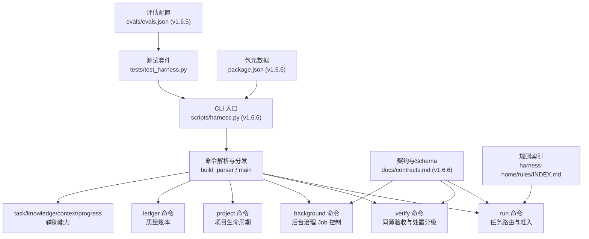
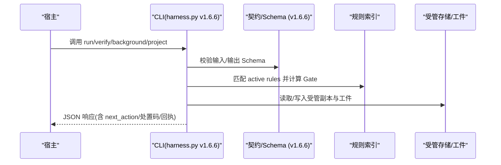
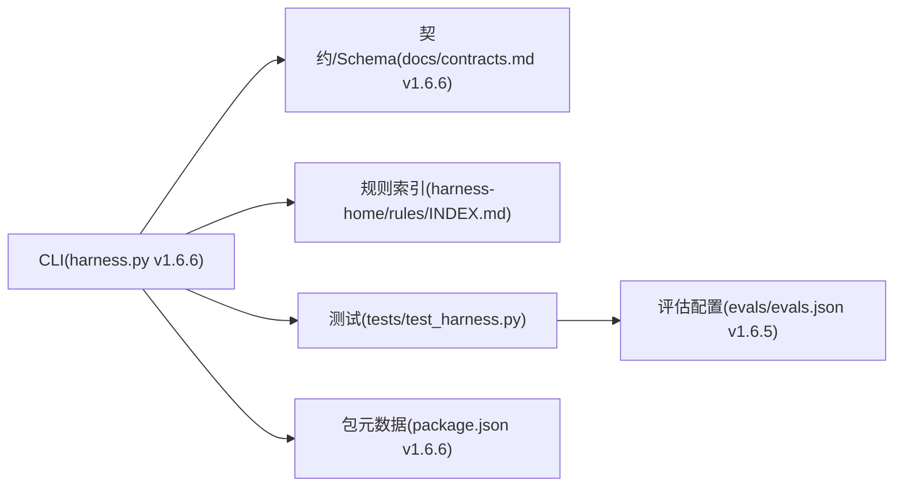

# API参考

<cite>
**本文引用的文件**   
- [scripts/harness.py](file://scripts/harness.py)
- [SKILL.md](file://SKILL.md)
- [docs/contracts.md](file://docs/contracts.md)
- [harness-home/rules/INDEX.md](file://harness-home/rules/INDEX.md)
- [package.json](file://package.json)
- [tests/test_harness.py](file://tests/test_harness.py)
- [evals/evals.json](file://evals/evals.json)
</cite>

## 更新摘要
**已完成的变更**   
- 版本从 v1.6.5 更新到 v1.6.6
- 更新了所有相关文件中的版本号引用
- 保持了完整的API功能和架构不变性

## 目录
1. [简介](#简介)
2. [项目结构](#项目结构)
3. [核心组件](#核心组件)
4. [架构总览](#架构总览)
5. [详细组件分析](#详细组件分析)
6. [依赖关系分析](#依赖关系分析)
7. [性能考量](#性能考量)
8. [故障排查指南](#故障排查指南)
9. [结论](#结论)
10. [附录](#附录)

## 简介
本参考文档面向 Docs Harness v1.6.6，系统化梳理 CLI 命令、JSON 接口、事件系统、认证与授权机制、SDK/库使用方式、版本兼容与迁移策略。内容基于仓库中的控制器脚本、合同定义、规则索引与测试用例整理而成，确保可追溯与可验证。

**更新** 版本已从 v1.6.5 升级到 v1.6.6，所有相关配置文件和文档已同步更新。

## 项目结构
Docs Harness 以独立 Python 脚本为核心，配合项目内契约文档、规则快照与测试套件构成完整控制面：
- scripts/harness.py：CLI 入口、命令解析、状态机与业务逻辑实现（v1.6.6）
- docs/contracts.md：任务包、证据、验收、Git 状态、后台治理等契约定义（v1.6.6）
- harness-home/rules/INDEX.md：激活的规则清单与加载约定
- package.json：包元数据与脚本入口（self-test），版本 1.6.6
- tests/test_harness.py：端到端与契约测试
- SKILL.md：安装、任务入口、后台治理、质量账本等使用说明（版本 1.6.6）
- evals/evals.json：评估配置，版本 1.6.5

**图表来源** 
- [scripts/harness.py:1-26](file://scripts/harness.py#L1-L26)
- [docs/contracts.md:1-7](file://docs/contracts.md#L1-L7)
- [package.json:1-3](file://package.json#L1-L3)
- [SKILL.md:1-6](file://SKILL.md#L1-L6)
- [evals/evals.json:1-3](file://evals/evals.json#L1-L3)

**章节来源**
- [scripts/harness.py:1-26](file://scripts/harness.py#L1-L26)
- [package.json:1-23](file://package.json#L1-L23)

## 核心组件
- CLI 命令集：run、verify、background、project、ledger、task、knowledge、context、progress、self-test
- 契约与 Schema：任务包 v2、证据收据 v2、完成清单 v1、Git 状态、后台 Job v2、知识相关 Schema
- 规则系统：active rules 快照与指纹校验，Gate 推断与范围绑定
- 验收流程：五级处置（provide_evidence、refresh_evidence、retry_verification、incremental_admission、full_readmission）
- 后台治理：prepare/dispatch/progress/verify/retry/prune 全链路控制

**更新** 所有组件保持向后兼容，版本升级不影响现有功能。

**章节来源**
- [scripts/harness.py:1-200](file://scripts/harness.py#L1-L200)
- [docs/contracts.md:1-200](file://docs/contracts.md#L1-L200)
- [harness-home/rules/INDEX.md:1-41](file://harness-home/rules/INDEX.md#L1-L41)

## 架构总览
Docs Harness 采用"意图优先、证据可复用、失败关闭"的控制流：
- run：编译意图、范围与 Gate，生成 completion_manifest，幂等复用活动任务
- verify：按清单逐项验收，支持命令级缓存与受管副本，返回五级处置
- background：统一后台 Job 控制器，严格状态机与工件校验
- project：项目初始化、升级、回滚检查等生命周期管理

**图表来源** 
- [scripts/harness.py:1-200](file://scripts/harness.py#L1-L200)
- [docs/contracts.md:1-200](file://docs/contracts.md#L1-L200)
- [harness-home/rules/INDEX.md:1-41](file://harness-home/rules/INDEX.md#L1-L41)

## 详细组件分析

### CLI 命令规格

#### 通用参数
- --target：目标项目路径（默认 .）
- --json：输出 JSON

**章节来源**
- [scripts/harness.py:10155-10158](file://scripts/harness.py#L10155-L10158)

#### run（任务路由与准入）
- 作用：任务意图编译、范围绑定、Gate 评估、completion_manifest 生成、活动任务幂等复用
- 关键参数：
  - --task：原始用户任务文本
  - --task-id：继续已有任务或重新准入
  - --new-task：强制新建任务
  - --facts：结构化事实文件（包含 gate_assessment）
  - --plan：正式方案（Markdown/JSON）
  - --authorization：授权文件
  - --scope/--feature/--action/--success：范围、功能、动作、成功标准
- 返回值要点：
  - 状态机：blocked/needs_plan/needs_authorization/ready_direct/ready_planned/ready_extended
  - completion_manifest：必需证据类型、收据、条件项、阻断项、交付层要求
  - 幂等：相同 target+任务文本+事实+工作区快照复用活动任务

**章节来源**
- [scripts/harness.py:10165-10193](file://scripts/harness.py#L10165-L10193)
- [docs/contracts.md:9-80](file://docs/contracts.md#L9-L80)
- [SKILL.md:25-44](file://SKILL.md#L25-L44)

#### verify（同源验收与处置）
- 作用：按 completion_manifest 验收，支持命令级缓存与受管副本，返回五级处置
- 关键参数：
  - --task-id：任务编号
  - --evidence：证据文件（可重复）
- 返回值要点：
  - result=完成表示父任务完成
  - 五级处置：provide_evidence、refresh_evidence、retry_verification、incremental_admission、full_readmission
  - 自动归因：write_scope 内写入可自动生成 workspace_attribution 收据与 auto_attributed_paths

**章节来源**
- [scripts/harness.py:10214-10223](file://scripts/harness.py#L10214-L10223)
- [docs/contracts.md:153-163](file://docs/contracts.md#L153-L163)
- [SKILL.md:43-57](file://SKILL.md#L43-L57)

#### background（后台治理）
- 作用：统一后台 Job 控制器，支持 prepare/dispatch/progress/verify/retry/prune
- 关键参数：
  - --job-id：Job ID
  - --work-package-id/--work-package-status：工作包状态推进
  - --assessment：验收报告
  - --result：updated/no_change/completed_with_finding
  - --repair：修复无效工件
- 状态机：contract_ready → dispatched → running → updated/no_change/completed_with_finding/failed/cancelled
- 约束：不得直接写 job.json/plan.json/progress.json/events.jsonl；复杂路线 Plan/Progress 仅由控制面写入

**章节来源**
- [scripts/harness.py:10255-10269](file://scripts/harness.py#L10255-L10269)
- [docs/contracts.md:303-338](file://docs/contracts.md#L303-L338)
- [SKILL.md:59-89](file://SKILL.md#L59-L89)

#### project（项目生命周期）
- 作用：init/upgrade/uninstall/check/diff/rollback-check
- 关键参数：--apply、--purge-runtime
- 行为：安装最小骨架、审查与缺口处理、preserve-and-merge 合法 document_routes、回滚检查阻断在途 v2 任务

**章节来源**
- [scripts/harness.py:10271-10276](file://scripts/harness.py#L10271-L10276)
- [SKILL.md:13-24](file://SKILL.md#L13-L24)

#### ledger（质量账本）
- 作用：人工触发记录与读取个人本地质量账本
- 关键参数：--task-id、--review、--query、--limit
- 约束：不得自动记录或在任务结束后主动询问；读取按任务编号或关键词

**章节来源**
- [scripts/harness.py:10234-10244](file://scripts/harness.py#L10234-L10244)
- [SKILL.md:91-99](file://SKILL.md#L91-L99)

#### task/knowledge/context/progress/self-test
- task：status/migrate/cancel/archive/list/prune
- knowledge：status/estimate/audit/bootstrap/update/verify/job-status/dispatch/retry
- context：按阶段加载上下文并写回执
- progress：推进 extended 工作包状态
- self-test：内置合同自检

**章节来源**
- [scripts/harness.py:10224-10279](file://scripts/harness.py#L10224-L10279)

### JSON 接口规范

#### 请求体与参数
- 所有命令通过命令行参数传递，--facts/--plan/--authorization/--evidence/--review 等为外部文件路径
- 结构化输入遵循对应 Schema 校验、编码、大小限制与任务绑定校验

**章节来源**
- [scripts/harness.py:10165-10279](file://scripts/harness.py#L10165-L10279)
- [docs/contracts.md:233-240](file://docs/contracts.md#L233-L240)

#### 响应格式
- 所有命令输出 JSON（--json），包含 status/code/message/next_action/result 等字段
- error 响应：{"status":"error","code":"...","message":"..."}

**章节来源**
- [scripts/harness.py:10282-10288](file://scripts/harness.py#L10282-L10288)
- [scripts/harness.py:10353-10355](file://scripts/harness.py#L10353-L10355)

#### 错误码与处置分类
- 常见原因码：source_not_verified、local_runtime_not_verified、ui_not_verified、release_artifact_not_verified、remote_delivery_not_verified、fresh_clone_not_verified、external_state_not_verified
- 处置分类：provide_evidence、refresh_evidence、retry_verification、incremental_admission、full_readmission

**章节来源**
- [scripts/harness.py:126-175](file://scripts/harness.py#L126-L175)
- [docs/contracts.md:153-163](file://docs/contracts.md#L153-L163)

### 事件系统与消息格式

#### 事件类型
- verification_attempt：每次 verify 入口写入，包含 outcome_class、reason_codes、package_revision、统计计数等
- 其他事件：auto_attribution、workspace_attribution 等（由控制器代铸）

**章节来源**
- [docs/plans/v1.6.4-minimal-systemic-flow-efficiency-plan.md:373-391](file://docs/plans/v1.6.4-minimal-systemic-flow-efficiency-plan.md#L373-L391)
- [SKILL.md:55-56](file://SKILL.md#L55-L56)

#### 传输协议
- CLI 通过 stdout 输出 JSON；错误通过 stderr 与 exit code 表达
- 无网络协议；所有交互为本地进程间通信

**章节来源**
- [scripts/harness.py:10282-10288](file://scripts/harness.py#L10282-L10288)
- [tests/test_harness.py:59-71](file://tests/test_harness.py#L59-L71)

### SDK/库使用指南

#### 安装与运行
- 通过 Python 直接执行 scripts/harness.py
- 使用 package.json 的 self-test 脚本进行自检

**章节来源**
- [package.json:17-21](file://package.json#L17-L21)
- [SKILL.md:13-24](file://SKILL.md#L13-L24)

#### 配置与调用示例
- 基本调用：python3 scripts/harness.py run --target . --task "<任务>" --json
- 验收调用：python3 scripts/harness.py verify --target . --task-id <task-id> --evidence <evidence.json> --json
- 后台调用：python3 scripts/harness.py background prepare --target . --job-id <job-id> --json

**章节来源**
- [SKILL.md:25-44](file://SKILL.md#L25-L44)
- [SKILL.md:43-57](file://SKILL.md#L43-L57)
- [SKILL.md:71-81](file://SKILL.md#L71-L81)

### 认证与授权机制

#### 访问控制与权限验证
- 授权收据：docs-harness/authorization-receipt/v2，绑定 package fingerprint 与 authorization_contract_fingerprint
- Adoption：当 package revision 变化但授权合同完全相同时，可生成 authorization-adoption/v1 继承原授权
- 变更禁止：授权动作、范围、Git scope、外部目标或有效期变化时禁止继承

**章节来源**
- [docs/plans/v1.6.4-minimal-systemic-flow-efficiency-plan.md:247-251](file://docs/plans/v1.6.4-minimal-systemic-flow-efficiency-plan.md#L247-L251)

#### 安全最佳实践
- 高风险证据必须来自可信 v2 生产者
- 验证命令白名单 produces 仅允许声明的证据类型
- 临时副产物容忍列表与 volatile_write_set 隔离
- 规则指纹漂移与 active rules 完整性校验

**章节来源**
- [docs/contracts.md:165-200](file://docs/contracts.md#L165-L200)
- [harness-home/rules/INDEX.md:34-41](file://harness-home/rules/INDEX.md#L34-L41)

### 代码示例与使用场景

#### 任务准入与幂等复用
- 同一 target+任务文本+事实+工作区快照命中活动任务时返回 active_task_reused
- --new-task 强制新建独立任务

**章节来源**
- [docs/contracts.md:48-49](file://docs/contracts.md#L48-L49)

#### 验收与补证流程
- provide_evidence：未归因写入在 write_scope 内，可补 workspace_attribution 收据
- refresh_evidence：read-set 漂移，只失效引用该路径的证据
- retry_verification：命令失败或可重试 Git/网络检查
- incremental_admission：普通新增 Gate，合同不变
- full_readmission：越界写入、高风险 Gate、规则变化、授权合同变化、远端目标/ref 漂移

**章节来源**
- [docs/contracts.md:153-163](file://docs/contracts.md#L153-L163)

#### 后台治理状态机
- contract_ready → dispatched → running → updated/no_change/completed_with_finding/failed/cancelled
- prepare 确定性生成 revision 2 Plan/Progress，重复调用返回 already_prepared

**章节来源**
- [docs/contracts.md:332-338](file://docs/contracts.md#L332-L338)

### 依赖关系分析

**图表来源** 
- [scripts/harness.py:1-26](file://scripts/harness.py#L1-L26)
- [docs/contracts.md:1-7](file://docs/contracts.md#L1-L7)
- [package.json:1-3](file://package.json#L1-L3)
- [evals/evals.json:1-3](file://evals/evals.json#L1-L3)

**章节来源**
- [scripts/harness.py:1-200](file://scripts/harness.py#L1-L200)

## 性能考量
- 验证命令逐项快照与收据复用，避免重复执行昂贵命令
- 受管 artifact store 使计划、授权、证据不依赖调用者临时文件持续存在
- 内容寻址上下文跨阶段复用，减少重复加载
- 五级处置降低不必要的完整重新准入

[本节为通用指导，无需特定文件来源]

## 故障排查指南
- 常见错误：missing_work_package、missing_evidence、invalid_scope_description、prepare_background_goal
- 处置建议：根据 reason_code 选择补证、重读、重试或重新准入
- 日志与事件：verification_attempt 事件记录每次验证实例与统计

**章节来源**
- [scripts/harness.py:10331-10335](file://scripts/harness.py#L10331-L10335)
- [docs/plans/v1.6.4-minimal-systemic-flow-efficiency-plan.md:373-391](file://docs/plans/v1.6.4-minimal-systemic-flow-efficiency-plan.md#L373-L391)

## 结论
Docs Harness v1.6.6 提供完整的 CLI 控制面、严格的契约与规则系统、高效的验收流程与后台治理能力。通过受管副本、内容寻址与五级处置，显著降低重复操作成本并提升安全性与可审计性。

**更新** 版本升级到 v1.6.6 保持了所有现有功能的向后兼容性，同时提供了更稳定的版本标识和配置管理。

[本节为总结，无需特定文件来源]

## 附录

### 版本兼容与迁移指南
- v1 在途任务仅允许 task status 读取，需显式 task migrate --apply 后重新准入
- background 别名 knowledge job-status|dispatch|verify|retry 保留兼容，但不允许跳过必要步骤
- project upgrade preserve-and-merge 合法 document_routes，非法或缺失返回 needs_manual_migration

**更新** v1.6.6 版本完全向后兼容 v1.6.4 和 v1.6.5 的功能，无需特殊迁移步骤。

**章节来源**
- [SKILL.md:57-58](file://SKILL.md#L57-L58)
- [docs/contracts.md:334-335](file://docs/contracts.md#L334-L335)

### 版本历史
- **v1.6.6**：当前版本，保持功能稳定性，更新版本标识
- **v1.6.5**：评估配置版本，功能特性稳定
- **v1.6.4**：最小系统性流程效率优化方案实施版本

**章节来源**
- [package.json:3](file://package.json#L3)
- [scripts/harness.py:26](file://scripts/harness.py#L26)
- [docs/contracts.md:1](file://docs/contracts.md#L1)
- [SKILL.md:5](file://SKILL.md#L5)
- [evals/evals.json:3](file://evals/evals.json#L3)