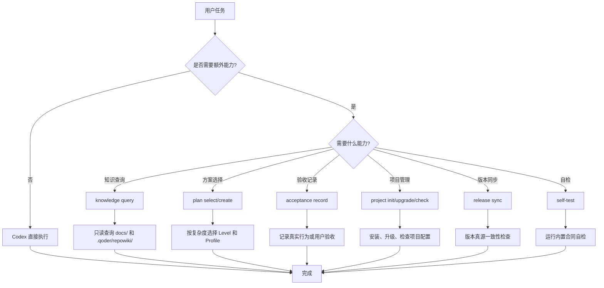

# CLI命令参考

<cite>
**本文引用的文件**   
- [scripts/harness.py](file://scripts/harness.py)
- [package.json](file://package.json)
- [README.md](file://README.md)
- [docs/contracts.md](file://docs/contracts.md)
- [tests/test_v2_direct.py](file://tests/test_v2_direct.py)
</cite>

## 更新摘要
**已进行的更改**   
- **重大架构变更**：从 v1.x 的任务控制流程完全迁移到 v2.0.0 的直接执行模式
- **移除的命令**：删除了 run、context、progress、verify、task、background、authorization 等所有任务控制相关命令
- **新增的命令**：引入 knowledge query、plan select/create、acceptance record、project、release、self-test 等按需能力
- **设计哲学转变**：从强制任务流程转变为默认直接执行，仅在确实能增加价值时提供独立能力
- **版本升级**：从 v1.7.6 升级到 v2.0.0，支持单向迁移

## 目录
1. [简介](#简介)
2. [架构总览](#架构总览)
3. [核心命令参考](#核心命令参考)
4. [项目生命周期管理](#项目生命周期管理)
5. [版本同步与发布](#版本同步与发布)
6. [自检与验证](#自检与验证)
7. [故障排除指南](#故障排除指南)
8. [JSON输出格式](#json输出格式)
9. [结论](#结论)

## 简介

Docs Harness 2.0.0 代表了产品设计的根本性转变：**Codex 默认直接工作，Harness 只在确实能增加价值时提供一项独立能力**。

### 设计理念对比

**v1.x 模式（已移除）**：
- 强制任务准入、Gate、上下文、Plan、Evidence、Verify 和 Readmission 循环
- 大量项目管理工作进入模型上下文
- 用户任务更慢，注意力被分散

**v2.0.0 模式（当前）**：
- 普通任务由 Codex 直接理解和执行
- 需要时单独查询知识或生成方案
- 运行最小真实验收
- 自动不了的部分交给用户验收

### 三项按需能力

| 能力 | 何时使用 | 不做什么 |
|---|---|---|
| `knowledge query` | 缺少项目事实会改变目标、范围、方案或验收 | 不自动注入、不全量加载、不自动维护知识 |
| `plan select/create` | 复杂、跨模块、高风险或用户明确要求方案 | 不要求简单任务填表，不拼接多份完整模板 |
| `acceptance record` | 已经执行真实测试、运行、构建、安装或用户验收 | 不用合同检查代替功能正确性 |

**章节来源**
- [README.md:1-31](file://README.md#L1-L31)
- [docs/contracts.md:1-18](file://docs/contracts.md#L1-L18)

## 架构总览



**图表来源**
- [scripts/harness.py:2040-2103](file://scripts/harness.py#L2040-L2103)
- [scripts/harness.py:2121-2150](file://scripts/harness.py#L2121-L2150)

## 核心命令参考

### knowledge query 命令

用途：按需、只读查询项目知识，当缺少的项目事实会改变目标、范围、方案或验收时使用。

语法
```bash
python3 scripts/harness.py knowledge query --target <项目> \
  --query "<具体查询>" \
  [--scope <路径模式>] \
  [--limit <数量>] \
  [--max-chars <字符数>] \
  --json
```

参数
- `--query`：必填，具体缺失事实的查询字符串
- `--scope`：可选，项目内范围过滤模式
- `--limit`：1-10 条结果，默认 5
- `--max-chars`：500-12000 字符预算，默认 6000
- `--target`：目标项目根目录，默认当前目录
- `--json`：以 JSON 形式输出结构化响应

行为要点
- **只读操作**：不写知识正文、运行状态或长期记忆
- **智能筛选**：默认排除 `docs/plans/`、`docs/reviews/` 和 `docs/history/`
- **大小限制**：跳过超过 512KB 的文件
- **安全边界**：不跟随外部符号链接
- **Token 分析**：中英文混合查询，中文词自动分词

示例
```bash
# 基础查询
python3 scripts/harness.py knowledge query --target . \
  --query "语音退出流程由哪些模块负责" --json

# 限定范围
python3 scripts/harness.py knowledge query --target . \
  --query "API 接口定义" --scope "src/api/*.py" --limit 3 --json

# 控制输出大小
python3 scripts/harness.py knowledge query --target . \
  --query "数据库连接配置" --max-chars 2000 --json
```

返回值
```json
{
  "mode": "knowledge_assist",
  "facts": [{"text": "...", "ref": "path:line"}],
  "refs": ["path:line"],
  "constraints": [],
  "conflicts": [],
  "conflict_check": "not_evaluated_against_runtime",
  "omitted": {"count": 0, "reason": null},
  "source_priority": "current_source_and_runtime_remain_authoritative"
}
```

**章节来源**
- [scripts/harness.py:439-506](file://scripts/harness.py#L439-L506)
- [docs/contracts.md:19-49](file://docs/contracts.md#L19-L49)

### plan select 命令

用途：按复杂度和修改面选择方案模板，为复杂任务生成结构化的方案选择。

语法
```bash
python3 scripts/harness.py plan select --target <项目> \
  [--level none|brief|full] \
  [--profile general|frontend_ui|backend_service|bugfix|architecture|migration_release] \
  [--secondary-profile <profile>] \
  [--complexity simple|moderate|complex] \
  [--surface <surface>] \
  [--cross-module] \
  [--high-risk] \
  [--user-requested-plan] \
  --json
```

参数
- `--level`：方案深度，none/brief/full，自动推断或显式指定
- `--profile`：主领域 Profile，默认 general
- `--secondary-profile`：次级 Profile，最多两个，仅适用于 full 方案
- `--complexity`：任务复杂度，simple/moderate/complex，影响自动选择
- `--surface`：表面类型，用于推断 profile，默认 general
- `--cross-module`：标记跨模块任务
- `--high-risk`：标记高风险任务
- `--user-requested-plan`：用户明确要求方案

自动选择逻辑
- `none`：简单直接执行
- `brief`：中等复杂度任务
- `full`：复杂、跨模块、高风险或用户明确要求

示例
```bash
# 自动选择
python3 scripts/harness.py plan select --target . \
  --complexity complex --surface frontend_ui --json

# 显式指定
python3 scripts/harness.py plan select --target . \
  --level full --profile architecture --cross-module --high-risk --json

# 用户明确要求
python3 scripts/harness.py plan select --target . \
  --user-requested-plan --level brief --json
```

返回值
```json
{
  "schema_version": "docs-harness/plan-selection/v2",
  "plan_level": "full",
  "plan_profile": "architecture",
  "secondary_profiles": ["backend_service"],
  "reason": "effect_requires_full; cross_module; high_risk",
  "template_versions": ["level/full@2.0.0", "profile/architecture@2.0.0"],
  "fields": [...],
  "selection_fingerprint": "sha256:..."
}
```

**章节来源**
- [scripts/harness.py:526-590](file://scripts/harness.py#L526-L590)
- [README.md:45-73](file://README.md#L45-L73)

### plan create 命令

用途：冻结方案，将选择结果和内容转换为可执行的方案文件。

语法
```bash
python3 scripts/harness.py plan create --target <项目> \
  --selection <选择文件> \
  --content <内容文件> \
  --output <输出文件> \
  --json
```

参数
- `--selection`：必填，方案选择 JSON 文件路径
- `--content`：必填，方案内容 JSON 文件路径
- `--output`：必填，输出的方案文件路径

行为要点
- **严格验证**：只接受未篡改的选择文件和注册字段
- **防重复**：如果输出文件已存在且内容相同则复用
- **内容投影**：只包含 execution_projection 中的关键字段
- **指纹保护**：生成 plan_fingerprint 防止篡改

示例
```bash
# 创建方案
python3 scripts/harness.py plan create --target . \
  --selection selection.json \
  --content content.json \
  --output docs/plans/task.json --json

# 更新现有方案
python3 scripts/harness.py plan create --target . \
  --selection selection.json \
  --content updated_content.json \
  --output docs/plans/task.json --json
```

返回值
```json
{
  "status": "frozen",
  "plan_ref": "docs/plans/task.json",
  "plan_fingerprint": "sha256:...",
  "execution_projection": {
    "objective": "...",
    "steps": [...],
    "acceptance": [...],
    "success_criteria": [...]
  }
}
```

**章节来源**
- [scripts/harness.py:625-696](file://scripts/harness.py#L625-L696)
- [docs/contracts.md:66-74](file://docs/contracts.md#L66-L74)

### acceptance record 命令

用途：记录真实的行为或用户验收层级，登记已经发生的验收。

语法
```bash
python3 scripts/harness.py acceptance record --target <项目> \
  --input <输入文件> \
  --json
```

参数
- `--input`：必填，验收输入 JSON 文件路径

验收类型
- `contract_check`：范围、格式和记录一致性（L1）
- `behavior_acceptance`：测试、接口、应用、服务、构建、包或安装的直接行为证据（L2-L4）
- `user_acceptance`：主观体验、权限、硬件和最终结果（L5）

验收层级
| 层级 | 含义 | 能证明什么 |
|---|---|---|
| L1 | 源码、类型、编译或静态合同一致 | 代码结构正确 |
| L2 | 聚焦行为成立 | 特定功能正常工作 |
| L3 | 本地应用或服务真实流程成立 | 端到端流程可用 |
| L4 | 构建、包或安装产物成立 | 部署产物正确 |
| L5 | 用户可见、权限、硬件或主观体验成立 | 用户体验满意 |

行为要点
- **不自动执行**：只登记已经发生的验收，不自动执行测试
- **层级约束**：不同层级有不同要求和限制
- **证据要求**：通过必须提供实际方法和项目内已存在的证据文件
- **用户确认**：不接受 `user_acceptance + passed` 的自我声明

示例
```bash
# 记录行为验收
python3 scripts/harness.py acceptance record --target . \
  --input behavior_acceptance.json --json

# 记录合同检查
python3 scripts/harness.py acceptance record --target . \
  --input contract_check.json --json

# 用户验收交接
python3 scripts/harness.py acceptance record --target . \
  --input user_acceptance_pending.json --json
```

**章节来源**
- [scripts/harness.py:705-800](file://scripts/harness.py#L705-L800)
- [docs/contracts.md:76-99](file://docs/contracts.md#L76-L99)

## 项目生命周期管理

### project init 命令

用途：新项目初始化，安装 Docs Harness 2.0.0 的最小依赖。

语法
```bash
python3 scripts/harness.py project init --target <项目> \
  [--apply] \
  --json
```

行为要点
- **安全检查**：拒绝外部符号链接和冲突的安装
- **最小安装**：只安装必要的文件，不创建项目知识正文
- **受管区块**：添加 AGENTS.md 和 CLAUDE.md 的受管区块
- **版本化模板**：安装版本化的 plan-templates/
- **配置生成**：创建 .docs-harness/config.json

示例
```bash
# 预览安装
python3 scripts/harness.py project init --target . --json

# 执行安装
python3 scripts/harness.py project init --target . --apply --json
```

**章节来源**
- [scripts/harness.py:1602-1650](file://scripts/harness.py#L1602-L1650)

### project upgrade 命令

用途：从 pre-2.0 项目单向升级到 2.0.0。

语法
```bash
python3 scripts/harness.py project upgrade --target <项目> \
  [--apply] \
  [--purge-runtime] \
  --json
```

行为要点
- **单向迁移**：不可回滚，清理旧工件
- **预览模式**：默认只读预览，需要 --apply 才执行
- **保留策略**：保留项目文档、质量账本、已修改或归属不明文件
- **清理规则**：清理指纹归属明确的旧规则、知识地图、受管区块和 Runtime

示例
```bash
# 预览升级
python3 scripts/harness.py project upgrade --target . --json

# 执行升级
python3 scripts/harness.py project upgrade --target . --apply --json
```

**章节来源**
- [scripts/harness.py:1602-1650](file://scripts/harness.py#L1602-L1650)

### project check 和 diff 命令

用途：检查项目配置状态和差异。

语法
```bash
python3 scripts/harness.py project check --target <项目> --json
python3 scripts/harness.py project diff --target <项目> --json
```

返回值
- `check`：返回项目配置状态和发现的问题
- `diff`：返回与期望状态的差异列表

**章节来源**
- [tests/test_v2_direct.py:351-372](file://tests/test_v2_direct.py#L351-L372)

## 版本同步与发布

### release sync 命令

用途：版本真源一致性检查和同步。

语法
```bash
python3 scripts/harness.py release sync --target <项目> \
  [--apply] \
  [--target-version <版本>] \
  --json
```

参数
- `--apply`：原子写入版本真源
- `--target-version`：显式确认目标版本

行为要点
- **四源检查**：VERSION、package.json、SKILL.md、控制器 VERSION
- **原子写入**：任一失败整体回滚
- **版本冲突**：--target-version 与控制器不一致时失败
- **CHANGELOG 提示**：检查模式下提示 CHANGELOG 顶部版本号

示例
```bash
# 检查版本一致性
python3 scripts/harness.py release sync --target . --json

# 同步版本
python3 scripts/harness.py release sync --target . --apply --json

# 指定版本同步
python3 scripts/harness.py release sync --target . --apply --target-version 2.0.0 --json
```

**章节来源**
- [scripts/harness.py:1898-1979](file://scripts/harness.py#L1898-L1979)

## 自检与验证

### self-test 命令

用途：运行内置合同自检，验证安装完整性。

语法
```bash
python3 scripts/harness.py self-test --target <项目> --json
```

检查项
- `script_version`：脚本版本一致性
- `command_parser`：命令解析器完整性
- `direct_mode_default`：直接模式默认设置
- `plan_templates_valid`：方案模板有效性
- `project_config_v6`：项目配置版本
- `v2_acceptance_contract`：验收合同版本

示例
```bash
# 运行自检
python3 scripts/harness.py self-test --target . --json

# 在 npm 中运行
npm run self-test
```

**章节来源**
- [scripts/harness.py:1982-2032](file://scripts/harness.py#L1982-L2032)

## 故障排除指南

### 常见错误码

| 错误码 | 含义 | 解决方案 |
|---|---|---|
| `missing_knowledge_query` | knowledge query 缺少 --query | 提供具体的查询字符串 |
| `invalid_knowledge_limit` | --limit 超出范围 | 设置为 1-10 |
| `invalid_knowledge_budget` | --max-chars 超出范围 | 设置为 500-12000 |
| `invalid_plan_selection` | 方案选择不合法 | 检查 level/profile/secondary_profiles |
| `plan_not_required` | plan_level=none 不创建方案 | 直接使用直接执行模式 |
| `plan_already_frozen` | 方案输出已存在且内容不同 | 更新内容或删除旧文件 |
| `invalid_acceptance_input` | 验收输入不合法 | 检查 schema_version 和必填字段 |
| `user_confirmation_required` | 不能自行声明用户验收 | 改为 user_pending 状态 |
| `install_conflict` | 安装冲突 | 解决符号链接或冲突文件 |
| `release_version_conflict` | 版本冲突 | 检查 --target-version 与控制器版本 |

### 典型问题定位

**知识查询无结果**
- 检查查询是否过于宽泛
- 确认文件不在排除目录中
- 验证文件大小不超过 512KB

**方案选择异常**
- 确认复杂度与实际任务匹配
- 检查 secondary_profiles 是否适用于 full 方案
- 验证 profile 是否在注册表中

**验收记录失败**
- 检查 evidence_refs 指向的文件是否存在
- 确认 acceptance_type 和 layer 的组合合法
- 对于 user_acceptance，只能记录 user_pending

**项目安装冲突**
- 检查是否有外部符号链接
- 确认没有用户自定义的受管文件
- 查看详细的冲突信息

**章节来源**
- [scripts/harness.py:439-506](file://scripts/harness.py#L439-L506)
- [scripts/harness.py:526-696](file://scripts/harness.py#L526-L696)
- [scripts/harness.py:705-800](file://scripts/harness.py#L705-L800)
- [scripts/harness.py:1602-1650](file://scripts/harness.py#L1602-L1650)

## JSON输出格式

### 通用格式

所有命令都支持 `--json` 参数输出标准化 JSON 格式。错误统一为：

```json
{
  "status": "error",
  "code": "错误码",
  "message": "错误消息",
  "extra_payload": {}
}
```

### knowledge query 输出

```json
{
  "mode": "knowledge_assist",
  "facts": [
    {
      "text": "查询结果的片段文本",
      "ref": "文件路径:行号"
    }
  ],
  "refs": ["文件路径:行号"],
  "constraints": [],
  "conflicts": [],
  "conflict_check": "not_evaluated_against_runtime",
  "omitted": {
    "count": 0,
    "reason": null
  },
  "source_priority": "current_source_and_runtime_remain_authoritative"
}
```

### plan select 输出

```json
{
  "schema_version": "docs-harness/plan-selection/v2",
  "plan_level": "full",
  "plan_profile": "architecture",
  "secondary_profiles": ["backend_service"],
  "reason": "effect_requires_full; cross_module; high_risk",
  "template_versions": ["level/full@2.0.0", "profile/architecture@2.0.0"],
  "fields": [
    {
      "id": "field_id",
      "label": "字段标签",
      "required": true
    }
  ],
  "selection_fingerprint": "sha256:..."
}
```

### plan create 输出

```json
{
  "status": "frozen",
  "plan_ref": "docs/plans/task.json",
  "plan_fingerprint": "sha256:...",
  "execution_projection": {
    "objective": "任务目标",
    "steps": ["步骤1", "步骤2"],
    "acceptance": ["验收标准1", "验收标准2"],
    "success_criteria": ["成功标准1", "成功标准2"]
  }
}
```

### acceptance record 输出

```json
{
  "schema_version": "docs-harness/acceptance-record/v2",
  "record_id": "acc-YYYYMMDDTHHMMSS-xxxxxxxxxx",
  "objective_fingerprint": "sha256:...",
  "acceptance_type": "behavior_acceptance",
  "status": "passed",
  "layer": "L2",
  "method": "单元测试验证",
  "evidence_refs": ["test_output.json", "build_log.txt"],
  "created_at": "2024-01-01T00:00:00Z"
}
```

### project 命令输出

```json
{
  "action": "upgrade",
  "mode": "preview",
  "target": "/path/to/project",
  "from_version": "1.8.2",
  "to_version": "2.0.0",
  "changes": [...],
  "legacy_document_cleanup": {...},
  "manual_migrations": [...],
  "apply_completion_possible": true,
  "write_performed": false,
  "knowledge": {...}
}
```

### release sync 输出

```json
{
  "action": "sync",
  "target": "/path/to/project",
  "version_truth": "2.0.0",
  "sources": {
    "controller": "2.0.0",
    "VERSION": "2.0.0",
    "package": "2.0.0",
    "skill": "2.0.0"
  },
  "diffs": [],
  "changelog_top_version": "2.0.0",
  "mode": "check",
  "status": "consistent"
}
```

### self-test 输出

```json
{
  "version": "2.0.0",
  "status": "passed",
  "checks": {
    "script_version": true,
    "command_parser": true,
    "direct_mode_default": true,
    "plan_templates_valid": true,
    "project_config_v6": true,
    "v2_acceptance_contract": true
  }
}
```

**章节来源**
- [scripts/harness.py:2106-2118](file://scripts/harness.py#L2106-L2118)
- [scripts/harness.py:497-506](file://scripts/harness.py#L497-L506)
- [scripts/harness.py:547-557](file://scripts/harness.py#L547-L557)
- [scripts/harness.py:691-696](file://scripts/harness.py#L691-L696)
- [scripts/harness.py:792-800](file://scripts/harness.py#L792-L800)
- [scripts/harness.py:1611-1623](file://scripts/harness.py#L1611-L1623)
- [scripts/harness.py:1919-1942](file://scripts/harness.py#L1919-L1942)
- [scripts/harness.py:2028-2032](file://scripts/harness.py#L2028-L2032)

## 结论

Docs Harness 2.0.0 完成了从强制任务控制流程到按需辅助工具的彻底转型。新的设计哲学强调：

1. **默认直接执行**：普通任务由 Codex 直接处理，无需 Harness 介入
2. **按需能力**：仅在确实能增加价值时才调用独立能力
3. **简化流程**：移除了复杂的任务状态机、Gate 系统和证据循环
4. **明确边界**：每个命令职责单一，互不依赖

掌握 `knowledge query`、`plan select/create`、`acceptance record`、`project`、`release` 和 `self-test` 这些核心命令，就能高效地利用 Docs Harness 2.0.0 提供的按需能力，同时保持任务的简洁性和执行效率。

这种转变使得 Docs Harness 更适合现代开发环境，减少了不必要的复杂性，让开发者能够专注于真正重要的工作。