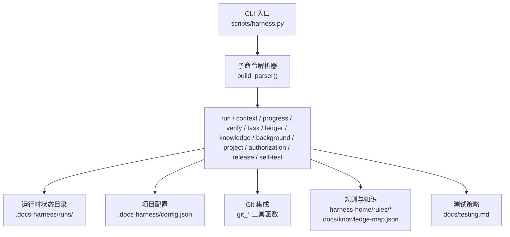
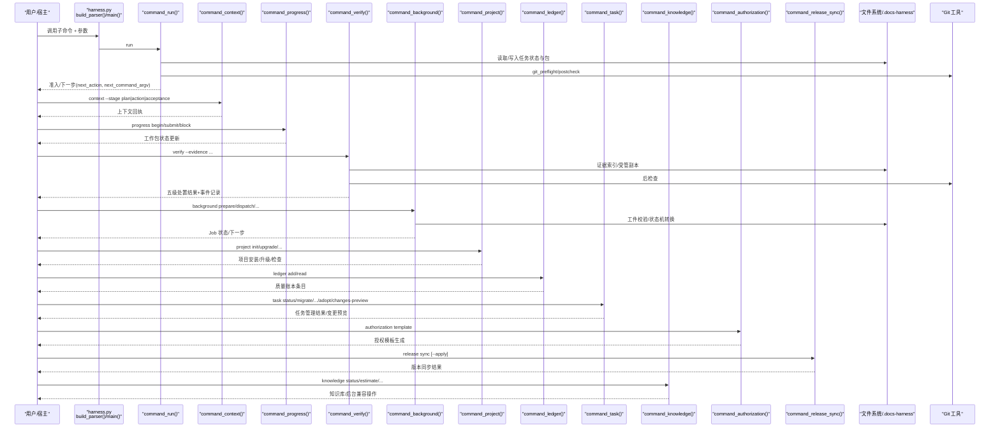
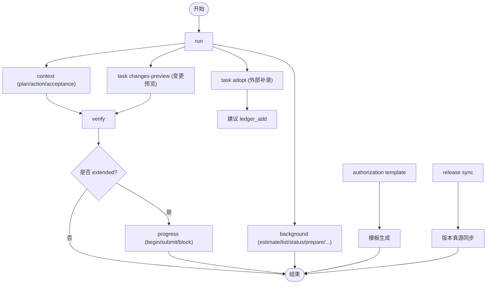

# CLI命令参考

<cite>
**本文引用的文件**   
- [scripts/harness.py](file://scripts/harness.py)
- [package.json](file://package.json)
- [README.md](file://README.md)
- [CHANGELOG.md](file://CHANGELOG.md)
- [SKILL.md](file://SKILL.md)
- [VERSION](file://VERSION)
- [docs/testing.md](file://docs/testing.md)
- [tests/test_harness.py](file://tests/test_harness.py)
- [docs/contracts.md](file://docs/contracts.md)
</cite>

## 更新摘要
**已进行的更改**   
- 版本更新至 v1.7.6，反映所有配置文件中的版本同步
- 新增自适应验证强度测试策略：基于实际变更面选择验证强度，支持行为级验证优先
- 移除任务文本关键词 Gate 路由，改为宿主语义判断
- 新增 git_commit 受控意图（本地提交层）
- 增强错误响应机制，支持更多诊断信息字段
- 完善测试策略文档和验收分层指导
- **重构 task changes-preview 命令**：重新设计为纯粹的工作区分区预览工具，不再声称与 verify 归因等价，返回结构化分区输出

## 目录
1. [简介](#简介)
2. [项目结构](#项目结构)
3. [核心组件](#核心组件)
4. [架构总览](#架构总览)
5. [详细命令参考](#详细命令参考)
6. [依赖关系分析](#依赖关系分析)
7. [性能与可观测性](#性能与可观测性)
8. [故障排除指南](#故障排除指南)
9. [结论](#结论)
10. [附录：JSON输出与结构化响应](#附录json输出与结构化响应)

## 简介
本文件为 Docs Harness v1.7.6 的完整 CLI 命令参考，覆盖 run、verify、background、project、ledger、context、progress、task、knowledge、authorization、release、self-test 等全部命令。文档包含每个命令的语法、必需与可选参数、环境变量与配置项、错误码与退出码、常见工作流示例、命令间依赖与执行顺序指导，以及 JSON 输出格式说明与调试建议。所有规范以仓库内源码与契约文档为依据。

**v1.7.x 版本特性**：
- **快速通道准入**（v1.7.0）：低风险任务可通过 `fast_track: true` 声明走轻量流程，证据要求收敛到最小集
- **发版同步**（v1.7.1）：单命令原子同步 VERSION、package.json、SKILL.md 等版本真源
- **后台优化**（v1.7.2）：合并 dispatch 快路径和批量 progress 推进，减少 CLI 往返次数
- **变更预览**（v1.7.3）：新增 `task changes-preview` 只读命令，提供纯函数差异对比，零状态变更
- **自适应验证强度**（v1.7.6）：基于实际变更面选择验证强度，行为代码变化触发目标测试优先，版本元数据变更只做轻量检查
- **工作区分区预览**（v1.7.6）：changes-preview 命令重新设计为纯粹的工作区分区工具，返回结构化分区输出，不再冒充 verify 归因结果

## 项目结构
- 入口脚本：scripts/harness.py（Python 实现）
- 包元数据：package.json（版本、脚本、打包清单）
- 技能说明：README.md（安装、任务入口、后台治理、质量账本等高层流程）
- 契约与状态机：docs/contracts.md（任务包、证据、上下文、授权、验证命令、迁移与回滚、退出码等）
- 测试策略：docs/testing.md（验证选择矩阵、验收分层、事实来源）

**图表来源** 
- [scripts/harness.py:11415-11438](file://scripts/harness.py#L11415-L11438)
- [package.json:1-24](file://package.json#L1-L24)
- [docs/testing.md:9-24](file://docs/testing.md#L9-L24)

章节来源
- [scripts/harness.py:11415-11438](file://scripts/harness.py#L11415-L11438)
- [package.json:1-24](file://package.json#L1-L24)
- [docs/testing.md:9-24](file://docs/testing.md#L9-L24)

## 核心组件
- 命令行解析与分发：build_parser() 定义所有子命令与参数；main(argv) 路由到具体 command_* 函数并统一输出 emit()。
- 任务生命周期：command_run() 负责幂等复用、任务包构建、范围绑定、Gate 编译、计划冻结、授权与上下文加载。
- 验收与证据：command_verify() 支持五级处置（provide_evidence/refresh_evidence/retry_verification/incremental_admission/full_readmission），逐项验证命令缓存与收据复用。
- 后台治理：command_background() 管理 estimate/list/status/prepare/dispatch/progress/verify/retry/prune，严格状态机与工件校验。
- 项目生命周期：command_project() 提供 init/upgrade/uninstall/check/diff/rollback-check。
- 质量账本：command_ledger() 支持 add/read，按任务或关键词检索。
- 上下文与进度：command_context() 按阶段加载上下文并写回执；command_progress() 推进 extended 工作包状态。
- 任务管理：command_task() 支持 status/migrate/cancel/archive/list/prune/**adopt**/**changes-preview**，新增外部任务补录功能和变更预览功能。
- 知识库：command_knowledge() 兼容 background 别名，支持 status/estimate/audit/bootstrap/update/verify/job-status/dispatch/retry。
- 授权管理：command_authorization() 支持 **template** 操作，生成授权文件模板。
- **发版同步**：command_release_sync() 原子同步版本真源，确保发布一致性。
- 自检：command_self_test() 运行内置合同自检。

**章节来源**
- [scripts/harness.py:11415-11438](file://scripts/harness.py#L11415-L11438)
- [scripts/harness.py:11152-11180](file://scripts/harness.py#L11152-L11180)
- [scripts/harness.py:10556-10604](file://scripts/harness.py#L10556-L10604)

## 架构总览
下图展示 CLI 主流程与关键子系统交互：

**图表来源** 
- [scripts/harness.py:11415-11438](file://scripts/harness.py#L11415-L11438)
- [scripts/harness.py:11152-11180](file://scripts/harness.py#L11152-L11180)
- [scripts/harness.py:10556-10604](file://scripts/harness.py#L10556-L10604)

## 详细命令参考

### 通用选项
- --target <路径>：目标项目根目录，默认当前目录。
- --json：以 JSON 形式输出结构化响应。

**章节来源**
- [scripts/harness.py:11415-11438](file://scripts/harness.py#L11415-L11438)

### run 命令
用途：任务路由、任务包编译与执行准入。

语法
- python3 scripts/harness.py run --target <项目> [--task "<原始任务>"] [--task-id <id>] [--new-task] [--facts <事实文件>] [--plan <方案文件>] [--authorization <授权文件>] [--scope <路径>...] [--feature <功能ID>...] [--action <动作>...] [--success <成功标准>...] --json

必需参数
- 首次创建任务：--task（原始任务文本）
- 继续已有任务：--task-id

可选参数
- --new-task：跳过活动任务幂等复用，强制新建
- --facts：结构化任务事实 JSON 文件路径（不接受内联内容）
- --plan：正式方案 Markdown 或 JSON 文件路径（不接受内联内容）
- --authorization：结构化授权 JSON 文件路径（不接受内联内容）
- --scope/--feature/--action/--success：限制范围、功能、动作与成功标准

行为要点
- 幂等复用：同一 target、归一化任务文本、事实指纹与工作区快照命中活动任务时返回 active_task_reused，不重复建立上下文与授权。
- Gate 与范围：先编译意图与候选范围，再根据最高 mutation_profile 与风险 Gate 决定准入状态。
- 计划冻结：若需提交/补全计划，返回 complete_plan 或 complete_plan_delta，仅列出缺失字段，避免整份重交。
- Git 预检/后检查：对 git_fetch/git_sync 进行 preflight 与 postcheck，漂移将触发重新准入。
- **快速通道**：facts 中声明 `fast_track: true` 且满足条件时走轻量流程，证据要求收敛到最小集。
- **自适应验证**：v1.7.6 起根据实际变更面选择验证强度，行为代码变化触发目标测试优先。

返回值与下一步
- 可能返回 next_action 与 next_command_argv，如 load_plan_context、load_action_context、obtain_authorization、provide_evidence、retry_verification、rerun_harness_for_readmission 等。

示例
- 首次准入：python3 scripts/harness.py run --target . --task "修复登录超时问题" --facts facts.json --json
- 继续任务：python3 scripts/harness.py run --target . --task-id dh-YYYYMMDDTHHMMSS-xxxxxxxxxx --json
- 提交计划：python3 scripts/harness.py run --target . --task-id <id> --plan plan.json --json
- 快速通道：python3 scripts/harness.py run --target . --task "修改README文档" --facts '{"fast_track": true}' --json

**章节来源**
- [scripts/harness.py:10669-10696](file://scripts/harness.py#L10669-L10696)

### context 命令
用途：按阶段加载精确上下文并写回执。

语法
- python3 scripts/harness.py context --target <项目> --task-id <id> [--stage plan|action|acceptance] [--work-package <wp-id>] --json

参数
- --task-id：必填
- --stage：plan/action/acceptance，默认 action
- --work-package：扩展路线下指定工作包

行为要点
- 按 stage 与 compiler_contract、content_set_fingerprint 进行内容寻址复用；跨 task/target/stage/contract 或内容变化必须重载。
- 回执用于后续 verify 阶段校验上下文有效性。

示例
- python3 scripts/harness.py context --target . --task-id <id> --stage plan --json

**章节来源**
- [scripts/harness.py:10698-10702](file://scripts/harness.py#L10698-L10702)

### progress 命令
用途：推进 extended 工作包状态。

语法
- python3 scripts/harness.py progress <status|begin|submit|block> --target <项目> --task-id <id> [--work-package <wp-id>] [--evidence <证据文件>] [--reason <原因>] [--scope-changed] [--handoff] --json

参数
- action：status/begin/submit/block
- --work-package：必填（除 status 外）
- --evidence：submit 时必须提供
- --reason：受限原因码
- --scope-changed/--handoff：标记变更与交接

行为要点
- 合法状态转换：pending→in_progress|blocked，in_progress→completed|blocked；相同状态幂等，倒退/跳过/未知 ID 失败关闭。
- submit 时生成证据收据并归档。

示例
- python3 scripts/harness.py progress begin --target . --task-id <id> --work-package wp-1 --json
- python3 scripts/harness.py progress submit --target . --task-id <id> --work-package wp-1 --evidence evidence.json --json

**章节来源**
- [scripts/harness.py:10704-10716](file://scripts/harness.py#L10704-L10716)

### verify 命令
用途：同源验收、补证或重新准入。

语法
- python3 scripts/harness.py verify --target <项目> --task-id <id> [--evidence <证据文件>...] --json

参数
- --task-id：必填
- --evidence：结构化证据 JSON 文件路径，可重复（不接受内联内容）

行为要点
- 五级处置：provide_evidence、refresh_evidence、retry_verification、incremental_admission、full_readmission。
- 验证命令逐项缓存：输入不变且上次通过则复用收据；失败或输入变化才重跑。可通过 verification.command_cache_enabled=false 整体关闭。
- 自动归因：write 内未归因写入默认由控制器代铸 workspace_attribution 收据；可通过 verification.auto_attribute_in_scope=false 恢复补证据流程。
- 每次 verify 均记录结构化事件，统计命令执行次数、缓存命中、上下文加载计数与 readmission_count。
- **层复用**：v1.7.1 起在单次会话内复用中间产物，响应包含 layer_reuse 遥测信息。
- **自适应验证强度**：v1.7.6 起根据变更类型选择验证策略，行为代码变化优先目标测试，版本元数据变更只做轻量检查。

示例
- python3 scripts/harness.py verify --target . --task-id <id> --evidence evidence.json --json

**章节来源**
- [scripts/harness.py:10718-10726](file://scripts/harness.py#L10718-L10726)
- [docs/testing.md:9-24](file://docs/testing.md#L9-L24)

### task 命令
用途：查询、取消、归档、清理任务或显式迁移 v1 在途任务，**新增外部任务补录功能和变更预览功能**。

语法
- python3 scripts/harness.py task <status|migrate|cancel|archive|list|prune|**adopt**|**changes-preview**> --target <项目> [--task-id <id>] [--apply] [--reason-code <码>] [--older-than <天数>] [--dry-run] [--include-archived] --json

参数
- action：status/migrate/cancel/archive/list/prune/**adopt**/**changes-preview**
- --task-id：按需提供
- --apply：显式应用迁移/取消/归档/清理；缺省仅预览
- --reason-code：受控原因码
- --older-than/--dry-run/--include-archived：清理与列表控制
- **--outcome**：**adopt** 时的外部完成结果摘要（必填）
- **--external-evidence**：**adopt** 时的外部证据文件路径（可选）
- **--bypass-reason**：**adopt** 时的绕过原因（可选）

行为要点
- v1 在途任务只允许 status；migrate --apply 在 staging/backup/journal 中切换并支持回滚。
- list 支持 include-archived 查看已归档 v1 对象。
- **adopt** 功能：用于外部系统已完成的任务补录，将任务状态设置为 complete，verification_status 设置为 adopted_external，记录 adoption_record 并建议添加到质量账本。
- **adopt** 限制：终态任务（complete/cancelled/failed）不可补录，必须提供 --outcome 描述完成结果。
- **changes-preview** 功能：**v1.7.3 新增，v1.7.6 重新设计** 只读命令，对比当前工作区与冻结基线的差异，不进行任何状态修改。**重新设计后作为纯粹的工作区分区预览工具**，返回结构化分区输出，不再声称与 verify 归因等价。

示例
- python3 scripts/harness.py task status --target . --task-id <id> --json
- python3 scripts/harness.py task migrate --target . --task-id <id> --apply --json
- **python3 scripts/harness.py task adopt --target . --task-id <id> --outcome "外部系统已完成部署" --json**
- **python3 scripts/harness.py task adopt --target . --task-id <id> --outcome "已完成" --external-evidence external-proof.json --bypass-reason "紧急修复" --json**
- **python3 scripts/harness.py task changes-preview --target . --task-id <id> --json**

**章节来源**
- [scripts/harness.py:10728-10739](file://scripts/harness.py#L10728-L10739)
- [scripts/harness.py:3980-4051](file://scripts/harness.py#L3980-L4051)
- [scripts/harness.py:4424-4448](file://scripts/harness.py#L4424-L4448)

### authorization 命令
用途：**新增** 授权文件模板生成与管理。

语法
- python3 scripts/harness.py authorization <**template**> --target <项目> --task-id <id> [--output <文件>] --json

参数
- action：**template**（唯一支持的选项）
- --task-id：必填，要生成授权模板的任务编号
- --output：模板输出文件路径；缺省输出到 stdout

行为要点
- 从任务包中提取授权要求信息，生成标准化的授权文件模板。
- 模板包含 schema_version、task_id、package_fingerprint、approved、authorized_actions、authorized_scope、authorized_git_scope、authorized_external_scope、external_target、constraints 等字段。
- 需要手动填充 authorized_at、authorized_by、expires_at 等时间戳和审批人信息。
- 模板包含 _template_hints 字段，提供各字段的格式说明和注意事项。

示例
- **python3 scripts/harness.py authorization template --target . --task-id <id> --json**
- **python3 scripts/harness.py authorization template --target . --task-id <id> --output auth.json --json**

**章节来源**
- [scripts/harness.py:10784-10788](file://scripts/harness.py#L10784-L10788)
- [scripts/harness.py:10556-10604](file://scripts/harness.py#L10556-L10604)

### release 命令
用途：**新增** 发版版本同步与一致性检查。

语法
- python3 scripts/harness.py release <sync> --target <项目> [--apply] [--target-version <版本>] --json

参数
- action：**sync**（唯一支持的选项）
- --target：必填，项目根目录
- --apply：原子写入版本真源（VERSION、package.json、SKILL.md）
- --target-version：显式确认目标版本，与 VERSION 常量不一致时失败关闭

行为要点
- **检查模式**（无 --apply）：扫描四处版本真源（scripts/harness.py VERSION、VERSION 文件、package.json、SKILL.md frontmatter），输出差异报告。
- **原子写入**（--apply）：以 scripts/harness.py 的 VERSION 常量为唯一真源，原子写入三处受管文件，任一失败整体回滚。
- **版本冲突**：--target-version 与 VERSION 常量不一致时返回 release_version_conflict。
- **CHANGELOG 提示**：检查模式下提示 CHANGELOG 顶部版本号是否一致，但不自动生成。

示例
- **python3 scripts/harness.py release sync --target . --json**
- **python3 scripts/harness.py release sync --apply --target . --json**
- **python3 scripts/harness.py release sync --apply --target-version 1.7.6 --target . --json**

**章节来源**
- [scripts/harness.py:11152-11180](file://scripts/harness.py#L11152-L11180)

### ledger 命令
用途：人工触发的个人本地质量账本。

语法
- python3 scripts/harness.py ledger <add|read> --target <项目> [--task-id <id>] [--review <复盘文件>] [--query <检索>] [--limit <条数>] --json

参数
- action：add/read
- --task-id：记录或精确读取的任务编号
- --review：脱敏质量复盘 JSON 文件路径（不接受内联内容）
- --query：按摘要、范围、Gate、价值、经验或风险检索
- --limit：读取条数，范围 1-20，默认 5

行为要点
- 不得自动记录或在任务结束后主动询问；读取历史时按任务编号或关键词调用 read。

示例
- python3 scripts/harness.py ledger add --target . --task-id <id> --review review.json --json
- python3 scripts/harness.py ledger read --target . --query "安全边界" --limit 10 --json

**章节来源**
- [scripts/harness.py:10741-10751](file://scripts/harness.py#L10741-L10751)

### knowledge 命令
用途：功能知识库审查、评估与兼容后台入口。

语法
- python3 scripts/harness.py knowledge <status|estimate|audit|bootstrap|update|verify|job-status|dispatch|retry> --target <项目> [--assessment <报告>] [--consent <同意回执>] [--job-id <id>] [--job-status <状态>] [--result updated|no_change] --json

参数
- action：status/estimate/audit/bootstrap/update/verify/job-status/dispatch/retry
- --assessment/--consent：结构化文件路径（不接受内联内容）
- --job-id/--job-status：后台 Job 相关
- --result：updated/no_change，默认 updated

行为要点
- 作为 background 的弃用别名，共享相同安全不变量；仅 background_direct 保留旧别名的 contract_ready 直达 running 兼容。

示例
- python3 scripts/harness.py knowledge estimate --target . --candidate candidate.json --json
- python3 scripts/harness.py knowledge dispatch --target . --job-id <id> --job-status dispatched --json

**章节来源**
- [scripts/harness.py:10753-10760](file://scripts/harness.py#L10753-L10760)

### background 命令
用途：统一后台文档治理 Job 控制器。

语法
- python3 scripts/harness.py background <estimate|list|status|prepare|progress|dispatch|verify|retry|prune> --target <项目> [--candidate <候选文件>] [--job-id <id>] [--job-status <状态>] [--work-package-id <wp-id>] [--work-package-status in_progress|completed|blocked] [--reason-code <码>] [--repair] [--assessment <报告>] [--result updated|no_change|completed_with_finding] [--older-than <天数>] [--apply] [--dry-run] --json

参数
- action：estimate/list/status/prepare/progress/dispatch/verify/retry/prune
- --candidate：后台候选项 JSON 文件路径（不接受内联内容）
- --job-id：统一后台 Job ID
- --job-status：宿主报告的 Job 状态
- --work-package-id/--work-package-status：工作包目标状态
- --reason-code：有界、受控的原因码
- --repair：显式归档并修复无效 Goal 工件
- --assessment：知识或重大发现验收报告文件
- --result：updated/no_change/completed_with_finding
- --older-than/--apply/--dry-run：prune 控制
- **--prepare-and-run**：**v1.7.2 新增**，合并 prepare→dispatched→running 步骤
- **--all completed**：**v1.7.2 新增**，批量推进所有工作包到 completed

行为要点
- 状态机严格：contract_ready→dispatched→running，复杂路线必须先 prepare；禁止直接写 job/plan/progress/events。
- verify 对 updated/no_change 要求全部工作包 completed；completed_with_finding 只允许 completed/blocked。
- retry 会归档旧 attempt 工件并要求重新 prepare，不继承完成进度。
- **合并快路径**（v1.7.2）：`--prepare-and-run` 单命令执行 prepare→dispatched→running，减少 2 次往返；`--all completed` 批量推进所有工作包。
- **资格限制**：合并快路径仅适用于 background_goal + change_scoped + raw_score < 60 的中小型复杂 Job。

示例
- python3 scripts/harness.py background prepare --target . --job-id <id> --json
- python3 scripts/harness.py background dispatch --target . --job-id <id> --job-status dispatched --json
- **python3 scripts/harness.py background dispatch --target . --job-id <id> --job-status running --prepare-and-run --json**
- **python3 scripts/harness.py background progress --target . --job-id <id> --all completed --json**
- python3 scripts/harness.py background progress --target . --job-id <id> --work-package-id wp-1 --work-package-status completed --json
- python3 scripts/harness.py background verify --target . --job-id <id> --assessment assessment.json --json
- python3 scripts/harness.py background retry --target . --job-id <id> --json

**章节来源**
- [scripts/harness.py:10762-10776](file://scripts/harness.py#L10762-L10776)
- [scripts/harness.py:9246-9293](file://scripts/harness.py#L9246-L9293)

### project 命令
用途：项目安装生命周期。

语法
- python3 scripts/harness.py project <init|upgrade|uninstall|check|diff|rollback-check> --target <项目> [--apply] [--purge-runtime] --json

参数
- action：init/upgrade/uninstall/check/diff/rollback-check
- --apply：显式应用变更
- --purge-runtime：清理运行时

行为要点
- init：新项目创建最小知识骨架、执行 knowledge estimate 并返回 knowledge_bootstrap 后台合同；不等待知识生成。
- upgrade：preserve-and-merge 合法 document_routes；非法路由或缺少路由合同的在途治理 Job 返回 needs_manual_migration。
- rollback-check：存在活动 v2 任务时阻断回滚。

示例
- python3 scripts/harness.py project init --target . --json
- python3 scripts/harness.py project upgrade --target . --apply --json

**章节来源**
- [scripts/harness.py:10778-10782](file://scripts/harness.py#L10778-L10782)

### self-test 命令
用途：运行内置合同自检。

语法
- python3 scripts/harness.py self-test --target <项目> --json

行为要点
- 返回 version/status/checks/rules/rule_errors/empty_rules_legal 等自检结果。
- **v1.7.1 增强**：script_version 扩展为四源比对（VERSION、package.json、SKILL.md、scripts/harness.py）。

示例
- python3 scripts/harness.py self-test --target . --json

**章节来源**
- [scripts/harness.py:10790-10791](file://scripts/harness.py#L10790-L10791)

## 依赖关系分析
- 命令依赖
  - run → context（plan/action/acceptance）→ verify（证据与命令缓存）→ progress（extended 工作包）
  - background → prepare → dispatch → progress → verify → retry（必要时）
  - project init → knowledge estimate → background prepare（knowledge_bootstrap）
  - **task adopt → 外部任务补录 → 建议 ledger_add**
  - **task changes-preview → 变更预览 → 辅助 verify 前证据对齐**
  - **authorization template → 任务包提取 → 模板生成**
  - **release sync → 版本真源同步**
- 外部依赖
  - Git：git_root/git_command/git_preflight_contract/git_postcheck
  - 文件系统：.docs-harness/runs、quality-ledger、knowledge/background
  - 配置：.docs-harness/config.json（verification.* 开关、document_routes 等）

**图表来源** 
- [scripts/harness.py:11415-11438](file://scripts/harness.py#L11415-L11438)
- [scripts/harness.py:11152-11180](file://scripts/harness.py#L11152-L11180)
- [scripts/harness.py:9246-9293](file://scripts/harness.py#L9246-L9293)

**章节来源**
- [scripts/harness.py:11415-11438](file://scripts/harness.py#L11415-L11438)

## 性能与可观测性
- 验证命令缓存：按 argv、produces 与输入指纹（读取集与工作区相关写入）绑定；输入不变且上次通过则复用收据，减少昂贵命令重跑。可通过 verification.command_cache_enabled=false 整体关闭。
- 上下文内容寻址：按 stage、compiler_contract、content_set_fingerprint 复用正文，避免重复加载。
- 事件记录：每次 verify 入口最终写入 events.jsonl，包含 duration_ms、command_executed_count、command_cache_hit_count、context_load_count、readmission_count 等指标。
- 工作区快照：非 Git 工作区限制文件数量上限，避免截断基线导致误判。
- **任务补录事件**：task_adopt 操作记录 task_adopted 事件，包含 adoption_record 详细信息。
- **层复用遥测**：v1.7.1 起 verify 响应包含 layer_reuse 字段，记录中间产物复用情况。
- **开销度量**：v1.7.0 起 task status 包含 overhead_summary（harness_total_ms/wall_clock_ms/harness_share），目标 ≤1/10。
- **变更预览性能**：changes-preview 使用纯函数 snapshot_changes 和 workspace_snapshot，零状态变更，执行前后 state 目录逐字节一致。
- **自适应验证性能**：v1.7.6 起根据变更类型选择验证策略，行为代码变化优先目标测试，版本元数据变更只做轻量检查，避免不必要的完整回归。

**章节来源**
- [scripts/harness.py:3980-4051](file://scripts/harness.py#L3980-L4051)
- [docs/testing.md:9-24](file://docs/testing.md#L9-L24)

## 故障排除指南
- 常见错误码与退出码
  - 退出码 0：命令成功；只有 verify.result=完成 表示父任务完成
  - 退出码 1：项目检查、自检或完整性读取失败
  - 退出码 2：输入、合同、绑定或状态无效
  - 退出码 3：需要方案、授权、证据（含 provide_evidence/refresh_evidence）、迁移、用户输入或 Git 交付
  - 退出码 4：范围、漂移、Gate、远端、授权或规则变化，必须重新准入
- 典型问题定位
  - 活动任务幂等复用：若期望新建任务，使用 --new-task
  - 计划不完整：按 missing_plan_fields 补充字段，优先使用 complete_plan_delta
  - 证据不足：按 reason_code 提示补充对应类型证据；必要时刷新过期证据
  - Git 漂移：postcheck 失败将触发 full_readmission；git_sync 场景需单命令重新准入并复用冻结方案
  - 后台 Job 状态非法：检查 transition 合法性与工件完整性，必要时 prepare --repair
  - **任务补录失败**：检查任务是否处于终态，确保提供 --outcome 参数
  - **授权模板生成失败**：确认 --task-id 有效且任务包存在
  - **版本同步失败**：检查 --target-version 是否与 VERSION 常量一致，查看 diff 报告
  - **快速通道降级**：检查 fast_track_denied_reason，确认是否满足 direct 路线、无 high gate、文档类 write_scope 等条件
  - **变更预览失败**：检查任务是否为 v2 格式，v1 任务不支持 changes-preview，需先迁移
  - **stale_evidence 错误**：使用 task changes-preview 在 verify 前预览实际变更，对齐证据 write_set
  - **验证强度不当**：v1.7.6 起根据变更类型自动选择验证策略，行为代码变化应优先目标测试，版本元数据变更只做轻量检查
  - **Gate 路由异常**：v1.7.6 起移除任务文本关键词 Gate 路由，需通过 gate_assessment 提交语义判断
  - **changes-preview 误解**：changes-preview 仅返回工作区分区信息，不代表 verify 归因结论，不要将其结果等同于验收通过

**章节来源**
- [scripts/harness.py:3980-4051](file://scripts/harness.py#L3980-L4051)
- [scripts/harness.py:10556-10604](file://scripts/harness.py#L10556-L10604)
- [CHANGELOG.md:3-10](file://CHANGELOG.md#L3-L10)

## 结论
Docs Harness CLI 围绕"意图优先、证据可复用、失败关闭"的原则设计，通过严格的准入、范围绑定、Gate 编译、上下文与授权回执、逐命令验证与收据复用，确保任务执行的可审计性与稳定性。**v1.7.x 版本新增了快速通道准入、发版同步、后台优化、变更预览和自适应验证强度五大特性**，进一步提升了小任务的执行效率和发布流程的可靠性。掌握 run/context/verify/progress/background/project/ledger/task/authorization/release/knowledge/self-test 的命令规格与依赖关系，即可高效编排从任务准入到验收的全流程。

## 附录：JSON输出与结构化响应
- 输出格式
  - 使用 --json 输出标准化 JSON；非 JSON 模式逐行打印 key: value
  - 错误统一为 {"status":"error","code":<错误码>,"message":<消息>}
- 关键字段
  - task_id、admission_status、verification_status、control_status、next_action、next_command_argv、reason_code
  - completion_manifest、contract_delta、plan_contract、plan_delta_contract
  - evidence_index、auto_attributed_paths、workspace_attribution
  - background job 字段：job_id、status、execution_route、attempt、created_at、updated_at、completed_at
  - **adoption_record**：**task adopt** 操作的补录记录，包含 schema_version、task_id、adopted_at、adopted_by、original_package_fingerprint、bypass_reason、outcome_summary、external_evidence_refs、verification_status
  - **template**：**authorization template** 操作的授权模板，包含完整的授权字段和 _template_hints
  - **release sync 字段**：status（consistent/inconsistent/synced/already_consistent）、version_truth、diffs、changed、changelog_top_version、changelog_hint
  - **fast_track 字段**：fast_track、evidence_profile、fast_track_denied_reason、inline_note
  - **性能字段**：overhead_summary（harness_total_ms/wall_clock_ms/harness_share）、layer_reuse
  - **changes-preview 字段**：**v1.7.3 新增，v1.7.6 重新设计** action、task_id、changed_paths、**changed_in_write_scope**、**changed_outside_write_scope**、**changed_in_read_scope**、attribution_status、next_action。**重新设计后作为纯粹的工作区分区预览工具，不再声称与 verify 归因等价**
  - **增强错误响应字段**：**v1.7.3 增强** suggested_fix、missing_items、actual_vs_expected、extra_payload
  - **自适应验证字段**：**v1.7.6 新增** verification_strategy、change_type、target_tests、full_regression_eligible
- 事件与指标
  - events.jsonl 记录 verification_attempt、readmission、auto_attribution、**task_adopted**、**fast_track_downgraded** 等事件
  - 指标包括 duration_ms、command_executed_count、command_cache_hit_count、context_load_count、readmission_count

**章节来源**
- [scripts/harness.py:3980-4051](file://scripts/harness.py#L3980-L4051)
- [scripts/harness.py:10556-10604](file://scripts/harness.py#L10556-L10604)
- [scripts/harness.py:11152-11180](file://scripts/harness.py#L11152-L11180)
- [scripts/harness.py:10795-10801](file://scripts/harness.py#L10795-L10801)
- [scripts/harness.py:4424-4448](file://scripts/harness.py#L4424-L4448)
- [docs/testing.md:9-24](file://docs/testing.md#L9-L24)