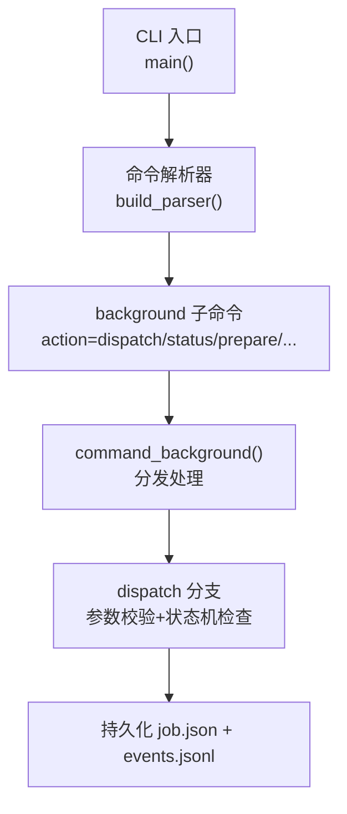
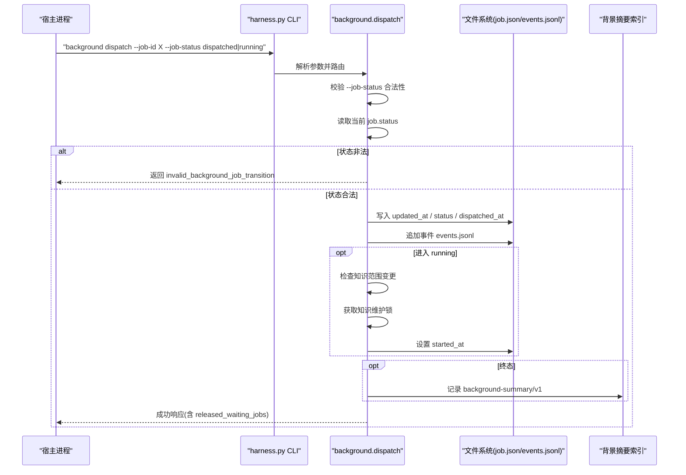
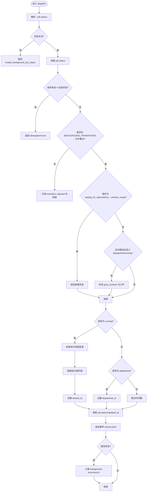
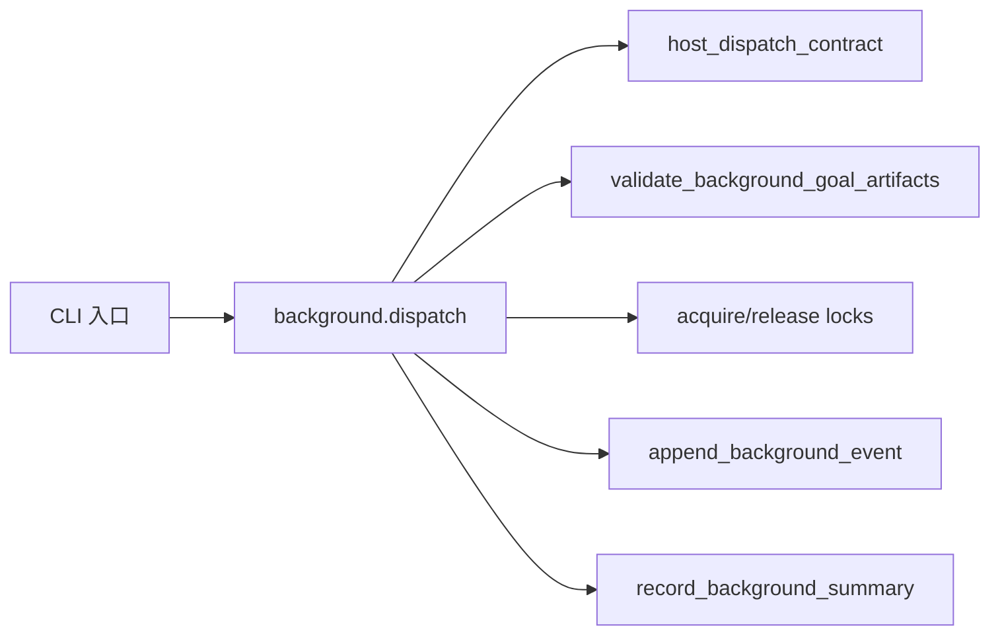

# background dispatch命令

<cite>
**本文引用的文件**   
- [scripts/harness.py](file://scripts/harness.py)
- [tests/test_harness.py](file://tests/test_harness.py)
</cite>

## 目录
1. [简介](#简介)
2. [项目结构](#项目结构)
3. [核心组件](#核心组件)
4. [架构总览](#架构总览)
5. [详细组件分析](#详细组件分析)
6. [依赖关系分析](#依赖关系分析)
7. [性能考量](#性能考量)
8. [故障排查指南](#故障排查指南)
9. [结论](#结论)
10. [附录](#附录)

## 简介
本文件为 Docs Harness 的 background dispatch 命令提供完整 API 文档。该命令用于宿主侧报告后台任务（Job）的生命周期状态变更，典型包括将 Job 从“已调度”推进到“运行中”，以及受控的取消、失败等终态转换。dispatch 阶段包含严格的参数校验、状态机检查与并发控制，确保任务执行引擎与 Harness 控制面之间的交互安全、可审计且幂等。

## 项目结构
- 入口脚本位于 scripts/harness.py，负责解析命令行参数、路由到具体子命令并执行业务逻辑。
- tests/test_harness.py 提供了大量端到端用例，覆盖 background 子命令的行为与边界条件。

图表来源
- [scripts/harness.py:10450-10560](file://scripts/harness.py#L10450-L10560)
- [scripts/harness.py:8900-9099](file://scripts/harness.py#L8900-L9099)

章节来源
- [scripts/harness.py:10450-10560](file://scripts/harness.py#L10450-L10560)

## 核心组件
- 命令与参数
  - 子命令：background
  - action：dispatch（本次重点）、status、prepare、progress、verify、retry、prune、estimate、list
  - 关键参数：--target、--job-id、--job-status
- 状态机
  - 已知状态集合与终态集合定义在常量中，dispatch 仅允许在 BACKGROUND_TRANSITIONS 定义的合法转换。
- 复杂路线支持
  - 对于复杂执行路线（如 background_goal、background_goal_phased），dispatch 进入 running 前需完成 prepare 生成 Goal 工件，并在 verify 时进行一致性校验。
- 并发与锁
  - 进入 running 时会尝试获取知识维护 Job 的锁；进入终态或特定错误路径会释放锁。
- 事件与索引
  - 每次状态变更都会追加事件到 events.jsonl，并更新背景摘要索引 background-summary/v1。

章节来源
- [scripts/harness.py:100-127](file://scripts/harness.py#L100-L127)
- [scripts/harness.py:8404-8416](file://scripts/harness.py#L8404-L8416)
- [scripts/harness.py:8900-9099](file://scripts/harness.py#L8900-L9099)
- [scripts/harness.py:7580-7616](file://scripts/harness.py#L7580-L7616)
- [scripts/harness.py:8432-8458](file://scripts/harness.py#L8432-L8458)
- [scripts/harness.py:8461-8525](file://scripts/harness.py#L8461-L8525)
- [scripts/harness.py:8528-8586](file://scripts/harness.py#L8528-L8586)
- [scripts/harness.py:8651-8669](file://scripts/harness.py#L8651-L8669)

## 架构总览
下图展示了 background dispatch 的整体调用链与数据流，包括参数校验、状态机检查、工件准备、锁管理、事件记录与索引更新。

图表来源
- [scripts/harness.py:8900-9099](file://scripts/harness.py#L8900-L9099)
- [scripts/harness.py:8404-8416](file://scripts/harness.py#L8404-L8416)
- [scripts/harness.py:8651-8669](file://scripts/harness.py#L8651-L8669)

## 详细组件分析

### 命令与参数规范
- 命令位置
  - 顶层命令：background
  - action：dispatch
- 必需参数
  - --target：项目根目录
  - --job-id：后台 Job ID
- 可选参数
  - --job-status：目标状态（由状态机约束）
- 输出
  - JSON 格式响应，包含 action、job_id、status、idempotent、released_waiting_jobs 等字段

章节来源
- [scripts/harness.py:10455-10469](file://scripts/harness.py#L10455-L10469)
- [scripts/harness.py:8900-9099](file://scripts/harness.py#L8900-L9099)

### 状态机与转换规则
- 已知状态集合
  - 包含 dispatched、running、contract_ready、waiting_for_dependency、waiting_for_bootstrap_merge、needs_user_input、needs_rebase、queued_manual 及若干终态。
- 合法转换表
  - contract_ready → {dispatched, queued_manual, cancelled}
  - dispatched → {running, queued_manual, failed, cancelled}
  - running → {waiting_for_dependency, waiting_for_bootstrap_merge, updated, no_change, completed_with_finding, needs_user_input, needs_rebase, failed, cancelled}
  - 其他状态见 BACKGROUND_TRANSITIONS 定义
- 特殊兼容
  - 旧版 knowledge direct 路线允许从 contract_ready 直接到 running（legacy_direct_start）

章节来源
- [scripts/harness.py:100-127](file://scripts/harness.py#L100-L127)
- [scripts/harness.py:8404-8416](file://scripts/harness.py#L8404-L8416)
- [scripts/harness.py:8942-8947](file://scripts/harness.py#L8942-L8947)

### dispatch 阶段的验证逻辑
- 参数校验
  - --job-status 必须属于 BACKGROUND_TRANSITIONS 的值域，否则返回 invalid_background_job_status
- 状态检查
  - 若请求状态等于当前状态，视为幂等成功
  - 若不在允许转换集内，拒绝并记录 transition_rejected 事件
- 依赖检查
  - 当从 waiting_for_dependency 切换到 contract_ready 时，检查依赖 Job 的状态，不允许依赖失败或未完成的场景
- 复杂路线工件校验
  - 对 complex route，进入 dispatched/running 前需存在 goal_contract 并通过 validate_background_goal_artifacts；否则提示 prepare 并给出 next_command_argv

章节来源
- [scripts/harness.py:8934-8990](file://scripts/harness.py#L8934-L8990)
- [scripts/harness.py:8461-8525](file://scripts/harness.py#L8461-L8525)

### 并发控制与锁机制
- 进入 running
  - 检查知识范围是否发生变更，若变更则标记 needs_rebase
  - 获取知识维护 Job 的锁，防止并发冲突
- 退出终态或错误路径
  - 释放知识维护 Job 的锁，避免死锁

章节来源
- [scripts/harness.py:8991-9001](file://scripts/harness.py#L8991-L9001)

### 与任务执行引擎的交互方式
- host_dispatch_contract
  - 生成宿主侧调度合同，包含 required_capabilities、required_preparation、dispatch_sequence、manual_command_argv、manual_resume_argv 等
  - 明确复杂路线的 prepare 前置步骤与 verify 模板
- 执行序列
  - 复杂路线：prepare → create_host_goal → dispatched → running
  - 简单路线：dispatched → running

章节来源
- [scripts/harness.py:7580-7616](file://scripts/harness.py#L7580-L7616)

### 错误处理策略
- 常见错误码
  - invalid_background_job_status：--job-status 无效
  - invalid_background_job_transition：状态转换不合法
  - background_dependency_failed / background_dependency_pending：依赖失败或未就绪
  - invalid_background_job：缺少必要工件或配置
  - invalid_background_progress：工作包状态非法
- 事件记录
  - 拒绝类操作会追加 transition_rejected / progress_rejected 等事件，便于审计与排障
- 幂等性
  - 重复提交相同状态被视为幂等成功

章节来源
- [scripts/harness.py:8934-8990](file://scripts/harness.py#L8934-L8990)
- [scripts/harness.py:8528-8586](file://scripts/harness.py#L8528-L8586)

### 使用示例（流程说明）
以下为典型的使用流程（以文字描述为主，避免直接粘贴代码片段）：
- 示例一：将 Job 从 contract_ready 调度为 dispatched
  - 调用 background dispatch --job-id <ID> --job-status dispatched
  - 系统校验状态合法性，写入 dispatched_at，追加事件，返回成功
- 示例二：将 Job 从 dispatched 推进为 running
  - 调用 background dispatch --job-id <ID> --job-status running
  - 系统校验状态机、检查知识范围变更、获取锁、设置 started_at，追加事件，返回成功
- 示例三：复杂路线先 prepare 再 dispatch
  - 先调用 background prepare --job-id <ID>
  - 成功后再按顺序调用 dispatched 与 running
- 示例四：取消或失败
  - 调用 background dispatch --job-id <ID> --job-status cancelled 或 failed
  - 系统进入终态，记录 completed_at，更新摘要索引，释放锁

章节来源
- [scripts/harness.py:8900-9099](file://scripts/harness.py#L8900-L9099)
- [scripts/harness.py:7580-7616](file://scripts/harness.py#L7580-L7616)

### 流程图：dispatch 主逻辑

图表来源
- [scripts/harness.py:8900-9099](file://scripts/harness.py#L8900-L9099)
- [scripts/harness.py:8404-8416](file://scripts/harness.py#L8404-L8416)
- [scripts/harness.py:8651-8669](file://scripts/harness.py#L8651-L8669)

## 依赖关系分析
- 内部依赖
  - command_background：统一入口，根据 action 分发
  - host_dispatch_contract：生成调度合同，指导宿主侧编排 prepare/dispatch/verify
  - validate_background_goal_artifacts：校验 Goal 工件完整性与版本
  - acquire_knowledge_job_locks / release_knowledge_job_locks：并发锁管理
  - append_background_event / record_background_summary：事件与索引持久化
- 外部依赖
  - Git 工具链（fetch/sync 相关场景）
  - 文件系统原子写入与 JSON 序列化

图表来源
- [scripts/harness.py:7580-7616](file://scripts/harness.py#L7580-L7616)
- [scripts/harness.py:8461-8525](file://scripts/harness.py#L8461-L8525)
- [scripts/harness.py:8651-8669](file://scripts/harness.py#L8651-L8669)

章节来源
- [scripts/harness.py:7580-7616](file://scripts/harness.py#L7580-L7616)
- [scripts/harness.py:8461-8525](file://scripts/harness.py#L8461-L8525)
- [scripts/harness.py:8651-8669](file://scripts/harness.py#L8651-L8669)

## 性能考量
- 事件与索引写入采用追加模式与原子写入，减少竞争与损坏风险。
- 状态检查与工件校验均为本地文件操作，复杂度与 Job 规模线性相关。
- 复杂路线 prepare 可能涉及较大工件生成，建议在宿主侧异步编排，避免阻塞。

[本节为通用指导，无需引用具体文件]

## 故障排查指南
- 常见问题
  - --job-status 无效：确认值是否在 BACKGROUND_TRANSITIONS 定义范围内
  - 状态转换被拒绝：查看 transition_rejected 事件中的 reason_code
  - 依赖未就绪：检查依赖 Job 的状态，确保非 failed/cancelled 且已完成
  - 工件缺失或不一致：调用 background prepare 修复后再尝试 dispatch
- 定位手段
  - 查看 events.jsonl 的事件序列
  - 使用 background status 获取当前 Job 快照
  - 使用 background verify 对 running 状态进行验收校验

章节来源
- [scripts/harness.py:8934-8990](file://scripts/harness.py#L8934-L8990)
- [scripts/harness.py:8528-8586](file://scripts/harness.py#L8528-L8586)

## 结论
background dispatch 命令通过严格的状态机、工件校验与并发锁机制，确保后台任务生命周期管理的正确性与安全性。配合 host_dispatch_contract 与 prepare/verify 流程，形成完整的宿主侧调度闭环。建议在生产环境中结合事件与索引进行监控与审计，确保问题可追溯与快速恢复。

[本节为总结，无需引用具体文件]

## 附录
- 参考用例
  - tests/test_harness.py 中包含 background dispatch 的多组测试，覆盖正常流转、拒绝路径、依赖检查、工件校验与并发场景

章节来源
- [tests/test_harness.py:1682-1826](file://tests/test_harness.py#L1682-L1826)