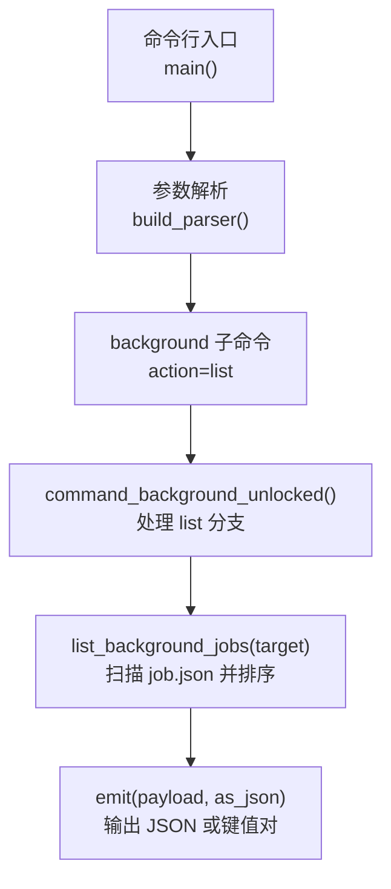
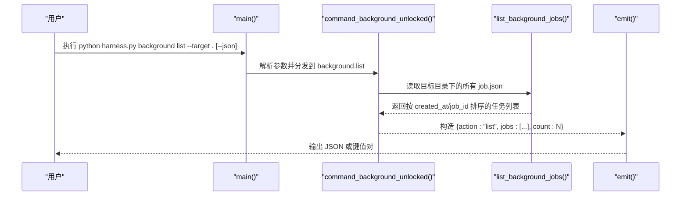
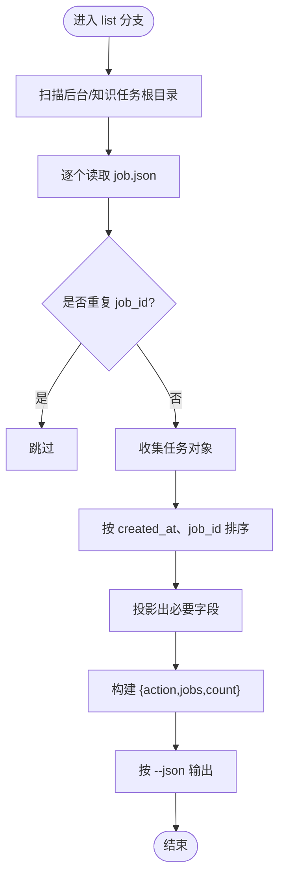
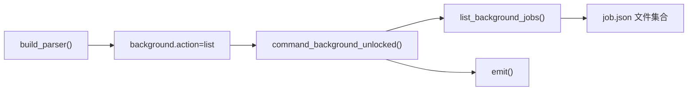

# background list命令

<cite>
**本文引用的文件**   
- [scripts/harness.py](file://scripts/harness.py)
- [tests/test_harness.py](file://tests/test_harness.py)
</cite>

## 目录
1. [简介](#简介)
2. [项目结构](#项目结构)
3. [核心组件](#核心组件)
4. [架构总览](#架构总览)
5. [详细组件分析](#详细组件分析)
6. [依赖关系分析](#依赖关系分析)
7. [性能考量](#性能考量)
8. [故障排查指南](#故障排查指南)
9. [结论](#结论)
10. [附录](#附录)

## 简介
background list 命令用于列出当前项目中所有后台任务（Background Jobs）的基本信息，包括 job-id、status、execution_route、created_at 等关键字段。该命令为只读操作，常用于快速查看后台任务清单与状态概览，便于运维监控与问题定位。

## 项目结构
- 入口脚本：scripts/harness.py
- 测试用例：tests/test_harness.py

**图表来源** 
- [scripts/harness.py:10522-10559](file://scripts/harness.py#L10522-L10559)
- [scripts/harness.py:10455-10479](file://scripts/harness.py#L10455-L10479)
- [scripts/harness.py:8821-8862](file://scripts/harness.py#L8821-L8862)
- [scripts/harness.py:7619-7632](file://scripts/harness.py#L7619-L7632)

**章节来源**
- [scripts/harness.py:10455-10479](file://scripts/harness.py#L10455-L10479)
- [scripts/harness.py:10522-10559](file://scripts/harness.py#L10522-L10559)

## 核心组件
- 命令注册与路由
  - background 子命令的 action 包含 list，位于参数定义处。
- 列表实现
  - command_background_unlocked 在 action == "list" 分支中调用 list_background_jobs(target)，返回精简字段集合。
- 数据读取与排序
  - list_background_jobs 遍历后台任务根目录与知识任务根目录，读取每个 job.json，去重并按 created_at、job_id 排序。
- 输出格式
  - emit 根据 --json 开关决定输出 JSON 或键值对形式。

**章节来源**
- [scripts/harness.py:10455-10479](file://scripts/harness.py#L10455-L10479)
- [scripts/harness.py:8821-8862](file://scripts/harness.py#L8821-L8862)
- [scripts/harness.py:7619-7632](file://scripts/harness.py#L7619-L7632)
- [scripts/harness.py:10482-10488](file://scripts/harness.py#L10482-L10488)

## 架构总览
下图展示了从命令行到数据输出的完整调用链，以及关键数据结构与常量。

**图表来源** 
- [scripts/harness.py:10522-10559](file://scripts/harness.py#L10522-L10559)
- [scripts/harness.py:8821-8862](file://scripts/harness.py#L8821-L8862)
- [scripts/harness.py:7619-7632](file://scripts/harness.py#L7619-L7632)
- [scripts/harness.py:10482-10488](file://scripts/harness.py#L10482-L10488)

## 详细组件分析

### 命令语法与参数
- 基本语法
  - python scripts/harness.py background list --target <项目路径> [--json]
- 参数说明
  - --target：必填，指定项目根目录（必须存在且安全）。
  - --json：可选，启用 JSON 输出；未指定时以键值对形式打印。
- 行为约束
  - list 为只读操作，不修改任何文件或状态。
  - 无需 --job-id 或其他工作包相关参数。

**章节来源**
- [scripts/harness.py:10455-10479](file://scripts/harness.py#L10455-L10479)
- [scripts/harness.py:10482-10488](file://scripts/harness.py#L10482-L10488)

### 输出结构与字段含义
- 顶层字段
  - action：固定为 "list"
  - jobs：任务对象数组，每项包含以下字段
    - job_id：任务唯一标识
    - task_kind：任务种类（如 knowledge_bootstrap、knowledge_incremental_sync、delivery_governance、critical_followup）
    - parent_task_id：父任务 ID（可能为空）
    - status：任务状态（见下方枚举）
    - execution_route：执行路由（见下方类型）
    - attempt：当前尝试次数
    - max_attempts：最大尝试次数
    - created_at：创建时间（ISO 8601）
    - updated_at：更新时间（ISO 8601）
  - count：任务总数
- 状态枚举（部分）
  - 终态：updated、no_change、completed_with_finding、failed、cancelled
  - 其他已知状态：contract_ready、dispatched、running、waiting_for_dependency、waiting_for_bootstrap_merge、needs_user_input、needs_rebase、queued_manual
- 执行路由类型
  - background_direct、background_goal、background_goal_phased
  - 复杂路由：background_goal、background_goal_phased

**章节来源**
- [scripts/harness.py:8847-8862](file://scripts/harness.py#L8847-L8862)
- [scripts/harness.py:100-127](file://scripts/harness.py#L100-L127)

### 使用示例
- 列出全部后台任务（默认文本输出）
  - python scripts/harness.py background list --target .
- 以 JSON 输出（便于程序消费）
  - python scripts/harness.py background list --target . --json
- 过滤特定类型的任务（在外部工具中处理）
  - 通过 jq 筛选 task_kind 或 status，例如：
    - python scripts/harness.py background list --target . --json | jq '.jobs[] | select(.task_kind=="knowledge_bootstrap")'
- 仅查看失败或取消的任务
  - python scripts/harness.py background list --target . --json | jq '.jobs[] | select(.status=="failed" or .status=="cancelled")'

提示：上述过滤示例中的 jq 用法仅为常见实践，实际可在任意支持 JSON 的工具中进行筛选。

**章节来源**
- [SKILL.md:73](file://SKILL.md#L73)
- [scripts/harness.py:10482-10488](file://scripts/harness.py#L10482-L10488)

### 数据流与处理逻辑

**图表来源** 
- [scripts/harness.py:7619-7632](file://scripts/harness.py#L7619-L7632)
- [scripts/harness.py:8847-8862](file://scripts/harness.py#L8847-L8862)
- [scripts/harness.py:10482-10488](file://scripts/harness.py#L10482-L10488)

## 依赖关系分析
- 参数与路由
  - background 子命令的 action 由 build_parser 定义，list 为合法动作之一。
- 数据源
  - list_background_jobs 依赖后台任务根目录与知识任务根目录的存在性，读取 job.json 文件。
- 输出
  - emit 根据 --json 标志选择 JSON 或键值对输出。

**图表来源** 
- [scripts/harness.py:10455-10479](file://scripts/harness.py#L10455-L10479)
- [scripts/harness.py:8821-8862](file://scripts/harness.py#L8821-L8862)
- [scripts/harness.py:7619-7632](file://scripts/harness.py#L7619-L7632)
- [scripts/harness.py:10482-10488](file://scripts/harness.py#L10482-L10488)

**章节来源**
- [scripts/harness.py:10455-10479](file://scripts/harness.py#L10455-L10479)
- [scripts/harness.py:8821-8862](file://scripts/harness.py#L8821-L8862)
- [scripts/harness.py:7619-7632](file://scripts/harness.py#L7619-L7632)
- [scripts/harness.py:10482-10488](file://scripts/harness.py#L10482-L10488)

## 性能考量
- 列表复杂度
  - 主要开销在于遍历任务根目录与读取 job.json 文件，整体近似 O(N)（N 为任务数量）。
- 排序成本
  - 按 created_at 与 job_id 排序，时间复杂度 O(N log N)。
- I/O 优化建议
  - 若任务量较大，建议在外部工具中对 JSON 结果进行分页或过滤，避免一次性加载过多数据。
- 并发与锁
  - list 为只读操作，不涉及写锁；但底层读取 job.json 时忽略异常，保证鲁棒性。

[本节为通用指导，不直接分析具体文件]

## 故障排查指南
- 常见错误与处理
  - 目标目录不存在或不安全：safe_target 会抛出 HarnessError，退出码通常为 2。
  - JSON 无效或缺失：read_json 捕获 JSONDecodeError 并转换为 HarnessError。
  - Git 预检超时或失败：git_command 封装了超时与错误码，通常返回 exit_code=3。
- 诊断步骤
  - 确认 --target 指向有效的项目根目录。
  - 检查 .docs-harness/background/jobs 与 .docs-harness/knowledge/jobs 是否存在及可读。
  - 使用 --json 输出以便进一步用工具分析。
- 典型错误码
  - missing_target、unsafe_target：目标目录问题
  - invalid_json、missing_file：JSON 文件问题
  - git_preflight_timeout、git_preflight_failed：Git 相关问题

**章节来源**
- [scripts/harness.py:535-541](file://scripts/harness.py#L535-L541)
- [scripts/harness.py:440-446](file://scripts/harness.py#L440-L446)
- [scripts/harness.py:575-586](file://scripts/harness.py#L575-L586)

## 结论
background list 提供了简洁可靠的后台任务清单能力，适合日常巡检与自动化集成。通过 --json 输出可与现有工具链无缝对接，结合外部过滤器可实现灵活的查询与告警场景。

[本节为总结性内容，不直接分析具体文件]

## 附录
- 参考实现位置
  - 命令注册与参数：scripts/harness.py
  - 列表逻辑与字段投影：scripts/harness.py
  - 数据读取与排序：scripts/harness.py
  - 输出格式化：scripts/harness.py
- 测试参考
  - tests/test_harness.py 中包含对 list_background_jobs 的使用示例，可用于验证行为与兼容性。

**章节来源**
- [tests/test_harness.py:159](file://tests/test_harness.py#L159)
- [scripts/harness.py:7619-7632](file://scripts/harness.py#L7619-L7632)
- [scripts/harness.py:8847-8862](file://scripts/harness.py#L8847-L8862)
- [scripts/harness.py:10482-10488](file://scripts/harness.py#L10482-L10488)