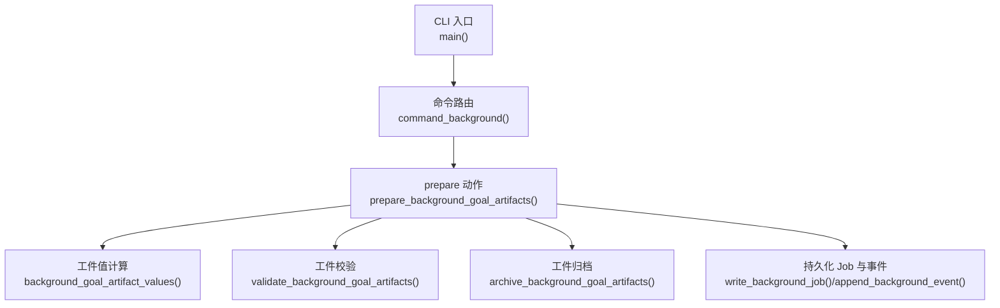
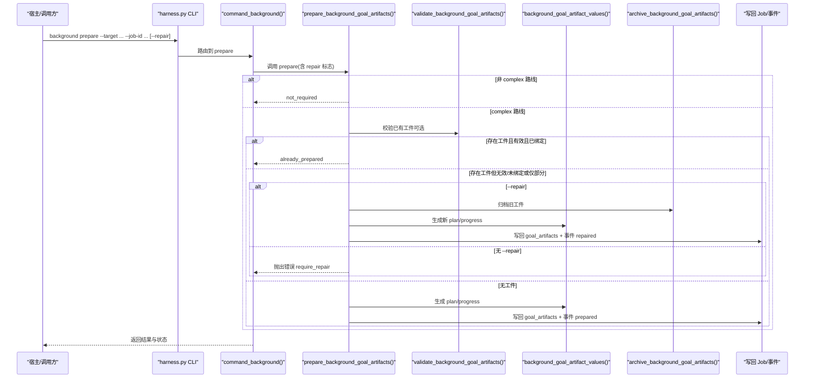
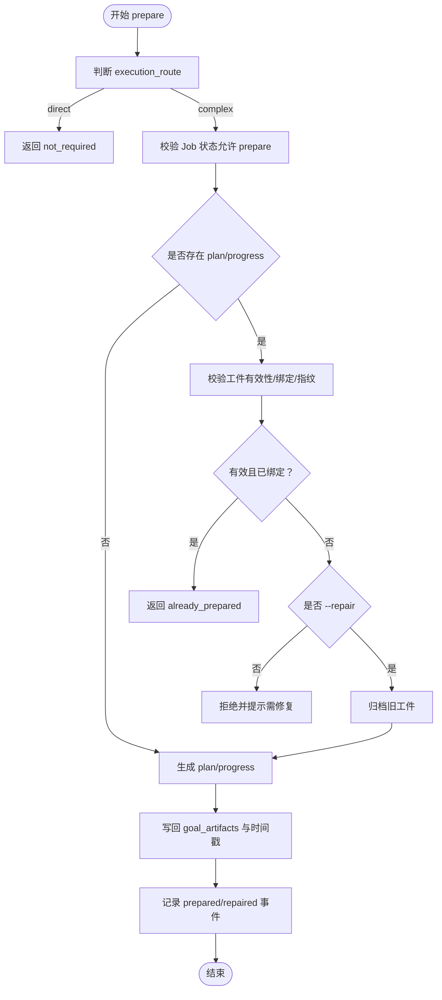
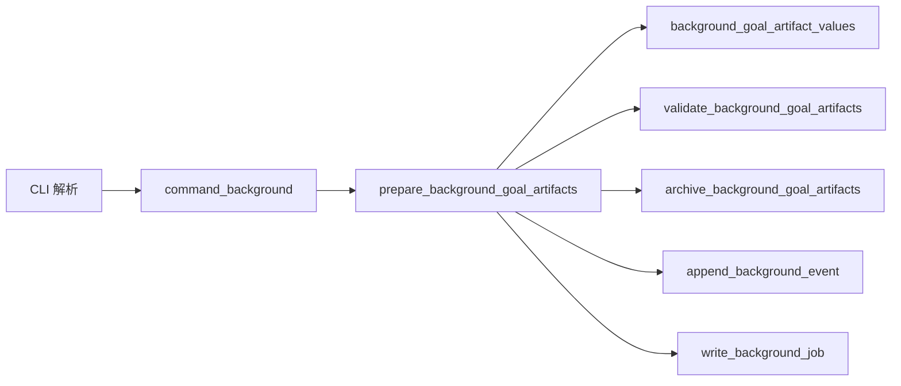

# background prepare命令

<cite>
**本文引用的文件**   
- [scripts/harness.py](file://scripts/harness.py)
- [tests/test_harness.py](file://tests/test_harness.py)
- [package.json](file://package.json)
</cite>

## 目录
1. [简介](#简介)
2. [项目结构](#项目结构)
3. [核心组件](#核心组件)
4. [架构总览](#架构总览)
5. [详细组件分析](#详细组件分析)
6. [依赖关系分析](#依赖关系分析)
7. [性能考虑](#性能考虑)
8. [故障排查指南](#故障排查指南)
9. [结论](#结论)
10. [附录：调用示例与参数说明](#附录调用示例与参数说明)

## 简介
本文件为 Docs Harness 的 background prepare 命令提供完整的 API 文档。该命令用于准备后台任务的执行环境，主要职责包括：
- 验证任务配置（Job）与目标合同（goal_contract）
- 检查并生成/校验 Goal 工件（plan.json、progress.json）及其指纹绑定
- 初始化工作目录中的方案与进度文件，确保后续 dispatch/running 阶段可安全推进
- 支持 --repair 选项进行显式修复：归档已有工件并重建正确版本

prepare 是复杂后台 Job（background_goal、background_goal_phased）进入运行前的必要前置步骤；对于 direct 路线则无需准备。

## 项目结构
- 入口脚本位于 scripts/harness.py，包含 CLI 解析、命令路由与具体实现。
- 测试用例位于 tests/test_harness.py，覆盖 prepare 的正常流程、冲突检测与修复流程。
- package.json 描述包元信息与脚本入口。

图表来源
- [scripts/harness.py:10522-10559](file://scripts/harness.py#L10522-L10559)
- [scripts/harness.py:8821-8927](file://scripts/harness.py#L8821-L8927)
- [scripts/harness.py:8461-8525](file://scripts/harness.py#L8461-L8525)
- [scripts/harness.py:7443-7469](file://scripts/harness.py#L7443-L7469)
- [scripts/harness.py:7485-7551](file://scripts/harness.py#L7485-L7551)
- [scripts/harness.py:8432-8458](file://scripts/harness.py#L8432-L8458)

章节来源
- [scripts/harness.py:10522-10559](file://scripts/harness.py#L10522-L10559)
- [package.json:1-23](file://package.json#L1-L23)

## 核心组件
- CLI 参数解析
  - background 子命令支持 action=prepare，以及 --target、--job-id、--repair 等参数。
- 状态锁与并发控制
  - 通过 state_lock 保证同一 Job 的状态更新互斥，避免竞态。
- 工件生成与校验
  - background_goal_artifact_values：根据 job.goal_contract 与 work_packages 生成 plan.json 与 progress.json 的期望内容。
  - validate_background_goal_artifacts：校验工件 schema、绑定、attempt、指纹一致性，以及 v2 格式的全集约束。
- 修复与归档
  - archive_background_goal_artifacts：将现有工件归档到 attempts/<attempt>/archive-NNN，记录指纹后删除原文件。
- 事件与审计
  - append_background_event：记录 prepared/repaired 等事件，附带旧指纹等信息。

章节来源
- [scripts/harness.py:10455-10469](file://scripts/harness.py#L10455-L10469)
- [scripts/harness.py:1011-1032](file://scripts/harness.py#L1011-L1032)
- [scripts/harness.py:7443-7469](file://scripts/harness.py#L7443-L7469)
- [scripts/harness.py:7485-7551](file://scripts/harness.py#L7485-L7551)
- [scripts/harness.py:8432-8458](file://scripts/harness.py#L8432-L8458)
- [scripts/harness.py:7554-7577](file://scripts/harness.py#L7554-L7577)

## 架构总览
prepare 命令在 background 命令族中承担“准备阶段”的职责，其输入是 Job 对象与目标合同，输出是已就绪的 plan.json 与 progress.json 及对应的指纹绑定。

图表来源
- [scripts/harness.py:10455-10469](file://scripts/harness.py#L10455-L10469)
- [scripts/harness.py:8821-8927](file://scripts/harness.py#L8821-L8927)
- [scripts/harness.py:8461-8525](file://scripts/harness.py#L8461-L8525)
- [scripts/harness.py:7485-7551](file://scripts/harness.py#L7485-L7551)
- [scripts/harness.py:7443-7469](file://scripts/harness.py#L7443-L7469)
- [scripts/harness.py:8432-8458](file://scripts/harness.py#L8432-L8458)

## 详细组件分析

### 参数与行为
- 必需参数
  - --target：项目根目录（必须存在且安全）
  - --job-id：后台 Job ID（必须存在且可读取）
- 可选参数
  - --repair：显式归档并修复无效 Goal 工件；不传时遇到冲突或部分工件会直接拒绝

行为要点
- 对 background_direct 路线：直接返回 not_required，不做任何写入。
- 对复杂路线（background_goal、background_goal_phased）：
  - 仅允许 contract_ready 或在途 dispatched 状态的 Job 进入 prepare。
  - 若 plan.json/progress.json 已存在：
    - 完全有效且指纹与 Job 记录一致：返回 already_prepared。
    - 不完整/无效/指纹不一致：
      - 未带 --repair：拒绝并提示需要显式修复。
      - 带 --repair：归档旧工件，重新生成并写回，返回 repaired。
  - 若无工件：生成 plan.json 与 progress.json，写回 goal_artifacts 与时间戳，返回 prepared。

章节来源
- [scripts/harness.py:10455-10469](file://scripts/harness.py#L10455-L10469)
- [scripts/harness.py:8461-8525](file://scripts/harness.py#L8461-L8525)

### 验证规则与错误检查
- 工件 Schema 与绑定
  - plan.json 与 progress.json 必须符合对应 schema_version。
  - job_id 与 idempotency_key 必须与当前 Job 一致。
- v2 工件完整性
  - artifact_revision 必须为 BACKGROUND_ARTIFACT_REVISION，generated_by 必须为 docs-harness。
  - plan.work_packages 全集必须与期望一致；progress.work_package_states 必须与 plan 一一对应且状态合法。
- 指纹一致性
  - goal_artifacts 中记录的 plan_fingerprint、progress_fingerprint 必须与磁盘文件一致。
- 尝试次数
  - progress.attempt 必须与 job.attempt 一致。
- 常见错误码
  - invalid_background_job：Job 类型或路线无效。
  - invalid_background_job_transition：状态不允许 prepare。
  - missing_background_goal_artifacts：缺少工件或未记录准备度。
  - invalid_background_plan / invalid_background_progress：工件内容非法或不一致。
  - background_plan_binding_mismatch / background_progress_binding_mismatch：绑定不一致。
  - legacy_background_goal_artifacts：旧格式工件不可用于新派发或新 attempt。
  - background_goal_artifacts_tampered：工件指纹漂移。
  - partial_background_goal_artifacts / invalid_background_goal_artifacts：工件不完整或无效。
  - background_goal_artifacts_conflict：工件存在但未绑定当前准备记录。

章节来源
- [scripts/harness.py:7485-7551](file://scripts/harness.py#L7485-L7551)
- [scripts/harness.py:8461-8525](file://scripts/harness.py#L8461-L8525)

### 恢复机制与 --repair 流程
- 触发条件
  - 工件不完整、无效或与 Job 记录不一致，且调用方显式传入 --repair。
- 处理步骤
  - 归档：将现有 plan.json/progress.json 复制到 attempts/<attempt>/archive-NNN，记录指纹并删除原文件。
  - 重建：基于 job.goal_contract 与 work_packages 生成新的 plan.json 与 progress.json。
  - 写回：更新 job.goal_artifacts（artifact_revision、attempt、plan_ref、plan_fingerprint、progress_ref、progress_fingerprint），设置 prepared_at 与 updated_at。
  - 事件：追加 repaired 事件，携带旧工件指纹信息。
- 幂等性
  - 当工件已完整且指纹一致时，prepare 直接返回 already_prepared，不会重复写入。

章节来源
- [scripts/harness.py:8432-8458](file://scripts/harness.py#L8432-L8458)
- [scripts/harness.py:8461-8525](file://scripts/harness.py#L8461-L8525)

### 与 Job 生命周期其他阶段的交互
- 与 dispatch
  - 复杂路线在进入 dispatched/running 前必须完成 prepare；若工件缺失或校验失败，dispatch 会拒绝并提示先执行 prepare。
- 与 progress
  - 只有 running 状态的 Job 才能更新工作包进度；progress 更新会再次校验工件一致性并写回 goal_artifacts。
- 与 retry
  - 重试时会递增 attempt，并可能触发工件归档与重建。
- 与 verify
  - verify 阶段会读取工件与事件以确认控制面一致性。

章节来源
- [scripts/harness.py:8974-9000](file://scripts/harness.py#L8974-L9000)
- [scripts/harness.py:9034-9082](file://scripts/harness.py#L9034-L9082)
- [scripts/harness.py:8528-8586](file://scripts/harness.py#L8528-L8586)

### 数据流与关键数据结构
- 工件值生成
  - plan.json：包含 schema_version、artifact_revision、generated_by、job_id、idempotency_key、objective、work_packages。
  - progress.json：包含 schema_version、artifact_revision、generated_by、job_id、idempotency_key、attempt、work_package_states、completed_work_packages、remaining_work_packages。
- 工件引用
  - goal_artifacts：artifact_revision、attempt、plan_ref、plan_fingerprint、progress_ref、progress_fingerprint。

图表来源
- [scripts/harness.py:8461-8525](file://scripts/harness.py#L8461-L8525)
- [scripts/harness.py:7443-7469](file://scripts/harness.py#L7443-L7469)
- [scripts/harness.py:7485-7551](file://scripts/harness.py#L7485-L7551)
- [scripts/harness.py:8432-8458](file://scripts/harness.py#L8432-L8458)

## 依赖关系分析
- 模块内依赖
  - command_background 负责参数解析与动作分发。
  - prepare_background_goal_artifacts 依赖 background_goal_artifact_values、validate_background_goal_artifacts、archive_background_goal_artifacts、append_background_event、write_background_job。
- 外部依赖
  - Git 工具链（由 harness 内部函数调用，prepare 本身不直接调用）。
  - 文件系统原子写入与 JSON 序列化。

图表来源
- [scripts/harness.py:10455-10469](file://scripts/harness.py#L10455-L10469)
- [scripts/harness.py:8821-8927](file://scripts/harness.py#L8821-L8927)
- [scripts/harness.py:8461-8525](file://scripts/harness.py#L8461-L8525)

章节来源
- [scripts/harness.py:10455-10469](file://scripts/harness.py#L10455-L10469)
- [scripts/harness.py:8821-8927](file://scripts/harness.py#L8821-L8927)
- [scripts/harness.py:8461-8525](file://scripts/harness.py#L8461-L8525)

## 性能考虑
- 工件校验涉及 JSON 读取与哈希计算，复杂度与工件大小线性相关。
- 归档操作会复制文件并删除原文件，注意磁盘 I/O 开销。
- 使用原子写入避免中间状态导致的不一致。
- 状态锁防止并发竞争，避免重复写入与损坏。

[本节为通用指导，不直接分析具体文件]

## 故障排查指南
- 常见错误与定位
  - missing_background_goal_artifacts：检查 .docs-harness/background/jobs/<job_id>/plan.json 与 progress.json 是否存在。
  - invalid_background_plan / invalid_background_progress：核对 schema_version、字段完整性与一致性。
  - background_goal_artifacts_tampered：比对 goal_artifacts 中指纹与文件实际指纹。
  - partial_background_goal_artifacts / invalid_background_goal_artifacts：补全工件或启用 --repair。
  - background_goal_artifacts_conflict：工件存在但与当前准备记录不一致，需 --repair 或清理工件。
- 诊断建议
  - 查看 events.jsonl 中 prepare_rejected/prepared/repaired 事件，定位问题阶段。
  - 检查 attempts/<attempt>/archive-NNN 下的归档记录，确认旧工件指纹。
  - 确认 Job 状态是否为 contract_ready 或 dispatched。

章节来源
- [scripts/harness.py:7485-7551](file://scripts/harness.py#L7485-L7551)
- [scripts/harness.py:8461-8525](file://scripts/harness.py#L8461-L8525)
- [scripts/harness.py:7554-7577](file://scripts/harness.py#L7554-L7577)

## 结论
background prepare 命令是复杂后台 Job 进入运行前的关键前置步骤，负责生成并校验 Goal 工件，确保后续调度与执行的契约一致性。通过 --repair 选项，系统可在工件异常时自动归档并重建，保障流程的可恢复性与幂等性。与 dispatch、progress、retry、verify 等阶段紧密协作，形成完整的后台任务生命周期闭环。

[本节为总结，不直接分析具体文件]

## 附录：调用示例与参数说明

### 参数说明
- background prepare
  - --target：项目根路径（必填）
  - --job-id：后台 Job ID（必填）
  - --repair：显式归档并修复无效工件（可选）

### 正常流程示例
- 首次准备（无工件）
  - 命令：python scripts/harness.py background prepare --target <项目根> --job-id <job_id>
  - 预期：生成 plan.json 与 progress.json，返回 prepared，包含 goal_artifacts 与 changed=true。
- 幂等重入（工件已就绪）
  - 命令：同上
  - 预期：返回 already_prepared，changed=false。

### 修复流程示例
- 工件不完整或无效
  - 命令：python scripts/harness.py background prepare --target <项目根> --job-id <job_id> --repair
  - 预期：归档旧工件，重建 plan/progress，返回 repaired，包含新旧工件指纹信息。

### 与 dispatch 的衔接
- 若未 prepare 而直接 dispatch，复杂路线会被拒绝并提示先执行 prepare。
- 成功 prepare 后，再执行 dispatch 进入 dispatched/running。

章节来源
- [scripts/harness.py:10455-10469](file://scripts/harness.py#L10455-L10469)
- [scripts/harness.py:8974-9000](file://scripts/harness.py#L8974-L9000)
- [tests/test_harness.py:167](file://tests/test_harness.py#L167)
- [tests/test_harness.py:2055-2119](file://tests/test_harness.py#L2055-L2119)
- [tests/test_harness.py:2151-2173](file://tests/test_harness.py#L2151-L2173)