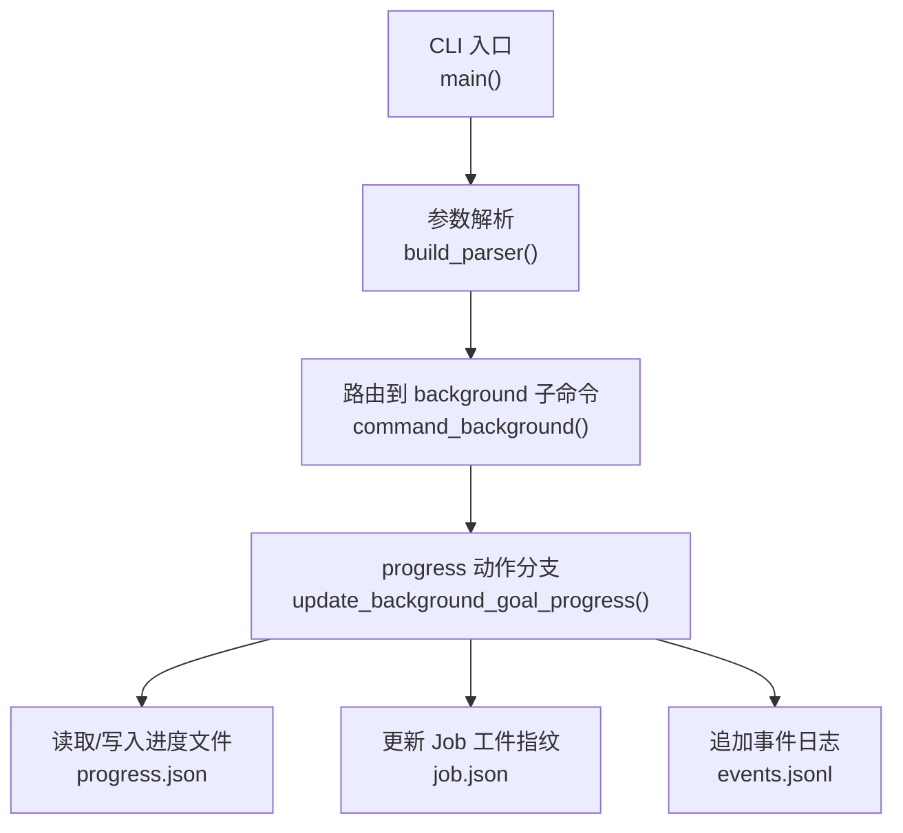
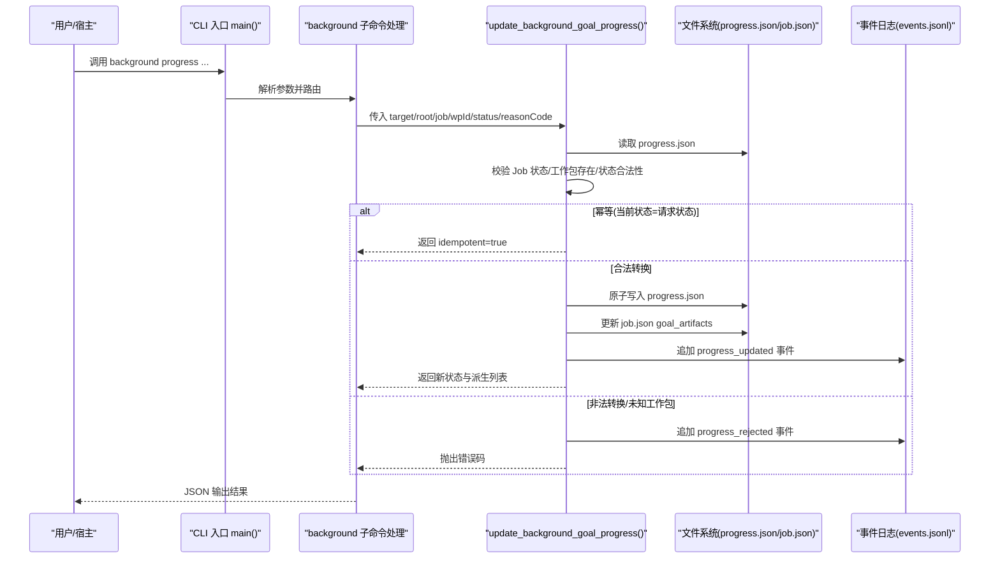
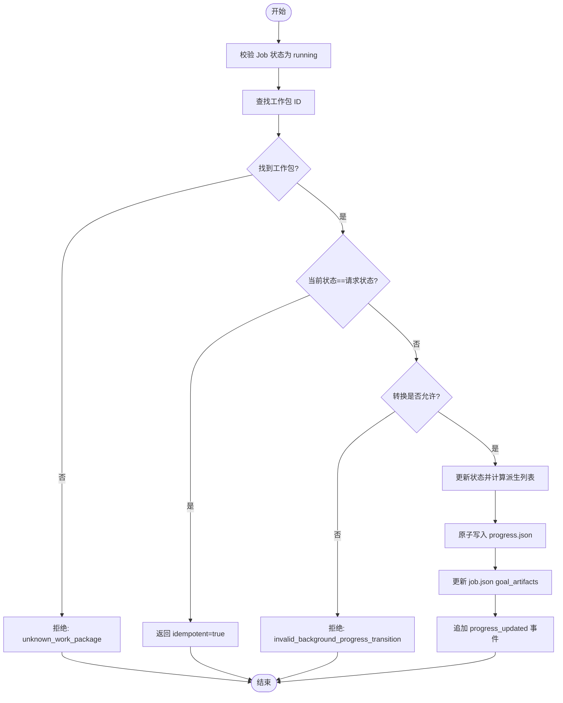
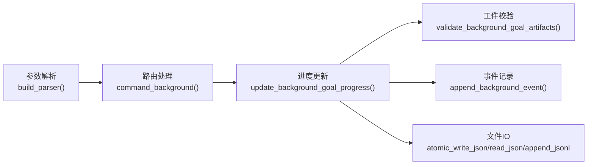

# background progress命令

<cite>
**本文引用的文件**   
- [scripts/harness.py](file://scripts/harness.py)
- [tests/test_harness.py](file://tests/test_harness.py)
</cite>

## 目录
1. [简介](#简介)
2. [项目结构](#项目结构)
3. [核心组件](#核心组件)
4. [架构总览](#架构总览)
5. [详细组件分析](#详细组件分析)
6. [依赖关系分析](#依赖关系分析)
7. [性能与一致性](#性能与一致性)
8. [故障排查指南](#故障排查指南)
9. [结论](#结论)
10. [附录：使用示例与最佳实践](#附录使用示例与最佳实践)

## 简介
background progress命令用于在复杂后台任务（Goal）执行过程中，更新其工作包的工作状态。该命令支持将单个工作包推进到 in_progress、completed、blocked 等状态，并维护完成/剩余工作包清单的一致性。它要求目标 Job 处于 running 状态，且仅对复杂执行路线生效；同时提供幂等更新与严格的转换规则校验，确保并发安全与可审计性。

## 项目结构
本命令属于统一后台控制器的一部分，位于脚本入口中，通过命令行参数解析进入 background 子命令的 progress 动作，最终调用进度更新函数。

**图表来源** 
- [scripts/harness.py:10450-10560](file://scripts/harness.py#L10450-L10560)
- [scripts/harness.py:8920-9119](file://scripts/harness.py#L8920-L9119)
- [scripts/harness.py:8520-8719](file://scripts/harness.py#L8520-L8719)

**章节来源**
- [scripts/harness.py:10450-10560](file://scripts/harness.py#L10450-L10560)
- [scripts/harness.py:8920-9119](file://scripts/harness.py#L8920-L9119)

## 核心组件
- 命令定义与参数
  - 子命令：background
  - 动作：progress
  - 必需参数：--target, --job-id, --work-package-id, --work-package-status
  - 可选参数：--reason-code（受控原因码）
- 状态集合与转换规则
  - 允许的状态值：in_progress、completed、blocked
  - 允许的转换：pending→in_progress/blocked；in_progress→completed/blocked；completed/blocked不可再变更
- 数据模型与持久化
  - 进度文件：progress.json（包含 work_package_states、completed_work_packages、remaining_work_packages）
  - Job 工件：job.json（goal_artifacts 记录 plan/progress 指纹与 attempt）
  - 事件日志：events.jsonl（记录 progress_updated/progress_rejected 等）

**章节来源**
- [scripts/harness.py:10450-10560](file://scripts/harness.py#L10450-L10560)
- [scripts/harness.py:8520-8719](file://scripts/harness.py#L8520-L8719)
- [scripts/harness.py:7500-7699](file://scripts/harness.py#L7500-L7699)

## 架构总览
下图展示了从 CLI 到进度更新的完整调用链，以及关键的数据读写位置。

**图表来源** 
- [scripts/harness.py:10450-10560](file://scripts/harness.py#L10450-L10560)
- [scripts/harness.py:8920-9119](file://scripts/harness.py#L8920-L9119)
- [scripts/harness.py:8520-8719](file://scripts/harness.py#L8520-L8719)
- [scripts/harness.py:7554-7578](file://scripts/harness.py#L7554-L7578)

## 详细组件分析

### 参数与校验
- 参数
  - --job-id：后台任务 ID，必须与进度/方案绑定一致
  - --work-package-id：冻结方案中的工作包 ID
  - --work-package-status：目标状态，仅限 in_progress、completed、blocked
  - --reason-code：可选的原因码，需匹配受控正则
- 前置校验
  - 仅复杂执行路线（background_goal、background_goal_phased）需要 Goal 进度
  - Job 必须为 running 状态
  - 工作包 ID 必须在冻结方案中存在
  - reason-code 若提供，必须符合长度与字符限制的正则

**章节来源**
- [scripts/harness.py:10450-10560](file://scripts/harness.py#L10450-L10560)
- [scripts/harness.py:8520-8719](file://scripts/harness.py#L8520-L8719)

### 状态机与转换规则
- 允许转换
  - pending → in_progress / blocked
  - in_progress → completed / blocked
  - completed / blocked 为终态，不允许再变更
- 非法转换
  - 倒退或跳过执行将被拒绝，并记录 progress_rejected 事件

**图表来源** 
- [scripts/harness.py:8520-8719](file://scripts/harness.py#L8520-L8719)

**章节来源**
- [scripts/harness.py:8520-8719](file://scripts/harness.py#L8520-L8719)

### 幂等性与并发安全
- 幂等性
  - 当请求状态与当前状态一致时，直接返回 idempotent=true，不重复写盘
- 并发安全
  - 使用原子写入（先写临时文件后替换）保证 progress.json 与 job.json 的写入一致性
  - 事件日志采用追加模式，避免覆盖历史
  - 验证 Goal 工件指纹（attempt、plan_fingerprint、progress_fingerprint）防止漂移篡改

**章节来源**
- [scripts/harness.py:8520-8719](file://scripts/harness.py#L8520-L8719)
- [scripts/harness.py:7500-7699](file://scripts/harness.py#L7500-L7699)

### 与整体进度的同步与一致性
- 派生列表
  - completed_work_packages：所有状态为 completed 的工作包 ID 列表
  - remaining_work_packages：非 completed 的工作包 ID 列表
- 工件指纹
  - goal_artifacts 记录 plan/progress 的指纹与 attempt，供后续 verify 阶段校验
- 事件审计
  - progress_updated：成功更新
  - progress_rejected：拒绝更新（未知工作包或非法转换）

**章节来源**
- [scripts/harness.py:8520-8719](file://scripts/harness.py#L8520-L8719)
- [scripts/harness.py:7500-7699](file://scripts/harness.py#L7500-L7699)

## 依赖关系分析
- 内部依赖
  - 参数解析模块：构建 background 子命令与 progress 动作的参数
  - 进度校验模块：validate_background_goal_artifacts 校验工件一致性
  - 事件模块：append_background_event 记录审计事件
  - 文件 IO：atomic_write_json、read_json、append_jsonl
- 外部约束
  - 仅复杂执行路线需要 Goal 进度
  - Job 状态必须为 running
  - 工作包 ID 必须在冻结方案中存在

**图表来源** 
- [scripts/harness.py:10450-10560](file://scripts/harness.py#L10450-L10560)
- [scripts/harness.py:8920-9119](file://scripts/harness.py#L8920-L9119)
- [scripts/harness.py:8520-8719](file://scripts/harness.py#L8520-L8719)
- [scripts/harness.py:7554-7578](file://scripts/harness.py#L7554-L7578)

**章节来源**
- [scripts/harness.py:10450-10560](file://scripts/harness.py#L10450-L10560)
- [scripts/harness.py:8920-9119](file://scripts/harness.py#L8920-L9119)
- [scripts/harness.py:8520-8719](file://scripts/harness.py#L8520-L8719)

## 性能与一致性
- 原子写入减少部分写入风险，提升可靠性
- 幂等路径避免重复 I/O，降低负载
- 事件追加模式具备高吞吐与顺序性
- 工件指纹校验保障跨步骤一致性，避免脏读/脏写

[本节为通用指导，无需引用具体文件]

## 故障排查指南
- 常见错误码与含义
  - missing_background_progress：缺少必要参数（work-package-id/work-package-status）
  - invalid_background_job_transition：Job 不是 running 状态
  - invalid_background_progress：状态值不在允许集合内
  - invalid_background_reason_code：reason-code 不符合正则
  - unknown_background_work_package：工作包 ID 不存在于冻结方案
  - invalid_background_progress_transition：非法状态转换（倒退/跳过）
- 定位方法
  - 检查 events.jsonl 中的 progress_rejected/progress_updated 事件
  - 核对 progress.json 的 work_package_states 与派生列表
  - 核对 job.json 的 goal_artifacts 指纹与 attempt

**章节来源**
- [scripts/harness.py:8920-9119](file://scripts/harness.py#L8920-L9119)
- [scripts/harness.py:8520-8719](file://scripts/harness.py#L8520-L8719)
- [scripts/harness.py:7554-7578](file://scripts/harness.py#L7554-L7578)

## 结论
background progress命令为复杂后台任务的细粒度进度管理提供了强一致、幂等、可审计的能力。通过严格的状态机与工件指纹校验，确保在多并发与重试场景下的正确性与可追溯性。建议宿主在编排工作包生命周期时遵循“准备→进行中→完成/阻塞”的标准流程，并在异常路径及时标记 blocked 并记录原因码。

[本节为总结，无需引用具体文件]

## 附录：使用示例与最佳实践
- 基本用法
  - 将工作包推进至进行中：
    - 命令：background progress --target <项目根> --job-id <任务ID> --work-package-id <工作包ID> --work-package-status in_progress
  - 将工作包标记为完成：
    - 命令：background progress --target <项目根> --job-id <任务ID> --work-package-id <工作包ID> --work-package-status completed
  - 将工作包标记为阻塞：
    - 命令：background progress --target <项目根> --job-id <任务ID> --work-package-id <工作包ID> --work-package-status blocked
- 带原因码的阻塞
  - 命令：background progress --target <项目根> --job-id <任务ID> --work-package-id <工作包ID> --work-package-status blocked --reason-code <受控原因码>
- 最佳实践
  - 始终在 prepare 之后进行 progress 更新
  - 对每个工作包按顺序推进：pending→in_progress→completed
  - 遇到不可恢复问题立即标记 blocked，并附带 reason-code
  - 利用幂等特性安全重试，避免重复写盘
  - 验收前确保 completed_work_packages 等于全部工作包集合

**章节来源**
- [tests/test_harness.py:170-182](file://tests/test_harness.py#L170-L182)
- [scripts/harness.py:10450-10560](file://scripts/harness.py#L10450-L10560)
- [scripts/harness.py:8520-8719](file://scripts/harness.py#L8520-L8719)