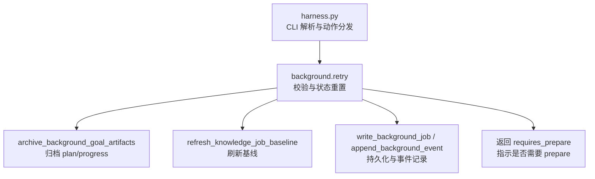
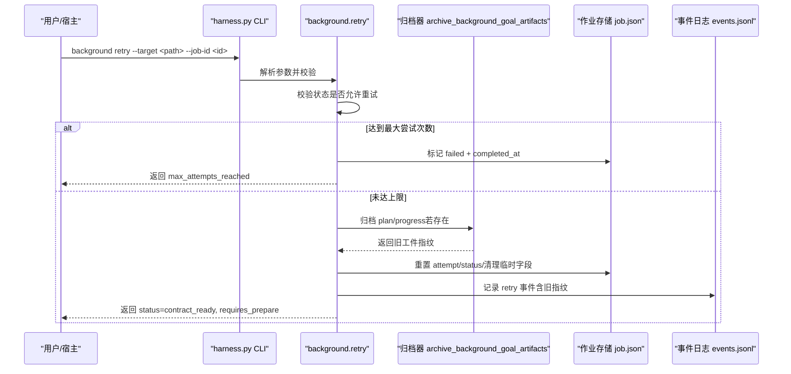
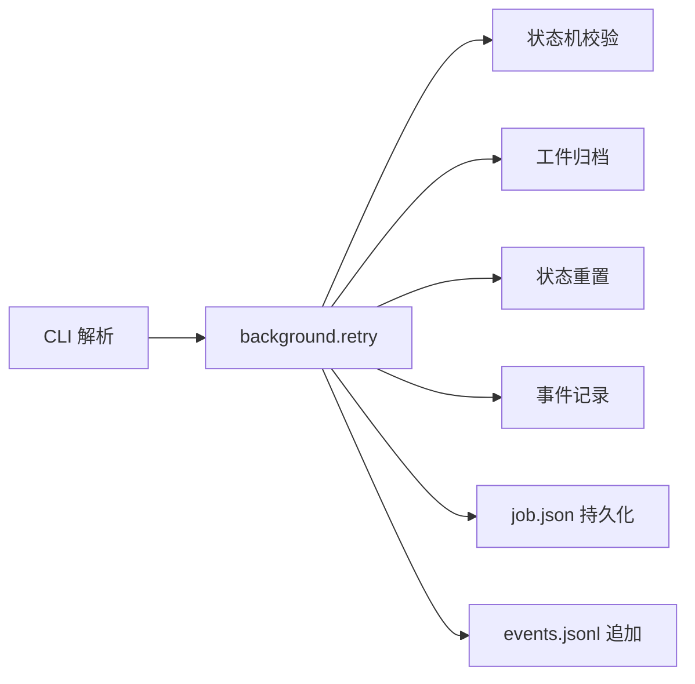

# background retry命令

<cite>
**本文引用的文件**   
- [scripts/harness.py](file://scripts/harness.py)
- [tests/test_harness.py](file://tests/test_harness.py)
</cite>

## 目录
1. [简介](#简介)
2. [项目结构](#项目结构)
3. [核心组件](#核心组件)
4. [架构总览](#架构总览)
5. [详细组件分析](#详细组件分析)
6. [依赖关系分析](#依赖关系分析)
7. [性能考量](#性能考量)
8. [故障排查指南](#故障排查指南)
9. [结论](#结论)
10. [附录](#附录)

## 简介
本文件为 Docs Harness 的 background retry 命令提供完整的 API 文档。该命令用于重试失败的后台任务（Job），在重试前会归档旧 attempt 工件并清理状态，随后将 Job 重置为可重新准备与执行的状态。对于治理类 Job，还会重建文档路由合同；对复杂执行路线的 Job，需要再次调用 prepare 生成/修复 plan 与 progress 工件后进入运行阶段。

## 项目结构
- 入口脚本：scripts/harness.py
- 测试用例：tests/test_harness.py
- 后台控制面运行时根：.docs-harness/background/jobs/<job_id>
- 工件归档位置：<job_id>/attempts/attempt-NNN/archive-NNN

**图表来源** 
- [scripts/harness.py:9012-9053](file://scripts/harness.py#L9012-L9053)
- [scripts/harness.py:8432-8458](file://scripts/harness.py#L8432-L8458)

**章节来源**
- [scripts/harness.py:9012-9053](file://scripts/harness.py#L9012-L9053)
- [scripts/harness.py:8432-8458](file://scripts/harness.py#L8432-L8458)

## 核心组件
- CLI 参数与动作分发：background 子命令支持 retry，要求 --target 与 --job-id
- 状态机与约束：仅允许特定状态重试，超过最大尝试次数直接失败
- 工件归档：自动归档 plan.json 与 progress.json，保留指纹
- 状态重置：清除 rebase/completed_at/goal_artifacts/prepared_at 等字段，重置 attempt
- 知识基线刷新：确保后续 prepare/verify 使用最新基线
- 事件记录：append_background_event 记录 retry、old_plan_fingerprint、old_progress_fingerprint
- 治理 Job 特殊处理：重建 document_route_contract，必要时更新 allowed_read/write_scope

**章节来源**
- [scripts/harness.py:9012-9053](file://scripts/harness.py#L9012-L9053)
- [scripts/harness.py:8316-8370](file://scripts/harness.py#L8316-L8370)
- [scripts/harness.py:8432-8458](file://scripts/harness.py#L8432-L8458)

## 架构总览
retry 的核心流程如下：

**图表来源** 
- [scripts/harness.py:9012-9053](file://scripts/harness.py#L9012-L9053)
- [scripts/harness.py:8432-8458](file://scripts/harness.py#L8432-L8458)

## 详细组件分析

### 命令接口与参数
- 命令：background retry
- 必需参数：
  - --target：项目目标路径（安全校验）
  - --job-id：后台作业 ID（格式校验）
- 可选参数：无（治理 Job 的重试由内部逻辑决定）

返回值关键字段：
- action: "retry"
- job_id: 作业 ID
- status: 新状态（通常为 contract_ready）
- attempt: 新的尝试次数
- reason_code: 如 "max_attempts_reached"
- requires_prepare: 是否需要调用 background prepare

**章节来源**
- [scripts/harness.py:9012-9053](file://scripts/harness.py#L9012-L9053)

### 重试约束与限制规则
- 允许重试的状态集合：needs_user_input、needs_rebase、queued_manual、failed
- 治理 Job（delivery_governance）：必须处于允许重试状态或 failed，否则拒绝
- 非治理 Job：同样受限于允许重试状态集合
- 最大尝试次数：默认 3，达到上限时直接标记 failed 并返回 reason_code="max_attempts_reached"
- 复杂执行路线（background_goal、background_goal_phased）：requires_prepare=true，需先 prepare
- 直接执行路线（background_direct）：不需要 prepare

**章节来源**
- [scripts/harness.py:9012-9053](file://scripts/harness.py#L9012-L9053)
- [scripts/harness.py:98-126](file://scripts/harness.py#L98-L126)

### 工件归档与数据清理
- 归档触发条件：plan.json 或 progress.json 存在
- 归档内容：plan.json、progress.json 拷贝至 attempts/attempt-NNN/archive-NNN，并删除原文件
- 归档元数据：archive.json 包含 schema_version、job_id、attempt、reason_code、plan_fingerprint、progress_fingerprint
- 清理字段：rebase_reason_code、rebase_changed_paths、completed_at、goal_artifacts、prepared_at、legacy_goal_artifacts_accepted
- 状态重置：attempt+1，status=contract_ready，updated_at=当前时间

**章节来源**
- [scripts/harness.py:8432-8458](file://scripts/harness.py#L8432-L8458)
- [scripts/harness.py:9032-9044](file://scripts/harness.py#L9032-L9044)

### 知识基线与版本管理交互
- 基线刷新：refresh_knowledge_job_baseline(target, job) 确保后续 prepare/verify 基于最新基线
- 知识地图指纹：知识类 Job 在验收更新时会写入 knowledge_map_fingerprint
- 工件版本：goal_artifacts 包含 artifact_revision、attempt、plan_fingerprint、progress_fingerprint，用于幂等校验

**章节来源**
- [scripts/harness.py:9043-9044](file://scripts/harness.py#L9043-L9044)
- [scripts/harness.py:9154-9158](file://scripts/harness.py#L9154-L9158)

### 治理 Job 的特殊处理
- 重建文档路由合同：resolve_document_routes(target, required_kinds)
- 更新读写范围：allowed_read_scope、allowed_write_scope
- 记录路由合同指纹：route_contract_fingerprint
- 可能触发 needs_user_input：当路由合同未解析成功

**章节来源**
- [scripts/harness.py:8316-8370](file://scripts/harness.py#L8316-L8370)

### 事件记录与审计
- 事件类型：retry、document_route_retry、legacy_route_contract_repaired
- 事件字段：action、job_id、status、reason_code、old_plan_fingerprint、old_progress_fingerprint
- 用途：审计重试原因、工件变更、路由合同变化

**章节来源**
- [scripts/harness.py:9045-9049](file://scripts/harness.py#L9045-L9049)
- [scripts/harness.py:8359-8369](file://scripts/harness.py#L8359-L8369)

### 最佳实践与注意事项
- 重试前确认失败原因：检查 events.jsonl 与 reason_code
- 复杂路线必须先 prepare：根据 requires_prepare 决定是否调用 background prepare
- 避免频繁重试：达到最大尝试次数后将无法继续重试
- 治理 Job 注意路由合同：若路由未解析成功，可能需要人工介入
- 工件归档不可逆：归档后原工件被删除，如需恢复请从 attempts 目录恢复

**章节来源**
- [scripts/harness.py:9012-9053](file://scripts/harness.py#L9012-L9053)
- [scripts/harness.py:8432-8458](file://scripts/harness.py#L8432-L8458)

## 依赖关系分析
- CLI 层：解析参数、调用 background.retry
- 业务层：状态校验、工件归档、状态重置、事件记录
- 存储层：job.json、events.jsonl、attempts/*
- 外部依赖：Git（用于工作区快照与引用验证）、文件系统（原子写入与归档）

**图表来源** 
- [scripts/harness.py:9012-9053](file://scripts/harness.py#L9012-L9053)
- [scripts/harness.py:8432-8458](file://scripts/harness.py#L8432-L8458)

**章节来源**
- [scripts/harness.py:9012-9053](file://scripts/harness.py#L9012-L9053)
- [scripts/harness.py:8432-8458](file://scripts/harness.py#L8432-L8458)

## 性能考量
- 工件归档涉及文件复制与哈希计算，建议批量重试时注意 I/O 开销
- 事件记录采用追加模式，避免全量读取与重写
- 状态锁机制防止并发冲突，但重试前应确保无其他进程持有锁
- 知识基线刷新可能触发 Git 操作，注意网络与磁盘延迟

[本节为通用指导，不直接分析具体文件]

## 故障排查指南
- 错误码：invalid_background_retry（状态不允许重试）、max_attempts_reached（达到最大尝试次数）、unsafe_background_runtime（路径不安全）
- 常见原因：
  - 作业状态不在允许重试集合
  - 已达到最大尝试次数
  - 目标路径或作业 ID 无效
- 排查步骤：
  - 检查 events.jsonl 中的 retry 事件与 reason_code
  - 查看 attempts 目录确认工件归档情况
  - 确认 requires_prepare 是否为 true，必要时调用 prepare
  - 治理 Job 检查 document_route_contract 是否解析成功

**章节来源**
- [scripts/harness.py:9012-9053](file://scripts/harness.py#L9012-L9053)
- [scripts/harness.py:8432-8458](file://scripts/harness.py#L8432-L8458)

## 结论
background retry 命令提供了安全、可审计的后台任务重试机制。通过严格的狀態校验、工件归档与状态重置，确保重试过程的可重复性与一致性。结合 prepare 流程与知识基线刷新，系统能够正确处理复杂执行路线与治理需求。建议使用者遵循最佳实践，合理设置重试策略，并在遇到治理或路由问题时及时人工介入。

[本节为总结性内容，不直接分析具体文件]

## 附录
- 相关测试用例参考：
  - test_background_retry_stops_at_max_attempts
  - test_v161_retry_archives_attempt_and_summary_index_keeps_each_attempt
  - test_v162_unresolved_governance_job_is_zero_write_idempotent_and_retryable

**章节来源**
- [tests/test_harness.py:1922-1932](file://tests/test_harness.py#L1922-L1932)
- [tests/test_harness.py:2177](file://tests/test_harness.py#L2177)
- [tests/test_harness.py:4905](file://tests/test_harness.py#L4905)
- [tests/test_harness.py:4970](file://tests/test_harness.py#L4970)