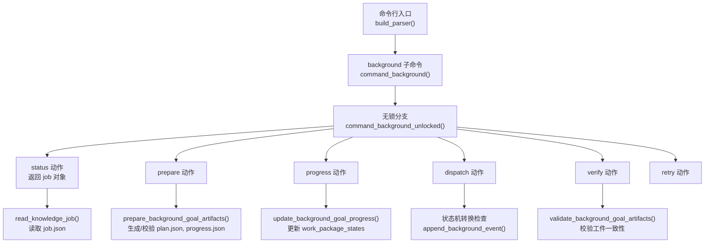
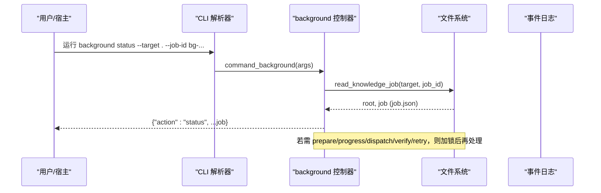
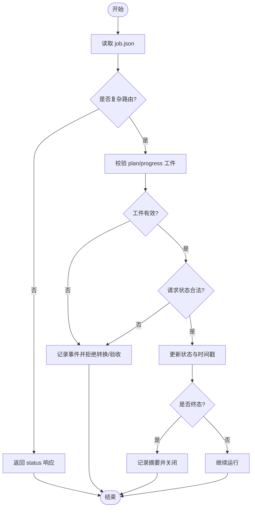
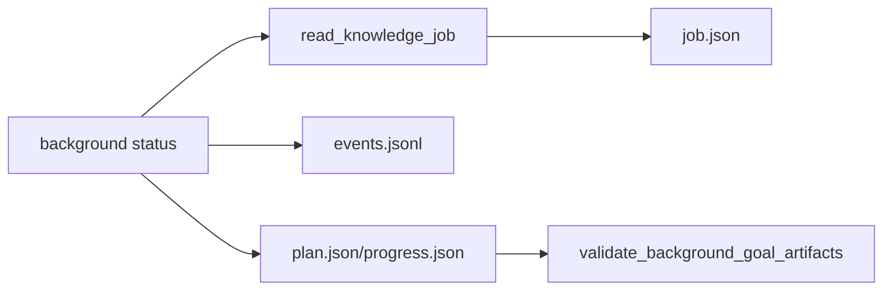

# background status命令

<cite>
**本文引用的文件**   
- [scripts/harness.py](file://scripts/harness.py)
- [tests/test_harness.py](file://tests/test_harness.py)
</cite>

## 目录
1. [简介](#简介)
2. [项目结构](#项目结构)
3. [核心组件](#核心组件)
4. [架构总览](#架构总览)
5. [详细组件分析](#详细组件分析)
6. [依赖关系分析](#依赖关系分析)
7. [性能考虑](#性能考虑)
8. [故障排查指南](#故障排查指南)
9. [结论](#结论)
10. [附录](#附录)

## 简介
本文件为 Docs Harness 的 background status 命令提供完整的 API 文档。该命令用于获取指定后台任务（Job）的完整状态信息，包括 job.json、plan.json、progress.json 与 events.jsonl 的内容与一致性校验结果。通过该命令，用户可以：
- 查看 Job 当前状态、生命周期时间戳、重试次数、执行路由与工作包清单等关键元数据；
- 监控复杂后台任务的计划与进度，定位阻塞的工作包；
- 诊断问题并依据事件日志进行排错；
- 结合状态机转换规则判断下一步操作（如 prepare、dispatch、verify、retry）。

## 项目结构
background status 属于 background 子命令族，由统一入口解析参数后进入后台控制器处理流程。相关实现集中在脚本文件中，测试用例覆盖了常见使用路径与边界情况。

图表来源
- [scripts/harness.py:8821-8830](file://scripts/harness.py#L8821-L8830)
- [scripts/harness.py:8830-9176](file://scripts/harness.py#L8830-L9176)
- [scripts/harness.py:7285-7308](file://scripts/harness.py#L7285-L7308)
- [scripts/harness.py:7443-7482](file://scripts/harness.py#L7443-L7482)

章节来源
- [scripts/harness.py:8821-8830](file://scripts/harness.py#L8821-L8830)
- [scripts/harness.py:8830-9176](file://scripts/harness.py#L8830-L9176)
- [scripts/harness.py:7285-7308](file://scripts/harness.py#L7285-L7308)
- [scripts/harness.py:7443-7482](file://scripts/harness.py#L7443-L7482)

## 核心组件
- 命令解析与分发
  - build_parser：定义 background 子命令及其参数（--target、--job-id、--work-package-id、--work-package-status、--reason-code、--repair、--assessment、--result、--older-than、--apply、--dry-run 等）。
  - command_background：对需要加锁的动作（prepare、progress、dispatch、retry、verify）先读取 Job 根目录并加锁，再调用 unlocked 分支。
- 状态查询（status）
  - command_background_unlocked：当 action=“status”时，直接读取 job.json 并返回其内容作为响应体。
- 工件与进度
  - prepare_background_goal_artifacts：为复杂执行路由准备 plan.json 与 progress.json，并记录工件指纹。
  - update_background_goal_progress：推进工作包状态（pending/in_progress/completed/blocked），写入 progress.json。
- 事件日志
  - append_background_event：追加一行 JSON 到 events.jsonl，记录状态转换、拒绝、验收等事件。
- 工件校验
  - validate_background_goal_artifacts：校验 plan.json 与 progress.json 的一致性、版本与指纹，确保未被篡改。

章节来源
- [scripts/harness.py:10455-10469](file://scripts/harness.py#L10455-L10469)
- [scripts/harness.py:8821-8830](file://scripts/harness.py#L8821-L8830)
- [scripts/harness.py:8900-8904](file://scripts/harness.py#L8900-L8904)
- [scripts/harness.py:7443-7482](file://scripts/harness.py#L7443-L7482)
- [scripts/harness.py:7554-7568](file://scripts/harness.py#L7554-L7568)

## 架构总览
background status 的核心职责是只读地聚合 Job 的状态与工件信息，供上层宿主或运维工具消费。其数据源包括：
- job.json：Job 主契约，包含状态、路由、工作包、时间戳、指纹等；
- plan.json：冻结的执行计划（复杂路由下存在）；
- progress.json：工作包进度与状态（复杂路由下存在）；
- events.jsonl：事件日志，按时间顺序记录状态变更与异常。

图表来源
- [scripts/harness.py:8821-8830](file://scripts/harness.py#L8821-L8830)
- [scripts/harness.py:7285-7308](file://scripts/harness.py#L7285-L7308)

## 详细组件分析

### 命令参数与用法
- 基本参数
  - --target：项目目标目录（默认当前目录）
  - --json：以 JSON 格式输出
- background 专用参数
  - --job-id：必填（除 estimate/list/prune 外），指定要查询的后台 Job ID
  - --work-package-id / --work-package-status：用于 progress 动作
  - --reason-code：有界原因码
  - --repair：显式修复无效 Goal 工件
  - --assessment：重大发现报告或知识评估文件
  - --result：updated/no_change/completed_with_finding
  - --older-than / --apply / --dry-run：prune 清理控制

章节来源
- [scripts/harness.py:10455-10469](file://scripts/harness.py#L10455-L10469)

### 输入校验与错误处理
- job-id 校验
  - 支持 v2 与兼容旧版 schema；读取失败或合同不匹配会抛出错误并返回错误码。
- 只读语义
  - status 动作仅读取 job.json，不会修改任何工件或索引。
- 常见错误码
  - invalid_knowledge_job：job.json 合同无效或缺失
  - missing_background_job：缺少 --job-id
  - invalid_json / invalid_state：JSON 解析或事件行格式错误（在其它动作中触发）

章节来源
- [scripts/harness.py:7285-7308](file://scripts/harness.py#L7285-L7308)
- [scripts/harness.py:8900-8904](file://scripts/harness.py#L8900-L8904)

### 输出结构与字段说明
- 顶层字段
  - action：固定为 "status"
  - 其余字段即 job.json 的全部键值（见下方 Job 字段表）
- 典型字段（节选）
  - job_id：后台任务唯一标识
  - task_kind：knowledge_bootstrap/knowledge_incremental_sync/delivery_governance/critical_followup
  - execution_route：background_direct/background_goal/background_goal_phased
  - status：当前状态（见状态机）
  - attempt/max_attempts：重试计数与上限
  - created_at/dispatched_at/started_at/updated_at/completed_at：时间戳
  - goal_contract/work_packages：复杂路由下的目标与冻结工作包
  - knowledge_base_snapshot/base_fingerprints：基线与指纹快照
  - dependency_job_ids：依赖 Job 列表
  - allowed_read_scope/allowed_write_scope：读写范围约束

章节来源
- [scripts/harness.py:7285-7308](file://scripts/harness.py#L7285-L7308)
- [scripts/harness.py:7443-7482](file://scripts/harness.py#L7443-L7482)

### 状态机与转换规则
- 已知状态集合
  - 终态：updated、no_change、completed_with_finding、failed、cancelled
  - 中间态：contract_ready、dispatched、running、waiting_for_dependency、waiting_for_bootstrap_merge、needs_user_input、needs_rebase、queued_manual
- 可重试状态
  - needs_user_input、needs_rebase、queued_manual
- 典型转换
  - contract_ready → dispatched → running → updated/no_change/completed_with_finding/failed/cancelled
  - waiting_for_dependency → contract_ready（依赖完成）
  - running → needs_rebase（基线变化）、needs_user_input（需人工介入）
  - failed/needs_user_input/needs_rebase/cancelled → 释放锁并可能唤醒等待者

章节来源
- [scripts/harness.py:100-117](file://scripts/harness.py#L100-L117)
- [scripts/harness.py:8934-9011](file://scripts/harness.py#L8934-L9011)

### 工作包状态与进度
- 工作包状态枚举
  - pending、in_progress、completed、blocked
- 进度文件
  - progress.json 包含 work_package_states、completed_work_packages、remaining_work_packages 等
- 进度推进
  - 通过 background progress 动作更新单个工作包状态；status 仅展示当前快照

章节来源
- [scripts/harness.py:126](file://scripts/harness.py#L126)
- [scripts/harness.py:7443-7482](file://scripts/harness.py#L7443-L7482)

### 事件日志结构
- 文件位置
  - 每个 Job 根目录下 events.jsonl，每行一个 JSON 对象
- 常见事件类型
  - transition_rejected、verify_rejected、legacy_goal_artifacts_accepted、retry、以及各状态名（如 dispatched、running、failed 等）
- 用途
  - 审计状态转换、定位拒绝原因、追踪重试与工件接受历史

章节来源
- [scripts/harness.py:7554-7568](file://scripts/harness.py#L7554-L7568)

### 工件一致性校验
- 校验目标
  - plan.json 与 progress.json 的版本、attempt、指纹一致且未被篡改
- 校验时机
  - dispatch 进入 running 前（复杂路由）、verify 验收时
- 失败影响
  - 拒绝转换或验收，并记录事件

章节来源
- [scripts/harness.py:7472-7482](file://scripts/harness.py#L7472-L7482)
- [scripts/harness.py:9054-9099](file://scripts/harness.py#L9054-L9099)

### 使用示例
- 查询 Job 状态
  - 命令：harness.py background status --target <项目目录> --job-id bg-YYYYMMDDTHHMMSS-XXXXXXXXXX --json
  - 输出：{"action":"status", ...job.json 字段}
- 监控复杂任务进度
  - 先运行 background prepare --job-id ... 生成 plan.json/progress.json
  - 多次运行 background status --job-id ... 观察 status 与 work_package_states
  - 必要时运行 background progress --job-id ... --work-package-id wp-01 --work-package-status in_progress|completed|blocked
- 诊断问题
  - 查看 events.jsonl 中的 transition_rejected/verify_rejected 等事件，定位拒绝原因
  - 检查 base_fingerprints/knowledge_base_snapshot 是否因外部写入导致 needs_rebase

章节来源
- [scripts/harness.py:8900-8904](file://scripts/harness.py#L8900-L8904)
- [scripts/harness.py:7443-7482](file://scripts/harness.py#L7443-L7482)
- [scripts/harness.py:7554-7568](file://scripts/harness.py#L7554-L7568)

### 流程图：状态转换与验证

图表来源
- [scripts/harness.py:8934-9011](file://scripts/harness.py#L8934-L9011)
- [scripts/harness.py:9054-9099](file://scripts/harness.py#L9054-L9099)

## 依赖关系分析
- 内部依赖
  - read_knowledge_job：读取 job.json 并兼容旧版 schema
  - background_jobs_root/knowledge_job_dir：定位 Job 根目录
  - append_background_event：写入事件日志
  - validate_background_goal_artifacts：校验工件一致性
- 外部依赖
  - 文件系统（job.json、plan.json、progress.json、events.jsonl）
  - Git 与仓库身份（在其它动作中用于范围与基线校验）

图表来源
- [scripts/harness.py:7285-7308](file://scripts/harness.py#L7285-L7308)
- [scripts/harness.py:7472-7482](file://scripts/harness.py#L7472-L7482)
- [scripts/harness.py:7554-7568](file://scripts/harness.py#L7554-L7568)

章节来源
- [scripts/harness.py:7285-7308](file://scripts/harness.py#L7285-L7308)
- [scripts/harness.py:7472-7482](file://scripts/harness.py#L7472-L7482)
- [scripts/harness.py:7554-7568](file://scripts/harness.py#L7554-L7568)

## 性能考虑
- status 为只读操作，主要开销来自读取 job.json 与可选的工件文件；复杂度接近 O(1)。
- 对于大型项目，避免频繁轮询 events.jsonl 全量解析，建议增量读取尾部行。
- 复杂路由下工件校验涉及文件指纹计算，注意 I/O 成本。

## 故障排查指南
- 常见错误与处理
  - invalid_knowledge_job：确认 job.json 存在且 schema_version 与 job_id 匹配
  - missing_background_job：补充 --job-id 参数
  - invalid_background_job_transition：检查当前状态与请求状态的转换是否允许
  - incomplete_background_work_packages：确保所有工作包达到 required 状态
  - background_goal_artifacts_tampered：检查 plan.json/progress.json 是否被外部修改
- 定位步骤
  - 查看 events.jsonl 最近事件，确认拒绝原因
  - 对比 base_fingerprints/knowledge_base_snapshot 与实际文件差异
  - 对复杂路由，重新运行 background prepare 以重建工件

章节来源
- [scripts/harness.py:7285-7308](file://scripts/harness.py#L7285-L7308)
- [scripts/harness.py:8934-9011](file://scripts/harness.py#L8934-L9011)
- [scripts/harness.py:9054-9099](file://scripts/harness.py#L9054-L9099)

## 结论
background status 提供了稳定、只读的后台任务状态视图，结合 plan.json、progress.json 与 events.jsonl，能够全面掌握任务生命周期与执行细节。配合状态机规则与工件校验机制，可有效支撑自动化编排与人工排障。

## 附录
- 参考测试用例
  - tests/test_harness.py 中包含 background status 的多场景断言，覆盖简单/增量/后续任务等不同 task_kind 与状态流转。

章节来源
- [tests/test_harness.py:1908-2048](file://tests/test_harness.py#L1908-L2048)
- [tests/test_harness.py:4706-4967](file://tests/test_harness.py#L4706-L4967)