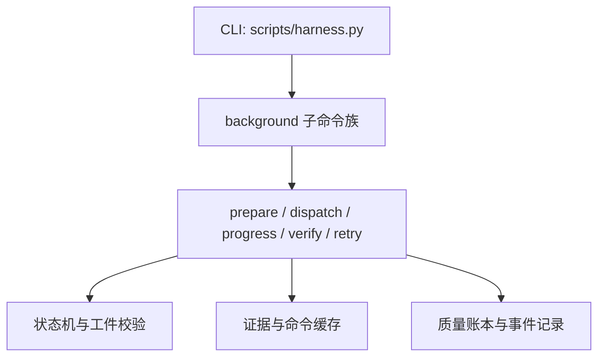
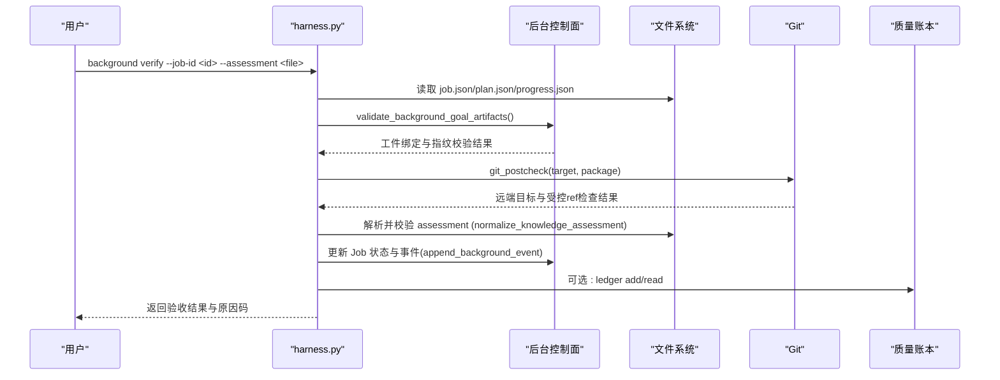
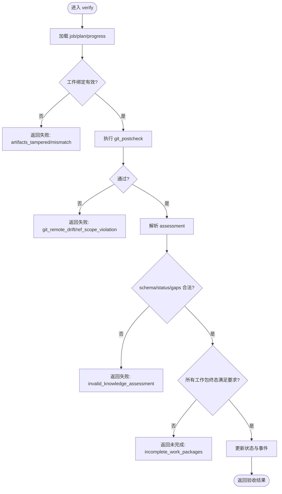
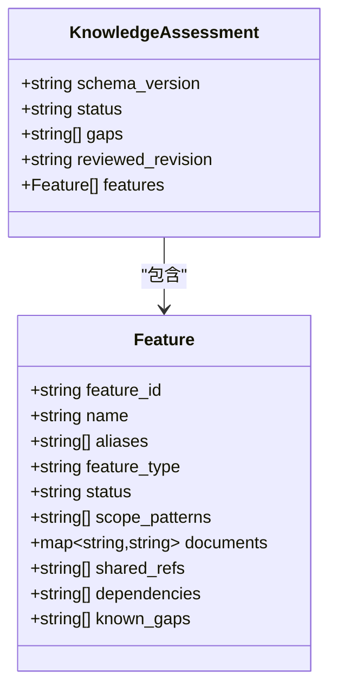
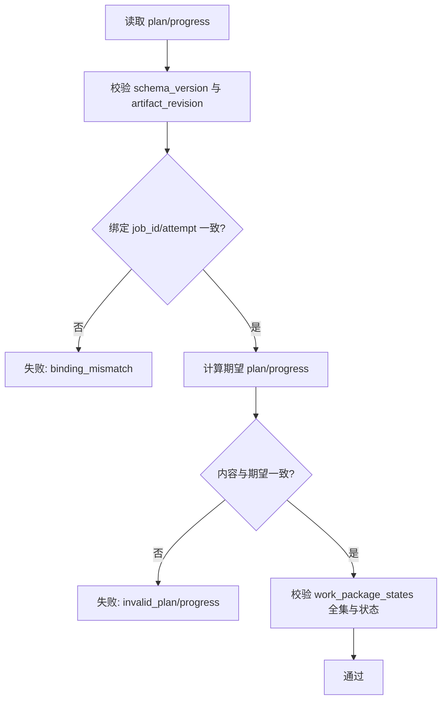
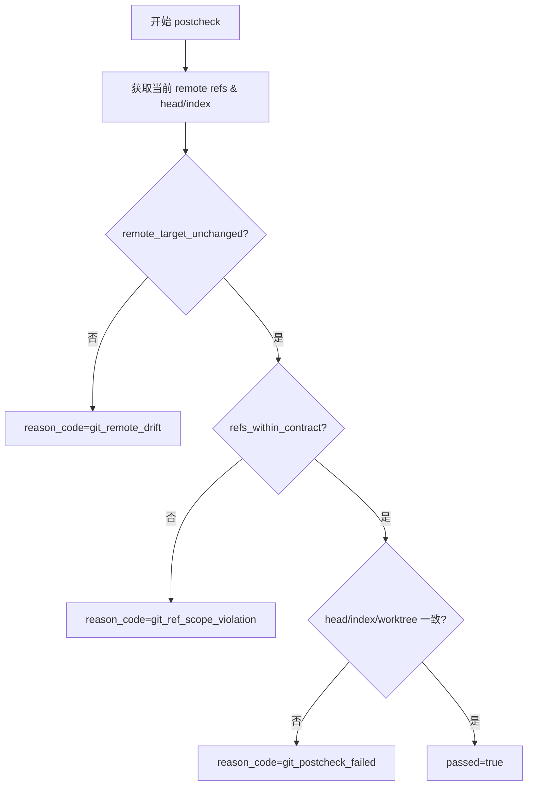
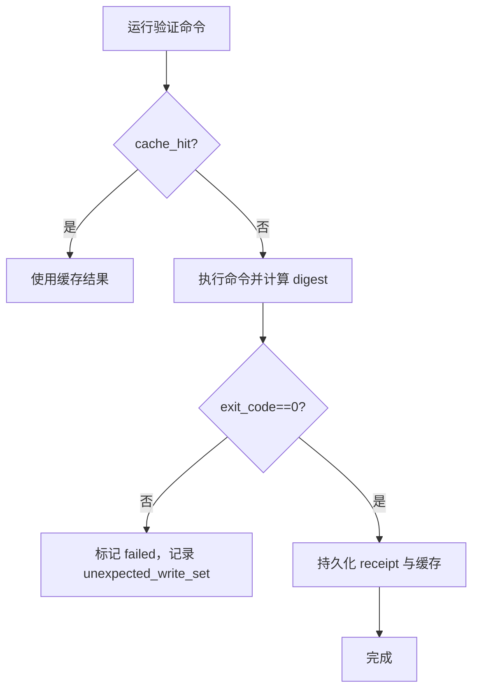
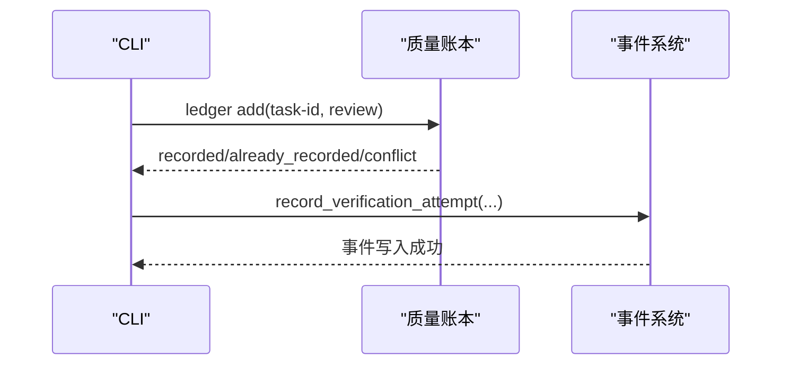
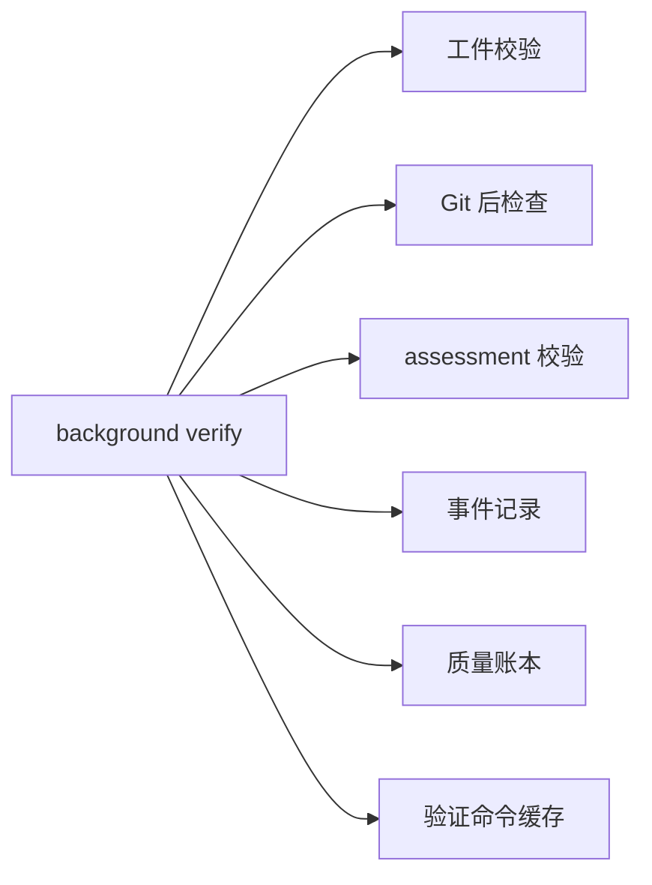

# background verify命令

<cite>
**本文引用的文件**   
- [scripts/harness.py](file://scripts/harness.py)
- [tests/test_harness.py](file://tests/test_harness.py)
- [SKILL.md](file://SKILL.md)
- [package.json](file://package.json)
</cite>

## 目录
1. [简介](#简介)
2. [项目结构](#项目结构)
3. [核心组件](#核心组件)
4. [架构总览](#架构总览)
5. [详细组件分析](#详细组件分析)
6. [依赖关系分析](#依赖关系分析)
7. [性能考虑](#性能考虑)
8. [故障排查指南](#故障排查指南)
9. [结论](#结论)
10. [附录](#附录)

## 简介
本文件为 Docs Harness 的 background verify 命令提供完整 API 文档。该命令用于对后台任务（Job）进行验收与质量评估，重点包括：
- 验收标准：工作包终态、进度一致性、工件指纹绑定、路由合同有效性等
- 评估文件格式与校验规则：assessment 文件的 schema、字段约束与语义校验
- 处理策略：updated/no_change/completed_with_finding/failed/cancelled 等终态判定与重试归档
- verification 阶段检查逻辑：Git 后检查、证据复用、命令缓存、增量准入与重新准入
- 错误分类与恢复机制：原因码、退出码、重试与修复流程
- 与质量账本和审计系统的集成：事件记录、遥测、质量记录写入与查询

## 项目结构
- 入口脚本：scripts/harness.py 实现全部 CLI 与业务逻辑
- 测试用例：tests/test_harness.py 覆盖 background verify 的典型路径
- 技能说明：SKILL.md 描述 background 子命令族的使用方式
- 包元数据：package.json 定义版本与脚本

图表来源
- [scripts/harness.py:72-86](file://scripts/harness.py#L72-L86)
- [SKILL.md:72-86](file://SKILL.md#L72-L86)

章节来源
- [scripts/harness.py:1-120](file://scripts/harness.py#L1-L120)
- [SKILL.md:60-90](file://SKILL.md#L60-L90)
- [package.json:1-23](file://package.json#L1-L23)

## 核心组件
- background verify 命令：接收 --job-id 与 --assessment，执行 Job 终态验证与质量评估
- assessment 文件：schema_version=docs-harness/knowledge-assessment/v1，包含 status、gaps、reviewed_revision、features 等
- 工件校验：plan.json/progress.json 绑定 job_id、attempt、artifact_revision、指纹一致性
- Git 后检查：git_postcheck 确保远端目标未漂移、受控 ref 范围不越界
- 证据与命令缓存：verification command receipts 与 cache，支持跳过已通过的命令
- 质量账本：quality ledger add/read，记录任务快照与复盘
- 事件与遥测：append_background_event、record_verification_attempt

章节来源
- [scripts/harness.py:45-58](file://scripts/harness.py#L45-L58)
- [scripts/harness.py:8000-8799](file://scripts/harness.py#L8000-L8799)
- [scripts/harness.py:7000-7799](file://scripts/harness.py#L7000-L7799)
- [SKILL.md:72-86](file://SKILL.md#L72-L86)

## 架构总览
background verify 的整体流程如下：

图表来源
- [scripts/harness.py:7485-7552](file://scripts/harness.py#L7485-L7552)
- [scripts/harness.py:796-878](file://scripts/harness.py#L796-L878)
- [scripts/harness.py:8206-8229](file://scripts/harness.py#L8206-L8229)
- [scripts/harness.py:7554-7578](file://scripts/harness.py#L7554-L7578)
- [scripts/harness.py:7165-7248](file://scripts/harness.py#L7165-L7248)

## 详细组件分析

### background verify 命令接口
- 参数
  - --target: 项目根目录
  - --job-id: 后台任务 ID（bg-YYYYMMDDTHHMMSS-xxxxxxxxxx）
  - --assessment: assessment 文件路径（JSON）
  - --json: JSON 输出
- 行为
  - 校验工件绑定与指纹（plan/progress/job）
  - 执行 Git 后检查（git_postcheck）
  - 解析并校验 assessment（schema_version、status、gaps、features）
  - 根据工作包终态与进度一致性判定验收结果
  - 记录事件与遥测；必要时触发重试或归档旧 attempt

图表来源
- [scripts/harness.py:7485-7552](file://scripts/harness.py#L7485-L7552)
- [scripts/harness.py:796-878](file://scripts/harness.py#L796-L878)
- [scripts/harness.py:8206-8229](file://scripts/harness.py#L8206-L8229)
- [scripts/harness.py:7554-7578](file://scripts/harness.py#L7554-L7578)

章节来源
- [SKILL.md:72-86](file://SKILL.md#L72-L86)
- [scripts/harness.py:7485-7552](file://scripts/harness.py#L7485-L7552)
- [scripts/harness.py:796-878](file://scripts/harness.py#L796-L878)
- [scripts/harness.py:8206-8229](file://scripts/harness.py#L8206-L8229)

### assessment 文件格式与校验规则
- schema_version: docs-harness/knowledge-assessment/v1
- status: 必须为 ready 或 partial
- gaps: 字符串数组；当 status=ready 时不得声明缺口
- reviewed_revision: 可选，知识地图审阅修订标识
- features: 功能列表，需符合 knowledge-map v1 规范（由 normalize_knowledge_map 校验）

图表来源
- [scripts/harness.py:8206-8229](file://scripts/harness.py#L8206-L8229)
- [scripts/harness.py:1529-1591](file://scripts/harness.py#L1529-L1591)

章节来源
- [scripts/harness.py:8206-8229](file://scripts/harness.py#L8206-L8229)
- [scripts/harness.py:1529-1591](file://scripts/harness.py#L1529-L1591)

### 工件与进度校验（复杂路线）
- plan.json/progress.json 必须绑定当前 job_id、attempt、artifact_revision
- 对于 revision 2，控制器会重算期望值并与实际比对
- 工作包全集一致性与状态合法性严格校验

图表来源
- [scripts/harness.py:7485-7552](file://scripts/harness.py#L7485-L7552)

章节来源
- [scripts/harness.py:7485-7552](file://scripts/harness.py#L7485-L7552)

### Git 后检查与漂移处理
- 检查远端目标 OID 是否变化
- 检查受控 ref 范围是否越界
- 针对 git_fetch/git_sync 分别校验 index/head/worktree 一致性
- LFS/Submodule 可用性校验

图表来源
- [scripts/harness.py:796-878](file://scripts/harness.py#L796-L878)

章节来源
- [scripts/harness.py:796-878](file://scripts/harness.py#L796-L878)

### 证据与验证命令缓存
- 验证命令结果持久化为 receipt，并通过 cache_key 去重
- 通过则缓存，失败或输入变化则重跑
- 支持 volatile_write_set 白名单，避免临时产物影响

图表来源
- [scripts/harness.py:6000-6072](file://scripts/harness.py#L6000-L6072)
- [scripts/harness.py:6074-6083](file://scripts/harness.py#L6074-L6083)
- [scripts/harness.py:6085-6133](file://scripts/harness.py#L6085-L6133)

章节来源
- [scripts/harness.py:6000-6072](file://scripts/harness.py#L6000-L6072)
- [scripts/harness.py:6074-6083](file://scripts/harness.py#L6074-L6083)
- [scripts/harness.py:6085-6133](file://scripts/harness.py#L6085-L6133)

### 质量账本与审计系统
- ledger add：将任务快照与复盘写入 quality-ledger/records
- ledger read：按 task-id 或关键词查询，限制扫描上限
- 事件与遥测：每次 verify 入口记录 verification_attempt，含 outcome_class、reason_codes、command_executed_count 等

图表来源
- [scripts/harness.py:7165-7248](file://scripts/harness.py#L7165-L7248)
- [scripts/harness.py:6410-6447](file://scripts/harness.py#L6410-L6447)

章节来源
- [scripts/harness.py:7165-7248](file://scripts/harness.py#L7165-L7248)
- [scripts/harness.py:6410-6447](file://scripts/harness.py#L6410-L6447)

### 验收标准与处理策略
- updated/no_change：revision 2 的 progress 中所有工作包必须为 completed
- completed_with_finding：仅允许 completed/blocked
- failed/cancelled：直接终态
- retry：归档旧 attempt 工件并要求重新 prepare，不继承完成进度
- 工件损坏或被篡改：仅允许显式 background prepare --repair 修复

章节来源
- [SKILL.md:84-90](file://SKILL.md#L84-L90)
- [scripts/harness.py:7485-7552](file://scripts/harness.py#L7485-L7552)

### 错误分类与恢复机制
- 退出码
  - 0：成功
  - 3：需要补充证据/重试/人工介入
  - 4：需要重新准入（full_readmission）
- 原因码
  - git_remote_drift、git_ref_scope_violation、invalid_knowledge_assessment、incomplete_work_packages 等
- 恢复
  - provide_evidence/refresh_evidence/retry_verification/incremental_admission/full_readmission
  - background prepare --repair 修复工件

章节来源
- [scripts/harness.py:6349-6395](file://scripts/harness.py#L6349-L6395)
- [scripts/harness.py:7485-7552](file://scripts/harness.py#L7485-L7552)

### 使用示例
- 基本用法
  - python3 scripts/harness.py background verify --target . --job-id bg-YYYYMMDDTHHMMSS-xxxxxxxxxx --assessment assessment.json --json
- 典型场景
  - 知识 bootstrap 完成后提交 assessment，verify 判定 updated/no_change
  - 治理 Job 变更文档路由合同后，verify 触发 needs_rebase/needs_user_input
  - 复杂路线下，先 prepare 生成 plan/progress，再 dispatch 到 running，最后 verify 验收

章节来源
- [SKILL.md:72-86](file://SKILL.md#L72-L86)
- [tests/test_harness.py:1974](file://tests/test_harness.py#L1974)
- [tests/test_harness.py:4826](file://tests/test_harness.py#L4826)

## 依赖关系分析
- background verify 依赖：
  - 工件校验：validate_background_goal_artifacts
  - Git 后检查：git_postcheck
  - assessment 校验：normalize_knowledge_assessment
  - 事件记录：append_background_event
  - 质量账本：ledger add/read
  - 命令缓存与证据持久化：run_verification_commands_cached/persist_*

图表来源
- [scripts/harness.py:7485-7552](file://scripts/harness.py#L7485-L7552)
- [scripts/harness.py:796-878](file://scripts/harness.py#L796-L878)
- [scripts/harness.py:8206-8229](file://scripts/harness.py#L8206-L8229)
- [scripts/harness.py:7554-7578](file://scripts/harness.py#L7554-L7578)
- [scripts/harness.py:7165-7248](file://scripts/harness.py#L7165-L7248)
- [scripts/harness.py:6000-6072](file://scripts/harness.py#L6000-L6072)

章节来源
- [scripts/harness.py:7485-7552](file://scripts/harness.py#L7485-L7552)
- [scripts/harness.py:796-878](file://scripts/harness.py#L796-L878)
- [scripts/harness.py:8206-8229](file://scripts/harness.py#L8206-L8229)
- [scripts/harness.py:7554-7578](file://scripts/harness.py#L7554-L7578)
- [scripts/harness.py:7165-7248](file://scripts/harness.py#L7165-L7248)
- [scripts/harness.py:6000-6072](file://scripts/harness.py#L6000-L6072)

## 性能考虑
- 验证命令缓存默认开启，可整体关闭（verification.command_cache_enabled=false）
- 只执行失败的命令或输入变化的命令，减少重复执行
- 非 Git 工作区快照有文件数量限制，避免过大基线
- 质量记录扫描上限限制，防止无索引全量扫描

章节来源
- [scripts/harness.py:1191-1203](file://scripts/harness.py#L1191-L1203)
- [scripts/harness.py:1115-1138](file://scripts/harness.py#L1115-L1138)
- [scripts/harness.py:7226-7228](file://scripts/harness.py#L7226-L7228)

## 故障排查指南
- 常见错误
  - 工件绑定不一致：检查 plan/progress 的 job_id/attempt/artifact_revision
  - Git 漂移：确认远端目标未变化且受控 ref 范围未越界
  - assessment 非法：检查 schema_version、status、gaps 与 features 规范
  - 工作包未完成：补齐 in_progress→completed 的状态转换
- 恢复步骤
  - 提供缺失证据或刷新失效证据
  - 重新准入（full_readmission）或增量准入（incremental_admission）
  - 使用 background prepare --repair 修复工件

章节来源
- [scripts/harness.py:6349-6395](file://scripts/harness.py#L6349-L6395)
- [scripts/harness.py:7485-7552](file://scripts/harness.py#L7485-L7552)
- [scripts/harness.py:8206-8229](file://scripts/harness.py#L8206-L8229)

## 结论
background verify 命令通过严格的工件绑定、Git 后检查与 assessment 校验，确保后台任务的终态与质量达标。结合证据与命令缓存、质量账本与事件系统，形成闭环的可审计验收流程。建议在生产环境中启用命令缓存与遥测，配合明确的错误分类与恢复策略，提升稳定性与可维护性。

## 附录
- 相关命令族参考：background list/status/prepare/dispatch/progress/verify/retry
- 版本信息：package.json 与 SKILL.md 中的版本号与使用说明

章节来源
- [SKILL.md:72-90](file://SKILL.md#L72-L90)
- [package.json:1-23](file://package.json#L1-L23)