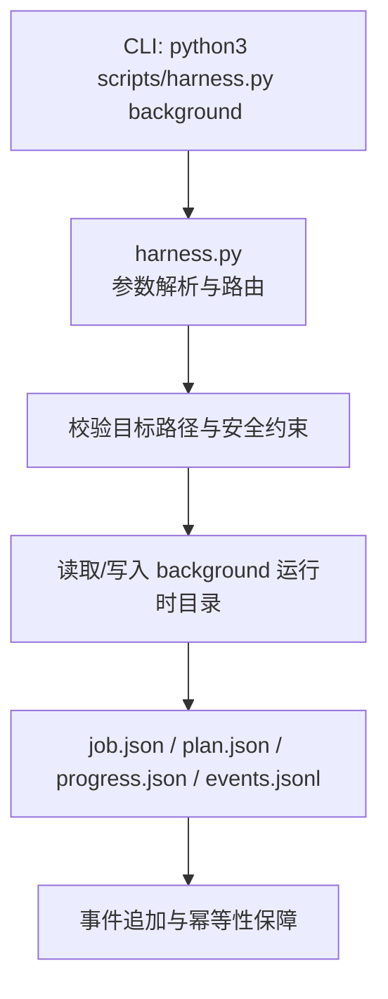
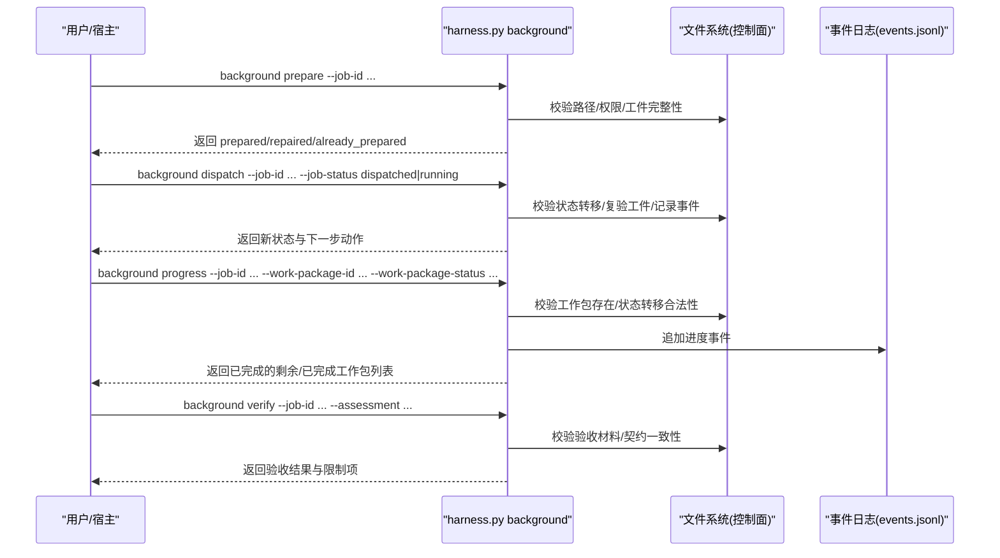
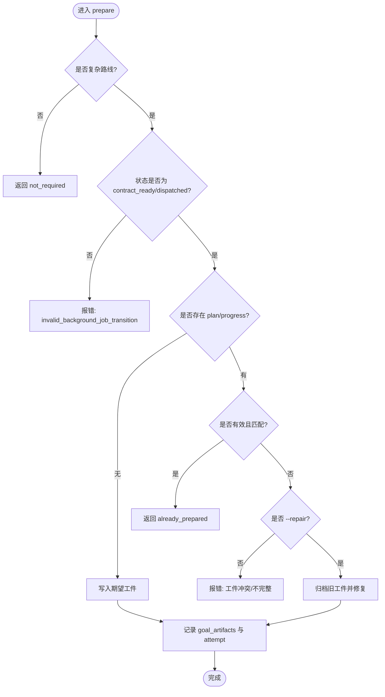
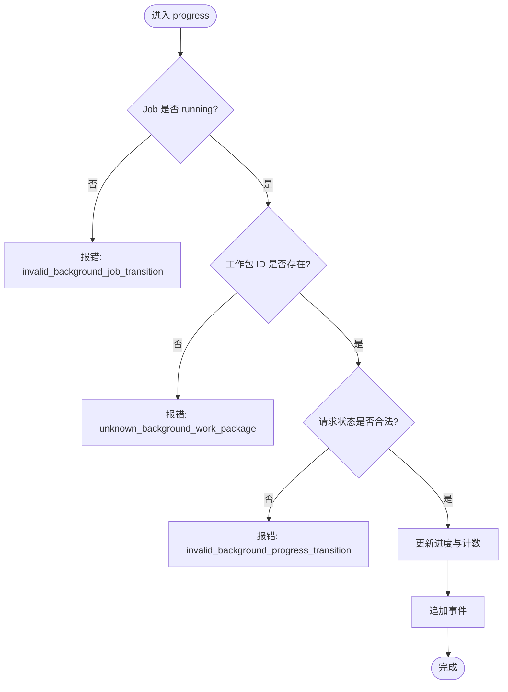
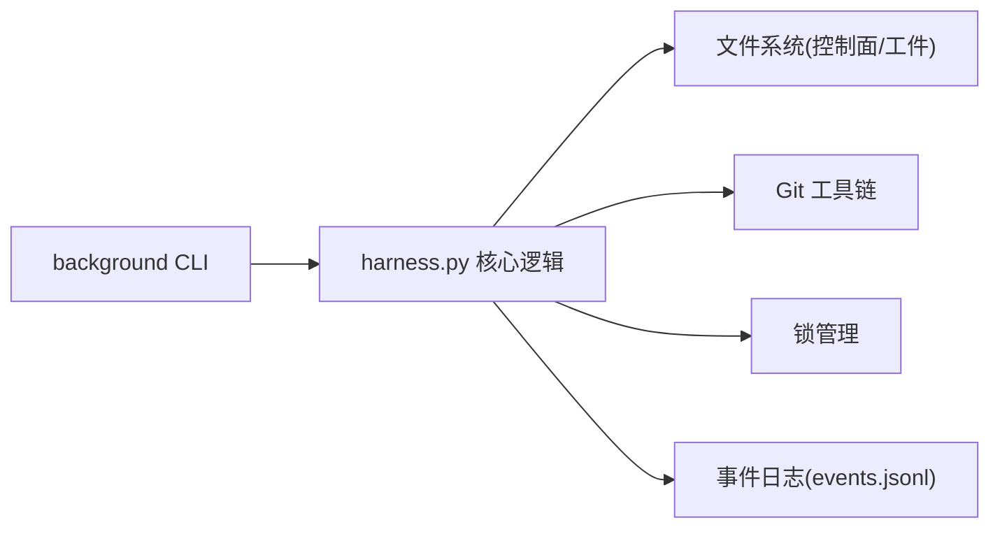
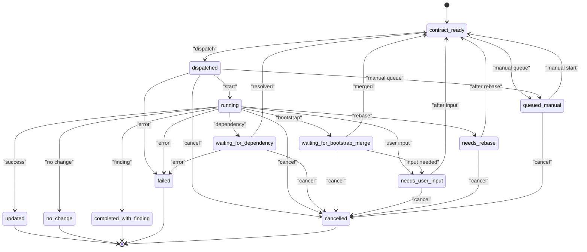

# background命令组

<cite>
**本文引用的文件**   
- [harness.py](file://scripts/harness.py)
- [SKILL.md](file://SKILL.md)
</cite>

## 更新摘要
**变更内容**   
- 将分散的单个命令文档（dispatch、list、prepare、progress、retry、status、verify）整合到本统一参考文档中
- 保持所有功能支持，提供更全面的后台任务治理文档
- 增强状态机、工作包管理和错误恢复策略的说明
- 补充v1.7.2新增的--prepare-and-run和--all批量操作特性

## 目录
1. [简介](#简介)
2. [项目结构](#项目结构)
3. [核心组件](#核心组件)
4. [架构总览](#架构总览)
5. [详细组件分析](#详细组件分析)
6. [依赖关系分析](#依赖关系分析)
7. [性能考量](#性能考量)
8. [故障排查指南](#故障排查指南)
9. [结论](#结论)
10. [附录](#附录)

## 简介
本章节为 Docs Harness 的 background 命令组提供完整 API 文档，覆盖以下子命令与能力：
- list：列出后台 Job
- status：查看单个 Job 状态
- prepare：准备复杂路线（background_goal、background_goal_phased）工件
- dispatch：推进 Job 到 dispatched/running
- progress：更新工作包进度
- verify：验收 Job 交付物
- retry：重试失败或需要人工干预的 Job
- estimate：估算后台任务工作量
- prune：清理已完成的后台 Job

同时说明后台任务治理的工作流、Job 生命周期、工作包状态转换、进度跟踪机制，以及 execution_route 类型（background_direct、background_goal、background_goal_phased）的区别与使用场景。

## 项目结构
background 命令组由单一脚本 harness.py 实现，并通过 SKILL.md 对外暴露 CLI 用法示例。背景运行时目录位于 .docs-harness/runs/background/jobs/<job-id>，包含 job.json、plan.json、progress.json、events.jsonl 等控制面文件。业务数据面仅允许写入合同声明范围，禁止直接修改控制面文件。

**图表来源**   
- [harness.py:1592-1600](file://scripts/harness.py#L1592-L1600)
- [harness.py:9585-9591](file://scripts/harness.py#L9585-L9591)

**章节来源**   
- [SKILL.md:66-100](file://SKILL.md#L66-L100)
- [harness.py:9585-9591](file://scripts/harness.py#L9585-L9591)

## 核心组件
- 后台 Job 模型与常量
  - 版本与模式：BACKGROUND_JOB_SCHEMA、BACKGROUND_CANDIDATE_SCHEMA、BACKGROUND_ASSESSMENT_SCHEMA、BACKGROUND_PLAN_SCHEMA、BACKGROUND_PROGRESS_SCHEMA
  - ID 正则：BACKGROUND_JOB_ID_RE
  - 最大尝试次数：BACKGROUND_MAX_ATTEMPTS
  - 终态集合：BACKGROUND_TERMINAL_STATES
  - 已知状态集合：BACKGROUND_KNOWN_STATES
  - 可重试状态：BACKGROUND_RETRYABLE_STATES
  - 任务种类：BACKGROUND_TASK_KINDS
  - 执行路线：BACKGROUND_ROUTES（background_direct、background_goal、background_goal_phased）
  - 复杂路线：BACKGROUND_COMPLEX_ROUTES
  - 进度状态：BACKGROUND_PROGRESS_STATUSES
  - 原因码正则：BACKGROUND_REASON_CODE_RE

- 运行时与路径
  - background_runtime_root、background_jobs_root、background_estimates_root
  - knowledge_job_dir、legacy_knowledge_job_dir（兼容入口）

- 安全与锁
  - assert_background_control_root：校验控制面路径与文件不可为符号链接
  - acquire_knowledge_job_locks/release_knowledge_job_locks：按 job 维度加锁/释放锁
  - background_lock_names：根据 task_kind 与 scope 生成锁名

- 状态机
  - BACKGROUND_TRANSITIONS：定义各状态间合法转移

**章节来源**   
- [harness.py:53-68](file://scripts/harness.py#L53-L68)
- [harness.py:98-127](file://scripts/harness.py#L98-L127)
- [harness.py:1592-1600](file://scripts/harness.py#L1592-L1600)
- [harness.py:9353-9358](file://scripts/harness.py#L9353-L9358)

## 架构总览
background 命令组围绕"控制器只写控制面、宿主通过 CLI 驱动"的原则运行。宿主调用 background 子命令完成 Job 的创建、准备、调度、进度上报与验收。复杂路线（goal/phased）要求先 prepare 再 dispatch，且控制器在进入 dispatched 和 running 前会复验绑定、attempt、工作包全集与指纹。

**图表来源**   
- [harness.py:9010-9074](file://scripts/harness.py#L9010-L9074)
- [harness.py:9138-9221](file://scripts/harness.py#L9138-L9221)
- [harness.py:9077-9135](file://scripts/harness.py#L9077-L9135)

## 详细组件分析

### 子命令：estimate
- 功能：估算后台任务工作量，生成 workload_estimate
- 输入：--target、[--candidate]
- 输出：包含 source_count、feature_count、raw_score、execution_route 等估算信息
- 注意事项：
  - 支持 project_wide 和 change_scoped 两种估算基础
  - 基于项目源码扫描和知识地图缺口评估复杂度

**章节来源**   
- [harness.py:9597-9610](file://scripts/harness.py#L9597-L9610)
- [harness.py:8497-8600](file://scripts/harness.py#L8497-L8600)

### 子命令：list
- 功能：列出当前项目的后台 Job 摘要（job_id、status、task_kind 等）
- 输入：--target 项目根目录；可选过滤条件
- 输出：JSON 数组，含每个 Job 的关键字段
- 注意事项：
  - 仅读取控制面元数据，不触发任何写入
  - 支持忽略已归档或终态 Job（依实现而定）

**章节来源**   
- [harness.py:9611-9626](file://scripts/harness.py#L9611-L9626)

### 子命令：status
- 功能：查询指定 Job 的详细状态与上下文
- 输入：--target、--job-id
- 输出：job.json 内容摘要、状态、attempt、created_at、updated_at、execution_route、work_packages 等
- 注意事项：
  - 若 Job 处于等待依赖或知识引导阶段，可能返回 waiting_for_dependency/waiting_for_bootstrap_merge

**章节来源**   
- [harness.py:9670-9671](file://scripts/harness.py#L9670-L9671)

### 子命令：prepare
- 功能：为复杂路线（background_goal、background_goal_phased）准备 plan.json 与 progress.json 工件
- 输入：--target、--job-id、[--repair]
- 行为：
  - 校验 job 状态仅在 contract_ready 或在途 dispatched 允许 prepare
  - 若已有工件不完整或冲突，需显式 --repair 进行修复并归档旧工件
  - 写入期望的 plan/progress 内容，记录 goal_artifacts 引用与 attempt
- 输出：prepared/repaired/already_prepared 及变更标记

**图表来源**   
- [harness.py:9010-9074](file://scripts/harness.py#L9010-L9074)

**章节来源**   
- [harness.py:9010-9074](file://scripts/harness.py#L9010-L9074)

### 子命令：dispatch
- 功能：将 Job 推进至 dispatched 或 running
- 输入：--target、--job-id、--job-status（dispatched|running）
- 行为：
  - 校验状态转移合法性（依据 BACKGROUND_TRANSITIONS）
  - 在进入 dispatched/running 前复验绑定、attempt、工作包全集与指纹
  - 记录事件并更新 job.json
  - 支持 --prepare-and-run 合并操作（v1.7.2新增）

**章节来源**   
- [harness.py:9138-9221](file://scripts/harness.py#L9138-L9221)
- [harness.py:9246-9293](file://scripts/harness.py#L9246-L9293)

### 子命令：progress
- 功能：更新工作包进度（in_progress/completed/blocked）
- 输入：--target、--job-id、--work-package-id、--work-package-status、[--reason-code]
- 行为：
  - 仅 running 状态允许更新
  - 校验工作包 ID 存在于冻结方案中
  - 校验状态转移合法性（pending→in_progress→completed/blocked）
  - 更新 completed_work_packages/remaining_work_packages，记录事件
  - 支持 --all completed 批量操作（v1.7.2新增）

**图表来源**   
- [harness.py:9077-9135](file://scripts/harness.py#L9077-L9135)

**章节来源**   
- [harness.py:9077-9135](file://scripts/harness.py#L9077-L9135)

### 子命令：verify
- 功能：验收 Job 交付物（assessment 文件）
- 输入：--target、--job-id、--assessment、[--result]
- 行为：
  - 校验 assessment schema 与状态（ready/partial）
  - 校验知识地图与文档盘点一致性（如适用）
  - 检查限制项与证据链（delivery layers）
  - 返回验收结果与限制详情
  - 支持 updated/no_change/completed_with_finding 三种结果

**章节来源**   
- [harness.py:9753-9874](file://scripts/harness.py#L9753-L9874)

### 子命令：retry
- 功能：重试失败的 Job 或需要人工干预的 Job
- 输入：--target、--job-id
- 行为：
  - 仅对 BACKGROUND_RETRYABLE_STATES 允许重试
  - 归档旧 attempt 工件并要求重新 prepare
  - 不继承完成进度，重置 attempt 计数
  - 超过最大尝试次数时标记为 failed

**章节来源**   
- [harness.py:9711-9752](file://scripts/harness.py#L9711-L9752)

### 子命令：prune
- 功能：清理已完成的后台 Job
- 输入：--target、--older-than、[--apply]、[--dry-run]
- 行为：
  - 仅处理终态 Job（updated/no_change/completed_with_finding/failed/cancelled）
  - 默认 dry-run 模式，需显式 --apply 才删除
  - 按更新时间过滤，支持 older_than 天数参数

**章节来源**   
- [harness.py:9627-9662](file://scripts/harness.py#L9627-L9662)

### 统一语法与参数
- 通用参数：--target（必填）、--json（输出 JSON）
- 子命令特有参数：
  - list：无额外参数
  - status：--job-id
  - prepare：--job-id、[--repair]
  - dispatch：--job-id、--job-status（dispatched|running）、[--prepare-and-run]
  - progress：--job-id、--work-package-id、--work-package-status（in_progress|completed|blocked）、[--reason-code]、[--all completed]
  - verify：--job-id、--assessment、[--result]
  - retry：--job-id
  - estimate：[--candidate]
  - prune：--older-than、[--apply]、[--dry-run]

**章节来源**   
- [SKILL.md:80-92](file://SKILL.md#L80-L92)
- [harness.py:11388-11413](file://scripts/harness.py#L11388-L11413)

## 依赖关系分析
- 模块内依赖
  - background 命令组依赖路径工具、JSON 读写、原子写入、事件追加、锁管理、Git 预检/后检、工作区快照、验证命令缓存等
- 外部依赖
  - Git 工具链（用于 pre/post check）
  - 文件系统（控制面与工件存储）
- 耦合与内聚
  - 高内聚：所有 background 逻辑集中在 harness.py
  - 低耦合：通过命令行参数与 JSON 契约交互，避免隐式依赖

**图表来源**   
- [harness.py:9585-9591](file://scripts/harness.py#L9585-L9591)
- [harness.py:9353-9358](file://scripts/harness.py#L9353-L9358)

**章节来源**   
- [harness.py:9585-9591](file://scripts/harness.py#L9585-L9591)
- [harness.py:9353-9358](file://scripts/harness.py#L9353-L9358)

## 性能考量
- 事件追加采用 append_jsonl 原子追加与 fsync，保证持久化顺序与一致性
- 验证命令缓存减少重复执行开销
- 工作区快照对大文件采用 size+mtime 指纹，降低哈希计算成本
- 锁机制避免并发竞争，提升稳定性
- v1.7.2新增的--prepare-and-run和--all批量操作减少往返调用

## 故障排查指南
- 常见错误码与处理
  - invalid_background_job：Job 类型或参数无效
  - invalid_background_job_transition：状态转移非法
  - unknown_background_work_package：工作包 ID 不存在
  - invalid_background_progress：进度状态非法或转移非法
  - unsafe_background_runtime：控制面路径不安全或存在符号链接
  - document_route_drift：文档路由契约漂移，需 rebase 或用户介入
  - background_prepare_and_run_not_eligible：不符合快速路径条件
- 恢复策略
  - 工件损坏或被篡改：使用 prepare --repair 修复
  - 需要用户输入：状态变为 needs_user_input，需人工确认后重试
  - 超过最大尝试次数：状态变为 failed，需调整策略后重新创建
  - 批量操作失败：检查阻塞的工作包状态

**章节来源**   
- [harness.py:9138-9221](file://scripts/harness.py#L9138-L9221)
- [harness.py:9711-9752](file://scripts/harness.py#L9711-L9752)
- [harness.py:9077-9135](file://scripts/harness.py#L9077-L9135)

## 结论
background 命令组提供了完整的后台任务治理能力，涵盖 Job 生命周期管理、工作包状态机、进度跟踪与验收流程。通过严格的控制面保护、状态转移校验与事件审计，确保后台任务的可控性与可追溯性。v1.7.2新增的快速路径和批量操作进一步提升了效率。建议在生产环境中结合监控与告警，及时发现并处理异常状态。

## 附录

### execution_route 类型与使用场景
- background_direct：适用于简单任务，无需计划工件，直接执行
- background_goal：适用于复杂任务，需建立持续目标与正式方案，再执行工作包
- background_goal_phased：适用于超大任务，分阶段推进，公共层与知识地图串行合并

**章节来源**   
- [SKILL.md:68-72](file://SKILL.md#L68-L72)
- [harness.py:124-125](file://scripts/harness.py#L124-L125)

### Job 状态机
- 初始状态：contract_ready、waiting_for_dependency、waiting_for_bootstrap_merge、needs_user_input、queued_manual
- 中间状态：dispatched、running
- 终态：updated、no_change、completed_with_finding、failed、cancelled

**图表来源**   
- [harness.py:100-116](file://scripts/harness.py#L100-L116)

### 工作包状态与转移
- 状态：pending、in_progress、completed、blocked
- 转移：pending→in_progress→completed/blocked；blocked 不可逆
- 批量操作：--all completed 支持一次性推进所有工作包

**章节来源**   
- [harness.py:126](file://scripts/harness.py#L126)
- [harness.py:9077-9135](file://scripts/harness.py#L9077-L9135)
- [harness.py:9296-9350](file://scripts/harness.py#L9296-L9350)

### 错误恢复策略
- 工件损坏：prepare --repair
- 需要用户输入：状态转为 needs_user_input，人工确认后重试
- 超过最大尝试次数：状态转为 failed，调整策略后重新创建
- 文档路由漂移：状态转为 needs_rebase 或 needs_user_input，需 rebase 或用户介入
- 快速路径失败：回退到标准 prepare→dispatch→running 流程

**章节来源**   
- [harness.py:9711-9752](file://scripts/harness.py#L9711-L9752)
- [harness.py:9010-9074](file://scripts/harness.py#L9010-L9074)
- [harness.py:9246-9293](file://scripts/harness.py#L9246-L9293)

### 命令使用示例
- 估算工作量：python3 scripts/harness.py background estimate --target . --json
- 列出后台 Job：python3 scripts/harness.py background list --target . --json
- 查看 Job 状态：python3 scripts/harness.py background status --target . --job-id <job-id> --json
- 准备工件：python3 scripts/harness.py background prepare --target . --job-id <job-id> --json
- 调度 Job：python3 scripts/harness.py background dispatch --target . --job-id <job-id> --job-status dispatched --json
- 快速路径执行：python3 scripts/harness.py background dispatch --target . --job-id <job-id> --job-status running --prepare-and-run --json
- 更新进度：python3 scripts/harness.py background progress --target . --job-id <job-id> --work-package-id <wp-id> --work-package-status in_progress --json
- 批量完成：python3 scripts/harness.py background progress --target . --job-id <job-id> --all completed --json
- 验收 Job：python3 scripts/harness.py background verify --target . --job-id <job-id> --assessment <file> --json
- 重试 Job：python3 scripts/harness.py background retry --target . --job-id <job-id> --json
- 清理历史：python3 scripts/harness.py background prune --target . --older-than 30 --apply --json

**章节来源**   
- [SKILL.md:80-92](file://SKILL.md#L80-L92)