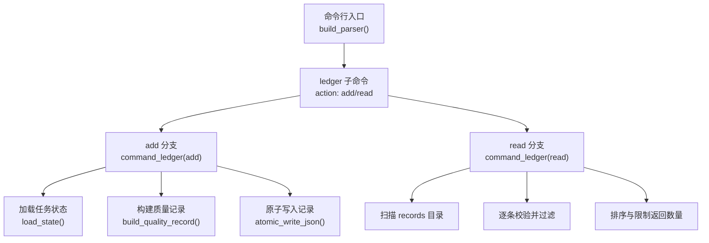
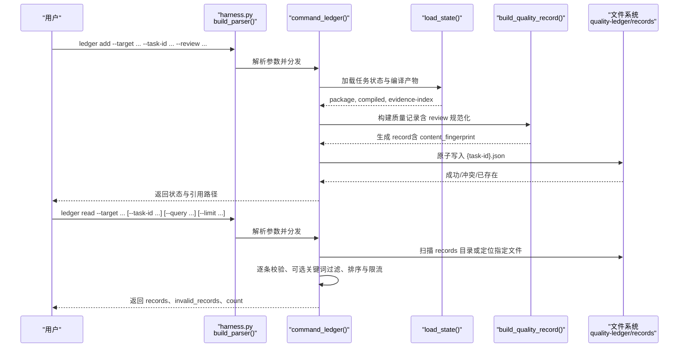
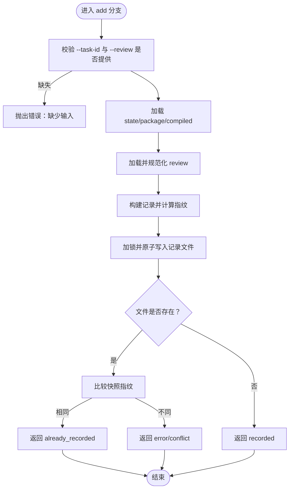
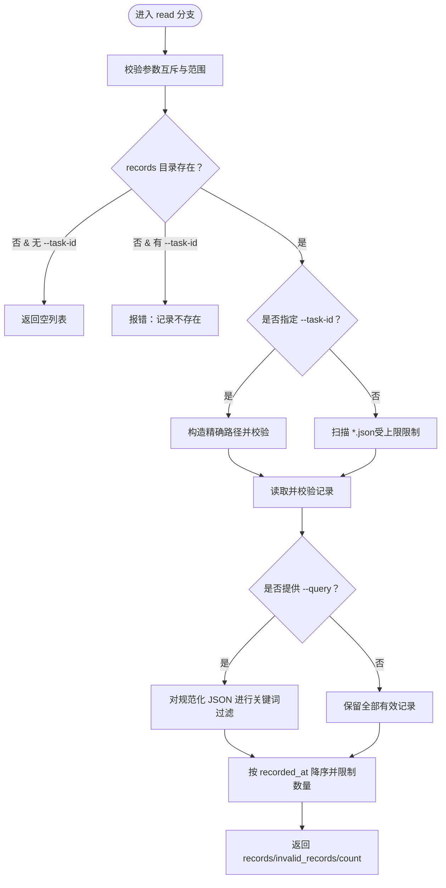
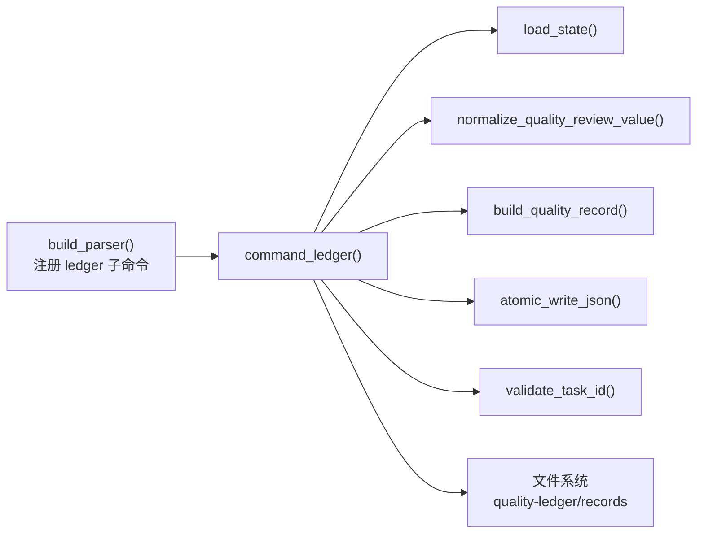

# ledger命令组

<cite>
**本文引用的文件**   
- [scripts/harness.py](file://scripts/harness.py)
- [tests/test_harness.py](file://tests/test_harness.py)
</cite>

## 目录
1. [简介](#简介)
2. [项目结构](#项目结构)
3. [核心组件](#核心组件)
4. [架构总览](#架构总览)
5. [详细组件分析](#详细组件分析)
6. [依赖关系分析](#依赖关系分析)
7. [性能考量](#性能考量)
8. [故障排查指南](#故障排查指南)
9. [结论](#结论)
10. [附录：使用示例与最佳实践](#附录使用示例与最佳实践)

## 简介
本章节为 Docs Harness 的 ledger 命令组提供完整的 API 文档，覆盖以下要点：
- ledger add 子命令：用于人工添加质量复盘记录到本地质量账本。
- ledger read 子命令：用于按任务编号或关键词读取历史质量记录。
- 质量账本的数据模型、校验规则与存储位置。
- 按需读取原则与数据访问控制机制。
- task-id 与关键词查询的使用方法。
- 完整命令使用示例（以步骤说明为主，不直接粘贴代码）。

## 项目结构
ledger 命令组由命令行参数解析、业务处理函数与数据存储路径共同组成：
- 参数定义位于命令构建器中，注册 ledger 子命令及其 action 与选项。
- 业务逻辑集中在 command_ledger 函数，负责 add 与 read 的具体实现。
- 数据存储于目标项目下的 quality-ledger/records 目录，每条记录以 JSON 文件形式保存，文件名基于 task-id。

图表来源
- [scripts/harness.py:10434-10444](file://scripts/harness.py#L10434-L10444)
- [scripts/harness.py:7165-7248](file://scripts/harness.py#L7165-L7248)
- [scripts/harness.py:7130-7144](file://scripts/harness.py#L7130-L7144)
- [scripts/harness.py:422-437](file://scripts/harness.py#L422-L437)

章节来源
- [scripts/harness.py:10434-10444](file://scripts/harness.py#L10434-L10444)
- [scripts/harness.py:7165-7248](file://scripts/harness.py#L7165-L7248)

## 核心组件
- 质量复盘数据模型（quality-review）
  - schema_version 固定为 docs-harness/quality-review/v1。
  - 字段集合受严格约束，包含任务摘要、记录原因、结果摘要、交付价值、问题与返工、成本观察、经验教训、剩余风险、后续行动等。
  - cost_observations 项需包含 description 与 source（observed/estimated/unknown），且数组长度受限。
- 质量记录数据模型（quality-record）
  - schema_version 固定为 docs-harness/quality-record/v1。
  - 必填字段包括 schema_version、task_id、recorded_at、trigger_source、package_revision、package_fingerprint、task_status_at_recording、task_facts、review、content_fingerprint。
  - trigger_source 必须为 reported_user_explicit；task_id 必须符合 dh-YYYYMMDDTHHMMSS-xxxxxxxxxx 格式。
  - content_fingerprint 为去除自身后的规范化 JSON 的 sha256 指纹，确保内容不可篡改。
- 存储与路径
  - 根目录：quality-ledger（项目根目录下 .docs-harness/quality-ledger）。
  - 记录目录：quality-ledger/records。
  - 单条记录文件命名：{task-id}.json。
- 安全与校验
  - 路径安全检查：拒绝符号链接与非目录/非文件路径。
  - 输入限制：--review 仅接受文件路径，不接受内联内容；对敏感信息有模式匹配检测。
  - 并发写保护：使用 state_lock 保证同一记录的原子写入与冲突检测。

章节来源
- [scripts/harness.py:47-48](file://scripts/harness.py#L47-L48)
- [scripts/harness.py:184-195](file://scripts/harness.py#L184-L195)
- [scripts/harness.py:6990-7035](file://scripts/harness.py#L6990-L7035)
- [scripts/harness.py:7130-7144](file://scripts/harness.py#L7130-L7144)
- [scripts/harness.py:7147-7152](file://scripts/harness.py#L7147-L7152)
- [scripts/harness.py:449-485](file://scripts/harness.py#L449-L485)

## 架构总览
下图展示了 ledger add 与 ledger read 的整体调用流程与数据流。

图表来源
- [scripts/harness.py:10434-10444](file://scripts/harness.py#L10434-L10444)
- [scripts/harness.py:7165-7248](file://scripts/harness.py#L7165-L7248)
- [scripts/harness.py:7130-7144](file://scripts/harness.py#L7130-L7144)

## 详细组件分析

### ledger add 子命令
- 功能
  - 接收脱敏的质量复盘 JSON 文件路径与任务编号，结合当前任务状态与证据索引，生成一条不可篡改的质量记录并持久化。
- 参数
  - --target：项目目标目录（必需）。
  - --task-id：Docs Harness 任务编号（必需）。
  - --review：质量复盘 JSON 文件路径（必需，不接受内联内容）。
  - 不支持 --query。
- 处理流程
  - 校验 target 与路径安全。
  - 加载任务状态（state）、任务包（package）、编译产物（compiled）。
  - 加载并规范化 review 数据。
  - 构建质量记录，计算 content_fingerprint。
  - 在并发锁下写入 records/{task-id}.json。
  - 若文件已存在且快照一致，返回 already_recorded；若不一致，返回 conflict。
- 输出
  - status：recorded / already_recorded / error。
  - task_id、record_ref、changed、content_fingerprint、task_status_at_recording 等。

图表来源
- [scripts/harness.py:7165-7206](file://scripts/harness.py#L7165-L7206)
- [scripts/harness.py:7130-7144](file://scripts/harness.py#L7130-L7144)

章节来源
- [scripts/harness.py:7165-7206](file://scripts/harness.py#L7165-L7206)
- [scripts/harness.py:7130-7144](file://scripts/harness.py#L7130-L7144)

### ledger read 子命令
- 功能
  - 从 quality-ledger/records 读取历史质量记录，支持按 task-id 精确读取或按关键词全文检索，并限制返回数量。
- 参数
  - --target：项目目标目录（必需）。
  - --task-id：可选，精确读取某条记录。
  - --query：可选，文本检索（大小写不敏感，对规范化 JSON 进行匹配）。
  - --limit：可选，返回条数上限（1-20，默认 5）。
  - 不支持 --review。
- 处理流程
  - 校验参数互斥与合法性（如 --task-id 与 --query 不能同时使用）。
  - 若 records 不存在且未指定 --task-id，返回空列表。
  - 若指定 --task-id，则验证格式并定位对应文件；否则扫描所有 *.json（受扫描上限限制）。
  - 逐条读取并校验记录，无效记录收集到 invalid_records。
  - 可选关键词过滤后，按 recorded_at 降序排序，截取前 limit 条。
- 输出
  - status：ok / partial（存在无效记录时）。
  - records：符合条件的记录列表。
  - invalid_records：无效记录的任务编号与原因码。
  - count：返回的记录数量。

图表来源
- [scripts/harness.py:7208-7248](file://scripts/harness.py#L7208-L7248)

章节来源
- [scripts/harness.py:7208-7248](file://scripts/harness.py#L7208-L7248)

### 质量复盘数据结构与校验
- 字段约束
  - 必须包含 schema_version、task_summary、record_reason、outcome_summary、delivered_value、issues_and_rework、cost_observations、lessons、residual_risks、next_actions。
  - cost_observations 每项必须包含 description 与 source（observed/estimated/unknown），且总数受限。
  - 文本字段与列表字段均经过规范化处理，未知字段或缺失字段将导致校验失败。
- 规范化与指纹
  - normalize_quality_review_value 对 review 进行规范化。
  - build_quality_record 将 review 嵌入记录，并计算 content_fingerprint。

章节来源
- [scripts/harness.py:184-195](file://scripts/harness.py#L184-L195)
- [scripts/harness.py:7038-7076](file://scripts/harness.py#L7038-L7076)
- [scripts/harness.py:7130-7144](file://scripts/harness.py#L7130-L7144)

### 质量记录数据结构与校验
- 字段约束
  - 必须包含 schema_version、task_id、recorded_at、trigger_source、package_revision、package_fingerprint、task_status_at_recording、task_facts、review、content_fingerprint。
  - task_id 必须符合正则格式；trigger_source 必须为 reported_user_explicit。
  - content_fingerprint 为去除自身后的规范化 JSON 的 sha256 指纹。
- 校验流程
  - validate_quality_record 检查合同、schema、task_id、触发来源、版本、事实与复盘字段，以及指纹一致性。
  - read_quality_record 封装读取与校验，统一错误码。

章节来源
- [scripts/harness.py:6990-7035](file://scripts/harness.py#L6990-L7035)
- [scripts/harness.py:7155-7162](file://scripts/harness.py#L7155-L7162)

### 存储路径与安全策略
- 路径
  - quality_ledger_root(target) 返回 quality-ledger 根目录。
  - quality_records_root(target) 返回 quality-ledger/records。
- 安全
  - assert_safe_quality_paths 禁止符号链接与非目录/非文件路径。
  - 并发写通过 state_lock 保护，避免覆盖与竞态。
  - 扫描上限 QUALITY_RECORD_SCAN_LIMIT 防止无索引全量扫描。

章节来源
- [scripts/harness.py:914-919](file://scripts/harness.py#L914-L919)
- [scripts/harness.py:7147-7152](file://scripts/harness.py#L7147-L7152)
- [scripts/harness.py:7225-7227](file://scripts/harness.py#L7225-L7227)

## 依赖关系分析
- 参数解析依赖 build_parser 中的 ledger 子命令定义。
- 业务逻辑依赖 load_state、normalize_quality_review_value、build_quality_record、atomic_write_json、validate_task_id 等工具函数。
- 数据存储依赖文件系统操作与并发锁。

图表来源
- [scripts/harness.py:10434-10444](file://scripts/harness.py#L10434-L10444)
- [scripts/harness.py:7165-7248](file://scripts/harness.py#L7165-L7248)
- [scripts/harness.py:7130-7144](file://scripts/harness.py#L7130-L7144)

章节来源
- [scripts/harness.py:10434-10444](file://scripts/harness.py#L10434-L10444)
- [scripts/harness.py:7165-7248](file://scripts/harness.py#L7165-L7248)

## 性能考量
- 读取限制
  - --limit 最大 20，默认 5，避免大量输出。
  - 无索引扫描上限 QUALITY_RECORD_SCAN_LIMIT 防止全量遍历。
- 写入优化
  - 原子写入与快照指纹对比，避免重复写入与冲突覆盖。
- 内存与 I/O
  - 逐条读取与校验，减少一次性加载开销。
  - 规范化 JSON 与指纹计算在构建阶段完成，读路径轻量。

[本节为通用指导，不直接分析具体文件]

## 故障排查指南
常见错误与原因：
- 缺少输入参数
  - add 必须提供 --task-id 与 --review；read 不支持 --review。
- 参数互斥与范围错误
  - read 的 --task-id 与 --query 不能同时使用；--limit 必须在 1-20。
- 记录不存在
  - 指定 --task-id 但 records 中无对应文件。
- 记录冲突或已存在
  - 已存在记录且快照不一致返回冲突；完全一致返回已记录。
- 路径不安全
  - 符号链接或非目录/非文件路径被拒绝。
- 输入非法或敏感信息
  - --review 不接受内联内容；敏感信息模式匹配失败。
- 扫描超限
  - 无索引扫描超过上限。

章节来源
- [scripts/harness.py:7170-7248](file://scripts/harness.py#L7170-L7248)
- [scripts/harness.py:449-485](file://scripts/harness.py#L449-L485)
- [scripts/harness.py:7147-7152](file://scripts/harness.py#L7147-L7152)

## 结论
ledger 命令组提供了面向个人本地的质量账本能力，通过严格的契约校验与原子写入保障数据的完整性与可追溯性。add 子命令将脱敏复盘与任务事实整合成不可篡改的记录；read 子命令支持精确查找与关键词检索，满足按需读取与最小暴露原则。配合并发锁与路径安全策略，系统在保证安全的同时具备良好的可扩展性与性能表现。

[本节为总结性内容，不直接分析具体文件]

## 附录：使用示例与最佳实践
- 添加审查记录（ledger add）
  - 准备一个符合 quality-review/v1 结构的 JSON 文件（不含敏感信息）。
  - 执行命令：harness ledger add --target <项目目录> --task-id <任务编号> --review <复盘文件路径>。
  - 成功后返回 status=recorded，包含 record_ref 与 content_fingerprint。
  - 若已存在相同快照，返回 status=already_recorded；若快照不一致，返回 error/conflict。
- 读取历史记录（ledger read）
  - 精确读取：harness ledger read --target <项目目录> --task-id <任务编号>。
  - 关键词检索：harness ledger read --target <项目目录> --query "<关键词>" --limit <1-20>。
  - 返回 records、invalid_records、count；status=ok 表示全部有效，partial 表示部分无效。
- 最佳实践
  - 始终使用脱敏的复盘数据，避免包含密钥或敏感令牌。
  - 使用 --task-id 精确读取，避免全量扫描带来的性能与安全风险。
  - 合理设置 --limit，避免过多输出影响下游处理。
  - 遇到冲突或无效记录，根据返回的原因码修复输入或清理损坏文件。

章节来源
- [scripts/harness.py:10434-10444](file://scripts/harness.py#L10434-L10444)
- [scripts/harness.py:7165-7248](file://scripts/harness.py#L7165-L7248)
- [tests/test_harness.py:4443-4623](file://tests/test_harness.py#L4443-L4623)