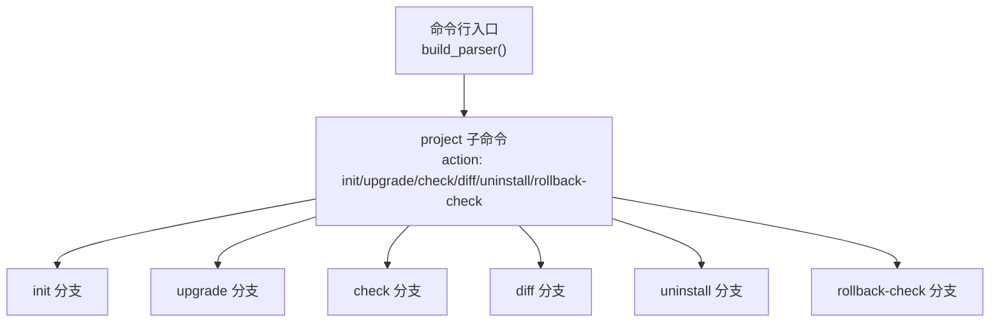
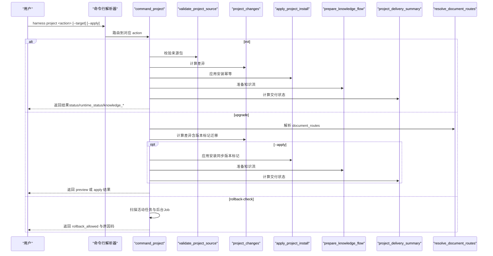
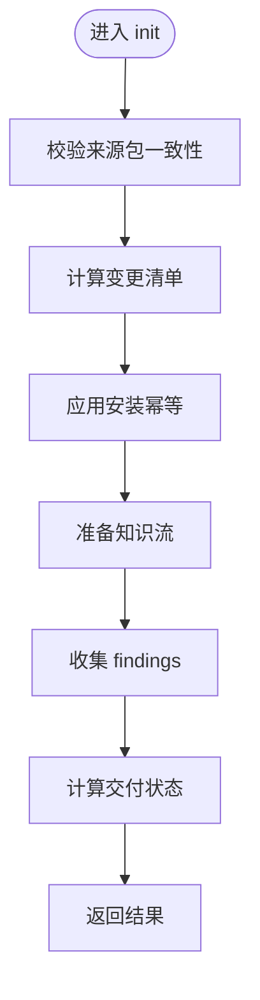
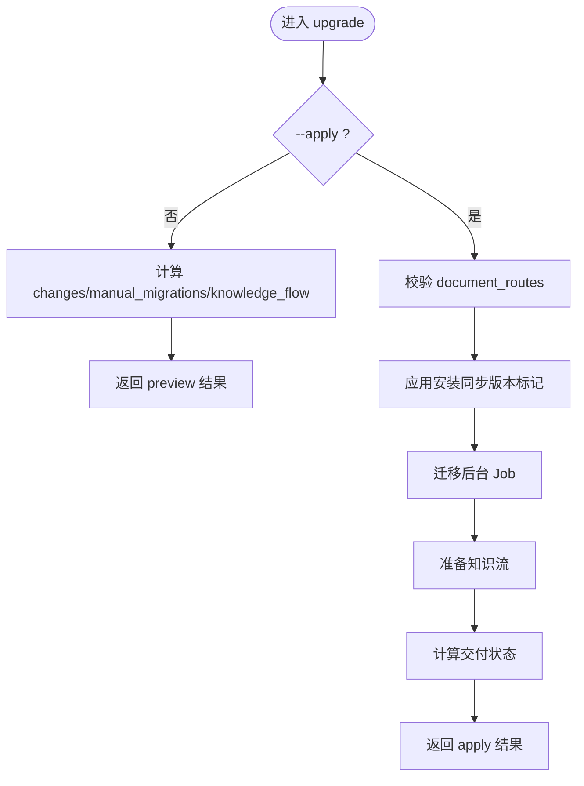
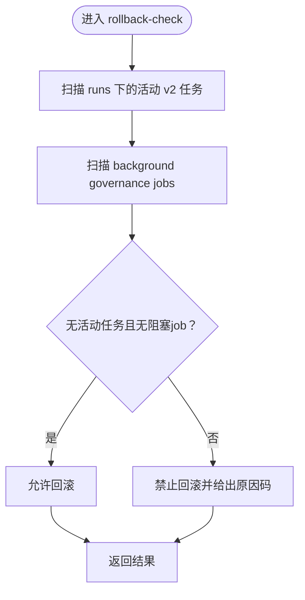
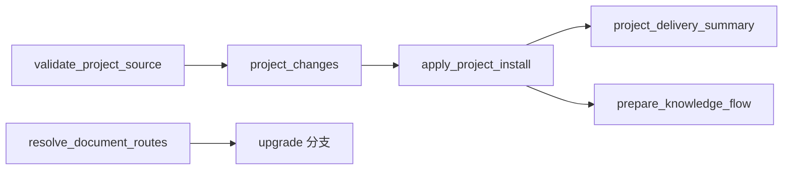

# project命令组

<cite>
**本文引用的文件**   
- [scripts/harness.py](file://scripts/harness.py)
- [tests/test_harness.py](file://tests/test_harness.py)
</cite>

## 目录
1. [简介](#简介)
2. [项目结构](#项目结构)
3. [核心组件](#核心组件)
4. [架构总览](#架构总览)
5. [详细组件分析](#详细组件分析)
6. [依赖关系分析](#依赖关系分析)
7. [性能考量](#性能考量)
8. [故障排查指南](#故障排查指南)
9. [结论](#结论)
10. [附录：命令与参数速查](#附录命令与参数速查)

## 简介
本文件为 Docs Harness 的 project 命令组提供完整的 API 文档，覆盖以下子命令：init、upgrade、rollback-check（以及配套的 check、diff、uninstall）。重点说明：
- 项目初始化流程与知识骨架生成
- 配置管理（.docs-harness/config.json）与版本标记同步
- 升级预览与应用模式、preserve-and-merge 策略
- document_routes 治理契约解析与错误处理
- needs_manual_migration 场景判定与处置建议
- 交付状态字段 runtime_status、controller_clone_ready、clone_ready 的含义与组合逻辑

## 项目结构
project 命令组由命令行解析器注册并路由到统一处理器 command_project，内部根据 action 分发至不同分支。关键实现集中在 scripts/harness.py 中，测试用例位于 tests/test_harness.py。

**图表来源** 
- [scripts/harness.py:10471-10479](file://scripts/harness.py#L10471-L10479)
- [scripts/harness.py:10049-10301](file://scripts/harness.py#L10049-L10301)

**章节来源**
- [scripts/harness.py:10471-10479](file://scripts/harness.py#L10471-L10479)
- [scripts/harness.py:10049-10301](file://scripts/harness.py#L10049-L10301)

## 核心组件
- 命令解析与路由
  - build_parser 注册 project 子命令及通用参数 --target、--json、--apply、--purge-runtime
  - main 将 project 请求路由到 command_project
- 项目安装与变更计算
  - validate_project_source：校验来源包一致性
  - project_changes：计算目标与来源的差异清单（含 managed block、规则、配置、版本标记等）
  - apply_project_install：执行幂等的“保留用户修改”式安装（preserve-and-merge）
- 知识骨架与知识流
  - KNOWLEDGE_SCAFFOLD：默认知识骨架模板
  - prepare_knowledge_flow：生成知识维护下一步动作与命令
- 交付状态与克隆就绪
  - install_delivery_status / project_delivery_summary：计算 delivery_status、clone_ready、controller_clone_ready 等
- 文档路由契约
  - resolve_document_routes：解析 document_routes 配置或自动推导，返回 resolved/unresolved/invalid_config 状态
- 回滚检查
  - rollback-check：扫描活动任务与后台 Job，判断是否允许回滚

**章节来源**
- [scripts/harness.py:10471-10479](file://scripts/harness.py#L10471-L10479)
- [scripts/harness.py:10049-10301](file://scripts/harness.py#L10049-L10301)
- [scripts/harness.py:9515-9784](file://scripts/harness.py#L9515-L9784)
- [scripts/harness.py:2108-2220](file://scripts/harness.py#L2108-L2220)
- [scripts/harness.py:1403-1459](file://scripts/harness.py#L1403-L1459)

## 架构总览
下图展示 project 命令组的调用链路与关键数据对象交互。

**图表来源** 
- [scripts/harness.py:10049-10301](file://scripts/harness.py#L10049-L10301)
- [scripts/harness.py:9515-9784](file://scripts/harness.py#L9515-L9784)
- [scripts/harness.py:1403-1459](file://scripts/harness.py#L1403-L1459)
- [scripts/harness.py:2108-2220](file://scripts/harness.py#L2108-L2220)

## 详细组件分析

### 子命令：project init
- 功能
  - 校验来源包一致性
  - 计算需安装的变更（脚本、managed block、规则、配置、知识骨架、版本标记）
  - 幂等写入（不覆盖用户改动；冲突时抛出 install_conflict）
  - 生成知识流下一步动作与命令
  - 输出 status、runtime_status、delivery_summary、knowledge_* 等
- 关键行为
  - 若 docs/ 已存在则跳过创建知识骨架，但仍会确保 knowledge-map.json 存在
  - Git 忽略必需安装路径时会拒绝写入（git_delivery_ignored）
  - 发现严重问题（red findings）时 runtime_status=blocked，否则 healthy
- 返回值要点
  - action="init"
  - status ∈ {installed, needs_delivery, failed}
  - runtime_status ∈ {healthy, blocked}
  - delivery_summary 包含 delivery_status、clone_ready、controller_clone_ready、required_commit_paths、ignored_paths
  - knowledge_status、knowledge_next_action、knowledge_next_command_argv、knowledge_flow

**图表来源** 
- [scripts/harness.py:10081-10134](file://scripts/harness.py#L10081-L10134)
- [scripts/harness.py:9515-9784](file://scripts/harness.py#L9515-L9784)
- [scripts/harness.py:2108-2220](file://scripts/harness.py#L2108-L2220)

**章节来源**
- [scripts/harness.py:10081-10134](file://scripts/harness.py#L10081-L10134)
- [scripts/harness.py:9515-9784](file://scripts/harness.py#L9515-L9784)
- [scripts/harness.py:2108-2220](file://scripts/harness.py#L2108-L2220)

### 子命令：project upgrade
- 功能
  - 预览模式（无 --apply）：仅计算 changes、manual_migrations、knowledge_flow，并给出 apply_completion_possible
  - 应用模式（--apply）：执行安装、迁移后台 Job、更新版本标记、生成 knowledge_flow 与 delivery_summary
- 关键行为
  - 若 document_routes 非法，直接失败关闭（invalid_document_route_config）
  - 对受管版本标记进行同步（docs/INDEX.md、legacy modules/INDEX.md），必要时需要人工迁移
  - 当存在 needs_manual_migration 或 pending delivery 时，status 可能为 needs_manual_migration 或 needs_delivery
- 返回值要点
  - mode ∈ {preview, apply}
  - status ∈ {upgraded, upgraded_knowledge_pending, needs_manual_migration, needs_delivery, failed}
  - runtime_status ∈ {healthy, blocked}
  - manual_migrations：包含 changes 中的 needs_manual_migration 项与 route_migrations

**图表来源** 
- [scripts/harness.py:10135-10221](file://scripts/harness.py#L10135-L10221)
- [scripts/harness.py:9515-9784](file://scripts/harness.py#L9515-L9784)
- [scripts/harness.py:1403-1459](file://scripts/harness.py#L1403-L1459)

**章节来源**
- [scripts/harness.py:10135-10221](file://scripts/harness.py#L10135-L10221)
- [scripts/harness.py:9515-9784](file://scripts/harness.py#L9515-L9784)
- [scripts/harness.py:1403-1459](file://scripts/harness.py#L1403-L1459)

### 子命令：project rollback-check
- 功能
  - 扫描运行时状态（v2 任务）与 background governance jobs，判断是否允许回滚
- 判定条件
  - 若无活动的 v2 任务且无未完成的 delivery_governance 类 job，则允许回滚
  - 否则不允许，并给出 reason_code（active_v2_tasks 或 active_document_route_jobs）
- 返回值要点
  - rollback_allowed：布尔值
  - active_v2_task_ids：活动 v2 任务 ID 列表
  - active_document_route_job_ids：活动文档治理 job ID 列表
  - storage_policy、legacy_controller_policy：策略声明

**图表来源** 
- [scripts/harness.py:10052-10080](file://scripts/harness.py#L10052-L10080)

**章节来源**
- [scripts/harness.py:10052-10080](file://scripts/harness.py#L10052-L10080)

### 配套命令：check、diff、uninstall
- check
  - 汇总 findings（红/黄）、delivery_summary、status（passed/needs_delivery/needs_manual_migration/knowledge_pending/failed）
- diff
  - 仅输出 changes 清单（用于预览）
- uninstall
  - 预览模式：列出将被移除的文件与块
  - 应用模式：清理 managed block、版本标记、config.json、可选 purge_runtime 清理 runs

**章节来源**
- [scripts/harness.py:10222-10301](file://scripts/harness.py#L10222-L10301)

## 依赖关系分析
- 输入与校验
  - validate_project_source：要求来源包包含 scripts/harness.py 与 harness-home/rules，且多源版本号一致
- 变更计算
  - project_changes：比较目标与来源的脚本、managed block、规则、配置、知识骨架、版本标记
- 安装应用
  - apply_project_install：幂等写入，遇到用户修改冲突时抛出 install_conflict（preserve-and-merge 策略）
- 文档路由
  - resolve_document_routes：从 .docs-harness/config.json 的 document_routes 解析或自动推导，返回 resolved/unresolved/invalid_config
- 交付状态
  - install_delivery_status/project_delivery_summary：基于 git HEAD 与工作区差异计算 clone_ready、controller_clone_ready、delivery_status

**图表来源** 
- [scripts/harness.py:9515-9784](file://scripts/harness.py#L9515-L9784)
- [scripts/harness.py:1403-1459](file://scripts/harness.py#L1403-L1459)
- [scripts/harness.py:2108-2220](file://scripts/harness.py#L2108-L2220)

**章节来源**
- [scripts/harness.py:9515-9784](file://scripts/harness.py#L9515-L9784)
- [scripts/harness.py:1403-1459](file://scripts/harness.py#L1403-L1459)
- [scripts/harness.py:2108-2220](file://scripts/harness.py#L2108-L2220)

## 性能考量
- 变更计算与安装均为增量比对（指纹对比、git diff），避免全量重写
- Git 操作使用超时保护（git_preflight_timeout）与批量读取（refs snapshot）
- 大仓库下 knowledge bootstrap 异步化（bootstrap_async=True）以减少主流程阻塞

[本节为通用指导，无需源码引用]

## 故障排查指南
- 常见错误码与含义
  - invalid_source：来源包不完整或版本不一致
  - git_delivery_ignored：Git 忽略了必需安装路径
  - install_conflict：用户修改与受管内容冲突，需人工 preserve-and-merge
  - invalid_document_route_config：document_routes 配置非法
  - source_version_inconsistent：来源包多源版本不一致
- 诊断步骤
  - 使用 project diff 查看待变更清单
  - 使用 project check 查看 findings（red/yellow）
  - 检查 .docs-harness/config.json 的 version、rules_root、installed_script_fingerprint、installed_rule_fingerprints
  - 确认 AGENTS.md/CLAUDE.md 的 managed block 未被破坏
  - 对于 upgrade，先运行预览模式确认 apply_completion_possible 与 manual_migrations

**章节来源**
- [scripts/harness.py:9515-9784](file://scripts/harness.py#L9515-L9784)
- [scripts/harness.py:10222-10301](file://scripts/harness.py#L10222-L10301)

## 结论
project 命令组围绕“幂等安装 + 可观测升级 + 安全回滚”的核心目标设计：
- init 保证最小可用环境并生成知识骨架
- upgrade 支持预览与应用两种模式，严格处理版本标记与文档路由契约
- rollback-check 通过活动任务与后台作业状态保障回滚安全
- 所有写操作遵循 preserve-and-merge 策略，尊重用户修改

[本节为总结性内容，无需源码引用]

## 附录：命令与参数速查
- 公共参数
  - --target：目标项目根目录（默认当前目录）
  - --json：以 JSON 格式输出
- project 子命令
  - init：初始化项目（幂等）
  - upgrade：升级项目（--apply 应用；否则预览）
  - check：检查项目状态与合规性
  - diff：显示待变更清单
  - uninstall：卸载（--apply 应用；--purge-runtime 清理运行时）
  - rollback-check：检查是否允许回滚

**章节来源**
- [scripts/harness.py:10471-10479](file://scripts/harness.py#L10471-L10479)

## 附录：示例与最佳实践

### 新项目设置（init）
- 步骤
  - 在项目根目录执行：harness project init --target .
  - 若有 Git 工作区，提交新增文件后再次运行，确保 delivery_status=in_head
- 预期结果
  - 生成 scripts/harness.py、AGENTS.md/CLAUDE.md 的 managed block、.docs-harness/config.json、docs 知识骨架与 knowledge-map.json
  - status=installed 或 needs_delivery（取决于 Git 提交状态）
  - runtime_status=healthy（无 red findings）

**章节来源**
- [tests/test_harness.py:1395-1419](file://tests/test_harness.py#L1395-L1419)

### 现有项目升级（upgrade）
- 步骤
  - 预览：harness project upgrade --target .
  - 如 apply_completion_possible=true 且无 manual_migrations，执行：harness project upgrade --target . --apply
  - 若存在 legacy 版本模板或 unowned 版本引用，按 manual_migrations 提示进行人工迁移
- 预期结果
  - 受管版本标记被同步（docs/INDEX.md、legacy modules/INDEX.md）
  - status ∈ {upgraded, upgraded_knowledge_pending, needs_manual_migration, needs_delivery, failed}
  - runtime_status=healthy（无 red findings）

**章节来源**
- [tests/test_harness.py:1421-1524](file://tests/test_harness.py#L1421-L1524)

### 回滚检查（rollback-check）
- 步骤
  - 执行：harness project rollback-check --target .
- 预期结果
  - rollback_allowed=true/false
  - 若 false，检查 active_v2_task_ids 与 active_document_route_job_ids 并解决阻塞

**章节来源**
- [scripts/harness.py:10052-10080](file://scripts/harness.py#L10052-L10080)

## 附录：preserve-and-merge 策略与 needs_manual_migration

### preserve-and-merge 策略
- 原则
  - 不覆盖用户修改；若检测到冲突，抛出 install_conflict，要求人工合并
- 适用位置
  - scripts/harness.py 的版本与指纹比对
  - 规则文件的指纹比对
  - managed block 的替换与保留

**章节来源**
- [scripts/harness.py:9662-9727](file://scripts/harness.py#L9662-L9727)

### document_routes 处理
- 解析来源
  - 优先使用 .docs-harness/config.json 中的 document_routes
  - 若未显式配置，则自动推导候选路径
- 状态
  - resolved：成功解析
  - unresolved：候选缺失或歧义
  - invalid_config：配置非法

**章节来源**
- [scripts/harness.py:1403-1459](file://scripts/harness.py#L1403-L1459)

### needs_manual_migration 场景
- 触发条件
  - 版本标记无法自动同步（invalid_managed_version_block）
  - 旧版模板存在但非受管（unowned_legacy_version_reference）
  - document_routes 配置非法（invalid_document_route_config）
- 处置建议
  - 根据 manual_migrations 列表逐项修复，再重新运行 upgrade --apply

**章节来源**
- [scripts/harness.py:9597-9632](file://scripts/harness.py#L9597-L9632)
- [tests/test_harness.py:1500-1524](file://tests/test_harness.py#L1500-L1524)

## 附录：状态字段释义

### runtime_status
- 含义
  - 运行时健康度：healthy 表示无阻断性问题；blocked 表示存在严重问题（如 red findings）
- 来源
  - init/upgrade/check 分支根据 findings 的 severity 决定

**章节来源**
- [scripts/harness.py:10118-10134](file://scripts/harness.py#L10118-L10134)
- [scripts/harness.py:10203-10221](file://scripts/harness.py#L10203-L10221)
- [scripts/harness.py:10252-10262](file://scripts/harness.py#L10252-L10262)

### controller_clone_ready 与 clone_ready
- 含义
  - controller_clone_ready：控制器相关文件的交付状态（是否在 HEAD）
  - clone_ready：整体克隆就绪（控制器 + 知识状态 ready + 知识交付 in_head）
- 计算
  - install_delivery_status：针对控制器路径集合计算 delivery_status 与 clone_ready
  - project_delivery_summary：综合控制器与知识交付状态得出 overall clone_ready

**章节来源**
- [scripts/harness.py:2108-2220](file://scripts/harness.py#L2108-L2220)

## 附录：命令使用示例（参考测试）
- 初始化并验证
  - 参考测试：test_project_init_is_preserve_and_merge_and_check_passes
- 升级与幂等
  - 参考测试：test_project_upgrade_syncs_owned_version_markers_and_is_idempotent
- 旧版模板迁移
  - 参考测试：test_project_upgrade_migrates_only_exact_legacy_version_template
- 歧义版本引用
  - 参考测试：test_project_upgrade_reports_ambiguous_legacy_version_without_overwrite

**章节来源**
- [tests/test_harness.py:1395-1419](file://tests/test_harness.py#L1395-L1419)
- [tests/test_harness.py:1421-1474](file://tests/test_harness.py#L1421-L1474)
- [tests/test_harness.py:1476-1524](file://tests/test_harness.py#L1476-L1524)