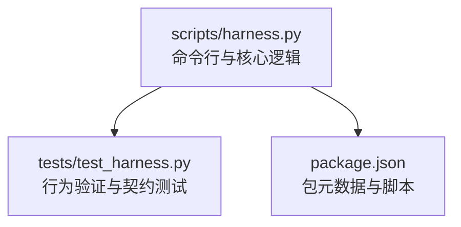
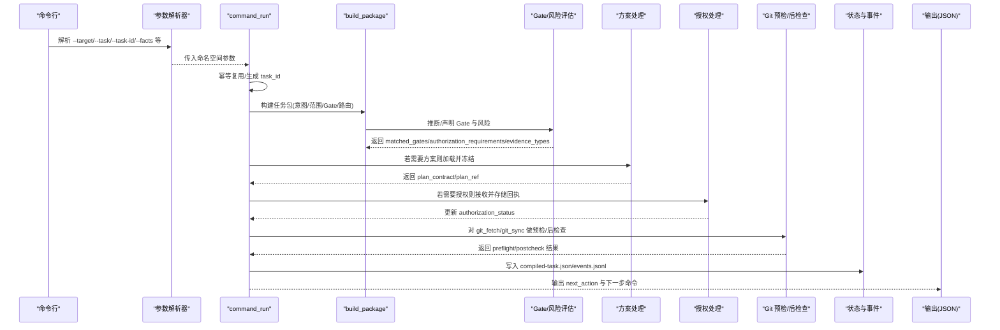
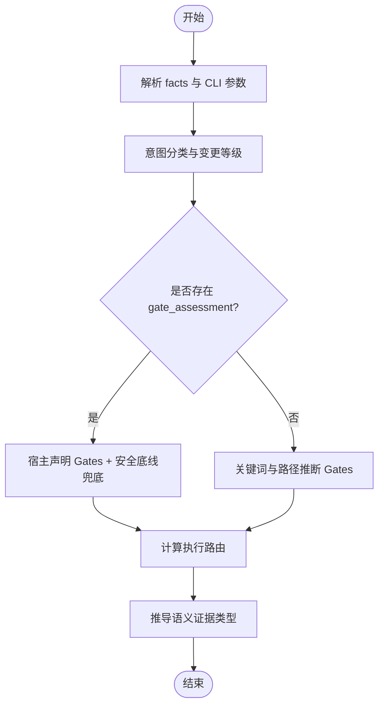
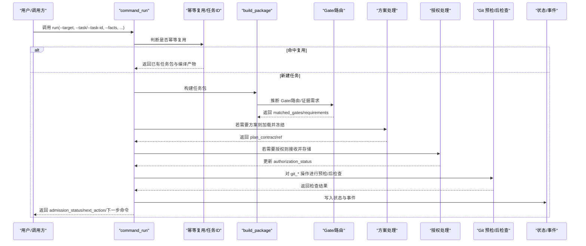
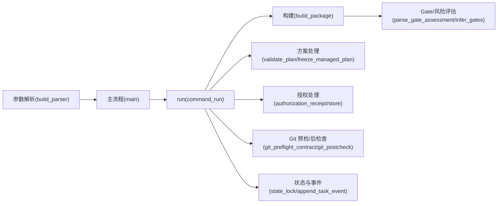

# run命令

<cite>
**本文引用的文件**   
- [harness.py](file://scripts/harness.py)
- [test_harness.py](file://tests/test_harness.py)
- [package.json](file://package.json)
</cite>

## 目录
1. [简介](#简介)
2. [项目结构](#项目结构)
3. [核心组件](#核心组件)
4. [架构总览](#架构总览)
5. [详细组件分析](#详细组件分析)
6. [依赖关系分析](#依赖关系分析)
7. [性能考量](#性能考量)
8. [故障排查指南](#故障排查指南)
9. [结论](#结论)
10. [附录：参数与返回字段速查](#附录参数与返回字段速查)

## 简介
本文件为 Docs Harness 的 run 命令提供完整的 API 文档，覆盖语法、参数、返回值、意图编译、风险评估、任务准入流程、幂等复用机制、任务状态管理、错误处理策略，以及 gate_assessment 的详细格式与使用指导。同时解释 context_quality 字段含义与 fallback_fact_refs 的使用场景，并提供常见工作流的调用示例。

## 项目结构
- 入口脚本位于 scripts/harness.py，包含命令行解析、run 命令实现、上下文与证据校验、Git 预检/后检查、知识地图解析、Gate 判定、执行路由选择等核心逻辑。
- 测试用例位于 tests/test_harness.py，覆盖 run 命令的典型路径与边界条件。
- package.json 描述包元信息与脚本入口。

**图表来源** 
- [harness.py:10175-10375](file://scripts/harness.py#L10175-L10375)
- [test_harness.py:1-120](file://tests/test_harness.py#L1-L120)
- [package.json:1-23](file://package.json#L1-L23)

**章节来源**
- [harness.py:10175-10375](file://scripts/harness.py#L10175-L10375)
- [test_harness.py:1-120](file://tests/test_harness.py#L1-L120)
- [package.json:1-23](file://package.json#L1-L23)

## 核心组件
- 命令解析与分发：build_parser 定义子命令与参数；main 根据 command 分发到对应处理器。
- run 命令主流程：command_run 负责首次运行或续跑任务，完成幂等复用、任务包构建、方案与授权处理、控制状态推进。
- 意图编译与风险评估：classify_task_intents、compile_mutation_profile、infer_gates、parse_gate_assessment 等函数协同完成意图识别、变更等级、Gate 判定与风险门控。
- Git 预检/后检查：git_preflight_contract、git_postcheck 保障 git_fetch/git_sync 的安全性与一致性。
- 知识上下文与质量：resolve_feature_knowledge 产出 knowledge_context，含 context_quality 与 fallback_fact_refs。
- 事件与状态：append_task_event、state_lock、task_state_dir 等维护任务生命周期与并发安全。

**章节来源**
- [harness.py:10175-10375](file://scripts/harness.py#L10175-L10375)
- [harness.py:4540-4938](file://scripts/harness.py#L4540-L4938)
- [harness.py:2596-2789](file://scripts/harness.py#L2596-L2789)
- [harness.py:677-875](file://scripts/harness.py#L677-L875)
- [harness.py:1790-1886](file://scripts/harness.py#L1790-L1886)
- [harness.py:1008-1029](file://scripts/harness.py#L1008-L1029)

## 架构总览
下图展示 run 命令从参数解析到输出 JSON 的整体流程，以及与上下文、方案、授权、证据、Git 预检/后检查的交互。

**图表来源** 
- [harness.py:10175-10375](file://scripts/harness.py#L10175-L10375)
- [harness.py:4540-4938](file://scripts/harness.py#L4540-L4938)
- [harness.py:2596-2789](file://scripts/harness.py#L2596-L2789)
- [harness.py:677-875](file://scripts/harness.py#L677-L875)

## 详细组件分析

### run 命令参数与用法
- 必需参数
  - --target：目标项目根目录（默认当前目录）
  - 首次运行必须提供原始任务：--task（文本），或续跑时提供 --task-id
- 可选参数
  - --task-id：继续已有任务并完成方案、授权或重新准入
  - --new-task：跳过活动任务幂等复用，强制创建独立任务
  - --facts：结构化任务事实 JSON 文件路径（不接受内联内容）
  - --plan：正式方案 Markdown 或 JSON 文件路径（不接受内联内容）
  - --authorization：结构化授权 JSON 文件路径（不接受内联内容）
  - --scope：项目内允许范围，可重复
  - --feature：显式选择功能 ID，可重复
  - --action：允许动作，可重复
  - --success：成功标准，可重复
  - --json：输出 JSON（推荐用于自动化）

说明
- facts 支持 gate_assessment、gates、read_scope、write_scope、git_scope、external_scope、allowed_actions、verification_commands、required_fact_refs、feature_ids、authorization_requirements、semantic_evidence_requirements、work_packages 等字段。
- 当未提供 facts 时，控制器会从任务文本与范围自动推断意图与范围。

**章节来源**
- [harness.py:10180-10208](file://scripts/harness.py#L10180-L10208)
- [harness.py:1244-1253](file://scripts/harness.py#L1244-L1253)

### 意图编译与风险评估
- 意图分类：基于任务文本与 facts 中的关键字与模式匹配，得到候选意图集合，并确定最高变更等级 mutation_profile。
- Gate 判定：优先解析宿主权威 gate_assessment；否则按关键词与路径推断；安全底线 Gate（如 security-sensitive、destructive-data、release-external）由代码强制兜底。
- 执行路由：根据 Gate 与是否涉及 git_sync/work_packages 决定 direct/planned/extended。
- 语义证据需求：依据 Gate 与意图推导 required evidence types。

**图表来源** 
- [harness.py:2596-2789](file://scripts/harness.py#L2596-L2789)

**章节来源**
- [harness.py:2596-2789](file://scripts/harness.py#L2596-L2789)

### 任务准入流程（run 主流程）
- 幂等复用：若无 --new-task 且存在活动任务键，直接复用已存在的任务包与编译产物。
- 任务包构建：build_package 综合 facts、CLI、Git 预检、知识地图，生成 package 与 blockers。
- 方案处理：若需要方案，先确保 plan 阶段上下文就绪，再加载并冻结方案；支持增量 delta 合并与范围扩展。
- 授权处理：若需要授权，接收并存储 authorization receipt，更新授权状态。
- Git 预检/后检查：对 git_fetch/git_sync 进行 preflight 与 postcheck，确保引用范围与工作区一致性。
- 状态推进：写入 compiled-task.json 与 events.jsonl，返回 next_action 与下一步命令。

**图表来源** 
- [harness.py:4540-4938](file://scripts/harness.py#L4540-L4938)
- [harness.py:677-875](file://scripts/harness.py#L677-L875)

**章节来源**
- [harness.py:4540-4938](file://scripts/harness.py#L4540-L4938)

### gate_assessment 参数详解
- 位置：facts.gate_assessment（JSON 对象）
- 字段
  - gates：数组，受控 Gate 名称列表（仅允许已知 Gate）
  - rationale：非空字符串，不超过 500 字符，说明选择理由
- 行为
  - 宿主权威模式：以声明为准，但安全底线 Gate（security-sensitive、destructive-data、release-external）仍由代码强制追加。
  - 只读或元数据写变更会剔除 code-edit/document-edit 等编辑类 Gate。
- 错误码
  - invalid_gate_assessment：格式或字段不合法
  - invalid_gate：未知 Gate

**章节来源**
- [harness.py:2596-2610](file://scripts/harness.py#L2596-L2610)
- [harness.py:2694-2725](file://scripts/harness.py#L2694-L2725)

### context_quality 与 fallback_fact_refs
- context_quality
  - complete：知识上下文完整可用
  - degraded：知识上下文不完整（例如缺失类别文档、知识库未就绪、新特性等）
- fallback_fact_refs
  - 当 context_quality=degraded 时，控制器可能回退到变更路径作为 fallback_fact_refs，以便在缺少知识文档时仍能推进任务。
  - 在部分路径中，fallback_fact_refs 初始为空，后续根据变更集动态填充。

**章节来源**
- [harness.py:1790-1886](file://scripts/harness.py#L1790-L1886)
- [harness.py:2869-2871](file://scripts/harness.py#L2869-L2871)
- [harness.py:6170-6171](file://scripts/harness.py#L6170-L6171)

### 幂等复用机制
- 活动任务键 active_task_key：基于任务文本与 facts 计算，结合运行时目录是否存在历史任务决定是否计算。
- 复用条件：无 --new-task 且 runtime_root(target) 存在历史任务目录，且找到相同 key 的活动任务。
- 复用结果：直接返回 first_run_payload，避免重复构建与编译。

**章节来源**
- [harness.py:4540-4562](file://scripts/harness.py#L4540-L4562)

### 任务状态管理与事件
- 状态目录：task_state_dir(task_id) 位于 .docs-harness/runs/<task_id>
- 关键工件：task-package.json、compiled-task.json、events.jsonl、evidence-index.json、context-receipts.jsonl、authorization-receipts.jsonl
- 并发锁：state_lock 防止同一任务被多个进程并发修改，超过 5 分钟锁视为过期需人工清理。
- 事件记录：append_task_event 记录 context/verification/planning 等阶段事件，统计 readmission/evidence_round_count 等指标。

**章节来源**
- [harness.py:906-922](file://scripts/harness.py#L906-L922)
- [harness.py:1008-1029](file://scripts/harness.py#L1008-L1029)
- [harness.py:1031-1071](file://scripts/harness.py#L1031-L1071)

### 错误处理策略
- 统一异常：HarnessError(code, exit_code)，常见错误码包括 missing_target、unsafe_target、invalid_facts、invalid_gate_assessment、invalid_git_scope、git_preflight_failed、evidence_not_passed、evidence_binding_mismatch 等。
- 退出码
  - 0：成功
  - 2：请求无效（如参数错误、JSON 无效）
  - 3：阻塞等待下一步（如 needs_plan/needs_authorization/blocked）
  - 4：范围不一致需重新准入（plan_scope_mismatch）
- 输出：--json 时输出结构化 JSON；否则逐行打印 key:value。

**章节来源**
- [harness.py:392-397](file://scripts/harness.py#L392-L397)
- [harness.py:10297-10303](file://scripts/harness.py#L10297-L10303)
- [harness.py:10337-10375](file://scripts/harness.py#L10337-L10375)

### Git 预检与后检查
- 预检（preflight）：针对 git_fetch/git_sync，生成快照（remote、refs、index_tree、worktree_fingerprint、controlled_refs_namespace 等），并检查 LFS/Submodule、脏工作区、删除阈值、fast-forward 等。
- 后检查（postcheck）：对比快照与当前状态，校验 remote_target_unchanged、refs_within_contract、head/index/worktree 一致性，返回 reason_code（git_remote_drift/git_ref_scope_violation/git_postcheck_failed）。

**章节来源**
- [harness.py:677-875](file://scripts/harness.py#L677-L875)

### 常见工作流示例
- 查询类只读任务（无需方案/授权）
  - 命令：harness run --target ./project --task "项目文档在哪，请解释现有内容" --json
  - 预期：admission_status=ready_direct，execution_route=direct，allowed_actions=["read"]
- 审计分支是否可删除（只读，可能触发 git_inspect）
  - 命令：harness run --target ./project --task "审计 feature 分支是否可删除" --json
  - 预期：task_intent=audit，mutation_profile=read_only，admission_status=ready_direct
- 混合意图（先审计再修复）
  - 命令：harness run --target ./project --task "先审计 README，如需要再修复" --facts facts.json --json
  - 预期：task_intent=audit，mutation_profile=workspace_write，candidate_intents={"audit","modify"}
- git_fetch（元数据写）
  - 命令：harness run --target ./project --task "执行 git fetch 获取远端引用" --facts '{"task_intent":"git_fetch","git_scope":[".git:refs/remotes/origin/*"]}' --json
  - 预期：mutation_profile=git_metadata_write，allowed_actions 包含 git_fetch
- git_sync（工作区写，需要方案）
  - 命令：harness run --target ./project --task "执行 git pull 同步远端" --facts '{"git_scope":[".git:refs/remotes/origin/main"]}' --json
  - 预期：admission_status=needs_plan，需先运行 context --stage plan 并提交方案

以上示例的行为与断言可在测试用例中找到对应验证。

**章节来源**
- [test_harness.py:429-448](file://tests/test_harness.py#L429-L448)
- [test_harness.py:449-464](file://tests/test_harness.py#L449-L464)
- [test_harness.py:465-484](file://tests/test_harness.py#L465-L484)
- [test_harness.py:503-537](file://tests/test_harness.py#L503-L537)
- [test_harness.py:597-618](file://tests/test_harness.py#L597-L618)

## 依赖关系分析
- 外部依赖
  - Git：用于仓库身份、引用快照、diff、LFS/Submodule 检测等
  - Python 标准库：argparse、json、subprocess、hashlib、pathlib、datetime 等
- 内部模块
  - 参数解析与命令分发：build_parser、main
  - 任务控制：command_run、first_run_payload、next_step_payload
  - 知识系统：resolve_feature_knowledge、knowledge_map_path、normalize_knowledge_map
  - 证据与验收：load_evidence、mint_evidence_receipt、known_evidence_types
  - 规则与配置：rules_root_for、project_config、document_route_config

**图表来源** 
- [harness.py:10175-10375](file://scripts/harness.py#L10175-L10375)
- [harness.py:4540-4938](file://scripts/harness.py#L4540-L4938)
- [harness.py:2596-2789](file://scripts/harness.py#L2596-L2789)
- [harness.py:677-875](file://scripts/harness.py#L677-L875)

**章节来源**
- [harness.py:10175-10375](file://scripts/harness.py#L10175-L10375)
- [harness.py:4540-4938](file://scripts/harness.py#L4540-L4938)
- [harness.py:2596-2789](file://scripts/harness.py#L2596-L2789)
- [harness.py:677-875](file://scripts/harness.py#L677-L875)

## 性能考量
- 幂等复用：通过 active_task_key 避免重复构建与编译，显著降低冷启动开销。
- 快照与指纹：workspace_snapshot 与 file_fingerprint 采用哈希与大小/时间戳降级策略，限制非 Git 工作区快照规模。
- 验证命令缓存：verification.command_cache_enabled 默认开启，减少重复验证成本。
- 事件与索引：events.jsonl 与 evidence-index.json 增量追加，避免全量重算。

[本节为通用指导，不涉及具体文件分析]

## 故障排查指南
- 常见错误码与定位
  - missing_target：--target 指向不存在或非目录
  - unsafe_target：目标为文件系统根或用户主目录
  - invalid_facts：facts 文件格式或字段非法
  - invalid_gate_assessment：gate_assessment 格式或字段非法
  - invalid_git_scope：git_scope 格式错误或缺少远端 refs
  - git_preflight_failed：Git 预检失败（LFS/Submodule/脏工作区/非 fast-forward）
  - evidence_not_passed：证据 result 不为 passed
  - evidence_binding_mismatch：证据未绑定当前任务包或目标
- 调试建议
  - 使用 --json 输出结构化结果，便于自动化解析
  - 查看 events.jsonl 了解各阶段事件与原因码
  - 检查 compiled-task.json 的 control_status、blockers、next_action
  - 对于 git_sync，确认 preflight 快照与 postcheck 一致

**章节来源**
- [harness.py:392-397](file://scripts/harness.py#L392-L397)
- [harness.py:10297-10303](file://scripts/harness.py#L10297-L10303)
- [harness.py:10337-10375](file://scripts/harness.py#L10337-L10375)

## 结论
run 命令以“意图优先、证据可复用、失败关闭”为核心设计，通过严格的 Gate 与风险评估、Git 预检/后检查、方案与授权约束，确保任务执行的可控性与可追溯性。幂等复用与状态机驱动的流程，使复杂工作流具备高可靠性与可观测性。配合 --json 输出与事件日志，可实现端到端的自动化编排与问题定位。

[本节为总结，不涉及具体文件分析]

## 附录：参数与返回字段速查
- 常用参数
  - --target：项目根目录
  - --task：原始任务文本（首次运行必填）
  - --task-id：续跑任务 ID
  - --facts：结构化事实文件
  - --plan：正式方案文件
  - --authorization：授权回执文件
  - --scope/--feature/--action/--success：范围、功能、动作、成功标准
  - --json：JSON 输出
- 关键返回字段（节选）
  - task_id：任务编号
  - execution_route：direct/planned/extended
  - admission_status：ready_direct/ready_planned/ready_extended/needs_plan/needs_authorization/blocked
  - authorization_status：missing/reported
  - work_packages：工作包列表（extended 路由）
  - blockers：阻塞原因列表
  - next_action：下一步动作（如 load_plan_context/complete_plan/load_action_context/obtain_authorization/verify 等）
  - next_command_argv：下一步命令（由 enrich_next_step_response 注入）
  - context_quality：complete/degraded
  - fallback_fact_refs：回退事实引用列表（degraded 时可能填充）

**章节来源**
- [harness.py:10180-10208](file://scripts/harness.py#L10180-L10208)
- [harness.py:4540-4938](file://scripts/harness.py#L4540-L4938)
- [harness.py:10305-10334](file://scripts/harness.py#L10305-L10334)
- [harness.py:1790-1886](file://scripts/harness.py#L1790-L1886)