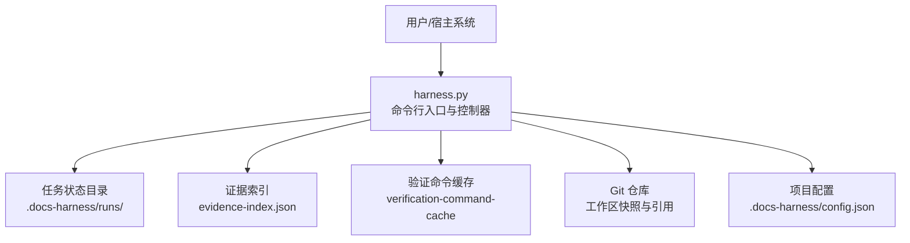
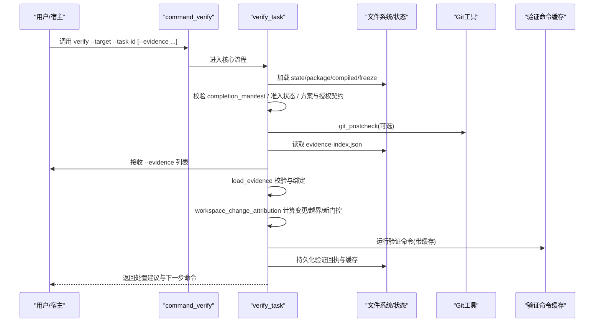
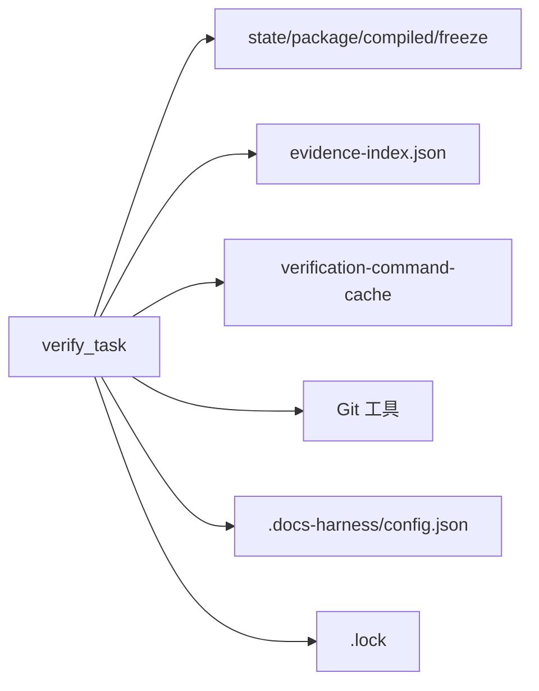

# verify命令

<cite>
**本文引用的文件**   
- [harness.py](file://scripts/harness.py)
- [test_harness.py](file://tests/test_harness.py)
- [package.json](file://package.json)
</cite>

## 目录
1. [简介](#简介)
2. [项目结构](#项目结构)
3. [核心组件](#核心组件)
4. [架构总览](#架构总览)
5. [详细组件分析](#详细组件分析)
6. [依赖关系分析](#依赖关系分析)
7. [性能考量](#性能考量)
8. [故障排查指南](#故障排查指南)
9. [结论](#结论)
10. [附录：命令参考与示例](#附录命令参考与示例)

## 简介
verify命令用于对已准入并处于执行阶段的任务进行“证据验证”。它通过加载任务状态、校验授权与方案契约、收集与复用证据、执行验证命令、判定证据类型是否满足需求，最终输出统一的处置建议（五级处置机制）与下一步操作指引。该命令支持自动归因未声明的写入路径，并提供可配置的验证命令缓存开关。

## 项目结构
- 入口脚本位于 scripts/harness.py，包含完整的命令行解析、任务状态管理、证据处理、Git预/后检查、验证命令执行与缓存、以及处置决策逻辑。
- tests/test_harness.py 提供了大量端到端用例，覆盖 verify 的典型场景与边界条件。
- package.json 描述包元数据与脚本入口，便于本地测试与自测。

图表来源
- [harness.py:906-933](file://scripts/harness.py#L906-L933)
- [harness.py:1008-1029](file://scripts/harness.py#L1008-L1029)
- [harness.py:1180-1214](file://scripts/harness.py#L1180-L1214)

章节来源
- [package.json:1-23](file://package.json#L1-L23)

## 核心组件
- 命令入口与编排
  - command_verify：统一入口，负责计时、异常捕获与遥测记录。
  - verify_task：核心流程编排，包括状态加载、契约校验、上下文有效性、Git后检查、证据收集与复用、变更归因、规则冲突检测、验证命令执行与缓存、结果汇总与处置决策。
- 证据处理
  - load_evidence：加载并校验证据（v2收据或声明草案），绑定任务包与目标身份，校验生产者可信度、时间戳、TTL、摘要等。
  - workspace_change_attribution：基于冻结快照与实际工作区差异，结合证据 write_set/read_set/concurrent_drift 与 Git sync 范围，计算变更、越界与新门控。
- 验证命令与缓存
  - run_verification_commands_cached：按任务清单执行验证命令，支持逐项缓存与 volatile 模式跳过。
  - verification_command_cache_enabled：读取项目配置控制是否启用缓存。
- 处置决策
  - next_step_payload：根据 reason_code 与 next_action 生成下一步命令与工件提示。
  - 五级处置：provide_evidence、refresh_evidence、retry_verification、incremental_admission、full_readmission。

章节来源
- [harness.py:6282-6298](file://scripts/harness.py#L6282-L6298)
- [harness.py:6301-6678](file://scripts/harness.py#L6301-L6678)
- [harness.py:5080-5228](file://scripts/harness.py#L5080-L5228)
- [harness.py:5238-5290](file://scripts/harness.py#L5238-L5290)
- [harness.py:1188-1214](file://scripts/harness.py#L1188-L1214)
- [harness.py:936-1005](file://scripts/harness.py#L936-L1005)

## 架构总览
下图展示了 verify 命令从接收到返回的整体调用链与关键交互点。

图表来源
- [harness.py:6282-6298](file://scripts/harness.py#L6282-L6298)
- [harness.py:6301-6678](file://scripts/harness.py#L6301-L6678)
- [harness.py:5080-5228](file://scripts/harness.py#L5080-L5228)
- [harness.py:5238-5290](file://scripts/harness.py#L5238-L5290)

## 详细组件分析

### 参数与语法
- 必需参数
  - --target：项目根目录（必须是存在的目录，且不能是文件系统根或用户主目录）。
  - --task-id：任务ID，必须符合格式 dh-YYYYMMDDTHHMMSS-<hex>。
- 可选参数
  - --evidence：证据文件路径，可多次指定；支持 v2 证据收据或声明草案（会被转换为收据）。
- 其他
  - --json：以 JSON 形式输出结果（由上层调用约定提供）。

章节来源
- [harness.py:924-933](file://scripts/harness.py#L924-L933)
- [harness.py:541-544](file://scripts/harness.py#L541-L544)
- [harness.py:532-538](file://scripts/harness.py#L532-L538)
- [harness.py:5080-5228](file://scripts/harness.py#L5080-L5228)

### 证据验证流程
- 证据加载与校验
  - 支持 v2 收据与声明草案；v2 收据需绑定当前任务包与目标身份，校验生产者可信白名单、时间戳、TTL、摘要字段等。
  - 若为声明草案，将转换为收据并注入受信任的生产者标识。
- 证据复用策略
  - 从证据索引中筛选未过期、绑定有效、来源有效的历史证据，减少重复执行。
- 变更归因
  - 对比冻结快照与实际工作区，结合证据 write_set/read_set/concurrent_drift 与 Git sync 范围，计算实际变更、越界路径与新门控。
  - 若存在未归因写入且落在 write_scope 内，且允许自动归因，则自动生成 workspace_attribution 收据并纳入验证。
- 验证命令执行
  - 按任务清单执行验证命令，支持缓存命中与 volatile 模式跳过。
  - 记录命令回执与缓存条目，供后续重用。
- 结果判定
  - 综合 fresh_evidence 类型、git_postcheck 结果、required_evidence_types、required_receipts、blocking_deliverables 等，决定是否需要补充证据或重新准入。

章节来源
- [harness.py:5080-5228](file://scripts/harness.py#L5080-L5228)
- [harness.py:5238-5290](file://scripts/harness.py#L5238-L5290)
- [harness.py:6301-6678](file://scripts/harness.py#L6301-L6678)

### 五级处置机制
- provide_evidence：需要补充证据（缺失证据类型、回执、阻塞交付物或无证据）。
- refresh_evidence：读集漂移导致相关证据失效，需刷新受影响证据。
- retry_verification：仅重试验证（例如命令失败但无需重新准入）。
- incremental_admission：增量重新准入（新增风险门控但可在不触发全量重审的情况下处理）。
- full_readmission：全量重新准入（方案/授权契约漂移、Git 范围变化、越界写入等）。

章节来源
- [harness.py:936-1005](file://scripts/harness.py#L936-L1005)
- [harness.py:6220-6227](file://scripts/harness.py#L6220-L6227)
- [harness.py:6527-6548](file://scripts/harness.py#L6527-L6548)

### 自动归因功能
- 当存在未归因写入且落在 write_scope 范围内时，若开启 auto_attribute_in_scope，控制器会生成 workspace_attribution 收据并自动归因给当前任务。
- 自动归因路径会在返回结果中通过 auto_attributed_paths 暴露，便于审计与追踪。

章节来源
- [harness.py:1202-1214](file://scripts/harness.py#L1202-L1214)
- [harness.py:6440-6479](file://scripts/harness.py#L6440-L6479)
- [harness.py:6479-6548](file://scripts/harness.py#L6479-L6548)

### 处置选项使用条件
- provide_evidence
  - 缺失 required_evidence_types、required_receipts、blocking_deliverables，或无任何新鲜证据。
  - 读集漂移导致部分证据失效时，也可能先要求刷新证据（见 refresh_evidence）。
- refresh_evidence
  - read_set_drift：证据声明的 read_set 指纹与实际不一致，需刷新受影响证据。
- retry_verification
  - 验证命令失败但无需重新准入的场景。
- incremental_admission
  - 新增风险门控但可通过增量方式处理，避免全量重审。
- full_readmission
  - 方案契约漂移、授权契约漂移、Git 范围变化、越界写入等。

章节来源
- [harness.py:6527-6548](file://scripts/harness.py#L6527-L6548)
- [harness.py:6636-6657](file://scripts/harness.py#L6636-L6657)

### 配置项
- verification.command_cache_enabled
  - 控制验证命令逐项缓存是否启用，默认开启；设置为 false 将禁用缓存。
- verification.auto_attribute_in_scope
  - 控制是否在 write_scope 内对未归因写入启用自动归因，默认开启；设置为 false 关闭自动归因。

章节来源
- [harness.py:1188-1214](file://scripts/harness.py#L1188-L1214)
- [harness.py:6601-6610](file://scripts/harness.py#L6601-L6610)

## 依赖关系分析
- 外部依赖
  - Git 工具：用于工作区快照、远端引用检查、diff 与状态探测。
  - 文件系统：读写任务状态、证据索引、验证回执与缓存。
  - 项目配置：.docs-harness/config.json 中的 verification.* 选项。
- 内部依赖
  - 证据索引：evidence-index.json 用于快速复用历史证据。
  - 事件日志：events.jsonl 记录验证尝试与关键事件。
  - 锁机制：.lock 文件保证同一任务并发安全。

图表来源
- [harness.py:906-933](file://scripts/harness.py#L906-L933)
- [harness.py:1008-1029](file://scripts/harness.py#L1008-L1029)
- [harness.py:1180-1214](file://scripts/harness.py#L1180-L1214)

章节来源
- [harness.py:906-933](file://scripts/harness.py#L906-L933)
- [harness.py:1008-1029](file://scripts/harness.py#L1008-L1029)
- [harness.py:1180-1214](file://scripts/harness.py#L1180-L1214)

## 性能考量
- 证据复用：优先从证据索引中复用未过期且绑定有效的历史证据，降低重复执行成本。
- 验证命令缓存：默认开启逐项缓存，命中时可显著减少重复执行时间；可通过配置整体关闭。
- 增量处理：新增风险门控时尝试增量重新编译与处理，避免全量重审带来的开销。
- 锁与并发：状态更新加锁，避免并发写冲突导致的额外重试。

[本节为通用指导，不直接分析具体文件]

## 故障排查指南
- 常见错误码与原因
  - invalid_completion_manifest：完成清单缺失或指纹无效。
  - not_admitted：任务尚未获得执行准入。
  - plan_contract_drift：正式方案缺失或指纹已变化。
  - authorization_contract_drift：授权缺失、过期或指纹已变化。
  - action_context_missing：执行阶段上下文未加载或已失效。
  - work_package_incomplete：扩展路由下仍有未完成的工作包。
  - git_remote_drift：远端目标发生变化。
  - unattributed_drift_overlap：未归因写入与范围重叠。
  - read_set_drift：读集指纹漂移。
  - evidence_not_passed：证据 result 不为 passed。
  - evidence_mismatch：证据未覆盖目标任务。
  - invalid_evidence_type：证据 type 不在白名单。
  - untrusted_evidence_producer：v2 证据生产者不可信。
  - evidence_expired：v2 证据收据已过期。
  - invalid_evidence_receipt：v2 证据收据字段或约束无效。
- 定位步骤
  - 查看返回 payload 中的 reason_code、next_action 与提示字段（如 missing_evidence_types、missing_receipts、stale_evidence、verification_commands、git_postcheck）。
  - 检查 .docs-harness/runs/<task_id>/events.jsonl 获取验证尝试与关键事件。
  - 确认 .docs-harness/config.json 中 verification.* 配置是否符合预期。
  - 对于 Git 相关问题，检查工作区状态与远端引用一致性。

章节来源
- [harness.py:6301-6678](file://scripts/harness.py#L6301-L6678)
- [harness.py:1031-1071](file://scripts/harness.py#L1031-L1071)
- [harness.py:1180-1214](file://scripts/harness.py#L1180-L1214)

## 结论
verify命令围绕“证据驱动”的验证范式，结合任务契约、Git 范围与证据索引，形成稳定、可复用的验证闭环。其五级处置机制与自动归因能力，既保证了安全性与可追溯性，又兼顾了效率与易用性。通过合理的配置与证据管理，可有效降低重复验证成本并提升治理效率。

[本节为总结性内容，不直接分析具体文件]

## 附录：命令参考与示例

### 基本语法
- 基础验证（仅任务ID）
  - 说明：加载任务状态，检查上下文与契约，执行验证命令，判定证据是否满足需求。
- 提供证据
  - 说明：通过 --evidence 提交一个或多个证据文件（v2 收据或声明草案）。
- 刷新证据
  - 说明：当 read_set_drift 发生时，按提示刷新受影响证据。
- 重试验证
  - 说明：在命令失败但未触发重新准入时，可直接重试。
- 增量/全量重新准入
  - 说明：根据 reason_code 选择增量或全量重新准入流程。

章节来源
- [harness.py:936-1005](file://scripts/harness.py#L936-L1005)
- [harness.py:6282-6298](file://scripts/harness.py#L6282-L6298)
- [harness.py:6301-6678](file://scripts/harness.py#L6301-L6678)

### 使用示例
- 示例一：基础验证
  - 命令：python scripts/harness.py verify --target <项目根> --task-id <任务ID> --json
  - 说明：适用于已完成上下文与授权、仅需验证证据与命令的场景。
- 示例二：提交证据
  - 命令：python scripts/harness.py verify --target <项目根> --task-id <任务ID> --evidence <证据文件1> --evidence <证据文件2> --json
  - 说明：可同时提交多个证据；支持 v2 收据与声明草案。
- 示例三：刷新证据
  - 命令：python scripts/harness.py verify --target <项目根> --task-id <任务ID> --evidence <刷新后的证据> --json
  - 说明：当 read_set_drift 发生时，按提示刷新受影响证据。
- 示例四：重试验证
  - 命令：python scripts/harness.py verify --target <项目根> --task-id <任务ID> --json
  - 说明：在命令失败但未触发重新准入时，可直接重试。
- 示例五：增量重新准入
  - 命令：python scripts/harness.py run --target <项目根> --task-id <任务ID> --facts <facts.json> --json
  - 说明：新增风险门控时，通过 facts 声明 Gate 跳过关键词，避免反复循环。
- 示例六：全量重新准入
  - 命令：python scripts/harness.py run --target <项目根> --task-id <任务ID> --plan <plan.json> --json
  - 说明：方案或授权契约漂移时，需重新提交计划与授权。

章节来源
- [harness.py:936-1005](file://scripts/harness.py#L936-L1005)
- [harness.py:6301-6678](file://scripts/harness.py#L6301-L6678)
- [test_harness.py:324-337](file://tests/test_harness.py#L324-L337)
- [test_harness.py:527-536](file://tests/test_harness.py#L527-L536)
- [test_harness.py:670-683](file://tests/test_harness.py#L670-L683)
- [test_harness.py:3518-3564](file://tests/test_harness.py#L3518-L3564)

### 返回值与关键字段
- 成功
  - control_status=complete，verification_status=passed，next_action=none。
- 需要补充证据
  - verification_status=needs_evidence，next_action=provide_evidence 或 refresh_evidence，附带 missing_evidence_types、missing_receipts、stale_evidence、verification_commands、git_postcheck、evidence_skeletons 等。
- 需要重新准入
  - verification_status=needs_readmission，next_action=rerun_harness_for_readmission，附带 reason_code（如 plan_contract_drift、authorization_contract_drift、git_remote_drift、unattributed_drift_overlap、read_set_drift）、changed_paths、outside_scope、new_gates、rule_errors、auto_attributed_paths、workspace_attribution 等。
- 遥测与缓存
  - command_executed_count、command_cache_hit_count、command_cache_enabled 等。

章节来源
- [harness.py:6636-6678](file://scripts/harness.py#L6636-L6678)
- [harness.py:6601-6610](file://scripts/harness.py#L6601-L6610)
- [harness.py:6527-6548](file://scripts/harness.py#L6527-L6548)