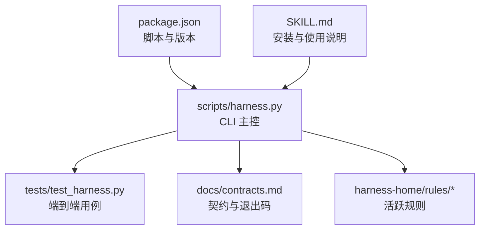
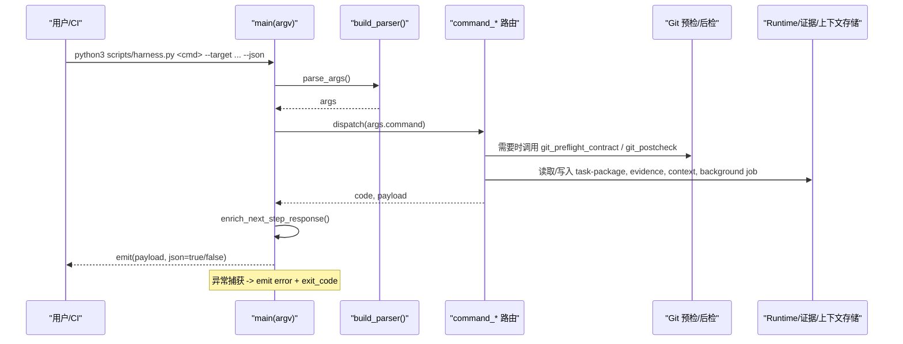
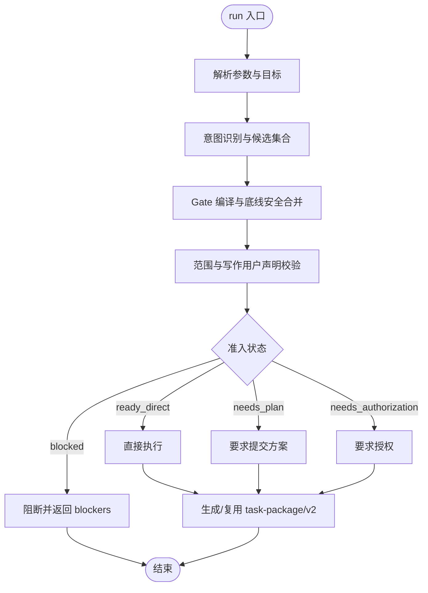
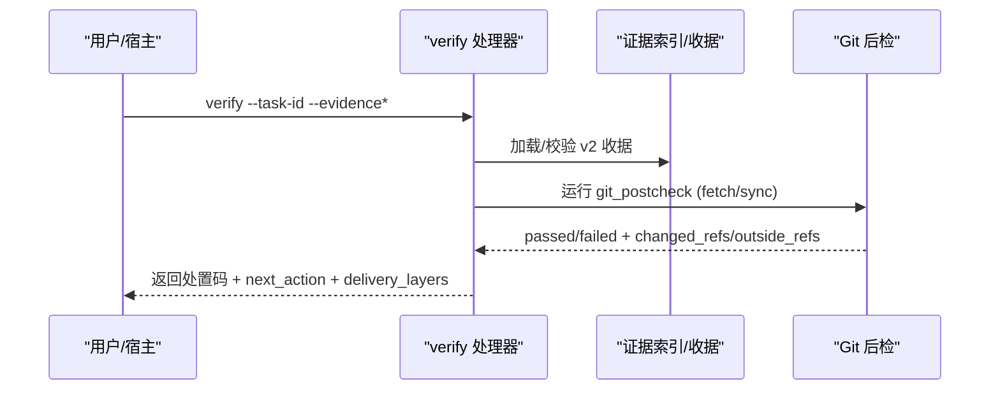
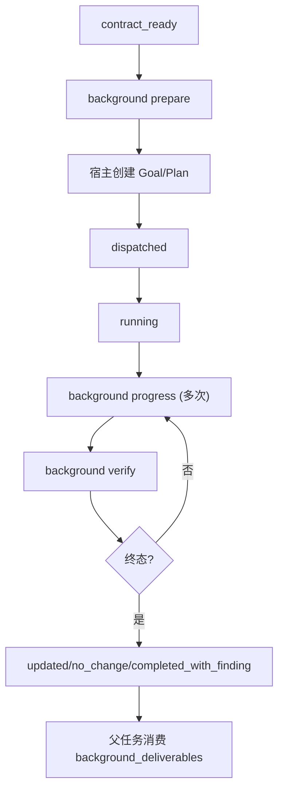
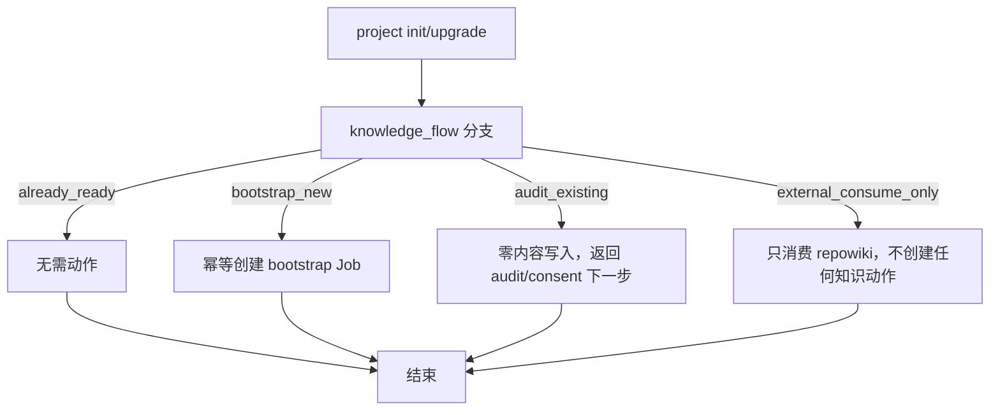
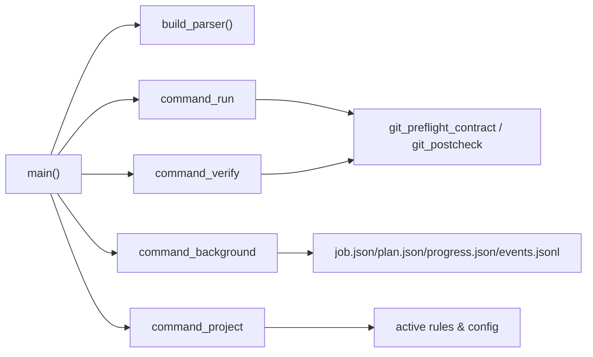

# 命令使用示例

<cite>
**本文引用的文件**   
- [scripts/harness.py](file://scripts/harness.py)
- [tests/test_harness.py](file://tests/test_harness.py)
- [package.json](file://package.json)
- [SKILL.md](file://SKILL.md)
- [docs/contracts.md](file://docs/contracts.md)
</cite>

## 目录
1. [简介](#简介)
2. [项目结构](#项目结构)
3. [核心组件](#核心组件)
4. [架构总览](#架构总览)
5. [详细组件分析](#详细组件分析)
6. [依赖关系分析](#依赖关系分析)
7. [性能注意事项](#性能注意事项)
8. [故障排除指南](#故障排除指南)
9. [结论](#结论)
10. [附录](#附录)

## 简介
本文件为 Docs Harness 的命令使用示例文档，面向实际工作流与边界场景，覆盖 run、verify、background、project、ledger 等命令的组合使用方法；提供错误处理与故障排除案例；说明 JSON 输出格式的结构化处理方法；给出自动化脚本集成示例与 CI/CD 管道配置参考；记录环境变量配置与调试选项的使用方法。所有示例均基于仓库中的实现与测试用例进行归纳，确保可落地执行。

## 项目结构
Docs Harness 以 Python 单文件控制器为核心，配合测试套件、规则集与合同文档组织：
- scripts/harness.py：CLI 入口、命令解析、主流程编排、Git 预检/后检、证据与上下文管理、后台 Job 控制面等。
- tests/test_harness.py：端到端测试，演示 run/context/verify/project/background/ledger 的典型用法与断言。
- package.json：包元数据与脚本（含 self-test）。
- SKILL.md：安装与任务入口、后台治理、质量账本等高层使用说明。
- docs/contracts.md：v2 任务包、验收层、Git 状态合同、证据收据、退出码等契约定义。

**图表来源** 
- [scripts/harness.py:10400-10560](file://scripts/harness.py#L10400-L10560)
- [tests/test_harness.py:1-120](file://tests/test_harness.py#L1-L120)
- [docs/contracts.md:1-120](file://docs/contracts.md#L1-L120)

**章节来源**
- [scripts/harness.py:10400-10560](file://scripts/harness.py#L10400-L10560)
- [tests/test_harness.py:1-120](file://tests/test_harness.py#L1-L120)
- [package.json:1-23](file://package.json#L1-L23)
- [SKILL.md:1-106](file://SKILL.md#L1-L106)
- [docs/contracts.md:1-120](file://docs/contracts.md#L1-L120)

## 核心组件
- CLI 命令路由与参数解析：build_parser 定义 run、context、progress、verify、task、ledger、knowledge、background、project、self-test 子命令及参数。
- 主循环 main：根据 args.command 分发到对应 command_* 函数，统一 emit JSON 或人类可读输出，捕获 HarnessError 并返回结构化错误。
- Git 预检/后检：git_preflight_contract、git_postcheck 用于 git_fetch/git_sync 的受控变更范围、远端漂移、LFS/Submodule 校验。
- 证据与上下文：evidence-receipt/v2、context-receipt/v2、verification-command-receipt/v1 的生成、缓存与复用策略。
- 后台 Job：background prepare/dispatch/progress/verify/retry/prune 控制面写入，业务数据面受限。
- 项目生命周期：project init/upgrade/uninstall/check/diff/rollback-check。

**章节来源**
- [scripts/harness.py:10400-10560](file://scripts/harness.py#L10400-L10560)
- [docs/contracts.md:120-220](file://docs/contracts.md#L120-L220)

## 架构总览
下图展示 CLI 调用到命令处理器、再到具体能力模块的调用链，以及 JSON 输出与错误处理路径。

**图表来源** 
- [scripts/harness.py:10400-10560](file://scripts/harness.py#L10400-L10560)

## 详细组件分析

### 命令 run：意图识别、准入与任务包
- 典型用法
  - 首次准入：python3 scripts/harness.py run --target . --task "<原始任务>" --json
  - 指定特性与范围：--feature <feature-id> --scope <path|glob>
  - 提供事实约束：--facts <facts.json>（仅接受文件路径）
  - 强制新建任务：--new-task
- 常见工作流
  - 只读查询：返回 mutation_profile=read_only，allowed_actions=["read"]
  - 审计+修复混合：最高 mutation_profile 决定路线，candidate_intents 保留全部候选
  - Git 操作：git_inspect（只读）、git_fetch（元数据写入）、git_sync（工作区写入，需计划）
- 边界场景
  - 自然语言 scope 拒绝：invalid_scope_description
  - 混合意图升级：fetch+sync 取 workspace_write 上限
  - 幂等复用：同一 target+任务文本+事实指纹+工作区快照命中活动任务返回 active_task_reused

**图表来源** 
- [scripts/harness.py:10400-10560](file://scripts/harness.py#L10400-L10560)
- [docs/contracts.md:10-80](file://docs/contracts.md#L10-L80)

**章节来源**
- [tests/test_harness.py:408-484](file://tests/test_harness.py#L408-L484)
- [tests/test_harness.py:503-576](file://tests/test_harness.py#L503-L576)
- [docs/contracts.md:10-80](file://docs/contracts.md#L10-L80)

### 命令 verify：同源验收、补证与重新准入
- 典型用法
  - 提交证据：python3 scripts/harness.py verify --target . --task-id <id> --evidence <evidence.json> --json
  - 多证据：--evidence 可重复
  - 无证据重验：仅 --task-id 触发验证命令缓存与 Git 后检
- 处置与退出码
  - provide_evidence：write_scope 内未归因写入，默认自动认领（可关闭）
  - refresh_evidence：读取基线漂移，失效并重读
  - retry_verification：验证命令失败且输入不变
  - incremental_admission：仅追加普通 Gate，合同不变
  - full_readmission：范围/高风险合同/规则变化
- Git 后检
  - git_fetch：仅允许声明的远端 refs/objects 变化
  - git_sync：绑定预检 OID，自动生成变更范围，支持漂移累积与自动归因

**图表来源** 
- [scripts/harness.py:10400-10560](file://scripts/harness.py#L10400-L10560)
- [docs/contracts.md:134-220](file://docs/contracts.md#L134-L220)

**章节来源**
- [tests/test_harness.py:651-709](file://tests/test_harness.py#L651-L709)
- [tests/test_harness.py:736-756](file://tests/test_harness.py#L736-L756)
- [docs/contracts.md:134-220](file://docs/contracts.md#L134-L220)

### 命令 background：后台治理 Job 控制面
- 常用动作
  - list/status：列出与查看 Job
  - prepare：在 contract_ready 或特定在途状态准备工件（Plan/Progress）
  - dispatch：进入 dispatched → running
  - progress：推进工作包状态 in_progress/completed/blocked
  - verify：验收 updated/no_change/completed_with_finding
  - retry：归档当前 attempt 并推进 attempt 数
  - prune：清理旧 Job（dry-run/apply）
- 复杂路线
  - background_goal：先建立持续目标与正式方案，再执行工作包
  - background_goal_phased：单一 Owner 分阶段推进，串行合并公共层与知识地图
- 限制与不变量
  - may_mutate_parent=false、may_spawn_child_jobs=false、suppress_post_completion_dispatch=true
  - 控制面只由 CLI 写入，业务数据面受限

**图表来源** 
- [scripts/harness.py:10400-10560](file://scripts/harness.py#L10400-L10560)
- [docs/contracts.md:303-345](file://docs/contracts.md#L303-L345)

**章节来源**
- [tests/test_harness.py:165-196](file://tests/test_harness.py#L165-L196)
- [SKILL.md:60-90](file://SKILL.md#L60-L90)
- [docs/contracts.md:303-345](file://docs/contracts.md#L303-L345)

### 命令 project：项目安装与生命周期
- 动作
  - init：初始化最小骨架、评估知识需求、返回 knowledge_bootstrap 后台合同
  - upgrade：preserve-and-merge 合法 document_routes；非法或缺失路由合同的在途治理 Job 返回 needs_manual_migration
  - uninstall/check/diff/rollback-check：卸载、检查、差异对比、回滚窗口可用性检查
- 外部知识库模式
  - 存在 .qoder/repowiki 时进入只消费模式，不创建 docs 骨架，knowledge bootstrap 失败关闭

**图表来源** 
- [scripts/harness.py:10400-10560](file://scripts/harness.py#L10400-L10560)
- [docs/contracts.md:340-345](file://docs/contracts.md#L340-L345)

**章节来源**
- [tests/test_harness.py:356-406](file://tests/test_harness.py#L356-L406)
- [SKILL.md:14-25](file://SKILL.md#L14-L25)
- [docs/contracts.md:340-345](file://docs/contracts.md#L340-L345)

### 命令 ledger：质量账本
- add：人工触发记录质量复盘（脱敏 JSON），不得自动注入
- read：按任务编号或关键词检索历史条目，限制条数

**章节来源**
- [SKILL.md:92-101](file://SKILL.md#L92-L101)
- [scripts/harness.py:10434-10445](file://scripts/harness.py#L10434-L10445)

### 命令 task：任务管理与迁移
- status/migrate/cancel/archive/list/prune：查询、显式迁移 v1→v2、取消（受控原因码）、归档、列表（可选包含已归档）、清理（dry-run/apply）

**章节来源**
- [scripts/harness.py:10424-10433](file://scripts/harness.py#L10424-L10433)
- [docs/contracts.md:236-282](file://docs/contracts.md#L236-L282)

### 命令 knowledge：知识库审查与估算
- status/estimate/audit/bootstrap/update/verify/job-status/dispatch/retry：功能知识库的审查、评估、引导 bootstrap、增量更新、验收与兼容后台入口

**章节来源**
- [scripts/harness.py:10446-10454](file://scripts/harness.py#L10446-L10454)
- [docs/contracts.md:340-345](file://docs/contracts.md#L340-L345)

### 命令 self-test：内置合同自检
- 运行内置规则与契约自检，返回 rules 与 status

**章节来源**
- [tests/test_harness.py:339-354](file://tests/test_harness.py#L339-L354)
- [scripts/harness.py:10477-10479](file://scripts/harness.py#L10477-L10479)

## 依赖关系分析
- CLI 与命令处理器：main 通过 build_parser 解析参数并分发至 command_* 函数。
- Git 工具：git_command、git_preflight_contract、git_postcheck 封装 Git 操作与超时、错误处理。
- 文件与 JSON：atomic_write_json/read_json/read_jsonl/append_jsonl 保证原子性与一致性。
- 契约与规则：运行时依赖 active 规则与 contracts.md 定义的 v2 对象结构与验收层。

**图表来源** 
- [scripts/harness.py:10400-10560](file://scripts/harness.py#L10400-L10560)

**章节来源**
- [scripts/harness.py:10400-10560](file://scripts/harness.py#L10400-L10560)

## 性能注意事项
- 证据与验证命令缓存：verification-command-receipt/v1 支持按 argv、produces、输入指纹缓存命中，避免重复执行。
- 上下文复用：context-receipt/v2 跨阶段复用，减少重复加载成本。
- Git 预检优化：git_preflight_contract 一次性收集 LFS/Submodule 可用性与 diff 清单，减少后续重试。
- 批量处理：JSONL 事件与证据索引采用追加与顺序读取，适合流水线批处理。

[本节为通用指导，不直接分析具体文件]

## 故障排除指南
- 常见错误与退出码
  - 2：输入、合同、绑定或状态无效（如 invalid_scope_description、missing_file、invalid_json）
  - 3：需要方案、授权、证据、迁移、用户输入或 Git 交付（provide_evidence/refresh_evidence/retry_verification/incremental_admission）
  - 4：范围、漂移、Gate、远端、授权或规则变化，必须重新准入（full_readmission）
- 典型问题定位
  - Git 同步失败：检查脏工作区、非 fast-forward、删除阈值、LFS/Submodule 可用性
  - 证据被拒：确认 v2 生产者、时间戳、cwd、digest、读写集合与 TTL
  - 背景 Job 无法推进：确认 prepare/dispatched/running 序列与工作包 ID 来自冻结 Plan
- 调试建议
  - 使用 --json 获取结构化输出，便于脚本解析
  - 启用 self-test 验证规则与契约完整性
  - 通过 task list/prune 清理过期对象，保持 Runtime 整洁

**章节来源**
- [docs/contracts.md:361-372](file://docs/contracts.md#L361-L372)
- [tests/test_harness.py:685-709](file://tests/test_harness.py#L685-L709)
- [tests/test_harness.py:736-756](file://tests/test_harness.py#L736-L756)

## 结论
Docs Harness 通过严格的契约与受控的 CLI 控制面，将任务意图、风险 Gate、范围、上下文、证据与验收串联成可审计、可复用的流水线。结合 run/verify/background/project/ledger 等命令，可在本地与 CI/CD 中构建稳定、安全的文档与治理闭环。遵循本文示例与契约定义，可有效降低误操作风险并提升交付效率。

[本节为总结性内容，不直接分析具体文件]

## 附录

### 常见工作流示例（命令行）
- 新项目安装与知识引导
  - python3 scripts/harness.py project init --target . --json
  - 根据返回的 knowledge_flow 与 next_action 执行 bootstrap 或 audit
- 代码修改与验收
  - python3 scripts/harness.py run --target . --task "实现 src/core.py" --scope src/core.py --json
  - 编辑文件后，生成证据并提交：python3 scripts/harness.py verify --target . --task-id <id> --evidence <evidence.json> --json
- Git 同步
  - 先 fetch：facts={"task_intent":"git_fetch","git_scope":[".git:refs/remotes/origin/*"]}
  - 再 sync：facts={"task_intent":"git_sync","git_scope":[".git:refs/remotes/origin/main"]}
  - 提交 plan 后执行 merge，最后 verify
- 后台治理
  - background prepare/dispatch/progress/verify 标准序列，复杂路线需先建立 Goal/Plan
- 质量账本
  - ledger add --task-id <id> --review <review.json> --json
  - ledger read --query "关键词" --limit 5 --json

**章节来源**
- [SKILL.md:14-101](file://SKILL.md#L14-L101)
- [tests/test_harness.py:146-214](file://tests/test_harness.py#L146-L214)
- [tests/test_harness.py:651-709](file://tests/test_harness.py#L651-L709)

### JSON 输出格式与结构化处理
- 所有命令支持 --json 输出，emit 函数负责序列化 payload
- 推荐用 jq 或 Python 解析：
  - 提取 next_action、reason_code、delivery_layers、control_status、changed_paths 等关键字段
  - 对数组字段（如 candidate_intents、blockers）做遍历判断
- 错误响应：status=error，code=message 结构化，便于脚本分支处理

**章节来源**
- [scripts/harness.py:10482-10488](file://scripts/harness.py#L10482-L10488)
- [tests/test_harness.py:59-87](file://tests/test_harness.py#L59-L87)

### 自动化脚本集成示例
- 基本模板（伪代码）
  - 解析 --json 输出
  - 若 status=error：按 code 分支处理（重试/提示/中止）
  - 若 next_action 指向 load_context/submit/block：按指引执行相应命令
  - 若 verify 返回 provide_evidence/refresh_evidence/retry_verification：按处置继续
- CI/CD 步骤建议
  - 安装与自检：npm test/self-test
  - 任务准入与执行：run → context → verify
  - 后台治理：background prepare/dispatch/progress/verify
  - 质量账本：ledger add（仅在明确要求时）

**章节来源**
- [package.json:17-21](file://package.json#L17-L21)
- [tests/test_harness.py:59-87](file://tests/test_harness.py#L59-L87)

### 环境变量与调试选项
- 环境变量
  - PYTHONDONTWRITEBYTECODE=1：测试中禁用字节码生成，避免干扰
- 调试选项
  - --json：结构化输出
  - --apply：显式应用危险操作（迁移、取消、归档、清理）
  - --dry-run：仅预览 prune 候选
  - --repair：修复损坏的后台工件

**章节来源**
- [tests/test_harness.py:59-87](file://tests/test_harness.py#L59-L87)
- [scripts/harness.py:10424-10479](file://scripts/harness.py#L10424-L10479)

### 错误处理与故障排除案例
- 自然语言 scope 拒绝：invalid_scope_description
- Git 同步脏工作区重叠：blocked + blockers 描述
- 非 fast-forward：blocked + blockers 描述
- LFS/Submodule 不可用：preflight 失败关闭
- 证据缺失或无效：provide_evidence/refresh_evidence/retry_verification

**章节来源**
- [tests/test_harness.py:485-502](file://tests/test_harness.py#L485-L502)
- [tests/test_harness.py:685-709](file://tests/test_harness.py#L685-L709)
- [tests/test_harness.py:736-756](file://tests/test_harness.py#L736-L756)