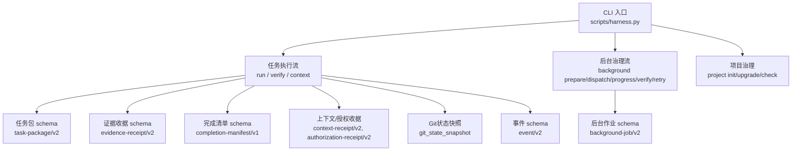
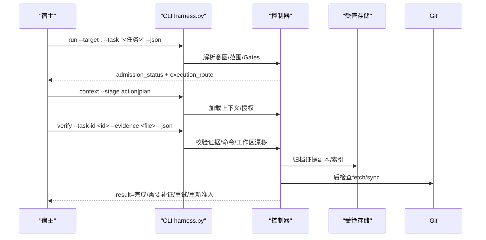
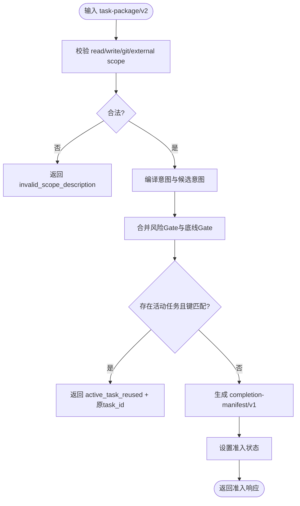
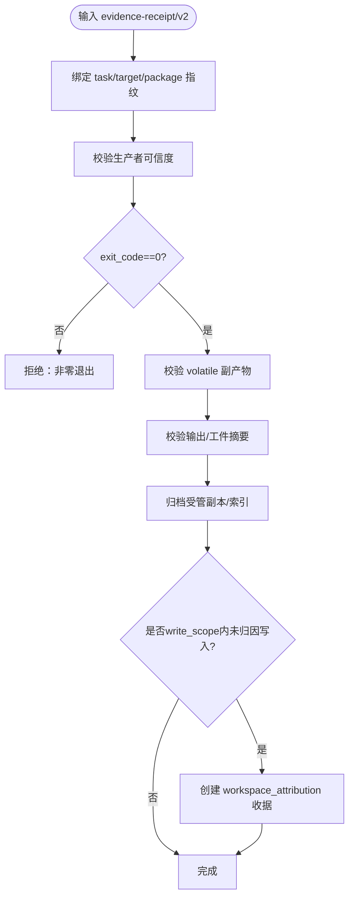
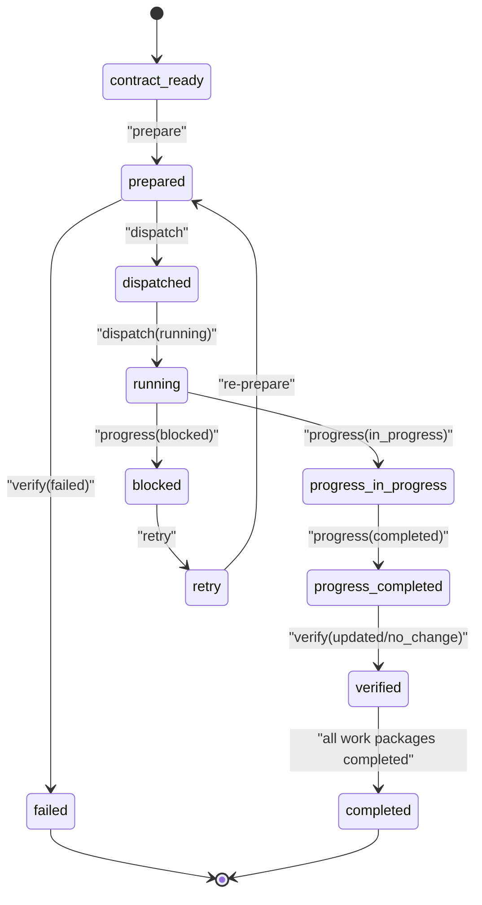
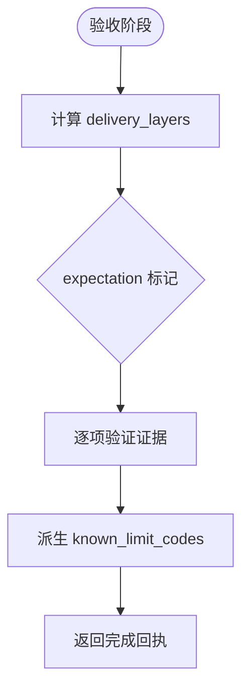
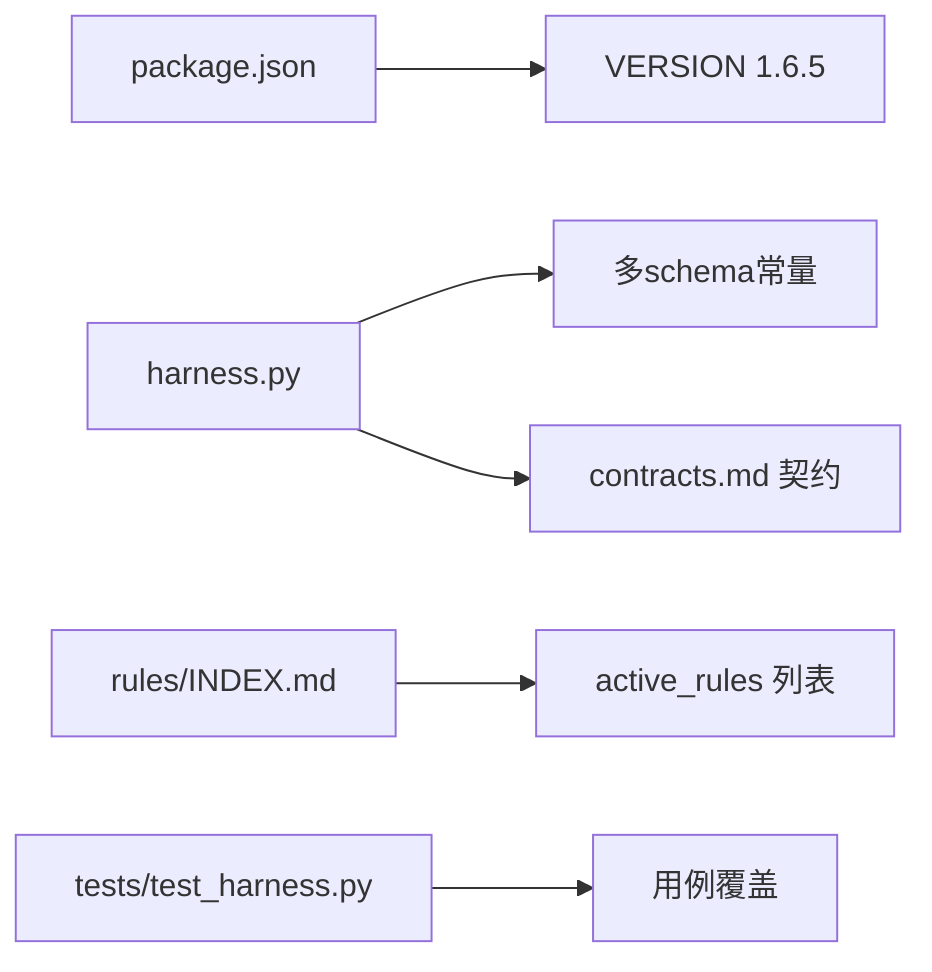

# JSON接口规范

<cite>
**本文引用的文件**   
- [contracts.md](file://docs/contracts.md)
- [SKILL.md](file://SKILL.md)
- [api-compatibility.md](file://harness-home/rules/api-compatibility.md)
- [external-input-security.md](file://harness-home/rules/external-input-security.md)
- [documentation-changes.md](file://harness-home/rules/documentation-changes.md)
- [INDEX.md](file://harness-home/rules/INDEX.md)
- [package.json](file://package.json)
- [test_harness.py](file://tests/test_harness.py)
- [harness.py](file://scripts/harness.py)
</cite>

## 目录
1. [简介](#简介)
2. [项目结构](#项目结构)
3. [核心组件](#核心组件)
4. [架构总览](#架构总览)
5. [详细组件分析](#详细组件分析)
6. [依赖关系分析](#依赖关系分析)
7. [性能与可观测性](#性能与可观测性)
8. [故障排查指南](#故障排查指南)
9. [结论](#结论)
10. [附录：API测试用例与验证工具](#附录api测试用例与验证工具)

## 简介
本规范为 Docs Harness v1.6.5 的完整JSON接口契约，覆盖任务包、证据收据、后台作业、上下文与授权收据、完成清单、Git状态快照、事件与退出码等。文档以“失败关闭”为原则，强调幂等、可审计、受控范围与最小权限。所有数据结构均提供字段类型、约束与示例路径，便于宿主与控制器实现对接。

## 项目结构
- 产品边界与版本：v1.6.5，使用 docs-harness/project-config/v4
- 入口命令：scripts/harness.py（Python CLI）
- 规则集：harness-home/rules/*（active 规则快照）
- 测试与自检：tests/test_harness.py、package.json scripts

图表来源
- [harness.py:26-68](file://scripts/harness.py#L26-L68)
- [contracts.md:1-10](file://docs/contracts.md#L1-L10)

章节来源
- [package.json:1-23](file://package.json#L1-L23)
- [SKILL.md:1-40](file://SKILL.md#L1-L40)

## 核心组件
本节定义所有核心数据模型与字段约束，并给出示例路径与校验要点。

### 任务包 task-package/v2
- 用途：描述任务意图、候选意图、变更面、读写范围、允许动作等
- 关键字段与类型
  - task_intent: string，枚举值见下节
  - candidate_intents: array of {intent: string, mutation_profile: string}
  - deferred_intents: array of string
  - intent_boundary_reason_codes: array of string
  - mutation_profile: string，read_only | git_metadata_write | workspace_write | external_write
  - read_scope: array of string，项目内相对路径或glob或受控Git资源
  - write_scope: array of string，同上
  - git_scope: array of string，受控Git引用或历史
  - external_scope: array of string
  - allowed_actions: array of string，由意图推导
- 约束与验证
  - 自然语言边界不得伪装成路径；非法返回 invalid_scope_description
  - 混合意图取最高 mutation_profile 与风险 Gate
  - run 按 active task key 幂等复用；blocked/complete/cancelled/failed 不复用
- 示例路径
  - [contracts.md:11-28](file://docs/contracts.md#L11-L28)

章节来源
- [contracts.md:9-48](file://docs/contracts.md#L9-L48)

### 准入状态与完成清单 completion-manifest/v1
- 准入状态：blocked | needs_plan | needs_authorization | ready_direct | ready_planned | ready_extended
- 完成清单字段
  - manifest_fingerprint: string (sha256)
  - required_evidence_types: array of string
  - required_receipts: array of string
  - conditional_reviews: array of object
  - conditional_evidence: array of object
  - verification_commands: array of {argv: string[], produces: string[]}
  - completion_blockers: array of string
  - completion_protocol: string，固定 incremental_receipts_single_final
- 约束
  - verify 仅按清单固定项验收，不得静默新增要求
  - 新Gate需完整重新准入；普通追加Gate走增量准入并继承已冻结基线
- 示例路径
  - [contracts.md:50-76](file://docs/contracts.md#L50-L76)

章节来源
- [contracts.md:50-81](file://docs/contracts.md#L50-L81)

### Git状态快照 git_state_snapshot
- 字段
  - repo_identity: string (sha256)
  - remote: {name: string, url_fingerprint: string, refspec: string}
  - preflight_target_oid: string
  - head: string
  - index_tree: string (sha256)
  - worktree_fingerprint: string (sha256)
  - controlled_refs_namespace: array of string
  - lfs_available: boolean
  - submodule_available: boolean
  - git_sync_scope: array of string
- 约束
  - 远端URL指纹前移除用户名/密码/token/查询参数/fragment
  - git_inspect只读；git_fetch仅允许声明refs变化；git_sync绑定单一预检OID
  - controlled_refs_namespace自动包含 origin/HEAD 相关引用
- 示例路径
  - [contracts.md:97-123](file://docs/contracts.md#L97-L123)

章节来源
- [contracts.md:97-133](file://docs/contracts.md#L97-L133)

### 证据收据 evidence-receipt/v2
- 必填绑定字段
  - task_id: string
  - target_identity: string (sha256)
  - package_fingerprint: string (sha256)
  - content_set_fingerprint: string|null
  - producer: {adapter: string, capability: string}
  - command_argv_digest: string (sha256)
  - cwd: string
  - started_at: string (ISO时间)
  - ended_at: string (ISO时间)
  - ttl: number (秒)
  - exit_code: number
  - output_or_artifact_digest: string (sha256)
  - read_set: array of {path: string, fingerprint: string}
  - write_set: array of string
- 约束
  - 过期、跨任务/目标/package、不可信生产者、非零退出或摘要无效均拒绝
  - 高风险证据必须来自可信 v2 生产者
  - 验证命令 produces 白名单限制；volatile 副产物容忍策略
  - 证据文件复制进受管 artifact store，原始删除不影响采纳
- 简化声明 evidence-declaration/v1
  - 宿主提交 type/write_set/read_set/concurrent_drift/conclusion，控制器代铸绑定字段与指纹
- 示例路径
  - [contracts.md:165-216](file://docs/contracts.md#L165-L216)

章节来源
- [contracts.md:165-219](file://docs/contracts.md#L165-L219)

### 上下文与授权收据
- 上下文收据 context-receipt/v2
  - 缓存命中条件：同一 task_id/target_identity/stage/compiler_contract/content_set_fingerprint
- 授权收据 authorization-receipt/v2
  - 始终绑定当前 package fingerprint，不跨修订复用
- 示例路径
  - [contracts.md:222-234](file://docs/contracts.md#L222-L234)

章节来源
- [contracts.md:222-234](file://docs/contracts.md#L222-L234)

### 后台作业 background-job/v2
- 执行路线
  - background_direct：有界后台执行
  - background_goal：持久目标与正式方案
  - background_goal_phased：单一目标Owner分阶段执行
- 能力不足时进入 queued_manual，不得静默降级
- 固定不变量：may_mutate_parent=false, may_spawn_child_jobs=false, suppress_post_completion_dispatch=true
- 业务数据面写入受限：allowed_write_scope 不得包含 .git/**、.docs-harness/** 或 Runtime
- 标准序列：contract_ready → prepare → dispatched → running → progress → verify → 终态
- 示例路径
  - [contracts.md:303-348](file://docs/contracts.md#L303-L348)

章节来源
- [contracts.md:303-348](file://docs/contracts.md#L303-L348)

### 事件 event/v2
- 有界字段：phase, started_at, duration_ms, reason_code, package_revision, context_cache_hit, context_load_count, readmission_count, evidence_round_count, host_receipt_count, business_action_count
- 禁止保存用户正文、原始输出、环境变量、凭证或完整日志
- 示例路径
  - [contracts.md:283-301](file://docs/contracts.md#L283-L301)

章节来源
- [contracts.md:283-301](file://docs/contracts.md#L283-L301)

### 完成回执 delivery_layers
- 层级顺序：source, local_verification, git_head, remote_delivery, fresh_clone, release_artifact, ui, external_state
- 每层包含 expectation（not_applicable|not_requested|required）、status（not_verified|verified）、evidence_refs
- 不同意图默认标记 not_applicable/not_requested/required
- 示例路径
  - [contracts.md:82-95](file://docs/contracts.md#L82-L95)

章节来源
- [contracts.md:82-95](file://docs/contracts.md#L82-L95)

## 架构总览
Docs Harness 通过 CLI 暴露统一入口，内部按“任务包→编译→准入→执行→证据→验收→后台治理”的流程组织。所有关键对象均有schema版本与指纹，确保幂等与可追溯。

图表来源
- [harness.py:26-68](file://scripts/harness.py#L26-L68)
- [contracts.md:50-76](file://docs/contracts.md#L50-L76)

## 详细组件分析

### 任务包Schema与验证流程
- 字段类型与约束见“核心组件”
- 验证流程
  - 输入合法性校验（路径、glob、受控Git资源）
  - 意图到mutation_profile映射与风险Gate合并
  - 活动任务幂等复用判定
  - 生成完成清单与准入状态
- 流程图

图表来源
- [contracts.md:9-48](file://docs/contracts.md#L9-L48)
- [contracts.md:50-76](file://docs/contracts.md#L50-L76)

章节来源
- [contracts.md:9-48](file://docs/contracts.md#L9-L48)
- [contracts.md:50-76](file://docs/contracts.md#L50-L76)

### 证据收据Schema与验证命令
- 字段与约束见“核心组件”
- 验证命令
  - argv: string[]
  - produces: string[]（白名单）
  - 输入指纹与工作区相关写入参与幂等键
  - volatile_paths 白名单控制临时副产物
- 流程图

图表来源
- [contracts.md:165-216](file://docs/contracts.md#L165-L216)

章节来源
- [contracts.md:165-216](file://docs/contracts.md#L165-L216)

### 后台作业状态机
- 状态转换
  - contract_ready → prepare → dispatched → running → progress → verify → 终态
  - 复杂路线不允许跳过中间态
- 状态图

图表来源
- [contracts.md:303-348](file://docs/contracts.md#L303-L348)

章节来源
- [contracts.md:303-348](file://docs/contracts.md#L303-L348)

### 完成回执与交付层
- 层级与期望值决定 known_limit_codes
- 不同意图默认标记 not_applicable/not_requested/required
- 流程图

图表来源
- [contracts.md:82-95](file://docs/contracts.md#L82-L95)

章节来源
- [contracts.md:82-95](file://docs/contracts.md#L82-L95)

## 依赖关系分析
- 控制器依赖多个schema版本常量，确保向后兼容与迁移
- 规则集通过 INDEX.md 管理 active 规则，运行时不得依赖源码绝对路径
- 测试套件覆盖安装、任务准入、知识生命周期、后台Job、兼容迁移与幂等路径

图表来源
- [package.json:1-23](file://package.json#L1-L23)
- [harness.py:26-68](file://scripts/harness.py#L26-L68)
- [INDEX.md:1-41](file://harness-home/rules/INDEX.md#L1-L41)

章节来源
- [INDEX.md:1-41](file://harness-home/rules/INDEX.md#L1-L41)
- [harness.py:26-68](file://scripts/harness.py#L26-L68)

## 性能与可观测性
- 事件脱敏：event/v2 仅保存有界字段，避免敏感信息泄露
- 命令缓存：verification-command-receipt/v1 支持按输入指纹复用通过结果
- 证据副本：受管存储隔离原始文件，提升稳定性与可恢复性
- 建议
  - 合理设置 verification.volatile_paths 减少误判
  - 使用 command_cache_enabled=false 关闭缓存进行一致性验证
  - 关注 known_limit_codes 定位未完成交付层

[本节为通用指导，无需特定文件来源]

## 故障排查指南
- 常见错误码
  - 0：成功；verify.result=完成表示父任务完成
  - 1：项目检查/完整性读取失败
  - 2：输入/合同/绑定/状态无效
  - 3：需要方案/授权/证据/迁移/用户输入/Git交付
  - 4：范围/漂移/Gate/远端/授权/规则变化，需重新准入
- 典型问题
  - invalid_scope_description：路径描述非法
  - git_remote_drift：远端漂移导致阻断
  - non-fast-forward/fast-forward冲突：分支分歧
  - LFS/Submodule不可用：前置检查失败
- 处理建议
  - 根据 reason_code 定位阻断原因
  - 补充证据或刷新读取基线
  - 显式 apply 迁移或重新准入

章节来源
- [contracts.md:359-370](file://docs/contracts.md#L359-L370)

## 结论
本规范明确了 Docs Harness v1.6.5 的JSON接口契约，涵盖任务包、证据收据、后台作业、上下文与授权收据、完成清单、Git状态快照、事件与退出码。通过严格的schema版本、指纹与幂等设计，确保系统安全、可控、可审计。宿主应遵循最小权限与失败关闭原则，结合测试与自检工具保障集成质量。

[本节为总结，无需特定文件来源]

## 附录：API测试用例与验证工具
- 自动化入口
  - 完整回归：npm test
  - 控制器自检：npm run self-test
  - 发布包清单：npm run pack:check
- 测试要点
  - 安装升级、任务准入、知识生命周期、后台Job、兼容迁移、幂等路径
  - 复杂路线覆盖 prepare → dispatched → running → progress → verify
  - Git交付与fresh clone独立证据
- 示例调用
  - project init/upgrade/check
  - run/context/verify
  - background list/status/prepare/dispatch/progress/verify/retry

章节来源
- [testing.md:1-25](file://docs/testing.md#L1-L25)
- [package.json:17-22](file://package.json#L17-L22)
- [test_harness.py:1-120](file://tests/test_harness.py#L1-L120)