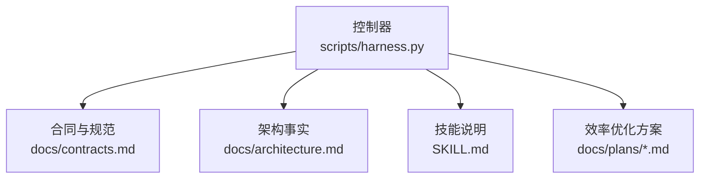
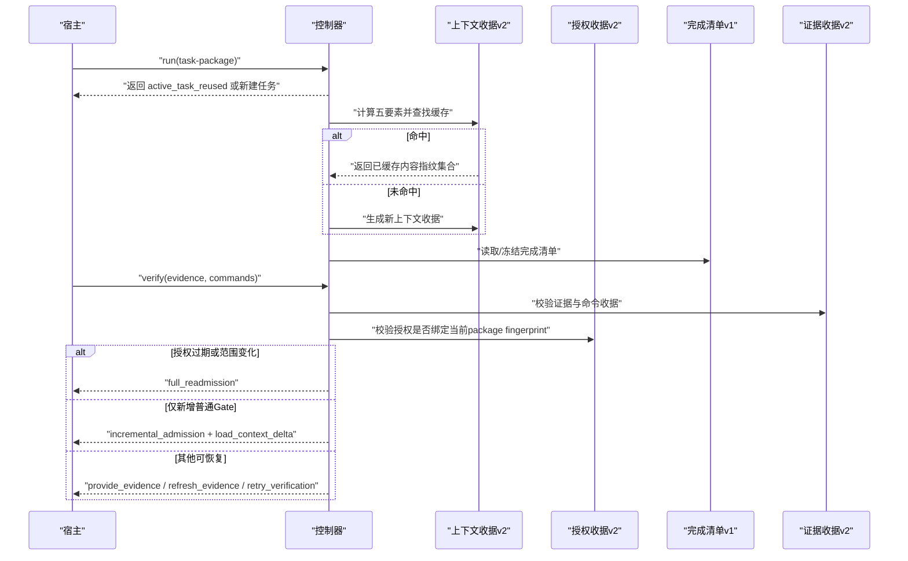
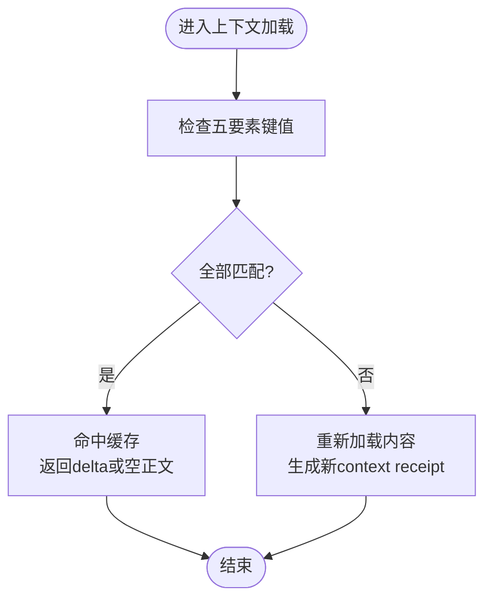
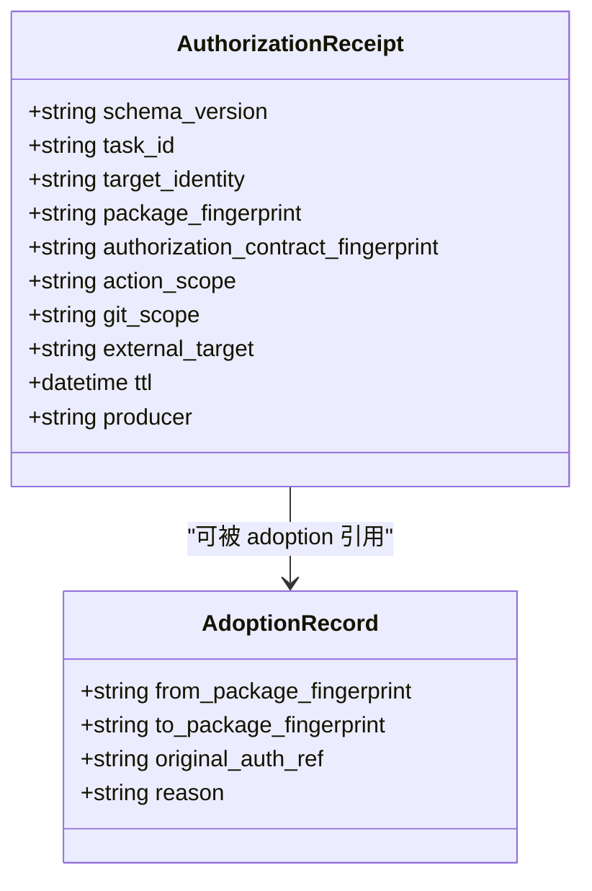
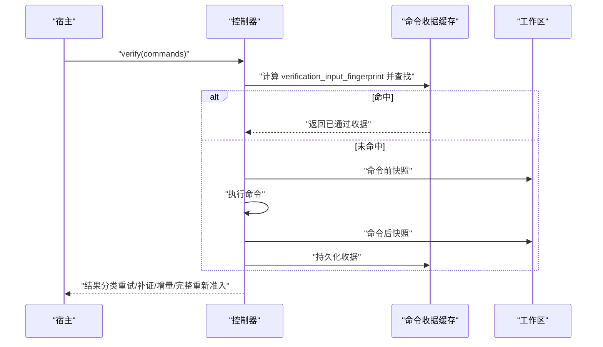
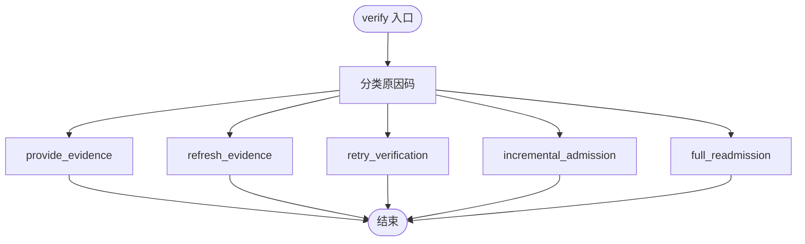
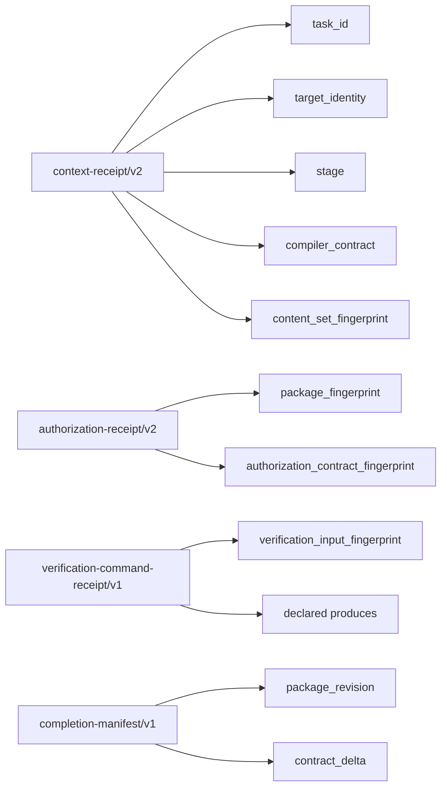

# 上下文与授权Schema定义

<cite>
**本文引用的文件**
- [contracts.md](file://docs/contracts.md)
- [task-admission-efficiency-plan.md](file://docs/plans/task-admission-efficiency-plan.md)
- [v1.6.4-minimal-systemic-flow-efficiency-plan.md](file://docs/plans/v1.6.4-minimal-systemic-flow-efficiency-plan.md)
- [architecture.md](file://docs/architecture.md)
- [SKILL.md](file://SKILL.md)
</cite>

## 目录
1. [引言](#引言)
2. [项目结构](#项目结构)
3. [核心组件](#核心组件)
4. [架构总览](#架构总览)
5. [详细组件分析](#详细组件分析)
6. [依赖关系分析](#依赖关系分析)
7. [性能考量](#性能考量)
8. [故障排查指南](#故障排查指南)
9. [结论](#结论)
10. [附录：JSON Schema 定义](#附录json-schema-定义)

## 引言
本文件为 Docs Harness 的上下文收据（docs-harness/context-receipt/v2）与授权收据（docs-harness/authorization-receipt/v2）提供完整的 JSON Schema 文档，并围绕以下目标展开：
- 明确上下文复用的五个必要条件：同一 task_id、同一 target_identity、同一 stage、同一 compiler_contract、同一 content_set_fingerprint。
- 解释授权收据与 package fingerprint 的绑定机制及跨修订版本的兼容性处理。
- 给出上下文缓存命中时的响应格式与重新加载条件。
- 说明授权的范围限制与权限继承规则。
- 提供跨修订版本时的上下文迁移策略与兼容性处理。

## 项目结构
- 控制器源码真源位于 scripts/harness.py，负责任务准入、上下文管理、证据与验收、后台治理等。
- 对外行为与合同以 docs/contracts.md 为准；架构事实见 docs/architecture.md；技能入口与使用说明见 SKILL.md。
- 方案与优化细节见 docs/plans 下的计划文档。



**图表来源**
- [architecture.md:1-26](file://docs/architecture.md#L1-L26)

**章节来源**
- [architecture.md:1-26](file://docs/architecture.md#L1-L26)

## 核心组件
- 上下文收据 v2（context-receipt/v2）：用于阶段化内容交付与复用，需满足五要素一致性方可命中缓存。
- 授权收据 v2（authorization-receipt/v2）：绑定当前 package fingerprint，不得跨指纹复用；支持 adoption 兼容旧包指纹。
- 验证命令收据（verification-command-receipt/v1）：逐项执行、逐项快照、输入指纹缓存命中则跳过执行。
- 完成清单（completion-manifest/v1）：冻结收尾要求，支持增量 Gate 与上下文 delta 加载。

**章节来源**
- [contracts.md:165-234](file://docs/contracts.md#L165-L234)
- [v1.6.4-minimal-systemic-flow-efficiency-plan.md:202-260](file://docs/plans/v1.6.4-minimal-systemic-flow-efficiency-plan.md#L202-L260)

## 架构总览
上下文与授权在任务生命周期中的交互如下：
- run 阶段生成或复用 context receipt，按五要素判断是否命中缓存。
- verify 阶段根据 completion manifest 与 evidence-receipt/v2 校验，必要时触发增量或完整重新准入。
- authorization receipt 始终绑定当前 package fingerprint，变更时强制重新授权。



**图表来源**
- [contracts.md:50-80](file://docs/contracts.md#L50-L80)
- [contracts.md:165-234](file://docs/contracts.md#L165-L234)
- [v1.6.4-minimal-systemic-flow-efficiency-plan.md:304-328](file://docs/plans/v1.6.4-minimal-systemic-flow-efficiency-plan.md#L304-L328)

## 详细组件分析

### 上下文收据 v2（context-receipt/v2）
- 字段语义
  - task_id：任务标识，必须与当前任务一致。
  - target_identity：目标仓库/项目标识，必须与当前目标一致。
  - stage：阶段标识（如 plan/action/work-package），跨阶段不可复用正文。
  - compiler_contract：编译器/规则契约版本，版本变化需重载。
  - content_set_fingerprint：内容集合指纹，集合变化需重载。
  - 其他元数据：producer、时间戳、TTL、exit_code、read_set/write_set 等。
- 复用条件（五要素同时成立）
  - 同一 task_id
  - 同一 target_identity
  - 同一 stage
  - 同一 compiler_contract
  - 同一 content_set_fingerprint
- 缓存命中响应
  - 不重复返回规则与项目事实正文，仅返回差异或确认收据。
  - 若内容集合新增，返回增量内容并标记 context_delta=true。
- 重新加载条件
  - 任一五要素变化、stage 不同、compiler contract 变化、content_set_fingerprint 变化均需重载。



**图表来源**
- [contracts.md:222-234](file://docs/contracts.md#L222-L234)
- [v1.6.4-minimal-systemic-flow-efficiency-plan.md:202-218](file://docs/plans/v1.6.4-minimal-systemic-flow-efficiency-plan.md#L202-L218)

**章节来源**
- [contracts.md:222-234](file://docs/contracts.md#L222-L234)
- [task-admission-efficiency-plan.md:311-314](file://docs/plans/task-admission-efficiency-plan.md#L311-L314)
- [v1.6.4-minimal-systemic-flow-efficiency-plan.md:202-218](file://docs/plans/v1.6.4-minimal-systemic-flow-efficiency-plan.md#L202-L218)

### 授权收据 v2（authorization-receipt/v2）
- 绑定机制
  - 始终绑定当前 package fingerprint，不得跨 fingerprint 复用。
  - 当 package revision 变化但授权合同完全相同时，可通过 adoption 记录引用原授权与新包。
- 范围限制
  - 授权动作、授权范围、Git scope、外部目标或有效期变化均禁止继承。
- 权限继承规则
  - 仅在 adoption 合同下允许“同合同、同范围”的继承；否则必须重新获取授权。
- 跨修订兼容
  - 使用 authorization-adoption/v1 包装原授权与新 package，确保可追溯。



**图表来源**
- [v1.6.4-minimal-systemic-flow-efficiency-plan.md:247-260](file://docs/plans/v1.6.4-minimal-systemic-flow-efficiency-plan.md#L247-L260)
- [task-admission-efficiency-plan.md:396-408](file://docs/plans/task-admission-efficiency-plan.md#L396-L408)

**章节来源**
- [contracts.md:222-234](file://docs/contracts.md#L222-L234)
- [v1.6.4-minimal-systemic-flow-efficiency-plan.md:247-260](file://docs/plans/v1.6.4-minimal-systemic-flow-efficiency-plan.md#L247-L260)
- [task-admission-efficiency-plan.md:396-408](file://docs/plans/task-admission-efficiency-plan.md#L396-L408)

### 验证命令收据与缓存
- 收据键绑定：task_id、target_identity、command argv digest、cwd、verification_input_fingerprint、declared produces、相关合同指纹、producer capability、ttl。
- 缓存命中：输入指纹不变且上次通过，直接复用收据，不重跑命令。
- 失效与重跑：输入变化、失败或 volatile 副产物改变输入时重跑；仅重跑失败或输入变化的命令。



**图表来源**
- [contracts.md:190-221](file://docs/contracts.md#L190-L221)
- [v1.6.4-minimal-systemic-flow-efficiency-plan.md:261-303](file://docs/plans/v1.6.4-minimal-systemic-flow-efficiency-plan.md#L261-L303)

**章节来源**
- [contracts.md:190-221](file://docs/contracts.md#L190-L221)
- [v1.6.4-minimal-systemic-flow-efficiency-plan.md:261-303](file://docs/plans/v1.6.4-minimal-systemic-flow-efficiency-plan.md#L261-L303)

### 完成清单与五级处置
- completion_manifest/v1：冻结必需证据类型、收据、条件项与阻断项。
- 五级处置：provide_evidence、refresh_evidence、retry_verification、incremental_admission、full_readmission。
- 增量 Gate：合同稳定且仅追加普通 Gate 时，增量准入并继承同轮已校验收据。



**图表来源**
- [contracts.md:153-163](file://docs/contracts.md#L153-L163)
- [v1.6.4-minimal-systemic-flow-efficiency-plan.md:304-328](file://docs/plans/v1.6.4-minimal-systemic-flow-efficiency-plan.md#L304-L328)

**章节来源**
- [contracts.md:153-163](file://docs/contracts.md#L153-L163)
- [v1.6.4-minimal-systemic-flow-efficiency-plan.md:304-328](file://docs/plans/v1.6.4-minimal-systemic-flow-efficiency-plan.md#L304-L328)

## 依赖关系分析
- 上下文收据依赖 task_id、target_identity、stage、compiler_contract、content_set_fingerprint 五要素。
- 授权收据依赖 package fingerprint 与 authorization_contract_fingerprint。
- 验证命令收据依赖 verification_input_fingerprint 与 declared produces。
- 完成清单依赖 package revision 与 contract_delta。



**图表来源**
- [contracts.md:165-234](file://docs/contracts.md#L165-L234)
- [v1.6.4-minimal-systemic-flow-efficiency-plan.md:118-149](file://docs/plans/v1.6.4-minimal-systemic-flow-efficiency-plan.md#L118-L149)

**章节来源**
- [contracts.md:165-234](file://docs/contracts.md#L165-L234)
- [v1.6.4-minimal-systemic-flow-efficiency-plan.md:118-149](file://docs/plans/v1.6.4-minimal-systemic-flow-efficiency-plan.md#L118-L149)

## 性能考量
- 上下文正文按内容寻址去重，相同指纹在同一 task/target/compiler contract 下只交付一次。
- 验证命令逐项缓存，输入不变时跳过执行，减少昂贵命令重跑。
- 增量 Gate 与上下文 delta 加载避免全量重新准入与重复加载。

[本节为通用指导，无需特定文件引用]

## 故障排查指南
- 上下文未命中：检查五要素是否完全一致，确认 stage 与 compiler_contract 版本、content_set_fingerprint 是否变化。
- 授权失效：确认 package fingerprint 是否变化；若仅 revision 变化且授权合同未变，应走 adoption 流程。
- 验证命令重复执行：核对 verification_input_fingerprint 是否变化；检查 volatile 副产物是否影响输入指纹。
- 五级处置误判：对照原因码映射，区分 provide_evidence、refresh_evidence、retry_verification、incremental_admission、full_readmission。

**章节来源**
- [contracts.md:153-163](file://docs/contracts.md#L153-L163)
- [v1.6.4-minimal-systemic-flow-efficiency-plan.md:304-328](file://docs/plans/v1.6.4-minimal-systemic-flow-efficiency-plan.md#L304-L328)

## 结论
- 上下文收据 v2 通过五要素严格限定复用边界，确保内容与阶段安全。
- 授权收据 v2 绑定 package fingerprint，采用 adoption 兼容跨修订，防止越权复用。
- 验证命令收据与完成清单共同支撑高效、可审计的执行闭环。
- 跨修订迁移遵循“只读保留、显式迁移、回滚窗口约束”的原则。

[本节为总结性内容，无需特定文件引用]

## 附录：JSON Schema 定义

### 上下文收据 v2（context-receipt/v2）
- 必填字段
  - schema_version: 固定为 "docs-harness/context-receipt/v2"
  - task_id: 字符串，任务标识
  - target_identity: 字符串，目标标识
  - stage: 字符串，阶段标识
  - compiler_contract: 字符串，编译器/规则契约版本
  - content_set_fingerprint: 字符串，内容集合指纹
  - producer: 对象，包含 adapter 与 capability
  - started_at: 字符串，开始时间
  - ended_at: 字符串，结束时间
  - ttl: 整数，生存时间（秒）
  - exit_code: 整数，退出码
  - read_set: 数组，读取路径集
  - write_set: 数组，写入路径集
- 可选字段
  - artifact_ref: 字符串，受管副本引用
  - context_delta: 布尔，是否增量内容
- 复用条件
  - 五要素完全一致方可命中缓存

```json
{
  "$schema": "http://json-schema.org/draft-07/schema#",
  "title": "context-receipt-v2",
  "type": "object",
  "required": ["schema_version","task_id","target_identity","stage","compiler_contract","content_set_fingerprint","producer","started_at","ended_at","ttl","exit_code","read_set","write_set"],
  "properties": {
    "schema_version": {"type":"string","const":"docs-harness/context-receipt/v2"},
    "task_id": {"type":"string"},
    "target_identity": {"type":"string"},
    "stage": {"type":"string"},
    "compiler_contract": {"type":"string"},
    "content_set_fingerprint": {"type":"string"},
    "producer": {"type":"object","required":["adapter","capability"],"properties":{"adapter":{"type":"string"},"capability":{"type":"string"}}},
    "started_at": {"type":"string"},
    "ended_at": {"type":"string"},
    "ttl": {"type":"integer"},
    "exit_code": {"type":"integer"},
    "read_set": {"type":"array","items":{"type":"string"}},
    "write_set": {"type":"array","items":{"type":"string"}},
    "artifact_ref": {"type":"string"},
    "context_delta": {"type":"boolean"}
  },
  "additionalProperties": false
}
```

**章节来源**
- [contracts.md:222-234](file://docs/contracts.md#L222-L234)
- [v1.6.4-minimal-systemic-flow-efficiency-plan.md:202-218](file://docs/plans/v1.6.4-minimal-systemic-flow-efficiency-plan.md#L202-L218)

### 授权收据 v2（authorization-receipt/v2）
- 必填字段
  - schema_version: 固定为 "docs-harness/authorization-receipt/v2"
  - task_id: 字符串，任务标识
  - target_identity: 字符串，目标标识
  - package_fingerprint: 字符串，当前包指纹
  - authorization_contract_fingerprint: 字符串，授权合同指纹
  - action_scope: 字符串，授权动作范围
  - git_scope: 字符串，Git 范围
  - external_target: 字符串，外部目标
  - ttl: 整数，生存时间（秒）
  - producer: 对象，包含 adapter 与 capability
- 可选字段
  - adoption_ref: 字符串，adoption 记录引用
- 绑定与继承
  - 不得跨 package fingerprint 复用；仅在同合同情况下通过 adoption 继承

```json
{
  "$schema": "http://json-schema.org/draft-07/schema#",
  "title": "authorization-receipt-v2",
  "type": "object",
  "required": ["schema_version","task_id","target_identity","package_fingerprint","authorization_contract_fingerprint","action_scope","git_scope","external_target","ttl","producer"],
  "properties": {
    "schema_version": {"type":"string","const":"docs-harness/authorization-receipt/v2"},
    "task_id": {"type":"string"},
    "target_identity": {"type":"string"},
    "package_fingerprint": {"type":"string"},
    "authorization_contract_fingerprint": {"type":"string"},
    "action_scope": {"type":"string"},
    "git_scope": {"type":"string"},
    "external_target": {"type":"string"},
    "ttl": {"type":"integer"},
    "producer": {"type":"object","required":["adapter","capability"],"properties":{"adapter":{"type":"string"},"capability":{"type":"string"}}},
    "adoption_ref": {"type":"string"}
  },
  "additionalProperties": false
}
```

**章节来源**
- [contracts.md:222-234](file://docs/contracts.md#L222-L234)
- [v1.6.4-minimal-systemic-flow-efficiency-plan.md:247-260](file://docs/plans/v1.6.4-minimal-systemic-flow-efficiency-plan.md#L247-L260)

### 验证命令收据 v1（verification-command-receipt/v1）
- 必填字段
  - schema_version: 固定为 "docs-harness/verification-command-receipt/v1"
  - task_id: 字符串，任务标识
  - target_identity: 字符串，目标标识
  - command_argv_digest: 字符串，命令参数摘要
  - cwd: 字符串，工作目录
  - verification_input_fingerprint: 字符串，输入指纹
  - declared_produces: 数组，声明的输出类型
  - relevant_contract_fingerprint: 字符串，相关合同指纹
  - producer_capability: 字符串，生产者能力
  - ttl: 整数，生存时间（秒）
  - started_at: 字符串，开始时间
  - ended_at: 字符串，结束时间
  - exit_code: 整数，退出码
  - output_or_artifact_digest: 字符串，输出或工件摘要
- 可选字段
  - cache_hit: 布尔，是否命中缓存
  - artifact_ref: 字符串，受管副本引用

```json
{
  "$schema": "http://json-schema.org/draft-07/schema#",
  "title": "verification-command-receipt-v1",
  "type": "object",
  "required": ["schema_version","task_id","target_identity","command_argv_digest","cwd","verification_input_fingerprint","declared_produces","relevant_contract_fingerprint","producer_capability","ttl","started_at","ended_at","exit_code","output_or_artifact_digest"],
  "properties": {
    "schema_version": {"type":"string","const":"docs-harness/verification-command-receipt/v1"},
    "task_id": {"type":"string"},
    "target_identity": {"type":"string"},
    "command_argv_digest": {"type":"string"},
    "cwd": {"type":"string"},
    "verification_input_fingerprint": {"type":"string"},
    "declared_produces": {"type":"array","items":{"type":"string"}},
    "relevant_contract_fingerprint": {"type":"string"},
    "producer_capability": {"type":"string"},
    "ttl": {"type":"integer"},
    "started_at": {"type":"string"},
    "ended_at": {"type":"string"},
    "exit_code": {"type":"integer"},
    "output_or_artifact_digest": {"type":"string"},
    "cache_hit": {"type":"boolean"},
    "artifact_ref": {"type":"string"}
  },
  "additionalProperties": false
}
```

**章节来源**
- [contracts.md:190-221](file://docs/contracts.md#L190-L221)
- [v1.6.4-minimal-systemic-flow-efficiency-plan.md:261-303](file://docs/plans/v1.6.4-minimal-systemic-flow-efficiency-plan.md#L261-L303)

### 完成清单 v1（completion-manifest/v1）
- 必填字段
  - manifest_fingerprint: 字符串，清单指纹
  - required_evidence_types: 数组，必需证据类型
  - required_receipts: 数组，必需收据类型
  - conditional_reviews: 数组，条件审查项
  - conditional_evidence: 数组，条件证据项
  - verification_commands: 数组，验证命令
  - completion_blockers: 数组，完成阻断项
  - completion_protocol: 字符串，完成协议
- 可选字段
  - delivery_layers: 数组，交付层信息

```json
{
  "$schema": "http://json-schema.org/draft-07/schema#",
  "title": "completion-manifest-v1",
  "type": "object",
  "required": ["manifest_fingerprint","required_evidence_types","required_receipts","conditional_reviews","conditional_evidence","verification_commands","completion_blockers","completion_protocol"],
  "properties": {
    "manifest_fingerprint": {"type":"string"},
    "required_evidence_types": {"type":"array","items":{"type":"string"}},
    "required_receipts": {"type":"array","items":{"type":"string"}},
    "conditional_reviews": {"type":"array","items":{"type":"object"}},
    "conditional_evidence": {"type":"array","items":{"type":"object"}},
    "verification_commands": {"type":"array","items":{"type":"object"}},
    "completion_blockers": {"type":"array","items":{"type":"string"}},
    "completion_protocol": {"type":"string"},
    "delivery_layers": {"type":"array","items":{"type":"object"}}
  },
  "additionalProperties": false
}
```

**章节来源**
- [contracts.md:63-78](file://docs/contracts.md#L63-L78)