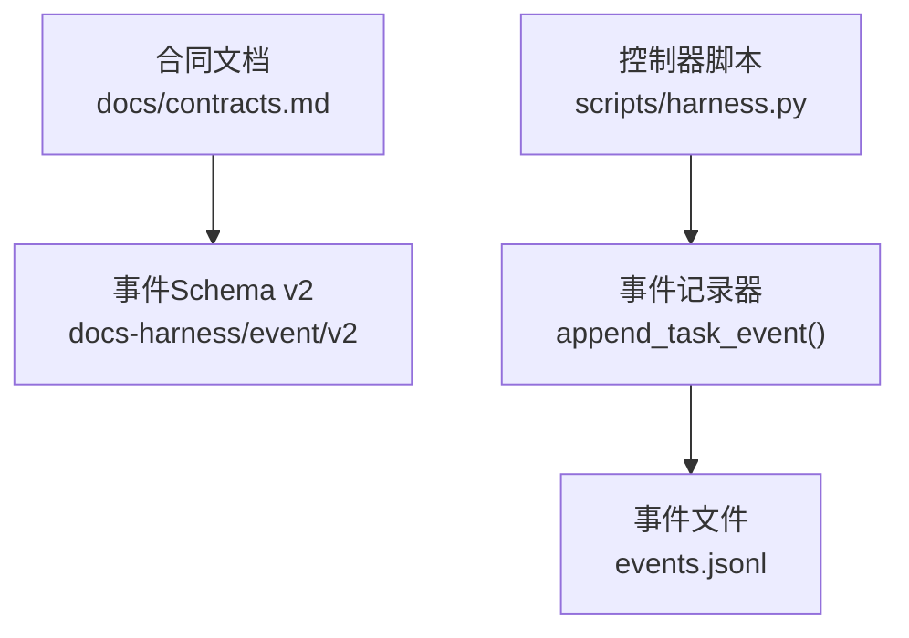
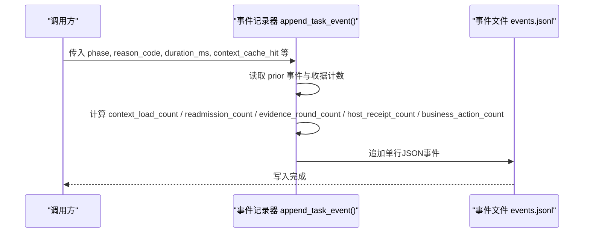
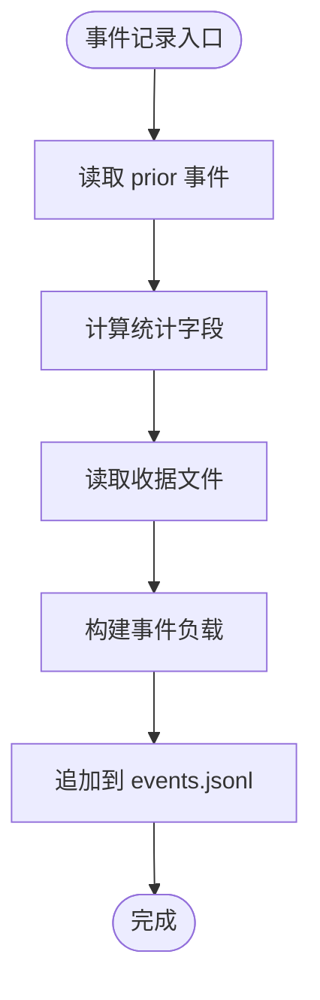

# 事件Schema定义

<cite>
**本文引用的文件**   
- [contracts.md](file://docs/contracts.md)
- [harness.py](file://scripts/harness.py)
</cite>

## 目录
1. [引言](#引言)
2. [项目结构](#项目结构)
3. [核心组件](#核心组件)
4. [架构总览](#架构总览)
5. [详细组件分析](#详细组件分析)
6. [依赖关系分析](#依赖关系分析)
7. [性能考量](#性能考量)
8. [故障排查指南](#故障排查指南)
9. [结论](#结论)
10. [附录](#附录)

## 引言
本文件为 Docs Harness 的事件系统（docs-harness/event/v2）提供详细的 JSON Schema 文档，聚焦“脱敏效率事件”的字段定义、取值范围与约束，解释事件去重机制与幂等性保证，明确隐私保护策略与禁止保存的敏感信息类型，并给出事件查询与分析的最佳实践、存储格式与性能优化建议。该文档面向开发者与运维人员，力求在保持技术严谨性的同时便于理解。

## 项目结构
- 事件 Schema 定义位于合同文档中，明确事件只保存有界字段，不包含用户任务正文、原始工具输出、环境变量、凭证或完整日志。
- 事件写入由控制器脚本实现，统一通过追加到 events.jsonl 的方式落盘，并在写入时自动计算若干统计字段。

**图表来源** 
- [contracts.md:285-301](file://docs/contracts.md#L285-L301)
- [harness.py:1034-1073](file://scripts/harness.py#L1034-L1073)

**章节来源**
- [contracts.md:285-301](file://docs/contracts.md#L285-L301)
- [harness.py:1034-1073](file://scripts/harness.py#L1034-L1073)

## 核心组件
- 事件Schema v2：限定仅保存有界字段，用于脱敏的效率度量与审计。
- 事件记录器：负责组装事件负载、计算统计字段、追加到 events.jsonl。
- 事件文件：以 JSON Lines 格式持久化事件序列，支持顺序追加与回放。

关键要点
- 事件字段严格受限，避免泄露敏感内容。
- 统计字段基于历史事件与收据文件动态计算，确保一致性。
- 所有事件包含时间戳与包修订号，便于时序分析与版本关联。

**章节来源**
- [contracts.md:285-301](file://docs/contracts.md#L285-L301)
- [harness.py:1034-1073](file://scripts/harness.py#L1034-L1073)

## 架构总览
事件系统在控制器内部被调用，将结构化事件追加到 events.jsonl。事件负载包含固定字段与可选扩展字段，统计字段由记录器自动计算。

**图表来源** 
- [harness.py:1034-1073](file://scripts/harness.py#L1034-L1073)

## 详细组件分析

### 事件Schema v2 字段定义与约束
以下字段构成脱敏效率事件的核心集合，均为受控有界字段：

- phase
  - 类型：字符串
  - 说明：事件阶段标识（如 context、verification、readmission 等），用于分类统计。
  - 取值范围：由控制器事件语义决定；常见值包括 context、verification、readmission、scope_bound_readmission、incremental_gate_readmission、begin、submit、block 等。
- started_at
  - 类型：字符串（ISO 8601 时间）
  - 说明：事件开始时间，由控制器生成。
- duration_ms
  - 类型：整数
  - 说明：耗时毫秒数，非负；记录器会进行 max(0, int(...)) 处理。
- reason_code
  - 类型：字符串
  - 说明：原因码，用于描述事件触发原因；需遵循命名规范（小写字母、数字与下划线）。
- package_revision
  - 类型：字符串
  - 说明：任务包修订号，用于关联事件与特定包版本。
- context_cache_hit
  - 类型：布尔
  - 说明：上下文缓存命中标志。
- context_load_count
  - 类型：整数
  - 说明：上下文加载次数，统计 prior 事件中 phase=context 且未命中缓存的数量。
- readmission_count
  - 类型：整数
  - 说明：重新准入次数，统计 prior 事件中 event 属于 readmission/scope_bound_readmission/incremental_gate_readmission 的数量。
- evidence_round_count
  - 类型：整数
  - 说明：证据轮次数量，统计 prior 事件中 phase=verification 的数量。
- host_receipt_count
  - 类型：整数
  - 说明：宿主收据总数，等于 context-receipts.jsonl、authorization-receipts.jsonl 与 evidence-index.json 中的证据条目之和。
- business_action_count
  - 类型：整数
  - 说明：业务动作计数，统计 prior 事件中 event 属于 begin/submit 的数量。

补充说明
- 不得保存用户任务正文、原始工具输出、环境变量、凭证或完整日志。
- 效率结论必须由这些字段和受控原因码复算。

**章节来源**
- [contracts.md:285-301](file://docs/contracts.md#L285-L301)
- [harness.py:1034-1073](file://scripts/harness.py#L1034-L1073)

### 事件去重机制与幂等性保证
- 事件文件采用追加式 JSON Lines 存储，同一事件不会重复写入相同负载；对相同输入的重放调用应返回一致结果。
- 控制器对某些操作（如任务取消）具备幂等语义：相同任务与相同原因码重复执行返回同一幂等结果，不同原因码则冲突。
- 后台事件也遵循连续相同拒绝幂等去重，终态摘要以 (job_id, attempt, status) 为键。

最佳实践
- 对外暴露的事件写入接口应具备幂等键或去重检查，避免重复追加。
- 对于重试场景，先读取 events.jsonl 判断是否已存在等价事件，再决定是否追加。

**章节来源**
- [contracts.md:259-260](file://docs/contracts.md#L259-L260)
- [contracts.md:340](file://docs/contracts.md#L340)
- [harness.py:3591-3616](file://scripts/harness.py#L3591-L3616)

### 隐私保护策略与禁止保存的敏感信息
- 明确禁止保存：用户任务正文、原始工具输出、环境变量、凭证或完整日志。
- 远端 URL 指纹计算前移除用户名、密码、token、查询参数与 fragment，Runtime 不保存原文。
- 验证命令 stdout/stderr 不进入 Runtime；临时副产物白名单仅允许已知缓存与编辑器临时文件。
- 所有文件型参数错误必须转成结构化错误，不回显敏感输入。

**章节来源**
- [contracts.md:285-301](file://docs/contracts.md#L285-L301)
- [contracts.md:123](file://docs/contracts.md#L123)
- [contracts.md:190-200](file://docs/contracts.md#L190-L200)
- [contracts.md:371](file://docs/contracts.md#L371)

### 事件查询与分析最佳实践
- 使用 phase 过滤不同阶段的统计（context、verification、readmission 等）。
- 使用 reason_code 聚合失败或阻断原因，结合 readmission_count/evidence_round_count 评估流程效率。
- 使用 package_revision 关联事件与包版本，定位变更影响。
- 使用 context_cache_hit/context_load_count 评估上下文复用效果。
- 使用 host_receipt_count 评估证据与授权收据规模。
- 使用 business_action_count 评估业务动作频率。

查询建议
- 按时间窗口（started_at/at）切片，结合 phase 与 reason_code 做多维分析。
- 对 events.jsonl 进行流式解析，避免一次性加载大文件。
- 对频繁查询建立索引（task_id、phase、reason_code、package_revision）。

**章节来源**
- [harness.py:1034-1073](file://scripts/harness.py#L1034-L1073)

### 事件存储格式与性能优化建议
- 存储格式：JSON Lines（每行一个事件对象），顺序追加，适合增量消费与回放。
- 性能优化：
  - 批量写入：合并多次追加为一次 I/O。
  - 异步写入：避免阻塞主流程。
  - 压缩归档：对历史 events.jsonl 进行压缩与分片。
  - 索引构建：对常用查询字段建立倒排索引或列存索引。
  - 回放优化：replay_progress 按需读取与状态机推进，避免全量扫描。

**章节来源**
- [harness.py:510-518](file://scripts/harness.py#L510-L518)
- [harness.py:5108-5153](file://scripts/harness.py#L5108-L5153)

## 依赖关系分析
事件记录器依赖以下数据源进行统计字段计算：
- prior 事件（events.jsonl）：用于计算 context_load_count、readmission_count、evidence_round_count、business_action_count。
- 收据文件（context-receipts.jsonl、authorization-receipts.jsonl、evidence-index.json）：用于计算 host_receipt_count。

**图表来源** 
- [harness.py:1034-1073](file://scripts/harness.py#L1034-L1073)

**章节来源**
- [harness.py:1034-1073](file://scripts/harness.py#L1034-L1073)

## 性能考量
- 统计字段计算涉及多次读取 events.jsonl 与收据文件，建议在高频写入路径引入内存缓存或增量计数器。
- 对 events.jsonl 的追加操作应尽量原子化，避免并发写入导致损坏。
- 回放与查询可通过分页与游标优化，减少全量扫描。

[本节为通用指导，无需引用具体文件]

## 故障排查指南
常见问题与排查步骤
- 事件缺失：检查 append_task_event 调用链与 events.jsonl 写入权限。
- 统计异常：核对 prior 事件与收据文件完整性，确认计算逻辑与字段含义。
- 幂等冲突：对重复操作检查幂等键与原因码一致性。
- 隐私泄露：审查日志与事件负载，确保未包含禁止字段。

**章节来源**
- [harness.py:1034-1073](file://scripts/harness.py#L1034-L1073)
- [contracts.md:285-301](file://docs/contracts.md#L285-L301)

## 结论
Docs Harness 的事件系统通过严格的 Schema 与受控字段设计，实现了高效的脱敏效率度量与审计能力。事件记录器在写入时自动计算统计字段，确保数据一致性与可追溯性。通过合理的去重与幂等机制、隐私保护策略以及查询与存储优化建议，可在大规模任务环境中稳定运行并提供可靠的分析基础。

[本节为总结，无需引用具体文件]

## 附录
- 字段类型与取值范围速查表
  - phase：字符串，受控阶段值
  - started_at：字符串，ISO 8601
  - duration_ms：整数，≥0
  - reason_code：字符串，命名规范限制
  - package_revision：字符串，包修订标识
  - context_cache_hit：布尔
  - context_load_count：整数，≥0
  - readmission_count：整数，≥0
  - evidence_round_count：整数，≥0
  - host_receipt_count：整数，≥0
  - business_action_count：整数，≥0

[本节为参考信息，无需引用具体文件]