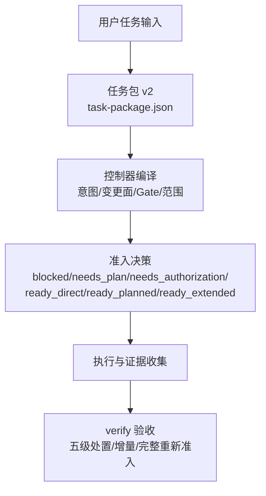
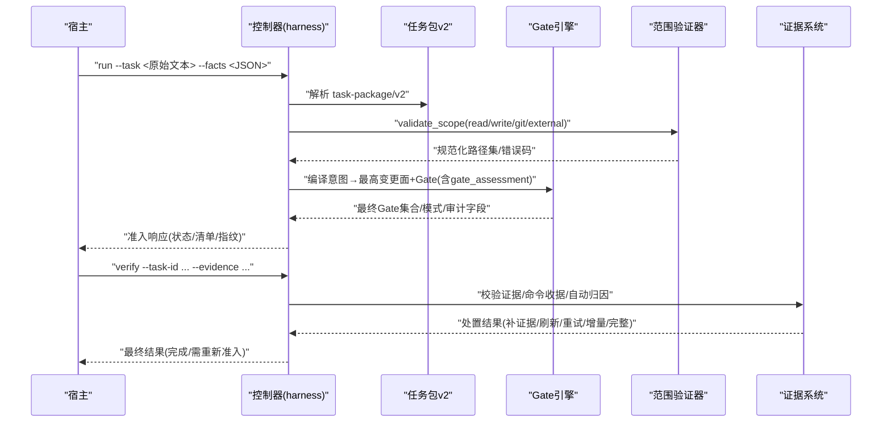
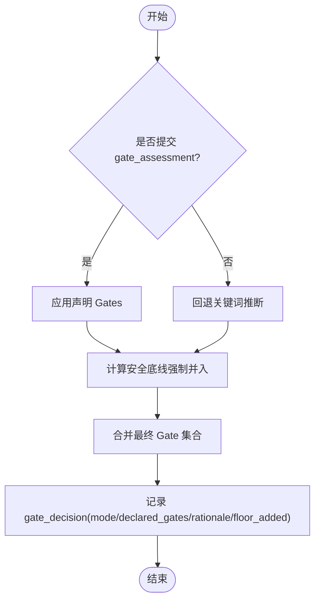
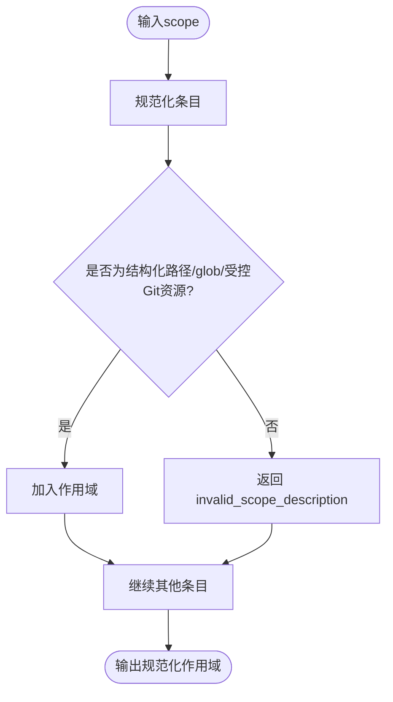
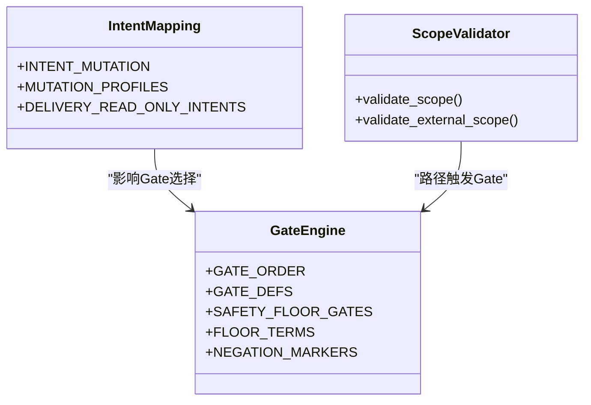

# 任务包Schema定义

<cite>
**本文引用的文件**   
- [contracts.md](file://docs/contracts.md)
- [harness.py](file://scripts/harness.py)
- [SKILL.md](file://SKILL.md)
</cite>

## 目录
1. [简介](#简介)
2. [项目结构](#项目结构)
3. [核心组件](#核心组件)
4. [架构总览](#架构总览)
5. [详细组件分析](#详细组件分析)
6. [依赖关系分析](#依赖关系分析)
7. [性能考虑](#性能考虑)
8. [故障排查指南](#故障排查指南)
9. [结论](#结论)
10. [附录](#附录)

## 简介
本文件为 Docs Harness 的任务包 v2（task-package/v2）提供完整的 JSON Schema 文档与验证规则说明。内容覆盖字段类型、约束、默认变更面与路由策略、Gate 权威语义判断机制与安全底线强制并入逻辑、路径范围验证与自然语言约束处理，以及完整示例与校验要点。读者无需深入源码即可理解并正确使用 task-package/v2。

## 项目结构
- 合同与规范：docs/contracts.md 定义了 task-package/v2 的字段、受控意图、Gate 判定、Git 状态合同、证据收据等。
- 实现与校验：scripts/harness.py 包含受控意图集合、变更面映射、Gate 定义、安全底线词表、范围验证函数等。
- 使用指引：SKILL.md 概述 run/verify 流程、幂等复用、证据与验收、后台治理等。



图表来源
- [contracts.md:1-120](file://docs/contracts.md#L1-L120)
- [harness.py:197-230](file://scripts/harness.py#L197-L230)
- [SKILL.md:25-56](file://SKILL.md#L25-L56)

章节来源
- [contracts.md:1-120](file://docs/contracts.md#L1-L120)
- [harness.py:197-230](file://scripts/harness.py#L197-L230)
- [SKILL.md:25-56](file://SKILL.md#L25-L56)

## 核心组件
- 任务包 v2 字段族：task_intent、candidate_intents、deferred_intents、intent_boundary_reason_codes、mutation_profile、read_scope、write_scope、git_scope、external_scope、allowed_actions。
- 受控意图与默认变更面/路由：query、audit、git_inspect、git_fetch、git_sync、modify、external_write。
- Gate 体系与权威评估：gate_assessment 声明、安全底线强制并入、模式与审计记录。
- 范围与路径验证：结构化路径/glob/受控 Git 资源，拒绝自然语言描述。
- 证据与验收：evidence-receipt/v2、verification-command-receipt/v1、auto-attribution、五级处置。

章节来源
- [contracts.md:9-120](file://docs/contracts.md#L9-L120)
- [harness.py:197-230](file://scripts/harness.py#L197-L230)
- [harness.py:260-342](file://scripts/harness.py#L260-L342)
- [harness.py:2334-2366](file://scripts/harness.py#L2334-L2366)
- [contracts.md:165-220](file://docs/contracts.md#L165-L220)

## 架构总览
下图展示从任务包到准入、执行、验收的关键数据流与控制点。



图表来源
- [contracts.md:9-120](file://docs/contracts.md#L9-L120)
- [contracts.md:165-220](file://docs/contracts.md#L165-L220)
- [harness.py:2334-2366](file://scripts/harness.py#L2334-L2366)
- [harness.py:260-342](file://scripts/harness.py#L260-L342)

## 详细组件分析

### 字段定义与约束（task-package/v2）
- task_intent: 字符串，枚举值来自受控意图集合。用于确定当前任务的默认变更面与路由。
- candidate_intents: 对象数组，每项包含 intent 与 mutation_profile；保留全部候选意图，供未来子句与审查上下文使用。
- deferred_intents: 对象数组，表示延后执行的意图项（未来子句）。
- intent_boundary_reason_codes: 字符串数组，边界原因码，用于解释意图边界与限制。
- mutation_profile: 字符串，枚举 read_only、git_metadata_write、workspace_write、external_write；由当前任务最高变更面决定。
- read_scope: 字符串数组，仅接受项目内相对路径、glob 或受控 Git 资源；自然语言描述返回 invalid_scope_description。
- write_scope: 字符串数组，同上；只读任务允许空数组。
- git_scope: 字符串数组，必须包含受控远端引用格式 .git:refs/remotes/<remote>/<branch>；git_sync 要求单一分支。
- external_scope: 字符串数组，外部作用域列表，经专用校验器处理。
- allowed_actions: 字符串数组，允许的 action 白名单（如 read）。

验证要点
- 路径范围：仅结构化路径/glob/受控 Git 资源；完整句子、否定说明、自然语言边界均视为无效。
- Git 作用域：git_fetch/git_sync 需要明确的远端 refs 范围；git_sync 禁止通配符分支。
- 变更面：由受控意图映射决定，显式 facts 只能升级不能降级。
- 幂等复用：同一 target、归一化任务文本、事实指纹与工作区快照命中活动任务时返回 active_task_reused。

章节来源
- [contracts.md:9-120](file://docs/contracts.md#L9-L120)
- [harness.py:197-230](file://scripts/harness.py#L197-L230)
- [harness.py:2334-2366](file://scripts/harness.py#L2334-L2366)
- [harness.py:661-675](file://scripts/harness.py#L661-L675)

### 受控意图、默认变更面与路由策略
- query → read_only → direct
- audit → read_only → direct（高风险可升级）
- git_inspect → read_only → direct
- git_fetch → git_metadata_write → direct
- git_sync → workspace_write → planned
- modify → workspace_write → 按 Gate 决定
- external_write → external_write → 至少 planned

混合意图与未来子句
- 保留全部 candidate_intents；future 子句进入 deferred_intents；完成体仅作为审查上下文。
- Gate 编译取当前任务最高变更面与风险结果。

章节来源
- [contracts.md:30-43](file://docs/contracts.md#L30-L43)
- [harness.py:213-221](file://scripts/harness.py#L213-L221)

### Gate 权威语义判断与安全底线强制并入
- gate_assessment 字段：{"gates": [...], "rationale": "<非空且≤500字符>"}
- 权威语义：声明后跳过非安全 Gate 的关键词与 scope 路径推断；最终 Gate = declared ∪ 旧 gates ∪ 安全底线兜底。
- 安全底线：security-sensitive、destructive-data、release-external 由控制器强制并入（宿主只能加不能减），使用专用精确词表与否定守卫。
- 未声明 gate_assessment：回退关键词推断（gate_decision.mode=keyword_inferred）。
- 审计字段：gate_decision.mode/declared_gates/rationale/floor_added。



图表来源
- [contracts.md:44-46](file://docs/contracts.md#L44-L46)
- [harness.py:381-389](file://scripts/harness.py#L381-L389)

章节来源
- [contracts.md:44-46](file://docs/contracts.md#L44-L46)
- [harness.py:260-342](file://scripts/harness.py#L260-L342)
- [harness.py:381-389](file://scripts/harness.py#L381-L389)

### 路径范围验证与自然语言约束处理
- 支持：项目内相对路径、glob、受控 Git 资源（.git:history 或 .git:refs/remotes/*）。
- 拒绝：完整句子、否定说明、自然语言边界描述（返回 invalid_scope_description）。
- 自然语言约束应放入任务约束字段，不得伪装成路径。
- git_sync 必须绑定单一远端分支，禁止通配符。



图表来源
- [harness.py:2334-2366](file://scripts/harness.py#L2334-L2366)
- [contracts.md:46-48](file://docs/contracts.md#L46-L48)

章节来源
- [harness.py:2334-2366](file://scripts/harness.py#L2334-L2366)
- [contracts.md:46-48](file://docs/contracts.md#L46-L48)

### 证据与验收（evidence-receipt/v2 与 verification）
- 新任务只接受 docs-harness/evidence-receipt/v2；必填绑定字段包括 task_id、target_identity、package_fingerprint、producer、command_argv_digest、cwd、时间戳、ttl、exit_code、digests、read_set、write_set。
- 验证命令使用 docs-harness/verification-command-receipt/v1 逐项收据；支持缓存命中与重跑策略。
- 控制器在 write_scope 内未归因写入时可代铸 workspace_attribution 收据自动认领（可通过配置关闭）。
- verify 五级处置：provide_evidence、refresh_evidence、retry_verification、incremental_admission、full_readmission。

章节来源
- [contracts.md:165-220](file://docs/contracts.md#L165-L220)
- [contracts.md:153-164](file://docs/contracts.md#L153-L164)
- [harness.py:240-257](file://scripts/harness.py#L240-L257)

### Git 状态合同与同步前置/后置检查
- git_state_snapshot 包含 repo_identity、remote、preflight_target_oid、head、index_tree、worktree_fingerprint、controlled_refs_namespace、lfs_available、submodule_available、git_sync_scope。
- git_preflight_contract 对 git_fetch/git_sync 进行预检：远端可达性、fast-forward、脏工作区、删除阈值、LFS/Submodule 可用性。
- git_postcheck 对已落盘文件进行归因与一致性校验。

章节来源
- [contracts.md:97-133](file://docs/contracts.md#L97-L133)
- [harness.py:677-791](file://scripts/harness.py#L677-L791)

## 依赖关系分析
- 受控意图与变更面映射：由 INTENT_MUTATION 与 MUTATION_PROFILES 维护。
- Gate 定义与顺序：GATE_ORDER 与 GATE_DEFS 控制 Gate 优先级与所需证据/计划字段。
- 安全底线：SAFETY_FLOOR_GATES 与 FLOOR_TERMS/NEGATION_MARKERS 确保强约束。
- 范围验证：validate_scope 与 validate_external_scope 统一校验路径与作用域。



图表来源
- [harness.py:197-230](file://scripts/harness.py#L197-L230)
- [harness.py:260-342](file://scripts/harness.py#L260-L342)
- [harness.py:2334-2366](file://scripts/harness.py#L2334-L2366)

章节来源
- [harness.py:197-230](file://scripts/harness.py#L197-L230)
- [harness.py:260-342](file://scripts/harness.py#L260-L342)
- [harness.py:2334-2366](file://scripts/harness.py#L2334-L2366)

## 性能考虑
- 幂等复用：基于 active task key（target、归一化任务文本、事实指纹、工作区快照）避免重复建立上下文与授权。
- 证据与命令收据缓存：输入不变则复用通过收据，减少重复执行。
- 增量准入：合同稳定且仅追加普通 Gate 时走 incremental_admission，避免完整重新准入。

章节来源
- [contracts.md:48-50](file://docs/contracts.md#L48-L50)
- [contracts.md:153-164](file://docs/contracts.md#L153-L164)
- [harness.py:240-257](file://scripts/harness.py#L240-L257)

## 故障排查指南
- invalid_scope_description：路径描述包含自然语言或完整句子；改为结构化路径/glob/受控 Git 资源。
- git_scope_required / invalid_git_scope：缺少远端 refs 范围或格式错误；补充 .git:refs/remotes/<remote>/<branch>。
- git_sync_scope_ambiguous：git_sync 使用了通配符分支；改为单一分支。
- 安全底线误判：检查否定守卫与专用词表；避免“不要部署”等被忽略的表述。
- verify 五级处置：根据返回码与处置类型采取对应动作（补证据、刷新、重试、增量/完整重新准入）。

章节来源
- [harness.py:2334-2366](file://scripts/harness.py#L2334-L2366)
- [harness.py:661-675](file://scripts/harness.py#L661-L675)
- [contracts.md:153-164](file://docs/contracts.md#L153-L164)

## 结论
task-package/v2 以受控意图为核心，结合严格的范围验证与 Gate 权威语义判断，确保任务在执行前具备明确变更面、路由与风险控制。通过证据收据与五级验收机制，系统在保持灵活性的同时守住安全底线，并提供幂等与增量优化以提升效率。

## 附录

### 完整 JSON 示例（task-package/v2）
以下为最小可用示例，字段含义与约束见上文各节。

```json
{
  "task_intent": "query",
  "candidate_intents": [
    {"intent": "query", "mutation_profile": "read_only"}
  ],
  "deferred_intents": [],
  "intent_boundary_reason_codes": [],
  "mutation_profile": "read_only",
  "read_scope": ["docs/**", ".git:history"],
  "write_scope": [],
  "git_scope": [],
  "external_scope": [],
  "allowed_actions": ["read"]
}
```

章节来源
- [contracts.md:11-28](file://docs/contracts.md#L11-L28)

### 字段验证规则速查
- task_intent：受控意图枚举；决定默认 mutation_profile 与 execution_route。
- mutation_profile：read_only | git_metadata_write | workspace_write | external_write。
- read_scope/write_scope：仅结构化路径/glob/受控 Git 资源；自然语言描述无效。
- git_scope：必须包含 .git:refs/remotes/<remote>/<branch>；git_sync 禁止通配符。
- external_scope：经专用校验器处理。
- allowed_actions：白名单动作集合（如 read）。
- gate_assessment：{"gates":[...], "rationale":"<非空≤500字符>"}；安全底线强制并入。

章节来源
- [contracts.md:30-46](file://docs/contracts.md#L30-L46)
- [harness.py:206-221](file://scripts/harness.py#L206-L221)
- [harness.py:2334-2366](file://scripts/harness.py#L2334-L2366)