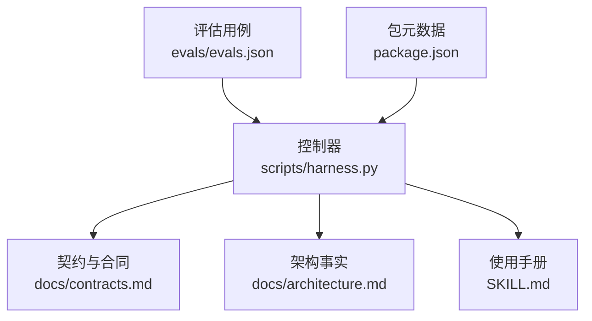
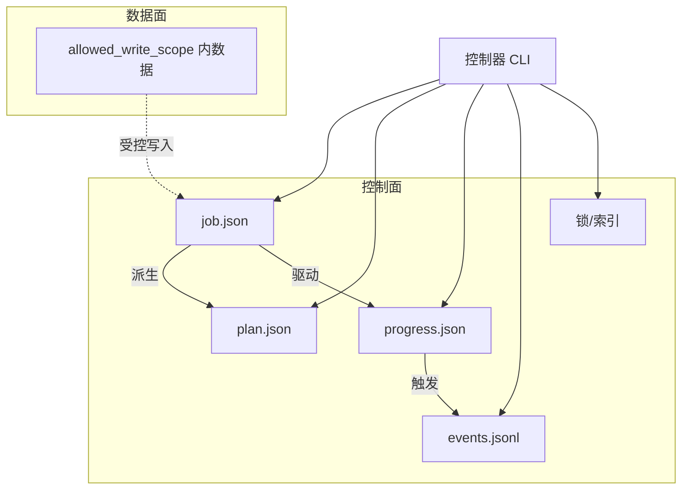
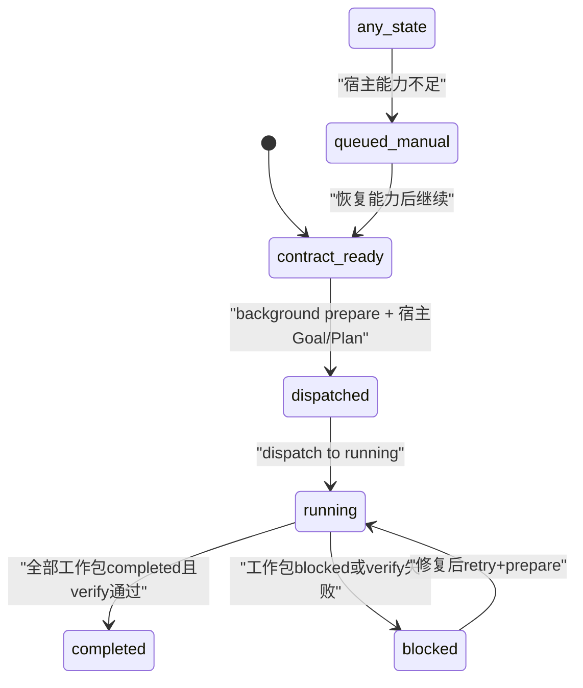
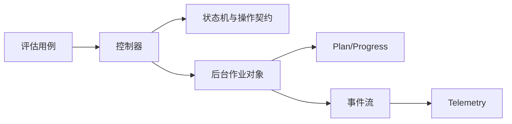

# 后台作业Schema定义

<cite>
**本文档引用的文件**
- [contracts.md](file://docs/contracts.md)
- [architecture.md](file://docs/architecture.md)
- [SKILL.md](file://SKILL.md)
- [evals.json](file://evals/evals.json)
- [package.json](file://package.json)
</cite>

## 目录
1. [简介](#简介)
2. [项目结构](#项目结构)
3. [核心组件](#核心组件)
4. [架构总览](#架构总览)
5. [详细组件分析](#详细组件分析)
6. [依赖关系分析](#依赖关系分析)
7. [性能考量](#性能考量)
8. [故障排查指南](#故障排查指南)
9. [结论](#结论)
10. [附录](#附录)

## 简介
本文件为 Docs Harness v2 后台作业（background-job/v2）的完整 JSON Schema 与状态机说明，覆盖以下要点：
- 作业状态机、工作包管理、进度跟踪与事件记录
- 三种后台路线（background_direct、background_goal、background_goal_phased）的适用场景与数据结构差异
- 关键生命周期状态转换：contract_ready、dispatched、running、completed、blocked 等
- prepare、progress、verify 等操作的输入输出契约
- 工作包的幂等性保证、attempt 管理与重试机制
- 业务数据面与控制面的写入权限分离

## 项目结构
- 控制器源码真源位于 scripts/harness.py，负责任务准入、上下文、验收、知识生命周期与后台 Job 状态机。
- 对外行为与契约以 docs/contracts.md 为准；架构事实见 docs/architecture.md；使用示例与命令参考见 SKILL.md。
- 版本信息在 package.json 中声明。

图表来源
- [architecture.md:1-26](file://docs/architecture.md#L1-L26)
- [contracts.md:1-372](file://docs/contracts.md#L1-L372)
- [SKILL.md:1-106](file://SKILL.md#L1-L106)
- [evals.json:1-175](file://evals/evals.json#L1-L175)
- [package.json:1-23](file://package.json#L1-L23)

章节来源
- [architecture.md:1-26](file://docs/architecture.md#L1-L26)
- [package.json:1-23](file://package.json#L1-L23)

## 核心组件
- 后台作业对象：docs-harness/background-job/v2
- 控制面工件：job.json、plan.json、progress.json、events.jsonl、锁与索引（仅 CLI 可写）
- 业务数据面：allowed_write_scope 内的数据写入（由后台 Job 写入）
- 工作包：work_packages，用于拆分复杂目标的可追踪单元
- 事件：docs-harness/event/v2，只保存有界字段

章节来源
- [contracts.md:305-341](file://docs/contracts.md#L305-L341)
- [architecture.md:8-16](file://docs/architecture.md#L8-L16)
- [SKILL.md:60-91](file://SKILL.md#L60-L91)

## 架构总览
后台作业采用“控制面/数据面”双平面设计：
- 控制面：由控制器维护，包含作业元数据、计划、进度、事件与锁
- 数据面：由业务 Job 写入，受 allowed_write_scope 约束，禁止触碰 .git/**、.docs-harness/** 或 Runtime

图表来源
- [architecture.md:8-16](file://docs/architecture.md#L8-L16)
- [contracts.md:323-341](file://docs/contracts.md#L323-L341)

## 详细组件分析

### 后台作业对象（docs-harness/background-job/v2）
- 标识与绑定
  - job_id：作业唯一标识
  - idempotency_key：幂等键，确保重复 prepare 返回相同结果
  - execution_route：执行路线（background_direct、background_goal、background_goal_phased）
  - attempt：当前尝试次数，retry 递增
  - state：作业状态（见状态机）
  - goal_contract：冻结的目标契约（用于 prepare 生成 plan/progress）
  - work_packages：工作包集合（ID、类型、依赖、范围、验收要求）
  - allowed_write_scope：业务数据面允许写入的路径集合
  - may_mutate_parent：固定 false
  - may_spawn_child_jobs：固定 false
  - suppress_post_completion_dispatch：固定 true
- 控制面工件
  - plan.json：revision 2 的计划，含工作包全集与顺序
  - progress.json：revision 2 的进度，含每个工作包的状态与完成时间
  - events.jsonl：不可变事件流，记录状态变更、attempt、原因码与指纹
- 校验与不变量
  - 进入 dispatched 与 running 前校验 Schema、revision、Job 绑定、attempt、工作包全集、进度全集与已记录指纹
  - 不允许直接修改控制面工件，必须由 CLI 在受管 Runtime 内更新

章节来源
- [contracts.md:323-341](file://docs/contracts.md#L323-L341)
- [SKILL.md:68-86](file://SKILL.md#L68-L86)

### 作业状态机与关键转换
- 状态集合
  - contract_ready：准备阶段，等待 background prepare
  - dispatched：计划已就绪，等待宿主建立 Goal/Plan
  - running：开始执行工作包
  - completed：全部工作包完成并通过 verify
  - blocked：被阻断（如验证失败、依赖未满足）
  - queued_manual：能力不足时排队等待人工介入
- 关键转换
  - contract_ready → dispatched：调用 background prepare 后，宿主建立 Goal/Plan，再调用 dispatch 到 dispatched
  - dispatched → running：调用 dispatch 到 running，校验 Plan/Progress 与工作包一致性
  - running → completed：所有工作包 completed 且 verify 通过
  - running → blocked：任一工作包 blocked 或 verify 失败
  - 任意非终态 → queued_manual：宿主能力不足时显式置入

图表来源
- [contracts.md:328-338](file://docs/contracts.md#L328-L338)
- [SKILL.md:74-86](file://SKILL.md#L74-L86)

### 工作包管理（work_packages）
- 字段
  - id：工作包唯一标识（来自冻结 Plan）
  - type：工作包类型（如代码生成、文档同步、测试执行等）
  - dependencies：前置工作包 ID 列表
  - scope：允许写入的路径范围（子集于 allowed_write_scope）
  - verification：验收要求（证据类型、命令、白名单）
  - status：状态（pending、in_progress、completed、blocked）
- 状态转换规则
  - pending → in_progress | blocked
  - in_progress → completed | blocked
  - 相同状态幂等，倒退、跳过执行、未知 ID 或自由文本原因失败关闭
- 完成判定
  - 控制器根据 Progress 派生完成与剩余列表
  - updated|no_change 验收要求全部工作包 completed
  - completed_with_finding 只允许 completed 或 blocked，并返回 blocked ID

章节来源
- [contracts.md:336-338](file://docs/contracts.md#L336-L338)
- [SKILL.md:78-86](file://SKILL.md#L78-L86)

### 进度跟踪与事件记录
- 进度（progress.json）
  - revision 2，包含每个工作包的当前状态、开始/结束时间戳、原因码
  - 只允许 running 的复杂 Job 更新
- 事件（events.jsonl）
  - 不可变追加，记录 phase、started_at、duration_ms、reason_code、package_revision、attempt、工作包 ID、指纹
  - 不保存敏感信息（任务正文、环境变量、会话、临时路径）
  - 连续相同拒绝幂等去重，终态摘要以 (job_id, attempt, status) 为键

章节来源
- [contracts.md:285-301](file://docs/contracts.md#L285-L301)
- [contracts.md:340-341](file://docs/contracts.md#L340-L341)

### 三种后台路线的差异
- background_direct
  - 适用场景：简单、有界的后台执行，无需持久目标
  - 特点：保留旧别名兼容，contract_ready 可直接到 running
  - 数据结构：最小化，无 goal_contract 或复杂工作包
- background_goal
  - 适用场景：需要持久目标与正式方案的复杂任务
  - 特点：必须先 prepare 生成 plan/progress，宿主建立 Goal/Plan 后再 dispatched
  - 数据结构：包含 goal_contract、work_packages、verification 等
- background_goal_phased
  - 适用场景：单一目标 Owner 分阶段推进，公共层和知识地图串行合并
  - 特点：支持 phased 执行，确保顺序与依赖
  - 数据结构：同 background_goal，但增加阶段划分与合并策略

章节来源
- [contracts.md:315-321](file://docs/contracts.md#L315-L321)
- [SKILL.md:62-70](file://SKILL.md#L62-L70)

### 操作契约：prepare、progress、verify
- prepare
  - 输入：job_id、idempotency_key、goal_contract、work_packages、attempt
  - 输出：plan.json、progress.json（revision 2），或 already_prepared
  - 幂等：内容、绑定与指纹完全一致时返回 already_prepared
  - 修复：部分、无效、冲突或篡改工件需 --repair 先归档再生成
- progress
  - 输入：job_id、work_package_id、work_package_status（in_progress|completed|blocked）
  - 校验：工作包 ID 必须来自冻结 Plan，状态转换合法
  - 幂等：相同状态幂等，倒退或未知 ID 失败关闭
- verify
  - 输入：job_id、assessment（评估结果文件）
  - 输出：updated|no_change|completed_with_finding
  - 要求：updated|no_change 要求全部工作包 completed；completed_with_finding 只允许 completed 或 blocked
  - 漂移：revision 2 工件漂移失败关闭

章节来源
- [contracts.md:332-338](file://docs/contracts.md#L332-L338)
- [SKILL.md:75-86](file://SKILL.md#L75-L86)

### 幂等性与重试机制
- 幂等性保证
  - prepare：重复调用仅在内容、绑定与指纹完全一致时返回 already_prepared
  - progress：相同状态幂等，避免重复更新
  - verify：连续相同拒绝幂等去重
- Attempt 管理
  - retry：归档当前 attempt 工件、推进 attempt、清空准备引用并刷新基线
  - 不生成新工件，不继承完成进度
  - 损坏或被篡改工件需显式 --repair 修复

章节来源
- [contracts.md:332-341](file://docs/contracts.md#L332-L341)
- [SKILL.md:86](file://SKILL.md#L86)

### 业务数据面与控制面写入权限分离
- 控制面
  - job.json、plan.json、progress.json、events.jsonl、锁与索引
  - 仅 CLI 在受管 Runtime 内可写
- 业务数据面
  - allowed_write_scope 内数据
  - 禁止写入 .git/**、.docs-harness/** 或实际 Runtime
  - 越界写入返回 invalid_background_scope

章节来源
- [contracts.md:323-324](file://docs/contracts.md#L323-L324)
- [architecture.md:8](file://docs/architecture.md#L8)

## 依赖关系分析
- 控制器依赖契约文档定义状态机与操作语义
- 后台作业依赖冻结的 goal_contract 与 work_packages 生成 plan/progress
- 事件系统依赖 bounded telemetry 字段，不记录敏感信息
- 评估用例覆盖背景路由、宿主能力、bootstrap 合并等场景

图表来源
- [contracts.md:305-341](file://docs/contracts.md#L305-L341)
- [evals.json:122-140](file://evals/evals.json#L122-L140)

章节来源
- [evals.json:122-140](file://evals/evals.json#L122-L140)

## 性能考量
- 幂等调用减少重复计算与 I/O
- 事件只记录有界字段，降低存储与传输开销
- 工作包并行执行（依赖允许时）提升吞吐
- 验证命令收据缓存避免重复执行

[本节为通用指导，不直接分析具体文件]

## 故障排查指南
- 常见错误
  - invalid_background_scope：业务数据面越界写入
  - prepare_background_goal：缺失工件，需先 prepare
  - task_cancel_conflict：取消冲突，不同原因导致
  - archive_source_drift：归档源漂移，失效关闭
- 诊断步骤
  - 检查作业状态与 attempt 计数
  - 验证 Plan/Progress 与工作包一致性
  - 查看 events.jsonl 中的最近事件
  - 确认 allowed_write_scope 配置

章节来源
- [contracts.md:251-282](file://docs/contracts.md#L251-L282)
- [contracts.md:323-341](file://docs/contracts.md#L323-L341)

## 结论
Docs Harness v2 后台作业提供了强大的状态机、工作包管理与幂等控制，支持三种执行路线以满足不同复杂度需求。通过严格的控制面/数据面分离与有界事件记录，确保了安全性与可审计性。建议遵循契约定义进行实现，充分利用幂等性与重试机制提高鲁棒性。

[本节为总结，不直接分析具体文件]

## 附录
- 退出码含义
  - 0：成功
  - 1：项目检查失败
  - 2：输入或状态无效
  - 3：需要方案、授权、证据或用户输入
  - 4：范围或合同变化，需重新准入

章节来源
- [contracts.md:361-372](file://docs/contracts.md#L361-L372)