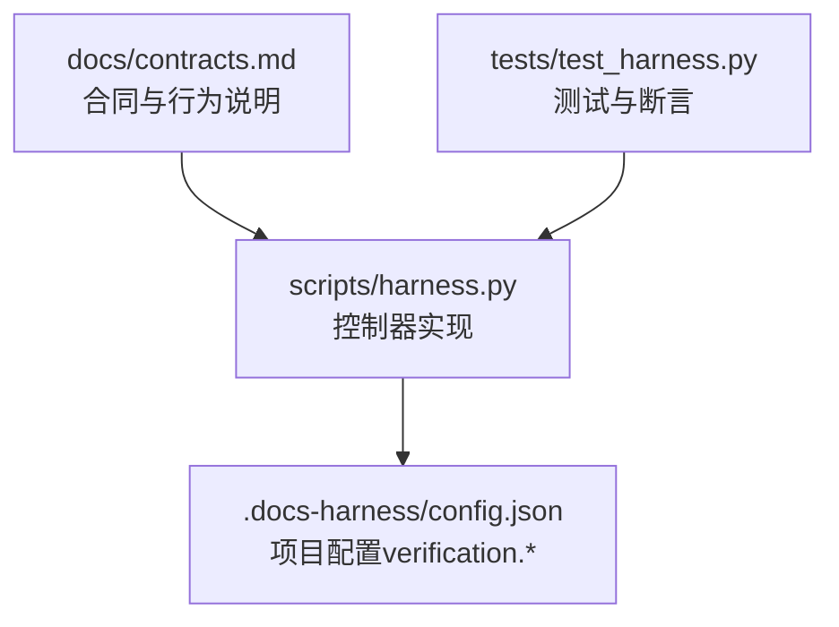
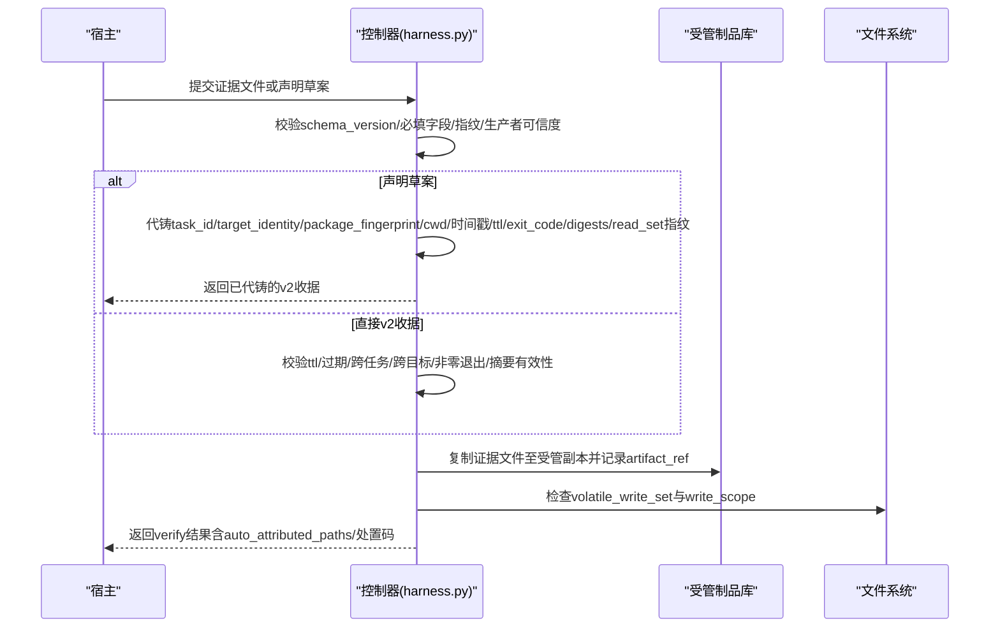
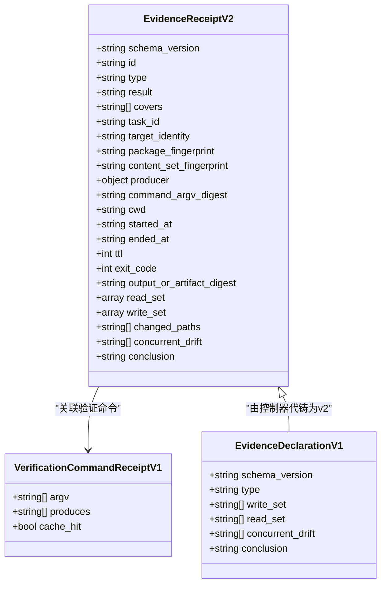
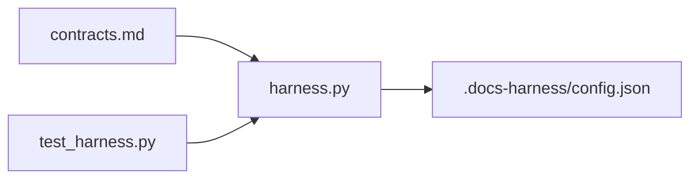

# 证据收据Schema定义

<cite>
**本文引用的文件**
- [contracts.md](file://docs/contracts.md)
- [harness.py](file://scripts/harness.py)
- [test_harness.py](file://tests/test_harness.py)
</cite>

## 目录
1. [简介](#简介)
2. [项目结构](#项目结构)
3. [核心组件](#核心组件)
4. [架构总览](#架构总览)
5. [详细组件分析](#详细组件分析)
6. [依赖关系分析](#依赖关系分析)
7. [性能考虑](#性能考虑)
8. [故障排查指南](#故障排查指南)
9. [结论](#结论)
10. [附录](#附录)

## 简介
本文件为 Docs Harness v1.6.5 的“证据收据（v2）”提供完整的 JSON Schema 文档与使用说明，覆盖以下要点：
- evidence-receipt/v2 的所有必填字段、类型、格式与校验规则
- 证据生产者的可信度要求与能力声明
- 验证命令收据 docs-harness/verification-command-receipt/v1 的格式与使用方式
- 证据声明草案 docs-harness/evidence-declaration/v1 的简化格式与控制器代铸机制
- 工作区自动归因功能与 volatile_paths 白名单配置

## 项目结构
本项目以合同与实现分离的方式组织：
- 合同与行为说明位于 docs/contracts.md
- 控制器实现位于 scripts/harness.py
- 行为与边界用例由 tests/test_harness.py 覆盖

图表来源
- [contracts.md:165-221](file://docs/contracts.md#L165-L221)
- [harness.py:1157-1215](file://scripts/harness.py#L1157-L1215)

章节来源
- [contracts.md:1-120](file://docs/contracts.md#L1-L120)
- [harness.py:1-120](file://scripts/harness.py#L1-L120)

## 核心组件
- 证据收据 v2（evidence-receipt/v2）：任务级证据的受管载体，包含绑定指纹、生产者、命令摘要、工作目录、时间戳、TTL、退出码、输出或工件摘要、读写集合等。
- 验证命令收据 v1（verification-command-receipt/v1）：对验证命令执行结果的逐项收据，支持缓存复用。
- 证据声明草案 v1（evidence-declaration/v1）：宿主提交的简化声明，由控制器代铸完整 v2 收据。
- 工作区自动归因：在 write_scope 内未归因写入时，控制器可自动生成 workspace_attribution 收据并继续验收。
- volatile_paths 白名单：允许验证期间新建的已知临时副产物不阻断，但同名已有文件的修改或删除仍失败关闭。

章节来源
- [contracts.md:165-221](file://docs/contracts.md#L165-L221)
- [harness.py:1157-1215](file://scripts/harness.py#L1157-L1215)

## 架构总览
证据收据从宿主提交到控制器校验、索引、保存受管副本，再到最终验收的端到端流程如下：

图表来源
- [contracts.md:165-221](file://docs/contracts.md#L165-L221)
- [harness.py:1157-1215](file://scripts/harness.py#L1157-L1215)

## 详细组件分析

### evidence-receipt/v2 字段与校验规则
- schema_version: 固定值 "docs-harness/evidence-receipt/v2"
- id: 字符串，证据标识
- type: 字符串，证据类型（如 test_result、source_trace 等），高风险类型需可信生产者
- result: 字符串，通常为 passed
- covers: 字符串数组，覆盖的工作包ID
- task_id: 字符串，任务ID（dh-... 格式）
- target_identity: 字符串，sha256 指纹，绑定目标仓库/本地路径
- package_fingerprint: 字符串，sha256 指纹，绑定当前任务包
- content_set_fingerprint: 字符串或 null，内容集合指纹（可选）
- producer: 对象 {adapter, capability}，必须来自可信生产者集合
- command_argv_digest: 字符串，sha256 摘要，绑定验证命令参数
- cwd: 字符串，有界的项目绝对路径
- started_at: ISO 8601 UTC 时间戳
- ended_at: ISO 8601 UTC 时间戳
- ttl: 整数，秒数（默认 3600）
- exit_code: 整数，命令退出码（0 表示成功）
- output_or_artifact_digest: 字符串，sha256 摘要，指向输出或工件
- read_set: 数组，读取集，每项包含路径与指纹
- write_set: 数组，写入集，包含变更路径
- changed_paths: 数组，变更路径（兼容字段）
- concurrent_drift: 数组，并发进程产生的漂移路径
- conclusion: 字符串，结论文本

校验规则要点
- 过期、跨任务、跨目标、跨 package fingerprint、不可信生产者、非零退出码或摘要无效均拒绝
- 安全、发布、恢复等高风险证据必须来自可信 v2 生产者；报告型旧证据不能满足
- 原始 stdout/stderr 不进入 Runtime，仅保留摘要；证据文件复制到受管副本后删除不影响已采纳证据

章节来源
- [contracts.md:165-221](file://docs/contracts.md#L165-L221)
- [harness.py:243-260](file://scripts/harness.py#L243-L260)

### 验证命令收据 verification-command-receipt/v1
- argv: 字符串数组，验证命令及其参数
- produces: 字符串数组，声明该命令产生的证据类型（必须在白名单内）
- 输入指纹：基于读取集与工作区相关写入计算
- 缓存策略：输入不变且上次通过则复用（cache_hit=true），否则重跑
- 整体开关：可通过 verification.command_cache_enabled=false 关闭缓存

使用方式
- 控制器按 argv、produces 与输入指纹生成逐项收据
- 只容忍验证期间新建的已知临时副产物（__pycache__、*.tmp、*.log 等），同名已有文件被修改或删除仍阻断
- 新增的临时写入进入 volatile_write_set 保持可见

章节来源
- [contracts.md:190-221](file://docs/contracts.md#L190-L221)
- [harness.py:1191-1205](file://scripts/harness.py#L1191-L1205)

### 证据声明草案 evidence-declaration/v1 与控制器代铸
- schema_version: "docs-harness/evidence-declaration/v1"
- type: 证据类型（宿主声明）
- write_set: 写入路径（宿主声明）
- read_set: 读取路径（宿主声明）
- concurrent_drift: 并发漂移路径（宿主声明）
- conclusion: 结论文本（宿主声明）

控制器代铸字段
- task_id、target_identity、package_fingerprint、cwd、started_at、ended_at、ttl=3600、exit_code=0
- command_argv_digest、output_or_artifact_digest（对声明正文计算）
- read_set 各路径的当前指纹
- producer 记为 ("docs-harness", "host_declaration")

信任等级
- 代铸后的 v2 收据与宿主自铸收据同等信任等级
- 缺 type、type 不在白名单、路径越界等按现有校验失败关闭

章节来源
- [contracts.md:203-217](file://docs/contracts.md#L203-L217)

### 工作区自动归因与 volatile_paths 白名单
- 自动归因：当唯一阻断是 write_scope 内未归因写入时，控制器默认代铸 workspace_attribution 收据，producer 为 ("docs-harness", "auto_attribution")，write_set 为这批路径，并记录 auto_attributed_paths
- 开关：verification.auto_attribute_in_scope=false 可恢复 provide_evidence 补证据流程
- volatile_paths：项目可在 .docs-harness/config.json 的 verification.volatile_paths 追加带固定根目录的 glob 白名单，*|**、越界、绝对路径和控制面路径失败关闭
- 被容忍的新建写入进入 volatile_write_set 保持可见，其余写入仍使命令失败并列出阻断路径

章节来源
- [contracts.md:217-221](file://docs/contracts.md#L217-L221)
- [harness.py:1157-1215](file://scripts/harness.py#L1157-L1215)

### 可信生产者与能力声明
- 可信生产者集合包括：
  - ("docs-harness", "git_postcheck")
  - ("docs-harness", "verification_command")
  - ("docs-harness", "auto_attribution")
  - ("docs-harness", "host_declaration")
  - ("codex-host", "file_receipt")
  - ("codex-host", "command_receipt")
  - ("codex-host", "review_receipt")
  - ("independent-reviewer", "review_receipt")
- 高风险证据类型（security_acceptance、external_state、recovery_acceptance、remote_delivery、fresh_clone_verification、release_acceptance）必须由可信 v2 生产者产生

章节来源
- [harness.py:243-260](file://scripts/harness.py#L243-L260)

### 数据模型图

图表来源
- [contracts.md:165-221](file://docs/contracts.md#L165-L221)

## 依赖关系分析
- contracts.md 定义了证据收据的行为与约束
- harness.py 实现了校验、代铸、缓存、自动归因与 volatile_paths 白名单逻辑
- test_harness.py 覆盖了关键场景（如 volatile_paths 扩展、自动归因开关、Git 同步漂移等）

图表来源
- [contracts.md:165-221](file://docs/contracts.md#L165-L221)
- [harness.py:1157-1215](file://scripts/harness.py#L1157-L1215)
- [test_harness.py:2662-2731](file://tests/test_harness.py#L2662-L2731)

章节来源
- [contracts.md:165-221](file://docs/contracts.md#L165-L221)
- [harness.py:1157-1215](file://scripts/harness.py#L1157-L1215)
- [test_harness.py:2662-2731](file://tests/test_harness.py#L2662-L2731)

## 性能考虑
- 验证命令收据缓存可减少重复执行，提升验收效率
- 自动归因避免不必要的补证据轮次，缩短闭环时间
- 受管副本机制减少 I/O 风险，提高幂等性与可审计性

## 故障排查指南
常见错误与处理
- 非法 volatile_paths：必须是工作区内带固定根目录的 glob，禁止 *|**、越界、绝对路径与控制面路径
- 自动归因被关闭：verification.auto_attribute_in_scope=false 将返回 provide_evidence，需要宿主补充证据
- 验证命令失败：根据 retry_verification 提示重新执行，必要时调整 produces 或输入指纹
- 高风险证据生产者不可信：确保 producer 来自可信集合

章节来源
- [harness.py:1157-1215](file://scripts/harness.py#L1157-L1215)
- [contracts.md:190-221](file://docs/contracts.md#L190-L221)

## 结论
evidence-receipt/v2 提供了严格的证据绑定与校验机制，结合 verification-command-receipt/v1 与 evidence-declaration/v1 的简化与代铸能力，显著提升了证据的可追溯性与验收效率。配合工作区自动归因与 volatile_paths 白名单，系统在安全性与可用性之间取得平衡。

## 附录
- 退出码参考：0 成功，1 项目检查失败，2 输入/合同无效，3 需要方案/授权/证据/迁移/用户输入/Git 交付，4 范围/漂移/Gate/远端/授权/规则变化需重新准入
- 建议实践：优先使用声明草案，让控制器代铸完整 v2 收据；合理配置 volatile_paths 以减少误报；谨慎设置高风险 Gate 与安全底线