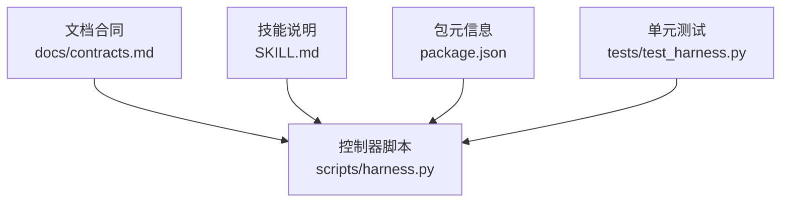
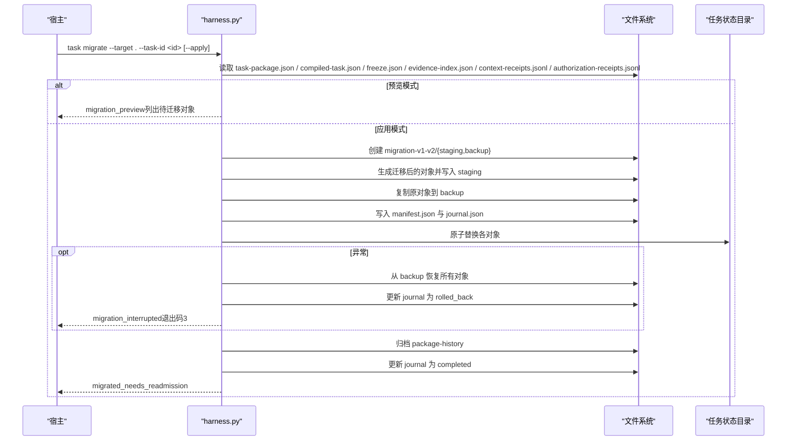
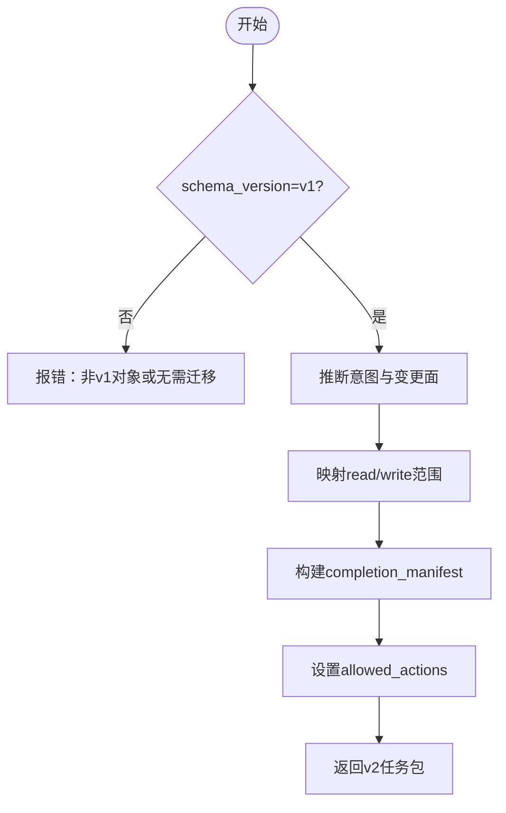
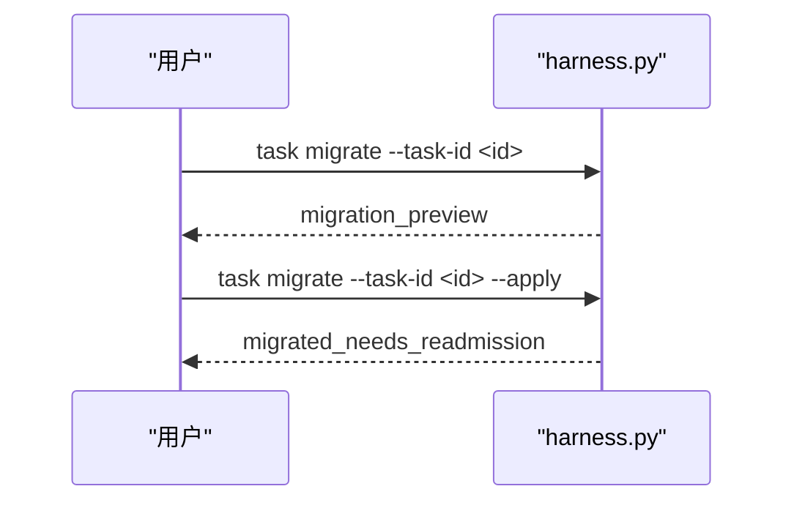
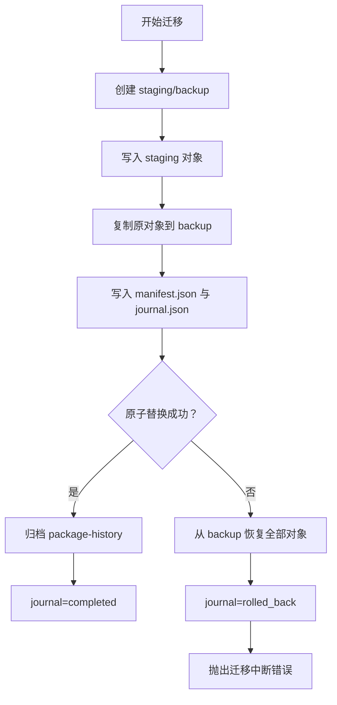
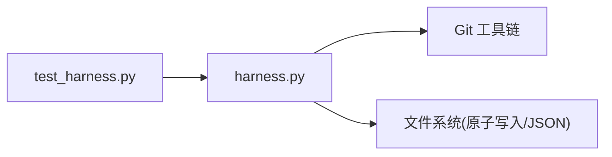

# 迁移Schema定义

<cite>
**本文引用的文件**   
- [SKILL.md](file://SKILL.md)
- [package.json](file://package.json)
- [contracts.md](file://docs/contracts.md)
- [harness.py](file://scripts/harness.py)
- [test_harness.py](file://tests/test_harness.py)
</cite>

## 目录
1. [简介](#简介)
2. [项目结构](#项目结构)
3. [核心组件](#核心组件)
4. [架构总览](#架构总览)
5. [详细组件分析](#详细组件分析)
6. [依赖关系分析](#依赖关系分析)
7. [性能考虑](#性能考虑)
8. [故障排查指南](#故障排查指南)
9. [结论](#结论)
10. [附录](#附录)

## 简介
本文件面向 Docs Harness v1→v2 的版本迁移，系统化说明任务包、编译态、冻结快照、证据索引、上下文收据与授权收据的迁移策略；解释 task migrate 命令的预览与应用模式；给出回滚机制与备份恢复流程；覆盖错误处理与故障恢复；明确向后兼容性与废弃字段处理方式；并说明 legacy_evidence 的只读访问模式与 v2 任务的兼容性要求。

## 项目结构
- 合同与行为约定：docs/contracts.md
- 控制器实现：scripts/harness.py（含迁移逻辑、校验、原子写入、回滚）
- 测试用例：tests/test_harness.py（验证迁移、回滚、只读限制等）
- 技能元数据与版本：SKILL.md、package.json

图表来源 
- [contracts.md:1-372](file://docs/contracts.md#L1-L372)
- [harness.py:1-120](file://scripts/harness.py#L1-L120)
- [SKILL.md:1-106](file://SKILL.md#L1-L106)
- [package.json:1-23](file://package.json#L1-L23)

章节来源
- [contracts.md:1-372](file://docs/contracts.md#L1-L372)
- [harness.py:1-120](file://scripts/harness.py#L1-L120)
- [SKILL.md:1-106](file://SKILL.md#L1-L106)
- [package.json:1-23](file://package.json#L1-L23)

## 核心组件
- 任务包 schema：task-package/v2（新任务）、task-package/v1（旧任务，仅允许读取与显式迁移）
- 编译态 schema：compiled-task/v2
- 冻结快照 schema：freeze/v2
- 证据索引 schema：evidence-index/v2（新增 legacy_evidence 只读字段）
- 上下文收据 schema：context-receipt/v2
- 授权收据 schema：authorization-receipt/v2
- 迁移清单与日志：migration-manifest/v1、journal.json
- 处置索引：task-disposition-index/v1（归档 v1 对象）

章节来源
- [contracts.md:9-249](file://docs/contracts.md#L9-L249)
- [harness.py:26-56](file://scripts/harness.py#L26-L56)

## 架构总览
v1→v2 迁移由控制器在任务状态目录下执行，采用“先 staging + 全量备份 → 原子替换 → 记录 manifest/journal”的流程，任何中断均按备份回滚。迁移后任务进入 needs_readmission，必须按 v2 合同重新准入。

图表来源 
- [harness.py:3361-3494](file://scripts/harness.py#L3361-L3494)

章节来源
- [contracts.md:236-249](file://docs/contracts.md#L236-L249)
- [harness.py:3361-3494](file://scripts/harness.py#L3361-L3494)

## 详细组件分析

### 任务包迁移（task-package/v1 → v2）
- 意图与变更面推断：基于原始任务文本与 allowed_scope 推断 task_intent、candidate_intents、mutation_profile，并映射 allowed_actions。
- 范围字段转换：legacy read/write 语义映射为 v2 的 read_scope/write_scope/git_scope/external_scope，并设置 post_completion_dispatch_policy。
- 完成清单：根据意图、Gate、证据类型与验证命令构建 completion_manifest。
- 幂等性：已迁移对象直接返回 already_migrated。

图表来源 
- [harness.py:3283-3339](file://scripts/harness.py#L3283-L3339)

章节来源
- [contracts.md:9-48](file://docs/contracts.md#L9-L48)
- [harness.py:3283-3339](file://scripts/harness.py#L3283-L3339)

### 编译态迁移（compiled-task/v1 → v2）
- 升级 schema_version 与 package_revision/package_fingerprint。
- 控制状态置为 blocked，验证状态置为 needs_readmission，next_action 指向重新准入。
- blockers 明确提示需按 v2 合同重新准入。

章节来源
- [harness.py:3396-3409](file://scripts/harness.py#L3396-L3409)
- [contracts.md:236-249](file://docs/contracts.md#L236-L249)

### 冻结快照迁移（freeze/v1 → v2）
- 升级 schema_version 与 package_revision/package_fingerprint。
- 清空 git_state_snapshot（首次 workspace 基线保持不变）。
- 记录 migrated_at 时间戳。

章节来源
- [harness.py:3410-3420](file://scripts/harness.py#L3410-L3420)
- [contracts.md:236-249](file://docs/contracts.md#L236-L249)

### 证据索引迁移（evidence-index/v1 → v2）
- 新建 v2 证据索引，保留旧证据于 legacy_evidence 数组。
- 标记 legacy_evidence_read_only=true，禁止对旧证据进行写入。
- v2 任务仅接受 v2 证据收据；旧证据仅用于只读审计。

章节来源
- [harness.py:3421-3427](file://scripts/harness.py#L3421-L3427)
- [contracts.md:165-218](file://docs/contracts.md#L165-L218)

### 上下文收据与授权收据迁移
- context-receipts.jsonl 与 authorization-receipts.jsonl 在迁移时初始化为空数组（字符串），后续按 v2 合同追加。
- 上下文收据复用需满足 task_id、target_identity、stage、compiler_contract、content_set_fingerprint 一致。
- 授权收据始终绑定当前 package fingerprint，不跨修订复用。

章节来源
- [harness.py:3438-3439](file://scripts/harness.py#L3438-L3439)
- [contracts.md:222-234](file://docs/contracts.md#L222-L234)

### 迁移命令（task migrate）预览与应用模式
- 预览模式：返回 migration_preview，列出 from_schema、to_schema、objects、requires_apply、recovered 等信息，不修改任何状态。
- 应用模式：执行完整迁移流程，返回 migrated_needs_readmission，并指示 next_action 为 rerun_harness_for_readmission。
- 安全限制：v1 在途任务仅允许 status 读取；继续执行前必须显式 task migrate --apply。

图表来源 
- [harness.py:3361-3393](file://scripts/harness.py#L3361-L3393)
- [contracts.md:236-249](file://docs/contracts.md#L236-L249)

章节来源
- [harness.py:3361-3393](file://scripts/harness.py#L3361-L3393)
- [contracts.md:236-249](file://docs/contracts.md#L236-L249)

### 回滚机制与备份恢复流程
- 全对象备份：迁移前将 task-package.json、compiled-task.json、freeze.json、evidence-index.json、context-receipts.jsonl、authorization-receipts.jsonl 复制到 backup。
- 原子替换：逐个 os.replace 替换目标文件，失败则从 backup 恢复全部对象，并将 journal 状态设为 rolled_back。
- 不完整迁移恢复：recover_incomplete_task_migration 检测 journal 中 applying 状态并自动恢复。
- 回滚窗口：存在活动 v2 任务时 project rollback-check 阻断回滚；无活动任务时表示回滚窗口可用。

图表来源 
- [harness.py:3342-3494](file://scripts/harness.py#L3342-L3494)

章节来源
- [harness.py:3342-3494](file://scripts/harness.py#L3342-L3494)
- [contracts.md:236-249](file://docs/contracts.md#L236-L249)

### 错误处理与故障恢复策略
- 输入与状态校验：任务 ID 格式、schema_version、指纹一致性等无效时返回结构化错误（如 invalid_state、invalid_task_id）。
- Git 预检失败：超时、远端不可用、ref 缺失、LFS/Submodule 不可验证等返回特定错误码与退出码。
- 迁移中断：任意阶段异常触发回滚，journal 记录 rolled_back，并返回 migration_interrupted。
- 退出码规范：0 成功；1 项目检查失败；2 输入/合同/绑定/状态无效；3 需要方案/证据/迁移/用户输入；4 范围/Gate/规则变化需重新准入。

章节来源
- [harness.py:395-412](file://scripts/harness.py#L395-L412)
- [harness.py:544-586](file://scripts/harness.py#L544-L586)
- [harness.py:3469-3477](file://scripts/harness.py#L3469-L3477)
- [contracts.md:361-372](file://docs/contracts.md#L361-L372)

### 向后兼容性与废弃字段处理
- v1 在途任务只读：仅允许 task status、task migrate（预览/应用），其他操作被拒绝。
- 旧控制器遇到 v2 对象：失败关闭（invalid_state）。
- legacy_evidence：只读访问，不参与 v2 任务验收；新任务必须使用 v2 证据收据。
- 处置索引：v1 对象通过 task archive 写入独立处置索引，不影响源对象目录。

章节来源
- [contracts.md:236-273](file://docs/contracts.md#L236-L273)
- [harness.py:3270-3276](file://scripts/harness.py#L3270-L3276)
- [test_harness.py:1101-1121](file://tests/test_harness.py#L1101-L1121)

### legacy_evidence 只读访问模式与 v2 任务兼容性
- 只读标志：legacy_evidence_read_only=true，禁止对旧证据写入。
- 兼容性：v2 任务不接受 legacy 证据作为有效证据；仅用于审计与追溯。
- 新证据：必须使用 docs-harness/evidence-receipt/v2，包含 task_id、target_identity、package_fingerprint、producer、ttl、exit_code、digests、read_set/write_set 等必填字段。

章节来源
- [harness.py:3421-3427](file://scripts/harness.py#L3421-L3427)
- [contracts.md:165-218](file://docs/contracts.md#L165-L218)

## 依赖关系分析
- 控制器依赖 Git 工具链进行预检与后检。
- 迁移流程依赖文件系统原子操作与 JSON 序列化。
- 测试覆盖迁移预览、应用、回滚、只读限制与旧控制器兼容性。

图表来源 
- [harness.py:544-586](file://scripts/harness.py#L544-L586)
- [test_harness.py:1090-1121](file://tests/test_harness.py#L1090-L1121)

章节来源
- [harness.py:544-586](file://scripts/harness.py#L544-L586)
- [test_harness.py:1090-1121](file://tests/test_harness.py#L1090-L1121)

## 性能考虑
- 迁移过程避免重复加载大文件，仅在必要时计算指纹。
- 证据索引与收据文件采用追加写入，减少锁竞争。
- 验证命令缓存可整体关闭或按输入指纹复用，降低重复执行开销。

[本节为通用指导，不直接分析具体文件]

## 故障排查指南
- 常见错误码：
  - invalid_task_id：任务 ID 格式无效
  - invalid_state：schema 或状态不一致
  - migration_interrupted：迁移中断并已回滚
  - legacy_task_requires_migration：v1 任务需显式迁移
- 排查步骤：
  - 检查 journal.json 状态是否为 rolled_back 或 completed
  - 确认 backup 目录是否存在且内容完整
  - 验证 task-package.json 的 schema_version 与 package_fingerprint
  - 查看 events.jsonl 中的错误事件与原因码

章节来源
- [harness.py:3469-3477](file://scripts/harness.py#L3469-L3477)
- [contracts.md:361-372](file://docs/contracts.md#L361-L372)

## 结论
Docs Harness v1→v2 迁移以“预览先行、应用原子、备份回滚”为核心原则，确保任务状态的一致性与可恢复性。迁移后任务进入 needs_readmission，必须按 v2 合同重新准入。legacy_evidence 保持只读，v2 任务仅接受 v2 证据收据。通过严格的错误处理与退出码规范，保障迁移过程的安全与可控。

[本节为总结，不直接分析具体文件]

## 附录
- 相关命令参考：
  - task migrate --target . --task-id <id>（预览）
  - task migrate --target . --task-id <id> --apply（应用）
  - project rollback-check --target .（回滚检查）
  - task archive --target . --task-id <id>（归档 v1 对象）

章节来源
- [contracts.md:236-273](file://docs/contracts.md#L236-L273)
- [harness.py:3361-3393](file://scripts/harness.py#L3361-L3393)