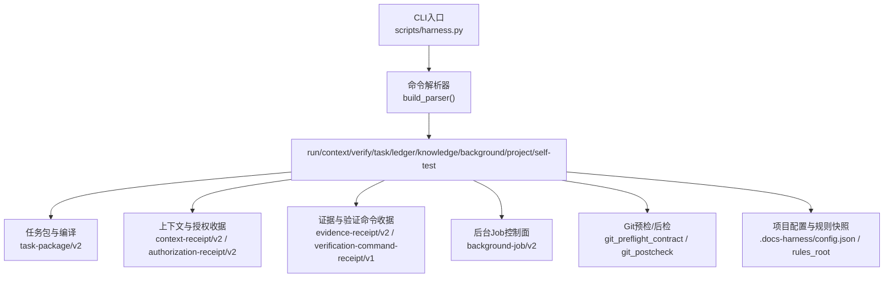
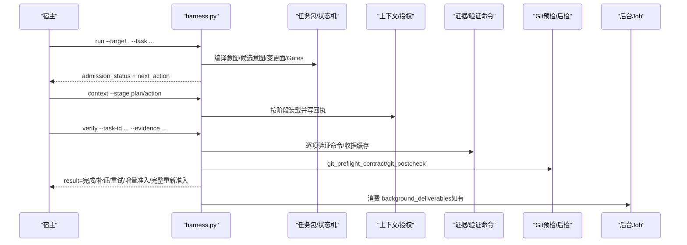
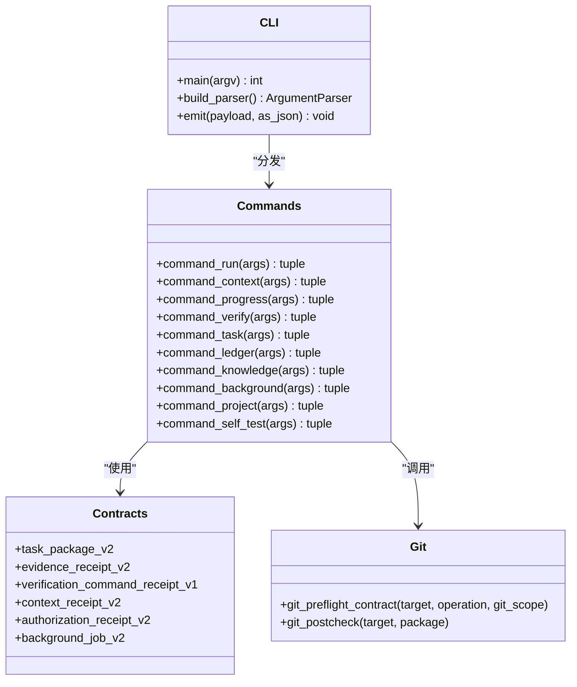

# SDK使用指南

<cite>
**本文引用的文件**   
- [SKILL.md](file://SKILL.md)
- [package.json](file://package.json)
- [scripts/harness.py](file://scripts\harness.py)
- [tests/test_harness.py](file://tests\test_harness.py)
- [docs/contracts.md](file://docs\contracts.md)
- [harness-home/rules/INDEX.md](file://harness-home\rules\INDEX.md)
</cite>

## 目录
1. [简介](#简介)
2. [项目结构](#项目结构)
3. [核心组件](#核心组件)
4. [架构总览](#架构总览)
5. [详细组件分析](#详细组件分析)
6. [依赖关系分析](#依赖关系分析)
7. [性能与优化建议](#性能与优化建议)
8. [故障排查指南](#故障排查指南)
9. [结论](#结论)
10. [附录：API参考与示例](#附录api参考与示例)

## 简介
Docs Harness 是一个独立的任务控制器，负责任务意图识别、风险 Gate 判定、范围绑定、上下文装配、授权校验、证据验收、后台治理以及 Git 交付检查。它不自动提交、推送、发布或修改下游项目，也不把源码、本地 Runtime、当前 HEAD、远端、fresh clone、发布产物和真实 UI 合并为单一完成结论。SDK 以 Python CLI 形式提供，所有交互通过命令行参数与 JSON 输出进行结构化通信。

本指南面向集成方（宿主）与开发者，覆盖安装、配置、初始化、认证与授权机制、错误处理、性能优化、最佳实践与常见问题。

## 项目结构
- scripts/harness.py：主控制器实现，包含全部命令路由、状态机、Git 预检/后检、证据与上下文管理、后台 Job 控制等。
- tests/test_harness.py：完整的行为契约测试，覆盖 run/context/verify/background/project/self-test 等关键路径。
- docs/contracts.md：v1.6.5 合同定义，包括 task-package/v2、evidence-receipt/v2、背景 Job、Runtime 位置、退出码等。
- harness-home/rules/INDEX.md：随项目安装的规则快照索引，包含生效规则 ID 与加载约定。
- package.json：包元数据与脚本入口（self-test、pack:check）。
- SKILL.md：技能说明、安装与任务入口、后台治理、质量账本、按需读取等高层使用说明。

图表来源
- [scripts/harness.py:10160-10279](file://scripts\harness.py#L10160-L10279)
- [docs/contracts.md:9-133](file://docs\contracts.md#L9-L133)

章节来源
- [package.json:1-22](file://package.json#L1-L22)
- [SKILL.md:13-51](file://SKILL.md#L13-L51)

## 核心组件
- CLI 命令集：run、context、progress、verify、task、ledger、knowledge、background、project、self-test。
- 任务模型：task-package/v2，描述意图、候选意图、变更面、读写范围、允许动作等。
- 准入与路线：blocked/needs_plan/needs_authorization/ready_direct/ready_planned/ready_extended。
- 证据体系：evidence-receipt/v2、verification-command-receipt/v1、evidence-declaration/v1。
- 上下文与授权：context-receipt/v2、authorization-receipt/v2。
- 后台治理：background-job/v2，支持 background_direct、background_goal、background_goal_phased。
- Git 安全：git_preflight_contract、git_postcheck、受控 refs 命名空间、漂移检测。
- 项目配置与规则：.docs-harness/config.json、rules_root、active rules 指纹校验。

章节来源
- [docs/contracts.md:9-133](file://docs\contracts.md#L9-L133)
- [docs/contracts.md:165-221](file://docs\contracts.md#L165-L221)
- [docs/contracts.md:303-348](file://docs\contracts.md#L303-L348)
- [harness-home/rules/INDEX.md:1-41](file://harness-home\rules\INDEX.md#L1-L41)

## 架构总览
Docs Harness 的调用流程遵循“意图优先、证据可复用、失败关闭”的原则。宿主通过 CLI 发起任务，控制器完成意图编译、Gate 判定、范围绑定、计划冻结、上下文装配、执行与验收，必要时触发后台治理。所有中间态与结果均以 JSON 输出，便于宿主编排。

图表来源
- [scripts/harness.py:10160-10359](file://scripts\harness.py#L10160-L10359)
- [docs/contracts.md:9-133](file://docs\contracts.md#L9-L133)

## 详细组件分析

### 安装与初始化
- 新项目安装：创建最小知识骨架、执行 knowledge estimate 并返回 knowledge_bootstrap 后台合同；不等待知识生成。
- 已有 docs 的项目：安装阶段零文档内容写入，先审查缺口，需用户同意后再创建后台 Job。
- 不自动修改 .gitignore、提交、推送或发布；clone_ready 由控制器分别报告 runtime_status、controller_clone_ready、整体 clone_ready。

章节来源
- [SKILL.md:13-24](file://SKILL.md#L13-L24)
- [docs/contracts.md:303-348](file://docs\contracts.md#L303-L348)

### 任务入口与幂等
- 每个任务第一条动作：run --target . --task "<原始用户任务>" --json。
- 同一 target、任务文本、事实与工作区快照重复 run 时幂等复用活动任务，返回 active_task_reused；--new-task 强制新建；终态任务不复用。
- 只读查询使用 read_only + write_scope=[]；Git inspect/fetch/sync 分别使用读取、Git 元数据写入和工作区写入合同。

章节来源
- [SKILL.md:25-43](file://SKILL.md#L25-L43)
- [docs/contracts.md:9-48](file://docs\contracts.md#L9-L48)

### 认证与授权机制
- 上下文使用 context-receipt/v2，复用条件：同一 task_id、target_identity、stage、compiler_contract、content_set_fingerprint。
- 授权使用 authorization-receipt/v2，始终绑定当前 package fingerprint，不按内容集合跨修订复用。
- 高风险证据必须来自可信 v2 生产者；报告型旧证据不能满足。

章节来源
- [docs/contracts.md:222-234](file://docs\contracts.md#L222-L234)
- [docs/contracts.md:165-188](file://docs\contracts.md#L165-L188)

### 证据与验证命令
- 新任务只接受 evidence-receipt/v2，必填字段包含 task_id、target_identity、package_fingerprint、producer、cwd、起止时间、ttl、exit_code、digests、read_set/write_set。
- 验证命令使用 verification-command-receipt/v1 逐项收据，输入不变且上次通过的命令直接复用；仅失败或输入变化的命令重跑。
- 可通过配置关闭命令缓存或恢复自动归因行为。

章节来源
- [docs/contracts.md:165-221](file://docs\contracts.md#L165-L221)

### Git 状态与安全
- git_fetch/git_sync 绑定 git_state_snapshot，包含 repo_identity、remote、preflight_target_oid、head、index_tree、worktree_fingerprint、controlled_refs_namespace 等。
- git_inspect 只读；git_fetch 只允许声明的远端 refs/objects 变化；git_sync 绑定单一预检 OID，自动生成变更范围。
- 远端漂移、ref 越界、非 fast-forward、脏工作区重叠、危险删除、LFS/Submodule 不可验证均失败关闭。

章节来源
- [docs/contracts.md:97-133](file://docs\contracts.md#L97-L133)

### 后台治理
- 统一后台 Job 控制器 background-job/v2，支持 background_direct、background_goal、background_goal_phased。
- 复杂路线标准序列：contract_ready → prepare → 宿主 Goal/Plan → dispatched → running → progress → verify → 终态。
- 能力不足时进入 queued_manual，不得静默降级；Job 固定 may_mutate_parent=false、may_spawn_child_jobs=false、suppress_post_completion_dispatch=true。

章节来源
- [docs/contracts.md:303-348](file://docs\contracts.md#L303-L348)
- [SKILL.md:59-81](file://SKILL.md#L59-L81)

### 项目配置与规则
- 项目配置使用 docs-harness/project-config/v4，版本值为 1.6.5。
- 规则快照位于 harness-home/rules，运行时不得依赖源码目录绝对路径；Git 项目必须让规则目录、config.json 与 knowledge-map.json 进入版本控制面。
- 规则缺失、增加或变化均失败关闭，必须通过来源包升级或人工 preserve-and-merge。

章节来源
- [docs/contracts.md:1-7](file://docs\contracts.md#L1-L7)
- [harness-home/rules/INDEX.md:1-41](file://harness-home\rules\INDEX.md#L1-L41)

## 依赖关系分析
- CLI 入口 main() 解析子命令并分发到对应 command_* 函数。
- 各命令依赖任务包与状态机、上下文与授权收据、证据与验证命令收据、Git 预检/后检、项目配置与规则快照。
- 测试用例通过 subprocess 调用 harness.py 并断言 JSON 响应，覆盖 run/context/verify/background/project/self-test 等路径。

图表来源
- [scripts/harness.py:10160-10359](file://scripts\harness.py#L10160-L10359)
- [docs/contracts.md:9-133](file://docs\contracts.md#L9-L133)

章节来源
- [tests/test_harness.py:59-87](file://tests\test_harness.py#L59-L87)

## 性能与优化建议
- 验证命令缓存：默认启用，输入不变则复用收据；可通过配置关闭。
- 上下文去重：plan/action 相同内容正文只返回一次，避免重复加载。
- 计划一次冻结：范围绑定后在同一事务中重新校验并采用计划，减少往返。
- 证据受管副本：临时文件删除不影响已采纳证据，降低 IO 压力。
- 增量准入：普通新增 Gate 且合同稳定时增量准入，继承同轮已验证收据。

章节来源
- [docs/contracts.md:165-221](file://docs\contracts.md#L165-L221)
- [docs/contracts.md:50-80](file://docs\contracts.md#L50-L80)

## 故障排查指南
- 常见退出码：0成功、1检查/自检失败、2输入/合同无效、3需要方案/授权/证据/迁移/用户输入、4范围/漂移/Gate/授权/规则变化需重新准入。
- 典型阻断：脏工作区与 git_sync 范围重叠、非 fast-forward、远端目标漂移、ref 越界、LFS/Submodule 不可验证。
- 证据问题：过期、跨任务/目标、不可信生产者、非零退出或摘要无效。
- 规则问题：规则缺失、增加或变化导致失败关闭，需升级或人工 preserve-and-merge。

章节来源
- [docs/contracts.md:359-370](file://docs\contracts.md#L359-L370)
- [docs/contracts.md:97-133](file://docs\contracts.md#L97-L133)
- [docs/contracts.md:165-188](file://docs\contracts.md#L165-L188)

## 结论
Docs Harness 提供了严格的安全边界、可复用的证据与上下文、稳定的合同与清晰的退出码，适合在宿主环境中作为独立任务控制器集成。通过 CLI 与 JSON 输出，宿主可以编排完整的任务生命周期，并在必要时引入后台治理。遵循本指南的安装、配置、认证与最佳实践，可确保系统稳定、高效与安全。

## 附录：API参考与示例

### CLI命令参考
- run：任务路由、任务包编译与执行准入。参数包括 --target、--task、--task-id、--new-task、--facts、--plan、--authorization、--scope、--feature、--action、--success。
- context：按阶段加载精确上下文并写回执。参数包括 --target、--task-id、--stage、--work-package。
- progress：推进 extended 工作包状态。参数包括 action(status/begin/submit/block)、--target、--task-id、--work-package、--evidence、--reason、--scope-changed、--handoff。
- verify：同源验收、补证或重新准入。参数包括 --target、--task-id、--evidence。
- task：查询、取消、归档、清理任务或显式迁移 v1 在途任务。参数包括 action(status/migrate/cancel/archive/list/prune)、--target、--task-id、--apply、--reason-code、--older-than、--dry-run、--include-archived。
- ledger：人工触发的个人本地质量账本。参数包括 action(add/read)、--target、--task-id、--review、--query、--limit。
- knowledge：功能知识库审查、评估与兼容后台入口。参数包括 action(status/estimate/audit/bootstrap/update/verify/job-status/dispatch/retry)、--target、--assessment、--consent、--job-id、--job-status、--result。
- background：统一后台文档治理 Job 控制器。参数包括 action(estimate/list/status/prepare/progress/dispatch/verify/retry/prune)、--target、--candidate、--job-id、--job-status、--work-package-id、--work-package-status、--reason-code、--repair、--assessment、--result、--older-than、--apply、--dry-run。
- project：项目安装生命周期。参数包括 action(init/upgrade/uninstall/check/diff/rollback-check)、--target、--apply、--purge-runtime。
- self-test：运行内置合同自检。参数包括 --target。

章节来源
- [scripts/harness.py:10160-10279](file://scripts\harness.py#L10160-L10279)

### 典型使用场景示例
- 新项目安装：python3 scripts/harness.py project init --target <project> --json
- 启动任务：python3 scripts/harness.py run --target . --task "<原始用户任务>" --json
- 加载上下文：python3 scripts/harness.py context --target . --task-id <task-id> --stage plan|action
- 提交证据并验收：python3 scripts/harness.py verify --target . --task-id <task-id> --evidence <evidence.json> --json
- 后台治理：python3 scripts/harness.py background prepare --target . --job-id <job-id> --json
- 自检：python3 scripts/harness.py self-test --target . --json

章节来源
- [SKILL.md:13-51](file://SKILL.md#L13-L51)
- [tests/test_harness.py:146-163](file://tests\test_harness.py#L146-L163)

### 错误处理与异常管理
- 自定义异常 HarnessError：携带 code 与 exit_code，用于结构化错误返回。
- 输入校验：文件路径、大小限制、UTF-8、JSON 类型与文件系统错误转成结构化错误，不回显敏感输入。
- 退出码语义：见“故障排查指南”。

章节来源
- [scripts/harness.py:392-396](file://scripts\harness.py#L392-L396)
- [docs/contracts.md:359-370](file://docs\contracts.md#L359-L370)

### 集成最佳实践
- 使用 JSON 输出进行结构化编排，避免解析人类可读文本。
- 合理设置 verification.command_cache_enabled 与 verification.auto_attribute_in_scope 以平衡效率与合规。
- 对高风险 Gate（security-sensitive、destructive-data、release-external）保持最小权限与明确授权。
- 定期运行 project check 与 self-test 确保环境健康。

章节来源
- [docs/contracts.md:165-221](file://docs\contracts.md#L165-L221)
- [harness-home/rules/INDEX.md:1-41](file://harness-home\rules\INDEX.md#L1-L41)