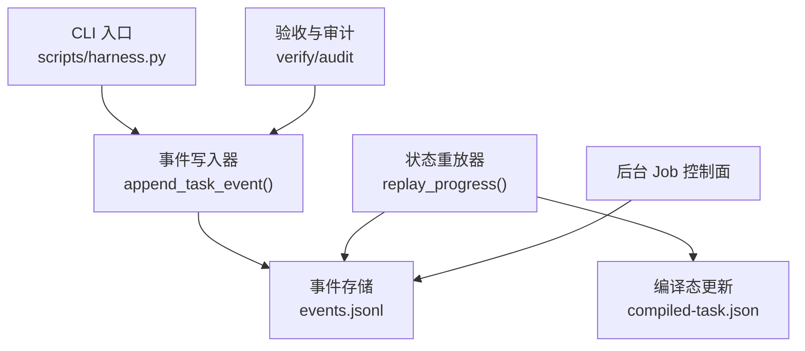
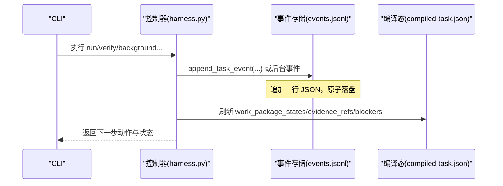
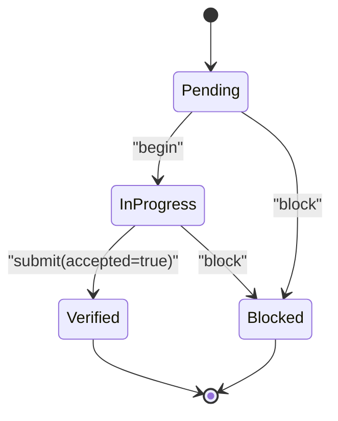
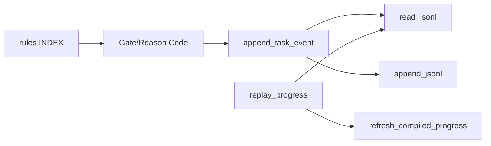
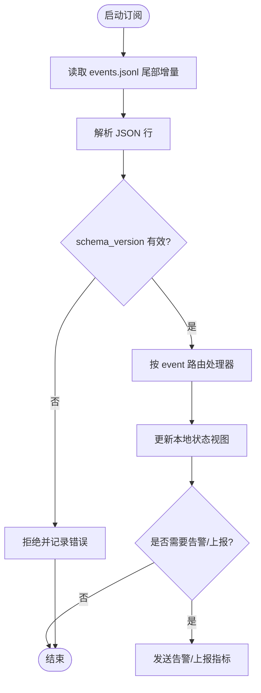

# 事件系统

<cite>
**本文引用的文件**
- [scripts/harness.py](file://scripts/harness.py)
- [docs/contracts.md](file://docs/contracts.md)
- [tests/test_harness.py](file://tests/test_harness.py)
- [harness-home/rules/INDEX.md](file://harness-home/rules/INDEX.md)
- [docs/architecture.md](file://docs/architecture.md)
</cite>

## 目录
1. [引言](#引言)
2. [项目结构](#项目结构)
3. [核心组件](#核心组件)
4. [架构总览](#架构总览)
5. [详细组件分析](#详细组件分析)
6. [依赖关系分析](#依赖关系分析)
7. [性能与可观测性](#性能与可观测性)
8. [故障排查指南](#故障排查指南)
9. [结论](#结论)
10. [附录：事件订阅与处理示例、序列化格式、调试与监控最佳实践](#附录事件订阅与处理示例序列化格式调试与监控最佳实践)

## 引言
本文件为 Docs Harness 的事件系统提供完整文档，覆盖事件类型、消息格式、传输协议、产生时机、处理流程与生命周期管理；并说明审计日志、状态跟踪与监控告警的实现机制。同时给出事件订阅与处理的参考实现思路、事件序列化/反序列化规范、调试工具与监控最佳实践，以及事件驱动架构的设计模式与扩展指南。

## 项目结构
Docs Harness 的事件系统以 JSON Lines（JSONL）作为持久化载体，位于任务 Runtime 的 events.jsonl 文件中。控制器通过统一的 append/read 接口写入与回放事件，用于状态重放、进度追踪与审计。

图表来源
- [scripts/harness.py:1031-1070](file://scripts/harness.py#L1031-L1070)
- [scripts/harness.py:4938-4991](file://scripts/harness.py#L4938-L4991)
- [docs/contracts.md:283-301](file://docs/contracts.md#L283-L301)

章节来源
- [scripts/harness.py:80-90](file://scripts/harness.py#L80-L90)
- [docs/contracts.md:283-301](file://docs/contracts.md#L283-L301)
- [docs/architecture.md:1-10](file://docs/architecture.md#L1-L10)

## 核心组件
- 事件常量与 Schema
  - 事件 Schema 标识：docs-harness/event/v2
  - 运行时受控文件包含 events.jsonl
- 事件写入
  - append_task_event(state, package, event, phase, reason_code, duration_ms, context_cache_hit, **fields)
  - 自动计算上下文命中、读入次数、重新准入计数、证据轮次、宿主收据数量、业务动作数等指标
- 事件读取与重放
  - read_jsonl(path) 安全解析 JSONL
  - replay_progress(package, events) 基于事件序列重建工作包状态机
- 事件用途
  - 任务阶段审计（begin/submit/block 等）
  - 验证尝试审计（verification_attempt）
  - 取消与终态审计（task_cancelled）
  - 后台 Job 控制面事件（begin/block 等）

章节来源
- [scripts/harness.py:30](file://scripts/harness.py#L30)
- [scripts/harness.py:84](file://scripts/harness.py#L84)
- [scripts/harness.py:1031-1070](file://scripts/harness.py#L1031-L1070)
- [scripts/harness.py:507-529](file://scripts/harness.py#L507-L529)
- [scripts/harness.py:4938-4991](file://scripts/harness.py#L4938-L4991)
- [docs/contracts.md:283-301](file://docs/contracts.md#L283-L301)

## 架构总览
事件系统围绕“写一次、多次回放”的原则构建：所有关键操作均追加不可变事件到 events.jsonl；状态由事件流重放得到，保证幂等与可审计。

图表来源
- [scripts/harness.py:1031-1070](file://scripts/harness.py#L1031-L1070)
- [scripts/harness.py:4938-4991](file://scripts/harness.py#L4938-L4991)

## 详细组件分析

### 事件 Schema 与字段
- schema_version: docs-harness/event/v2
- event: 事件名（如 begin、submit、block、readmission、verification_attempt、task_cancelled 等）
- task_id: 任务 ID
- phase: 阶段（context、verification、business_action 等）
- started_at/at: ISO 时间戳（UTC）
- duration_ms: 耗时毫秒
- reason_code: 受控原因码
- package_revision: 任务包修订号
- context_cache_hit/context_load_count: 上下文缓存命中与加载计数
- readmission_count: 重新准入次数（含 scope_bound_readmission、incremental_gate_readmission）
- evidence_round_count: 证据轮次
- host_receipt_count: 宿主收据总数（context + authorization + evidence-index）
- business_action_count: 业务动作计数（begin/submit）
- 其他扩展字段：按事件语义附加（如 work_package_id、owner、workspace_snapshot、reason、scope_changed、changed_paths、outside_scope、new_gates、evidence_refs 等）

约束与脱敏
- 不得保存用户任务正文、原始工具输出、环境变量、凭证或完整日志
- 仅保留有界字段，便于效率结论复算

章节来源
- [docs/contracts.md:283-301](file://docs/contracts.md#L283-L301)
- [scripts/harness.py:1031-1070](file://scripts/harness.py#L1031-L1070)

### 事件写入与持久化
- append_task_event(state, package, event, phase, reason_code, duration_ms=0, context_cache_hit=False, **fields)
  - 读取已有事件，统计各类计数
  - 生成 payload 并调用 append_jsonl 追加到 events.jsonl
- append_jsonl(path, value)
  - 使用 canonical JSON 序列化，确保顺序稳定
  - 逐行写入并 fsync，保证原子性与一致性

章节来源
- [scripts/harness.py:1031-1070](file://scripts/harness.py#L1031-L1070)
- [scripts/harness.py:507-513](file://scripts/harness.py#L507-L513)

### 事件读取与状态重放
- read_jsonl(path)
  - 逐行解析 JSON，跳过空行，异常时抛出结构化错误
- replay_progress(package, events)
  - 过滤当前 package_revision 的事件
  - 根据事件类型推进工作包状态：pending → in_progress → verified/blocked
  - 收集 blockers 与已引用证据 refs
- refresh_compiled_progress(state, package, compiled, target)
  - 基于事件重放结果刷新 compiled-task.json 的状态与下一步动作

章节来源
- [scripts/harness.py:515-529](file://scripts/harness.py#L515-L529)
- [scripts/harness.py:4938-4991](file://scripts/harness.py#L4938-L4991)

### 事件类型与产生时机
- 任务阶段事件
  - begin：开始执行某工作包
  - submit：提交工作包结果（accepted=true 表示通过）
  - block：阻塞（含范围/Gate 变化、外部漂移等）
- 验证尝试事件
  - verification_attempt：每次 verify 入口必须记录，无论成功或失败
- 取消与终态事件
  - task_cancelled：任务被取消，记录原因码与时间
- 后台 Job 事件
  - begin/block 等，记录 attempt、work_package_id、原因码与指纹

章节来源
- [scripts/harness.py:5555-5634](file://scripts/harness.py#L5555-L5634)
- [docs/contracts.md:283-301](file://docs/contracts.md#L283-L301)

### 事件生命周期与状态机

图表来源
- [scripts/harness.py:4938-4991](file://scripts/harness.py#L4938-L4991)

### 审计日志与监控
- 审计日志：events.jsonl 作为不可变审计轨迹，支持事后审计与回溯
- 监控指标：duration_ms、readmission_count、evidence_round_count、host_receipt_count、business_action_count 等
- 告警建议：对 readmission_count 突增、evidence_round_count 过高、blocked 比例上升等进行阈值告警

章节来源
- [docs/contracts.md:283-301](file://docs/contracts.md#L283-L301)
- [scripts/harness.py:1031-1070](file://scripts/harness.py#L1031-L1070)

## 依赖关系分析
- 事件写入依赖：
  - read_jsonl：读取历史事件以统计计数
  - append_jsonl：追加事件到 events.jsonl
- 状态重放依赖：
  - replay_progress：消费 events.jsonl 重建状态
  - refresh_compiled_progress：更新 compiled-task.json
- 规则与 Gate：
  - 规则索引与生效规则来自 harness-home/rules/INDEX.md
  - 事件原因码与 Gate 联动（如 scope_change_readmission、testing_release 等）

图表来源
- [scripts/harness.py:1031-1070](file://scripts/harness.py#L1031-L1070)
- [scripts/harness.py:4938-4991](file://scripts/harness.py#L4938-L4991)
- [harness-home/rules/INDEX.md:1-41](file://harness-home/rules/INDEX.md#L1-L41)

章节来源
- [harness-home/rules/INDEX.md:1-41](file://harness-home/rules/INDEX.md#L1-L41)
- [docs/architecture.md:1-10](file://docs/architecture.md#L1-L10)

## 性能与可观测性
- 性能特性
  - JSONL 追加为 O(1)，适合高吞吐事件写入
  - 重放复杂度 O(N) N 为事件条数，可通过 package_revision 过滤减少扫描
- 可观测性
  - 通过事件字段直接复算效率结论，避免敏感信息泄露
  - 建议聚合 metrics：重试率、阻塞率、上下文命中率、证据轮次分布

[本节为通用指导，不直接分析具体文件]

## 故障排查指南
- 常见错误
  - JSON 无效或事件行非对象：read_jsonl 会抛出 invalid_state
  - 非法状态转换：replay_progress 检测到非法 begin/submit/block 时报错
  - 目标目录无效或权限问题：safe_target 校验失败
- 定位步骤
  - 检查 events.jsonl 是否损坏或截断
  - 核对 package_revision 是否与当前任务包一致
  - 查看 reason_code 与 blocked 原因，结合 Gate 与范围变更规则

章节来源
- [scripts/harness.py:515-529](file://scripts/harness.py#L515-L529)
- [scripts/harness.py:4938-4991](file://scripts/harness.py#L4938-L4991)
- [scripts/harness.py:532-538](file://scripts/harness.py#L532-L538)

## 结论
Docs Harness 的事件系统以 JSONL 为核心，提供不可变、可重放、可审计的事件流。通过统一写入与重放接口，实现了任务与后台 Job 的状态机、审计日志与监控指标的统一采集与复用。遵循最小字段与脱敏原则，确保安全性与合规性。

[本节为总结，不直接分析具体文件]

## 附录：事件订阅与处理示例、序列化格式、调试与监控最佳实践

### 事件订阅与处理（参考实现思路）
- 订阅者职责
  - 监听 events.jsonl 新增行
  - 解析事件并路由到处理器（按 event 类型）
  - 维护轻量级视图（如最近 N 条事件、按 task_id 分组）
- 处理流程
  - 读取尾部增量行
  - 校验 schema_version 与必要字段
  - 更新本地状态（如 work_package_states、blockers、evidence_refs）
  - 触发下游动作（告警、报表、归档）

注意：以下为概念性示例，不直接映射仓库代码。

[此图为概念流程图，不绑定具体源码]

### 事件序列化与反序列化格式
- 序列化
  - 使用 canonical JSON（键排序、无多余空格），确保稳定性
  - 每行一个 JSON 对象，UTF-8 编码，换行分隔
- 反序列化
  - 逐行读取，跳过空行
  - 严格校验 schema_version 与必填字段
  - 异常时抛出结构化错误（invalid_json、invalid_state）

章节来源
- [scripts/harness.py:403-405](file://scripts/harness.py#L403-L405)
- [scripts/harness.py:507-529](file://scripts/harness.py#L507-L529)

### 调试工具与监控最佳实践
- 调试
  - 直接查看 events.jsonl 内容，确认事件顺序与字段完整性
  - 使用 read_jsonl 进行离线回放，验证状态机一致性
- 监控
  - 聚合 readmission_count、evidence_round_count、blocked 比例
  - 对 duration_ms 分位值监控（P50/P95/P99）
  - 设置阈值告警：readmission_count 突增、evidence_round_count > 阈值、blocked 持续存在

章节来源
- [docs/contracts.md:283-301](file://docs/contracts.md#L283-L301)
- [scripts/harness.py:1031-1070](file://scripts/harness.py#L1031-L1070)

### 事件驱动架构设计模式与扩展指南
- 设计模式
  - 事件溯源：以事件为唯一事实源，状态由事件重放得到
  - 发布-订阅：事件生产者与消费者解耦，支持多订阅者
  - 幂等处理：同一事件可重复消费，避免副作用
- 扩展指南
  - 新增事件类型：定义 event 名称与字段，保持 schema_version 兼容
  - 新增处理器：按 event 路由到对应处理器，确保幂等与健壮性
  - 监控扩展：在 append_task_event 中增加新指标字段，并在订阅端聚合

[本节为概念性指导，不直接分析具体文件]