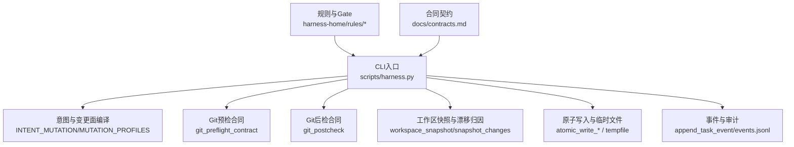
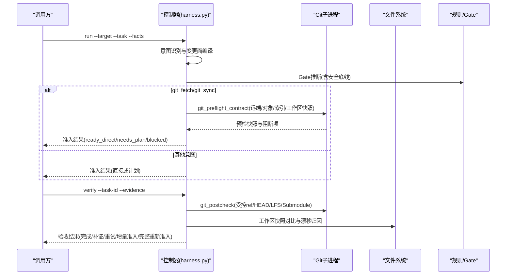
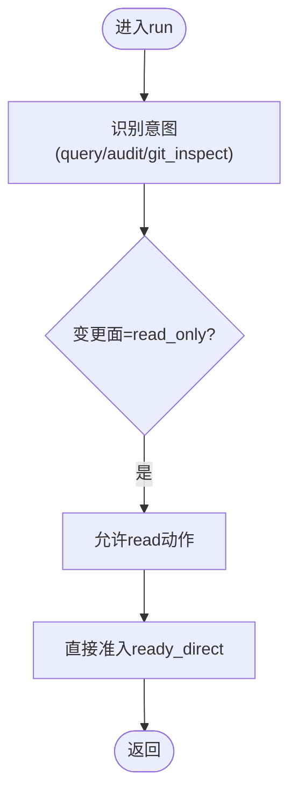
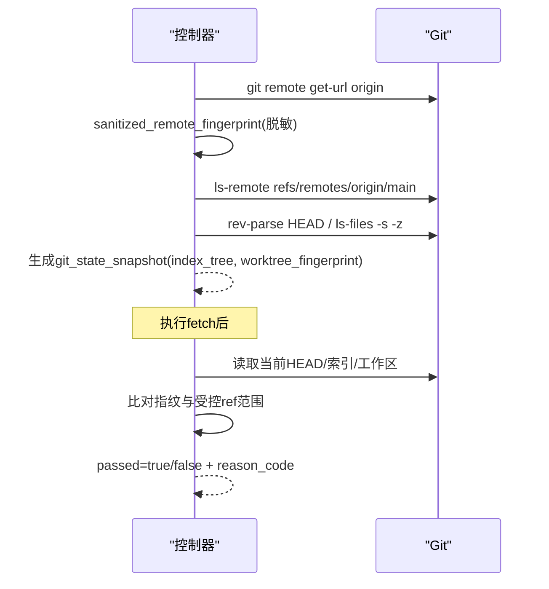
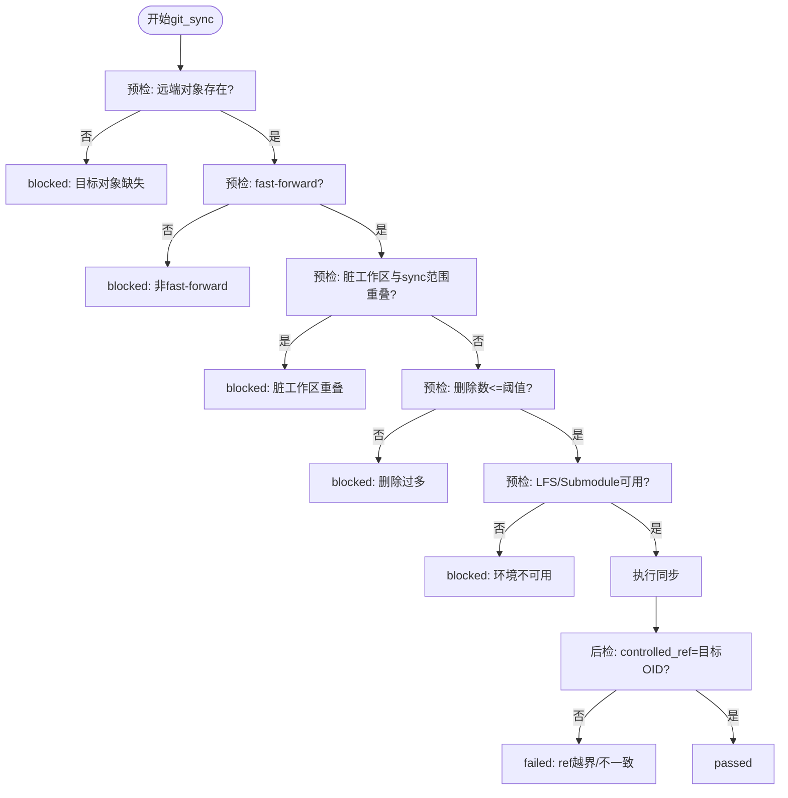
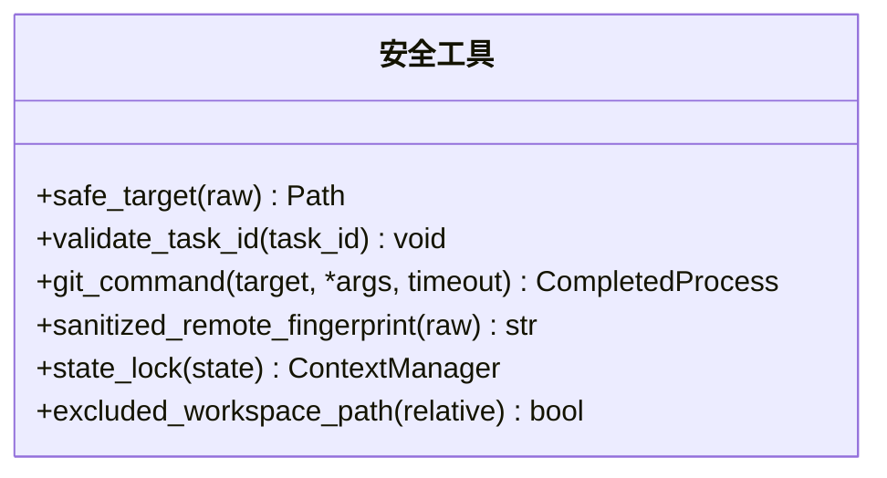
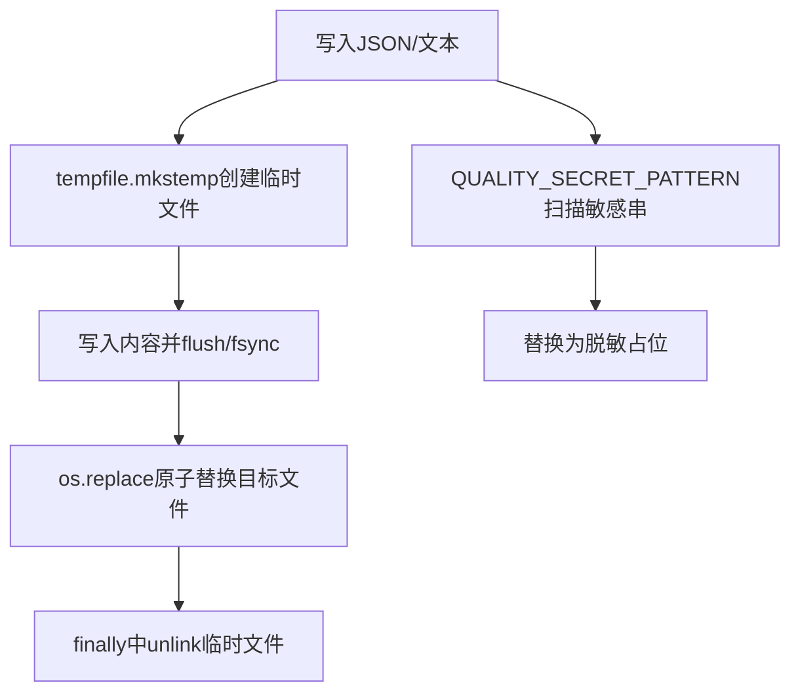
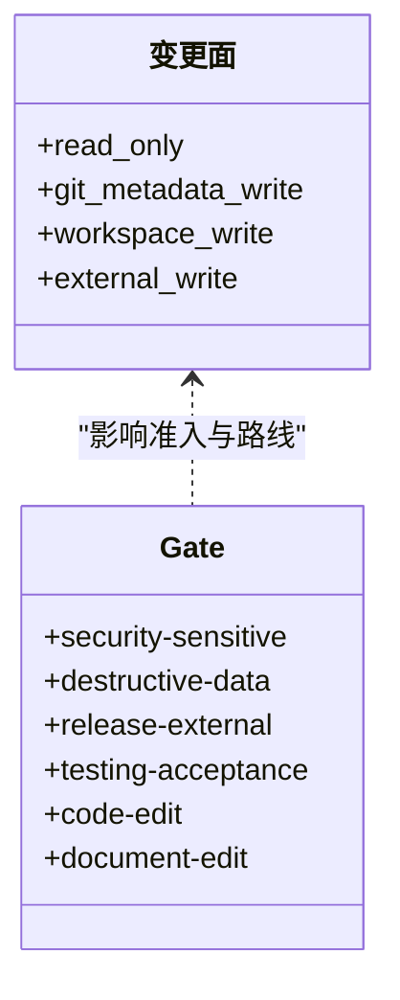
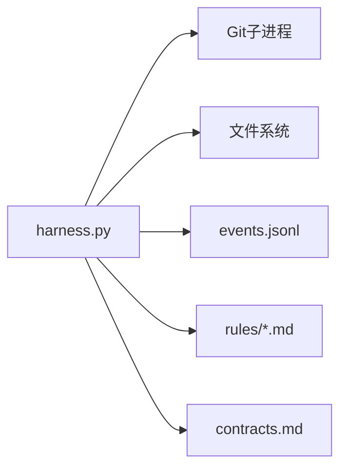

# Git安全操作

<cite>
**本文引用的文件**   
- [scripts/harness.py](file://scripts/harness.py)
- [tests/test_harness.py](file://tests/test_harness.py)
- [harness-home/rules/external-input-security.md](file://harness-home/rules/external-input-security.md)
- [harness-home/rules/INDEX.md](file://harness-home/rules/INDEX.md)
- [docs/contracts.md](file://docs/contracts.md)
- [SKILL.md](file://SKILL.md)
</cite>

## 目录
1. [简介](#简介)
2. [项目结构](#项目结构)
3. [核心组件](#核心组件)
4. [架构总览](#架构总览)
5. [详细组件分析](#详细组件分析)
6. [依赖关系分析](#依赖关系分析)
7. [性能考虑](#性能考虑)
8. [故障排查指南](#故障排查指南)
9. [结论](#结论)
10. [附录：安全配置最佳实践与示例](#附录安全配置最佳实践与示例)

## 简介
本文件面向Docs Harness中的Git安全操作，系统性阐述只读操作、元数据写入与工作区写入的合同分离机制；解释Git命令的安全执行环境（权限控制、路径验证、参数注入防护）；说明不同操作级别的访问控制策略（读取、元数据修改、文件写入）；界定Git操作的安全边界，防止恶意意图绕过安全检查；并给出敏感信息保护机制（密钥过滤、日志脱敏、临时文件清理）、安全配置最佳实践与常见安全问题解决方案。

## 项目结构
- 控制器主程序位于 scripts/harness.py，实现任务路由、意图识别、变更面判定、Git预检/后检、工作区快照、原子写入、事件记录等核心能力。
- 测试用例 tests/test_harness.py 覆盖Git fetch/sync/inspect的准入、阻断、漂移、越界、LFS/Submodule校验等关键场景。
- 规则 harness-home/rules/* 定义外部输入安全、API兼容、发布授权等Gate约束，INDEX.md维护激活规则清单。
- 合同文档 docs/contracts.md 明确task-package/v2、Git状态合同、证据收据、验收分层等契约。
- SKILL.md 提供高层使用约定与安全底线说明。

**图表来源** 
- [scripts/harness.py:206-230](file://scripts/harness.py#L206-L230)
- [scripts/harness.py:677-791](file://scripts/harness.py#L677-L791)
- [scripts/harness.py:793-875](file://scripts/harness.py#L793-L875)
- [scripts/harness.py:1112-1135](file://scripts/harness.py#L1112-L1135)
- [scripts/harness.py:419-434](file://scripts/harness.py#L419-L434)
- [scripts/harness.py:1031-1070](file://scripts/harness.py#L1031-L1070)
- [harness-home/rules/INDEX.md:1-41](file://harness-home/rules/INDEX.md#L1-L41)
- [docs/contracts.md:97-133](file://docs/contracts.md#L97-L133)

**章节来源**
- [scripts/harness.py:1-120](file://scripts/harness.py#L1-L120)
- [harness-home/rules/INDEX.md:1-41](file://harness-home/rules/INDEX.md#L1-L41)
- [docs/contracts.md:1-100](file://docs/contracts.md#L1-L100)

## 核心组件
- 意图与变更面映射：将用户意图（query/audit/git_inspect/git_fetch/git_sync/modify/external_write）映射为变更面（read_only/git_metadata_write/workspace_write/external_write），决定允许动作集合与准入流程。
- Git预检合同：对git_fetch与git_sync进行前置检查，包括远端可达性、目标对象存在性、fast-forward约束、脏工作区重叠、删除数量阈值、LFS/Submodule可用性、索引与工作区指纹冻结等。
- Git后检合同：在任务完成后校验受控ref变化范围、HEAD与目标一致性、分支是否分歧、LFS/Submodule有效性，并输出变更ref列表与越界ref列表。
- 工作区快照与漂移归因：构建工作树快照，区分可信写入、并发漂移与未归因漂移，结合write_scope进行阻断或放行。
- 原子写入与临时文件：所有落盘采用原子替换与fsync，避免部分写入；临时文件通过系统临时目录创建并在finally中清理。
- 事件与审计：每次verify与关键阶段写入结构化事件，包含重试次数、上下文加载计数、证据轮次等，不记录敏感原文。

**章节来源**
- [scripts/harness.py:206-230](file://scripts/harness.py#L206-L230)
- [scripts/harness.py:677-791](file://scripts/harness.py#L677-L791)
- [scripts/harness.py:793-875](file://scripts/harness.py#L793-L875)
- [scripts/harness.py:1112-1135](file://scripts/harness.py#L1112-L1135)
- [scripts/harness.py:419-434](file://scripts/harness.py#L419-L434)
- [scripts/harness.py:1031-1070](file://scripts/harness.py#L1031-L1070)

## 架构总览
下图展示从任务入站到Git安全执行的端到端流程，强调只读、元数据写入与工作区写入的分离与校验点。

**图表来源** 
- [scripts/harness.py:677-791](file://scripts/harness.py#L677-L791)
- [scripts/harness.py:793-875](file://scripts/harness.py#L793-L875)
- [scripts/harness.py:1112-1135](file://scripts/harness.py#L1112-L1135)
- [docs/contracts.md:97-133](file://docs/contracts.md#L97-L133)

## 详细组件分析

### 只读操作（query/audit/git_inspect）
- 变更面为read_only，默认allowed_actions包含read，不要求逐文件写入范围。
- git_inspect仅允许读取历史与引用，不产生工作树变更。
- 自然语言“不要修改”“仅查询”不会升级变更面。

**图表来源** 
- [scripts/harness.py:153-230](file://scripts/harness.py#L153-L230)
- [docs/contracts.md:30-46](file://docs/contracts.md#L30-L46)

**章节来源**
- [scripts/harness.py:153-230](file://scripts/harness.py#L153-L230)
- [tests/test_harness.py:577-596](file://tests/test_harness.py#L577-L596)

### 元数据写入（git_fetch）
- 变更面为git_metadata_write，仅允许声明的远端refs/objects变化，HEAD、索引与工作区必须不变。
- 预检阶段冻结index_tree与worktree_fingerprint，后检阶段严格比对head/index/worktree指纹。
- 远端URL在指纹计算前剥离用户名、密码、token、查询参数与fragment，Runtime不保存原文。

**图表来源** 
- [scripts/harness.py:585-610](file://scripts/harness.py#L585-L610)
- [scripts/harness.py:625-643](file://scripts/harness.py#L625-L643)
- [scripts/harness.py:793-875](file://scripts/harness.py#L793-L875)
- [docs/contracts.md:97-133](file://docs/contracts.md#L97-L133)

**章节来源**
- [scripts/harness.py:585-610](file://scripts/harness.py#L585-L610)
- [scripts/harness.py:793-875](file://scripts/harness.py#L793-L875)
- [tests/test_harness.py:503-537](file://tests/test_harness.py#L503-L537)

### 工作区写入（git_sync）
- 变更面为workspace_write，需计划准入；自动生成新增、修改、删除与重命名范围。
- 预检阶段强制fast-forward、无脏工作区重叠、删除数量不超过阈值、LFS/Submodule可用。
- 后检阶段校验controlled_ref与preflight_target_oid一致、分支未分歧、LFS/Submodule有效。

**图表来源** 
- [scripts/harness.py:677-791](file://scripts/harness.py#L677-L791)
- [scripts/harness.py:793-875](file://scripts/harness.py#L793-L875)

**章节来源**
- [scripts/harness.py:677-791](file://scripts/harness.py#L677-L791)
- [scripts/harness.py:793-875](file://scripts/harness.py#L793-L875)
- [tests/test_harness.py:597-735](file://tests/test_harness.py#L597-L735)

### Git命令安全执行环境
- 路径验证：safe_target拒绝根目录与用户主目录作为目标；git_root/git_dir确保目标为独立Git工作树根。
- 参数注入防护：所有Git命令通过subprocess.run以数组形式传递参数，避免shell拼接；timeout限制执行时长。
- 权限控制：状态锁state_lock使用独占文件锁，避免并发篡改；excluded_workspace_path排除.git/.docs-harness等控制面路径。
- 远程身份脱敏：sanitized_remote_fingerprint移除凭据与查询片段，仅保留主机与路径哈希。

**图表来源** 
- [scripts/harness.py:532-543](file://scripts/harness.py#L532-L543)
- [scripts/harness.py:572-583](file://scripts/harness.py#L572-L583)
- [scripts/harness.py:585-610](file://scripts/harness.py#L585-L610)
- [scripts/harness.py:1008-1029](file://scripts/harness.py#L1008-L1029)
- [scripts/harness.py:1073-1083](file://scripts/harness.py#L1073-L1083)

**章节来源**
- [scripts/harness.py:532-543](file://scripts/harness.py#L532-L543)
- [scripts/harness.py:572-583](file://scripts/harness.py#L572-L583)
- [scripts/harness.py:585-610](file://scripts/harness.py#L585-L610)
- [scripts/harness.py:1008-1029](file://scripts/harness.py#L1008-L1029)
- [scripts/harness.py:1073-1083](file://scripts/harness.py#L1073-L1083)

### 敏感信息保护机制
- 密钥过滤：QUALITY_SECRET_PATTERN匹配私钥头、Bearer token与GitHub相关令牌模式，用于质量记录与日志脱敏。
- 日志脱敏：事件写入不包含命令原始输出、计划正文、证据正文、环境变量或凭证；仅记录计数、原因码、指纹与有界路径。
- 临时文件清理：atomic_write_text使用tempfile.mkstemp创建临时文件，写入后原子替换，finally中清理残留；workspace_snapshot对大文件仅记录大小与时间戳，避免泄露内容。

**图表来源** 
- [scripts/harness.py:193-196](file://scripts/harness.py#L193-L196)
- [scripts/harness.py:419-434](file://scripts/harness.py#L419-L434)
- [scripts/harness.py:1031-1070](file://scripts/harness.py#L1031-L1070)
- [scripts/harness.py:1112-1135](file://scripts/harness.py#L1112-L1135)

**章节来源**
- [scripts/harness.py:193-196](file://scripts/harness.py#L193-L196)
- [scripts/harness.py:419-434](file://scripts/harness.py#L419-L434)
- [scripts/harness.py:1031-1070](file://scripts/harness.py#L1031-L1070)
- [scripts/harness.py:1112-1135](file://scripts/harness.py#L1112-L1135)

### 访问控制策略与Gate
- 变更面等级：read_only < git_metadata_write < workspace_write < external_write，混合意图取最高变更面。
- Gate体系：security-sensitive、destructive-data、release-external为安全底线，由代码强制并入，宿主只能加不能减；否定守卫避免误命中。
- 外部输入安全规则：触及鉴权、秘密、隐私、供应链边界时生效，失败关闭。

**图表来源** 
- [scripts/harness.py:206-230](file://scripts/harness.py#L206-L230)
- [scripts/harness.py:260-342](file://scripts/harness.py#L260-L342)
- [harness-home/rules/external-input-security.md:1-29](file://harness-home/rules/external-input-security.md#L1-L29)

**章节来源**
- [scripts/harness.py:206-230](file://scripts/harness.py#L206-L230)
- [scripts/harness.py:260-342](file://scripts/harness.py#L260-L342)
- [harness-home/rules/external-input-security.md:1-29](file://harness-home/rules/external-input-security.md#L1-L29)

## 依赖关系分析
- 控制器依赖Git子进程执行命令，所有命令均通过数组传参与超时控制，避免注入与挂起。
- 工作区快照依赖git ls-files与fallback rglob，排除控制面路径与大文件内容。
- 事件记录依赖JSONL追加与原子写入，保证幂等与可审计。
- 规则与合同驱动准入与验收逻辑，INDEX.md维护激活规则清单，contracts.md定义契约字段与行为。

**图表来源** 
- [scripts/harness.py:572-583](file://scripts/harness.py#L572-L583)
- [scripts/harness.py:1031-1070](file://scripts/harness.py#L1031-L1070)
- [harness-home/rules/INDEX.md:1-41](file://harness-home/rules/INDEX.md#L1-L41)
- [docs/contracts.md:1-100](file://docs/contracts.md#L1-L100)

**章节来源**
- [scripts/harness.py:572-583](file://scripts/harness.py#L572-L583)
- [scripts/harness.py:1031-1070](file://scripts/harness.py#L1031-L1070)
- [harness-home/rules/INDEX.md:1-41](file://harness-home/rules/INDEX.md#L1-L41)
- [docs/contracts.md:1-100](file://docs/contracts.md#L1-L100)

## 性能考虑
- 验证命令逐项缓存：verification.command_cache_enabled默认开启，按输入指纹复用已通过命令结果，减少重复执行。
- 工作区快照优化：大文件仅记录大小与时间戳，避免IO瓶颈；非Git工作区快照限制文件数量上限。
- 事件与收据复用：contract稳定时支持增量准入与继承同轮已校验收据，降低往返成本。

[本节为通用指导，无需特定文件来源]

## 故障排查指南
- Git远端漂移：verify返回reason_code=git_remote_drift，需重新准入并复用已冻结方案。
- Ref越界：outside_refs非空表示超出controlled_refs_namespace，检查git_scope与受控命名空间。
- 非fast-forward：precheck阻断，需合并或rebase后再同步。
- 脏工作区重叠：sync范围与本地修改冲突，先提交或暂存变更。
- LFS/Submodule不可用：环境缺失导致precheck失败，安装对应工具或禁用相关特性。
- 临时文件残留：检查atomic_write finally分支与tempfile清理逻辑。

**章节来源**
- [scripts/harness.py:793-875](file://scripts/harness.py#L793-L875)
- [tests/test_harness.py:620-735](file://tests/test_harness.py#L620-L735)

## 结论
Docs Harness通过严格的意图-变更面映射、Git预检/后检合同、工作区快照与漂移归因、原子写入与敏感信息脱敏，构建了安全的Git操作边界。只读、元数据写入与工作区写入的分离确保了最小权限原则；Gate与规则体系提供了风险门禁；事件与收据机制保障了可审计性与可恢复性。遵循本文安全配置与实践建议，可有效防止恶意意图绕过安全检查，保障交付过程的可信与可控。

[本节为总结，无需特定文件来源]

## 附录：安全配置最佳实践与示例
- 最小权限：仅声明必要的read/write/git/external scope，避免宽泛glob或绝对路径。
- 否定守卫：在任务描述中使用“不要推送”“仅查询”等明确否定词，避免误触发高风险Gate。
- 远程脱敏：确保所有远端URL经过sanitized_remote_fingerprint处理，禁止明文携带token。
- 原子落盘：所有配置文件与任务包使用atomic_write_json/text，避免部分写入导致状态不一致。
- 临时文件清理：依赖tempfile与finally清理，避免遗留敏感中间文件。
- 验证白名单：verification.volatile_paths仅允许带固定根目录的glob，禁止*|**或越界模式。
- 事件脱敏：事件记录不包含敏感原文，仅保留计数、原因码、指纹与有界路径。

**章节来源**
- [scripts/harness.py:1150-1186](file://scripts/harness.py#L1150-L1186)
- [scripts/harness.py:1188-1200](file://scripts/harness.py#L1188-L1200)
- [docs/contracts.md:165-200](file://docs/contracts.md#L165-L200)
- [SKILL.md:37-57](file://SKILL.md#L37-L57)