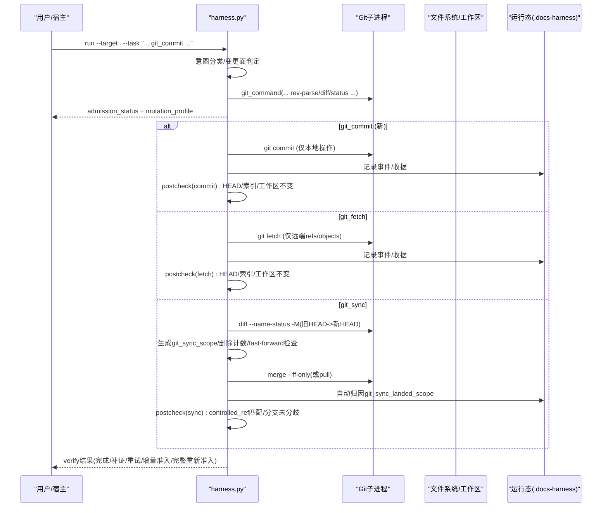
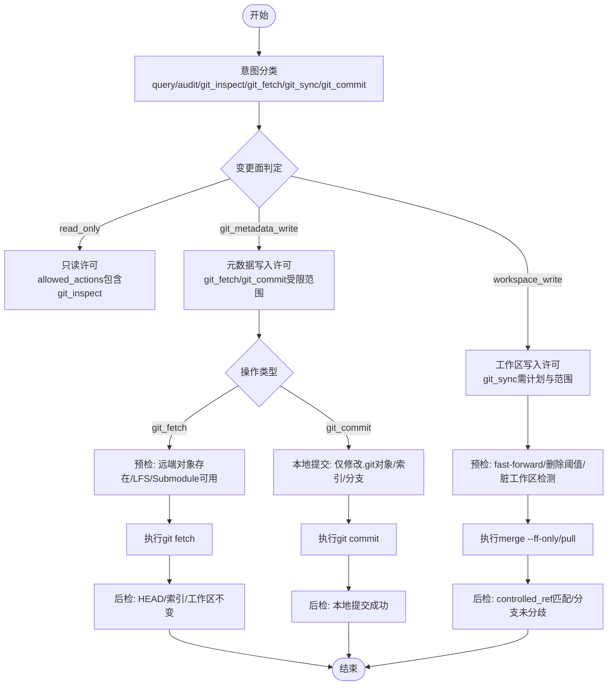
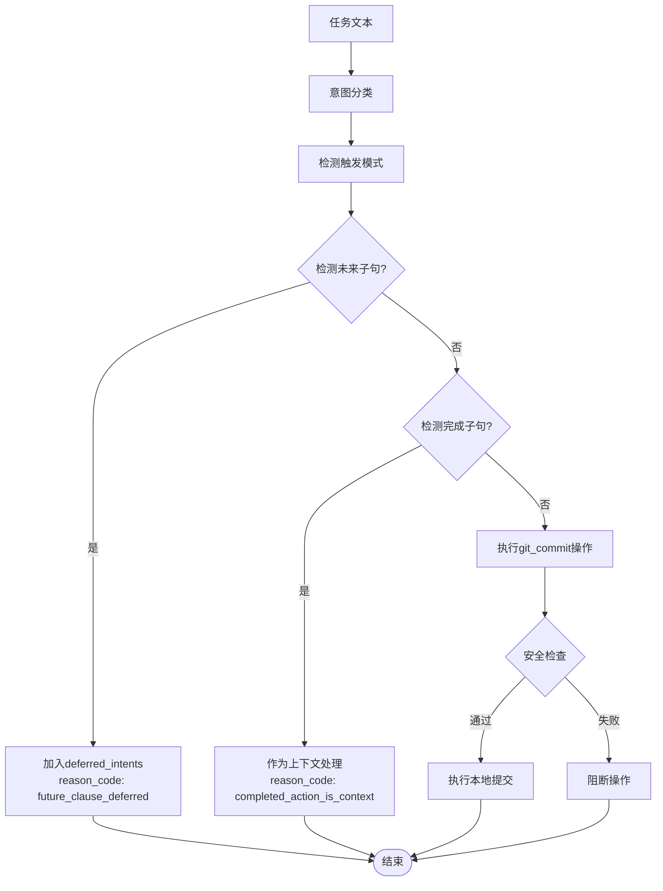
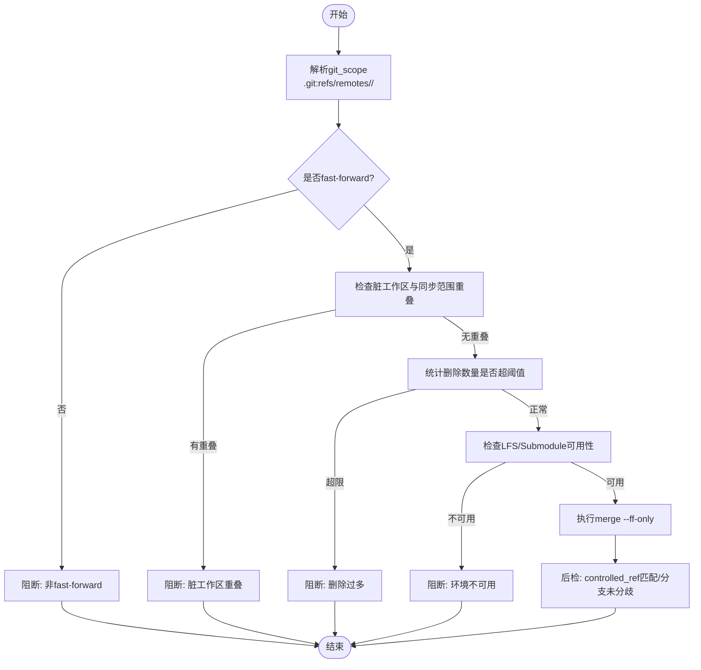
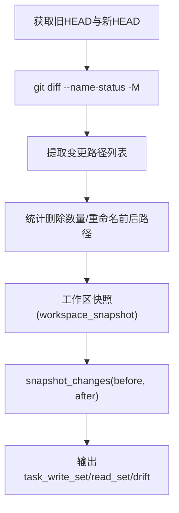
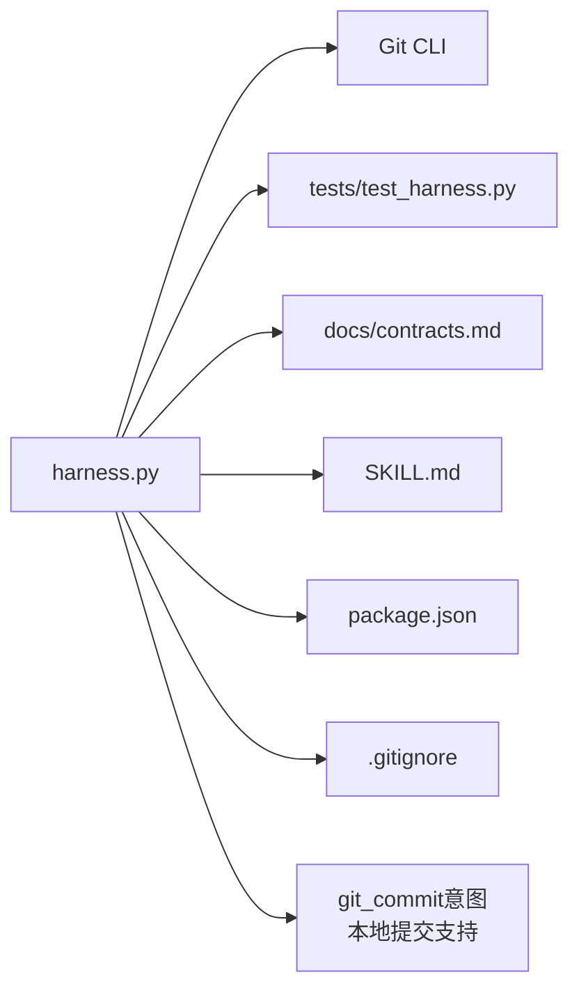

# Git集成

<cite>
**本文引用的文件**
- [scripts/harness.py](file://scripts/harness.py)
- [tests/test_harness.py](file://tests/test_harness.py)
- [docs/contracts.md](file://docs/contracts.md)
- [SKILL.md](file://SKILL.md)
- [package.json](file://package.json)
- [.gitignore](file://.gitignore)
</cite>

## 更新摘要
**所做更改**
- 新增git_commit意图支持的详细文档
- 更新意图分类与变更面映射表
- 增强触发模式识别机制说明
- 完善未来/完成子句处理逻辑
- 补充本地Git操作的安全边界说明

## 目录
1. [简介](#简介)
2. [项目结构](#项目结构)
3. [核心组件](#核心组件)
4. [架构总览](#架构总览)
5. [详细组件分析](#详细组件分析)
6. [依赖关系分析](#依赖关系分析)
7. [性能考量](#性能考量)
8. [故障排查指南](#故障排查指南)
9. [结论](#结论)
10. [附录](#附录)

## 简介
本文件面向Docs Harness的Git集成，系统性阐述其安全机制、分支管理策略、版本控制高级功能、工作区同步机制与错误处理，并给出配置最佳实践与集成示例。内容基于源码与契约文档进行提炼，确保读者既能理解整体设计，也能落地实施。

**更新** 新增了git_commit意图支持，用于处理本地Git操作，包括对.git对象、索引和分支引用的修改，但不影响工作目录或远程仓库。

## 项目结构
- 控制器入口：scripts/harness.py（Python脚本）
- 测试套件：tests/test_harness.py（覆盖Git fetch/sync/inspect/git_commit等关键路径）
- 契约与行为约定：docs/contracts.md（Git状态合同、漂移归因、验收层等）
- 技能说明：SKILL.md（任务入口、verify处置、自动归因等）
- 包元数据：package.json（脚本与自测命令）
- 忽略规则：.gitignore（运行时目录不进入版本控制）

```mermaid
graph TB
A["用户/宿主"] --> B["CLI: harness.py"]
B --> C["Git子进程封装<br/>git_command()"]
B --> D["预检/后检<br/>git_preflight_contract()<br/>git_postcheck()"]
B --> E["工作区快照/差异<br/>workspace_snapshot()<br/>snapshot_changes()"]
B --> F["运行态目录<br/>.docs-harness / <git-dir>/docs-harness"]
G["远程仓库"] <- --> C
H["本地Git仓库"] <- --> C
I["git_commit意图<br/>本地提交操作"] --> H
```

图表来源
- [scripts/harness.py:572-583](file://scripts/harness.py#L572-L583)
- [scripts/harness.py:677-791](file://scripts/harness.py#L677-L791)
- [scripts/harness.py:793-875](file://scripts/harness.py#L793-L875)
- [scripts/harness.py:1112-1136](file://scripts/harness.py#L1112-L1136)
- [scripts/harness.py:1138-1139](file://scripts/harness.py#L1138-L1139)

章节来源
- [package.json:17-21](file://package.json#L17-L21)
- [.gitignore:1-10](file://.gitignore#L1-L10)

## 核心组件
- Git子进程封装：统一调用git命令，设置超时与错误码，避免阻塞与泄露敏感信息。
- 预检合同（preflight）：在git_fetch/git_sync前冻结目标OID、索引树、工作区指纹、受控ref命名空间、LFS/Submodule可用性、删除数量阈值、fast-forward能力等。
- 后检校验（postcheck）：对比远端目标是否漂移、受控ref是否越界、HEAD/索引/工作区是否变化，区分fetch与sync的不同通过条件。
- 工作区快照与差异：按Git工作树或全量扫描生成指纹；大文件使用大小+时间戳摘要；支持增量差异计算。
- 意图与变更面映射：将任务意图映射到read_only/git_metadata_write/workspace_write/external_write四类变更面，决定准入与Gate。
- 证据与验证：evidence-receipt/v2绑定task/target/package指纹，支持命令缓存与逐项收据复用。

**更新** 新增git_commit意图，使用git_metadata_write变更面，专门处理本地Git提交操作。

章节来源
- [scripts/harness.py:572-583](file://scripts/harness.py#L572-L583)
- [scripts/harness.py:677-791](file://scripts/harness.py#L677-L791)
- [scripts/harness.py:793-875](file://scripts/harness.py#L793-L875)
- [scripts/harness.py:1112-1136](file://scripts/harness.py#L1112-L1136)
- [scripts/harness.py:1138-1139](file://scripts/harness.py#L1138-L1139)
- [docs/contracts.md:97-133](file://docs/contracts.md#L97-L133)
- [docs/contracts.md:165-197](file://docs/contracts.md#L165-L197)

## 架构总览
下图展示从用户输入到Git操作执行与校验的关键流程，以及"只读/元数据写入/工作区写入"三类合同的边界。



图表来源
- [scripts/harness.py:677-791](file://scripts/harness.py#L677-L791)
- [scripts/harness.py:793-875](file://scripts/harness.py#L793-L875)
- [docs/contracts.md:97-133](file://docs/contracts.md#L97-L133)
- [SKILL.md:53-56](file://SKILL.md#L53-L56)

## 详细组件分析

### 安全机制与合同分离（只读/元数据写入/工作区写入）
- 只读（read_only）：query/audit/git_inspect不产生工作区变更，仅允许读取历史、引用与diff。
- 元数据写入（git_metadata_write）：git_fetch仅允许声明的远端refs/objects变化，HEAD、索引与工作区必须保持不变；**新增** git_commit仅允许本地.git对象、索引和分支引用修改，不影响工作目录或远程仓库。
- 工作区写入（workspace_write）：git_sync需绑定单一预检OID，自动生成新增/修改/删除/重命名范围，且要求fast-forward与无脏工作区重叠。



图表来源
- [scripts/harness.py:206-231](file://scripts/harness.py#L206-L231)
- [scripts/harness.py:677-791](file://scripts/harness.py#L677-L791)
- [scripts/harness.py:793-875](file://scripts/harness.py#L793-L875)
- [docs/contracts.md:97-133](file://docs/contracts.md#L97-L133)

章节来源
- [scripts/harness.py:206-231](file://scripts/harness.py#L206-L231)
- [docs/contracts.md:97-133](file://docs/contracts.md#L97-L133)

### 意图分类与触发模式
**更新** 新增git_commit意图的详细触发模式和支持的未来/完成子句处理。

- **git_commit触发模式**：支持"git commit"、"commit"、"本地提交"、"提交改动"、"提交代码"、"提交当前"、"提交工作区"、"提交暂存"等关键词
- **未来子句处理**：当检测到"后续"、"以后"、"后面"、"另行"、"单独"、"另开任务"、"下一任务"等标记时，git_commit意图被延迟到deferred_intents中
- **完成子句处理**：当检测到"已经"、"此前"、"上次"、"曾经"、"已完成"等标记时，git_commit意图作为上下文处理，不执行实际提交
- **安全边界**：git_commit意图默认动作包含read和git_commit，不包含git_fetch授权，也不触发远端交付层



图表来源
- [scripts/harness.py:2530-2604](file://scripts/harness.py#L2530-L2604)
- [tests/test_harness.py:7742-7761](file://tests/test_harness.py#L7742-L7761)

章节来源
- [scripts/harness.py:227-236](file://scripts/harness.py#L227-L236)
- [scripts/harness.py:2530-2604](file://scripts/harness.py#L2530-L2604)
- [tests/test_harness.py:7691-7761](file://tests/test_harness.py#L7691-L7761)

### 分支管理策略（命名约定/合并策略/冲突解决）
- 分支命名约定：git_scope采用".git:refs/remotes/<remote>/<branch>"，支持通配符用于fetch，但git_sync必须绑定单一远端分支。
- 合并策略：强制fast-forward；非fast-forward直接阻断；若存在分歧则失败关闭。
- 冲突解决：脏工作区与同步范围重叠时阻断；删除数量超过阈值阻断；LFS/Submodule不可用时阻断。



图表来源
- [scripts/harness.py:661-675](file://scripts/harness.py#L661-L675)
- [scripts/harness.py:706-751](file://scripts/harness.py#L706-L751)
- [scripts/harness.py:793-875](file://scripts/harness.py#L793-L875)

章节来源
- [scripts/harness.py:661-675](file://scripts/harness.py#L661-L675)
- [scripts/harness.py:706-751](file://scripts/harness.py#L706-L751)
- [scripts/harness.py:793-875](file://scripts/harness.py#L793-L875)

### 版本控制集成的高级功能（提交钩子/标签管理/远程仓库同步）
- 提交钩子：控制器不自动触发git hook；如需钩子参与，需在宿主侧编排并在证据中提供证明。
- 标签管理：控制器不直接创建/更新标签；可通过git_inspect查询标签状态，作为审计依据。
- 远程仓库同步：git_fetch仅拉取远端引用与对象；git_sync在预检通过后执行fast-forward合并，并自动归因已落盘文件。
- **新增** 本地提交：git_commit仅修改本地.git对象、索引和分支引用，不触达远程仓库，适合本地开发工作流。

章节来源
- [docs/contracts.md:97-133](file://docs/contracts.md#L97-L133)
- [SKILL.md:53-56](file://SKILL.md#L53-L56)

### 工作区同步机制（增量同步/差异检测/状态保持）
- 增量同步：通过git diff --name-status -M计算变更清单，生成git_sync_scope；后续漂移累积至git_sync_landed_scope并入write_scope。
- 差异检测：对HEAD与目标OID进行差异比对，统计新增/修改/删除/重命名路径；大文件使用大小+时间戳摘要降低IO成本。
- 状态保持：首次任务基线freeze.json.workspace_snapshot固定，重新准入不刷新；verify输出task_write_set/read_set/concurrent_drift/unattributed_drift。



图表来源
- [scripts/harness.py:645-659](file://scripts/harness.py#L645-L659)
- [scripts/harness.py:1112-1136](file://scripts/harness.py#L1112-L1136)
- [scripts/harness.py:1138-1139](file://scripts/harness.py#L1138-L1139)
- [docs/contracts.md:134-163](file://docs/contracts.md#L134-L163)

章节来源
- [scripts/harness.py:645-659](file://scripts/harness.py#L645-L659)
- [scripts/harness.py:1112-1136](file://scripts/harness.py#L1112-L1136)
- [scripts/harness.py:1138-1139](file://scripts/harness.py#L1138-L1139)
- [docs/contracts.md:134-163](file://docs/contracts.md#L134-L163)

### Git操作的错误处理（网络异常/权限问题/冲突解决）
- 网络异常：git_remote_unavailable、git_remote_ref_missing等返回特定reason_code，支持重试。
- 权限问题：git_preflight_failed、index不可读等导致失败关闭。
- 冲突解决：dirty_overlap、non_fast_forward、deletion_threshold、lfs/submodule不可用均阻断并给出明确原因。
- **新增** git_commit错误：本地提交失败时返回相应的错误码和修复建议。

章节来源
- [scripts/harness.py:625-643](file://scripts/harness.py#L625-L643)
- [scripts/harness.py:706-751](file://scripts/harness.py#L706-L751)
- [scripts/harness.py:793-875](file://scripts/harness.py#L793-L875)

### 配置最佳实践（安全设置/性能优化/故障排除）
- 安全设置：
  - 使用sanitized_remote_fingerprint去除用户名、密码、token、查询参数与fragment。
  - 限制rules_root为项目内相对路径，禁止越界与符号链接。
- 性能优化：
  - verification.command_cache_enabled默认开启，可按需关闭。
  - auto_attribute_in_scope默认开启，减少人工补证开销。
  - 大文件快照使用大小+时间戳摘要，避免全量哈希。
- 故障排除：
  - 查看events.jsonl定位verify轮次与失败原因。
  - 检查.gitattributes/.gitmodules确认LFS/Submodule状态。
  - 使用git_ignored_install_paths判断安装文件是否被忽略。
- **新增** git_commit配置：
  - 确保工作区干净后再执行git_commit
  - 使用适当的提交消息格式
  - 避免在CI环境中执行本地提交

章节来源
- [scripts/harness.py:585-596](file://scripts/harness.py#L585-596)
- [scripts/harness.py:1188-1214](file://scripts/harness.py#L1188-L1214)
- [scripts/harness.py:1112-1136](file://scripts/harness.py#L1112-L1136)
- [scripts/harness.py:878-904](file://scripts/harness.py#L878-L904)

## 依赖关系分析
- harness.py依赖Git命令行工具，通过subprocess调用，所有Git操作均经过封装与超时控制。
- 测试用例覆盖fetch/sync/inspect/git_commit关键路径，确保契约行为稳定。
- 契约文档定义Git状态合同、漂移归因与验收层，指导实现与验收。



图表来源
- [scripts/harness.py:572-583](file://scripts/harness.py#L572-L583)
- [tests/test_harness.py:503-576](file://tests/test_harness.py#L503-L576)
- [docs/contracts.md:97-133](file://docs/contracts.md#L97-L133)
- [SKILL.md:53-56](file://SKILL.md#L53-L56)
- [package.json:17-21](file://package.json#L17-L21)
- [.gitignore:1-10](file://.gitignore#L1-L10)

章节来源
- [scripts/harness.py:572-583](file://scripts/harness.py#L572-L583)
- [tests/test_harness.py:503-576](file://tests/test_harness.py#L503-L576)
- [docs/contracts.md:97-133](file://docs/contracts.md#L97-L133)

## 性能考量
- 验证命令缓存：默认开启，逐项快照与收据复用，避免重复执行已通过命令。
- 工作区快照优化：大文件使用大小+时间戳摘要，减少哈希计算开销。
- 增量同步：仅计算必要差异路径，避免全仓扫描。
- 事件与遥测：每次verify写入结构化事件，便于复算与定位瓶颈。
- **新增** git_commit性能：本地提交操作快速完成，不涉及网络I/O，适合频繁提交场景。

章节来源
- [scripts/harness.py:1188-1214](file://scripts/harness.py#L1188-L1214)
- [scripts/harness.py:1112-1136](file://scripts/harness.py#L1112-L1136)
- [docs/contracts.md:134-163](file://docs/contracts.md#L134-L163)

## 故障排查指南
- 常见错误码与含义：
  - git_remote_unavailable：远端不可达或URL无效。
  - git_remote_ref_missing：目标远端引用不存在。
  - git_preflight_failed：预检失败（索引不可读、LFS/Submodule不可用）。
  - git_sync_scope_ambiguous：git_sync未绑定单一远端分支。
  - git_remote_drift：远端目标漂移，需完整重新准入。
  - git_ref_scope_violation：受控ref越界。
  - **新增** git_commit_failed：本地提交失败，检查工作区状态和提交权限。
- 排查步骤：
  - 检查.gitattributes/.gitmodules是否存在且有效。
  - 使用git status --porcelain=v1 -z查看脏工作区。
  - 查看events.jsonl定位verify轮次与失败原因。
  - 确认git_scope格式正确，git_sync绑定单一分支。
  - **新增** 对于git_commit失败，检查工作区是否有未暂存的更改。

章节来源
- [scripts/harness.py:625-643](file://scripts/harness.py#L625-L643)
- [scripts/harness.py:706-751](file://scripts/harness.py#L706-L751)
- [scripts/harness.py:793-875](file://scripts/harness.py#L793-L875)

## 结论
Docs Harness的Git集成以严格的合同分离与安全边界为核心，通过预检/后检机制确保只读、元数据写入与工作区写入的语义清晰。**新增的git_commit意图**进一步增强了本地Git操作的支持，允许安全的本地提交而不影响工作目录或远程仓库。分支管理遵循fast-forward原则，冲突与危险操作被显式阻断。工作区同步采用增量差异与快照指纹，结合验证命令缓存与事件追踪，实现高效可审计的Git操作流。配置层面强调安全与性能平衡，提供完善的故障排查指引。

## 附录
- 实际配置示例与集成场景请参考测试用例中的init_git_remote、git_fetch、git_sync、git_inspect、**新增** git_commit等断言，以及契约文档中的Git状态合同与漂移归因规范。

**更新** 新增git_commit意图的测试用例展示了本地提交的完整工作流程，包括意图识别、安全边界验证和未来/完成子句处理。

章节来源
- [tests/test_harness.py:503-576](file://tests/test_harness.py#L503-L576)
- [tests/test_harness.py:7691-7761](file://tests/test_harness.py#L7691-L7761)
- [docs/contracts.md:97-133](file://docs/contracts.md#L97-L133)