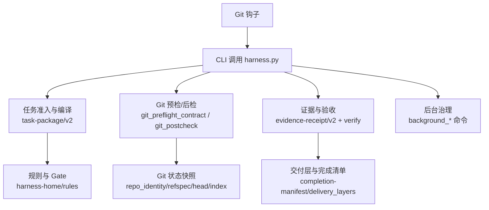
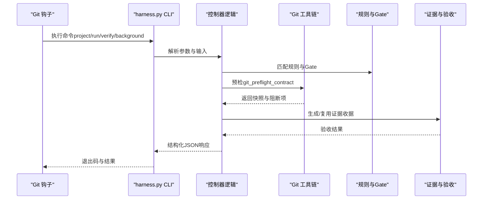
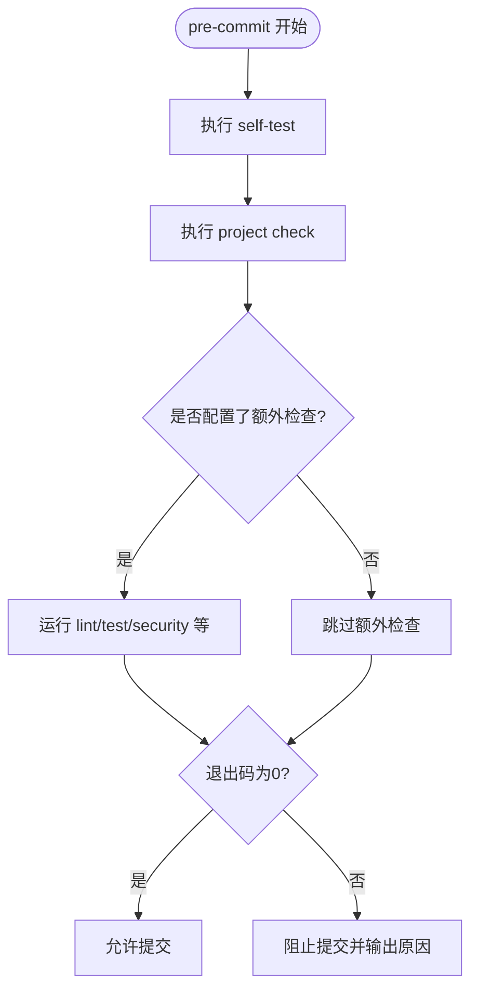
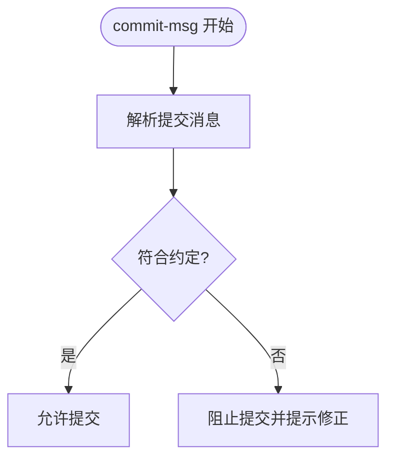
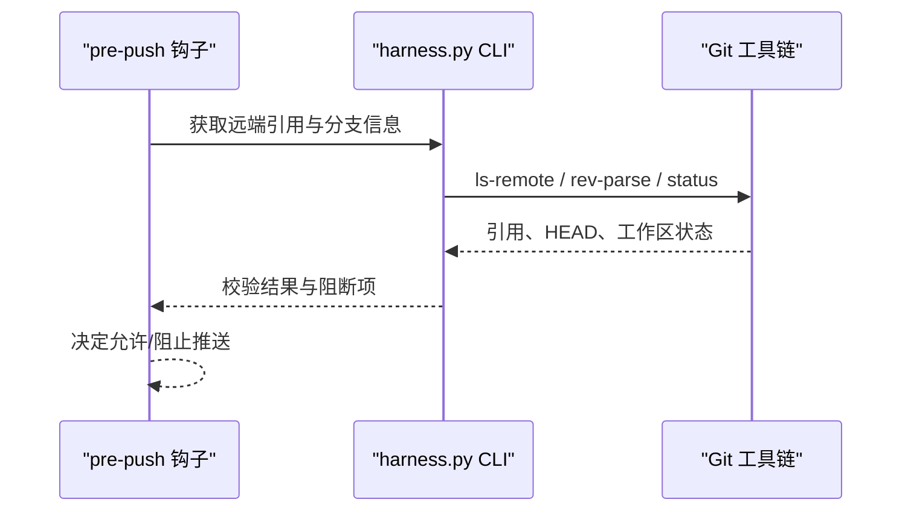
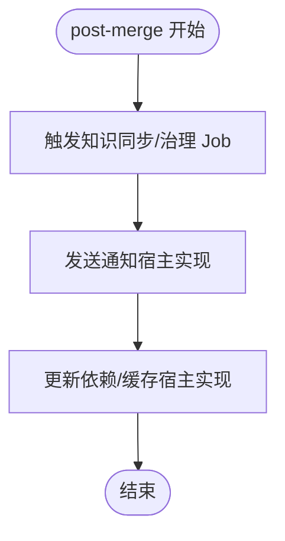
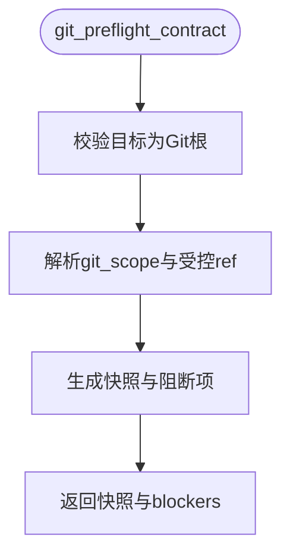
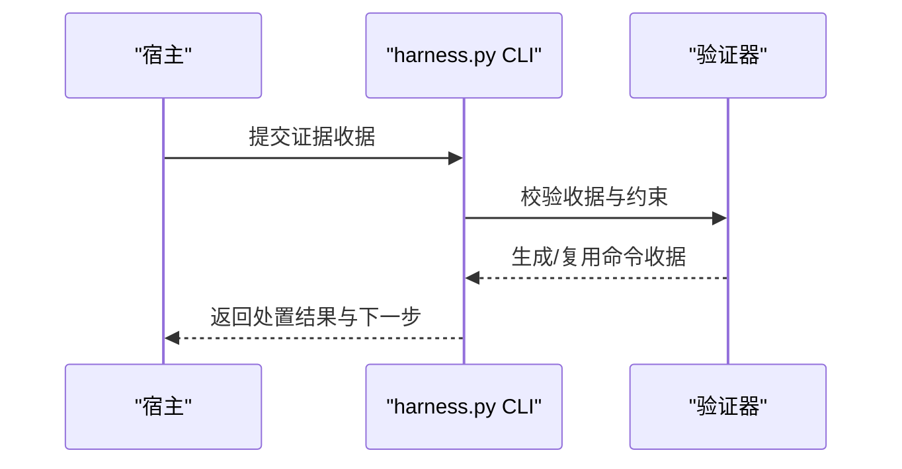
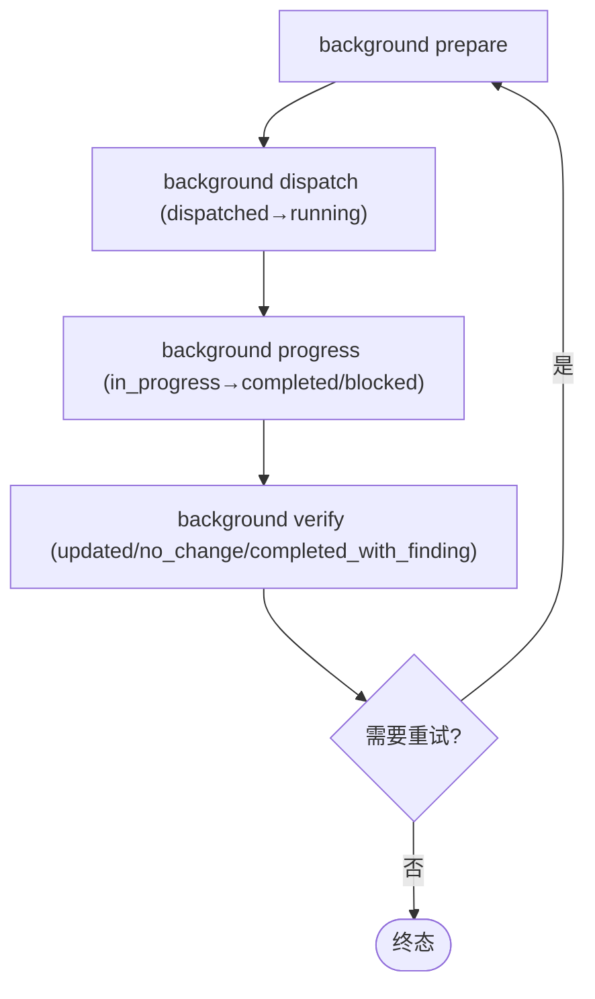
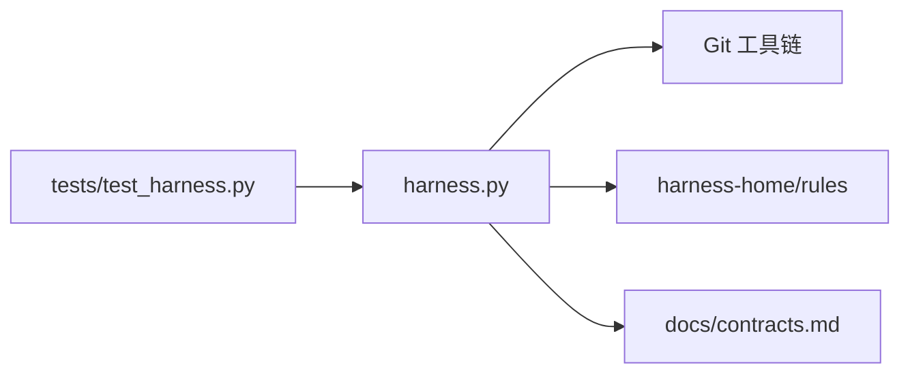

# Git钩子集成

<cite>
**本文档引用的文件**   
- [scripts/harness.py](file://scripts/harness.py)
- [package.json](file://package.json)
- [SKILL.md](file://SKILL.md)
- [docs/contracts.md](file://docs/contracts.md)
- [harness-home/rules/INDEX.md](file://harness-home/rules/INDEX.md)
- [tests/test_harness.py](file://tests/test_harness.py)
</cite>

## 目录
1. [简介](#简介)
2. [项目结构](#项目结构)
3. [核心组件](#核心组件)
4. [架构总览](#架构总览)
5. [详细组件分析](#详细组件分析)
6. [依赖关系分析](#依赖关系分析)
7. [性能考量](#性能考量)
8. [故障排查指南](#故障排查指南)
9. [结论](#结论)
10. [附录](#附录)

## 简介
本文件面向在项目中集成 Docs Harness 的 Git 钩子（pre-commit、commit-msg、pre-push、post-merge）的使用与实现，说明如何通过 CLI 命令驱动提交前检查、合并后处理与推送验证。内容涵盖：
- 提交前检查：代码质量、文档校验与安全扫描
- 合并后处理：状态同步、通知发送与依赖更新
- 推送验证：权限检查、分支保护与合规性验证
- 错误处理与日志记录
- 安装、配置与调试方法
- 自定义钩子的开发指南与最佳实践

Docs Harness 本身不自动提交、推送或发布，也不修改 .gitignore；它通过 CLI 提供可组合的能力，由宿主在 Git 钩子中调用以实现自动化流程。

**章节来源**
- [SKILL.md:13-25](file://SKILL.md#L13-L25)
- [docs/contracts.md:1-10](file://docs/contracts.md#L1-L10)

## 项目结构
仓库包含控制器脚本、合同与规则、测试以及元数据等关键部分：
- scripts/harness.py：主控制器，提供 project/run/verify/background 等能力
- package.json：包元信息与脚本入口（self-test、pack:check）
- SKILL.md：安装与任务入口说明
- docs/contracts.md：契约定义（任务包、证据、Git 状态、退出码等）
- harness-home/rules/INDEX.md：生效规则清单与加载约定
- tests/test_harness.py：覆盖 Git fetch/sync、漂移、预检/后检等场景

**图表来源**
- [scripts/harness.py:680-794](file://scripts/harness.py#L680-L794)
- [docs/contracts.md:97-133](file://docs/contracts.md#L97-L133)
- [harness-home/rules/INDEX.md:1-41](file://harness-home/rules/INDEX.md#L1-L41)

**章节来源**
- [package.json:17-22](file://package.json#L17-L22)
- [SKILL.md:26-44](file://SKILL.md#L26-L44)
- [docs/contracts.md:9-48](file://docs/contracts.md#L9-L48)

## 核心组件
- 控制器与 CLI：提供 project/init、run、verify、background、self-test 等命令
- 任务包与准入：基于 task-package/v2 描述意图、变更面、范围、Gate 与允许动作
- Git 状态合同：git_fetch/git_sync 绑定 git_state_snapshot，支持预检与后检
- 证据与验收：evidence-receipt/v2 与 verification-command-receipt/v1 支撑可审计验收
- 规则与 Gate：按关键词与路径匹配，安全底线 Gate 强制兜底
- 后台治理：background_* 命令管理异步 Job，独立于父任务完成状态

**章节来源**
- [SKILL.md:26-58](file://SKILL.md#L26-L58)
- [docs/contracts.md:9-48](file://docs/contracts.md#L9-L48)
- [docs/contracts.md:97-133](file://docs/contracts.md#L97-L133)
- [docs/contracts.md:165-221](file://docs/contracts.md#L165-L221)
- [harness-home/rules/INDEX.md:1-41](file://harness-home/rules/INDEX.md#L1-L41)

## 架构总览
下图展示 Git 钩子与 Docs Harness 的交互流程：钩子调用 CLI，控制器进行任务准入、Git 预检/后检、证据验收与后台治理。

**图表来源**
- [scripts/harness.py:680-794](file://scripts/harness.py#L680-L794)
- [docs/contracts.md:97-133](file://docs/contracts.md#L97-L133)
- [docs/contracts.md:165-221](file://docs/contracts.md#L165-L221)

## 详细组件分析

### 提交前检查（pre-commit）
目标：在提交前执行代码质量检查、文档验证与安全扫描，确保变更符合规则与 Gate。

- 典型步骤
  - 运行自检与规则检查：使用 self-test 确认控制器与规则可用
  - 运行项目检查：project check 检测缺失规则、配置无效等问题
  - 可选：运行 lint/test 等外部工具（由宿主在钩子中编排）
- 失败关闭策略
  - 规则指纹变化、缺失或配置无效将导致失败关闭
  - 非零退出码表示失败，钩子应阻止提交

**图表来源**
- [package.json:17-22](file://package.json#L17-L22)
- [harness-home/rules/INDEX.md:34-41](file://harness-home/rules/INDEX.md#L34-L41)

**章节来源**
- [package.json:17-22](file://package.json#L17-L22)
- [harness-home/rules/INDEX.md:1-41](file://harness-home/rules/INDEX.md#L1-L41)

### 提交消息校验（commit-msg）
目标：校验提交消息是否符合约定（如语义化、长度限制、关键字），必要时拒绝提交。

- 建议做法
  - 在 commit-msg 钩子中解析提交消息，结合项目规范进行校验
  - 若需要，可调用 harness.py 的只读查询（如 git_inspect）辅助判断上下文
- 失败关闭策略
  - 不符合约定的消息直接阻止提交

[本节为概念性流程，不直接分析具体文件]

### 推送验证（pre-push）
目标：在推送前进行权限检查、分支保护与合规性验证，避免非法推送。

- 典型步骤
  - 读取远端引用与当前分支，确认推送目标合法
  - 执行 preflight 检查（如 fast-forward、删除数量阈值、LFS/Submodule 可用性）
  - 根据 Gate 与规则判定是否允许推送
- 失败关闭策略
  - 远端不可用、ref 越界、非 fast-forward、危险删除等均失败关闭

**图表来源**
- [scripts/harness.py:628-646](file://scripts/harness.py#L628-L646)
- [scripts/harness.py:680-794](file://scripts/harness.py#L680-L794)

**章节来源**
- [docs/contracts.md:97-133](file://docs/contracts.md#L97-L133)
- [scripts/harness.py:628-646](file://scripts/harness.py#L628-L646)
- [scripts/harness.py:680-794](file://scripts/harness.py#L680-L794)

### 合并后处理（post-merge）
目标：在合并后执行状态同步、通知发送与依赖更新，确保仓库状态一致。

- 典型步骤
  - 触发知识增量同步或文档治理 Job（background_* 命令）
  - 发送通知（由宿主实现）
  - 更新依赖或构建缓存（由宿主实现）
- 失败关闭策略
  - 后台 Job 失败或需用户输入时，进入 queued_manual 或 needs_user_input

[本节为概念性流程，不直接分析具体文件]

### Git 预检与后检
- 预检（git_preflight_contract）
  - 校验目标是否为独立 Git 根目录
  - 解析 git_scope，确定受控远端与分支
  - 计算快照（repo_identity、head、index_tree、worktree_fingerprint 等）
  - 检查 LFS/Submodule 可用性、脏工作区、删除数量阈值、fast-forward 条件
- 后检（git_postcheck）
  - 对比实际执行后的 Git 状态与快照
  - 校验 ref 变化是否在受控范围内，记录 changed_refs 与 outside_refs

**图表来源**
- [scripts/harness.py:680-794](file://scripts/harness.py#L680-L794)

**章节来源**
- [scripts/harness.py:680-794](file://scripts/harness.py#L680-L794)

### 证据与验收
- 证据收据（evidence-receipt/v2）
  - 绑定 task_id、target_identity、package_fingerprint、producer、时间戳、exit_code、digests、read_set/write_set
  - 高风险证据必须来自可信 v2 生产者
- 验证命令收据（verification-command-receipt/v1）
  - 按 argv、produces 与输入指纹绑定，支持缓存命中与重跑
- 五级处置
  - provide_evidence、refresh_evidence、retry_verification、incremental_admission、full_readmission

**图表来源**
- [docs/contracts.md:165-221](file://docs/contracts.md#L165-L221)

**章节来源**
- [docs/contracts.md:165-221](file://docs/contracts.md#L165-L221)

### 后台治理
- 命令族：background list/status/prepare/dispatch/progress/verify/retry
- 路线：background_direct、background_goal、background_goal_phased
- 不变量：may_mutate_parent=false、may_spawn_child_jobs=false、suppress_post_completion_dispatch=true

**图表来源**
- [SKILL.md:60-86](file://SKILL.md#L60-L86)

**章节来源**
- [SKILL.md:60-86](file://SKILL.md#L60-L86)

## 依赖关系分析
- 控制器依赖 Git 工具链进行状态读取与操作
- 规则与 Gate 由 harness-home/rules 提供，安装时复制快照并校验指纹
- 测试用例覆盖 Git fetch/sync、漂移、预检/后检等关键路径

**图表来源**
- [scripts/harness.py:680-794](file://scripts/harness.py#L680-L794)
- [harness-home/rules/INDEX.md:1-41](file://harness-home/rules/INDEX.md#L1-L41)
- [tests/test_harness.py:503-757](file://tests/test_harness.py#L503-L757)

**章节来源**
- [tests/test_harness.py:503-757](file://tests/test_harness.py#L503-L757)

## 性能考量
- 预检与后检尽量使用只读命令与最小化 diff，减少 IO
- 证据与命令收据缓存命中可避免重复执行
- 后台 Job 串行合并公共层与知识地图，降低并发冲突
- 大仓库注意删除数量阈值与 LFS/Submodule 可用性检查的成本

[本节为通用指导，不直接分析具体文件]

## 故障排查指南
- 常见退出码
  - 0：成功；verify.result=完成表示父任务完成
  - 1：项目检查、自检或完整性读取失败
  - 2：输入、合同、绑定或状态无效
  - 3：需要方案、授权、证据、迁移、用户输入或 Git 交付
  - 4：范围、漂移、Gate、远端、授权或规则变化，必须重新准入
- 常见问题定位
  - 规则缺失或指纹变化：检查 harness-home/rules 快照与 INDEX.md
  - Git 预检失败：查看 blockers（脏工作区、非 fast-forward、LFS/Submodule 不可用）
  - 证据未归因：启用 auto_attribute_in_scope 或手动补证据
  - 后台 Job 失败：查看 attempt 与工件，必要时 repair 并重试

**章节来源**
- [docs/contracts.md:361-372](file://docs/contracts.md#L361-L372)
- [scripts/harness.py:680-794](file://scripts/harness.py#L680-L794)
- [harness-home/rules/INDEX.md:34-41](file://harness-home/rules/INDEX.md#L34-L41)

## 结论
通过将 Docs Harness 的 CLI 嵌入 Git 钩子，可实现从提交前检查到推送验证与合并后处理的完整流水线。控制器提供严格的准入、Git 状态合同、证据验收与后台治理能力，配合规则与 Gate 确保安全与合规。建议在钩子中遵循失败关闭策略，合理编排外部工具，并利用缓存与收据提升效率。

[本节为总结，不直接分析具体文件]

## 附录

### 钩子安装与配置
- 在项目根目录创建 .git/hooks 下的钩子脚本（如 pre-commit、commit-msg、pre-push、post-merge）
- 在钩子中调用 harness.py 的命令（如 self-test、project check、background_*）
- 根据退出码决定是否允许提交/推送或继续后续步骤

**章节来源**
- [SKILL.md:13-25](file://SKILL.md#L13-L25)
- [package.json:17-22](file://package.json#L17-L22)

### 调试方法
- 使用 --json 参数获取结构化输出，便于解析与日志记录
- 逐步执行命令（如 run、verify、background prepare）观察中间状态
- 利用测试用例中的模式模拟 Git 环境与漂移场景

**章节来源**
- [tests/test_harness.py:59-87](file://tests/test_harness.py#L59-L87)

### 自定义钩子开发指南与最佳实践
- 保持幂等：同一输入多次执行应得到相同结果
- 最小权限：仅请求必要的 Git 范围与写权限
- 明确失败关闭：任何异常都应返回非零退出码并记录原因
- 分离关注点：钩子仅负责编排，业务逻辑由 harness.py 与宿主实现
- 记录关键事件：将重要步骤写入日志或事件流，便于审计与回溯

[本节为通用指导，不直接分析具体文件]