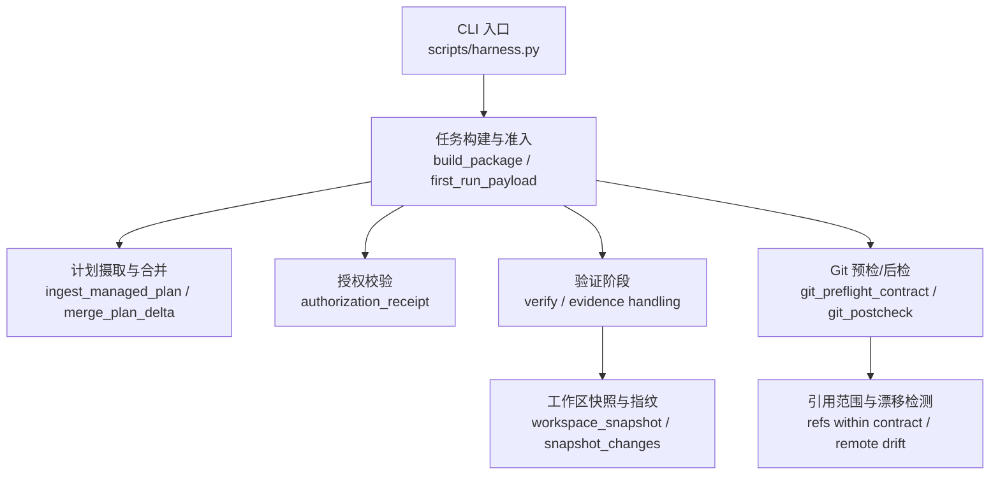
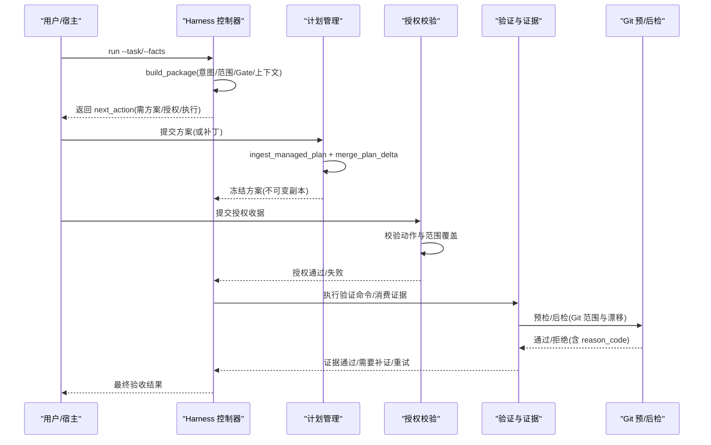
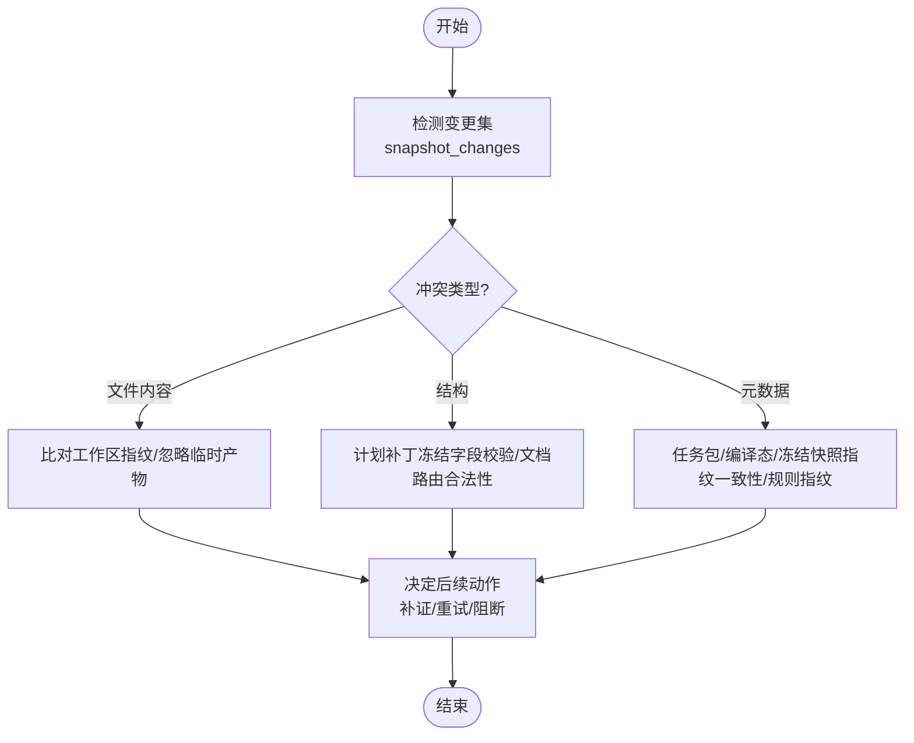
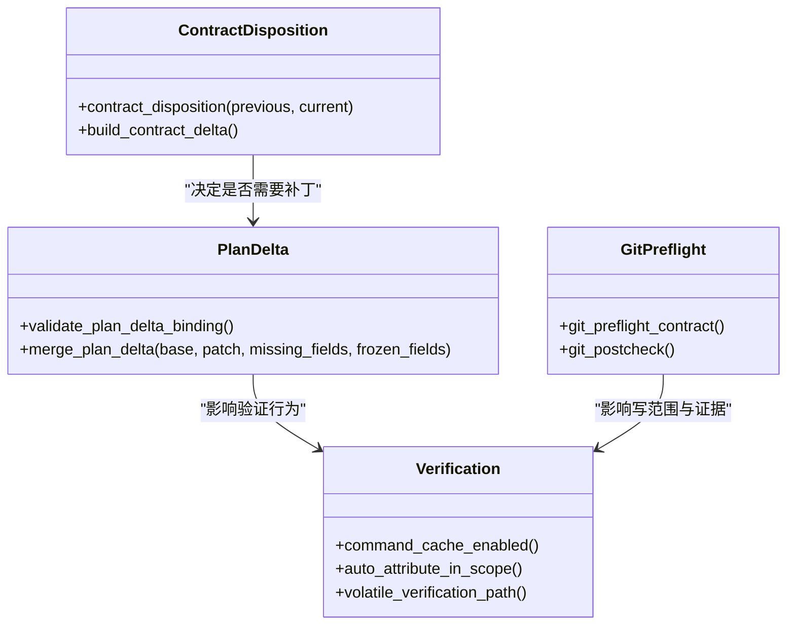
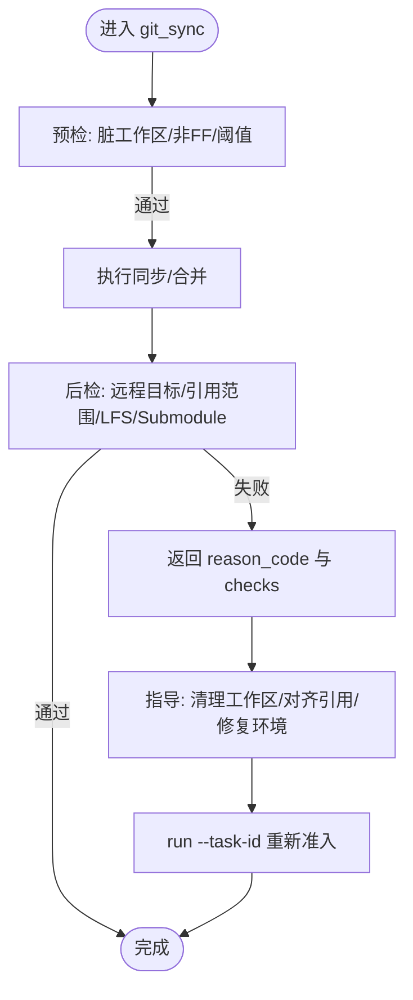
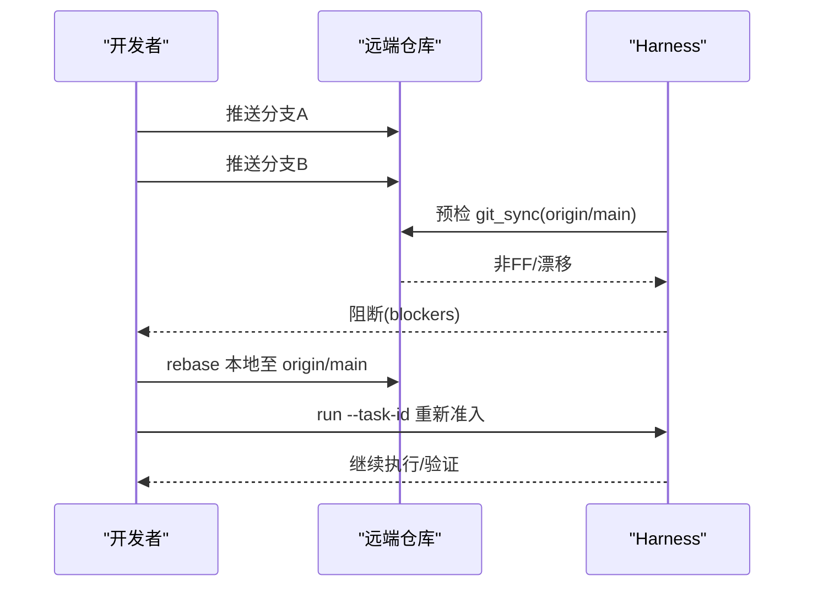
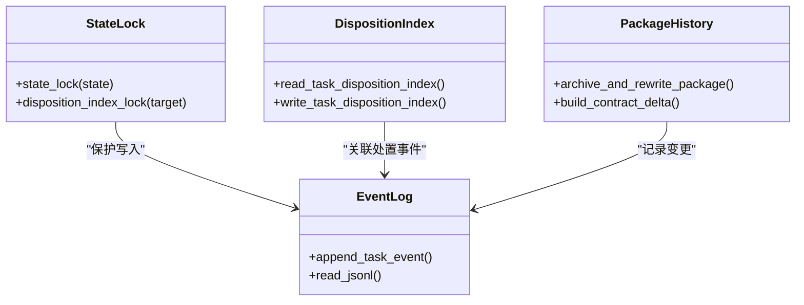
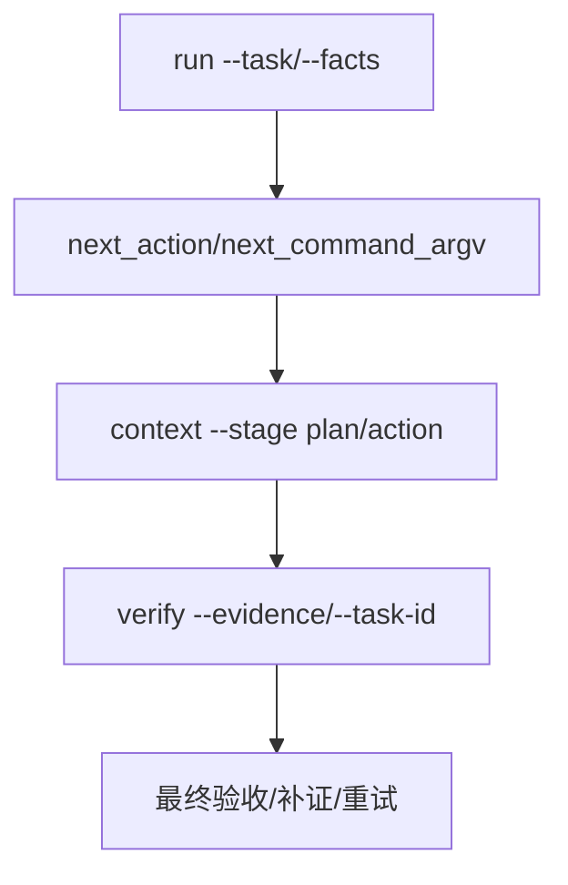
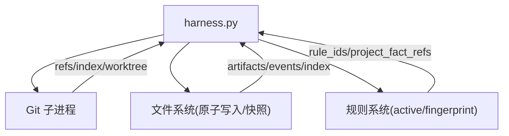

# 冲突解决机制

<cite>
**本文引用的文件**   
- [scripts/harness.py](file://scripts/harness.py)
- [tests/test_harness.py](file://tests/test_harness.py)
- [package.json](file://package.json)
- [SKILL.md](file://SKILL.md)
</cite>

## 目录
1. [简介](#简介)
2. [项目结构](#项目结构)
3. [核心组件](#核心组件)
4. [架构总览](#架构总览)
5. [详细组件分析](#详细组件分析)
6. [依赖关系分析](#依赖关系分析)
7. [性能考量](#性能考量)
8. [故障排查指南](#故障排查指南)
9. [结论](#结论)
10. [附录](#附录)

## 简介
本文件系统化阐述 Docs Harness 的冲突解决机制，覆盖自动冲突检测与分类（文件内容、结构、元数据）、解决策略（基于规则的自动解决、用户干预流程、优先级处理）、Git 冲突标记解析与手动编辑指导、复杂冲突场景（多分支并行导致的连锁冲突）以及状态跟踪与审计记录。同时提供 API 与 CLI 使用方式、常见冲突模式与预防措施，帮助读者在真实协作中高效化解冲突。

## 项目结构
Docs Harness 以独立 Python 控制器为核心，围绕任务包、编译态、冻结快照、事件日志与证据索引等工件组织运行态。冲突相关能力贯穿任务准入、方案合并、授权校验、验证阶段与 Git 预/后检查等环节。

**图表来源** 
- [scripts/harness.py:2779-3075](file://scripts/harness.py#L2779-L3075)
- [scripts/harness.py:4037-4160](file://scripts/harness.py#L4037-L4160)
- [scripts/harness.py:4446-4495](file://scripts/harness.py#L4446-L4495)
- [scripts/harness.py:680-878](file://scripts/harness.py#L680-L878)
- [scripts/harness.py:1115-1142](file://scripts/harness.py#L1115-L1142)

**章节来源**
- [scripts/harness.py:2779-3075](file://scripts/harness.py#L2779-L3075)
- [package.json:1-23](file://package.json#L1-L23)
- [SKILL.md:1-106](file://SKILL.md#L1-L106)

## 核心组件
- 任务包与编译态：承载意图、范围、Gate、上下文调度、完成清单等；通过指纹与版本控制变更。
- 受管计划与补丁：将方案不可变存储，支持仅补齐缺失字段与冻结字段保护。
- 授权收据：校验动作与范围是否覆盖任务包要求。
- 验证与证据：按完成清单执行命令、生成证据并缓存复用。
- Git 预检/后检：锁定同步目标、限制引用范围、检测远端漂移与工作区一致性。
- 状态锁与事件日志：保证并发安全与可审计性。

**章节来源**
- [scripts/harness.py:3229-3262](file://scripts/harness.py#L3229-L3262)
- [scripts/harness.py:4037-4160](file://scripts/harness.py#L4037-L4160)
- [scripts/harness.py:4446-4495](file://scripts/harness.py#L4446-L4495)
- [scripts/harness.py:680-878](file://scripts/harness.py#L680-L878)
- [scripts/harness.py:1011-1032](file://scripts/harness.py#L1011-L1032)
- [scripts/harness.py:1034-1074](file://scripts/harness.py#L1034-L1074)

## 架构总览
下图展示从“任务提交”到“验证完成”的关键路径，以及冲突检测与解决的介入点。

**图表来源** 
- [scripts/harness.py:2779-3075](file://scripts/harness.py#L2779-L3075)
- [scripts/harness.py:4037-4160](file://scripts/harness.py#L4037-L4160)
- [scripts/harness.py:4446-4495](file://scripts/harness.py#L4446-L4495)
- [scripts/harness.py:680-878](file://scripts/harness.py#L680-L878)

## 详细组件分析

### 自动冲突检测与分类
- 文件内容冲突
  - 工作区快照与指纹对比：通过 workspace_snapshot 与 snapshot_changes 识别新增、修改、删除的文件集合，用于归因与冲突判定。
  - 验证阶段临时产物过滤：volatile_verification_path 排除测试缓存、日志等，避免误判为写入冲突。
- 结构冲突
  - 计划补丁合并：merge_plan_delta 仅允许补齐缺失字段，禁止改写冻结字段；违反即触发 plan_delta_conflict。
  - 文档路由解析：resolve_document_routes 对显式配置与候选路径进行严格校验，非法或缺失时返回 unresolved 并列出错误。
- 元数据冲突
  - 任务包/编译态/冻结快照指纹一致性：load_state 与 archive_and_rewrite_package 确保三者一致，否则报 stale_state。
  - 规则指纹与内容一致性：rule_content 校验 active 规则指纹，变化则报 stale_rule。
  - 归档/取消幂等与冲突：task_cancel/task_archive 对重复处置原因码与源对象指纹进行强约束，防止覆盖首次处置事实。

**图表来源** 
- [scripts/harness.py:1115-1142](file://scripts/harness.py#L1115-L1142)
- [scripts/harness.py:4082-4116](file://scripts/harness.py#L4082-L4116)
- [scripts/harness.py:1403-1459](file://scripts/harness.py#L1403-L1459)
- [scripts/harness.py:3265-3280](file://scripts/harness.py#L3265-L3280)
- [scripts/harness.py:4182-4193](file://scripts/harness.py#L4182-L4193)
- [scripts/harness.py:3563-3660](file://scripts/harness.py#L3563-L3660)
- [scripts/harness.py:3663-3715](file://scripts/harness.py#L3663-L3715)

**章节来源**
- [scripts/harness.py:1115-1142](file://scripts/harness.py#L1115-L1142)
- [scripts/harness.py:4082-4116](file://scripts/harness.py#L4082-L4116)
- [scripts/harness.py:1403-1459](file://scripts/harness.py#L1403-L1459)
- [scripts/harness.py:3265-3280](file://scripts/harness.py#L3265-L3280)
- [scripts/harness.py:4182-4193](file://scripts/harness.py#L4182-L4193)
- [scripts/harness.py:3563-3660](file://scripts/harness.py#L3563-L3660)
- [scripts/harness.py:3663-3715](file://scripts/harness.py#L3663-L3715)

### 冲突解决策略
- 基于规则的自动解决
  - 计划补丁仅补齐缺失字段，冻结字段不可改；若冲突则直接拒绝并提示 plan_delta_conflict。
  - 验证命令缓存与临时产物白名单减少误冲突；必要时支持整体关闭缓存。
  - Git 预检阻止脏工作区与非 fast-forward 同步，避免引入新冲突。
- 用户干预流程
  - 当需要补充证据或重新授权时，控制器返回 next_action 与 next_command_argv，引导宿主调用 verify/run 等子命令。
  - 对于 v1→v2 迁移中断，提供恢复与回滚机制，保障状态一致性。
- 优先级处理
  - 任务意图与 mutation_profile 取最高风险等级；Gate 推断结合精确词表与否定守卫，避免误触发。
  - 合同分段处置（no_change/incremental_admission/full_readmission/evidence_only/context_only）决定最小化重准入范围。

**图表来源** 
- [scripts/harness.py:4067-4116](file://scripts/harness.py#L4067-L4116)
- [scripts/harness.py:1191-1216](file://scripts/harness.py#L1191-L1216)
- [scripts/harness.py:1219-1236](file://scripts/harness.py#L1219-L1236)
- [scripts/harness.py:680-878](file://scripts/harness.py#L680-L878)
- [scripts/harness.py:3154-3197](file://scripts/harness.py#L3154-L3197)

**章节来源**
- [scripts/harness.py:4067-4116](file://scripts/harness.py#L4067-L4116)
- [scripts/harness.py:1191-1216](file://scripts/harness.py#L1191-L1216)
- [scripts/harness.py:1219-1236](file://scripts/harness.py#L1219-L1236)
- [scripts/harness.py:680-878](file://scripts/harness.py#L680-L878)
- [scripts/harness.py:3154-3197](file://scripts/harness.py#L3154-L3197)

### Git 冲突标记解析与手动编辑指导
- 预检阶段
  - 检测脏工作区与 git_sync 变化范围重叠，直接阻断并给出 blocker 列表。
  - 非 fast-forward 目标被拒绝，提示需先 rebase/merge。
- 后检阶段
  - 校验远程目标未漂移、受控引用范围内无越界变更；否则返回 git_remote_drift 或 git_ref_scope_violation。
- 手动编辑指导
  - 遇到 git_sync 冲突时，优先对齐 HEAD 与 controlled_ref，确保只变更声明范围内的文件。
  - 清理 .gitattributes/.gitmodules 状态异常，保证 LFS/Submodule 可用。
  - 若远端漂移导致 readmission，使用 run --task-id 单命令完成重新准入并复用已冻结方案。

**图表来源** 
- [scripts/harness.py:680-878](file://scripts/harness.py#L680-L878)

**章节来源**
- [scripts/harness.py:680-878](file://scripts/harness.py#L680-L878)

### 复杂冲突场景：多分支并行开发导致的连锁冲突
- 远端漂移与 ref 越界
  - 多个分支并行推送导致 origin/main 漂移，verify 阶段检测到 git_remote_drift，需重新准入并可能触发增量 Gate。
- 工作区与同步范围重叠
  - 本地修改与远端变更路径重叠，预检直接阻断，需先整理本地改动或调整 scope。
- 连锁冲突处理建议
  - 先 fetch 最新引用，再 rebase 本地分支至远端目标，确保 fast-forward。
  - 缩小 write_scope 至必要路径，避免无关文件参与同步。
  - 使用 run --task-id 重新准入，控制器会复用已冻结方案并计算 landed_scope 自动归因。

**图表来源** 
- [scripts/harness.py:680-878](file://scripts/harness.py#L680-L878)
- [scripts/harness.py:4731-4796](file://scripts/harness.py#L4731-L4796)

**章节来源**
- [scripts/harness.py:680-878](file://scripts/harness.py#L680-L878)
- [scripts/harness.py:4731-4796](file://scripts/harness.py#L4731-L4796)

### 冲突解决的状态跟踪与审计记录
- 状态锁
  - state_lock 与 disposition_index_lock 保证并发安全，超过 5 分钟锁视为陈旧锁，需人工确认清理。
- 事件日志
  - append_task_event 记录每个阶段的 event、phase、reason_code、duration_ms 等，形成完整审计链。
- 处置索引
  - task_disposition_index 维护归档/取消等处置记录，支持幂等与冲突检测（如 task_archive_conflict）。
- 包历史与契约差异
  - package-history 保存每次重写前的包与冻结快照，contract-delta 记录变更细节，便于回溯。

**图表来源** 
- [scripts/harness.py:1011-1032](file://scripts/harness.py#L1011-L1032)
- [scripts/harness.py:1034-1074](file://scripts/harness.py#L1034-L1074)
- [scripts/harness.py:3497-3531](file://scripts/harness.py#L3497-L3531)
- [scripts/harness.py:4498-4519](file://scripts/harness.py#L4498-L4519)
- [scripts/harness.py:3154-3197](file://scripts/harness.py#L3154-L3197)

**章节来源**
- [scripts/harness.py:1011-1032](file://scripts/harness.py#L1011-L1032)
- [scripts/harness.py:1034-1074](file://scripts/harness.py#L1034-L1074)
- [scripts/harness.py:3497-3531](file://scripts/harness.py#L3497-L3531)
- [scripts/harness.py:4498-4519](file://scripts/harness.py#L4498-L4519)
- [scripts/harness.py:3154-3197](file://scripts/harness.py#L3154-L3197)

### API 接口与命令行工具使用
- 任务入口
  - run：创建或复用活动任务，返回 next_action 与下一步命令。
  - context：加载规则与项目事实，支持 stage=plan/action/acceptance 与工作包上下文。
  - verify：提交证据或执行验证命令，支持重试与增量准入。
- 后台治理
  - background list/status/prepare/dispatch/progress/verify/retry：管理复杂路线 Job。
- 质量账本
  - ledger add/read：按需记录与读取质量复盘。
- 安装与自检
  - project init/upgrade/check：初始化项目、升级路由、检查规则完整性。
  - self-test：验证规则与控制器一致性。

**图表来源** 
- [SKILL.md:26-58](file://SKILL.md#L26-L58)
- [SKILL.md:72-86](file://SKILL.md#L72-L86)
- [SKILL.md:94-101](file://SKILL.md#L94-L101)

**章节来源**
- [SKILL.md:26-58](file://SKILL.md#L26-L58)
- [SKILL.md:72-86](file://SKILL.md#L72-L86)
- [SKILL.md:94-101](file://SKILL.md#L94-L101)

## 依赖关系分析
- 控制器与 Git
  - 通过 git_command 封装所有 Git 操作，统一超时与错误处理。
  - 预检/后检依赖 refs 快照、index 树、工作区指纹与 LFS/Submodule 可用性。
- 控制器与文件系统
  - 原子写入 atomic_write_text/atomic_write_json 保证状态文件一致性。
  - 工作区快照排除 .git/.docs-harness 等敏感目录，避免污染基线。
- 控制器与规则系统
  - load_active_rules 校验规则 active 状态与 content_fingerprint，确保规则未被篡改。

**图表来源** 
- [scripts/harness.py:575-586](file://scripts/harness.py#L575-L586)
- [scripts/harness.py:422-437](file://scripts/harness.py#L422-L437)
- [scripts/harness.py:2223-2289](file://scripts/harness.py#L2223-L2289)

**章节来源**
- [scripts/harness.py:575-586](file://scripts/harness.py#L575-L586)
- [scripts/harness.py:422-437](file://scripts/harness.py#L422-L437)
- [scripts/harness.py:2223-2289](file://scripts/harness.py#L2223-L2289)

## 性能考量
- 快照与指纹
  - 大文件采用 size+mtime 指纹替代全量哈希，降低 I/O 压力。
  - 非 Git 工作区快照限制文件数量上限，避免截断基线。
- 验证命令缓存
  - 默认开启 command_cache_enabled，逐项缓存成功收据，失败或输入变化才重跑。
- 上下文缓存
  - context-receipts.jsonl 缓存规则与事实指纹，跨阶段复用，减少重复加载。
- Git 操作优化
  - 预检批量收集 blockers，一次性反馈，减少往返。
  - 后检仅比较受控引用范围，避免全仓库扫描。

[本节为通用指导，不直接分析具体文件]

## 故障排查指南
- 常见错误码与含义
  - plan_delta_conflict：计划补丁试图改写冻结字段或绑定不一致。
  - install_conflict：安装脚本存在用户改动，需 preserve-and-merge。
  - record_conflict：质量账本记录冲突，不得覆盖首次事实。
  - git_remote_drift/git_ref_scope_violation：远端漂移或引用越界。
  - stale_lock/state_locked：状态锁冲突或陈旧锁。
- 排查步骤
  - 查看 events.jsonl 与 contract-delta 定位变更点。
  - 检查工作区快照与 git status，清理脏文件。
  - 确认 LFS/Submodule 可用，修复 .gitattributes/.gitmodules。
  - 使用 run --task-id 重新准入，观察 next_action 指引。
- 预防建议
  - 小步提交，频繁 rebase，保持 fast-forward。
  - 明确 write_scope，避免无关文件参与同步。
  - 提前准备证据与授权，减少验证阶段阻塞。

**章节来源**
- [scripts/harness.py:4067-4116](file://scripts/harness.py#L4067-L4116)
- [scripts/harness.py:9663-9722](file://scripts/harness.py#L9663-L9722)
- [tests/test_harness.py:4392-4413](file://tests/test_harness.py#L4392-L4413)
- [scripts/harness.py:680-878](file://scripts/harness.py#L680-L878)
- [scripts/harness.py:1011-1032](file://scripts/harness.py#L1011-L1032)

## 结论
Docs Harness 的冲突解决机制以“指纹+快照+契约”为核心，贯穿任务生命周期，实现自动检测、分类与最小化重准入。通过 Git 预/后检、计划补丁合并、授权校验与验证缓存，有效降低协作成本。状态锁与事件日志保障并发安全与可审计性。遵循本文档的实践建议，可在多分支并行环境中稳定推进交付。

[本节为总结，不直接分析具体文件]

## 附录
- 常用 CLI 参考
  - run/context/verify/background/ledger/project/self-test
- 关键常量与模式
  - TASK_INTENTS/MUTATION_PROFILES/GATE_DEFS/FLOOR_TERMS/NEGATION_MARKERS
- 测试用例参考
  - tests/test_harness.py 覆盖 git_fetch/git_sync/dirty/non-ff/lfs/submodule 等场景

**章节来源**
- [SKILL.md:26-106](file://SKILL.md#L26-L106)
- [scripts/harness.py:200-233](file://scripts/harness.py#L200-L233)
- [scripts/harness.py:263-345](file://scripts/harness.py#L263-L345)
- [scripts/harness.py:384-392](file://scripts/harness.py#L384-L392)
- [tests/test_harness.py:503-757](file://tests/test_harness.py#L503-L757)