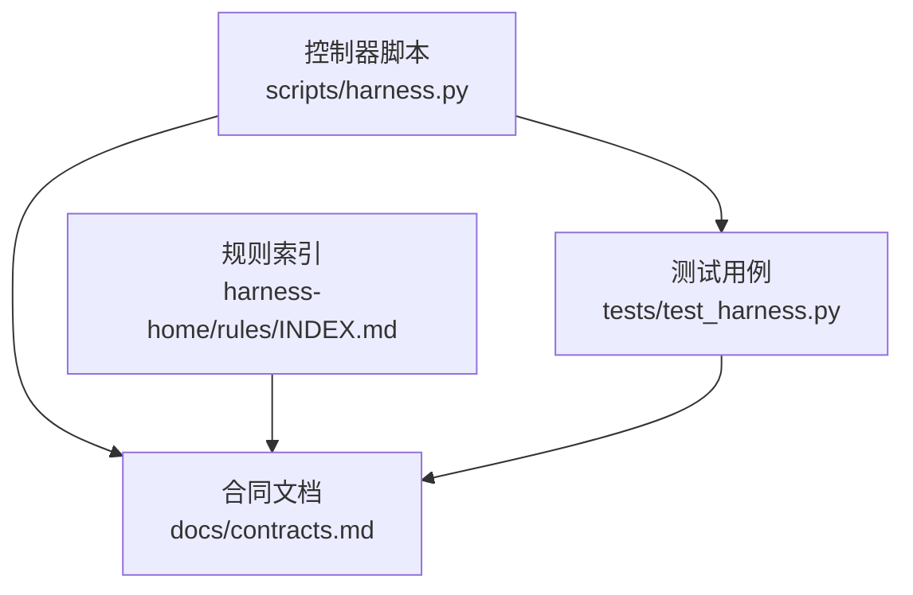
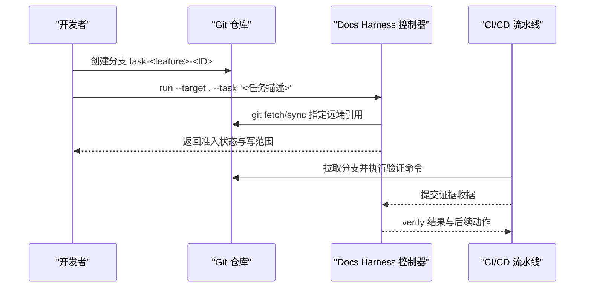
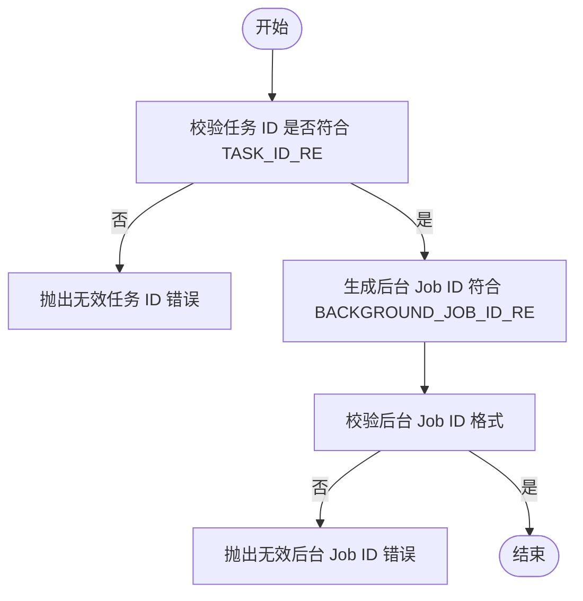
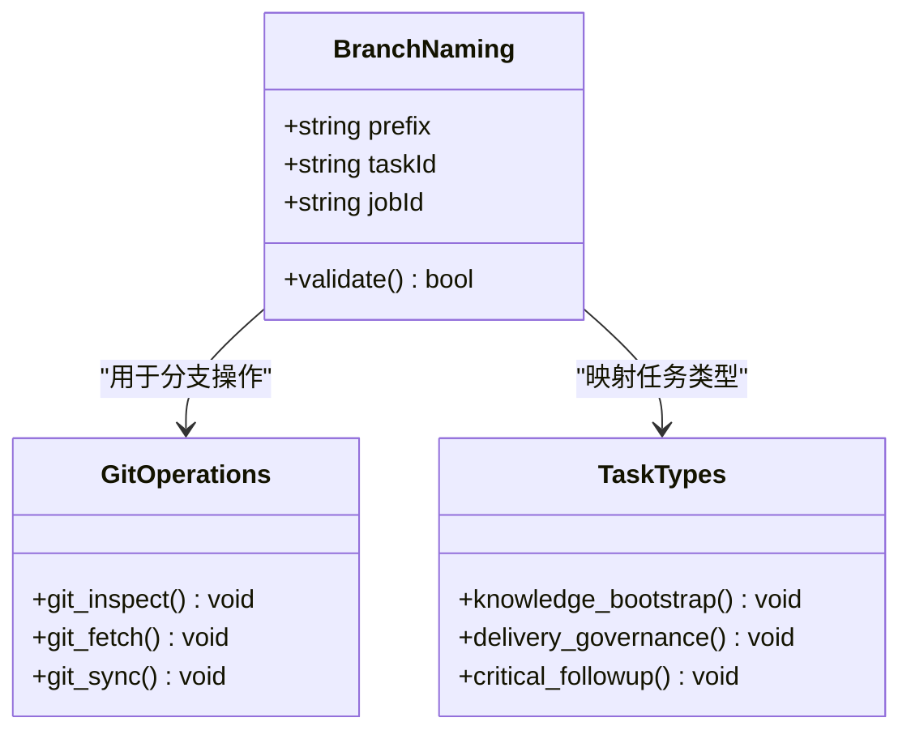
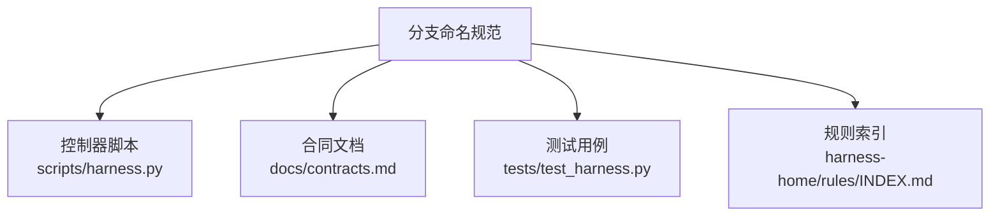

# 分支命名规范

<cite>
**本文引用的文件**   
- [scripts/harness.py](file://scripts/harness.py)
- [tests/test_harness.py](file://tests/test_harness.py)
- [docs/contracts.md](file://docs/contracts.md)
- [harness-home/rules/INDEX.md](file://harness-home/rules/INDEX.md)
</cite>

## 目录
1. [简介](#简介)
2. [项目结构](#项目结构)
3. [核心组件](#核心组件)
4. [架构总览](#架构总览)
5. [详细组件分析](#详细组件分析)
6. [依赖关系分析](#依赖关系分析)
7. [性能考虑](#性能考虑)
8. [故障排查指南](#故障排查指南)
9. [结论](#结论)
10. [附录](#附录)

## 简介
本规范定义 Docs Harness 在 Git 分支层面的命名约定与自动化校验机制，覆盖任务分支、功能分支与发布分支三类分支的前缀与格式要求，明确分支 ID 的生成规则与正则约束（TASK_ID_RE 与 BACKGROUND_JOB_ID_RE），并给出与任务类型（knowledge_bootstrap、delivery_governance、critical_followup 等）的对应关系。同时提供最佳实践与自动化检查建议，确保分支命名可被工具链稳定识别与验证。

## 项目结构
本项目为独立控制器与契约文档集合，未内置“分支命名”专用配置文件。分支命名规范通过以下来源综合形成：
- 控制器脚本中的 ID 正则与生成逻辑（用于任务与后台 Job 的标识）
- 合同文档对 Git 操作与交付层的约束（用于分支与远端同步策略）
- 测试用例中对分支审计与同步行为的断言（用于分支命名与操作的联动）
- 规则索引对安装与版本冻结的要求（用于分支与受管内容的关联）

图表来源
- [scripts/harness.py:68-73](file://scripts/harness.py#L68-L73)
- [docs/contracts.md:97-132](file://docs/contracts.md#L97-L132)
- [tests/test_harness.py:449-463](file://tests/test_harness.py#L449-L463)
- [harness-home/rules/INDEX.md:1-41](file://harness-home/rules/INDEX.md#L1-L41)

章节来源
- [scripts/harness.py:68-73](file://scripts/harness.py#L68-L73)
- [docs/contracts.md:97-132](file://docs/contracts.md#L97-L132)
- [tests/test_harness.py:449-463](file://tests/test_harness.py#L449-L463)
- [harness-home/rules/INDEX.md:1-41](file://harness-home/rules/INDEX.md#L1-L41)

## 核心组件
- 任务 ID 与后台 Job ID 的正则与生成
  - TASK_ID_RE：^dh-[0-9]{8}T[0-9]{6}-[0-9a-f]{10}$
  - BACKGROUND_JOB_ID_RE：^bg-[0-9]{8}T[0-9]{6}-[0-9a-f]{10}$
  - 生成位置分别在任务创建与后台 Job 创建路径中，保证 ID 唯一且可解析
- 分支前缀与用途
  - task-：用于与具体任务执行相关的分支（如计划、授权、证据收集、验收）
  - feature-：用于功能开发或特性迭代分支
  - release-：用于发布相关分支（含产物构建、发布流程与回滚准备）
- 任务类型与分支命名映射
  - knowledge_bootstrap：知识初始化，建议使用 task-knowledge-bootstrap-<ID>
  - delivery_governance：交付治理，建议使用 task-delivery-governance-<ID>
  - critical_followup：关键跟进，建议使用 task-critical-followup-<ID>

章节来源
- [scripts/harness.py:68-73](file://scripts/harness.py#L68-L73)
- [scripts/harness.py:3749](file://scripts/harness.py#L3749)
- [scripts/harness.py:7089](file://scripts/harness.py#L7089)
- [scripts/harness.py:8508](file://scripts/harness.py#L8508)
- [scripts/harness.py:116-120](file://scripts/harness.py#L116-L120)

## 架构总览
分支命名与任务/Job 生命周期紧密耦合。控制器在执行 git_fetch/git_sync 等操作时，会基于分支引用进行范围控制与漂移检测；分支命名需满足可被控制器与 CI/CD 工具链一致识别的要求。

图表来源
- [docs/contracts.md:97-132](file://docs/contracts.md#L97-L132)
- [tests/test_harness.py:597-618](file://tests/test_harness.py#L597-L618)

## 详细组件分析

### 分支 ID 格式与正则约束
- 任务 ID（TASK_ID_RE）
  - 格式：dh-YYYYMMDDTHHMMSS-<10位十六进制>
  - 用途：唯一标识一次任务执行实例，幂等复用与审计追踪
- 后台 Job ID（BACKGROUND_JOB_ID_RE）
  - 格式：bg-YYYYMMDDTHHMMSS-<10位十六进制>
  - 用途：唯一标识后台治理 Job，支持重试与工件归档

图表来源
- [scripts/harness.py:68-73](file://scripts/harness.py#L68-L73)
- [scripts/harness.py:542](file://scripts/harness.py#L542)

章节来源
- [scripts/harness.py:68-73](file://scripts/harness.py#L68-L73)
- [scripts/harness.py:542](file://scripts/harness.py#L542)

### 分支前缀规范与使用场景
- task-：任务执行相关分支，包含计划、授权、证据收集与验收
  - 示例：task-delivery-governance-dh-20260804T000000-aaaaaaaaaa
- feature-：功能开发分支，用于实现新功能或特性迭代
  - 示例：feature-user-authentication-v1
- release-：发布相关分支，用于构建发布产物、执行发布流程与回滚准备
  - 示例：release-v1.6.5-hotfix

章节来源
- [scripts/harness.py:116-120](file://scripts/harness.py#L116-L120)
- [docs/contracts.md:97-132](file://docs/contracts.md#L97-L132)

### 任务类型与分支命名映射
- knowledge_bootstrap：知识初始化任务
  - 分支前缀：task-knowledge-bootstrap-
  - 示例：task-knowledge-bootstrap-dh-20260804T000000-bbbbbbbbbb
- delivery_governance：交付治理任务
  - 分支前缀：task-delivery-governance-
  - 示例：task-delivery-governance-dh-20260804T000000-cccccccccc
- critical_followup：关键跟进任务
  - 分支前缀：task-critical-followup-
  - 示例：task-critical-followup-dh-20260804T000000-dddddddddd

章节来源
- [scripts/harness.py:116-120](file://scripts/harness.py#L116-L120)
- [scripts/harness.py:7236](file://scripts/harness.py#L7236)
- [scripts/harness.py:7628](file://scripts/harness.py#L7628)

### 分支命名与 Git 操作集成
- git_inspect：只读审计分支，不修改工作区
- git_fetch：仅允许声明的远端 refs/objects 变化
- git_sync：绑定单一预检 OID，自动生成变更范围

图表来源
- [docs/contracts.md:97-132](file://docs/contracts.md#L97-L132)
- [tests/test_harness.py:449-463](file://tests/test_harness.py#L449-L463)

章节来源
- [docs/contracts.md:97-132](file://docs/contracts.md#L97-L132)
- [tests/test_harness.py:449-463](file://tests/test_harness.py#L449-L463)

## 依赖关系分析
分支命名规范依赖于以下组件：
- 控制器脚本中的正则表达式与 ID 生成逻辑
- 合同文档中的 Git 操作约束
- 测试用例中的分支审计与同步行为验证
- 规则索引中的安装与版本冻结要求

图表来源
- [scripts/harness.py:68-73](file://scripts/harness.py#L68-L73)
- [docs/contracts.md:97-132](file://docs/contracts.md#L97-L132)
- [tests/test_harness.py:449-463](file://tests/test_harness.py#L449-L463)
- [harness-home/rules/INDEX.md:1-41](file://harness-home/rules/INDEX.md#L1-L41)

章节来源
- [scripts/harness.py:68-73](file://scripts/harness.py#L68-L73)
- [docs/contracts.md:97-132](file://docs/contracts.md#L97-L132)
- [tests/test_harness.py:449-463](file://tests/test_harness.py#L449-L463)
- [harness-home/rules/INDEX.md:1-41](file://harness-home/rules/INDEX.md#L1-L41)

## 性能考虑
- 分支命名应避免过长，减少网络传输与存储开销
- 使用稳定的 ID 格式，避免频繁重算哈希值
- 在 CI/CD 中缓存分支名称解析结果，提升流水线性能

## 故障排查指南
- 分支名称不符合正则表达式：检查 TASK_ID_RE 与 BACKGROUND_JOB_ID_RE 格式
- 任务 ID 冲突：确认是否重复使用相同 ID
- 后台 Job ID 无效：检查生成逻辑与格式约束
- 分支操作失败：验证 git_scope 与 controlled_refs_namespace 配置

章节来源
- [scripts/harness.py:542](file://scripts/harness.py#L542)
- [scripts/harness.py:3749](file://scripts/harness.py#L3749)
- [scripts/harness.py:7089](file://scripts/harness.py#L7089)
- [scripts/harness.py:8508](file://scripts/harness.py#L8508)

## 结论
本规范明确了 Docs Harness 的分支命名约定，涵盖任务分支、功能分支与发布分支的前缀与格式要求，结合任务类型与 Git 操作约束，提供了完整的自动化检查与验证机制。遵循本规范可确保分支命名的一致性、可追溯性与工具链兼容性。

## 附录
- 最佳实践
  - 使用语义化分支前缀，清晰表达分支用途
  - 结合任务 ID 与 Job ID，确保唯一性与可审计性
  - 在 CI/CD 中集成分支命名校验，提前发现错误
- 示例
  - task-delivery-governance-dh-20260804T000000-aaaaaaaaaa
  - feature-user-authentication-v1
  - release-v1.6.5-hotfix