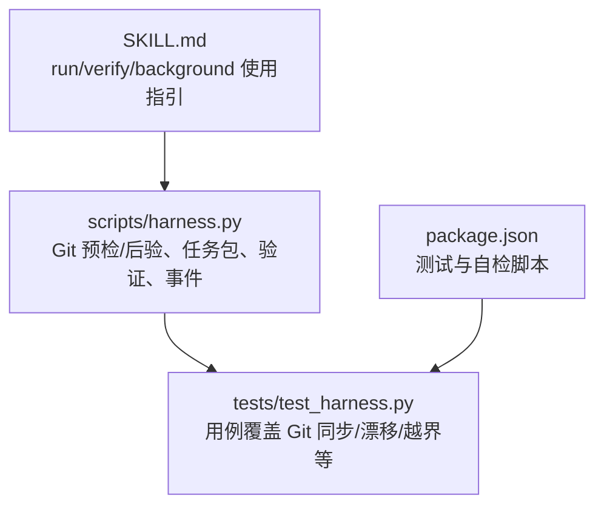
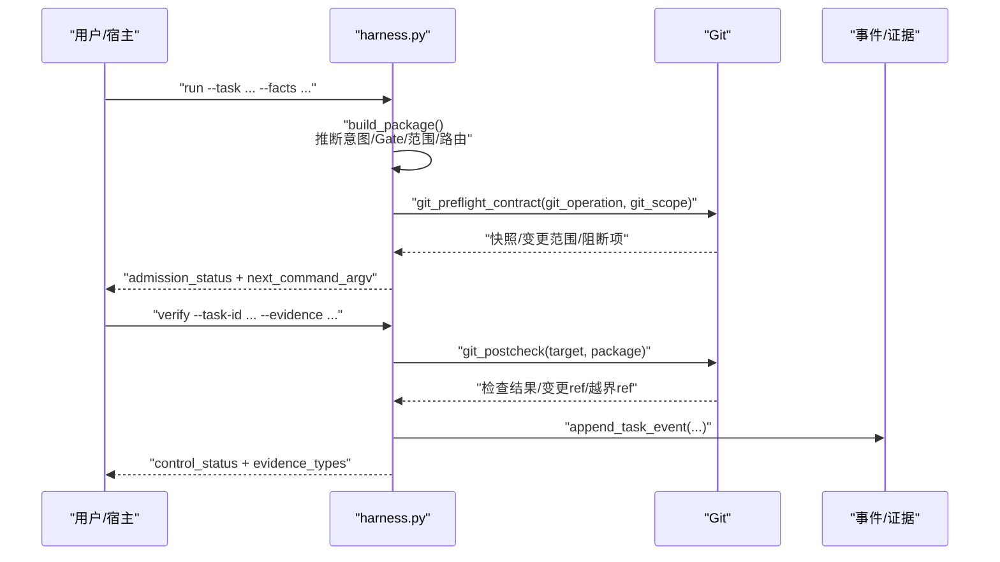
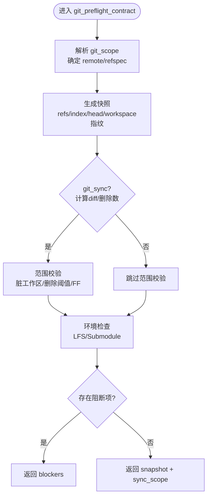
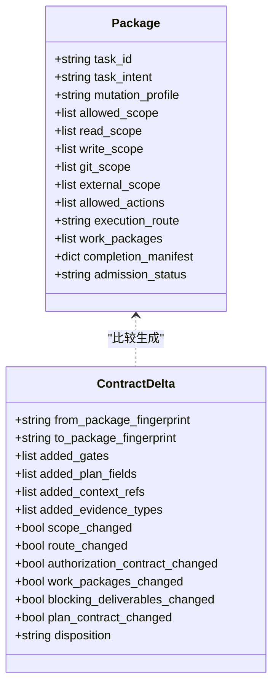
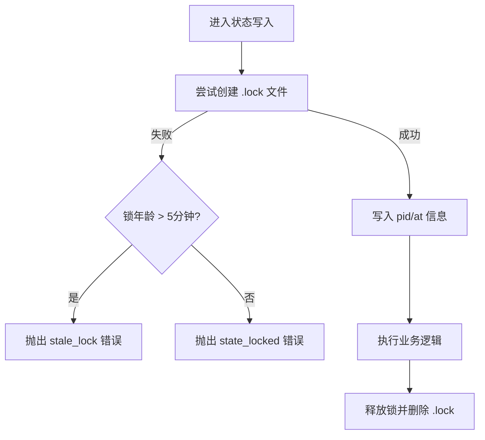
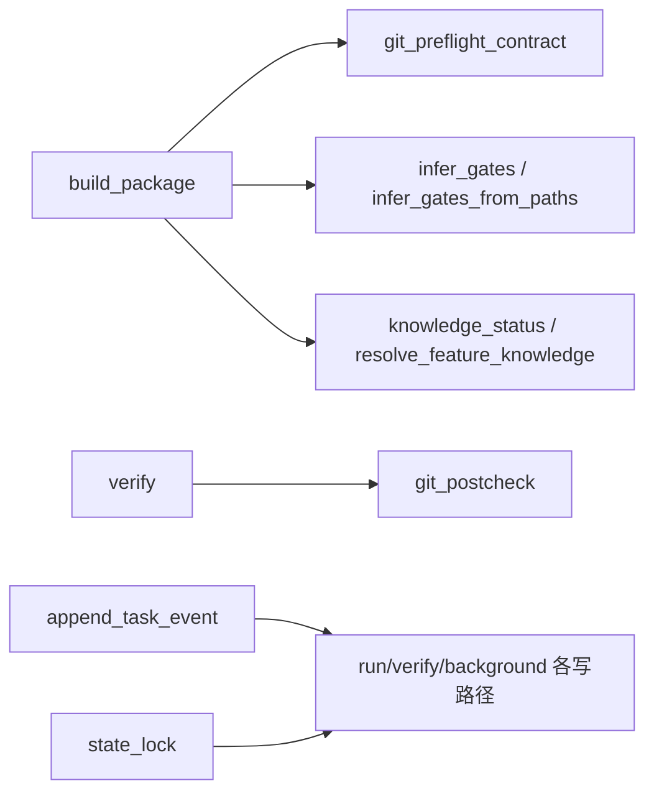

# 分支生命周期管理

<cite>
**本文引用的文件**   
- [scripts/harness.py](file://scripts/harness.py)
- [tests/test_harness.py](file://tests/test_harness.py)
- [package.json](file://package.json)
- [SKILL.md](file://SKILL.md)
</cite>

## 目录
1. [引言](#引言)
2. [项目结构](#项目结构)
3. [核心组件](#核心组件)
4. [架构总览](#架构总览)
5. [详细组件分析](#详细组件分析)
6. [依赖关系分析](#依赖关系分析)
7. [性能考量](#性能考量)
8. [故障排查指南](#故障排查指南)
9. [结论](#结论)
10. [附录](#附录)

## 引言
本文件面向 Docs Harness 的“分支生命周期管理”主题，聚焦于与分支相关的状态、监控、清理、依赖与配置等能力。需要特别说明的是：当前仓库并未实现“活跃分支监控/超时检测/过期自动清理/父子分支关系图”等通用分支治理功能；这些内容属于概念性说明，不映射到具体代码实现。文档将严格区分“已实现能力（基于源码）”和“概念性建议（非代码实现）”，并提供可落地的 Git 预检/后验、范围控制、任务准入与验证等机制作为替代方案。

## 项目结构
- scripts/harness.py：Docs Harness 主控制器，包含 Git 操作、任务包构建、验证、事件记录、知识地图与后台作业管理等核心逻辑。
- tests/test_harness.py：覆盖 Git fetch/sync、意图分类、Gate 推断、证据校验等关键路径的单元测试。
- package.json：脚本入口与测试命令定义。
- SKILL.md：技能使用说明，涵盖 run/verify/background 等流程要点。

图表来源
- [scripts/harness.py:575-878](file://scripts/harness.py#L575-L878)
- [tests/test_harness.py:503-756](file://tests/test_harness.py#L503-L756)
- [package.json:17-21](file://package.json#L17-L21)
- [SKILL.md:26-56](file://SKILL.md#L26-L56)

章节来源
- [scripts/harness.py:575-878](file://scripts/harness.py#L575-L878)
- [tests/test_harness.py:503-756](file://tests/test_harness.py#L503-L756)
- [package.json:17-21](file://package.json#L17-L21)
- [SKILL.md:26-56](file://SKILL.md#L26-L56)

## 核心组件
- Git 预检与后验
  - git_preflight_contract：在 git_fetch/git_sync 前生成快照、计算变更范围、检查 LFS/Submodule、脏工作区与非快进冲突等。
  - git_postcheck：对比远端目标是否变化、受控 ref 是否越界、HEAD 与索引一致性、LFS/Submodule 有效性等。
- 任务包与准入
  - build_package：根据任务文本与 facts 推断意图、mutation_profile、Gate、路由、范围、验证命令、完成清单等。
  - contract_disposition/build_contract_delta：合同分段处置与增量差异判定，决定是否需要重新准入或仅补证据。
- 事件与状态锁
  - append_task_event：追加事件日志，统计上下文加载次数、证据轮次、业务动作计数等。
  - state_lock：进程级状态锁，防止并发写冲突，支持过期锁检测。
- 知识地图与背景作业
  - knowledge_status/evaluate_candidate_knowledge：评估知识就绪度与缺口。
  - list_background_jobs/knowledge_handoff：背景作业管理与交接策略。

章节来源
- [scripts/harness.py:680-878](file://scripts/harness.py#L680-L878)
- [scripts/harness.py:2779-3075](file://scripts/harness.py#L2779-L3075)
- [scripts/harness.py:1034-1074](file://scripts/harness.py#L1034-L1074)
- [scripts/harness.py:1011-1032](file://scripts/harness.py#L1011-L1032)
- [scripts/harness.py:1722-1818](file://scripts/harness.py#L1722-L1818)

## 架构总览
下图展示与分支相关的关键调用链：从 run 构建任务包开始，触发 Git 预检，执行操作后通过 verify 进行后验，最终产出事件与证据。

图表来源
- [scripts/harness.py:2779-3075](file://scripts/harness.py#L2779-L3075)
- [scripts/harness.py:680-878](file://scripts/harness.py#L680-L878)
- [scripts/harness.py:1034-1074](file://scripts/harness.py#L1034-L1074)

## 详细组件分析

### Git 预检与后验（分支安全边界）
- 预检阶段
  - 解析 git_scope，限定受控远端引用命名空间。
  - 计算 diff 变更范围，限制删除数量阈值，阻止脏工作区与变更范围重叠。
  - 检查 fast-forward 可行性、LFS/Submodule 可用性。
- 后验阶段
  - 校验远端目标未漂移、受控 ref 未越界、HEAD 与索引一致。
  - 对 LFS/Submodule 进行有效性校验。
  - 输出 changed_refs 与 outside_refs 用于审计与告警。

图表来源
- [scripts/harness.py:680-794](file://scripts/harness.py#L680-L794)
- [scripts/harness.py:796-878](file://scripts/harness.py#L796-L878)

章节来源
- [scripts/harness.py:680-878](file://scripts/harness.py#L680-L878)

### 任务包构建与合同处置（分支相关范围与动作）
- 意图与 mutation_profile 推断：query/audit/git_inspect/git_fetch/git_sync/modify/external_write。
- Gate 推断：基于关键词与路径模式，结合宿主 gate_assessment 与安全底线强制兜底。
- 范围合同指纹：read/write/git/external scope、allowed_actions、execution_route/topology、work_packages。
- 合同分段处置：full_readmission/incremental_admission/plan_amendment/evidence_only/context_only/no_change。

图表来源
- [scripts/harness.py:2779-3075](file://scripts/harness.py#L2779-L3075)
- [scripts/harness.py:3154-3197](file://scripts/harness.py#L3154-L3197)

章节来源
- [scripts/harness.py:2779-3075](file://scripts/harness.py#L2779-L3075)
- [scripts/harness.py:3154-3197](file://scripts/harness.py#L3154-L3197)

### 事件与状态锁（分支操作审计）
- append_task_event：记录 phase、reason_code、duration_ms、context_cache_hit、证据轮次、业务动作计数等。
- state_lock：以 .lock 文件实现进程级互斥，超过 5 分钟视为过期锁，需人工清理。

图表来源
- [scripts/harness.py:1011-1032](file://scripts/harness.py#L1011-L1032)
- [scripts/harness.py:1034-1074](file://scripts/harness.py#L1034-L1074)

章节来源
- [scripts/harness.py:1011-1032](file://scripts/harness.py#L1011-L1032)
- [scripts/harness.py:1034-1074](file://scripts/harness.py#L1034-L1074)

### 知识地图与背景作业（与分支无关但影响交付）
- knowledge_status：评估 docs/knowledge-map.json 就绪度，支持 repowiki 只消费模式。
- knowledge_handoff：init/upgrade 时决定 bootstrap_new/audit_existing/bootstrap_in_progress 等模式。
- background jobs：prepare/dispatch/progress/verify/retry 全生命周期管理，终态集合与重试策略明确。

章节来源
- [scripts/harness.py:1722-1818](file://scripts/harness.py#L1722-L1818)
- [scripts/harness.py:1841-1871](file://scripts/harness.py#L1841-L1871)

## 依赖关系分析
- harness.py 内部模块耦合点
  - Git 工具函数（git_command/git_root/git_dir）被预检/后验广泛复用。
  - 任务包构建依赖范围校验、Gate 推断、知识地图、规则加载、验证命令规范化等。
  - 事件与状态锁贯穿 run/verify/background 等所有写路径。
- 测试覆盖关键点
  - git_fetch/git_sync 的预检/后验、漂移检测、越界 ref 拦截、脏工作区与 FF 冲突。
  - 意图分类、Gate 推断、证据校验、归档与回滚约束。

图表来源
- [scripts/harness.py:2779-3075](file://scripts/harness.py#L2779-L3075)
- [scripts/harness.py:680-878](file://scripts/harness.py#L680-L878)
- [scripts/harness.py:1034-1074](file://scripts/harness.py#L1034-L1074)
- [scripts/harness.py:1011-1032](file://scripts/harness.py#L1011-L1032)

章节来源
- [scripts/harness.py:2779-3075](file://scripts/harness.py#L2779-L3075)
- [scripts/harness.py:680-878](file://scripts/harness.py#L680-L878)
- [scripts/harness.py:1034-1074](file://scripts/harness.py#L1034-L1074)
- [scripts/harness.py:1011-1032](file://scripts/harness.py#L1011-L1032)

## 性能考量
- Git 操作超时保护：git_command 默认 20s 超时，避免阻塞。
- 快照与指纹计算：workspace_snapshot 对大文件采用 size+mtime 指纹，降低 IO 压力。
- 事件追加与 JSONL：append_jsonl 原子追加并 fsync，保证幂等与持久化。
- 状态锁过期检测：避免僵尸锁导致的长期阻塞。

章节来源
- [scripts/harness.py:575-586](file://scripts/harness.py#L575-L586)
- [scripts/harness.py:1115-1138](file://scripts/harness.py#L1115-L1138)
- [scripts/harness.py:1034-1074](file://scripts/harness.py#L1034-L1074)
- [scripts/harness.py:1011-1032](file://scripts/harness.py#L1011-L1032)

## 故障排查指南
- Git 预检失败常见原因
  - 脏工作区与 git_sync 范围重叠：清理或调整 write_scope。
  - 非快进合并：确保目标为 HEAD 祖先或使用 rebase/merge 策略。
  - LFS/Submodule 不可用：安装对应工具或禁用相关特性。
- 后验失败常见原因
  - 远端目标漂移：等待上游稳定或重新准入。
  - 受控 ref 越界：检查 git_scope 与 controlled_refs_namespace。
  - LFS/Submodule 校验失败：修复对象或子模块状态。
- 状态锁问题
  - 检测到过期锁：人工清理 .lock 文件后重试。
- 参考用例
  - 漂移检测、越界拦截、脏工作区与 FF 冲突等场景见测试用例。

章节来源
- [scripts/harness.py:680-878](file://scripts/harness.py#L680-L878)
- [tests/test_harness.py:620-756](file://tests/test_harness.py#L620-L756)

## 结论
- 已实现能力：围绕 Git 操作的预检/后验、任务包构建与合同分段处置、事件与状态锁、知识地图与背景作业管理，提供了强约束、可审计、可恢复的分支相关操作保障。
- 未实现能力：活跃分支监控、超时检测、过期自动清理、父子分支关系图维护等不在当前仓库实现范围内，属于概念性建议。
- 实践建议：通过严格的 git_scope 与 controlled_refs_namespace 限定分支操作范围，配合 preflight/postcheck 与事件审计，达到“最小权限、最大可见”的分支治理效果。

## 附录
- 运行与自检
  - 测试命令：npm test / npm run self-test
  - 技能说明：SKILL.md 中的 run/verify/background 用法
- 相关常量与状态集
  - BACKGROUND_TERMINAL_STATES、BACKGROUND_KNOWN_STATES、BACKGROUND_RETRYABLE_STATES 等定义了后台作业的状态机。

章节来源
- [package.json:17-21](file://package.json#L17-L21)
- [SKILL.md:60-90](file://SKILL.md#L60-L90)
- [scripts/harness.py:100-127](file://scripts/harness.py#L100-L127)