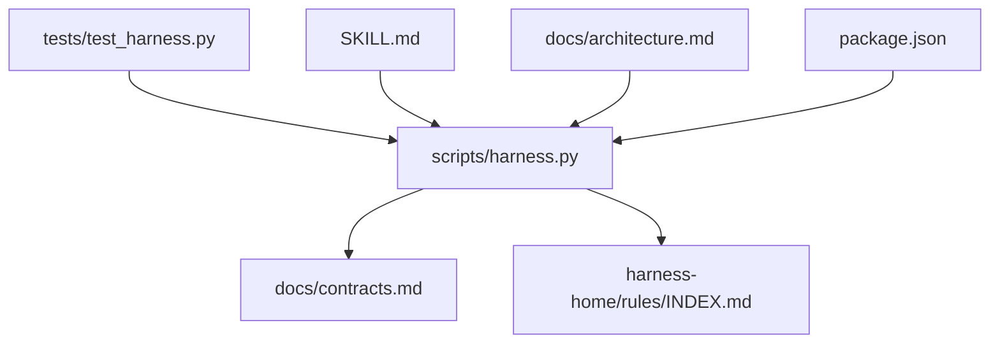
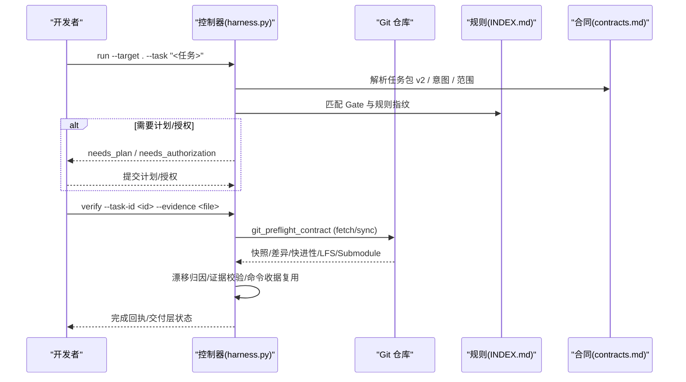
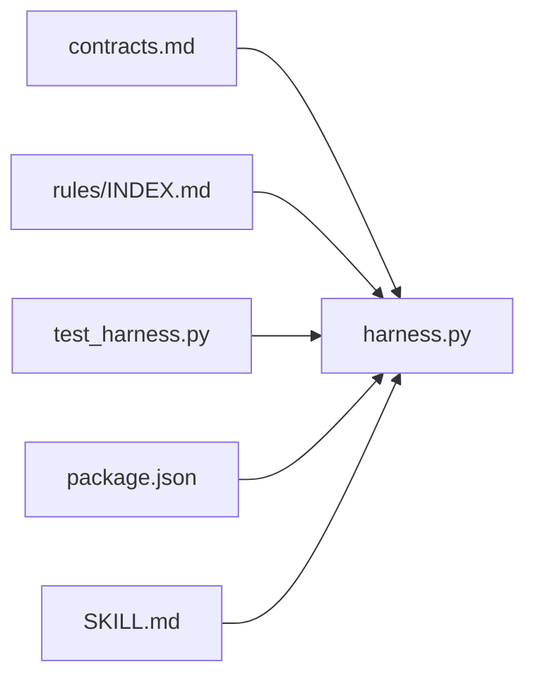

# 分支管理策略

<cite>
**本文档中引用的文件**
- [scripts/harness.py](file://scripts/harness.py)
- [tests/test_harness.py](file://tests/test_harness.py)
- [package.json](file://package.json)
- [SKILL.md](file://SKILL.md)
- [harness-home/rules/INDEX.md](file://harness-home/rules/INDEX.md)
- [docs/architecture.md](file://docs/architecture.md)
- [docs/contracts.md](file://docs/contracts.md)
- [docs/plans/knowledge-bootstrap-upgrade-fix-plan.md](file://docs/plans/knowledge-bootstrap-upgrade-fix-plan.md)
</cite>

## 目录
1. [简介](#简介)
2. [项目结构](#项目结构)
3. [核心组件](#核心组件)
4. [架构总览](#架构总览)
5. [详细组件分析](#详细组件分析)
6. [依赖关系分析](#依赖关系分析)
7. [性能考量](#性能考量)
8. [故障排查指南](#故障排查指南)
9. [结论](#结论)
10. [附录](#附录)

## 简介
本文件为 Docs Harness 的“分支管理策略”说明文档，聚焦于与 Git 分支相关的命名约定、合并策略、冲突处理、状态跟踪、钩子与自动化脚本等实践。该仓库以控制器脚本为核心，提供对 Git 操作的受控执行（如只读检查、抓取远端引用、同步远端变更）以及严格的预检与后检机制，确保分支操作在安全边界内可审计、可回滚、可验证。

## 项目结构
- scripts/harness.py：控制器主程序，定义意图识别、范围约束、Git 预检/后检、任务包与证据契约、后台治理 Job 等核心逻辑。
- tests/test_harness.py：覆盖 Git inspect/fetch/sync、漂移检测、非 fast-forward 阻断、LFS/Submodule 可用性校验等场景。
- package.json：版本与脚本入口，包含自检与打包检查命令。
- SKILL.md：对外行为说明，包括安装、升级、任务入口、验收流程与后台治理。
- harness-home/rules/INDEX.md：受管规则索引，运行时不得依赖源码绝对路径；规则指纹变化将失败关闭。
- docs/architecture.md：架构事实，明确控制器真源、受管规则来源、Runtime 位置与交付边界。
- docs/contracts.md：合同定义，涵盖任务包 v2、准入状态、Git 状态合同、工作区漂移归因、证据收据、退出码等。
- docs/plans/knowledge-bootstrap-upgrade-fix-plan.md：知识初始化与后台路由修复方案，涉及等待合并、重基线重建与状态机迁移。

图表来源
- [scripts/harness.py:1-120](file://scripts/harness.py#L1-L120)
- [docs/contracts.md:1-120](file://docs/contracts.md#L1-L120)
- [harness-home/rules/INDEX.md:1-41](file://harness-home/rules/INDEX.md#L1-L41)
- [tests/test_harness.py:1-120](file://tests/test_harness.py#L1-L120)
- [SKILL.md:1-105](file://SKILL.md#L1-L105)
- [docs/architecture.md:1-26](file://docs/architecture.md#L1-L26)
- [package.json:1-23](file://package.json#L1-L23)

章节来源
- [scripts/harness.py:1-120](file://scripts/harness.py#L1-L120)
- [docs/contracts.md:1-120](file://docs/contracts.md#L1-L120)
- [harness-home/rules/INDEX.md:1-41](file://harness-home/rules/INDEX.md#L1-L41)
- [tests/test_harness.py:1-120](file://tests/test_harness.py#L1-L120)
- [SKILL.md:1-105](file://SKILL.md#L1-L105)
- [docs/architecture.md:1-26](file://docs/architecture.md#L1-L26)
- [package.json:1-23](file://package.json#L1-L23)

## 核心组件
- 意图与范围控制：通过任务意图（query/audit/git_inspect/git_fetch/git_sync/modify/external_write）与 mutation_profile（read_only/git_metadata_write/workspace_write/external_write）限定写入面与风险 Gate。
- Git 预检与后检：git_preflight_contract 与 git_postcheck 对 fetch/sync 进行严格约束，包括脏工作区、删除阈值、fast-forward、LFS/Submodule 可用性与 ref 越界检测。
- 漂移与归因：工作区漂移按 read_set/concurrent_drift/unattributed_drift 分类，结合 write_scope 判定是否阻断或自动归因。
- 证据与验收：evidence-receipt/v2 与 verification-command-receipt/v1 支持逐项收据复用与输入指纹缓存，失败重试与增量准入分层。
- 后台治理：background_job/v2 支持目标型与分阶段路线，knowledge bootstrap/incremental sync 状态机与 waiting_for_bootstrap_merge 依赖链。

章节来源
- [scripts/harness.py:197-231](file://scripts/harness.py#L197-L231)
- [scripts/harness.py:677-791](file://scripts/harness.py#L677-L791)
- [scripts/harness.py:793-856](file://scripts/harness.py#L793-L856)
- [docs/contracts.md:97-132](file://docs/contracts.md#L97-L132)
- [docs/contracts.md:134-164](file://docs/contracts.md#L134-L164)
- [docs/contracts.md:165-221](file://docs/contracts.md#L165-L221)
- [docs/contracts.md:303-342](file://docs/contracts.md#L303-L342)

## 架构总览
Docs Harness 的分支管理围绕“受控 Git 操作 + 强约束预检/后检 + 证据化验收”展开。任务入口先编译意图与范围，再根据风险 Gate 决定是否需要计划与授权。Git 操作被限制在声明范围内，任何越界或漂移都会触发阻断或重新准入。验收层逐命令记录收据并缓存命中，减少重复成本。

图表来源
- [scripts/harness.py:677-791](file://scripts/harness.py#L677-L791)
- [docs/contracts.md:97-132](file://docs/contracts.md#L97-L132)
- [harness-home/rules/INDEX.md:1-41](file://harness-home/rules/INDEX.md#L1-L41)
- [tests/test_harness.py:597-735](file://tests/test_harness.py#L597-L735)

## 详细组件分析

### 分支命名约定与规范
当前仓库未内置统一的分支命名规范模块。实践中建议遵循以下约定并与控制器受控范围对齐：
- 任务分支：用于实现具体任务，命名建议体现任务 ID 或短描述，例如 task/<task-id>-<short-desc>。
- 功能分支：用于新增功能，命名建议 feature/<feature-name>。
- 发布分支：用于准备发布，命名建议 release/<version>。
- 热修复分支：用于紧急修复，命名建议 hotfix/<issue-or-version>。
- 开发主干：建议使用 main 或 develop，并在控制器 git_scope 中显式绑定单一远端分支，避免模糊匹配。

注意：
- 控制器要求 git_scope 必须精确到单一远端分支（禁止通配符），以避免歧义与越界操作。
- 分支名应保持稳定且可读，便于审计与回溯。

章节来源
- [scripts/harness.py:661-675](file://scripts/harness.py#L661-L675)
- [docs/contracts.md:97-132](file://docs/contracts.md#L97-L132)

### 分支合并策略
- 快速合并（fast-forward）：默认允许，控制器在预检时计算 merge-base 并判断是否为 fast-forward。若不可 fast-forward，则阻断并返回 blockers。
- 变基合并（rebase）：语义上属于 git_sync 范畴，但控制器不直接执行 rebase；宿主需自行保证目标分支可 fast-forward 或通过其他受控方式同步。
- 三方合并（merge）：控制器不自动执行三方合并；若存在分歧，需先解决冲突并确保最终结果满足 write_scope 与证据要求。

最佳实践：
- 优先使用 fast-forward 合并，保持线性历史。
- 若必须三方合并，应在本地解决冲突并通过 verify 生成证据后再推进。

章节来源
- [scripts/harness.py:711-751](file://scripts/harness.py#L711-L751)
- [docs/contracts.md:125-132](file://docs/contracts.md#L125-L132)
- [tests/test_harness.py:710-735](file://tests/test_harness.py#L710-L735)

### 冲突检测与处理机制
- 自动冲突检测：git_preflight_contract 会检查脏工作区、删除数量阈值、fast-forward 条件、LFS/Submodule 可用性；git_postcheck 会校验 ref 变更与越界。
- 阻断规则：非 fast-forward、分支分歧、重叠脏改动、危险删除、LFS/Submodule 不可验证均失败关闭。
- 手动干预流程：当出现冲突或漂移时，宿主需先解决冲突并更新工作区，再通过 verify 重新准入；必要时使用 complete_plan_delta 补充计划字段。

章节来源
- [scripts/harness.py:733-756](file://scripts/harness.py#L733-L756)
- [scripts/harness.py:852-856](file://scripts/harness.py#L852-L856)
- [docs/contracts.md:134-164](file://docs/contracts.md#L134-L164)

### 分支状态跟踪
- 活跃分支监控：通过 git_refs_snapshot 获取所有 refs 快照，controlled_refs_namespace 自动包含远端 HEAD 引用，避免误判 origin/HEAD 更新。
- 过期分支清理：控制器不自动删除分支；宿主可基于任务生命周期与证据状态定期清理无用分支。
- 依赖关系管理：knowledge bootstrap/incremental sync 状态机通过 waiting_for_bootstrap_merge 管理依赖，只有 bootstrap 成功且知识 ready 才释放等待者。

章节来源
- [scripts/harness.py:612-623](file://scripts/harness.py#L612-L623)
- [docs/contracts.md:303-342](file://docs/contracts.md#L303-L342)
- [docs/plans/knowledge-bootstrap-upgrade-fix-plan.md:172-193](file://docs/plans/knowledge-bootstrap-upgrade-fix-plan.md#L172-L193)

### Git 钩子的使用
- 提交前检查：控制器不直接注册 Git hooks；可在宿主环境中集成 pre-commit 钩子调用 harness self-test 或 project check。
- 合并后处理：可通过 post-merge 钩子触发 verify 或 background verify，确保合并后的状态符合证据与验收要求。
- 推送验证：push 前可运行 git_preflight_contract 与 git_postcheck 模拟预检，避免推送失败或越界操作。

章节来源
- [package.json:17-22](file://package.json#L17-L22)
- [SKILL.md:1-105](file://SKILL.md#L1-L105)
- [docs/contracts.md:359-370](file://docs/contracts.md#L359-L370)

### 最佳实践与常见问题
- 最佳实践：
  - 始终使用受控 git_scope 绑定单一远端分支。
  - 在 verify 前确保工作区干净且无重叠脏改动。
  - 使用 evidence-receipt/v2 与 verification-command-receipt/v1 提高验收效率。
  - 对于高风险 Gate（security-sensitive、destructive-data、release-external），提前准备计划与证据。
- 常见问题：
  - 非 fast-forward 导致同步失败：需先拉取最新代码并解决分歧。
  - LFS/Submodule 不可用：确保环境配置正确或禁用相关功能。
  - 漂移导致证据失效：刷新相关证据并重新验证。

章节来源
- [scripts/harness.py:661-675](file://scripts/harness.py#L661-L675)
- [scripts/harness.py:733-756](file://scripts/harness.py#L733-L756)
- [docs/contracts.md:165-221](file://docs/contracts.md#L165-L221)

### 实际分支操作示例与自动化脚本
- 示例流程：
  - 创建功能分支 feature/<name>，在本地修改文件并提交。
  - 使用 run 提交任务意图与范围，进入 ready_planned 或 ready_extended。
  - 执行 verify 生成证据并完成父任务。
  - 若需同步远端，使用 git_sync 并绑定单一远端分支。
- 自动化脚本：
  - 使用 package.json 中的 test/self-test/pack:check 脚本进行自检与打包检查。
  - 在 CI/CD 中集成 harness.py 命令，实现自动化验收与报告。

章节来源
- [tests/test_harness.py:597-735](file://tests/test_harness.py#L597-L735)
- [package.json:17-22](file://package.json#L17-L22)
- [SKILL.md:25-55](file://SKILL.md#L25-L55)

## 依赖关系分析
- 控制器依赖合同与规则：contracts.md 定义任务包、证据、验收契约；rules INDEX.md 管理生效规则与指纹。
- 测试依赖控制器：test_harness.py 通过 subprocess 调用 harness.py 并断言预期行为。
- 版本与脚本：package.json 提供版本信息与脚本入口，SKILL.md 描述对外行为。

图表来源
- [docs/contracts.md:1-120](file://docs/contracts.md#L1-L120)
- [harness-home/rules/INDEX.md:1-41](file://harness-home/rules/INDEX.md#L1-L41)
- [tests/test_harness.py:1-120](file://tests/test_harness.py#L1-L120)
- [package.json:1-23](file://package.json#L1-L23)
- [SKILL.md:1-105](file://SKILL.md#L1-L105)

章节来源
- [docs/contracts.md:1-120](file://docs/contracts.md#L1-L120)
- [harness-home/rules/INDEX.md:1-41](file://harness-home/rules/INDEX.md#L1-L41)
- [tests/test_harness.py:1-120](file://tests/test_harness.py#L1-L120)
- [package.json:1-23](file://package.json#L1-L23)
- [SKILL.md:1-105](file://SKILL.md#L1-L105)

## 性能考量
- 验证命令缓存：verification-command-receipt/v1 支持逐项收据复用，输入不变时不重复执行已通过命令。
- 上下文正文跨阶段复用：content-delivery receipt 与 stage acknowledgement receipt 避免重复加载相同内容。
- 工件摄取：plans/authorizations/evidence/verification 目录集中存储不可变工件，减少临时文件依赖。
- 事件脱敏：event/v2 仅保存有界字段，避免遥测泄漏敏感信息。

章节来源
- [docs/contracts.md:165-221](file://docs/contracts.md#L165-L221)
- [docs/plans/v1.6.4-minimal-systemic-flow-efficiency-plan.md:202-231](file://docs/plans/v1.6.4-minimal-systemic-flow-efficiency-plan.md#L202-L231)
- [docs/contracts.md:283-302](file://docs/contracts.md#L283-L302)

## 故障排查指南
- 常见错误码：
  - 0：命令成功；verify.result=完成表示父任务完成。
  - 1：项目检查、自检或完整性读取失败。
  - 2：输入、合同、绑定或状态无效。
  - 3：需要方案、授权、证据、迁移、用户输入或 Git 交付。
  - 4：范围、漂移、Gate、远端、授权或规则变化，必须重新准入。
- 排查步骤：
  - 检查工作区是否干净且无重叠脏改动。
  - 确认 git_scope 绑定单一远端分支且目标对象已获取。
  - 验证 LFS/Submodule 可用性。
  - 刷新漂移路径的证据并重新验证。
  - 查看 events.jsonl 与 package-history 定位问题轮次。

章节来源
- [docs/contracts.md:359-370](file://docs/contracts.md#L359-L370)
- [scripts/harness.py:733-756](file://scripts/harness.py#L733-L756)
- [docs/plans/v1.6.4-minimal-systemic-flow-efficiency-plan.md:195-201](file://docs/plans/v1.6.4-minimal-systemic-flow-efficiency-plan.md#L195-L201)

## 结论
Docs Harness 的分支管理策略以“受控 Git 操作 + 强约束预检/后检 + 证据化验收”为核心，确保分支操作在安全边界内可审计、可回滚、可验证。通过明确的命名约定、合并策略、冲突处理、状态跟踪与自动化脚本，团队可实现高效、稳定的分支协作流程。

## 附录
- 术语表：
  - fast-forward：快进合并，目标分支是当前分支的直接后代。
  - drift：漂移，工作区或远端状态发生变化。
  - evidence：证据，证明任务完成的收据或输出。
  - gate：门控，风险控制点，如安全、数据、发布等。
- 参考链接：
  - contracts.md：完整合同定义。
  - SKILL.md：对外行为说明。
  - rules INDEX.md：受管规则索引。