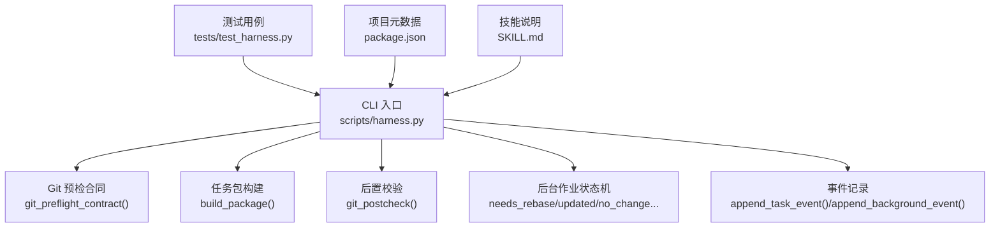
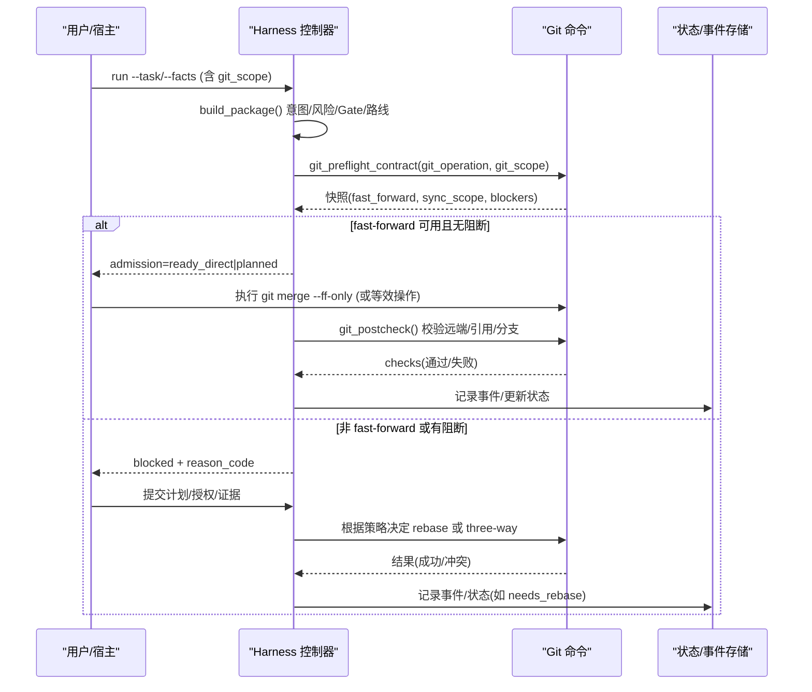
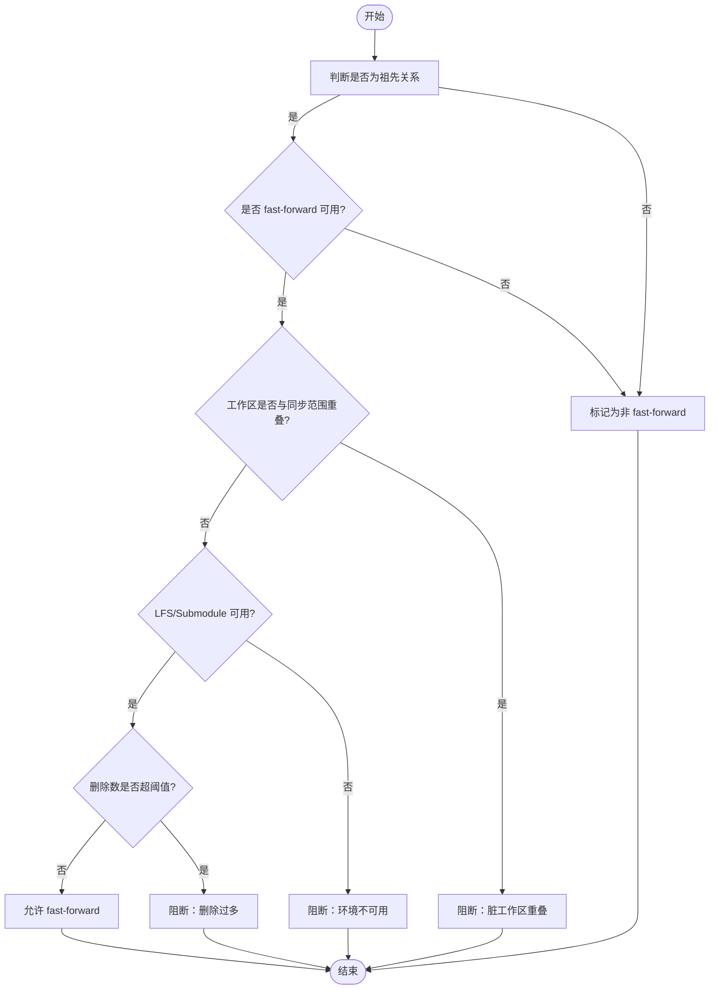
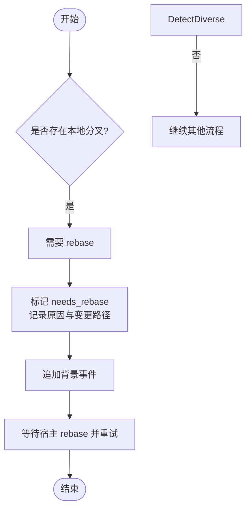
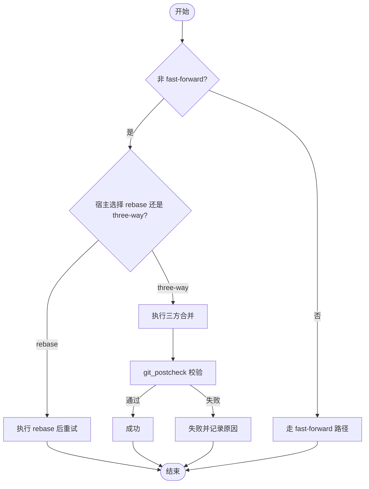
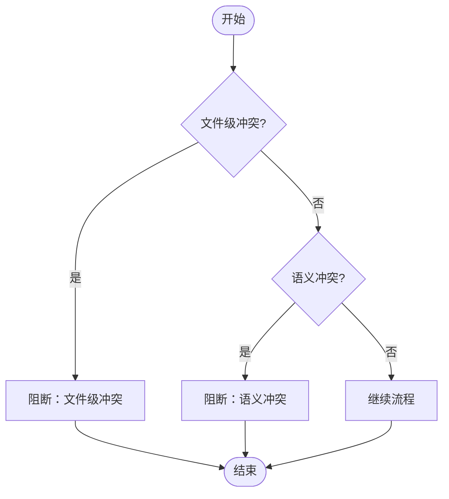
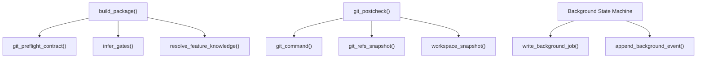

# 合并策略

<cite>
**本文引用的文件**   
- [harness.py](file://scripts/harness.py)
- [test_harness.py](file://tests/test_harness.py)
- [package.json](file://package.json)
- [SKILL.md](file://SKILL.md)
</cite>

## 目录
1. [简介](#简介)
2. [项目结构](#项目结构)
3. [核心组件](#核心组件)
4. [架构总览](#架构总览)
5. [详细组件分析](#详细组件分析)
6. [依赖关系分析](#依赖关系分析)
7. [性能考量](#性能考量)
8. [故障排除指南](#故障排除指南)
9. [结论](#结论)
10. [附录](#附录)

## 简介
本文件面向 Docs Harness 的“合并策略”主题，聚焦于快速合并（fast-forward）、变基合并（rebase）与三方合并（three-way merge）的使用场景、选择逻辑、配置项与扩展方式。结合代码实现，文档给出：
- 基于变更类型与风险级别的决策树
- 合并前检查清单（证据验证、风险评估、授权确认）
- 合并后自动处理流程（状态更新、事件触发、依赖管理）
- 冲突检测机制（文件级冲突与语义冲突）
- 实际示例与故障排除

## 项目结构
Docs Harness 的核心控制脚本位于 scripts/harness.py，测试用例在 tests/test_harness.py，项目元数据在 package.json，技能说明在 SKILL.md。合并相关能力由 harness.py 中的 Git 预检/后置校验、任务包构建、后台作业状态机与事件系统共同支撑。

**图示来源** 
- [harness.py:677-791](file://scripts/harness.py#L677-L791)
- [harness.py:2613-2908](file://scripts/harness.py#L2613-L2908)
- [harness.py:793-876](file://scripts/harness.py#L793-L876)
- [harness.py:7189-7210](file://scripts/harness.py#L7189-L7210)
- [harness.py:1031-1071](file://scripts/harness.py#L1031-L1071)
- [test_harness.py:677](file://tests/test_harness.py#L677)

**章节来源**
- [harness.py:677-791](file://scripts/harness.py#L677-L791)
- [harness.py:2613-2908](file://scripts/harness.py#L2613-L2908)
- [harness.py:793-876](file://scripts/harness.py#L793-L876)
- [harness.py:7189-7210](file://scripts/harness.py#L7189-L7210)
- [harness.py:1031-1071](file://scripts/harness.py#L1031-L1071)
- [test_harness.py:677](file://tests/test_harness.py#L677)
- [package.json:1-23](file://package.json#L1-L23)
- [SKILL.md:1-105](file://SKILL.md#L1-L105)

## 核心组件
- Git 预检合同（git_preflight_contract）
  - 计算 fast_forward、同步范围、删除数量阈值、LFS/Submodule 可用性
  - 生成快照与阻断项（脏工作区、非 fast-forward、删除过多等）
- Git 后置校验（git_postcheck）
  - 校验远端目标未漂移、受控引用未越界、分支未分叉、LFS/Submodule 有效性
- 任务包构建（build_package）
  - 意图分类、变更等级、Gate 判定、执行路线（direct/planned/extended）
  - 对 git_sync 场景强制写入范围与同步范围一致性
- 后台作业状态机
  - needs_rebase、updated、no_change、failed、cancelled 等终态与非终态
  - 需要 rebase 时记录原因与变更路径并触发事件
- 事件与审计
  - 任务事件与后台事件追加，包含阶段、耗时、重试计数等

**章节来源**
- [harness.py:677-791](file://scripts/harness.py#L677-L791)
- [harness.py:793-876](file://scripts/harness.py#L793-L876)
- [harness.py:2613-2908](file://scripts/harness.py#L2613-L2908)
- [harness.py:7189-7210](file://scripts/harness.py#L7189-L7210)
- [harness.py:1031-1071](file://scripts/harness.py#L1031-L1071)

## 架构总览
下图展示从 CLI 到 Git 操作与状态机的关键调用链，以及 fast-forward/rebase/three-way 的选择点。

**图示来源** 
- [harness.py:2613-2908](file://scripts/harness.py#L2613-L2908)
- [harness.py:677-791](file://scripts/harness.py#L677-L791)
- [harness.py:793-876](file://scripts/harness.py#L793-L876)
- [test_harness.py:677](file://tests/test_harness.py#L677)

## 详细组件分析

### 快速合并（fast-forward）
- 使用场景
  - 当前 HEAD 是远端目标的祖先（merge-base 判定），无本地分叉
  - 工作区干净且与同步范围不重叠
  - LFS/Submodule 可用且状态正常
- 选择逻辑
  - 预检中 fast_forward=True 且无阻断项时，允许直接快进
  - 测试用例以 git merge --ff-only 作为标准执行路径
- 配置与约束
  - git_scope 必须精确绑定单一远端分支（git_sync 要求）
  - 删除数量超过阈值将阻断
  - 工作区脏路径与同步范围重叠将被阻断

**图示来源** 
- [harness.py:705-751](file://scripts/harness.py#L705-L751)
- [harness.py:783](file://scripts/harness.py#L783)
- [test_harness.py:677](file://tests/test_harness.py#L677)

**章节来源**
- [harness.py:705-751](file://scripts/harness.py#L705-L751)
- [harness.py:783](file://scripts/harness.py#L783)
- [test_harness.py:677](file://tests/test_harness.py#L677)

### 变基合并（rebase）
- 使用场景
  - 当存在本地分叉导致无法 fast-forward，或上游变更影响知识 Job 基线
- 选择逻辑
  - 预检发现非 fast-forward 时阻断；需宿主执行 rebase 后再尝试
  - 知识 Job 检测到基线变化时置为 needs_rebase，并记录变更路径与原因
- 配置与约束
  - 需要宿主重新准备工件（prepare）并再次派发（dispatched/running）
  - 事件记录 includes needs_rebase 与变更路径

**图示来源** 
- [harness.py:711-751](file://scripts/harness.py#L711-L751)
- [harness.py:7189-7210](file://scripts/harness.py#L7189-L7210)
- [harness.py:1031-1071](file://scripts/harness.py#L1031-L1071)

**章节来源**
- [harness.py:711-751](file://scripts/harness.py#L711-L751)
- [harness.py:7189-7210](file://scripts/harness.py#L7189-L7210)
- [harness.py:1031-1071](file://scripts/harness.py#L1031-L1071)

### 三方合并（three-way merge）
- 使用场景
  - 当无法 fast-forward 且宿主选择进行三方合并（例如保留双方修改）
- 选择逻辑
  - 控制器不直接执行三方合并，而是通过准入与计划流程引导宿主完成
  - 若变更涉及高风险 Gate（安全、破坏性数据、外部发布），需完整重新准入
- 配置与约束
  - 变更范围与写范围必须一致（git_sync 场景）
  - 后置校验确保 controlled_ref 匹配目标 OID 且分支未分叉

**图示来源** 
- [harness.py:793-876](file://scripts/harness.py#L793-L876)
- [harness.py:2613-2908](file://scripts/harness.py#L2613-L2908)

**章节来源**
- [harness.py:793-876](file://scripts/harness.py#L793-L876)
- [harness.py:2613-2908](file://scripts/harness.py#L2613-L2908)

### 冲突检测机制
- 文件级冲突
  - 工作区脏路径与同步范围重叠被阻断
  - 删除数量超过阈值被阻断
  - 受控引用越界（outside_refs）被阻断
- 语义冲突
  - 计划补丁字段与冻结字段不一致（plan_delta_conflict）
  - 质量记录重复写入（record_conflict）
  - 安装覆盖冲突（install_conflict）

**图示来源** 
- [harness.py:745-751](file://scripts/harness.py#L745-L751)
- [harness.py:820-876](file://scripts/harness.py#L820-L876)
- [harness.py:3912-3930](file://scripts/harness.py#L3912-L3930)
- [harness.py:7027](file://scripts/harness.py#L7027)
- [harness.py:9480-9538](file://scripts/harness.py#L9480-L9538)

**章节来源**
- [harness.py:745-751](file://scripts/harness.py#L745-L751)
- [harness.py:820-876](file://scripts/harness.py#L820-L876)
- [harness.py:3912-3930](file://scripts/harness.py#L3912-L3930)
- [harness.py:7027](file://scripts/harness.py#L7027)
- [harness.py:9480-9538](file://scripts/harness.py#L9480-L9538)

### 合并前的检查清单
- 证据验证
  - 语义证据需求（semantic_evidence_requirements）与条件证据（conditional_evidence）
  - 验证命令缓存与易失路径白名单（verification.command_cache_enabled、verification.volatile_paths）
- 风险评估
  - Gate 判定（产品、架构、安全、破坏性数据、外部发布、前端设计、诊断修复、测试验收、审查审计、代码编辑、文档编辑）
  - 安全底线 gate 强制兜底（security-sensitive、destructive-data、release-external）
- 授权确认
  - authorization_requirements 与授权范围（allowed_scope、write_scope、git_scope、external_scope）
  - 计划合同指纹与范围合同指纹一致性

**章节来源**
- [harness.py:2545-2585](file://scripts/harness.py#L2545-L2585)
- [harness.py:2745-2786](file://scripts/harness.py#L2745-L2786)
- [harness.py:2915-2960](file://scripts/harness.py#L2915-L2960)
- [harness.py:1178-1214](file://scripts/harness.py#L1178-L1214)

### 合并后的自动处理流程
- 状态更新
  - 任务状态机推进（control_status、work_package_states）
  - 后台作业状态更新（needs_rebase、updated、no_change、completed_with_finding、failed、cancelled）
- 事件触发
  - 任务事件（created、readmission、verification、background events）
  - 背景事件（status、transition_rejected、needs_rebase）
- 依赖管理
  - 知识 Job 基线刷新与变更检测
  - 依赖 Job 释放等待者（bootstrap 成功后）

**章节来源**
- [harness.py:3033-3095](file://scripts/harness.py#L3033-L3095)
- [harness.py:7189-7210](file://scripts/harness.py#L7189-L7210)
- [harness.py:7387-7411](file://scripts/harness.py#L7387-L7411)
- [harness.py:1031-1071](file://scripts/harness.py#L1031-L1071)

### 配置选项与自定义扩展
- 项目配置（.docs-harness/config.json）
  - verification.volatile_paths：易失路径白名单
  - verification.command_cache_enabled：验证命令缓存开关
  - verification.auto_attribute_in_scope：自动归因开关
  - background_governance.document_routes：文档路由配置
- 规则扩展（harness-home/rules/*.md）
  - active 规则需声明 rule_id、content_fingerprint、gates/keywords、plan_fields、evidence_types、failure_mode
- 任务包扩展
  - work_packages、execution_topology、dispatch_contracts

**章节来源**
- [harness.py:1178-1214](file://scripts/harness.py#L1178-L1214)
- [harness.py:1279-1345](file://scripts/harness.py#L1279-L1345)
- [harness.py:2057-2124](file://scripts/harness.py#L2057-L2124)
- [harness.py:2428-2486](file://scripts/harness.py#L2428-L2486)

### 实际示例与故障排除
- 示例
  - fast-forward 成功：git merge --ff-only origin/main
  - non-fast-forward 阻断：预检返回 blockers 包含“远端目标不能从当前 HEAD fast-forward”
  - 脏工作区阻断：precheck 返回 blockers 包含“脏工作区与 git_sync 变化范围重叠”
- 故障排除
  - git_remote_drift：远端目标已漂移，需重新 fetch 并校验
  - git_ref_scope_violation：受控引用越界，检查 git_scope 与 controlled_refs_namespace
  - plan_delta_conflict：计划补丁字段与冻结字段不一致，修正 plan 字段
  - record_conflict：质量记录重复写入，避免覆盖首次事实

**章节来源**
- [test_harness.py:677](file://tests/test_harness.py#L677)
- [harness.py:710-751](file://scripts/harness.py#L710-L751)
- [harness.py:820-876](file://scripts/harness.py#L820-L876)
- [harness.py:3912-3930](file://scripts/harness.py#L3912-L3930)
- [harness.py:7027](file://scripts/harness.py#L7027)

## 依赖关系分析
- 模块内依赖
  - build_package 依赖 git_preflight_contract、infer_gates、resolve_feature_knowledge
  - git_postcheck 依赖 git_command、git_refs_snapshot、workspace_snapshot
  - 后台作业状态机依赖 write_background_job、append_background_event
- 外部依赖
  - Git 命令（git、lfs、submodule）
  - JSON/JSONL 读写、文件系统原子写入

**图示来源** 
- [harness.py:2613-2908](file://scripts/harness.py#L2613-L2908)
- [harness.py:793-876](file://scripts/harness.py#L793-L876)
- [harness.py:7189-7210](file://scripts/harness.py#L7189-L7210)

**章节来源**
- [harness.py:2613-2908](file://scripts/harness.py#L2613-L2908)
- [harness.py:793-876](file://scripts/harness.py#L793-L876)
- [harness.py:7189-7210](file://scripts/harness.py#L7189-L7210)

## 性能考量
- 快照与指纹计算
  - workspace_snapshot 对大文件采用 size+mtime 指纹，避免全量哈希
  - 非 Git 工作区快照限制文件数量上限，防止截断基线
- 验证命令缓存
  - 默认开启逐项缓存，可通过配置整体关闭
- 事件追加
  - JSONL 追加写入，避免全量读取与重写

**章节来源**
- [harness.py:1112-1136](file://scripts/harness.py#L1112-L1136)
- [harness.py:1188-1200](file://scripts/harness.py#L1188-L1200)
- [harness.py:507-530](file://scripts/harness.py#L507-L530)

## 故障排除指南
- 常见错误码与含义
  - git_remote_drift：远端目标漂移
  - git_ref_scope_violation：受控引用越界
  - plan_delta_conflict：计划补丁冲突
  - record_conflict：质量记录冲突
  - install_conflict：安装覆盖冲突
- 排查步骤
  - 检查 git_scope 与 controlled_refs_namespace
  - 检查工作区脏路径与同步范围重叠
  - 验证 LFS/Submodule 可用性
  - 核对计划字段与冻结字段一致性
  - 查看事件日志定位失败阶段

**章节来源**
- [harness.py:820-876](file://scripts/harness.py#L820-L876)
- [harness.py:3912-3930](file://scripts/harness.py#L3912-L3930)
- [harness.py:7027](file://scripts/harness.py#L7027)
- [harness.py:9480-9538](file://scripts/harness.py#L9480-L9538)

## 结论
Docs Harness 的合并策略以 fast-forward 为首选，非 fast-forward 时引导宿主选择 rebase 或 three-way。通过严格的预检与后置校验、Gate 风险评估、授权确认与事件审计，确保合并过程安全可控。配置项与规则扩展提供灵活性，适配不同项目需求。

## 附录
- 参考文件
  - [harness.py](file://scripts/harness.py)
  - [test_harness.py](file://tests/test_harness.py)
  - [package.json](file://package.json)
  - [SKILL.md](file://SKILL.md)