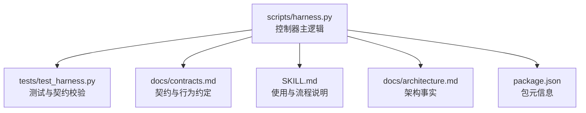
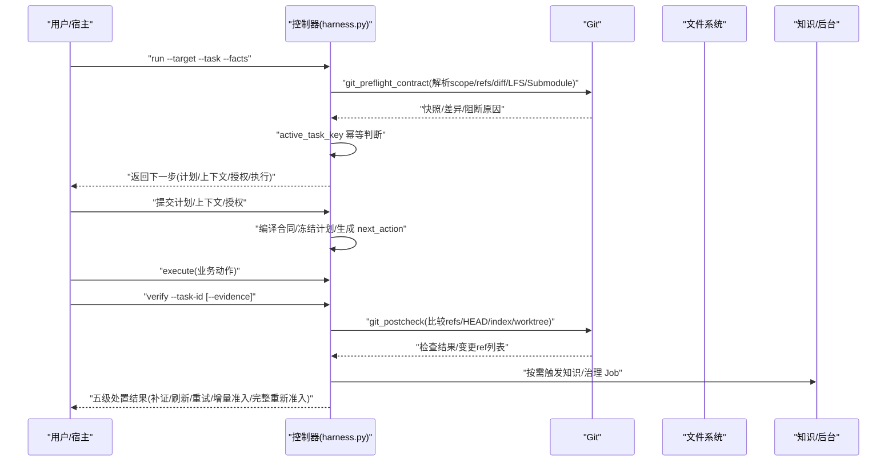
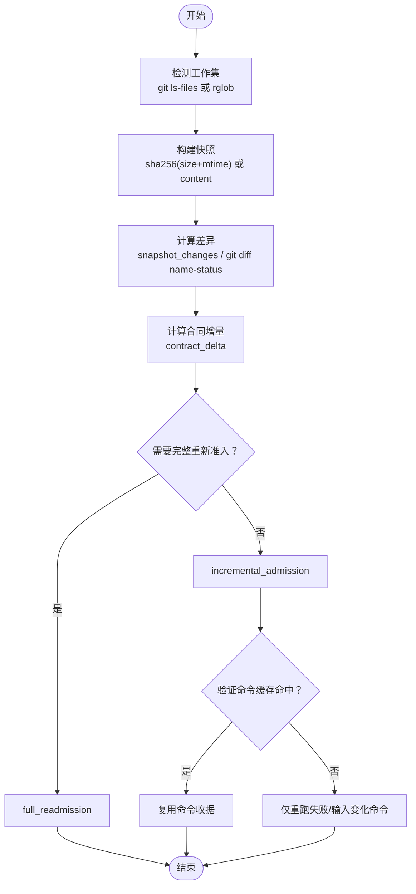
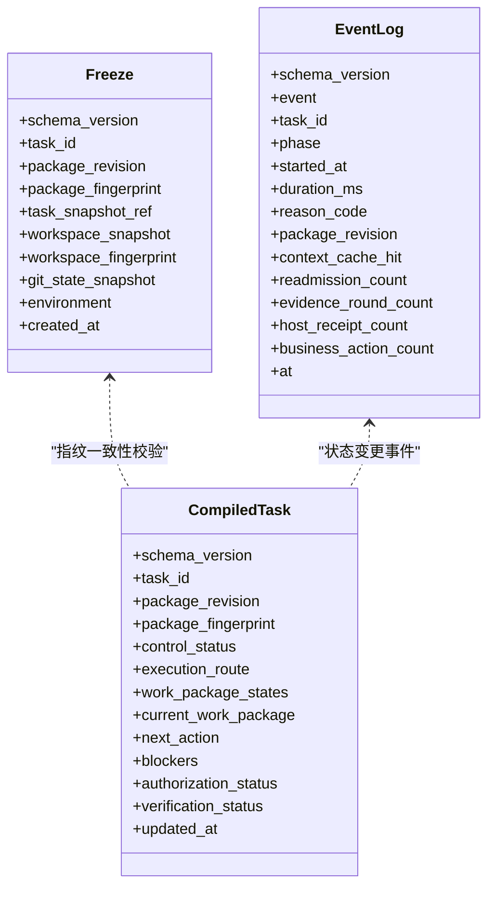
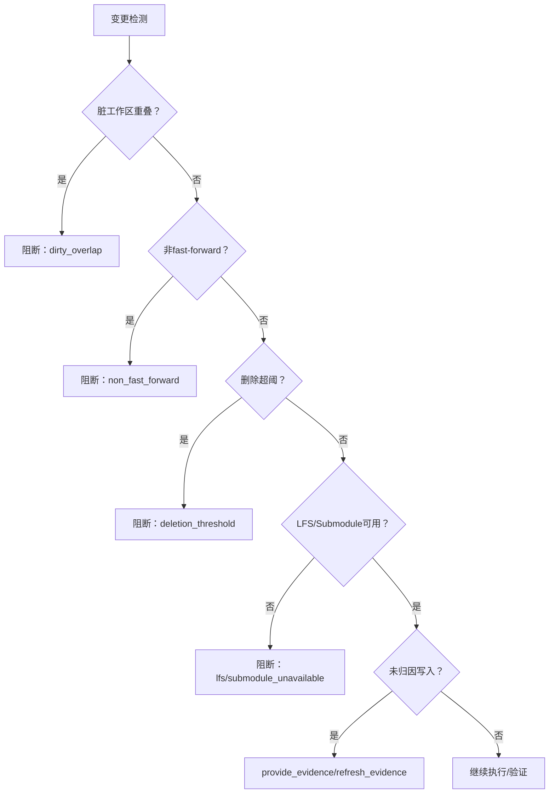
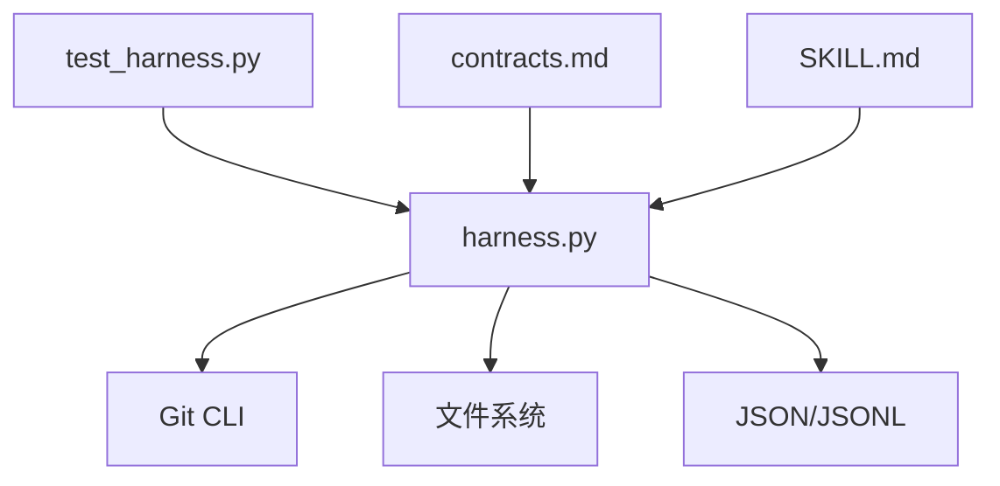

# 工作区同步机制

<cite>
**本文引用的文件**   
- [scripts/harness.py](file://scripts/harness.py)
- [tests/test_harness.py](file://tests/test_harness.py)
- [package.json](file://package.json)
- [SKILL.md](file://SKILL.md)
- [docs/contracts.md](file://docs/contracts.md)
- [docs/architecture.md](file://docs/architecture.md)
- [docs/plans/v1.6.4-minimal-systemic-flow-efficiency-plan.md](file://docs/plans/v1.6.4-minimal-systemic-flow-efficiency-plan.md)
</cite>

## 目录
1. [简介](#简介)
2. [项目结构](#项目结构)
3. [核心组件](#核心组件)
4. [架构总览](#架构总览)
5. [详细组件分析](#详细组件分析)
6. [依赖关系分析](#依赖关系分析)
7. [性能考虑](#性能考虑)
8. [故障排查指南](#故障排查指南)
9. [结论](#结论)
10. [附录](#附录)

## 简介
本文件系统化阐述 Docs Harness 的工作区同步机制，重点覆盖：
- 增量同步算法：文件变化检测、差异计算与增量更新策略
- 同步状态管理：同步点记录、进度跟踪与断点续传
- 冲突检测与解决：文件冲突识别、自动归因与人工干预接口
- 同步性能优化：并行处理、缓存机制与内存管理
- 同步安全性：原子操作、回滚机制与数据完整性验证
- 同步配置选项：同步规则、忽略模式与过滤条件
- 配置示例与调优建议
- 常见问题诊断与解决方法

## 项目结构
Docs Harness 的核心实现集中在单文件脚本中，并通过测试套件与契约文档进行约束。关键结构与职责如下：
- scripts/harness.py：控制器主逻辑，包含 Git 预检/后验、工作区快照、事件日志、任务状态机、知识地图与后台作业等
- tests/test_harness.py：端到端与单元用例，覆盖 git_fetch/git_sync 的准入、漂移、脏工作区与非快进等场景
- docs/contracts.md：契约说明，定义工作区漂移归因、Git 层验收、verify 五级处置等
- docs/architecture.md：架构事实，明确运行状态写入位置与升级策略
- SKILL.md：使用技能说明，涵盖 run/verify 流程、证据与命令缓存、git_sync 自动归因等
- package.json：包元信息与脚本入口

**图表来源** 
- [scripts/harness.py](file://scripts/harness.py)
- [tests/test_harness.py](file://tests/test_harness.py)
- [docs/contracts.md](file://docs/contracts.md)
- [SKILL.md](file://SKILL.md)
- [docs/architecture.md](file://docs/architecture.md)
- [package.json](file://package.json)

**章节来源**
- [scripts/harness.py](file://scripts/harness.py)
- [tests/test_harness.py](file://tests/test_harness.py)
- [package.json](file://package.json)
- [SKILL.md](file://SKILL.md)
- [docs/contracts.md](file://docs/contracts.md)
- [docs/architecture.md](file://docs/architecture.md)

## 核心组件
- Git 预检与后验
  - 预检：解析 git_scope、计算远端目标 OID、生成 diff 清单、检查 LFS/Submodule、脏工作区、删除阈值与非快进等
  - 后验：对比 refs 变更、HEAD/索引/工作区指纹、LFS/Submodule 有效性、受控 ref 范围
- 工作区快照与差异
  - 基于 git ls-files 或 rglob 构建快照；大文件采用 size+mtime 指纹；排除 .docs-harness 运行时目录
  - snapshot_changes 计算前后差异路径集合
- 事件与状态锁
  - append_task_event 追加结构化事件（含统计字段）
  - state_lock 提供进程级互斥与陈旧锁检测
- 任务状态机与幂等复用
  - active_task_key 基于 target_identity、任务文本、facts 与工作区快照生成幂等键
  - find_existing_active_task 复用非终态活动任务
- 验证命令缓存与证据处置
  - verification_command_cache_enabled 控制是否启用逐项缓存
  - verify 五级处置：provide_evidence、refresh_evidence、retry_verification、incremental_admission、full_readmission

**章节来源**
- [scripts/harness.py:677-791](file://scripts/harness.py#L677-L791)
- [scripts/harness.py:793-876](file://scripts/harness.py#L793-L876)
- [scripts/harness.py:1112-1136](file://scripts/harness.py#L1112-L1136)
- [scripts/harness.py:1138-1139](file://scripts/harness.py#L1138-L1139)
- [scripts/harness.py:1031-1071](file://scripts/harness.py#L1031-L1071)
- [scripts/harness.py:1008-1029](file://scripts/harness.py#L1008-L1029)
- [scripts/harness.py:3756-3794](file://scripts/harness.py#L3756-L3794)
- [scripts/harness.py:1188-1214](file://scripts/harness.py#L1188-L1214)
- [docs/contracts.md:134-163](file://docs/contracts.md#L134-L163)

## 架构总览
下图展示“run → 预检 → 执行 → verify 后验”的主流程，以及 Git 层与知识治理层的交互。

**图表来源** 
- [scripts/harness.py:677-791](file://scripts/harness.py#L677-L791)
- [scripts/harness.py:793-876](file://scripts/harness.py#L793-L876)
- [scripts/harness.py:3756-3794](file://scripts/harness.py#L3756-L3794)
- [docs/contracts.md:134-163](file://docs/contracts.md#L134-L163)
- [SKILL.md:53-57](file://SKILL.md#L53-L57)

## 详细组件分析

### 增量同步算法：文件变化检测、差异计算与增量更新
- 文件变化检测
  - 优先使用 git ls-files 获取工作集；非 Git 环境回退到 rglob，并限制最大文件数以避免截断基线
  - 大文件采用 size+mtime 指纹，小文件采用 sha256 内容指纹
- 差异计算
  - snapshot_changes 对 before/after 快照做集合差，得到变更路径列表
  - git_name_status_paths 解析 git diff --name-status -M 输出，支持重命名路径还原
- 增量更新策略
  - 通过 contract_delta 计算新增 Gate/计划字段/上下文引用/证据类型，决定增量准入还是完整重新准入
  - 验证命令逐项缓存：输入指纹不变则复用已通过命令收据，失败或输入变化仅重跑相关命令

**图表来源** 
- [scripts/harness.py:1112-1136](file://scripts/harness.py#L1112-L1136)
- [scripts/harness.py:1138-1139](file://scripts/harness.py#L1138-L1139)
- [scripts/harness.py:645-658](file://scripts/harness.py#L645-L658)
- [scripts/harness.py:3008-3031](file://scripts/harness.py#L3008-L3031)
- [scripts/harness.py:1188-1214](file://scripts/harness.py#L1188-L1214)

**章节来源**
- [scripts/harness.py:1112-1136](file://scripts/harness.py#L1112-L1136)
- [scripts/harness.py:1138-1139](file://scripts/harness.py#L1138-L1139)
- [scripts/harness.py:645-658](file://scripts/harness.py#L645-L658)
- [scripts/harness.py:3008-3031](file://scripts/harness.py#L3008-L3031)
- [scripts/harness.py:1188-1214](file://scripts/harness.py#L1188-L1214)

### 同步状态管理：同步点记录、进度跟踪与断点续传
- 同步点记录
  - freeze.json 保存首次任务基线（workspace_snapshot、environment、package_fingerprint），后续重新准入不刷新
  - events.jsonl 记录各阶段事件（admission/context/verification/lifecycle），附带统计计数
- 进度跟踪
  - compiled-task.json 维护 control_status、work_package_states、next_action、blockers 等
  - background jobs 的 Plan/Progress 由控制器控制面写入，确保一致性
- 断点续传
  - state_lock 提供进程级互斥，陈旧锁超过 5 分钟需人工清理
  - v1→v2 迁移支持 journal + backup 全量回滚，中断后可恢复

**图表来源** 
- [scripts/harness.py:3062-3095](file://scripts/harness.py#L3062-L3095)
- [scripts/harness.py:3033-3060](file://scripts/harness.py#L3033-L3060)
- [scripts/harness.py:1031-1071](file://scripts/harness.py#L1031-L1071)
- [scripts/harness.py:1008-1029](file://scripts/harness.py#L1008-L1029)
- [scripts/harness.py:3194-3327](file://scripts/harness.py#L3194-L3327)

**章节来源**
- [scripts/harness.py:3062-3095](file://scripts/harness.py#L3062-L3095)
- [scripts/harness.py:3033-3060](file://scripts/harness.py#L3033-L3060)
- [scripts/harness.py:1031-1071](file://scripts/harness.py#L1031-L1071)
- [scripts/harness.py:1008-1029](file://scripts/harness.py#L1008-L1029)
- [scripts/harness.py:3194-3327](file://scripts/harness.py#L3194-L3327)

### 冲突检测与解决：文件冲突识别、自动解决与人工干预
- 冲突识别
  - 脏工作区与 sync 范围重叠直接阻断
  - 非 fast-forward、分支分歧、删除数量超阈均阻断
  - LFS/Submodule 不可用或状态异常阻断
  - 未归因写入与读写范围重叠触发 provide_evidence/refresh_evidence
- 自动解决
  - write_scope 内写入默认自动归因（可关闭），生成 workspace_attribution 收据
  - git_sync_landed_scope 累积 pull 落盘文件范围，自动认领变更
- 人工干预
  - 陈旧锁需人工清理
  - 归档/取消需提供 reason_code，且幂等保护
  - 复杂背景 Job 的 prepare/dispatch/progress/verify 由控制器控制面写入，宿主不得越权

**图表来源** 
- [scripts/harness.py:677-791](file://scripts/harness.py#L677-L791)
- [scripts/harness.py:793-876](file://scripts/harness.py#L793-L876)
- [docs/contracts.md:134-163](file://docs/contracts.md#L134-L163)
- [SKILL.md:53-57](file://SKILL.md#L53-L57)

**章节来源**
- [scripts/harness.py:677-791](file://scripts/harness.py#L677-L791)
- [scripts/harness.py:793-876](file://scripts/harness.py#L793-L876)
- [docs/contracts.md:134-163](file://docs/contracts.md#L134-L163)
- [SKILL.md:53-57](file://SKILL.md#L53-L57)

### 同步性能优化：并行处理、缓存机制与内存管理
- 并行处理
  - 控制器以单进程为主，但通过事件与收据解耦，避免长事务阻塞
  - 后台 Job 支持分阶段推进，减少主流程等待
- 缓存机制
  - 验证命令逐项缓存：输入指纹不变即复用，失败或输入变化仅重跑相关命令
  - 上下文正文跨阶段复用：按 task/target/compiler contract 与内容指纹去重
- 内存管理
  - 大文件指纹采用 size+mtime，避免读取大内容
  - 非 Git 快照限制文件数量，防止内存膨胀

**章节来源**
- [scripts/harness.py:1188-1214](file://scripts/harness.py#L1188-L1214)
- [docs/plans/v1.6.4-minimal-systemic-flow-efficiency-plan.md:493-506](file://docs/plans/v1.6.4-minimal-systemic-flow-efficiency-plan.md#L493-L506)
- [scripts/harness.py:1112-1136](file://scripts/harness.py#L1112-L1136)

### 同步安全性：原子操作、回滚机制与数据完整性验证
- 原子操作
  - atomic_write_text/json 使用临时文件 + os.replace，保证写入原子性
  - state_lock 与 disposition_index_lock 提供进程级互斥
- 回滚机制
  - v1→v2 迁移使用 staging + backup + journal，中断后自动回滚
  - 任务取消/归档具备幂等保护，禁止覆盖首次处置事实
- 数据完整性
  - package_fingerprint 在 package/compiled/freeze 间强一致校验
  - git_postcheck 校验 HEAD/index/worktree/ref 一致性

**章节来源**
- [scripts/harness.py:419-435](file://scripts/harness.py#L419-L435)
- [scripts/harness.py:1008-1029](file://scripts/harness.py#L1008-L1029)
- [scripts/harness.py:3194-3327](file://scripts/harness.py#L3194-L3327)
- [scripts/harness.py:3396-3493](file://scripts/harness.py#L3396-L3493)
- [scripts/harness.py:3098-3114](file://scripts/harness.py#L3098-L3114)
- [scripts/harness.py:793-876](file://scripts/harness.py#L793-L876)

### 同步配置选项：同步规则、忽略模式与过滤条件
- 项目配置
  - .docs-harness/config.json 支持 rules_root、verification.command_cache_enabled、verification.auto_attribute_in_scope、verification.volatile_paths 等
- 忽略模式
  - excluded_workspace_path 排除 .git/.docs-harness 运行时目录
  - git_ignored_install_paths 利用 git check-ignore 判定安装路径是否被忽略
- 过滤条件
  - document_route_config 严格校验路由路径与安全边界
  - scope_covers 支持 */** 与 fnmatch 匹配

**章节来源**
- [scripts/harness.py:1178-1214](file://scripts/harness.py#L1178-L1214)
- [scripts/harness.py:1073-1084](file://scripts/harness.py#L1073-L1084)
- [scripts/harness.py:878-904](file://scripts/harness.py#L878-L904)
- [scripts/harness.py:1287-1346](file://scripts/harness.py#L1287-L1346)
- [scripts/harness.py:2356-2363](file://scripts/harness.py#L2356-L2363)

## 依赖关系分析
- 模块耦合
  - harness.py 内部函数高度内聚，围绕 Git、文件系统、JSON/JSONL、事件与状态机展开
  - 测试用例通过导入模块方式调用核心函数，验证契约与行为
- 外部依赖
  - Git CLI（ls-remote、diff、status、lfs、submodule）
  - 文件系统（原子写、锁、rglob）
  - JSON/JSONL（读写与校验）
- 潜在循环依赖
  - 无循环 import，函数式组织清晰

**图表来源** 
- [scripts/harness.py](file://scripts/harness.py)
- [tests/test_harness.py](file://tests/test_harness.py)
- [docs/contracts.md](file://docs/contracts.md)
- [SKILL.md](file://SKILL.md)

**章节来源**
- [scripts/harness.py](file://scripts/harness.py)
- [tests/test_harness.py](file://tests/test_harness.py)
- [docs/contracts.md](file://docs/contracts.md)
- [SKILL.md](file://SKILL.md)

## 性能考虑
- 验证命令缓存：默认开启，可通过配置整体关闭；单项失败不影响其他命令
- 快照构建：优先 git ls-files，非 Git 环境限制文件数量
- 事件与收据：只记录有界字段与指纹，避免敏感信息泄露
- 后台 Job：分阶段推进，减少主流程阻塞

[本节为通用指导，无需特定文件来源]

## 故障排查指南
- 常见错误码与原因
  - git_remote_drift：远端目标变化，需完整重新准入
  - git_ref_scope_violation：ref 越界，检查 controlled_refs_namespace
  - stale_lock：状态锁陈旧，需人工清理
  - invalid_json/missing_file：JSON 无效或缺失，检查工件完整性
- 定位步骤
  - 查看 events.jsonl 最近事件，确认 phase 与 reason_code
  - 检查 compiled-task.json 的 control_status 与 blockers
  - 使用 git_postcheck 结果定位具体检查项失败原因
- 恢复建议
  - 清理陈旧锁后重试
  - 修正脏工作区或分支分歧后重新 run
  - 补充缺失证据或刷新读集后 refresh_evidence

**章节来源**
- [scripts/harness.py:793-876](file://scripts/harness.py#L793-L876)
- [scripts/harness.py:1008-1029](file://scripts/harness.py#L1008-L1029)
- [scripts/harness.py:1031-1071](file://scripts/harness.py#L1031-L1071)
- [docs/contracts.md:134-163](file://docs/contracts.md#L134-L163)

## 结论
Docs Harness 的工作区同步机制以 Git 预检/后验为核心，结合工作区快照、事件日志与任务状态机，实现了安全、可审计、可恢复的增量同步。通过五级 verify 处置、验证命令缓存与原子/回滚保障，系统在性能与安全性之间取得平衡。配置项与忽略模式提供了灵活的过滤能力，便于在不同项目环境中稳定运行。

[本节为总结，无需特定文件来源]

## 附录
- 配置示例
  - verification.command_cache_enabled=false：关闭验证命令缓存
  - verification.auto_attribute_in_scope=false：关闭自动归因，走人工补证流程
  - verification.volatile_paths：追加带固定根目录的 glob 白名单
- 调优建议
  - 合理设置 scope 与 ignore，减少无关文件参与快照
  - 使用 git_scope 精确绑定远端分支，避免模糊匹配
  - 监控 events.jsonl 中的 readmission_count 与 evidence_round_count，定位瓶颈

**章节来源**
- [scripts/harness.py:1188-1214](file://scripts/harness.py#L1188-L1214)
- [scripts/harness.py:1073-1084](file://scripts/harness.py#L1073-L1084)
- [scripts/harness.py:661-675](file://scripts/harness.py#L661-L675)
- [scripts/harness.py:1031-1071](file://scripts/harness.py#L1031-L1071)