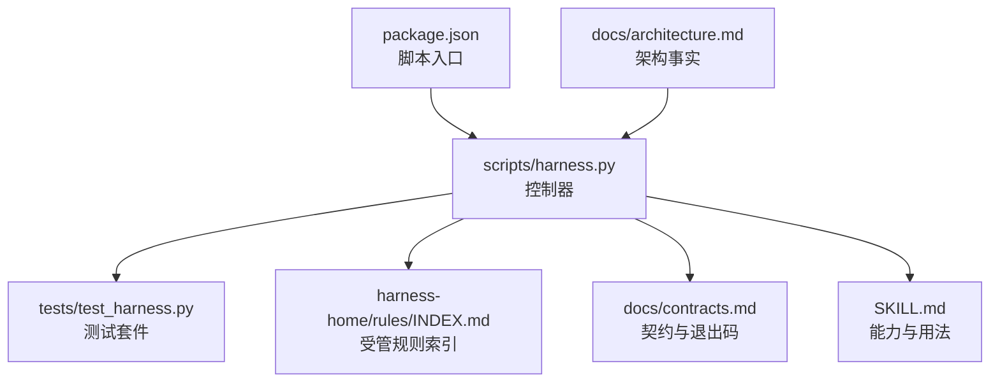
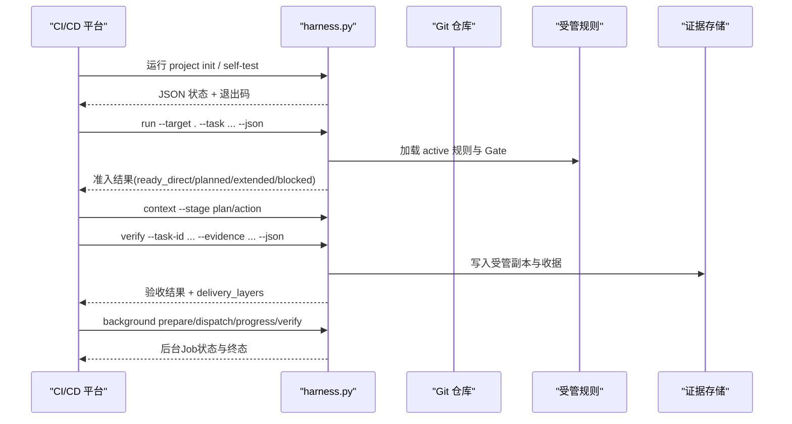
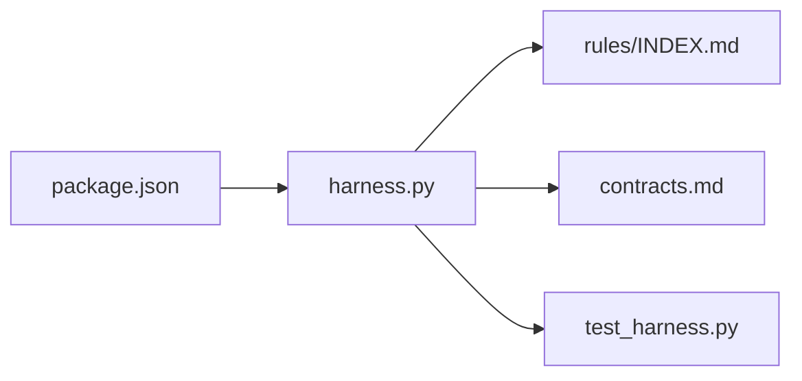

# CI/CD管道集成

<cite>
**本文引用的文件**   
- [scripts/harness.py](file://scripts/harness.py)
- [tests/test_harness.py](file://tests/test_harness.py)
- [package.json](file://package.json)
- [SKILL.md](file://SKILL.md)
- [harness-home/rules/INDEX.md](file://harness-home/rules/INDEX.md)
- [docs/architecture.md](file://docs/architecture.md)
- [docs/contracts.md](file://docs/contracts.md)
</cite>

## 目录
1. [简介](#简介)
2. [项目结构](#项目结构)
3. [核心组件](#核心组件)
4. [架构总览](#架构总览)
5. [详细组件分析](#详细组件分析)
6. [依赖关系分析](#依赖关系分析)
7. [性能考虑](#性能考虑)
8. [故障诊断指南](#故障诊断指南)
9. [结论](#结论)
10. [附录：CI/CD平台集成模板与示例](#附录cicd平台集成模板与示例)

## 简介
本文件面向在主流CI/CD平台（GitHub Actions、Jenkins、GitLab CI）中集成 Docs Harness 的工程师，提供从触发器配置、状态反馈、流水线编排到环境管理的完整实践指南。Docs Harness 以独立 Python 控制器为核心，通过 CLI 命令驱动任务准入、上下文装配、证据验收与后台治理，所有关键行为由受管合同与规则约束，确保可审计、可回滚、失败关闭。

## 项目结构
- scripts/harness.py：控制器源码真源，负责项目安装与升级、任务准入、上下文、验收、知识生命周期和后台 Job 状态机。
- tests/test_harness.py：覆盖 CLI 行为、Git 预检/后检、证据与验证命令、后台 Job 流程等。
- package.json：定义脚本入口与自检命令，便于在 CI 中统一调用。
- SKILL.md：对外能力说明与使用约定，包括 run/verify/background/ledger 等命令语义。
- harness-home/rules/INDEX.md：随包发布的受管规则快照与激活条件。
- docs/architecture.md：架构事实与边界说明。
- docs/contracts.md：v1.6.6 合同，包含 task-package/v2、evidence-receipt/v2、退出码、交付层等。

**图表来源** 
- [scripts/harness.py:1-100](file://scripts/harness.py#L1-L100)
- [tests/test_harness.py:1-120](file://tests/test_harness.py#L1-L120)
- [harness-home/rules/INDEX.md:1-41](file://harness-home/rules/INDEX.md#L1-L41)
- [docs/contracts.md:1-120](file://docs/contracts.md#L1-L120)
- [SKILL.md:1-60](file://SKILL.md#L1-L60)
- [package.json:1-23](file://package.json#L1-L23)
- [docs/architecture.md:1-26](file://docs/architecture.md#L1-L26)

**章节来源**
- [docs/architecture.md:1-26](file://docs/architecture.md#L1-L26)
- [package.json:1-23](file://package.json#L1-L23)

## 核心组件
- 控制器与CLI：提供 project/run/context/verify/background/ledger/task 等子命令，驱动任务全生命周期。
- 任务包与意图：task-package/v2 描述意图、变更面、范围、允许动作；支持 query/audit/git_inspect/git_fetch/git_sync/modify/external_write。
- 证据与验收：evidence-receipt/v2 绑定任务、目标、包指纹、可信生产者、读写集合；verify 按清单与策略执行五级处置。
- Git 预检/后检：git_preflight_contract/git_postcheck 保障 fetch/sync 安全边界、远端漂移、LFS/Submodule 校验。
- 后台治理：background prepare/dispatch/progress/verify/retry 管理复杂 Job，支持多路线与分阶段推进。
- 规则与Gate：受管规则快照与 Gate 机制保证安全底线与合规性。

**章节来源**
- [docs/contracts.md:1-200](file://docs/contracts.md#L1-L200)
- [scripts/harness.py:260-420](file://scripts/harness.py#L260-L420)
- [SKILL.md:20-100](file://SKILL.md#L20-L100)

## 架构总览
Docs Harness 在 CI 中以“命令即步骤”的方式嵌入流水线，每个步骤通过 JSON 输出与退出码向平台上报状态。控制器不自动提交/推送/发布，也不合并各层完成结论，而是将源码、本地验证、Git HEAD/远端、fresh clone、发布产物、UI 与外部状态作为独立验收层。

**图表来源** 
- [SKILL.md:20-100](file://SKILL.md#L20-L100)
- [docs/contracts.md:1-120](file://docs/contracts.md#L1-L120)
- [scripts/harness.py:540-800](file://scripts/harness.py#L540-L800)

## 详细组件分析

### 触发器配置：事件监听、条件判断与并行执行
- 事件监听
  - GitHub Actions：监听 push、pull_request、workflow_dispatch 等事件，在 job 中调用 harness.py 子命令。
  - Jenkins：在 Pipeline 的 stage 中通过 sh/python 调用 harness.py，或使用插件触发。
  - GitLab CI：在 .gitlab-ci.yml 中定义 rules/only/except 或 trigger 规则。
- 条件判断
  - 基于分支、标签、路径过滤（如仅 docs/** 变更时触发文档相关任务）。
  - 结合 harness 返回的 admission_status 与 exit code 决定下一步。
- 并行执行
  - 对只读查询、审计、git_inspect 等 read_only 任务可并行执行。
  - 对 git_fetch/git_sync/modify/external_write 等写操作需串行化或加锁，避免并发冲突。

**章节来源**
- [docs/contracts.md:1-120](file://docs/contracts.md#L1-L120)
- [SKILL.md:20-60](file://SKILL.md#L20-L60)

### 状态反馈机制：构建状态上报、测试结果传递与通知发送
- 构建状态上报
  - 使用 harness 命令的 JSON 输出解析 status/control_status/admission_status 等字段。
  - 依据退出码映射平台状态：0成功、1检查失败、2输入无效、3需方案/授权/证据、4需重新准入。
- 测试结果传递
  - 通过 evidence-receipt/v2 提交 test_result 等证据，包含 task_id、target_identity、package_fingerprint、producer、read_set/write_set 等。
  - verify 会生成受管副本并记录收据，后续复用或增量消费。
- 通知发送
  - 根据 exit code 与 status 字段触发平台通知（邮件、Slack、Webhook），区分“需要人工介入”与“自动修复”。

**章节来源**
- [docs/contracts.md:120-220](file://docs/contracts.md#L120-L220)
- [tests/test_harness.py:50-120](file://tests/test_harness.py#L50-L120)

### 流水线编排：任务依赖管理、资源调度与失败恢复
- 任务依赖
  - 通过 candidate_intents/deferred_intents 表达潜在依赖，按最高 mutation_profile 确定执行权限。
  - 使用 completion_manifest 声明 required_evidence_types/verification_commands 等收尾要求。
- 资源调度
  - 只读任务可并行；写任务需串行或加锁；Git sync/fetch 需锁定工作区与 refs。
  - 后台 Job 通过 prepare/dispatch/progress/verify 顺序控制，避免竞态。
- 失败恢复
  - 五级处置：provide_evidence/refresh_evidence/retry_verification/incremental_admission/full_readmission。
  - 支持 retry 与 repair，保留幂等键与 attempt 计数，失败归档不污染父任务。

**章节来源**
- [docs/contracts.md:200-372](file://docs/contracts.md#L200-L372)
- [scripts/harness.py:760-800](file://scripts/harness.py#L760-L800)

### 环境管理：环境变量配置、密钥管理与部署目标管理
- 环境变量
  - 在 CI 中注入 GIT_*、PYTHONPATH、自定义变量，避免硬编码。
  - harness 命令接受 --target 指定项目根，避免绝对路径泄露。
- 密钥管理
  - 使用平台 Secret Manager 注入凭据，不在日志与输出中暴露。
  - 控制器对远程 URL 脱敏计算指纹，Runtime 不保存原文。
- 部署目标管理
  - 通过 external_scope 与 delivery_layers 声明远端/发布/安装目标，按需启用。
  - 禁止自动提交/推送/发布，由宿主显式决策。

**章节来源**
- [docs/contracts.md:1-120](file://docs/contracts.md#L1-L120)
- [scripts/harness.py:580-620](file://scripts/harness.py#L580-L620)

## 依赖关系分析
- 控制器依赖受管规则与契约，运行时读取 knowledge-map.json 与规则索引。
- 测试套件通过 subprocess 调用 harness.py，断言 CLI 行为与状态机。
- package.json 提供统一脚本入口，便于 CI 复用。

**图表来源** 
- [scripts/harness.py:1-100](file://scripts/harness.py#L1-L100)
- [harness-home/rules/INDEX.md:1-41](file://harness-home/rules/INDEX.md#L1-L41)
- [docs/contracts.md:1-120](file://docs/contracts.md#L1-L120)
- [tests/test_harness.py:1-120](file://tests/test_harness.py#L1-L120)
- [package.json:1-23](file://package.json#L1-L23)

**章节来源**
- [docs/architecture.md:1-26](file://docs/architecture.md#L1-L26)

## 性能考虑
- 只读任务并行执行，缩短整体耗时。
- 证据与验证命令缓存：相同输入复用收据，减少重复执行。
- 背景 Job 分阶段推进，避免长事务阻塞。
- 限制事件与日志大小，仅保存有界字段，降低 I/O 压力。

[本节为通用指导，无需特定文件引用]

## 故障诊断指南
- 常见退出码
  - 0：成功；只有 verify.result=完成 表示父任务完成。
  - 1：项目检查、自检或完整性读取失败。
  - 2：输入、合同、绑定或状态无效。
  - 3：需要方案、授权、证据、迁移、用户输入或 Git 交付。
  - 4：范围、漂移、Gate、远端、授权或规则变化，必须重新准入。
- 诊断步骤
  - 查看 harness JSON 输出中的 status/control_status/admission_status。
  - 检查 evidence 与 verification command receipt 是否有效。
  - 确认 Git 预检/后检是否通过（远端漂移、LFS/Submodule）。
  - 核对 active 规则指纹与契约版本一致性。

**章节来源**
- [docs/contracts.md:300-372](file://docs/contracts.md#L300-L372)
- [tests/test_harness.py:500-760](file://tests/test_harness.py#L500-L760)

## 结论
Docs Harness 以强契约与受管规则为基础，在 CI/CD 中提供可审计、可回滚、失败关闭的任务控制能力。通过标准化 CLI 与 JSON 输出，平台可稳定接入状态上报、证据传递与后台治理，实现端到端的文档与代码治理流水线。

[本节为总结，无需特定文件引用]

## 附录：CI/CD平台集成模板与示例

### GitHub Actions
- 触发器：push/pull_request/workflow_dispatch
- 步骤建议
  - 初始化：python3 scripts/harness.py project init --target . --json
  - 自检：python3 scripts/harness.py self-test --target . --json
  - 任务准入：python3 scripts/harness.py run --target . --task "<任务>" --json
  - 上下文：python3 scripts/harness.py context --target . --task-id <id> --stage plan/action
  - 验收：python3 scripts/harness.py verify --target . --task-id <id> --evidence <file> --json
  - 后台：prepare/dispatch/progress/verify/retry
- 状态映射：根据 exit code 与 JSON status 设置 job 状态与通知。

**章节来源**
- [package.json:17-21](file://package.json#L17-L21)
- [SKILL.md:20-100](file://SKILL.md#L20-L100)

### Jenkins
- 触发器：Pipeline 阶段或 SCM 变更触发
- 步骤建议
  - 使用 sh/python 调用 harness.py 子命令，捕获 stdout JSON 与 exit code。
  - 将 JSON 输出保存到 artifacts，便于回溯。
  - 对 write 任务加锁或串行执行，避免并发冲突。
- 状态映射：根据 exit code 与 status 设置 stage 状态与通知。

**章节来源**
- [tests/test_harness.py:50-120](file://tests/test_harness.py#L50-L120)
- [docs/contracts.md:300-372](file://docs/contracts.md#L300-L372)

### GitLab CI
- 触发器：.gitlab-ci.yml 中 rules/only/except 或 trigger
- 步骤建议
  - 定义 stages：init、run、context、verify、background
  - 在每个 stage 中调用 harness.py 子命令，解析 JSON 输出。
  - 使用 artifacts 保存中间结果与证据。
- 状态映射：根据 exit code 与 status 设置 job 状态与通知。

**章节来源**
- [SKILL.md:20-100](file://SKILL.md#L20-L100)
- [docs/contracts.md:1-120](file://docs/contracts.md#L1-L120)