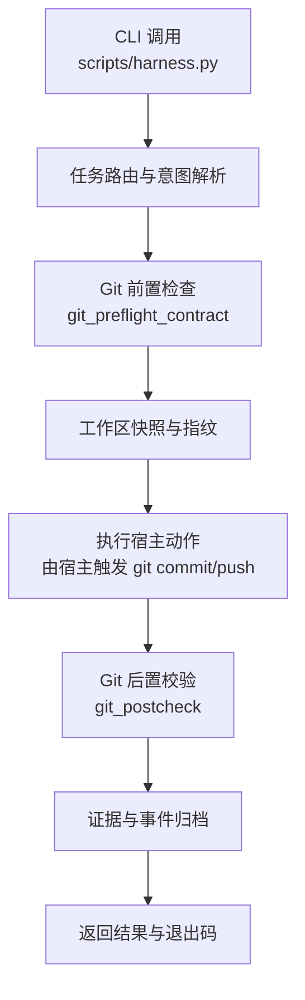
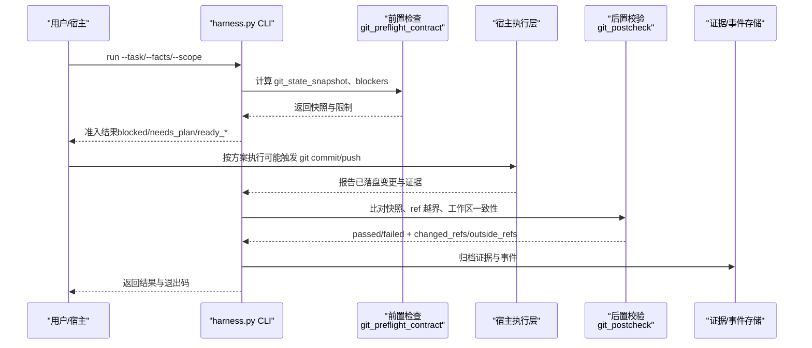
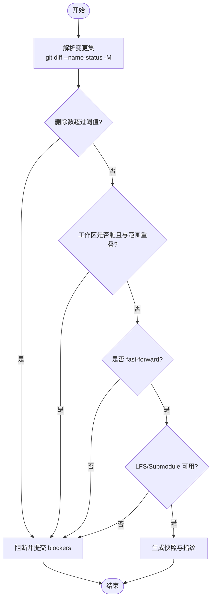
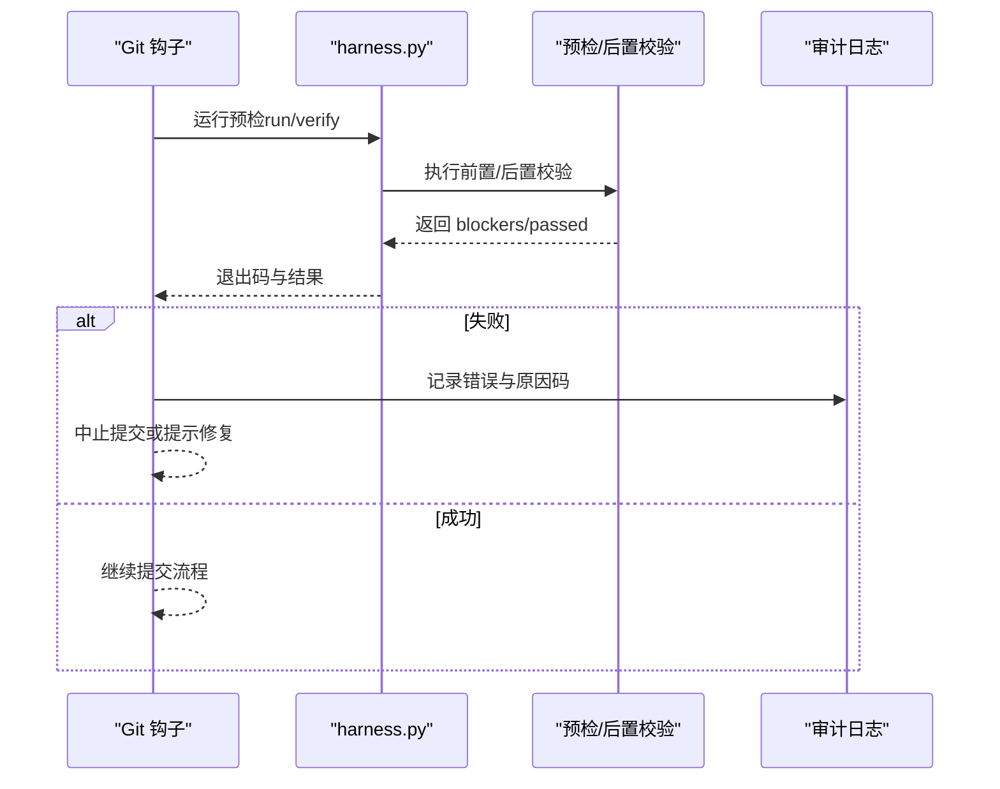
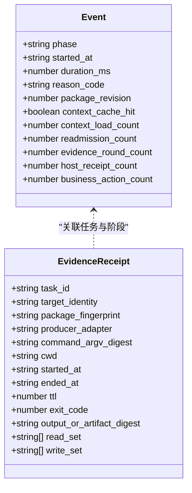
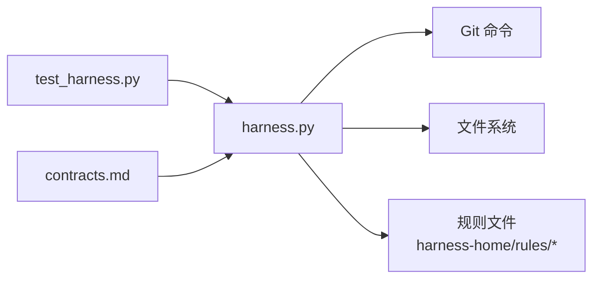

# Git提交管理

<cite>
**本文引用的文件**   
- [scripts/harness.py](file://scripts/harness.py)
- [tests/test_harness.py](file://tests/test_harness.py)
- [package.json](file://package.json)
- [SKILL.md](file://SKILL.md)
- [harness-home/rules/INDEX.md](file://harness-home/rules/INDEX.md)
- [harness-home/rules/_rule-template.md](file://harness-home/rules/_rule-template.md)
- [harness-home/rules/documentation-changes.md](file://harness-home/rules/documentation-changes.md)
- [harness-home/rules/api-compatibility.md](file://harness-home/rules/api-compatibility.md)
- [harness-home/rules/external-input-security.md](file://harness-home/rules/external-input-security.md)
- [harness-home/rules/testing-release.md](file://harness-home/rules/testing-release.md)
- [docs/contracts.md](file://docs/contracts.md)
</cite>

## 目录
1. [简介](#简介)
2. [项目结构](#项目结构)
3. [核心组件](#核心组件)
4. [架构总览](#架构总览)
5. [详细组件分析](#详细组件分析)
6. [依赖关系分析](#依赖关系分析)
7. [性能考量](#性能考量)
8. [故障排除指南](#故障排除指南)
9. [结论](#结论)
10. [附录](#附录)

## 简介
本文件面向 Docs Harness 的“Git 提交管理”能力，聚焦以下目标：
- 自动提交机制：文件变更检测、批量提交策略与条件提交的实现原理
- 提交消息模板系统：变量替换、格式化规则与自定义模板开发
- 提交钩子集成：预提交检查、提交后验证与错误处理
- 提交历史可追溯性：签名验证、时间戳管理与审计日志
- 配置示例、最佳实践与故障排除
- 自动化提交流程的代码级示例（以路径引用代替代码片段）

重要边界说明：Docs Harness 控制器本身不自动执行 git commit/push/release，也不修改 .gitignore。它通过任务意图、范围约束、证据与验收流程来驱动宿主完成提交与发布动作，并提供严格的 Git 状态契约、前置检查与后置校验，确保提交的可控性与可审计性。

**章节来源**
- [SKILL.md:1-105](file://SKILL.md#L1-L105)
- [docs/contracts.md:1-10](file://docs/contracts.md#L1-L10)

## 项目结构
- scripts/harness.py：核心控制器，包含 Git 操作、前置/后置校验、工作区快照、证据与事件等
- tests/test_harness.py：覆盖 Git inspect/fetch/sync、漂移与脏工作区、非 fast-forward、LFS/Submodule 可用性、提交与推送等场景
- package.json：版本与脚本入口
- harness-home/rules/*：规则与 Gate 定义，影响准入与验收
- docs/contracts.md：合同与行为约定，包括 Git 状态契约、证据收据、退出码等

**图表来源**
- [scripts/harness.py:677-791](file://scripts/harness.py#L677-L791)
- [scripts/harness.py:793-800](file://scripts/harness.py#L793-L800)
- [docs/contracts.md:97-133](file://docs/contracts.md#L97-L133)

**章节来源**
- [package.json:1-23](file://package.json#L1-L23)
- [harness-home/rules/INDEX.md:1-41](file://harness-home/rules/INDEX.md#L1-L41)

## 核心组件
- Git 前置检查（preflight）：对 fetch/sync 进行严格约束，包括远端引用、fast-forward、删除阈值、LFS/Submodule 可用性与脏工作区重叠检测
- Git 后置校验（postcheck）：对比快照，确认受控 ref 变化、未越界写入与工作区一致性
- 工作区快照与指纹：用于漂移检测与归因，支持 volatile 临时产物白名单
- 证据与事件：v2 证据收据、命令缓存收据、事件脱敏记录
- 规则与 Gate：文档修改、API 兼容、外部输入安全、测试放行等规则影响准入与验收

关键函数与常量（仅列名与作用，具体实现见源码路径）：
- git_command / git_root / git_dir：封装 Git 调用与仓库定位
- git_preflight_contract：生成 git_state_snapshot 与 blockers
- git_postcheck：产出 passed/failed 与 changed_refs/outside_refs
- file_fingerprint / sha256_text / canonical_json：内容指纹与规范化
- append_jsonl / read_jsonl：事件与收据追加/读取
- target_identity / sanitized_remote_fingerprint：目标与远端指纹

**章节来源**
- [scripts/harness.py:572-583](file://scripts/harness.py#L572-L583)
- [scripts/harness.py:677-791](file://scripts/harness.py#L677-L791)
- [scripts/harness.py:793-800](file://scripts/harness.py#L793-L800)
- [scripts/harness.py:407-417](file://scripts/harness.py#L407-L417)
- [scripts/harness.py:507-529](file://scripts/harness.py#L507-L529)
- [scripts/harness.py:598-610](file://scripts/harness.py#L598-L610)
- [scripts/harness.py:585-596](file://scripts/harness.py#L585-L596)

## 架构总览
下图展示从 CLI 到 Git 操作的端到端流程，以及控制器在其中的角色与约束。

**图表来源**
- [scripts/harness.py:677-791](file://scripts/harness.py#L677-L791)
- [scripts/harness.py:793-800](file://scripts/harness.py#L793-L800)
- [docs/contracts.md:97-133](file://docs/contracts.md#L97-L133)

## 详细组件分析

### 自动提交机制：文件变更检测、批量提交策略与条件提交
- 文件变更检测
  - 使用 git diff --name-status -M 解析新增/修改/删除/重命名路径，并过滤删除数量阈值
  - 工作区快照指纹用于漂移检测；volatile 白名单允许测试/构建临时产物存在而不阻断
- 批量提交策略
  - 控制器不直接执行 git commit，但会基于 git_sync_scope 或 write_scope 汇总变更集合，供宿主一次性提交
  - 对于 git_sync，控制器自动生成变更范围并累积到 git_sync_landed_scope，避免重复提交碎片化
- 条件提交
  - 前置检查失败（脏工作区重叠、非 fast-forward、删除过多、LFS/Submodule 不可用）将阻止后续提交
  - 远端漂移时重新准入，若方案指纹未变且合同一致，可直接继承冻结方案，减少重复交互

**图表来源**
- [scripts/harness.py:645-659](file://scripts/harness.py#L645-L659)
- [scripts/harness.py:706-756](file://scripts/harness.py#L706-L756)
- [scripts/harness.py:756-788](file://scripts/harness.py#L756-L788)

**章节来源**
- [scripts/harness.py:645-659](file://scripts/harness.py#L645-L659)
- [scripts/harness.py:706-756](file://scripts/harness.py#L706-L756)
- [scripts/harness.py:756-788](file://scripts/harness.py#L756-L788)
- [docs/contracts.md:127-133](file://docs/contracts.md#L127-L133)

### 提交消息模板系统：变量替换、格式化规则与自定义模板
- 控制器不内置提交消息模板引擎，但可通过以下方式实现：
  - 宿主根据 write_scope/git_sync_scope 生成结构化摘要，再注入模板变量
  - 模板变量建议包括：变更文件清单、变更类型统计、任务 ID、目标分支、远端名称、时间戳、Gate 与规则命中情况
  - 格式化规则：统一换行、截断过长字段、脱敏敏感信息（如 URL 中的凭据）
- 自定义模板开发
  - 建议在宿主侧维护模板文件（Markdown/JSON），由 CLI 输出结构化数据，宿主渲染为最终提交消息
  - 模板应遵循最小必要原则，避免泄露敏感信息

注意：当前仓库未提供内置模板引擎实现，上述为推荐实践与集成方式。

[本节为概念性说明，不直接分析具体文件]

### 提交钩子集成：预提交检查、提交后验证与错误处理
- 预提交检查（pre-commit）
  - 可在宿主 pre-commit 钩子中调用 harness.run 或 harness.verify，依据返回的 blockers 决定是否允许提交
  - 常见检查：范围合法性、规则命中、Gate 要求、证据完整性
- 提交后验证（post-commit）
  - 调用 git_postcheck 验证受控 ref 变化、未越界写入与工作区一致性
  - 若失败，记录审计事件并提示修复步骤
- 错误处理
  - 所有错误以结构化 HarnessError 抛出，包含 code 与 exit_code
  - 退出码约定：0 成功、1 检查失败、2 输入无效、3 需要补充、4 需重新准入

**图表来源**
- [scripts/harness.py:392-397](file://scripts/harness.py#L392-L397)
- [scripts/harness.py:793-800](file://scripts/harness.py#L793-L800)
- [docs/contracts.md:359-370](file://docs/contracts.md#L359-L370)

**章节来源**
- [scripts/harness.py:392-397](file://scripts/harness.py#L392-L397)
- [docs/contracts.md:359-370](file://docs/contracts.md#L359-L370)

### 提交历史可追溯性：签名验证、时间戳管理与审计日志
- 签名验证
  - 控制器不直接验证 GPG/SSH 签名，但可通过外部工具在钩子中调用 git verify-commit
  - 建议在 post-commit 钩子中校验关键提交签名，失败则记录审计事件
- 时间戳管理
  - 控制器使用 utc_now() 生成 ISO 时间戳，用于快照与事件记录
  - 证据收据与事件均包含 started_at/ended_at/ttl 等时间字段
- 审计日志
  - 事件采用 JSONL 格式追加写入，脱敏字段（phase/duration_ms/reason_code 等）
  - 证据与上下文收据持久化到受管副本，原始文件删除不影响已采纳证据

**图表来源**
- [docs/contracts.md:283-302](file://docs/contracts.md#L283-L302)
- [docs/contracts.md:165-221](file://docs/contracts.md#L165-L221)
- [scripts/harness.py:399-401](file://scripts/harness.py#L399-L401)

**章节来源**
- [docs/contracts.md:283-302](file://docs/contracts.md#L283-L302)
- [docs/contracts.md:165-221](file://docs/contracts.md#L165-L221)
- [scripts/harness.py:399-401](file://scripts/harness.py#L399-L401)

### 配置示例与最佳实践
- 配置项建议
  - verification.volatile_paths：追加带固定根目录的 glob 白名单，避免误报
  - verification.auto_attribute_in_scope：默认开启自动归因，关闭后走补证据流程
  - verification.command_cache_enabled：控制验证命令缓存开关
- 最佳实践
  - 在 pre-commit 钩子中运行 harness verify，快速反馈问题
  - 使用结构化提交消息模板，包含变更摘要与任务 ID
  - 对高风险操作（安全、破坏性、外部发布）启用 Gate 与强制证据
  - 定期清理过期证据与事件，保持 Runtime 整洁

[本节为通用指导，不直接分析具体文件]

### 自动化提交流程代码示例（路径引用）
- 预提交检查
  - 参考测试用例中的 commit_project 方法，演示如何组合 git add/commit 与 harness 调用
  - 路径：[tests/test_harness.py:197-214](file://tests/test_harness.py#L197-L214)
- 后置验证
  - 参考 git_postcheck 调用与结果判断
  - 路径：[scripts/harness.py:793-800](file://scripts/harness.py#L793-L800)
- 证据与事件归档
  - 参考 append_jsonl 与 read_jsonl 的使用
  - 路径：[scripts/harness.py:507-529](file://scripts/harness.py#L507-L529)

**章节来源**
- [tests/test_harness.py:197-214](file://tests/test_harness.py#L197-L214)
- [scripts/harness.py:793-800](file://scripts/harness.py#L793-L800)
- [scripts/harness.py:507-529](file://scripts/harness.py#L507-L529)

## 依赖关系分析
- 控制器依赖 Git 命令与文件系统，通过 subprocess 调用 git
- 规则与 Gate 影响准入与验收，规则文件位于 harness-home/rules
- 测试覆盖 Git 操作、漂移、脏工作区、LFS/Submodule 等场景

**图表来源**
- [scripts/harness.py:572-583](file://scripts/harness.py#L572-L583)
- [harness-home/rules/INDEX.md:1-41](file://harness-home/rules/INDEX.md#L1-L41)
- [tests/test_harness.py:1-800](file://tests/test_harness.py#L1-L800)
- [docs/contracts.md:1-370](file://docs/contracts.md#L1-L370)

**章节来源**
- [scripts/harness.py:572-583](file://scripts/harness.py#L572-L583)
- [harness-home/rules/INDEX.md:1-41](file://harness-home/rules/INDEX.md#L1-L41)
- [tests/test_harness.py:1-800](file://tests/test_harness.py#L1-L800)
- [docs/contracts.md:1-370](file://docs/contracts.md#L1-L370)

## 性能考量
- Git 命令超时保护：git_command 设置 timeout，避免阻塞
- 大文件处理：file_fingerprint 分块读取，避免内存溢出
- 事件与证据追加：append_jsonl 使用 fsync 保证持久化
- 快照与指纹：仅对必要路径计算指纹，减少开销

[本节为通用指导，不直接分析具体文件]

## 故障排除指南
- 常见问题
  - 脏工作区与同步范围重叠：清理或调整 scope
  - 非 fast-forward：先合并或 rebase
  - LFS/Submodule 不可用：安装依赖或修正配置
  - 远端漂移：重新准入并复用冻结方案
- 调试步骤
  - 查看 blockers 与 reason_code
  - 检查 git_state_snapshot 与 changed_refs/outside_refs
  - 审查证据与事件日志

**章节来源**
- [scripts/harness.py:706-756](file://scripts/harness.py#L706-L756)
- [scripts/harness.py:793-800](file://scripts/harness.py#L793-L800)
- [docs/contracts.md:359-370](file://docs/contracts.md#L359-L370)

## 结论
Docs Harness 通过严格的 Git 前置/后置校验、证据与事件归档、规则与 Gate 控制，构建了可控、可审计的提交管理框架。虽然控制器不直接执行提交，但其提供的契约、快照与校验能力，使宿主能够安全地实现自动化提交流程。结合钩子集成、模板系统与最佳实践，可显著提升提交质量与可追溯性。

[本节为总结性内容，不直接分析具体文件]

## 附录
- 规则模板：_rule-template.md
- 活跃规则索引：INDEX.md
- 相关规则：documentation-changes.md、api-compatibility.md、external-input-security.md、testing-release.md

**章节来源**
- [harness-home/rules/_rule-template.md:1-21](file://harness-home/rules/_rule-template.md#L1-L21)
- [harness-home/rules/INDEX.md:1-41](file://harness-home/rules/INDEX.md#L1-L41)
- [harness-home/rules/documentation-changes.md:1-29](file://harness-home/rules/documentation-changes.md#L1-L29)
- [harness-home/rules/api-compatibility.md:1-29](file://harness-home/rules/api-compatibility.md#L1-L29)
- [harness-home/rules/external-input-security.md:1-29](file://harness-home/rules/external-input-security.md#L1-L29)
- [harness-home/rules/testing-release.md:1-29](file://harness-home/rules/testing-release.md#L1-L29)