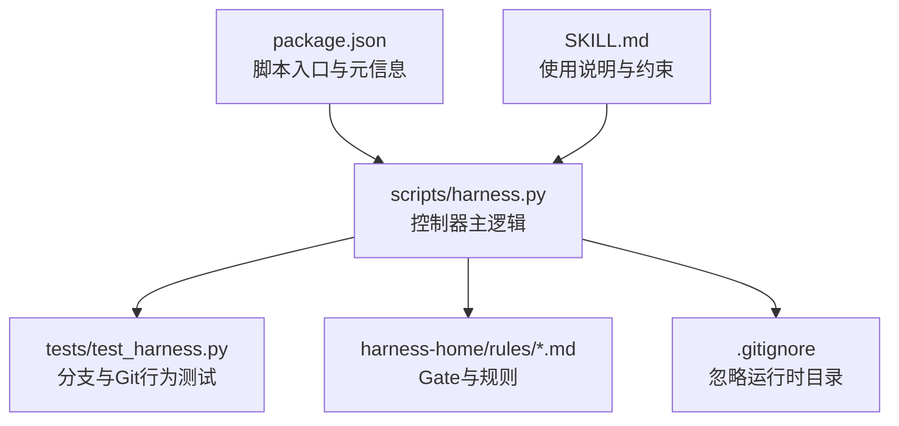
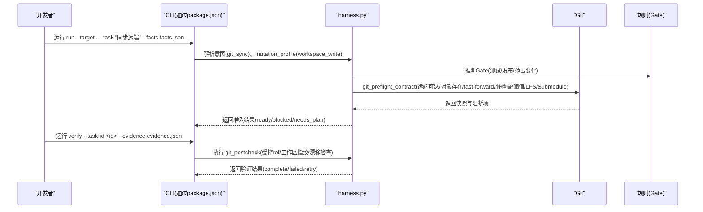
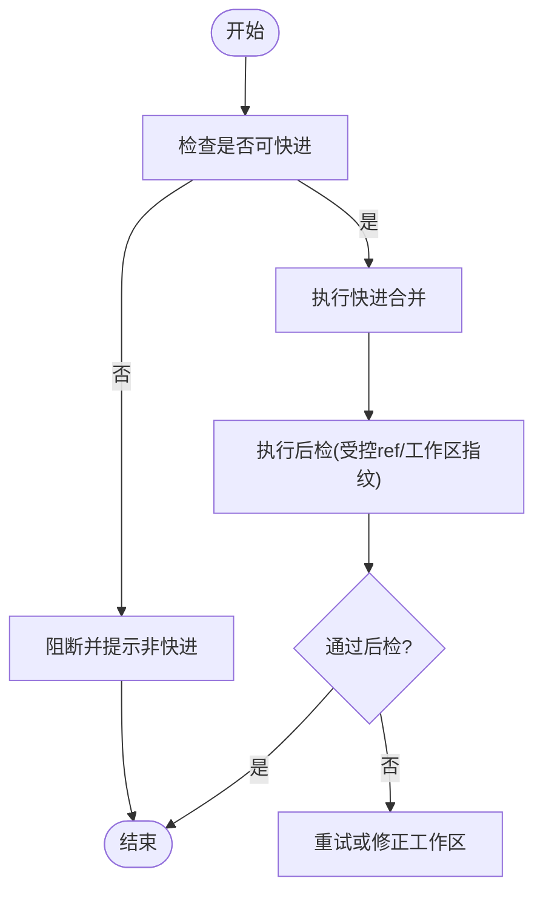
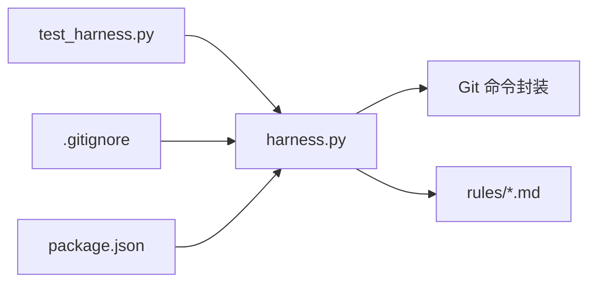

# 分支管理

<cite>
**本文引用的文件**   
- [scripts/harness.py](file://scripts/harness.py)
- [tests/test_harness.py](file://tests/test_harness.py)
- [package.json](file://package.json)
- [.gitignore](file://.gitignore)
- [SKILL.md](file://SKILL.md)
- [harness-home/rules/INDEX.md](file://harness-home/rules/INDEX.md)
- [harness-home/rules/testing-release.md](file://harness-home/rules/testing-release.md)
- [harness-home/rules/release-authorization-rollback.md](file://harness-home/rules/release-authorization-rollback.md)
- [harness-home/rules/scope-change-readmission.md](file://harness-home/rules/scope-change-readmission.md)
</cite>

## 目录
1. [简介](#简介)
2. [项目结构](#项目结构)
3. [核心组件](#核心组件)
4. [架构总览](#架构总览)
5. [详细组件分析](#详细组件分析)
6. [依赖分析](#依赖分析)
7. [性能考虑](#性能考虑)
8. [故障排查指南](#故障排查指南)
9. [结论](#结论)
10. [附录](#附录)

## 简介
本文件面向 Docs Harness 的“分支管理”主题，基于仓库内控制器脚本与规则体系，系统化阐述分支策略、命名约定、自动化创建流程、合并策略（快进合并、三方合并与冲突解决）、保护规则（代码审查、状态检查、质量门禁）、清理与废弃策略以及团队协作最佳实践。文档同时给出可落地的配置示例与操作清单，帮助团队在 Docs Harness 控制面下安全、可控地推进分支生命周期。

## 项目结构
Docs Harness 通过独立 Python 控制器（scripts/harness.py）提供任务编排、Git 预检/后检、证据校验与规则门控能力；测试用例（tests/test_harness.py）覆盖分支同步、漂移检测、快进限制等关键路径；规则集（harness-home/rules/*）定义发布、测试、范围变更等 Gate；配置文件与脚本入口由 package.json 暴露；.gitignore 排除运行时与后台工件目录，避免污染版本库。

图表来源
- [scripts/harness.py:1-120](file://scripts/harness.py#L1-L120)
- [tests/test_harness.py:197-223](file://tests/test_harness.py#L197-L223)
- [harness-home/rules/INDEX.md:1-41](file://harness-home/rules/INDEX.md#L1-L41)
- [.gitignore:1-10](file://.gitignore#L1-L10)
- [package.json:1-23](file://package.json#L1-L23)
- [SKILL.md:1-106](file://SKILL.md#L1-L106)

章节来源
- [scripts/harness.py:1-120](file://scripts/harness.py#L1-L120)
- [tests/test_harness.py:197-223](file://tests/test_harness.py#L197-L223)
- [package.json:1-23](file://package.json#L1-L23)
- [.gitignore:1-10](file://.gitignore#L1-L10)
- [SKILL.md:1-106](file://SKILL.md#L1-L106)
- [harness-home/rules/INDEX.md:1-41](file://harness-home/rules/INDEX.md#L1-L41)

## 核心组件
- Git 意图与权限模型：控制器将用户意图映射为 git_inspect、git_fetch、git_sync、modify、external_write 等，并赋予不同 mutation_profile（read_only、git_metadata_write、workspace_write、external_write），从而决定写入范围与风险等级。
- Git 预检/后检：对 git_fetch/git_sync 进行前置契约校验（远端可达性、对象存在、fast-forward 判定、工作区脏检查、删除数量阈值、LFS/Submodule 可用性），并在执行后进行一致性验证（受控 ref 集合、工作区指纹对比）。
- 分支同步与漂移：git_sync 要求绑定单一远端分支，禁止非 fast-forward 合并；当远端发生漂移时，强制重新准入并复用冻结方案。
- 规则与门控：通过 rules/*.md 声明 Gate（如 testing-acceptance、release-external、review-audit）与关键词匹配，触发相应证据类型与失败模式。

章节来源
- [scripts/harness.py:200-233](file://scripts/harness.py#L200-L233)
- [scripts/harness.py:664-794](file://scripts/harness.py#L664-L794)
- [scripts/harness.py:796-860](file://scripts/harness.py#L796-L860)
- [harness-home/rules/INDEX.md:1-41](file://harness-home/rules/INDEX.md#L1-L41)
- [harness-home/rules/testing-release.md:1-29](file://harness-home/rules/testing-release.md#L1-L29)
- [harness-home/rules/release-authorization-rollback.md:1-29](file://harness-home/rules/release-authorization-rollback.md#L1-L29)
- [harness-home/rules/scope-change-readmission.md:1-29](file://harness-home/rules/scope-change-readmission.md#L1-L29)

## 架构总览
下图展示分支相关的关键调用链：run 阶段解析意图与 scope，生成 preflight 契约；verify 阶段执行后检并产出证据；测试用例覆盖典型场景（漂移、非快进、脏工作区、LFS/Submodule 不可用）。

图表来源
- [scripts/harness.py:680-794](file://scripts/harness.py#L680-L794)
- [scripts/harness.py:796-860](file://scripts/harness.py#L796-L860)
- [tests/test_harness.py:597-684](file://tests/test_harness.py#L597-L684)
- [tests/test_harness.py:685-735](file://tests/test_harness.py#L685-L735)

## 详细组件分析

### 分支策略与生命周期
- 功能分支（feature/*）
  - 用途：实现新功能或重构，隔离开发工作。
  - 生命周期：从 main 拉取 -> 提交多次 -> 通过测试与规则 Gate -> 以快进方式合并回 main。
  - 控制器支持：git_sync 仅允许 fast-forward；非快进将被阻断，需先 rebase 或等待上游更新。
- 发布分支（release/*）
  - 用途：冻结版本、回归测试、外部交付。
  - 生命周期：从 main 切出 -> 打标签 -> 通过 release-external Gate -> 推送产物 -> 回滚预案验证。
  - 控制器支持：release-external Gate 要求外部目标、产物身份、授权与回滚路径冻结；外部验收必须真实环境证明。
- 热修复分支（hotfix/*）
  - 用途：紧急修复生产问题。
  - 生命周期：从 main 或 release 切出 -> 最小化变更 -> 快速回归 -> 快进合并回 main 与 release。
  - 控制器支持：scope-change-readmission Gate 确保范围变化被重新评估与记录。

章节来源
- [scripts/harness.py:664-794](file://scripts/harness.py#L664-L794)
- [harness-home/rules/release-authorization-rollback.md:1-29](file://harness-home/rules/release-authorization-rollback.md#L1-L29)
- [harness-home/rules/scope-change-readmission.md:1-29](file://harness-home/rules/scope-change-readmission.md#L1-L29)

### 分支命名约定与自动化创建
- 命名建议
  - feature/<短名>：功能分支
  - release/<版本号>：发布分支
  - hotfix/<版本号>：热修复分支
  - docs/<短名>：文档治理分支（配合 document-edit Gate）
- 自动化创建
  - 通过 harness.run 解析意图与 scope，结合 plan 字段生成任务包；若涉及 git_sync，则自动锁定单一远端分支（refs/remotes/<remote>/<branch>）。
  - 控制器不直接创建分支，但可通过计划与证据驱动宿主完成分支创建与推送。

章节来源
- [scripts/harness.py:664-678](file://scripts/harness.py#L664-L678)
- [SKILL.md:26-44](file://SKILL.md#L26-L44)

### 合并策略与冲突解决
- 快进合并（fast-forward）
  - 控制器在 git_preflight_contract 中计算 fast_forward 标志；若非快进，直接阻断并提示“远端目标不能从当前 HEAD fast-forward”。
  - 推荐做法：本地 rebase 到最新上游后再合并。
- 三方合并（merge）
  - 当无法 fast-forward 时，需进行三方合并；控制器不允许在 git_sync 模式下直接进行非快进合并，需先调整本地历史。
- 冲突解决算法
  - 控制器通过 diff --name-status -M 解析变更路径，统计删除数量超过阈值（GIT_DELETION_THRESHOLD）即阻断；工作区脏路径与变更范围重叠也会阻断。
  - 建议在合并前清理工作区、确认变更范围、必要时拆分小步提交。

图表来源
- [scripts/harness.py:708-754](file://scripts/harness.py#L708-L754)
- [scripts/harness.py:748-754](file://scripts/harness.py#L748-L754)

章节来源
- [scripts/harness.py:708-754](file://scripts/harness.py#L708-L754)
- [scripts/harness.py:649-662](file://scripts/harness.py#L649-L662)

### 分支保护规则（代码审查、状态检查、质量门禁）
- 代码审查
  - review-audit Gate：当任务涉及范围变化或审计时生效，要求 review_result 证据。
- 状态检查
  - 控制器在 verify 阶段执行 git_postcheck，检查受控 ref 集合、工作区指纹、远端漂移等。
- 质量门禁
  - testing-acceptance Gate：要求 test_result 证据，区分静态检查、源码测试、运行时验证、产物验证与真实产品验收。
  - release-external Gate：要求 external_state 证据，冻结外部目标、产物身份、授权范围、发布步骤、观测窗口与回滚路径。

章节来源
- [harness-home/rules/INDEX.md:1-41](file://harness-home/rules/INDEX.md#L1-L41)
- [harness-home/rules/testing-release.md:1-29](file://harness-home/rules/testing-release.md#L1-L29)
- [harness-home/rules/release-authorization-rollback.md:1-29](file://harness-home/rules/release-authorization-rollback.md#L1-L29)
- [scripts/harness.py:796-860](file://scripts/harness.py#L796-L860)

### 分支清理策略、废弃分支处理与存储空间优化
- 清理策略
  - 控制器不主动删除分支，但通过 git_inspect 意图支持“审计分支是否可删除”；宿主可根据控制器输出决定是否删除。
- 废弃分支处理
  - 对于长期未活动且无关联任务的分支，建议标记为废弃并归档；控制器在 verify 阶段会拒绝过期的证据与漂移。
- 存储空间优化
  - .gitignore 排除运行时目录（runs、background、knowledge-jobs、task-inputs、quality-ledger），避免污染版本库。
  - 控制器对 LFS/Submodule 可用性进行检查，缺失时将阻断操作，提示补齐依赖。

章节来源
- [tests/test_harness.py:449-464](file://tests/test_harness.py#L449-L464)
- [.gitignore:1-10](file://.gitignore#L1-L10)
- [scripts/harness.py:725-734](file://scripts/harness.py#L725-L734)

### 具体配置示例与团队协作最佳实践
- 配置要点
  - 在 .docs-harness/config.json 中设置 rules_root 指向安装后的规则目录；确保 clone_ready=true 时包含完整安装清单。
  - verification.volatile_paths 可追加缓存白名单，避免误判额外写入。
- 协作实践
  - 所有分支操作通过 harness.run/verify 走控制器；禁止绕过 Gate 的直接 push/merge。
  - 发布分支必须通过 release-external Gate，并提供外部验收证据。
  - 范围变化必须触发 scope-change-readmission Gate，重新评估影响与授权。

章节来源
- [tests/test_harness.py:356-376](file://tests/test_harness.py#L356-L376)
- [harness-home/rules/INDEX.md:1-41](file://harness-home/rules/INDEX.md#L1-L41)
- [SKILL.md:13-25](file://SKILL.md#L13-L25)

## 依赖分析
- 控制器依赖 Git 命令（fetch、merge-base、diff、status、lfs、submodule）进行预检与后检。
- 规则系统依赖 Markdown 文件与指纹校验，确保规则完整性。
- 测试用例依赖临时目录与裸仓库模拟远端，覆盖分支同步、漂移、非快进等场景。

图表来源
- [scripts/harness.py:575-586](file://scripts/harness.py#L575-L586)
- [harness-home/rules/INDEX.md:1-41](file://harness-home/rules/INDEX.md#L1-L41)
- [tests/test_harness.py:197-223](file://tests/test_harness.py#L197-L223)
- [.gitignore:1-10](file://.gitignore#L1-L10)
- [package.json:1-23](file://package.json#L1-L23)

章节来源
- [scripts/harness.py:575-586](file://scripts/harness.py#L575-L586)
- [harness-home/rules/INDEX.md:1-41](file://harness-home/rules/INDEX.md#L1-L41)
- [tests/test_harness.py:197-223](file://tests/test_harness.py#L197-L223)
- [.gitignore:1-10](file://.gitignore#L1-L10)
- [package.json:1-23](file://package.json#L1-L23)

## 性能考虑
- 预检阶段避免不必要的网络请求：仅在 git_sync 时检查 fast-forward 与工作区脏状态。
- 快照与指纹计算采用增量与哈希，减少大文件扫描开销。
- 规则匹配基于关键词与 Gate，避免复杂正则带来的性能损耗。

[本节为通用指导，无需引用具体文件]

## 故障排查指南
- 常见错误
  - 远端目标不可达：检查 remote URL 与网络连通性。
  - 非快进合并：本地 rebase 到最新上游后再尝试。
  - 工作区脏：清理未提交变更或明确变更范围。
  - LFS/Submodule 不可用：安装对应工具或初始化子模块。
- 调试步骤
  - 使用 git_inspect 意图查看日志与差异。
  - 通过 verify 获取 git_postcheck 详情，定位漂移或指纹不一致。
  - 检查规则命中与 Gate 要求，补充必要证据。

章节来源
- [tests/test_harness.py:685-735](file://tests/test_harness.py#L685-L735)
- [scripts/harness.py:796-860](file://scripts/harness.py#L796-L860)

## 结论
Docs Harness 通过严格的意图映射、Git 预检/后检与规则 Gate，为分支管理提供了安全、可控的自动化基础。团队应遵循快进合并策略、冻结发布参数、及时清理分支，并通过控制器统一执行分支操作，确保变更可追溯、可回滚、可验证。

[本节为总结，无需引用具体文件]

## 附录
- 参考命令
  - 运行任务：python3 scripts/harness.py run --target . --task "<任务描述>" --json
  - 验证结果：python3 scripts/harness.py verify --target . --task-id <task-id> --evidence <evidence.json> --json
  - 后台任务：python3 scripts/harness.py background list/status/prepare/dispatch/progress/verify/retry --target . --json

章节来源
- [SKILL.md:26-56](file://SKILL.md#L26-L56)
- [package.json:17-21](file://package.json#L17-L21)