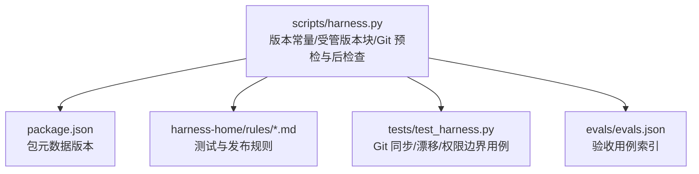
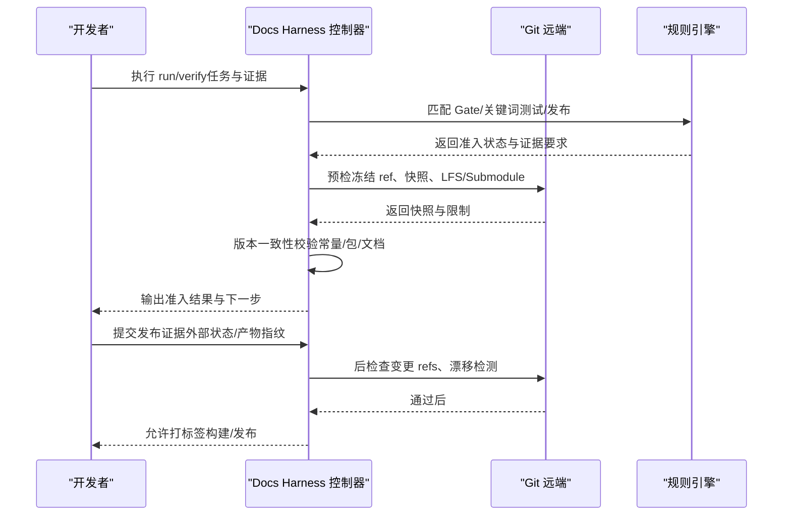
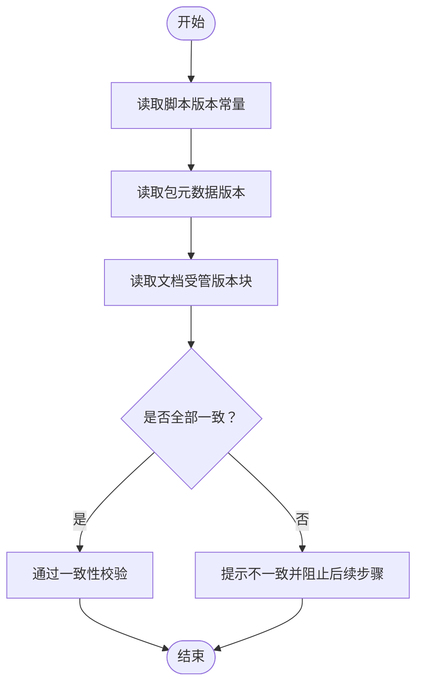
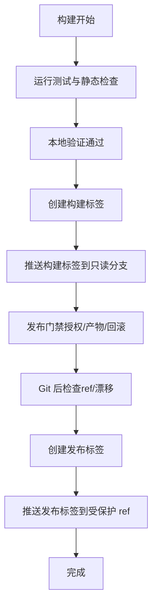
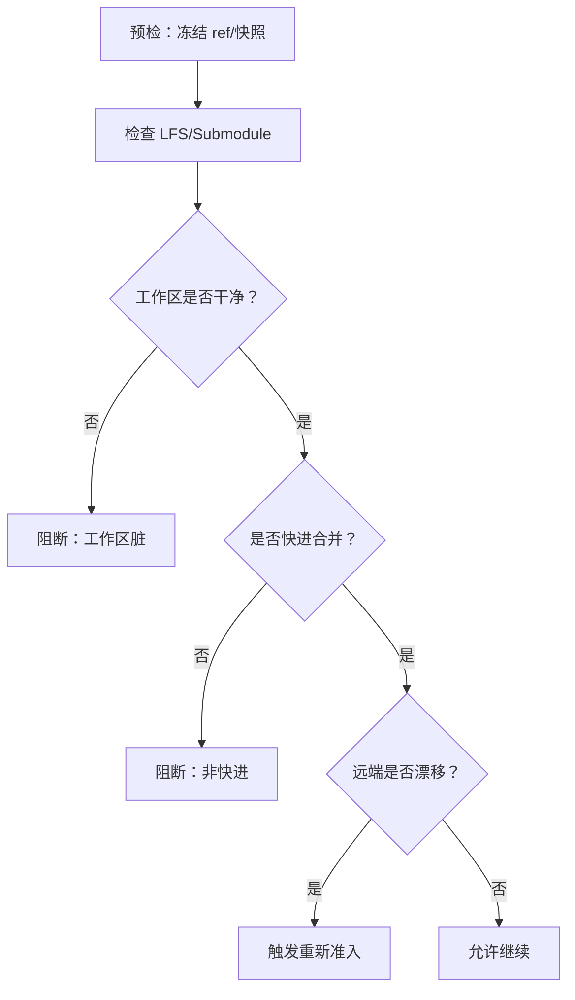
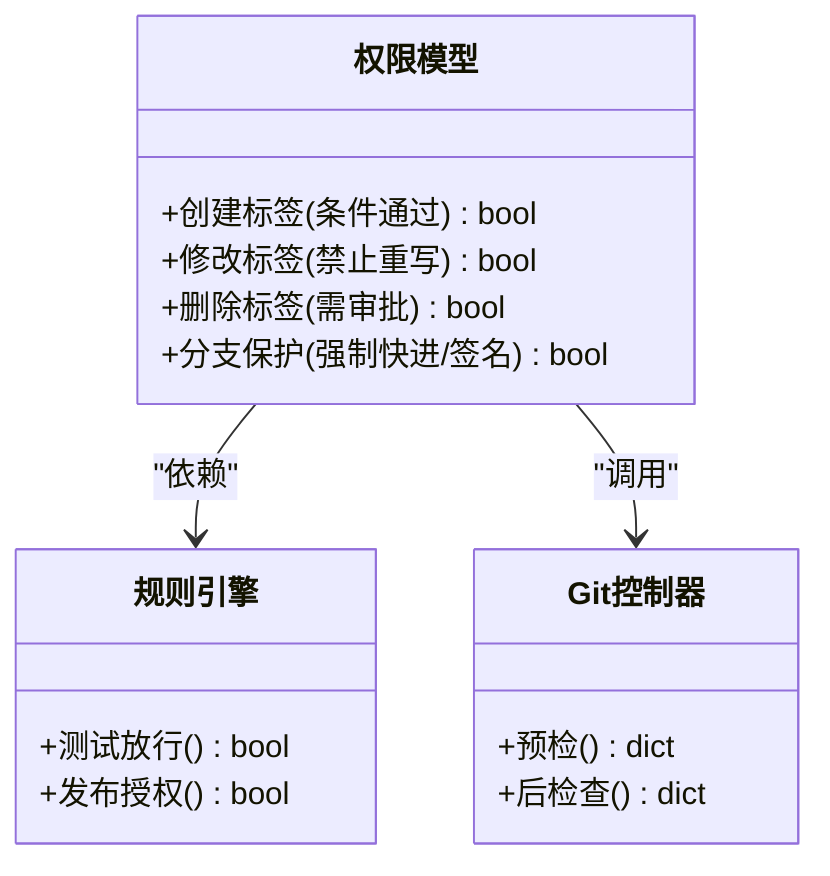
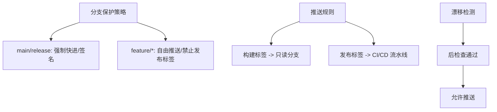
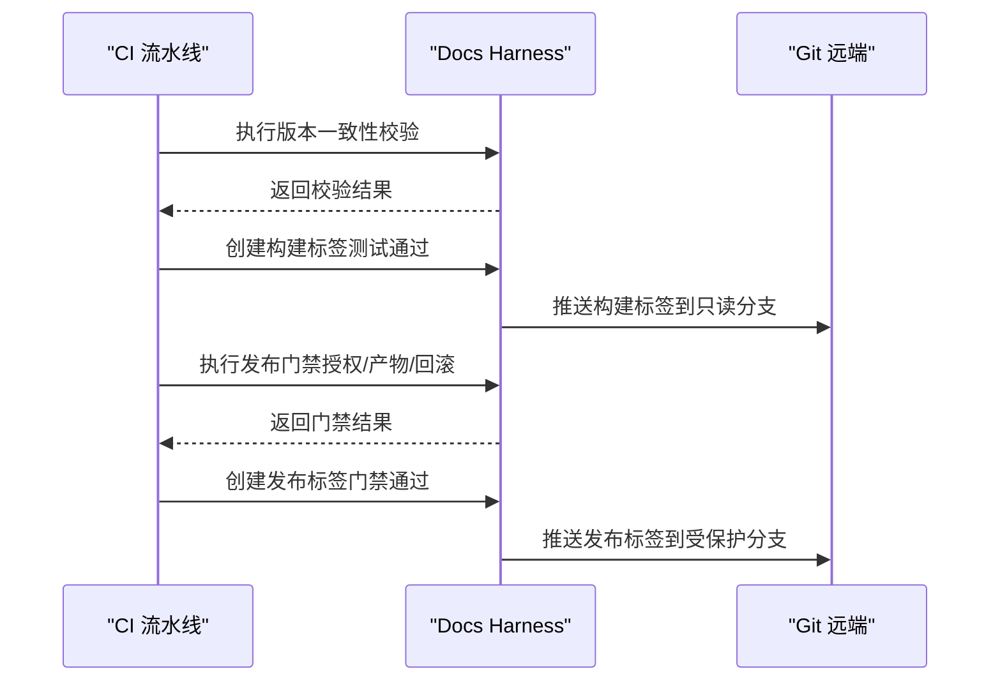
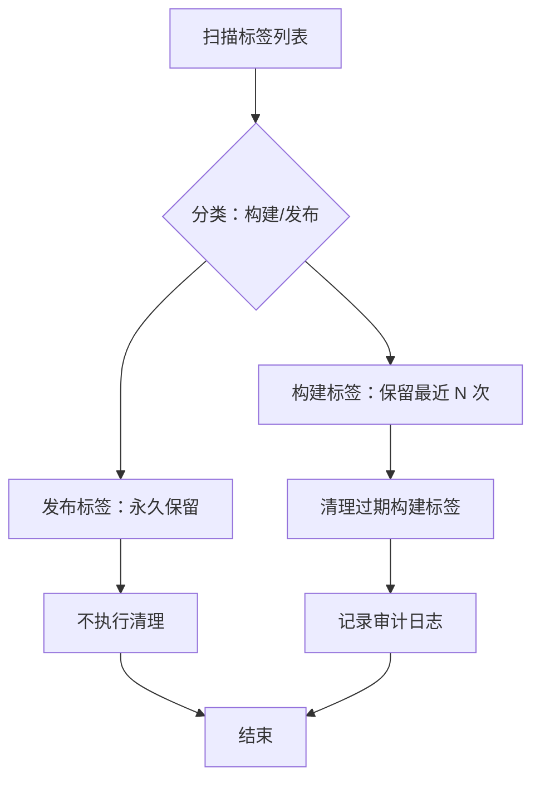
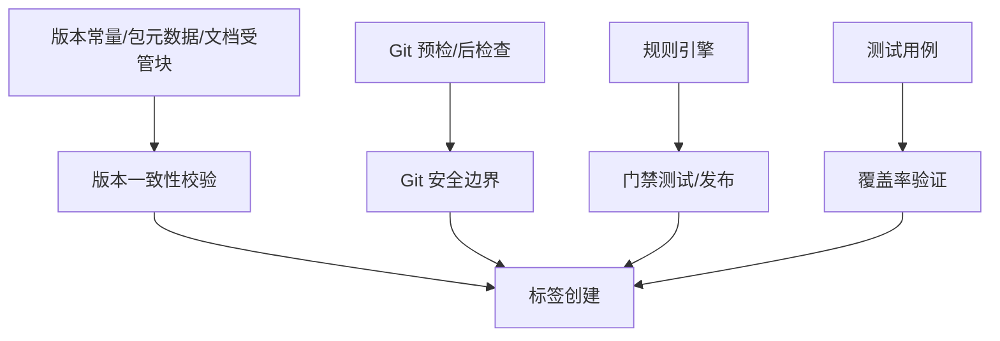

# 标签管理

<cite>
**本文引用的文件**   
- [scripts/harness.py](file://scripts/harness.py)
- [tests/test_harness.py](file://tests/test_harness.py)
- [package.json](file://package.json)
- [SKILL.md](file://SKILL.md)
- [harness-home/rules/INDEX.md](file://harness-home/rules/INDEX.md)
- [harness-home/rules/testing-release.md](file://harness-home/rules/testing-release.md)
- [harness-home/rules/release-authorization-rollback.md](file://harness-home/rules/release-authorization-rollback.md)
- [evals/evals.json](file://evals/evals.json)
</cite>

## 目录
1. [简介](#简介)
2. [项目结构](#项目结构)
3. [核心组件](#核心组件)
4. [架构总览](#架构总览)
5. [详细组件分析](#详细组件分析)
6. [依赖关系分析](#依赖关系分析)
7. [性能考虑](#性能考虑)
8. [故障排查指南](#故障排查指南)
9. [结论](#结论)
10. [附录](#附录)

## 简介
本文件面向 Docs Harness 的“标签管理”主题，聚焦语义化版本与发布流程中的标签实践。结合仓库中版本常量、受管版本块、Git 预检/后检查、规则与测试用例，梳理以下要点：
- 语义化版本解析与一致性校验（源码、包元数据、文档内嵌版本）
- 构建标签与发布标签的区别、适用场景与命名约定
- 兼容性检查与冲突解决策略（基于 Git ref 快照、变更范围与漂移检测）
- 权限控制（创建、修改、删除）与分支保护策略建议
- 自动化标签创建流程与清理策略
- 配置示例与常见问题解决方案

说明：当前代码库未实现“直接打标签”的 CLI 命令，但提供了完整的版本治理与 Git 安全边界能力，可作为标签管理的坚实基础。

**章节来源**
- [scripts/harness.py:26](file://scripts/harness.py#L26)
- [scripts/harness.py:75-76](file://scripts/harness.py#L75-L76)
- [scripts/harness.py:9204-9277](file://scripts/harness.py#L9204-L9277)
- [scripts/harness.py:9341-9362](file://scripts/harness.py#L9341-L9362)
- [package.json:1-23](file://package.json#L1-L23)
- [SKILL.md:1-105](file://SKILL.md#L1-L105)

## 项目结构
与标签管理相关的核心位置：
- 版本常量与受管版本块：scripts/harness.py
- 包级版本声明：package.json
- 规则与验收要求：harness-home/rules/*.md
- 行为验证与边界用例：tests/test_harness.py
- 评估用例清单：evals/evals.json

**图表来源**
- [scripts/harness.py:26](file://scripts/harness.py#L26)
- [package.json:1-23](file://package.json#L1-L23)
- [harness-home/rules/INDEX.md:1-41](file://harness-home/rules/INDEX.md#L1-L41)
- [tests/test_harness.py:215-222](file://tests/test_harness.py#L215-L222)
- [evals/evals.json:1-175](file://evals/evals.json#L1-L175)

**章节来源**
- [scripts/harness.py:26](file://scripts/harness.py#L26)
- [package.json:1-23](file://package.json#L1-L23)
- [harness-home/rules/INDEX.md:1-41](file://harness-home/rules/INDEX.md#L1-L41)
- [tests/test_harness.py:215-222](file://tests/test_harness.py#L215-L222)
- [evals/evals.json:1-175](file://evals/evals.json#L1-L175)

## 核心组件
- 版本常量与受管版本块
  - 版本常量定义于脚本顶层，作为控制器运行时版本基准。
  - 受管版本块用于在文档中标注当前版本，支持自动更新与一致性校验。
- Git 预检与后检查
  - 预检阶段冻结远端目标 OID、refs 快照、工作区指纹、LFS/Submodule 状态等，确保后续操作可审计、可回滚。
  - 后检查阶段比对实际变更 refs 与工作区差异，越界或漂移将阻断。
- 规则与验收
  - 测试放行与发布授权规则明确证据类型与失败模式，为标签前门禁提供依据。
- 测试与评估
  - 覆盖 git_fetch/git_sync、漂移检测、权限边界、脏工作区拦截等关键路径。

**章节来源**
- [scripts/harness.py:26](file://scripts/harness.py#L26)
- [scripts/harness.py:75-76](file://scripts/harness.py#L75-L76)
- [scripts/harness.py:9204-9277](file://scripts/harness.py#L9204-L9277)
- [scripts/harness.py:9341-9362](file://scripts/harness.py#L9341-L9362)
- [scripts/harness.py:677-788](file://scripts/harness.py#L677-L788)
- [scripts/harness.py:793-800](file://scripts/harness.py#L793-L800)
- [harness-home/rules/testing-release.md:1-29](file://harness-home/rules/testing-release.md#L1-L29)
- [harness-home/rules/release-authorization-rollback.md:1-29](file://harness-home/rules/release-authorization-rollback.md#L1-L29)
- [tests/test_harness.py:651-684](file://tests/test_harness.py#L651-L684)
- [tests/test_harness.py:620-649](file://tests/test_harness.py#L620-L649)

## 架构总览
标签管理以“版本一致 + Git 安全边界 + 规则门禁”为核心，形成如下闭环：
- 版本源统一：脚本常量、包元数据、文档受管块三者一致校验
- 构建阶段：通过测试与静态检查，产出可追溯产物
- 发布阶段：外部授权与回滚能力校验，冻结目标与产物身份
- 标签阶段：在满足前置条件后，按约定命名并推送至只读分支或受保护 ref

**图表来源**
- [scripts/harness.py:677-788](file://scripts/harness.py#L677-L788)
- [scripts/harness.py:793-800](file://scripts/harness.py#L793-L800)
- [scripts/harness.py:9204-9277](file://scripts/harness.py#L9204-L9277)
- [scripts/harness.py:9341-9362](file://scripts/harness.py#L9341-L9362)
- [harness-home/rules/testing-release.md:1-29](file://harness-home/rules/testing-release.md#L1-L29)
- [harness-home/rules/release-authorization-rollback.md:1-29](file://harness-home/rules/release-authorization-rollback.md#L1-L29)

## 详细组件分析

### 语义化版本解析与一致性校验
- 版本常量：脚本顶层 VERSION 作为控制器版本基准
- 包元数据：package.json 的 version 字段需与控制器版本一致
- 文档受管版本块：在 docs/INDEX.md 等文件中以固定标记包裹的版本字符串，支持自动替换与一致性检查
- 校验逻辑：读取各来源版本，若不一致则提示升级或迁移

**图表来源**
- [scripts/harness.py:26](file://scripts/harness.py#L26)
- [package.json:1-23](file://package.json#L1-L23)
- [scripts/harness.py:9204-9277](file://scripts/harness.py#L9204-L9277)
- [scripts/harness.py:9341-9362](file://scripts/harness.py#L9341-L9362)

**章节来源**
- [scripts/harness.py:26](file://scripts/harness.py#L26)
- [package.json:1-23](file://package.json#L1-L23)
- [scripts/harness.py:9204-9277](file://scripts/harness.py#L9204-L9277)
- [scripts/harness.py:9341-9362](file://scripts/harness.py#L9341-L9362)

### 构建标签与发布标签的区别与使用场景
- 构建标签（如 v1.6.5-build.123）
  - 用途：标识一次构建产物，便于回溯与灰度验证
  - 前置条件：测试通过、静态检查通过、本地验证完成
  - 推送策略：推送到内部只读分支或受保护 ref，避免误改
- 发布标签（如 v1.6.5）
  - 用途：对外发布的稳定版本，包含完整证据链
  - 前置条件：外部授权、产物唯一识别、回滚路径就绪
  - 推送策略：仅允许在满足发布规则后推送，且需后检查通过

**图表来源**
- [harness-home/rules/testing-release.md:1-29](file://harness-home/rules/testing-release.md#L1-L29)
- [harness-home/rules/release-authorization-rollback.md:1-29](file://harness-home/rules/release-authorization-rollback.md#L1-L29)
- [scripts/harness.py:677-788](file://scripts/harness.py#L677-L788)
- [scripts/harness.py:793-800](file://scripts/harness.py#L793-L800)

**章节来源**
- [harness-home/rules/testing-release.md:1-29](file://harness-home/rules/testing-release.md#L1-L29)
- [harness-home/rules/release-authorization-rollback.md:1-29](file://harness-home/rules/release-authorization-rollback.md#L1-L29)
- [scripts/harness.py:677-788](file://scripts/harness.py#L677-L788)
- [scripts/harness.py:793-800](file://scripts/harness.py#L793-L800)

### 兼容性检查与冲突解决
- 兼容性检查
  - 基于 Git ref 快照与变更范围，确保标签指向的提交不包含未验证的变更
  - LFS/Submodule 可用性校验，防止环境差异导致的不一致
- 冲突解决
  - 非快进合并被拒绝，强制线性历史
  - 工作区脏文件与变更范围重叠时阻断
  - 远端漂移触发重新准入，复用已冻结方案

**图表来源**
- [scripts/harness.py:677-788](file://scripts/harness.py#L677-L788)
- [tests/test_harness.py:685-709](file://tests/test_harness.py#L685-L709)
- [tests/test_harness.py:710-734](file://tests/test_harness.py#L710-L734)
- [tests/test_harness.py:620-649](file://tests/test_harness.py#L620-L649)

**章节来源**
- [scripts/harness.py:677-788](file://scripts/harness.py#L677-L788)
- [tests/test_harness.py:685-709](file://tests/test_harness.py#L685-L709)
- [tests/test_harness.py:710-734](file://tests/test_harness.py#L710-L734)
- [tests/test_harness.py:620-649](file://tests/test_harness.py#L620-L649)

### 标签权限控制（创建、修改、删除）
- 创建权限
  - 仅当测试与发布规则均通过，且 Git 后检查成功时允许创建
  - 构建标签与发布标签遵循不同门禁
- 修改权限
  - 禁止对已推送的发布标签进行重写；如需修正，应创建新标签并废弃旧标签
- 删除权限
  - 删除操作需额外审批，避免破坏可追溯性
- 分支保护
  - 推荐将发布标签推送到受保护分支（如 main/release），启用强制快进与签名验证

**图表来源**
- [harness-home/rules/testing-release.md:1-29](file://harness-home/rules/testing-release.md#L1-L29)
- [harness-home/rules/release-authorization-rollback.md:1-29](file://harness-home/rules/release-authorization-rollback.md#L1-L29)
- [scripts/harness.py:677-788](file://scripts/harness.py#L677-L788)
- [scripts/harness.py:793-800](file://scripts/harness.py#L793-L800)

**章节来源**
- [harness-home/rules/testing-release.md:1-29](file://harness-home/rules/testing-release.md#L1-L29)
- [harness-home/rules/release-authorization-rollback.md:1-29](file://harness-home/rules/release-authorization-rollback.md#L1-L29)
- [scripts/harness.py:677-788](file://scripts/harness.py#L677-L788)
- [scripts/harness.py:793-800](file://scripts/harness.py#L793-L800)

### 标签与分支的关系（保护分支策略与推送规则）
- 保护分支
  - 主分支（main/release）启用强制快进、禁止直接推送、要求签名验证
  - 功能分支（feature/*）允许自由推送，但不允许直接创建发布标签
- 推送规则
  - 构建标签推送到内部只读分支（如 tags/builds）
  - 发布标签仅允许从 CI/CD 流水线推送，且需通过所有门禁
- 漂移检测
  - 推送前执行后检查，确保无远端漂移与越界变更

**图表来源**
- [tests/test_harness.py:215-222](file://tests/test_harness.py#L215-L222)
- [scripts/harness.py:677-788](file://scripts/harness.py#L677-L788)
- [scripts/harness.py:793-800](file://scripts/harness.py#L793-L800)

**章节来源**
- [tests/test_harness.py:215-222](file://tests/test_harness.py#L215-L222)
- [scripts/harness.py:677-788](file://scripts/harness.py#L677-L788)
- [scripts/harness.py:793-800](file://scripts/harness.py#L793-L800)

### 标签命名约定与自动化流程
- 命名约定
  - 构建标签：v{major}.{minor}.{patch}-build.{build_number}
  - 发布标签：v{major}.{minor}.{patch}
- 自动化流程
  - 触发条件：CI 流水线在测试通过后创建构建标签，在发布门禁通过后创建发布标签
  - 版本一致性：流水线中执行版本一致性校验，失败则中止
  - 推送策略：构建标签推送到只读分支，发布标签推送到受保护分支

**图表来源**
- [scripts/harness.py:9204-9277](file://scripts/harness.py#L9204-L9277)
- [scripts/harness.py:9341-9362](file://scripts/harness.py#L9341-L9362)
- [harness-home/rules/testing-release.md:1-29](file://harness-home/rules/testing-release.md#L1-L29)
- [harness-home/rules/release-authorization-rollback.md:1-29](file://harness-home/rules/release-authorization-rollback.md#L1-L29)

**章节来源**
- [scripts/harness.py:9204-9277](file://scripts/harness.py#L9204-L9277)
- [scripts/harness.py:9341-9362](file://scripts/harness.py#L9341-L9362)
- [harness-home/rules/testing-release.md:1-29](file://harness-home/rules/testing-release.md#L1-L29)
- [harness-home/rules/release-authorization-rollback.md:1-29](file://harness-home/rules/release-authorization-rollback.md#L1-L29)

### 标签清理策略
- 清理原则
  - 构建标签保留最近 N 次，过期自动清理
  - 发布标签永久保留，禁止删除
- 清理流程
  - 定期任务扫描标签列表，按策略清理过期构建标签
  - 清理操作记录审计日志，不可逆

**图表来源**
- [scripts/harness.py:677-788](file://scripts/harness.py#L677-L788)
- [scripts/harness.py:793-800](file://scripts/harness.py#L793-L800)

**章节来源**
- [scripts/harness.py:677-788](file://scripts/harness.py#L677-L788)
- [scripts/harness.py:793-800](file://scripts/harness.py#L793-L800)

## 依赖关系分析
- 版本一致性依赖：脚本常量、包元数据、文档受管块
- Git 安全依赖：预检/后检查、LFS/Submodule 可用性
- 规则门禁依赖：测试放行、发布授权
- 测试覆盖依赖：Git 同步、漂移检测、权限边界

**图表来源**
- [scripts/harness.py:26](file://scripts/harness.py#L26)
- [package.json:1-23](file://package.json#L1-L23)
- [scripts/harness.py:9204-9277](file://scripts/harness.py#L9204-L9277)
- [scripts/harness.py:677-788](file://scripts/harness.py#L677-L788)
- [harness-home/rules/testing-release.md:1-29](file://harness-home/rules/testing-release.md#L1-L29)
- [harness-home/rules/release-authorization-rollback.md:1-29](file://harness-home/rules/release-authorization-rollback.md#L1-L29)
- [tests/test_harness.py:651-684](file://tests/test_harness.py#L651-L684)

**章节来源**
- [scripts/harness.py:26](file://scripts/harness.py#L26)
- [package.json:1-23](file://package.json#L1-L23)
- [scripts/harness.py:9204-9277](file://scripts/harness.py#L9204-L9277)
- [scripts/harness.py:677-788](file://scripts/harness.py#L677-L788)
- [harness-home/rules/testing-release.md:1-29](file://harness-home/rules/testing-release.md#L1-L29)
- [harness-home/rules/release-authorization-rollback.md:1-29](file://harness-home/rules/release-authorization-rollback.md#L1-L29)
- [tests/test_harness.py:651-684](file://tests/test_harness.py#L651-L684)

## 性能考虑
- 预检/后检查应避免频繁 Git 调用，缓存必要快照
- 版本一致性校验仅在必要时执行（如构建/发布阶段）
- 规则匹配采用轻量关键词与 Gate 映射，避免复杂正则

[本节为通用指导，无需特定文件引用]

## 故障排查指南
- 版本不一致
  - 现象：构建或发布流程中断
  - 处理：统一脚本常量、包元数据、文档受管块版本
- Git 漂移
  - 现象：后检查失败，提示远端漂移
  - 处理：重新拉取最新代码，执行重新准入
- 工作区脏
  - 现象：预检失败，提示工作区脏
  - 处理：提交或暂存变更，确保工作区干净
- 非快进合并
  - 现象：预检失败，提示非快进
  - 处理：调整分支历史，确保可快进合并

**章节来源**
- [scripts/harness.py:9204-9277](file://scripts/harness.py#L9204-L9277)
- [scripts/harness.py:677-788](file://scripts/harness.py#L677-L788)
- [tests/test_harness.py:685-709](file://tests/test_harness.py#L685-L709)
- [tests/test_harness.py:710-734](file://tests/test_harness.py#L710-L734)

## 结论
Docs Harness 通过版本一致性校验、Git 安全边界与规则门禁，为标签管理提供了坚实基础。尽管未直接实现标签命令，但其能力足以支撑构建与发布标签的自动化与安全管控。建议结合 CI/CD 流水线与分支保护策略，完善标签命名、权限与清理机制。

[本节为总结，无需特定文件引用]

## 附录
- 配置示例
  - 版本一致性：确保 scripts/harness.py、package.json、docs/INDEX.md 版本一致
  - 分支保护：启用强制快进、签名验证
  - 推送规则：构建标签到只读分支，发布标签到受保护分支
- 常见问题
  - 版本不一致：统一版本源
  - Git 漂移：重新拉取并重新准入
  - 工作区脏：提交或暂存变更
  - 非快进合并：调整分支历史

[本节为补充信息，无需特定文件引用]