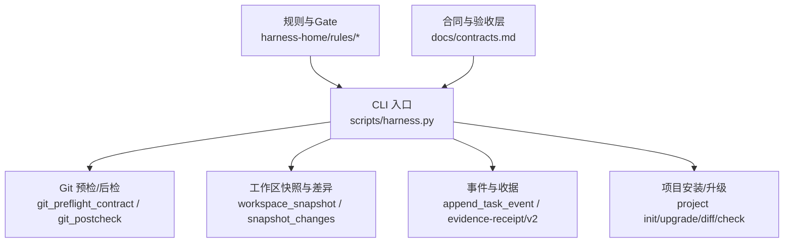
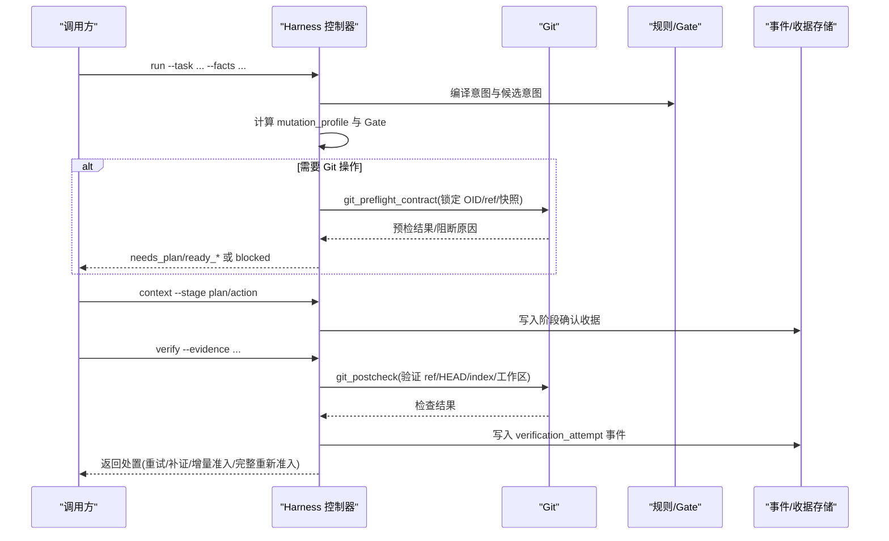
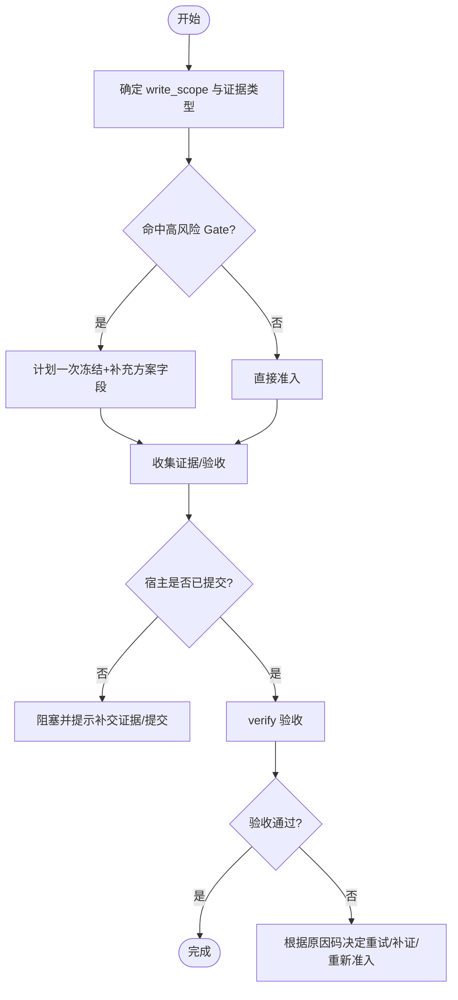
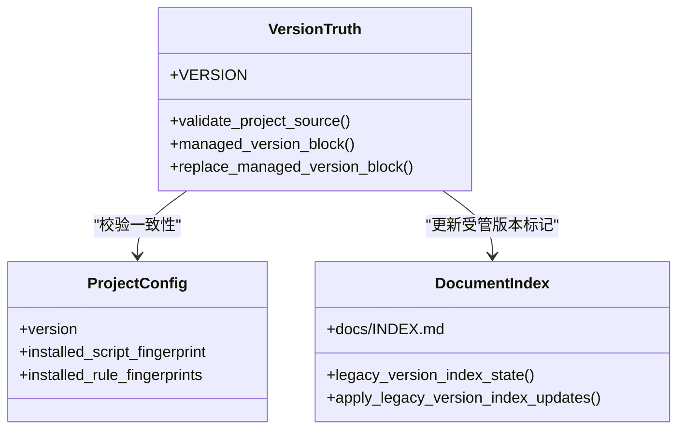
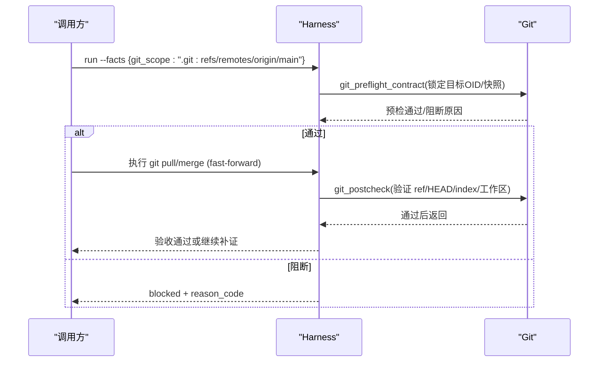
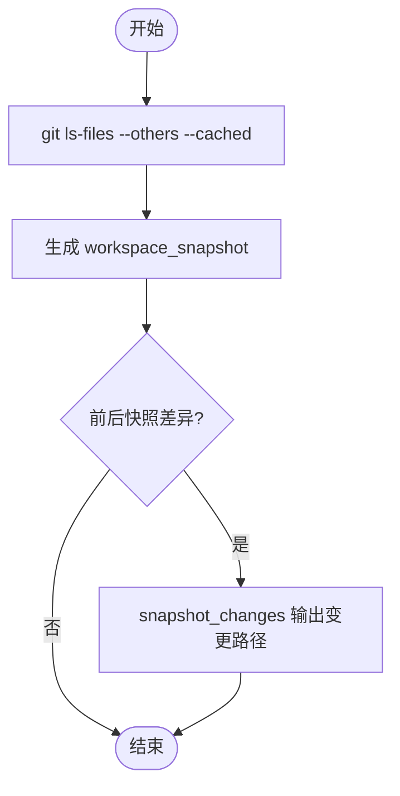
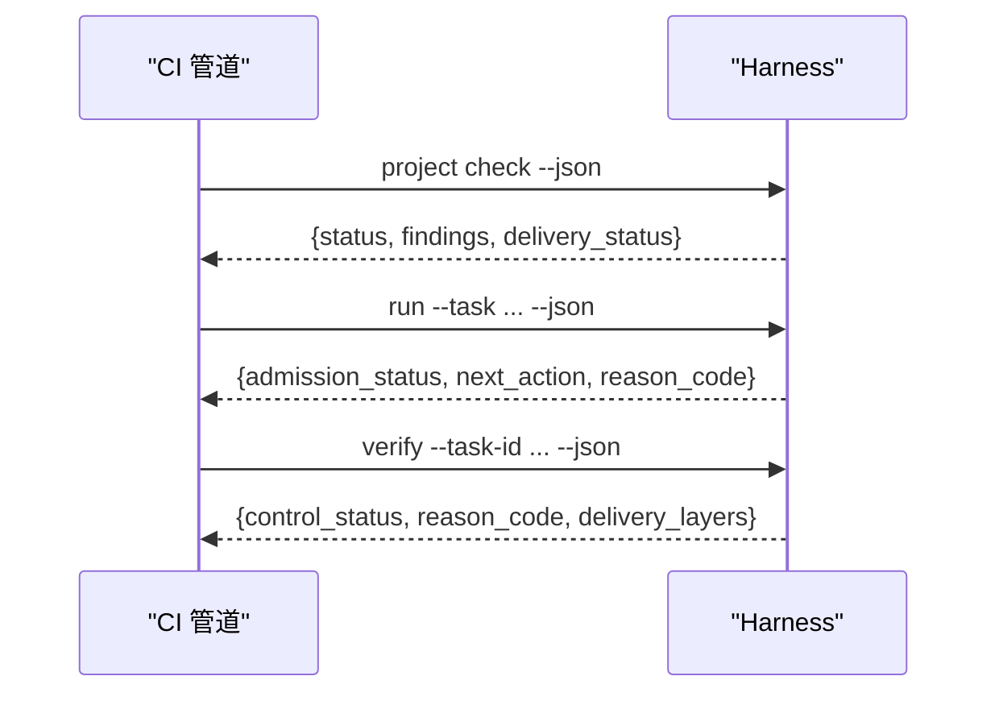
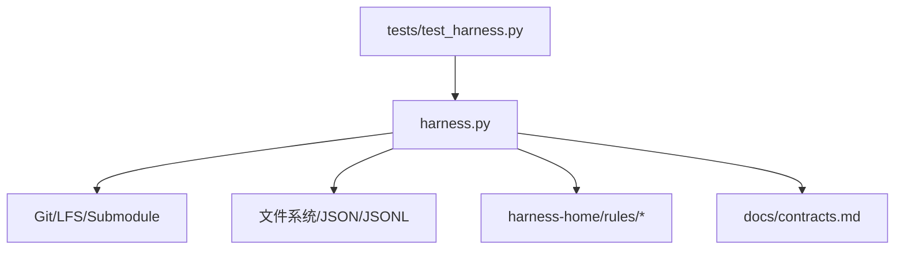

# 版本控制集成

<cite>
**本文引用的文件**   
- [scripts/harness.py](file://scripts/harness.py)
- [tests/test_harness.py](file://tests/test_harness.py)
- [package.json](file://package.json)
- [SKILL.md](file://SKILL.md)
- [docs/contracts.md](file://docs/contracts.md)
- [harness-home/rules/INDEX.md](file://harness-home/rules/INDEX.md)
- [harness-home/rules/release-authorization-rollback.md](file://harness-home/rules/release-authorization-rollback.md)
- [harness-home/rules/testing-release.md](file://harness-home/rules/testing-release.md)
</cite>

## 目录
1. [简介](#简介)
2. [项目结构](#项目结构)
3. [核心组件](#核心组件)
4. [架构总览](#架构总览)
5. [详细组件分析](#详细组件分析)
6. [依赖关系分析](#依赖关系分析)
7. [性能考量](#性能考量)
8. [故障排除指南](#故障排除指南)
9. [结论](#结论)
10. [附录](#附录)

## 简介
本文件面向 Docs Harness 的版本控制集成，围绕 Git 提交、标签与远程同步、提交消息模板、Git 状态监控以及与 CI/CD 的集成进行系统化说明。需要特别强调：Docs Harness 明确不自动提交、推送、发布或修改 .gitignore；所有 Git 操作均通过受控意图（如 git_inspect、git_fetch、git_sync）和严格的预检查/后检查机制完成，确保可审计、可回滚、失败关闭。

## 项目结构
- scripts/harness.py：控制器主程序，包含 Git 预检/后检、工作区快照、事件记录、安装/升级、后台治理等实现。
- tests/test_harness.py：覆盖 Git fetch/sync、漂移、非 fast-forward、LFS/Submodule 不可用等关键场景。
- package.json：包元数据与脚本入口。
- SKILL.md：技能说明与使用约定。
- docs/contracts.md：任务包、证据、验收层、Git 状态合同等规范。
- harness-home/rules/*：生效规则与 Gate 定义，含发布授权与测试放行等。

**图表来源** 
- [scripts/harness.py:572-791](file://scripts/harness.py#L572-L791)
- [scripts/harness.py:800-876](file://scripts/harness.py#L800-L876)
- [scripts/harness.py:1031-1071](file://scripts/harness.py#L1031-L1071)
- [docs/contracts.md:97-132](file://docs/contracts.md#L97-L132)

**章节来源**
- [scripts/harness.py:572-791](file://scripts/harness.py#L572-L791)
- [scripts/harness.py:800-876](file://scripts/harness.py#L800-L876)
- [docs/contracts.md:97-132](file://docs/contracts.md#L97-L132)

## 核心组件
- Git 预检/后检：对 git_fetch/git_sync 建立强约束，锁定远端目标 OID、索引与工作区指纹，限制 ref 变更范围，检测 LFS/Submodule 可用性，阻止脏工作区与非 fast-forward 合并。
- 工作区快照与差异：基于 Git ls-files 或递归扫描生成稳定指纹，支持大文件快速指纹策略，过滤受管目录。
- 事件与收据：每次 verify 写入脱敏事件，证据采用 v2 收据并支持声明草案与自动归因。
- 项目安装/升级：校验版本真源一致性，维护受管标记与规则快照，拒绝覆盖用户改动。
- 规则与 Gate：按关键词与路径推断风险 Gate，安全底线强制并入，结合计划一次冻结与增量准入。

**章节来源**
- [scripts/harness.py:572-791](file://scripts/harness.py#L572-L791)
- [scripts/harness.py:1086-1136](file://scripts/harness.py#L1086-L1136)
- [scripts/harness.py:1031-1071](file://scripts/harness.py#L1031-L1071)
- [scripts/harness.py:9317-9448](file://scripts/harness.py#L9317-L9448)
- [docs/contracts.md:1-46](file://docs/contracts.md#L1-L46)

## 架构总览
Docs Harness 以 CLI 为入口，将“意图→范围→Gate→上下文→授权→证据→验收”串联成受控流水线。Git 相关能力被严格限定在受控意图内，并通过预检/后检保证只读或最小写权限。

**图表来源** 
- [scripts/harness.py:572-791](file://scripts/harness.py#L572-L791)
- [scripts/harness.py:800-876](file://scripts/harness.py#L800-L876)
- [scripts/harness.py:1031-1071](file://scripts/harness.py#L1031-L1071)
- [docs/contracts.md:97-132](file://docs/contracts.md#L97-L132)

## 详细组件分析

### Git 提交与变更控制
- 自动提交：控制器不自动提交；宿主需显式执行 Git 命令。若需自动化，应在宿主侧封装并在 facts 中声明范围与证据。
- 批量提交：由宿主组织变更集合并提交；控制器通过 write_scope 与证据收据进行归因与审计。
- 条件提交：通过 Gate 与计划冻结控制是否允许提交；高风险 Gate（安全、破坏性数据、外部发布）必须满足额外验收。

**图表来源** 
- [docs/contracts.md:1-46](file://docs/contracts.md#L1-L46)
- [docs/contracts.md:134-164](file://docs/contracts.md#L134-L164)

**章节来源**
- [docs/contracts.md:1-46](file://docs/contracts.md#L1-L46)
- [docs/contracts.md:134-164](file://docs/contracts.md#L134-L164)

### 标签管理（语义化版本、构建标签、发布标签）
- 语义化版本：控制器版本常量与多源真源（VERSION、SKILL.md、package.json）一致性校验；文档受管区块维护当前版本标记。
- 构建标签：由宿主在 CI 中创建；控制器不自动生成，但可通过 project check/diff 发现未提交的受管标记差异。
- 发布标签：属于外部交付层，需满足 release-external Gate 与 external_state 证据；控制器不自动打标签。

**图表来源** 
- [scripts/harness.py:9317-9448](file://scripts/harness.py#L9317-L9448)
- [scripts/harness.py:9188-9294](file://scripts/harness.py#L9188-L9294)
- [package.json:1-23](file://package.json#L1-L23)

**章节来源**
- [scripts/harness.py:9188-9294](file://scripts/harness.py#L9188-L9294)
- [scripts/harness.py:9317-9448](file://scripts/harness.py#L9317-L9448)
- [package.json:1-23](file://package.json#L1-L23)

### 远程仓库同步（推送策略、拉取策略、冲突解决）
- 拉取策略：git_fetch 仅允许声明的远端 refs/objects 变化，HEAD/index/工作区必须不变；git_sync 绑定单一预检 OID，自动生成变更范围，要求 fast-forward。
- 推送策略：控制器不自动推送；如需推送，应走 release-external Gate 并完成 external_state 证据。
- 冲突解决：非 fast-forward、分支分歧、脏工作区重叠、危险删除阈值、LFS/Submodule 不可用等均失败关闭；远端漂移触发重新准入并复用有效方案。

**图表来源** 
- [scripts/harness.py:572-791](file://scripts/harness.py#L572-L791)
- [scripts/harness.py:800-876](file://scripts/harness.py#L800-L876)
- [docs/contracts.md:97-132](file://docs/contracts.md#L97-L132)

**章节来源**
- [scripts/harness.py:572-791](file://scripts/harness.py#L572-L791)
- [scripts/harness.py:800-876](file://scripts/harness.py#L800-L876)
- [docs/contracts.md:97-132](file://docs/contracts.md#L97-L132)

### 提交消息模板与格式化规则
- 控制器不生成或强制提交消息；建议在宿主侧统一模板（例如 Conventional Commits），并在证据中记录变更范围与影响面。
- 控制器通过 write_scope 与证据收据追踪变更来源，确保提交历史的可读性与一致性。

[本节为概念性说明，不直接分析具体文件]

### Git 状态监控（工作区状态、未提交变更、分支差异）
- 工作区快照：git_workspace_paths 列出跟踪与未跟踪文件，workspace_snapshot 生成指纹，支持大文件快速指纹。
- 未提交变更：snapshot_changes 对比前后快照，识别新增/修改/删除路径。
- 分支差异：git diff --name-status -M 用于 git_sync 范围推导；git rev-list --left-right --count 判断分支分歧。

**图表来源** 
- [scripts/harness.py:1086-1136](file://scripts/harness.py#L1086-L1136)
- [scripts/harness.py:1138-1140](file://scripts/harness.py#L1138-L1140)

**章节来源**
- [scripts/harness.py:1086-1136](file://scripts/harness.py#L1086-L1136)
- [scripts/harness.py:1138-1140](file://scripts/harness.py#L1138-L1140)

### 与 CI/CD 管道集成（触发器配置与状态反馈）
- 触发器：在 CI 中调用 harness.py 子命令（run/context/progress/verify/project check/diff），以 JSON 模式输出结构化结果。
- 状态反馈：verify 返回处置码（重试/补证/增量准入/完整重新准入），project check 返回 red/yellow 发现项与 delivery_status。
- 证据与事件：CI 应持久化 events.jsonl 与证据收据，便于审计与回溯。

**图表来源** 
- [scripts/harness.py:10022-10062](file://scripts/harness.py#L10022-L10062)
- [scripts/harness.py:10322-10360](file://scripts/harness.py#L10322-L10360)
- [docs/contracts.md:359-370](file://docs/contracts.md#L359-L370)

**章节来源**
- [scripts/harness.py:10022-10062](file://scripts/harness.py#L10022-L10062)
- [scripts/harness.py:10322-10360](file://scripts/harness.py#L10322-L10360)
- [docs/contracts.md:359-370](file://docs/contracts.md#L359-L370)

## 依赖关系分析
- 控制器依赖 Git 命令与文件系统；通过 subprocess 调用 git/lfs/submodule。
- 规则与 Gate 来自 harness-home/rules，按 active 列表加载并校验指纹。
- 合同与验收层来自 docs/contracts.md，约束任务包、证据、Git 状态与退出码。

**图表来源** 
- [scripts/harness.py:572-791](file://scripts/harness.py#L572-L791)
- [harness-home/rules/INDEX.md:1-41](file://harness-home/rules/INDEX.md#L1-L41)
- [docs/contracts.md:1-46](file://docs/contracts.md#L1-L46)

**章节来源**
- [scripts/harness.py:572-791](file://scripts/harness.py#L572-L791)
- [harness-home/rules/INDEX.md:1-41](file://harness-home/rules/INDEX.md#L1-L41)
- [docs/contracts.md:1-46](file://docs/contracts.md#L1-L46)

## 性能考量
- 工作区快照对大文件采用 size:mtime 指纹，避免哈希开销。
- 验证命令逐项缓存，输入不变则复用收据，减少重复执行。
- 事件与收据采用追加写入与原子替换，降低锁竞争与损坏风险。

[本节为通用指导，不直接分析具体文件]

## 故障排除指南
- 常见阻断原因：
  - 脏工作区与 git_sync 范围重叠：清理或调整 scope。
  - 非 fast-forward：先 rebase 或手动合并。
  - LFS/Submodule 不可用：安装对应工具或修复状态。
  - 远端漂移：触发重新准入，复用有效方案。
- 诊断步骤：
  - 运行 project check 查看 red/yellow 发现项。
  - 查看 events.jsonl 与证据收据定位问题轮次。
  - 使用 git diff/ls-files 核对工作区与索引状态。

**章节来源**
- [scripts/harness.py:572-791](file://scripts/harness.py#L572-L791)
- [scripts/harness.py:800-876](file://scripts/harness.py#L800-L876)
- [scripts/harness.py:1031-1071](file://scripts/harness.py#L1031-L1071)

## 结论
Docs Harness 的版本控制集成以“意图优先、证据可复用、失败关闭”为核心，通过严格的 Git 预检/后检、工作区快照与事件收据机制，确保提交、标签与远程同步的安全与可审计。CI/CD 集成应以结构化输出与幂等命令为基础，结合规则与 Gate 实现最小必要变更与强约束。

[本节为总结，不直接分析具体文件]

## 附录
- 配置示例与最佳实践：
  - 在 .docs-harness/config.json 中启用 background_governance 与 knowledge 模块。
  - 使用 verification.volatile_paths 白名单容忍临时副产物。
  - 在 CI 中固定 Python 环境与 harness 版本，确保 self-test 通过。

**章节来源**
- [scripts/harness.py:9448-9586](file://scripts/harness.py#L9448-L9586)
- [SKILL.md:1-105](file://SKILL.md#L1-L105)
- [package.json:1-23](file://package.json#L1-L23)