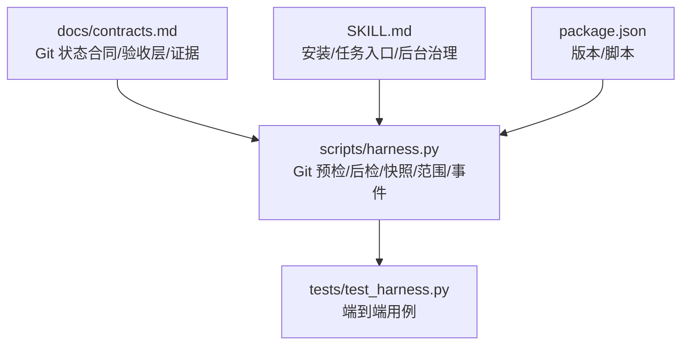
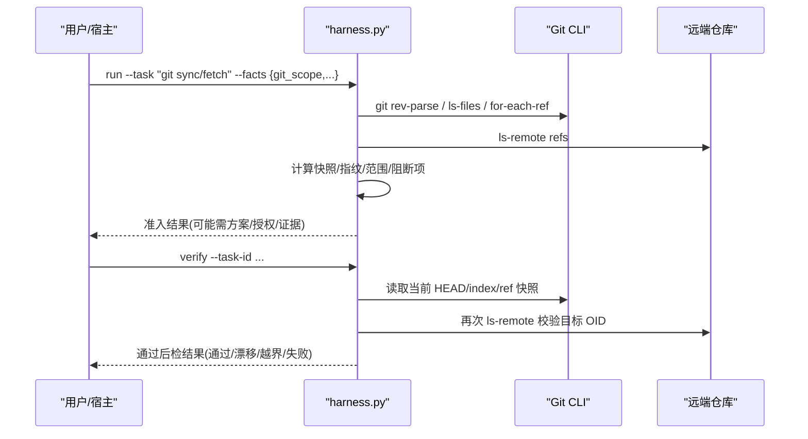
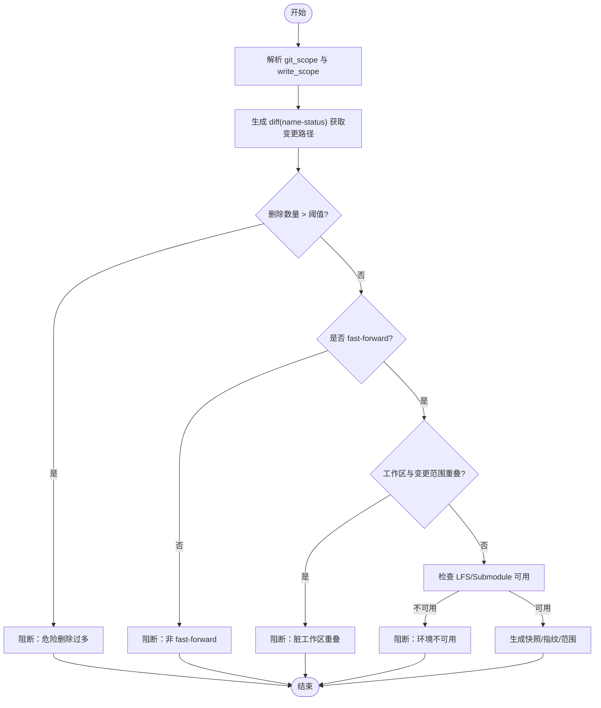
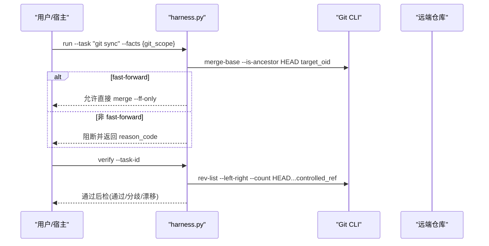
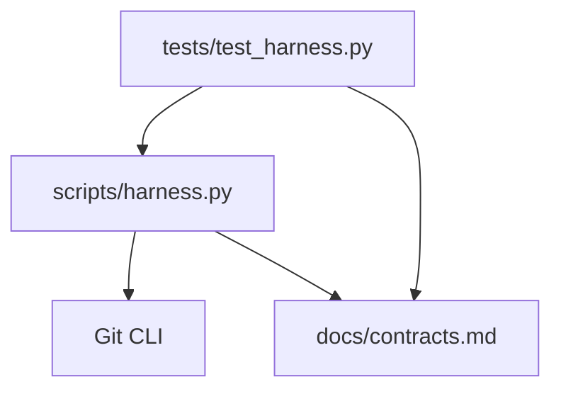

# 远程仓库同步

<cite>
**本文引用的文件**   
- [scripts/harness.py](file://scripts/harness.py)
- [tests/test_harness.py](file://tests/test_harness.py)
- [docs/contracts.md](file://docs/contracts.md)
- [SKILL.md](file://SKILL.md)
- [package.json](file://package.json)
</cite>

## 目录
1. [简介](#简介)
2. [项目结构](#项目结构)
3. [核心组件](#核心组件)
4. [架构总览](#架构总览)
5. [详细组件分析](#详细组件分析)
6. [依赖关系分析](#依赖关系分析)
7. [性能考量](#性能考量)
8. [故障排除指南](#故障排除指南)
9. [结论](#结论)
10. [附录](#附录)

## 简介
本文件面向 Docs Harness 的“远程仓库同步”能力，系统性阐述推送策略（增量、全量、选择性）、拉取策略（自动合并、冲突检测、手动干预）、多仓库同步（主从关系、双向同步、一致性保证）、网络异常处理（重试、超时、连接池）、配置与安全认证、性能优化与监控指标，以及故障排除方法。内容严格基于仓库内源码与合同文档进行归纳与可视化说明。

## 项目结构
- scripts/harness.py：控制器实现，包含 Git 预检查、后检查、快照、范围约束、事件记录、工作区指纹等核心逻辑。
- tests/test_harness.py：覆盖 git_fetch、git_sync、漂移、非 fast-forward、脏工作区、LFS/Submodule 等场景的测试用例。
- docs/contracts.md：Git 状态合同、验收层、证据收据、任务包 v2 等规范。
- SKILL.md：安装、任务入口、后台治理、交付层等高层行为说明。
- package.json：版本与脚本定义。

**图表来源** 
- [scripts/harness.py:575-878](file://scripts/harness.py#L575-L878)
- [docs/contracts.md:97-133](file://docs/contracts.md#L97-L133)

**章节来源**
- [scripts/harness.py:575-878](file://scripts/harness.py#L575-L878)
- [docs/contracts.md:97-133](file://docs/contracts.md#L97-L133)
- [SKILL.md:1-106](file://SKILL.md#L1-L106)
- [package.json:1-23](file://package.json#L1-L23)

## 核心组件
- Git 操作封装与超时控制：统一通过 git_command 调用，带超时与错误码转换。
- 远端引用探测与指纹：ls-remote、ref 快照、URL 脱敏指纹。
- 预检查（preflight）：校验目标 OID、fast-forward、变更范围、删除阈值、LFS/Submodule 可用性、脏工作区重叠等。
- 后检查（postcheck）：验证远端目标未变、受控 ref 未越界、HEAD/index/worktree 不变或匹配目标 OID、分支分歧检查、LFS/Submodule 有效性。
- 工作区快照与指纹：按 Git 列表或递归扫描，忽略敏感目录与大文件策略。
- 事件与审计：events.jsonl 记录阶段、耗时、原因码、上下文缓存命中、证据轮次等。

**章节来源**
- [scripts/harness.py:575-613](file://scripts/harness.py#L575-L613)
- [scripts/harness.py:615-678](file://scripts/harness.py#L615-L678)
- [scripts/harness.py:680-794](file://scripts/harness.py#L680-L794)
- [scripts/harness.py:796-878](file://scripts/harness.py#L796-L878)
- [scripts/harness.py:1115-1139](file://scripts/harness.py#L1115-L1139)
- [scripts/harness.py:1034-1074](file://scripts/harness.py#L1034-L1074)

## 架构总览
Docs Harness 在任务执行前对 Git 操作进行强约束与可观测性保障，确保 fetch/sync 的范围、对象与副作用被冻结并事后核验。

**图表来源** 
- [scripts/harness.py:680-794](file://scripts/harness.py#L680-L794)
- [scripts/harness.py:796-878](file://scripts/harness.py#L796-L878)
- [docs/contracts.md:97-133](file://docs/contracts.md#L97-L133)

## 详细组件分析

### 推送策略（增量、全量、选择性）
- 增量推送：以 diff 为基础，仅提交变化路径；由 git_name_status_paths 解析 name-status 输出得到变更清单，结合删除阈值限制危险批量删除。
- 全量推送：当需要覆盖式更新时，应显式声明 write_scope 为全仓范围，并通过 plan 明确影响面；控制器不自动推断全量写入。
- 选择性推送：通过 git_scope 绑定单一远端分支（如 .git:refs/remotes/origin/main），配合 write_scope 限定落盘文件集合，避免越界写入。

**图表来源** 
- [scripts/harness.py:648-678](file://scripts/harness.py#L648-L678)
- [scripts/harness.py:680-794](file://scripts/harness.py#L680-L794)

**章节来源**
- [scripts/harness.py:648-678](file://scripts/harness.py#L648-L678)
- [scripts/harness.py:680-794](file://scripts/harness.py#L680-L794)
- [tests/test_harness.py:651-735](file://tests/test_harness.py#L651-L735)

### 拉取策略（自动合并、冲突检测、手动干预）
- 自动合并：git_sync 要求 fast-forward；若满足则可直接 merge --ff-only，无需人工介入。
- 冲突检测：非 fast-forward、分支分歧、脏工作区重叠、删除过多均阻断；后检查会报告 remote_target_unchanged、branch_not_diverged、controlled_ref_matches_target 等。
- 手动干预：当出现漂移或越界时，返回 reason_code（如 git_remote_drift、git_ref_scope_violation），要求重新准入或修正工作区后再执行。

**图表来源** 
- [scripts/harness.py:680-794](file://scripts/harness.py#L680-L794)
- [scripts/harness.py:796-878](file://scripts/harness.py#L796-L878)
- [tests/test_harness.py:685-735](file://tests/test_harness.py#L685-L735)

**章节来源**
- [scripts/harness.py:680-794](file://scripts/harness.py#L680-L794)
- [scripts/harness.py:796-878](file://scripts/harness.py#L796-L878)
- [tests/test_harness.py:685-735](file://tests/test_harness.py#L685-L735)

### 多仓库同步（主从关系、双向同步、一致性保证）
- 主从关系：通过 git_scope 指定远端名称与分支（如 origin/main），控制器将 controlled_ref_namespace 扩展至 refs/remotes/<remote>/HEAD，确保 origin/HEAD 更新不被误判越界。
- 双向同步：控制器不主动发起 push；如需双向同步，需在宿主侧分别编排独立的 fetch/sync 任务，并以各自 git_scope 约束范围，避免交叉污染。
- 一致性保证：通过 snapshot 中的 repo_identity、url_fingerprint、preflight_target_oid、index_tree、worktree_fingerprint 锁定环境与目标；后检查逐项比对，确保远端目标未变、受控 ref 未越界、分支无分歧。

**章节来源**
- [scripts/harness.py:615-678](file://scripts/harness.py#L615-L678)
- [scripts/harness.py:680-794](file://scripts/harness.py#L680-L794)
- [scripts/harness.py:796-878](file://scripts/harness.py#L796-L878)
- [docs/contracts.md:97-133](file://docs/contracts.md#L97-L133)

### 网络异常处理（重试机制、超时控制、连接池管理）
- 超时控制：git_command 默认超时 20s，捕获 TimeoutExpired 并转换为结构化错误。
- 重试机制：控制器本身不内置指数退避重试；宿主要根据 reason_code 决定重试策略（如网络抖动导致的 git_remote_unavailable）。
- 连接池管理：通过 Git CLI 复用进程间连接；控制器不维护 HTTP 连接池，建议宿主侧使用具备连接池能力的 Git 客户端或代理。

**章节来源**
- [scripts/harness.py:575-586](file://scripts/harness.py#L575-L586)
- [scripts/harness.py:633-646](file://scripts/harness.py#L633-L646)

### 远程仓库配置示例与安全认证
- 配置要点：
  - git_scope 必须为 .git:refs/remotes/<remote>/<branch>，且 git_sync 要求单一分支。
  - controlled_refs_namespace 自动包含 refs/remotes/<remote>/HEAD，避免 origin/HEAD 更新误判。
- 安全认证：
  - 远端 URL 在指纹计算前移除用户名、密码、token、查询参数与 fragment，Runtime 不保存原文。
  - 建议在宿主侧通过 SSH key 或凭据管理器注入认证信息，控制器不存储凭证。

**章节来源**
- [scripts/harness.py:664-678](file://scripts/harness.py#L664-L678)
- [scripts/harness.py:588-613](file://scripts/harness.py#L588-L613)
- [docs/contracts.md:97-133](file://docs/contracts.md#L97-L133)

### 性能优化建议
- 快照优化：优先使用 git ls-files 列出跟踪文件，避免非 Git 工作区的递归扫描；大文件采用 size+mtime 指纹降低 IO。
- 变更范围最小化：通过 git diff --name-status 精确获取变更路径，减少后续校验与归因开销。
- 命令缓存：验证命令支持逐项收据缓存，避免重复执行相同输入的命令。

**章节来源**
- [scripts/harness.py:1115-1139](file://scripts/harness.py#L1115-L1139)
- [scripts/harness.py:1191-1203](file://scripts/harness.py#L1191-L1203)
- [docs/contracts.md:200-221](file://docs/contracts.md#L200-L221)

## 依赖关系分析
- harness.py 依赖 Git CLI 完成所有仓库交互，包括 rev-parse、ls-files、for-each-ref、ls-remote、diff、merge-base、lfs、submodule 等。
- contracts.md 定义了 Git 状态合同、验收层与证据收据格式，作为 harness.py 行为的契约依据。
- tests/test_harness.py 提供端到端用例，覆盖 fetch/sync、漂移、非 fast-forward、脏工作区、LFS/Submodule 等关键路径。

**图表来源** 
- [scripts/harness.py:575-878](file://scripts/harness.py#L575-L878)
- [docs/contracts.md:97-133](file://docs/contracts.md#L97-L133)
- [tests/test_harness.py:503-735](file://tests/test_harness.py#L503-L735)

**章节来源**
- [scripts/harness.py:575-878](file://scripts/harness.py#L575-L878)
- [docs/contracts.md:97-133](file://docs/contracts.md#L97-L133)
- [tests/test_harness.py:503-735](file://tests/test_harness.py#L503-L735)

## 性能考量
- 快照与指纹：对大文件采用 size+mtime 指纹，避免完整哈希计算；非 Git 工作区限制文件数量上限，防止快照过大。
- 变更范围：通过 name-status 解析重命名与删除，减少无关路径参与校验。
- 命令缓存：验证命令按 argv、produces 与输入指纹缓存，命中则跳过执行。

**章节来源**
- [scripts/harness.py:1115-1139](file://scripts/harness.py#L1115-L1139)
- [scripts/harness.py:1191-1203](file://scripts/harness.py#L1191-L1203)
- [docs/contracts.md:200-221](file://docs/contracts.md#L200-L221)

## 故障排除指南
- 常见阻断原因与定位：
  - 远端漂移：reason_code=git_remote_drift，检查 prefight_target_oid 是否与当前远端一致。
  - Ref 越界：reason_code=git_ref_scope_violation，确认 controlled_refs_namespace 是否覆盖变更 ref。
  - 非 fast-forward：检查 merge-base 与分支分歧，必要时 rebase 或合并。
  - 脏工作区重叠：清理与 git_sync 范围重叠的本地修改。
  - 删除过多：超过 GIT_DELETION_THRESHOLD，分批处理或删除。
  - LFS/Submodule 不可用：安装或修复 LFS/Submodule 环境。
- 调试步骤：
  - 查看 events.jsonl 的阶段与耗时，定位失败阶段。
  - 检查工作区快照指纹与 index_tree 是否变化。
  - 使用 git diff --name-status 对比 HEAD 与目标 OID，确认变更范围。
  - 通过 ls-remote 核对远端 ref 与 OID。

**章节来源**
- [scripts/harness.py:680-794](file://scripts/harness.py#L680-L794)
- [scripts/harness.py:796-878](file://scripts/harness.py#L796-L878)
- [scripts/harness.py:1034-1074](file://scripts/harness.py#L1034-L1074)
- [tests/test_harness.py:651-735](file://tests/test_harness.py#L651-L735)

## 结论
Docs Harness 的远程仓库同步以强约束与可观测性为核心，通过预检查与后检查确保 fetch/sync 的范围、对象与副作用被冻结并核验。结合 Git 状态合同与证据收据，形成从意图到执行的闭环。对于多仓库与双向同步，建议宿主侧编排独立任务并以 git_scope 约束范围，避免交叉污染。网络异常由宿主负责重试策略，控制器提供超时与结构化错误。性能方面通过快照优化、变更范围最小化与命令缓存提升效率。

## 附录
- 监控指标建议：
  - 事件计数：context_load_count、readmission_count、evidence_round_count、host_receipt_count、business_action_count。
  - 阶段耗时：duration_ms、started_at、ended_at。
  - Git 状态：changed_refs、outside_refs、remote_refs、lfs_available、submodule_available、fast_forward。
- 配置开关：
  - verification.command_cache_enabled：整体关闭验证命令缓存。
  - verification.auto_attribute_in_scope：关闭 write_scope 内自动归因。

**章节来源**
- [scripts/harness.py:1034-1074](file://scripts/harness.py#L1034-L1074)
- [scripts/harness.py:1191-1203](file://scripts/harness.py#L1191-L1203)
- [docs/contracts.md:283-302](file://docs/contracts.md#L283-L302)