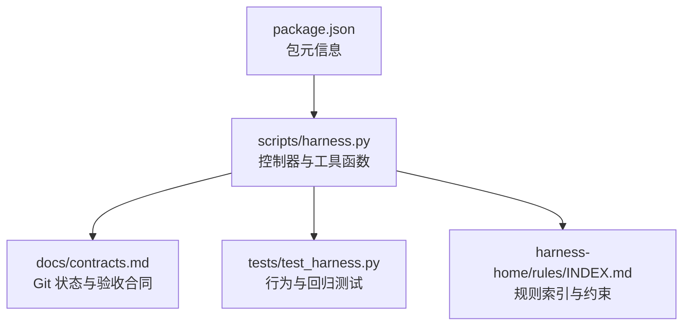
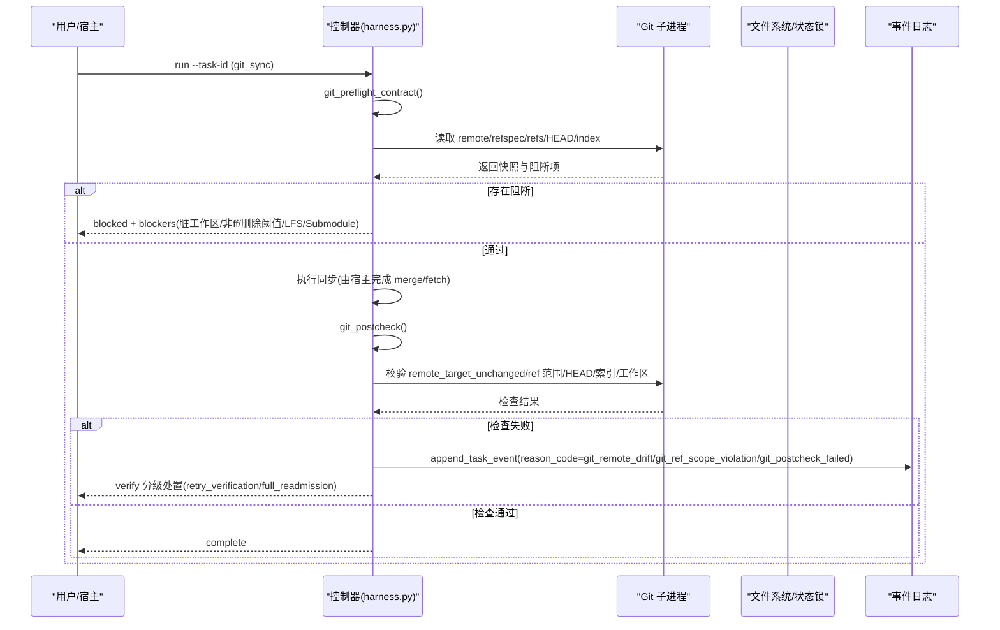
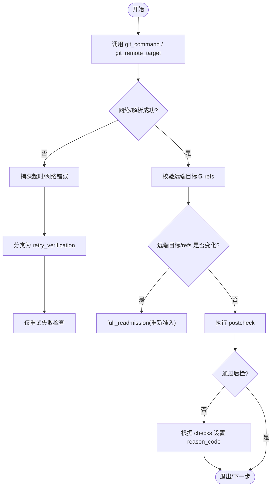
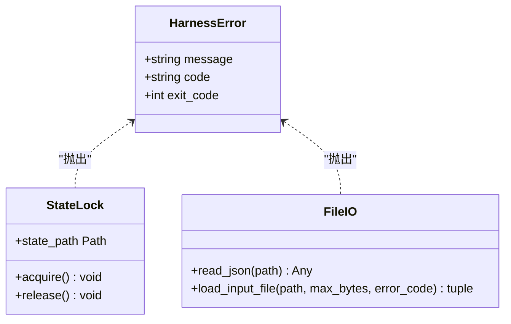
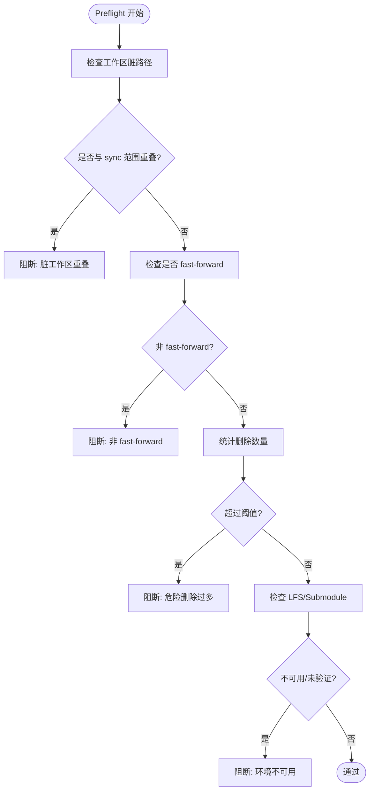
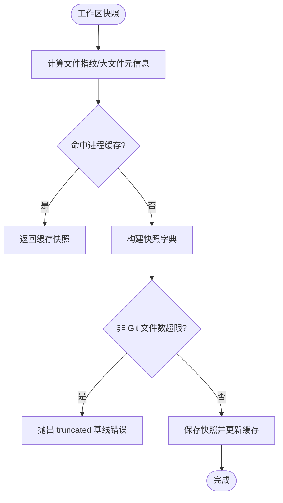
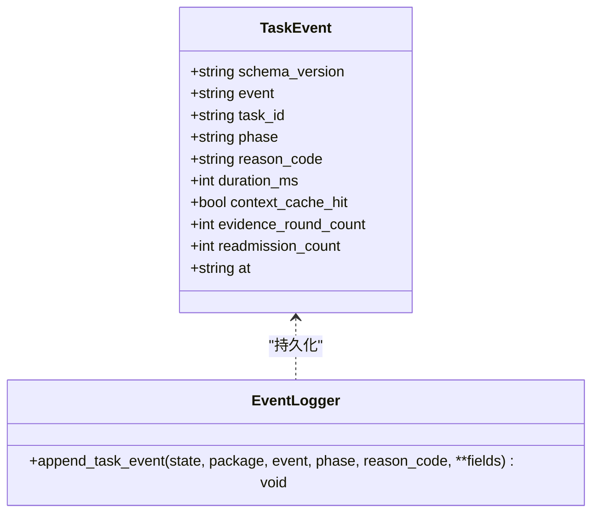
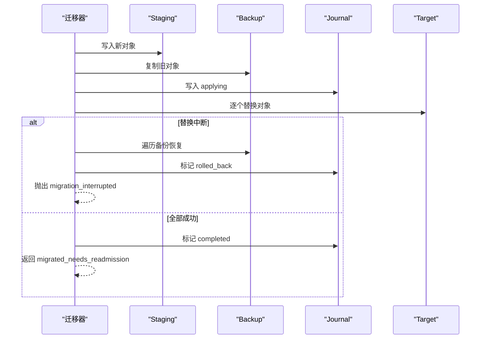
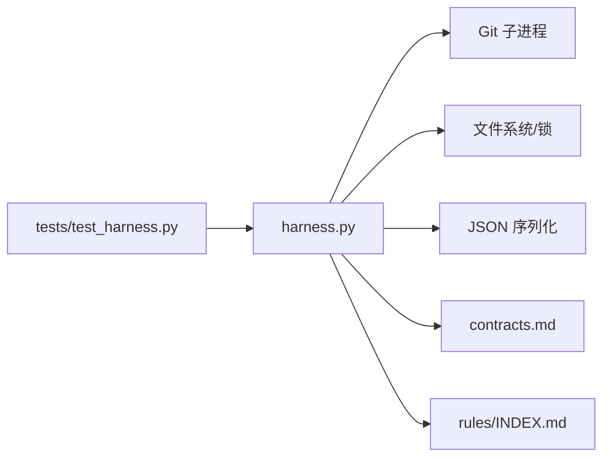

# 错误处理与恢复

<cite>
**本文引用的文件**
- [scripts/harness.py](file://scripts/harness.py)
- [tests/test_harness.py](file://tests/test_harness.py)
- [docs/contracts.md](file://docs/contracts.md)
- [harness-home/rules/INDEX.md](file://harness-home/rules/INDEX.md)
- [package.json](file://package.json)
</cite>

## 目录
1. [引言](#引言)
2. [项目结构](#项目结构)
3. [核心组件](#核心组件)
4. [架构总览](#架构总览)
5. [详细组件分析](#详细组件分析)
6. [依赖关系分析](#依赖关系分析)
7. [性能考量](#性能考量)
8. [故障排除指南](#故障排除指南)
9. [结论](#结论)
10. [附录](#附录)

## 引言
本文件聚焦 Docs Harness 的 Git 操作错误处理与恢复机制，覆盖网络异常、权限错误、冲突解决、数据完整性验证、错误日志记录、恢复机制以及配置与自定义处理器。文档以源码为依据，结合测试用例与合同说明，给出可操作的诊断与排障步骤。

## 项目结构
- scripts/harness.py：控制器主逻辑，包含 Git 预检/后检、状态锁、事件记录、迁移与恢复、工作区快照等。
- tests/test_harness.py：覆盖 Git fetch/sync、漂移、LFS/Submodule、脏工作区、非 fast-forward 等场景的错误与恢复。
- docs/contracts.md：Git 状态合同、验收层、退出码、verify 分级处置等规范。
- harness-home/rules/INDEX.md：规则索引与生效约束，影响准入与失败关闭策略。
- package.json：包元信息与脚本入口。

**图表来源**
- [scripts/harness.py:572-583](file://scripts/harness.py#L572-L583)
- [docs/contracts.md:97-132](file://docs/contracts.md#L97-L132)
- [tests/test_harness.py:651-734](file://tests/test_harness.py#L651-L734)
- [harness-home/rules/INDEX.md:1-41](file://harness-home/rules/INDEX.md#L1-L41)
- [package.json:1-23](file://package.json#L1-L23)

**章节来源**
- [scripts/harness.py:572-583](file://scripts/harness.py#L572-L583)
- [docs/contracts.md:97-132](file://docs/contracts.md#L97-L132)
- [tests/test_harness.py:651-734](file://tests/test_harness.py#L651-L734)
- [harness-home/rules/INDEX.md:1-41](file://harness-home/rules/INDEX.md#L1-L41)
- [package.json:1-23](file://package.json#L1-L23)

## 核心组件
- 统一异常类型与退出码：HarnessError 携带 code 与 exit_code，配合 CLI 退出码约定（0/1/2/3/4）形成一致的错误语义。
- Git 命令封装与超时保护：git_command 统一调用 git 子进程并捕获超时，抛出结构化错误。
- Git 预检与后检：git_preflight_contract 生成受控快照与阻断项；git_postcheck 校验远端目标、ref 范围、HEAD/索引/工作区一致性。
- 状态锁与并发控制：state_lock 提供任务级独占锁，区分活动锁与陈旧锁。
- 事件与审计：append_task_event 持久化事件，记录重试、重新准入、证据轮次等指标。
- 工作区快照与指纹：workspace_snapshot 计算变更指纹，支持缓存与截断保护。
- 迁移与回滚：migrate_v1_task_state 实现事务式迁移与自动回滚；recover_incomplete_task_migration 支持中断恢复。

**章节来源**
- [scripts/harness.py:392-397](file://scripts/harness.py#L392-L397)
- [scripts/harness.py:572-583](file://scripts/harness.py#L572-L583)
- [scripts/harness.py:677-791](file://scripts/harness.py#L677-L791)
- [scripts/harness.py:793-875](file://scripts/harness.py#L793-L875)
- [scripts/harness.py:1008-1029](file://scripts/harness.py#L1008-L1029)
- [scripts/harness.py:1031-1071](file://scripts/harness.py#L1031-L1071)
- [scripts/harness.py:1112-1149](file://scripts/harness.py#L1112-L1149)
- [scripts/harness.py:3208-3341](file://scripts/harness.py#L3208-L3341)
- [scripts/harness.py:3189-3206](file://scripts/harness.py#L3189-L3206)

## 架构总览
下图展示一次 Git sync 从预检到后检的关键流程，以及错误分支与恢复路径。

**图表来源**
- [scripts/harness.py:677-791](file://scripts/harness.py#L677-L791)
- [scripts/harness.py:793-875](file://scripts/harness.py#L793-L875)
- [scripts/harness.py:1031-1071](file://scripts/harness.py#L1031-L1071)
- [docs/contracts.md:97-132](file://docs/contracts.md#L97-L132)

## 详细组件分析

### Git 网络异常处理（连接超时、DNS 解析失败、网络中断）
- 超时保护：git_command 使用 subprocess.run(timeout=...) 捕获超时，抛出“Git 预检超时”并附带结构化 code。
- 远端不可用：git_remote_target 在 ls-remote 失败时抛出“无法读取目标远端引用”，用于识别 DNS/网络问题。
- 恢复策略：
  - 临时性网络失败归类为 retry_verification，仅重跑失败的检查。
  - 远端目标漂移或 ref 越界触发 full_readmission，要求重新准入。
- 测试覆盖：
  - 模拟 LFS/Submodule 不可用时，preflight 直接阻断并提示原因。
  - 远端漂移导致 verify 返回特定 reason_code。

**图表来源**
- [scripts/harness.py:572-583](file://scripts/harness.py#L572-L583)
- [scripts/harness.py:625-643](file://scripts/harness.py#L625-L643)
- [scripts/harness.py:793-875](file://scripts/harness.py#L793-L875)
- [docs/contracts.md:97-132](file://docs/contracts.md#L97-L132)

**章节来源**
- [scripts/harness.py:572-583](file://scripts/harness.py#L572-L583)
- [scripts/harness.py:625-643](file://scripts/harness.py#L625-L643)
- [scripts/harness.py:793-875](file://scripts/harness.py#L793-L875)
- [tests/test_harness.py:736-756](file://tests/test_harness.py#L736-L756)
- [tests/test_harness.py:620-649](file://tests/test_harness.py#L620-L649)

### 权限错误处理（权限不足、路径访问拒绝、仓库锁定）
- 目标目录与路径安全：safe_target 拒绝根目录/用户主目录作为目标，非法路径抛错。
- JSON 与文件读取：read_json/load_input_file 对缺失、大小限制、编码错误进行结构化报错。
- 状态锁冲突：state_lock 检测活动锁与陈旧锁（>5分钟），分别返回 state_locked 与 stale_lock。
- 处置建议：
  - 权限不足：修正文件或目录权限，确保当前用户具备读写能力。
  - 路径拒绝：确认目标在项目内且未被 .gitignore 或符号链接绕过。
  - 仓库锁定：清理陈旧锁或等待并发任务结束。

**图表来源**
- [scripts/harness.py:392-397](file://scripts/harness.py#L392-L397)
- [scripts/harness.py:532-538](file://scripts/harness.py#L532-L538)
- [scripts/harness.py:437-444](file://scripts/harness.py#L437-L444)
- [scripts/harness.py:456-482](file://scripts/harness.py#L456-L482)
- [scripts/harness.py:1008-1029](file://scripts/harness.py#L1008-L1029)

**章节来源**
- [scripts/harness.py:532-538](file://scripts/harness.py#L532-L538)
- [scripts/harness.py:437-444](file://scripts/harness.py#L437-L444)
- [scripts/harness.py:456-482](file://scripts/harness.py#L456-L482)
- [scripts/harness.py:1008-1029](file://scripts/harness.py#L1008-L1029)

### 冲突解决机制（自动检测、智能合并、手动界面）
- 自动冲突检测：
  - 脏工作区与 sync 范围重叠：preflight 阻断并列出重叠路径。
  - 非 fast-forward：preflight 判定失败，阻止直接同步。
  - 危险删除数量超过阈值：阻断以避免大规模破坏。
  - LFS/Submodule 不可用：阻断以确保一致性。
- 智能合并策略：
  - 仅允许 fast-forward 的 git_sync；若需合并，宿主应显式提交计划并通过 verify。
  - 远端漂移时，pull 落盘文件经 git_sync_landed_scope 自动归因并入 write_scope。
- 手动冲突解决：
  - 宿主按 next_action 指引加载上下文并提交方案；控制器冻结计划与范围后继续。
  - 若合同稳定，增量 Gate 可通过 incremental_admission 继续，无需完整重新准入。

**图表来源**
- [scripts/harness.py:677-791](file://scripts/harness.py#L677-L791)
- [docs/contracts.md:97-132](file://docs/contracts.md#L97-L132)

**章节来源**
- [scripts/harness.py:677-791](file://scripts/harness.py#L677-L791)
- [tests/test_harness.py:685-734](file://tests/test_harness.py#L685-L734)
- [docs/contracts.md:97-132](file://docs/contracts.md#L97-L132)

### 数据完整性验证（哈希校验、文件完整性、损坏修复）
- 哈希与指纹：
  - sha256_text/file_fingerprint/workspace_snapshot 用于对象与工作区指纹。
  - sanitized_remote_fingerprint 移除敏感信息后再计算指纹。
- 文件完整性：
  - atomic_write_text/atomic_write_json 保证原子写入与 fsync。
  - read_json/read_jsonl 对无效 JSON/行进行结构化报错。
- 损坏修复：
  - v1→v2 迁移采用 staging+backup+journal，失败自动回滚；recover_incomplete_task_migration 支持中断恢复。
  - 归档源对象漂移时报错 archive_source_drift，强制失效。

**图表来源**
- [scripts/harness.py:407-417](file://scripts/harness.py#L407-L417)
- [scripts/harness.py:585-596](file://scripts/harness.py#L585-L596)
- [scripts/harness.py:419-435](file://scripts/harness.py#L419-L435)
- [scripts/harness.py:437-444](file://scripts/harness.py#L437-L444)
- [scripts/harness.py:1112-1149](file://scripts/harness.py#L1112-L1149)
- [scripts/harness.py:3208-3341](file://scripts/harness.py#L3208-L3341)
- [scripts/harness.py:3189-3206](file://scripts/harness.py#L3189-L3206)

**章节来源**
- [scripts/harness.py:407-417](file://scripts/harness.py#L407-L417)
- [scripts/harness.py:585-596](file://scripts/harness.py#L585-L596)
- [scripts/harness.py:419-435](file://scripts/harness.py#L419-L435)
- [scripts/harness.py:437-444](file://scripts/harness.py#L437-L444)
- [scripts/harness.py:1112-1149](file://scripts/harness.py#L1112-L1149)
- [scripts/harness.py:3208-3341](file://scripts/harness.py#L3208-L3341)
- [scripts/harness.py:3189-3206](file://scripts/harness.py#L3189-L3206)

### 错误日志记录（分类、详细信息、调试输出）
- 事件模型：append_task_event 记录 phase、reason_code、duration_ms、context_cache_hit、evidence_round_count、readmission_count 等。
- 分类与去重：连续相同拒绝幂等去重；终态摘要以键值聚合。
- 调试信息：事件不保存敏感输入、环境变量、会话或绝对临时路径，仅保留有界信息与指纹。

**图表来源**
- [scripts/harness.py:1031-1071](file://scripts/harness.py#L1031-L1071)

**章节来源**
- [scripts/harness.py:1031-1071](file://scripts/harness.py#L1031-L1071)

### 恢复机制（事务回滚、状态重建、脏数据清理）
- 事务回滚：migrate_v1_task_state 使用 staging/backup/journal，任何中断均回滚至备份并标记 rolled_back。
- 状态重建：recover_incomplete_task_migration 扫描 journal 并恢复未完成迁移的对象。
- 脏数据清理：state_lock 清理陈旧锁；disposition_index_lock 防止并发写冲突。

**图表来源**
- [scripts/harness.py:3208-3341](file://scripts/harness.py#L3208-L3341)
- [scripts/harness.py:3189-3206](file://scripts/harness.py#L3189-L3206)

**章节来源**
- [scripts/harness.py:3208-3341](file://scripts/harness.py#L3208-L3341)
- [scripts/harness.py:3189-3206](file://scripts/harness.py#L3189-L3206)

### 配置选项与自定义错误处理器
- 验证配置：
  - verification.volatile_paths：追加容忍的临时路径模式（带固定根目录）。
  - verification.command_cache_enabled：整体开关验证命令缓存。
  - verification.auto_attribute_in_scope：是否自动归因 write_scope 内的写入。
- 自定义处理器：
  - 通过捕获 HarnessError 并根据 code 定制处理逻辑（如重试、降级、告警）。
  - 结合 CLI 退出码（0/1/2/3/4）向上层系统反馈。

**章节来源**
- [scripts/harness.py:1192-1213](file://scripts/harness.py#L1192-L1213)
- [scripts/harness.py:1216-1227](file://scripts/harness.py#L1216-L1227)
- [scripts/harness.py:392-397](file://scripts/harness.py#L392-L397)
- [docs/contracts.md:359-370](file://docs/contracts.md#L359-L370)

## 依赖关系分析
- 控制器依赖 Git 子进程、文件系统、JSON 序列化与时间戳。
- 规则索引与契约约束影响准入与失败关闭策略。
- 测试用例驱动关键路径与边界条件。

**图表来源**
- [scripts/harness.py:572-583](file://scripts/harness.py#L572-L583)
- [docs/contracts.md:97-132](file://docs/contracts.md#L97-L132)
- [harness-home/rules/INDEX.md:1-41](file://harness-home/rules/INDEX.md#L1-L41)
- [tests/test_harness.py:651-734](file://tests/test_harness.py#L651-L734)

**章节来源**
- [scripts/harness.py:572-583](file://scripts/harness.py#L572-L583)
- [docs/contracts.md:97-132](file://docs/contracts.md#L97-L132)
- [harness-home/rules/INDEX.md:1-41](file://harness-home/rules/INDEX.md#L1-L41)
- [tests/test_harness.py:651-734](file://tests/test_harness.py#L651-L734)

## 性能考量
- 工作区快照缓存：进程级缓存避免重复全量哈希，写入后需失效缓存。
- 验证命令缓存：默认开启，可按需关闭；失败只重跑失败命令。
- 事件与收据：结构化记录，避免冗余与敏感信息泄露。

[本节为通用指导，不直接分析具体文件]

## 故障排除指南
- 常见错误与定位：
  - Git 预检超时：检查网络连通性与 git 子进程可用性。
  - 远端不可用：确认 DNS/代理/认证配置。
  - 脏工作区重叠：清理或调整 sync 范围。
  - 非 fast-forward：先合并或 rebase 再同步。
  - LFS/Submodule 不可用：安装依赖或禁用相关功能。
  - 状态锁冲突：清理陈旧锁或等待并发任务结束。
- 诊断步骤：
  - 查看 events.jsonl 中的 reason_code 与阶段信息。
  - 检查 git_postcheck 的 checks 字段定位失败点。
  - 使用 verify 分级处置（retry_verification/refresh_evidence/incremental_admission/full_readmission）选择下一步。
  - 必要时执行 v1→v2 迁移并应用回滚保障。

**章节来源**
- [scripts/harness.py:793-875](file://scripts/harness.py#L793-L875)
- [scripts/harness.py:1031-1071](file://scripts/harness.py#L1031-L1071)
- [docs/contracts.md:359-370](file://docs/contracts.md#L359-L370)
- [tests/test_harness.py:685-734](file://tests/test_harness.py#L685-L734)

## 结论
Docs Harness 通过统一的异常模型、严格的 Git 预检/后检、细粒度的状态锁与事件审计、以及事务式迁移与恢复，构建了稳健的错误处理与恢复体系。结合五级 verify 处置与配置开关，可在保证安全与一致性的前提下提升效率与可维护性。

[本节为总结，不直接分析具体文件]

## 附录
- 退出码约定：0 成功；1 项目检查失败；2 输入/状态无效；3 需要补证/重试/迁移；4 需要重新准入。
- 关键函数路径参考：
  - Git 命令封装：scripts/harness.py:572-583
  - Preflight/Postcheck：scripts/harness.py:677-791, 793-875
  - 状态锁：scripts/harness.py:1008-1029
  - 事件记录：scripts/harness.py:1031-1071
  - 工作区快照：scripts/harness.py:1112-1149
  - 迁移与恢复：scripts/harness.py:3208-3341, 3189-3206

**章节来源**
- [docs/contracts.md:359-370](file://docs/contracts.md#L359-L370)
- [scripts/harness.py:572-583](file://scripts/harness.py#L572-L583)
- [scripts/harness.py:677-791](file://scripts/harness.py#L677-L791)
- [scripts/harness.py:793-875](file://scripts/harness.py#L793-L875)
- [scripts/harness.py:1008-1029](file://scripts/harness.py#L1008-L1029)
- [scripts/harness.py:1031-1071](file://scripts/harness.py#L1031-L1071)
- [scripts/harness.py:1112-1149](file://scripts/harness.py#L1112-L1149)
- [scripts/harness.py:3208-3341](file://scripts/harness.py#L3208-L3341)
- [scripts/harness.py:3189-3206](file://scripts/harness.py#L3189-L3206)