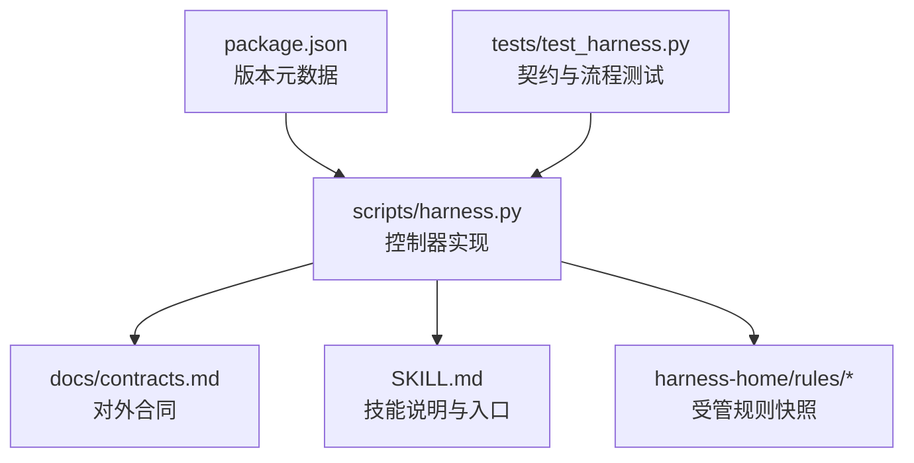
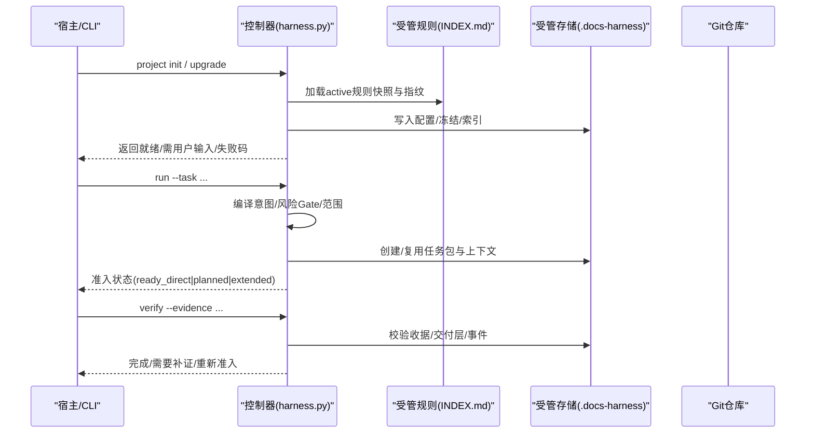
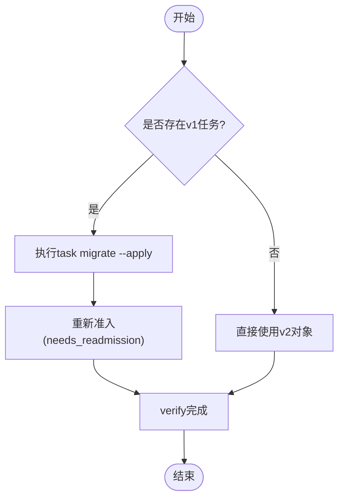
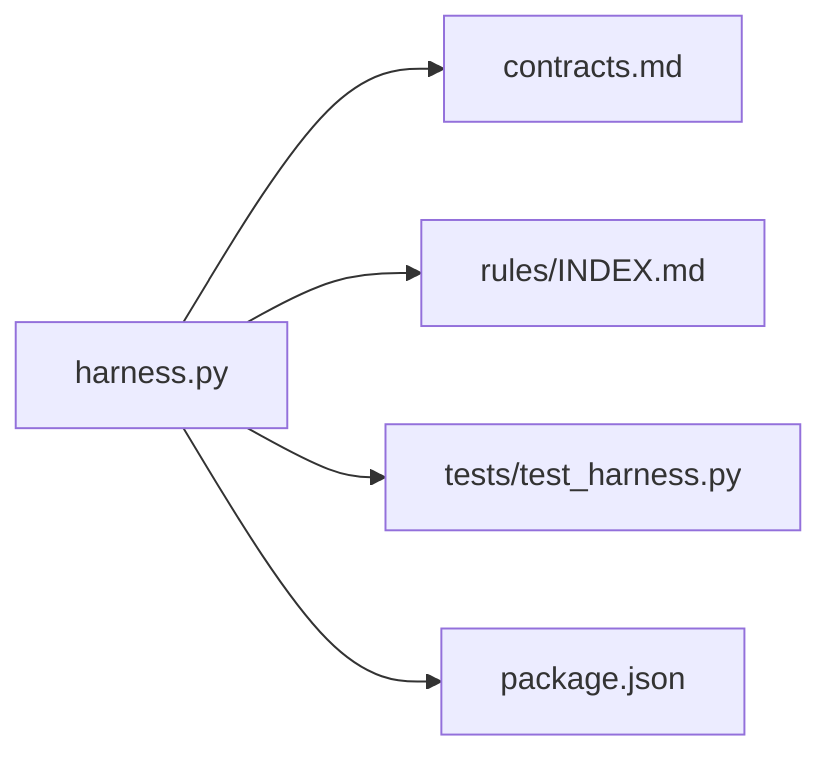
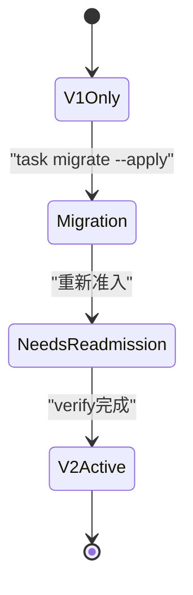

# API版本管理

<cite>
**本文引用的文件**   
- [harness.py](file://scripts/harness.py)
- [contracts.md](file://docs/contracts.md)
- [architecture.md](file://docs/architecture.md)
- [api-compatibility.md](file://harness-home/rules/api-compatibility.md)
- [INDEX.md](file://harness-home/rules/INDEX.md)
- [SKILL.md](file://SKILL.md)
- [package.json](file://package.json)
- [test_harness.py](file://tests/test_harness.py)
</cite>

## 目录
1. [简介](#简介)
2. [项目结构](#项目结构)
3. [核心组件](#核心组件)
4. [架构总览](#架构总览)
5. [详细组件分析](#详细组件分析)
6. [依赖关系分析](#依赖关系分析)
7. [性能与可观测性](#性能与可观测性)
8. [故障排查指南](#故障排查指南)
9. [结论](#结论)
10. [附录：版本矩阵与迁移路径](#附录版本矩阵与迁移路径)

## 简介
本文件面向Docs Harness的API版本管理，系统性阐述版本策略、兼容性保证、破坏性变更处理、版本检测机制、自动升级流程、迁移步骤与示例、废弃API标记与移除策略、版本兼容性矩阵与升级路径图，以及编写可移植客户端代码和版本测试/回归测试最佳实践。内容基于控制器源码、合同文档、规则与测试用例进行归纳与可视化说明，确保读者既能把握整体设计，也能落地执行。

## 项目结构
- 控制器真源位于 scripts/harness.py，负责项目安装/升级、任务准入、上下文、验收、知识生命周期与后台Job状态机。
- 对外行为由 docs/contracts.md、SKILL.md 描述；版本号在 package.json、SKILL.md frontmatter 与控制器常量保持一致。
- 受管规则位于 harness-home/rules/，随项目安装到 .docs-harness/harness-home/rules/，运行时不得依赖源码绝对路径。
- 测试位于 tests/test_harness.py，覆盖契约、规则与关键流程。

图表来源
- [harness.py:1-120](file://scripts/harness.py#L1-L120)
- [contracts.md:1-10](file://docs/contracts.md#L1-L10)
- [SKILL.md:1-25](file://SKILL.md#L1-L25)
- [package.json:1-10](file://package.json#L1-L10)
- [test_harness.py:1-45](file://tests/test_harness.py#L1-L45)

章节来源
- [architecture.md:1-26](file://docs/architecture.md#L1-L26)
- [package.json:1-23](file://package.json#L1-L23)

## 核心组件
- 版本常量与Schema标识：控制器集中声明当前版本与各对象Schema版本，用于版本检测、兼容判断与迁移路由。
- 任务包与证据收据：v1→v2迁移、回滚与只读保留旧证据，确保消费者平滑过渡。
- 完成清单与交付层：按层验证并生成结构化回执，支持增量准入与条件验收。
- 后台治理Job：独立于主任务的状态机，具备prepare/dispatch/progress/verify/retry等阶段，保障复杂流程的可审计与幂等。
- 规则与Gate：通过受管规则索引与指纹校验，强制API兼容、安全与发布授权等约束。

章节来源
- [harness.py:26-100](file://scripts/harness.py#L26-L100)
- [contracts.md:10-120](file://docs/contracts.md#L10-L120)
- [INDEX.md:1-41](file://harness-home/rules/INDEX.md#L1-L41)

## 架构总览
Docs Harness以“控制器+合同+规则”为核心，形成强契约、失败关闭、可回滚的版本治理体系。控制器通过Schema版本识别新旧对象，依据合同与规则决定准入、执行与验收；对破坏性变更提供显式迁移命令与回滚窗口，确保消费者不受静默影响。

图表来源
- [harness.py:1-120](file://scripts/harness.py#L1-L120)
- [contracts.md:50-120](file://docs/contracts.md#L50-L120)
- [INDEX.md:1-41](file://harness-home/rules/INDEX.md#L1-L41)

## 详细组件分析

### 版本策略与兼容性保证
- 版本常量与Schema：控制器维护VERSION与各对象的schema_version，所有对象必须携带正确的schema_version字段，用于版本检测与路由。
- 向后兼容：v1→v2迁移采用显式命令与备份回滚，旧对象保持只读，新对象优先使用v2；未声明消费者或回滚不可执行时停止实现。
- 破坏性变更：任何改变执行路线、授权、范围、方案字段、工作包或阻断交付物的变更，必须完整重新准入；新增高风险Gate需重新准入。
- 契约冻结与增量：合同与方案一次冻结，仅追加普通Gate且合同不变时走增量准入，避免重复执行完整run。

章节来源
- [harness.py:26-100](file://scripts/harness.py#L26-L100)
- [contracts.md:1-120](file://docs/contracts.md#L1-L120)
- [api-compatibility.md:1-29](file://harness-home/rules/api-compatibility.md#L1-L29)

### 版本检测机制与自动升级流程
- 版本检测：通过读取VERSION与各对象的schema_version，判定是否处于目标版本；项目配置使用固定schema_version（如project-config/v4）。
- 自动升级：project upgrade采用preserve-and-merge策略，仅同步明确拥有的文件或受管区块；非法路由或缺少路由合同的在途治理Job返回needs_manual_migration，不覆盖真源配置或旧Job scope。
- 规则一致性：项目安装复制固定规则快照并记录逐文件指纹；缺失、增加或变化均失败关闭，必须通过来源包升级或人工preserve-and-merge。

章节来源
- [harness.py:1-120](file://scripts/harness.py#L1-L120)
- [SKILL.md:1-25](file://SKILL.md#L1-L25)
- [INDEX.md:1-41](file://harness-home/rules/INDEX.md#L1-L41)

### 迁移指南：v1→v2
- 迁移命令：仅允许status/migrate(--apply)，迁移不静默执行；apply会在migration-v1-v2/创建staging、全对象backup、manifest与journal，再切换task-package、compiled-task、freeze、evidence-index、context receipts与authorization receipts。
- 回滚策略：任一步中断按全对象备份回滚；首次workspace基线保持不变；旧evidence只读保存在legacy_evidence，不满足v2任务。
- 活动任务保护：存在活动v2任务时，rollback-check返回active_v2_tasks；无活动任务时表示回滚窗口可用；回滚后的v2对象只读保留，旧控制器遇到v2对象必须失败关闭。

章节来源
- [contracts.md:236-282](file://docs/contracts.md#L236-L282)

### 废弃API标记与移除策略
- 弃用别名：knowledge job-status|dispatch|verify|retry作为background的兼容别名，但共享相同安全不变量；仅background_direct保留旧别名的contract_ready直达running兼容。
- 逐步淘汰：旧Schema（如task-package/v1）保持只读兼容，并通过迁移命令引导至v2；不再接受新的v1对象创建。
- 规则驱动：DH-API-COMPATIBILITY要求修改公共契约时必须说明受影响消费者、迁移顺序与可执行回滚路径，否则停止实现。

章节来源
- [contracts.md:332-340](file://docs/contracts.md#L332-L340)
- [api-compatibility.md:1-29](file://harness-home/rules/api-compatibility.md#L1-L29)

### 版本兼容性矩阵与升级路径图
- 兼容性矩阵：
  - task-package: v1(只读兼容) → v2(新任务必须)
  - evidence-receipt: v1(报告型) → v2(可信生产者绑定)
  - background-job: v1(只读兼容) → v2(控制面写权限)
  - project-config: v4(固定)
- 升级路径：
  - 新项目：直接v2
  - 已有v1任务：显式migrate后进入needs_readmission
  - 后台Job：v1只读兼容，upgrade中幂等迁移

图表来源
- [contracts.md:236-282](file://docs/contracts.md#L236-L282)

### 可移植API客户端代码编写指南
- 始终检查schema_version：根据响应中的schema_version选择解析逻辑，避免硬编码字段名。
- 容错处理未知字段：忽略未知字段，仅消费白名单字段，提升向前兼容。
- 使用最小必要能力：按需启用功能（如command_cache_enabled=false），避免依赖非必需特性。
- 幂等与重试：对run/verify/background等接口实现幂等调用与有限重试，应对网络或临时失败。
- 证据与收据：遵循evidence-receipt/v2格式，绑定task_id、target_identity、package_fingerprint与producer。

章节来源
- [contracts.md:165-221](file://docs/contracts.md#L165-L221)
- [harness.py:1-120](file://scripts/harness.py#L1-L120)

### 版本测试与回归测试最佳实践
- 契约测试：覆盖新旧Schema、错误路径与边界条件，确保响应结构与字段稳定。
- 规则测试：验证active规则指纹一致性与门禁行为，防止规则漂移。
- 集成测试：模拟Git/fresh clone/远端交付场景，验证交付层与证据链。
- 自动化：使用npm test与self-test脚本，结合临时项目与快照比对，确保升级前后行为一致。

章节来源
- [test_harness.py:1-200](file://tests/test_harness.py#L1-L200)
- [package.json:17-22](file://package.json#L17-L22)

## 依赖关系分析
- 控制器依赖：
  - 合同文档：定义对外行为与Schema
  - 规则索引：约束API兼容与安全
  - 测试套件：验证契约与流程
- 外部依赖：
  - Git：用于版本控制与快照
  - Python环境：运行控制器与测试

图表来源
- [harness.py:1-120](file://scripts/harness.py#L1-L120)
- [contracts.md:1-10](file://docs/contracts.md#L1-L10)
- [INDEX.md:1-41](file://harness-home/rules/INDEX.md#L1-L41)
- [test_harness.py:1-45](file://tests/test_harness.py#L1-L45)
- [package.json:1-10](file://package.json#L1-L10)

章节来源
- [architecture.md:1-26](file://docs/architecture.md#L1-L26)

## 性能与可观测性
- 事件脱敏：事件仅保存有界字段，不记录敏感信息，便于审计与性能分析。
- 命令缓存：验证命令支持收据缓存，减少重复执行，提升效率。
- 退出码规范：统一退出码语义，便于上层编排与监控。

章节来源
- [contracts.md:283-372](file://docs/contracts.md#L283-L372)

## 故障排查指南
- 常见错误：
  - 规则指纹漂移：检查harness-home/rules/完整性与指纹
  - 合同不一致：核对schema_version与字段白名单
  - 迁移失败：查看migration-v1-v2/日志与备份
- 诊断步骤：
  - 使用task status/migrate/status检查任务状态
  - 运行self-test验证控制器自检
  - 检查.gitignore与.exclusion确保Runtime不被隐藏

章节来源
- [contracts.md:236-282](file://docs/contracts.md#L236-L282)
- [package.json:17-22](file://package.json#L17-L22)

## 结论
Docs Harness通过严格的版本策略、契约化设计与规则驱动，实现了高可靠、可回滚、可审计的API版本管理。开发者应遵循Schema版本检测、向后兼容原则与显式迁移流程，编写可移植客户端代码，并通过全面测试保障升级稳定性。

## 附录：版本矩阵与迁移路径

### 版本兼容性矩阵
- task-package: v1(只读) → v2(强制)
- evidence-receipt: v1(报告) → v2(可信)
- background-job: v1(只读) → v2(控制面)
- project-config: v4(固定)

### 升级路径图

图表来源
- [contracts.md:236-282](file://docs/contracts.md#L236-L282)