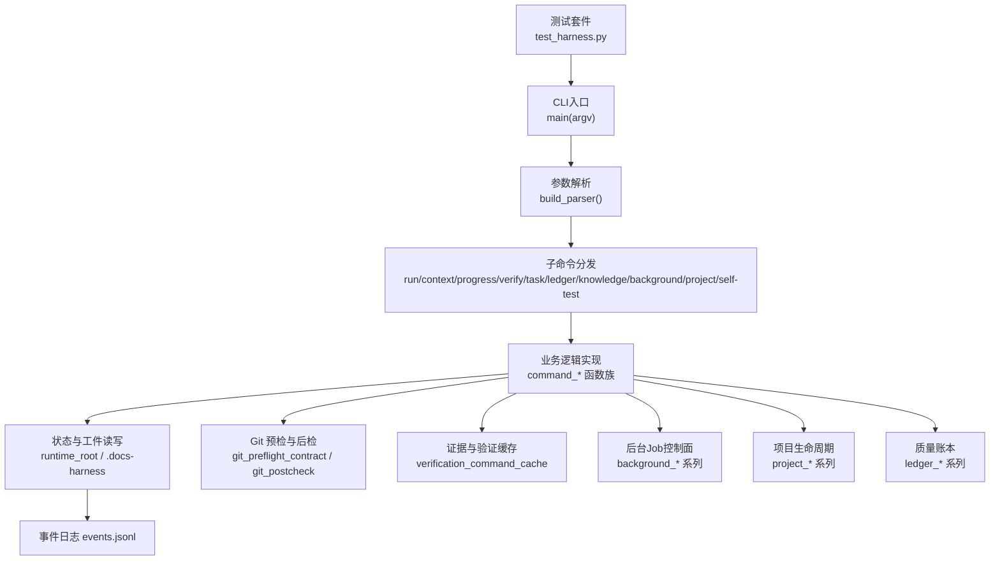
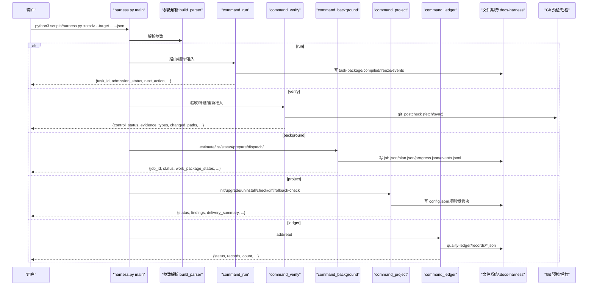
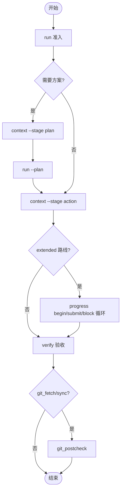

# CLI命令参考

<cite>
**本文引用的文件**   
- [scripts/harness.py](file://scripts/harness.py)
- [package.json](file://package.json)
- [SKILL.md](file://SKILL.md)
- [tests/test_harness.py](file://tests/test_harness.py)
</cite>

## 目录
1. [简介](#简介)
2. [项目结构](#项目结构)
3. [核心组件](#核心组件)
4. [架构总览](#架构总览)
5. [详细命令参考](#详细命令参考)
6. [依赖关系与执行顺序](#依赖关系与执行顺序)
7. [性能考虑](#性能考虑)
8. [故障排除指南](#故障排除指南)
9. [结论](#结论)
10. [附录](#附录)

## 简介
本参考文档面向 Docs Harness 的命令行工具，系统化说明 run、verify、background、project、ledger 等所有子命令的参数、使用示例、返回值格式与错误处理。同时给出命令间的依赖关系、执行顺序、最佳实践与性能优化建议，帮助使用者高效、安全地完成任务路由、证据验收、后台治理、项目安装与质量账本管理。

## 项目结构
Docs Harness 的 CLI 由单一 Python 脚本提供，通过 argparse 构建子命令树；JSON 输出由统一 emit 函数控制。测试用例展示了常见用法与契约校验。

图表来源 
- [scripts/harness.py:10337-10375](file://scripts/harness.py#L10337-L10375)
- [scripts/harness.py:10175-10294](file://scripts/harness.py#L10175-L10294)
- [tests/test_harness.py:59-87](file://tests/test_harness.py#L59-L87)

章节来源
- [scripts/harness.py:10175-10294](file://scripts/harness.py#L10175-L10294)
- [scripts/harness.py:10337-10375](file://scripts/harness.py#L10337-L10375)
- [tests/test_harness.py:59-87](file://tests/test_harness.py#L59-L87)

## 核心组件
- 参数解析与分发：build_parser 定义所有子命令与参数；main 负责分发到 command_* 实现。
- 输出格式化：emit 根据 --json 标志输出 JSON 或人类可读文本。
- 任务状态与事件：每个任务在运行时目录维护 package、compiled、freeze、events.jsonl 等工件。
- Git 安全边界：pre/post check 确保 fetch/sync 范围与目标一致性，防止越界写入。
- 证据系统：v2 evidence-receipt 强绑定任务包与目标身份，支持声明草案自动装订为收据。
- 后台治理：统一的 background 控制器，支持 estimate/list/status/prepare/dispatch/progress/verify/retry/prune。
- 项目生命周期：init/upgrade/uninstall/check/diff/rollback-check 管理安装、升级与回滚检查。
- 质量账本：ledger add/read 记录与检索脱敏复盘，限制扫描上限与读取条数。

章节来源
- [scripts/harness.py:10175-10294](file://scripts/harness.py#L10175-L10294)
- [scripts/harness.py:10297-10303](file://scripts/harness.py#L10297-L10303)
- [scripts/harness.py:906-916](file://scripts/harness.py#L906-L916)
- [scripts/harness.py:5076-5228](file://scripts/harness.py#L5076-L5228)
- [scripts/harness.py:7452-7501](file://scripts/harness.py#L7452-L7501)
- [scripts/harness.py:9466-9600](file://scripts/harness.py#L9466-L9600)
- [scripts/harness.py:7000-7081](file://scripts/harness.py#L7000-L7081)

## 架构总览
下图展示 CLI 调用链路与关键子系统交互。

图表来源 
- [scripts/harness.py:10337-10375](file://scripts/harness.py#L10337-L10375)
- [scripts/harness.py:10175-10294](file://scripts/harness.py#L10175-L10294)
- [scripts/harness.py:793-875](file://scripts/harness.py#L793-L875)
- [scripts/harness.py:9466-9600](file://scripts/harness.py#L9466-L9600)
- [scripts/harness.py:7000-7081](file://scripts/harness.py#L7000-L7081)

## 详细命令参考

### 通用选项
- --target: 项目根目录（默认当前目录）
- --json: 以 JSON 格式输出（推荐用于自动化）
- --version: 打印版本

章节来源
- [scripts/harness.py:10170-10178](file://scripts/harness.py#L10170-L10178)

### run：任务路由、任务包编译与执行准入
- 作用：解析任务意图、生成候选意图、计算风险 Gate、编译任务包并返回准入状态与下一步动作。
- 必需参数
  - --target: 项目根目录
  - --task: 原始用户任务文本
- 可选参数
  - --task-id: 继续已有任务并完成方案、授权或重新准入
  - --new-task: 跳过活动任务幂等复用，强制新建任务
  - --facts: 结构化任务事实 JSON 文件路径（不接受内联内容）
  - --plan: 正式方案 Markdown 或 JSON 文件路径（不接受内联内容）
  - --authorization: 结构化授权 JSON 文件路径（不接受内联内容）
  - --scope: 项目内允许范围，可重复
  - --feature: 显式选择功能 ID，可重复
  - --action: 允许动作，可重复
  - --success: 成功标准，可重复
- 典型流程
  - 首次运行：返回 admission_status 与 next_action（如 load_plan_context/submit_plan/obtain_authorization/load_action_context/verify）。
  - 继续任务：传入 --task-id 完成后续阶段。
- 输出要点（JSON）
  - task_id、admission_status、execution_route、mutation_profile、write_scope、allowed_actions、matched_gates、next_action、next_command_argv、blockers、knowledge_context、context_schedule、verification_commands 等。
- 常见示例
  - 查询类只读任务：python3 scripts/harness.py run --target . --task "列出项目文档结构" --json
  - 需要方案的同步任务：python3 scripts/harness.py run --target . --task "执行 git pull 同步远端" --facts facts.json --json
- 错误码与退出码
  - 非法输入/范围描述：code=invalid_scope_description
  - 缺少必要工件：code=missing_file/invalid_json
  - Git 预检失败：exit_code=3（如 git_preflight_failed/git_remote_unavailable）

章节来源
- [scripts/harness.py:10180-10208](file://scripts/harness.py#L10180-L10208)
- [scripts/harness.py:1244-1253](file://scripts/harness.py#L1244-L1253)
- [scripts/harness.py:541-544](file://scripts/harness.py#L541-L544)
- [scripts/harness.py:546-583](file://scripts/harness.py#L546-L583)
- [tests/test_harness.py:429-448](file://tests/test_harness.py#L429-L448)
- [tests/test_harness.py:503-537](file://tests/test_harness.py#L503-L537)

### context：按阶段加载精确上下文并写回执
- 作用：为 plan/action/acceptance 阶段加载最小必要上下文，并写入 context receipt。
- 必需参数
  - --target
  - --task-id
- 可选参数
  - --stage: plan|action|acceptance（默认 action）
  - --work-package: extended 工作包标识
- 输出要点
  - 返回 next_action 与 artifact_ref（如 plan.json），以及 context_receipt 引用。
- 示例
  - python3 scripts/harness.py context --target . --task-id dh-... --stage plan --json

章节来源
- [scripts/harness.py:10209-10214](file://scripts/harness.py#L10209-L10214)
- [scripts/harness.py:936-1005](file://scripts/harness.py#L936-L1005)

### progress：推进 extended 工作包状态
- 作用：对 execution_route=extended 的任务，管理工作包 begin/submit/block 与状态机。
- 必需参数
  - --target
  - --task-id
  - action: status|begin|submit|block
- 可选参数
  - --work-package: 工作包ID（begin/submit/block 必需）
  - --evidence: 结构化证据 JSON 文件路径（submit 必需）
  - --reason: block 原因码
  - --scope-changed: 标记范围变化
  - --handoff: 返回 handoff 信息
- 状态流转
  - pending → in_progress（begin）→ verified（submit）或 blocked（block）
- 输出要点
  - status/current_work_package/work_package_states/next_action/blockers/evidence_refs
- 示例
  - python3 scripts/harness.py progress --target . --task-id dh-... --action begin --work-package wp-01 --json
  - python3 scripts/harness.py progress --target . --task-id dh-... --action submit --work-package wp-01 --evidence ev.json --json

章节来源
- [scripts/harness.py:10215-10228](file://scripts/harness.py#L10215-L10228)
- [scripts/harness.py:5515-5682](file://scripts/harness.py#L5515-L5682)

### verify：同源验收、补证或重新准入
- 作用：消费冻结的工作区快照，校验变更、引用漂移、Gate 变化，执行验证命令缓存与后置检查。
- 必需参数
  - --target
  - --task-id
- 可选参数
  - --evidence: 结构化证据 JSON 文件路径，可重复
- 输出要点
  - control_status、evidence_types、changed_paths、git_postcheck、blockers、next_action
- 示例
  - python3 scripts/harness.py verify --target . --task-id dh-... --evidence ev.json --json
- 行为特性
  - 验证命令逐项缓存（可通过配置关闭）
  - write_scope 内未归因写入自动归因（可通过配置关闭）
  - read_set 漂移时仅失效相关证据引用

章节来源
- [scripts/harness.py:10229-10238](file://scripts/harness.py#L10229-L10238)
- [scripts/harness.py:5076-5228](file://scripts/harness.py#L5076-L5228)
- [scripts/harness.py:5238-5340](file://scripts/harness.py#L5238-L5340)
- [scripts/harness.py:5769-5792](file://scripts/harness.py#L5769-L5792)
- [scripts/harness.py:793-875](file://scripts/harness.py#L793-L875)

### task：查询、取消、归档、清理任务或显式迁移 v1 在途任务
- 作用：任务生命周期管理与 v1/v2 兼容迁移。
- 必需参数
  - --target
  - action: status|migrate|cancel|archive|list|prune
- 可选参数
  - --task-id
  - --apply: 显式应用迁移/取消/归档/清理（缺省仅预览）
  - --reason-code: 受控取消或归档原因码
  - --older-than: prune 候选的最小天数
  - --dry-run: 显式声明仅生成 prune 候选
  - --include-archived: list 包含已归档 v1 对象
- 示例
  - python3 scripts/harness.py task --target . --action status --task-id dh-... --json
  - python3 scripts/harness.py task --target . --action migrate --apply --json

章节来源
- [scripts/harness.py:10239-10248](file://scripts/harness.py#L10239-L10248)

### ledger：人工触发的个人本地质量账本
- 作用：记录与检索脱敏复盘，限制扫描上限与读取条数。
- 必需参数
  - --target
  - action: add|read
- 可选参数
  - --task-id: 要记录或精确读取的任务编号
  - --review: 脱敏质量复盘 JSON 文件路径（add 必需）
  - --query: 文本检索（read）
  - --limit: 读取条数，范围 1-20，默认 5
- 输出要点
  - add: status/record_ref/content_fingerprint/changed
  - read: status/records/invalid_records/count
- 示例
  - python3 scripts/harness.py ledger --target . --action add --task-id dh-... --review review.json --json
  - python3 scripts/harness.py ledger --target . --action read --query "安全" --limit 5 --json

章节来源
- [scripts/harness.py:10249-10260](file://scripts/harness.py#L10249-L10260)
- [scripts/harness.py:7000-7081](file://scripts/harness.py#L7000-L7081)

### knowledge：功能知识库审查、评估与兼容后台入口
- 作用：知识地图审计、估算、引导 bootstrap/update，并提供 legacy 别名（job-status/dispatch/retry/verify）。
- 必需参数
  - --target
  - action: status|estimate|audit|bootstrap|update|verify|job-status|dispatch|retry
- 可选参数
  - --assessment: 结构化知识审查报告
  - --consent: 已有 docs 的知识更新同意回执
  - --job-id: 知识维护 Job ID
  - --job-status: 宿主报告的 Job 调度状态
  - --result: updated|no_change（默认 updated）
- 示例
  - python3 scripts/harness.py knowledge --target . --action estimate --json
  - python3 scripts/harness.py knowledge --target . --action audit --assessment assess.json --json

章节来源
- [scripts/harness.py:9002-9171](file://scripts/harness.py#L9002-L9171)
- [scripts/harness.py:10261-10269](file://scripts/harness.py#L10261-L10269)

### background：统一后台文档治理 Job 控制器
- 作用：创建与管理后台 Job（含知识增量同步与交付治理），支持复杂路线 Goal/Plan/Progress 控制面。
- 必需参数
  - --target
  - action: estimate|list|status|prepare|progress|dispatch|verify|retry|prune
- 可选参数
  - --candidate: 后台候选项 JSON 文件路径
  - --job-id: 统一后台 Job ID
  - --job-status: 宿主报告的 Job 状态
  - --work-package-id: 冻结方案中的工作包 ID
  - --work-package-status: in_progress|completed|blocked
  - --reason-code: 有界、受控的原因码
  - --repair: 显式归档并修复无效 Goal 工件
  - --assessment: 知识或重大发现验收报告文件
  - --result: updated|no_change|completed_with_finding（默认 updated）
  - --older-than: prune 候选的最小天数
  - --apply: 显式应用 prune；缺省仅 dry-run
  - --dry-run: 显式声明仅生成 prune 候选
- 示例
  - python3 scripts/harness.py background --target . --action estimate --candidate cand.json --json
  - python3 scripts/harness.py background --target . --action prepare --job-id bg-... --json
  - python3 scripts/harness.py background --target . --action dispatch --job-id bg-... --job-status dispatched --json
  - python3 scripts/harness.py background --target . --action progress --job-id bg-... --work-package-id wp-01 --work-package-status completed --json
  - python3 scripts/harness.py background --target . --action verify --job-id bg-... --assessment assess.json --json
  - python3 scripts/harness.py background --target . --action retry --job-id bg-... --json

章节来源
- [scripts/harness.py:10270-10285](file://scripts/harness.py#L10270-L10285)
- [scripts/harness.py:7413-7449](file://scripts/harness.py#L7413-L7449)
- [scripts/harness.py:7318-7384](file://scripts/harness.py#L7318-L7384)

### project：项目安装生命周期
- 作用：初始化、升级、卸载、检查、差异对比与回滚检查。
- 必需参数
  - --target
  - action: init|upgrade|uninstall|check|diff|rollback-check
- 可选参数
  - --apply: 显式应用（uninstall/upgrade）
  - --purge-runtime: 清理运行时目录（uninstall）
- 示例
  - python3 scripts/harness.py project --target . --action init --json
  - python3 scripts/harness.py project --target . --action upgrade --apply --json
  - python3 scripts/harness.py project --target . --action check --json
  - python3 scripts/harness.py project --target . --action diff --json
  - python3 scripts/harness.py project --target . --action uninstall --apply --purge-runtime --json

章节来源
- [scripts/harness.py:10286-10291](file://scripts/harness.py#L10286-L10291)
- [scripts/harness.py:9466-9600](file://scripts/harness.py#L9466-L9600)
- [scripts/harness.py:10037-10115](file://scripts/harness.py#L10037-L10115)

### self-test：内置合同自检
- 作用：校验控制器版本、命令解析器、规则集、独立运行时名称、v2 契约、背景目标桥接、文档路由契约、完成清单契约等。
- 示例
  - python3 scripts/harness.py self-test --target . --json

章节来源
- [scripts/harness.py:10118-10167](file://scripts/harness.py#L10118-L10167)

## 依赖关系与执行顺序
- run → context(plan) → run(submit_plan) → context(action) → progress(begin/submit/block)* → verify
- verify 内部可能触发：
  - 验证命令缓存命中则跳过执行
  - read_set 漂移导致部分证据失效
  - git_postcheck 校验 fetch/sync 范围与目标一致性
- background 复杂路线：
  - prepare → create_host_goal → dispatched → running
  - progress 必须遵循冻结工作包全集与指纹校验
- project：
  - init/upgrade 会校验 source_version_inconsistent、install_conflict、invalid_document_route_config 等
- ledger：
  - add 需锁定 quality-ledger 目录，避免并发冲突

图表来源 
- [scripts/harness.py:936-1005](file://scripts/harness.py#L936-L1005)
- [scripts/harness.py:5515-5682](file://scripts/harness.py#L5515-L5682)
- [scripts/harness.py:793-875](file://scripts/harness.py#L793-L875)

章节来源
- [scripts/harness.py:936-1005](file://scripts/harness.py#L936-L1005)
- [scripts/harness.py:5515-5682](file://scripts/harness.py#L5515-L5682)
- [scripts/harness.py:793-875](file://scripts/harness.py#L793-L875)

## 性能考虑
- 验证命令缓存：基于 task_id/target_identity/command_argv_digest/cwd/input_fingerprint/contract_digest 生成 cache_key，命中则跳过执行。可通过 verification.command_cache_enabled 整体关闭。
- 工作区快照：非 Git 工作区快照超过阈值会拒绝截断基线，避免大仓库性能问题。
- 证据索引：evidence-index.json 仅保留唯一 source_fingerprint，避免重复存储。
- 后台 Job 索引：background index.jsonl 记录摘要，加速状态查询。
- 知识库存扫描：bounded_project_inventory 限制文件大小与数量，避免 OOM。

章节来源
- [scripts/harness.py:5746-5792](file://scripts/harness.py#L5746-L5792)
- [scripts/harness.py:1112-1135](file://scripts/harness.py#L1112-L1135)
- [scripts/harness.py:5343-5348](file://scripts/harness.py#L5343-L5348)
- [scripts/harness.py:7468-7501](file://scripts/harness.py#L7468-L7501)
- [scripts/harness.py:7717-7764](file://scripts/harness.py#L7717-L7764)

## 故障排除指南
- 常见错误码
  - invalid_request/invalid_task_id/missing_target/unsafe_target：目标或任务ID无效
  - missing_file/invalid_json：文件缺失或 JSON 无效
  - invalid_scope_description：范围描述不合法
  - git_preflight_failed/git_remote_unavailable/git_remote_ref_missing：Git 预检失败
  - evidence_not_passed/evidence_binding_mismatch/evidence_expired：证据无效或过期
  - install_conflict/source_version_inconsistent：安装冲突或版本不一致
  - invalid_document_route_config：文档路由配置非法
- 定位步骤
  - 使用 --json 输出完整 payload，关注 code/message/next_action
  - 查看 events.jsonl 与 evidence-index.json 定位阶段与证据
  - 检查 .docs-harness/config.json 与 rules_root 是否一致
  - 对于 Git 操作，确认 remote 与 refspec 正确且 fast-forward 可行
- 恢复建议
  - 重新运行 run --task-id 完成后续阶段
  - 修正证据文件后再次 verify
  - 对 background 复杂路线，先 prepare 再 dispatch/running
  - 对 project 升级失败，先 diff 查看变更，必要时手动迁移

章节来源
- [scripts/harness.py:392-397](file://scripts/harness.py#L392-L397)
- [scripts/harness.py:546-583](file://scripts/harness.py#L546-L583)
- [scripts/harness.py:5076-5228](file://scripts/harness.py#L5076-L5228)
- [scripts/harness.py:9466-9600](file://scripts/harness.py#L9466-L9600)
- [scripts/harness.py:10037-10115](file://scripts/harness.py#L10037-L10115)

## 结论
Docs Harness CLI 提供了从任务准入、证据验收、后台治理到项目生命周期与质量账本的完整闭环。通过严格的范围与 Gate 控制、证据绑定与缓存机制、以及健壮的 Git 前后置检查，确保变更可控、可审计、可恢复。建议在生产环境中始终使用 --json 输出并结合自动化流水线进行编排与监控。

## 附录
- 版本与脚本入口
  - VERSION=1.6.5，脚本位于 scripts/harness.py
  - package.json 提供 npm 脚本与元数据
- 技能说明
  - SKILL.md 描述了安装、任务入口、后台治理与质量账本的使用要点

章节来源
- [scripts/harness.py:26-52](file://scripts/harness.py#L26-L52)
- [package.json:1-23](file://package.json#L1-L23)
- [SKILL.md:1-105](file://SKILL.md#L1-L105)