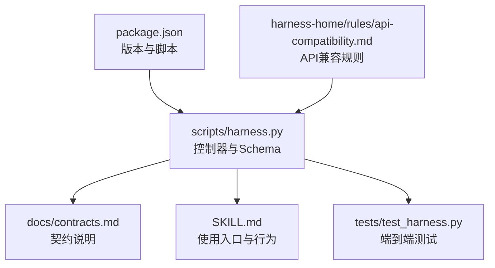
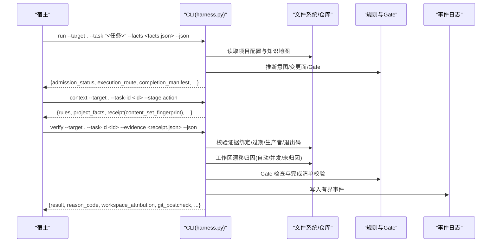
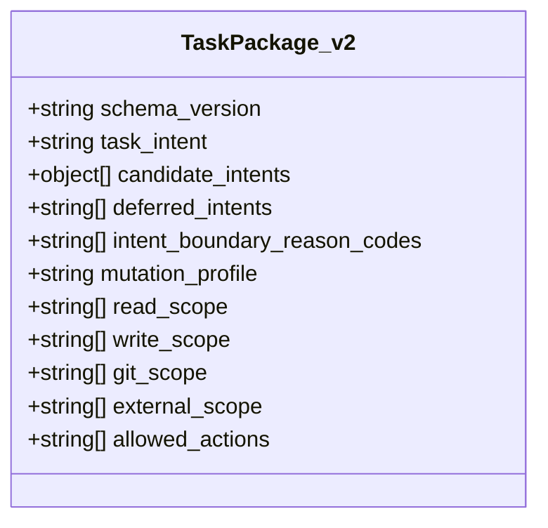
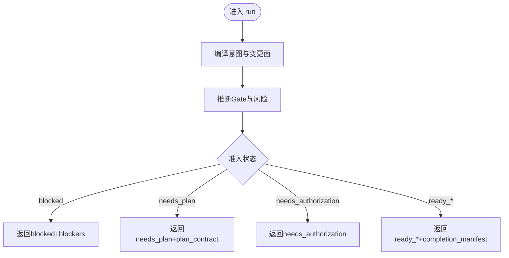
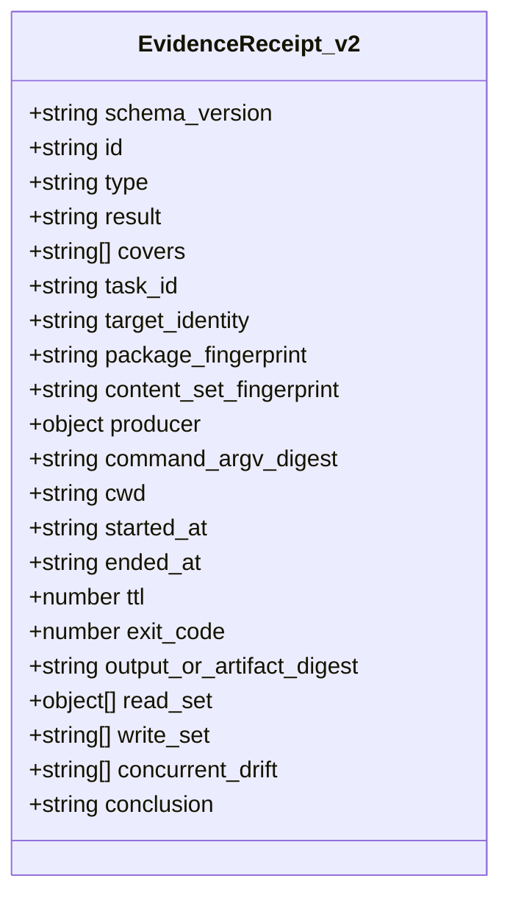
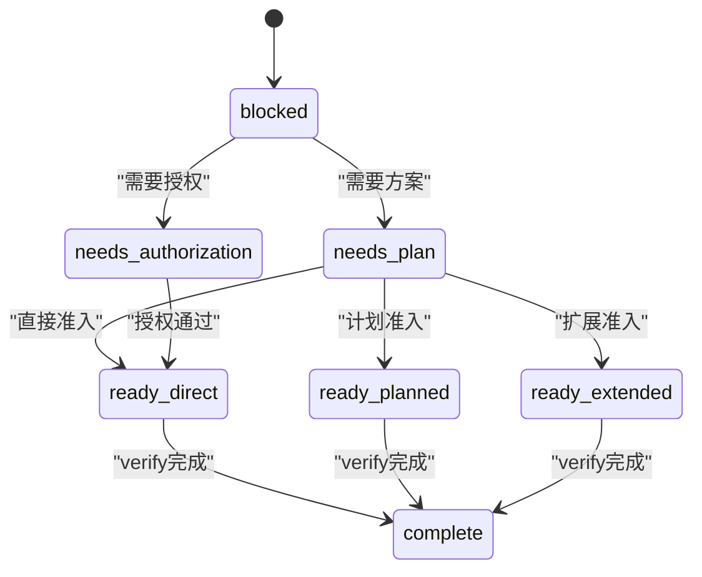
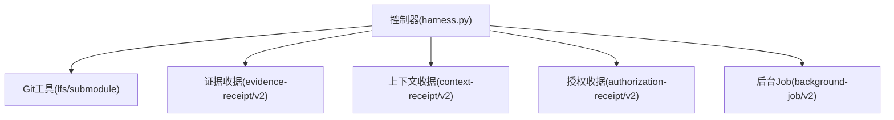

# JSON接口规范

<cite>
**本文引用的文件**   
- [scripts/harness.py](file://scripts/harness.py)
- [docs/contracts.md](file://docs/contracts.md)
- [SKILL.md](file://SKILL.md)
- [package.json](file://package.json)
- [tests/test_harness.py](file://tests/test_harness.py)
- [harness-home/rules/api-compatibility.md](file://harness-home/rules/api-compatibility.md)
</cite>

## 目录
1. [简介](#简介)
2. [项目结构](#项目结构)
3. [核心组件](#核心组件)
4. [架构总览](#架构总览)
5. [详细组件分析](#详细组件分析)
6. [依赖关系分析](#依赖关系分析)
7. [性能与可观测性](#性能与可观测性)
8. [故障排查指南](#故障排查指南)
9. [结论](#结论)
10. [附录：JSON Schema与验证规则](#附录json-schema与验证规则)

## 简介
本规范面向 Docs Harness v1.6.5 的 JSON 接口，覆盖任务包（TaskPackage）、编译任务（CompiledTask）、证据收据（EvidenceReceipt）等核心数据模型的结构、字段含义与约束；阐述准入状态机转换规则与边界条件；提供完整的 JSON Schema 定义与校验规则；给出请求/响应示例、错误处理流程、版本兼容与迁移策略；并包含 API 测试方法与调试技巧。所有契约以控制器源码与合同文档为准，确保读者能基于此实现稳定、可审计、失败关闭的集成。

## 项目结构
Docs Harness 的核心由独立 Python 控制器脚本与配套规则、测试组成：
- scripts/harness.py：控制器主程序，定义全部 Schema、状态机、Git 预检/后检、证据与上下文收据、后台 Job 状态机等。
- docs/contracts.md：对外契约说明，包括 task-package/v2、evidence-receipt/v2、完成清单、Git 状态合同、退出码等。
- SKILL.md：使用入口与行为摘要，强调 run/verify 命令与证据、自动归因、命令缓存等关键行为。
- package.json：元信息与脚本入口，版本与控制器一致。
- tests/test_harness.py：端到端测试，覆盖意图推断、Git 操作、漂移归因、v1→v2 迁移、事件有界性等。
- harness-home/rules/api-compatibility.md：API 兼容性规则，要求变更时具备兼容策略、消费者影响、迁移顺序与回滚路径。

图表来源
- [scripts/harness.py:1-100](file://scripts/harness.py#L1-L100)
- [docs/contracts.md:1-120](file://docs/contracts.md#L1-L120)
- [SKILL.md:1-60](file://SKILL.md#L1-L60)
- [package.json:1-23](file://package.json#L1-L23)
- [harness-home/rules/api-compatibility.md:1-29](file://harness-home/rules/api-compatibility.md#L1-L29)

章节来源
- [scripts/harness.py:1-120](file://scripts/harness.py#L1-L120)
- [docs/contracts.md:1-120](file://docs/contracts.md#L1-L120)
- [SKILL.md:1-60](file://SKILL.md#L1-L60)
- [package.json:1-23](file://package.json#L1-L23)

## 核心组件
- TaskPackage（task-package/v2）：描述任务意图、候选意图、变更面、读写范围、Git 范围、外部范围、允许动作等。
- CompiledTask（compiled-task/v2）：控制器对任务包的编译结果，包含准入状态、执行路线、Gate 判定、完成清单等。
- EvidenceReceipt（evidence-receipt/v2）：宿主或可信生产者提交的证据收据，绑定任务、目标、包指纹、生产者、时间戳、退出码、输出摘要、读写集合等。
- CompletionManifest（completion-manifest/v1）：收尾清单，声明必需证据类型、收据、条件审查、阻断项、验收协议等。
- Git State Snapshot（git_state_snapshot）：git_fetch/git_sync 的预检快照，包含远端、HEAD、索引、工作区指纹、受控引用命名空间等。
- Context Receipt（context-receipt/v2）：阶段上下文复用凭证，需满足 task_id、target_identity、stage、compiler_contract、content_set_fingerprint 一致。
- Authorization Receipt（authorization-receipt/v2）：授权凭证，始终绑定当前 package fingerprint。

章节来源
- [docs/contracts.md:9-120](file://docs/contracts.md#L9-L120)
- [docs/contracts.md:165-220](file://docs/contracts.md#L165-L220)
- [docs/contracts.md:222-235](file://docs/contracts.md#L222-L235)
- [scripts/harness.py:27-60](file://scripts/harness.py#L27-L60)

## 架构总览
Docs Harness 的 JSON 接口围绕“意图优先、证据可复用、失败关闭”的原则设计。run 命令将用户任务编译为 TaskPackage 与 CompiledTask，返回准入状态与完成清单；verify 命令接收证据收据，进行工作区漂移归因、验证命令缓存、Git 后检与 Gate 检查，最终产出结构化结果与事件。后台治理通过 background-* 子命令管理复杂 Job 的状态机。

图表来源
- [SKILL.md:25-55](file://SKILL.md#L25-L55)
- [docs/contracts.md:50-95](file://docs/contracts.md#L50-L95)
- [scripts/harness.py:3000-3100](file://scripts/harness.py#L3000-L3100)

## 详细组件分析

### 任务包 TaskPackage（task-package/v2）
- 关键字段
  - schema_version: "docs-harness/task-package/v2"
  - task_intent: 受控意图之一（query/audit/git_inspect/git_fetch/git_sync/modify/external_write）
  - candidate_intents: 候选意图列表，每项含 intent 与 mutation_profile
  - deferred_intents: 未来子句，仅作为审查上下文
  - intent_boundary_reason_codes: 边界原因码
  - mutation_profile: read_only/git_metadata_write/workspace_write/external_write
  - read_scope/write_scope/git_scope/external_scope: 范围约束
  - allowed_actions: 允许的动作集合
- 语义与约束
  - 混合意图保留全部候选，最高变更面决定 Gate 编译；显式 facts 只能升级不能降级特定组合。
  - 路径范围只接受项目内相对路径、glob 或受控 Git 资源；自然语言边界拒绝并返回 invalid_scope_description。
  - run 按 active task key 幂等复用；complete/cancelled/failed/blocked 不复用。

图表来源
- [docs/contracts.md:9-48](file://docs/contracts.md#L9-L48)
- [scripts/harness.py:197-231](file://scripts/harness.py#L197-L231)

章节来源
- [docs/contracts.md:9-48](file://docs/contracts.md#L9-L48)
- [scripts/harness.py:197-231](file://scripts/harness.py#L197-L231)

### 编译任务 CompiledTask（compiled-task/v2）
- 关键字段
  - schema_version: "docs-harness/compiled-task/v2"
  - package_revision/package_fingerprint: 包修订与指纹
  - admission_status: blocked/needs_plan/needs_authorization/ready_direct/ready_planned/ready_extended
  - execution_route: direct/planned/extended 等
  - matched_gates: 匹配的 Gate 列表
  - completion_manifest: 完成清单引用与指纹
- 语义与约束
  - 准入状态保持固定集合；只读任务允许空 write_scope 不升级为 planned。
  - 新 Gate 追加且合同不变时，控制器原子生成下一 package revision，继承同轮已校验收据。

图表来源
- [docs/contracts.md:50-78](file://docs/contracts.md#L50-L78)
- [scripts/harness.py:3030-3090](file://scripts/harness.py#L3030-L3090)

章节来源
- [docs/contracts.md:50-78](file://docs/contracts.md#L50-L78)
- [scripts/harness.py:3030-3090](file://scripts/harness.py#L3030-L3090)

### 证据收据 EvidenceReceipt（evidence-receipt/v2）
- 关键字段
  - schema_version: "docs-harness/evidence-receipt/v2"
  - id/type/result/covers: 标识、类型、结果、覆盖的任务ID
  - task_id/target_identity/package_fingerprint/content_set_fingerprint: 绑定三要素
  - producer: {"adapter","capability"} 可信生产者白名单
  - command_argv_digest/cwd/started_at/ended_at/ttl/exit_code/output_or_artifact_digest: 命令与运行环境
  - read_set/write_set/concurrent_drift/conclusion: 读写集、并发漂移、结论
- 语义与约束
  - 过期、跨任务/目标/包指纹、不可信生产者、非零退出或摘要无效均拒绝。
  - 高风险证据必须来自可信 v2 生产者；报告型旧证据不满足。
  - 验证命令 produces 白名单限制；临时副产物容忍但同名已有文件修改或删除仍阻断。
  - 支持简化声明 evidence-declaration/v1，控制器代铸装订字段并按 v2 同等校验。

图表来源
- [docs/contracts.md:165-218](file://docs/contracts.md#L165-L218)
- [scripts/harness.py:240-258](file://scripts/harness.py#L240-L258)

章节来源
- [docs/contracts.md:165-218](file://docs/contracts.md#L165-L218)
- [scripts/harness.py:240-258](file://scripts/harness.py#L240-L258)

### 完成清单 CompletionManifest（completion-manifest/v1）
- 关键字段
  - manifest_fingerprint: 清单指纹
  - required_evidence_types: 必需证据类型
  - required_receipts: 必需收据
  - conditional_reviews/conditional_evidence: 条件审查与证据
  - verification_commands: 验证命令
  - completion_blockers: 完成阻断项
  - completion_protocol: 验收协议（如 incremental_receipts_single_final）
- 语义与约束
  - verify 只按当前清单固定项及预声明条件验收，不得静默增加隐藏要求。
  - delivery_layers 每层含 expectation/status/evidence_refs；不同意图默认标记 not_applicable/not_requested/required。

章节来源
- [docs/contracts.md:63-95](file://docs/contracts.md#L63-L95)
- [scripts/harness.py:2575-2595](file://scripts/harness.py#L2575-L2595)

### Git 状态合同（git_state_snapshot）
- 关键字段
  - repo_identity/remote.name/url_fingerprint/refspec
  - preflight_target_oid/head/index_tree/worktree_fingerprint
  - controlled_refs_namespace/controlled_ref/refs
  - lfs_available/submodule_available/fast_forward
  - git_sync_scope/deletion_count/captured_at
- 语义与约束
  - 远端 URL 指纹前移除用户名、密码、token、查询参数和 fragment。
  - git_fetch 只允许声明的远端 refs/objects 变化；git_sync 绑定单一预检 OID 自动生成变更范围。
  - controlled_refs_namespace 自动包含 origin/HEAD 更新不再误判 ref 越界。
  - 远端漂移重新准入时，pull 落盘文件记入 git_sync_landed_scope 并入 write_scope。

章节来源
- [docs/contracts.md:97-133](file://docs/contracts.md#L97-L133)
- [scripts/harness.py:677-791](file://scripts/harness.py#L677-L791)

### 上下文与授权收据
- Context Receipt（context-receipt/v2）
  - 复用需满足同一 task_id、target_identity、stage、compiler_contract、content_set_fingerprint。
- Authorization Receipt（authorization-receipt/v2）
  - 始终绑定当前 package fingerprint，不按内容集合跨修订复用。

章节来源
- [docs/contracts.md:222-235](file://docs/contracts.md#L222-L235)
- [scripts/harness.py:36-40](file://scripts/harness.py#L36-L40)

### 状态机与转换规则
- 准入状态：blocked/needs_plan/needs_authorization/ready_direct/ready_planned/ready_extended
- verify 五级处置：provide_evidence/refresh_evidence/retry_verification/incremental_admission/full_readmission
- 工作区漂移归因：task_write_set/read_set/concurrent_drift/unattributed_drift；阻断规则与警告策略明确。
- Git 漂移与 ref 越界、非 fast-forward、脏工作区、LFS/Submodule 不可验证均失败关闭。

图表来源
- [docs/contracts.md:50-78](file://docs/contracts.md#L50-L78)
- [docs/contracts.md:153-163](file://docs/contracts.md#L153-L163)

章节来源
- [docs/contracts.md:50-78](file://docs/contracts.md#L50-L78)
- [docs/contracts.md:153-163](file://docs/contracts.md#L153-L163)

## 依赖关系分析
- 控制器依赖 Git 工具链（lfs/submodule），在预检阶段探测可用性。
- 证据收据依赖可信生产者白名单与命令 argv 摘要。
- 上下文收据依赖内容集合指纹，避免重复加载。
- 后台 Job 依赖控制面工件（job.json/plan.json/progress.json/events.jsonl）与业务数据面隔离。

图表来源
- [scripts/harness.py:677-791](file://scripts/harness.py#L677-L791)
- [scripts/harness.py:240-258](file://scripts/harness.py#L240-L258)
- [scripts/harness.py:36-40](file://scripts/harness.py#L36-L40)

章节来源
- [scripts/harness.py:677-791](file://scripts/harness.py#L677-L791)
- [scripts/harness.py:240-258](file://scripts/harness.py#L240-L258)
- [scripts/harness.py:36-40](file://scripts/harness.py#L36-L40)

## 性能与可观测性
- 验证命令缓存：verification-command-receipt/v1 逐项收据，输入不变则复用；可通过配置关闭。
- 事件有界性：event/v2 仅保存有界字段，禁止敏感信息；用于复算效率结论。
- 上下文缓存：按 stage 与 content_set_fingerprint 命中，避免重复加载规则与事实正文。

章节来源
- [docs/contracts.md:218-221](file://docs/contracts.md#L218-L221)
- [docs/contracts.md:283-301](file://docs/contracts.md#L283-L301)
- [scripts/harness.py:1045-1055](file://scripts/harness.py#L1045-L1055)

## 故障排查指南
- 常见错误码
  - invalid_scope_description：路径范围非法
  - evidence_binding_mismatch：证据绑定不匹配
  - untrusted_evidence_producer：不可信生产者
  - evidence_expired：证据过期
  - legacy_evidence_not_accepted：旧版证据不被接受
  - git_remote_drift：远端漂移
  - high_risk_drift：高风险漂移
  - archive_source_drift：归档源漂移
- 排查步骤
  - 检查证据绑定（task_id/target_identity/package_fingerprint）与 TTL
  - 确认生产者是否在可信白名单
  - 检查工作区漂移与读写范围重叠
  - 查看 Git 预检/后检结果与 LFS/Submodule 可用性
  - 确认事件日志是否包含敏感信息（应被过滤）

章节来源
- [tests/test_harness.py:984-1051](file://tests/test_harness.py#L984-L1051)
- [tests/test_harness.py:1122-1163](file://tests/test_harness.py#L1122-L1163)
- [docs/contracts.md:359-370](file://docs/contracts.md#L359-L370)

## 结论
Docs Harness 的 JSON 接口以强契约、强校验、强审计为核心，确保任务从意图到交付的全链路可追溯、可验证、可回滚。通过 v2 数据模型与状态机，结合证据收据与上下文复用，实现高效、安全的自动化治理。遵循本规范可实现稳定集成与平滑迁移。

## 附录：JSON Schema与验证规则

### TaskPackage v2 Schema（摘要）
- schema_version: "docs-harness/task-package/v2"
- task_intent: enum(query, audit, git_inspect, git_fetch, git_sync, modify, external_write)
- candidate_intents: array of {intent: string, mutation_profile: string}
- deferred_intents: array of string
- intent_boundary_reason_codes: array of string
- mutation_profile: enum(read_only, git_metadata_write, workspace_write, external_write)
- read_scope: array of string (project-relative path/glob/.git:refs/remotes/*)
- write_scope: array of string
- git_scope: array of string
- external_scope: array of string
- allowed_actions: array of string

验证规则
- 路径范围仅接受项目内相对路径、glob 或受控 Git 资源；自然语言边界返回 invalid_scope_description。
- 混合意图取最高 mutation_profile；显式 facts 只能升级不能降级特定组合。

章节来源
- [docs/contracts.md:9-48](file://docs/contracts.md#L9-L48)
- [scripts/harness.py:197-231](file://scripts/harness.py#L197-L231)

### CompiledTask v2 Schema（摘要）
- schema_version: "docs-harness/compiled-task/v2"
- package_revision: number
- package_fingerprint: string
- admission_status: enum(blocked, needs_plan, needs_authorization, ready_direct, ready_planned, ready_extended)
- execution_route: string
- matched_gates: array of string
- completion_manifest: object with manifest_fingerprint

验证规则
- 准入状态保持固定集合；只读任务允许空 write_scope。
- 新 Gate 追加且合同不变时，原子生成下一 package revision。

章节来源
- [docs/contracts.md:50-78](file://docs/contracts.md#L50-L78)
- [scripts/harness.py:3030-3090](file://scripts/harness.py#L3030-L3090)

### EvidenceReceipt v2 Schema（摘要）
- schema_version: "docs-harness/evidence-receipt/v2"
- id/type/result/covers: string/array
- task_id/target_identity/package_fingerprint/content_set_fingerprint: string
- producer: {adapter: string, capability: string}
- command_argv_digest/cwd/started_at/ended_at/ttl/exit_code/output_or_artifact_digest: string/number
- read_set: array of {path: string, fingerprint: string}
- write_set: array of string
- concurrent_drift: array of string
- conclusion: string

验证规则
- 过期/跨任务/跨目标/跨包指纹/不可信生产者/非零退出/摘要无效均拒绝。
- 高风险证据必须来自可信 v2 生产者。
- 验证命令 produces 白名单限制；临时副产物容忍但同名已有文件修改或删除仍阻断。

章节来源
- [docs/contracts.md:165-218](file://docs/contracts.md#L165-L218)
- [scripts/harness.py:240-258](file://scripts/harness.py#L240-L258)

### CompletionManifest v1 Schema（摘要）
- manifest_fingerprint: string
- required_evidence_types: array of string
- required_receipts: array of string
- conditional_reviews: array of string
- conditional_evidence: array of string
- verification_commands: array of object
- completion_blockers: array of string
- completion_protocol: string

验证规则
- verify 只按当前清单固定项及预声明条件验收，不得静默增加隐藏要求。
- delivery_layers 每层含 expectation/status/evidence_refs。

章节来源
- [docs/contracts.md:63-95](file://docs/contracts.md#L63-L95)
- [scripts/harness.py:2575-2595](file://scripts/harness.py#L2575-L2595)

### Git State Snapshot Schema（摘要）
- repo_identity: string
- remote: {name: string, url_fingerprint: string, refspec: string}
- preflight_target_oid: string
- head: string
- index_tree: string
- worktree_fingerprint: string
- controlled_refs_namespace: array of string
- controlled_ref: string
- refs: object
- lfs_available: boolean
- submodule_available: boolean
- fast_forward: boolean
- git_sync_scope: array of string
- deletion_count: number
- captured_at: string

验证规则
- 远端 URL 指纹前移除用户名、密码、token、查询参数和 fragment。
- git_fetch 只允许声明的远端 refs/objects 变化；git_sync 绑定单一预检 OID。

章节来源
- [docs/contracts.md:97-133](file://docs/contracts.md#L97-L133)
- [scripts/harness.py:677-791](file://scripts/harness.py#L677-L791)

### 版本兼容与迁移策略
- v1→v2 迁移：仅允许 status/migrate 命令；apply 创建 staging、全对象 backup、manifest 与 journal，再切换对象；任一步中断回滚。
- 迁移后任务进入 needs_readmission；存在活动 v2 任务时 rollback-check 返回 active_v2_tasks。
- 旧控制器遇到 v2 对象必须失败关闭。

章节来源
- [docs/contracts.md:236-249](file://docs/contracts.md#L236-L249)
- [tests/test_harness.py:1052-1121](file://tests/test_harness.py#L1052-L1121)

### API 测试方法与调试技巧
- 使用 --json 输出结构化结果；expected 退出码断言。
- 快照树与指纹比对验证文件一致性。
- 模拟 Git 不可用场景（LFS/Submodule）验证失败关闭。
- 检查事件日志是否包含敏感信息（应被过滤）。

章节来源
- [tests/test_harness.py:59-87](file://tests/test_harness.py#L59-L87)
- [tests/test_harness.py:94-106](file://tests/test_harness.py#L94-L106)
- [tests/test_harness.py:736-757](file://tests/test_harness.py#L736-L757)
- [tests/test_harness.py:1122-1163](file://tests/test_harness.py#L1122-L1163)

### 数据序列化与反序列化规则
- JSON 键排序与分隔符固定（canonical_json）。
- 文件指纹使用 sha256 文本哈希。
- 事件文件行级 JSON，逐行解析并校验对象类型。
- 输入文件只接受路径，不支持内联内容；大小与编码限制严格。

章节来源
- [scripts/harness.py:403-417](file://scripts/harness.py#L403-L417)
- [scripts/harness.py:507-529](file://scripts/harness.py#L507-L529)
- [scripts/harness.py:456-483](file://scripts/harness.py#L456-L483)