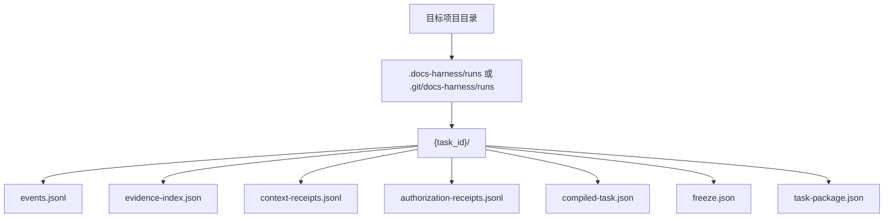
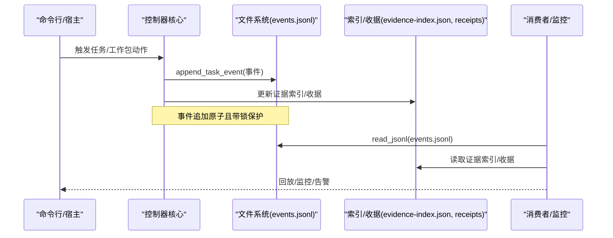
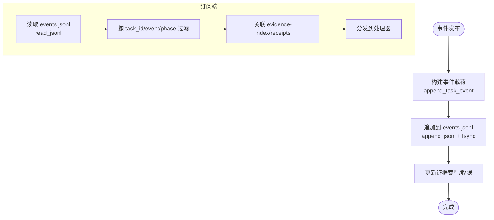
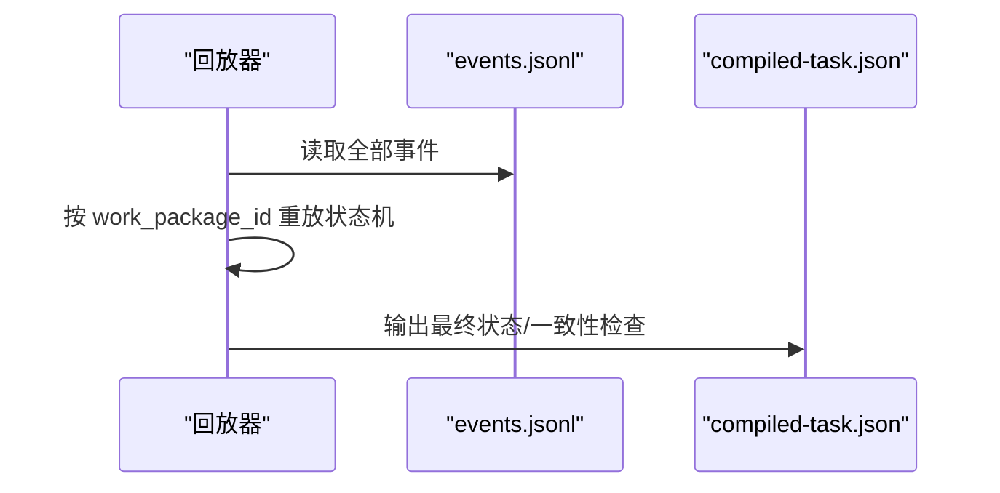
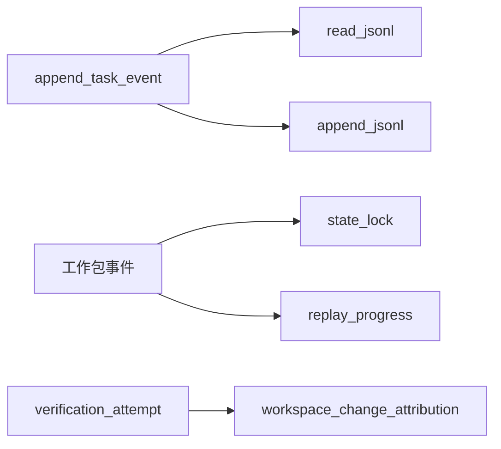

# 事件系统接口

<cite>
**本文引用的文件**   
- [scripts/harness.py](file://scripts/harness.py)
- [tests/test_harness.py](file://tests/test_harness.py)
</cite>

## 目录
1. [简介](#简介)
2. [项目结构](#项目结构)
3. [核心组件](#核心组件)
4. [架构总览](#架构总览)
5. [详细组件分析](#详细组件分析)
6. [依赖关系分析](#依赖关系分析)
7. [性能考虑](#性能考虑)
8. [故障排查指南](#故障排查指南)
9. [结论](#结论)
10. [附录](#附录)

## 简介
本文件为 Docs Harness 的事件系统提供完整、可操作的文档。内容覆盖事件类型与消息格式、发布与订阅机制、事件过滤与路由规则、处理器实现示例与最佳实践、事件的持久化存储与回放、调试与监控工具使用，以及性能与扩展性设计要点和常见问题解决方案。读者无需深入源码即可理解并正确使用该事件系统。

## 项目结构
Docs Harness 的事件系统以“任务状态目录”为核心载体，所有事件以 JSON Lines 形式追加写入 events.jsonl；同时通过 e vidence-index.json、context-receipts.jsonl、authorization-receipts.jsonl 等文件形成围绕任务的审计与证据闭环。关键路径约定如下：
- 运行时根目录：根据是否处于 Git 仓库决定位于 .git/docs-harness/runs 或 .docs-harness/runs
- 任务状态目录：{runtime_root}/{task_id}
- 事件文件：events.jsonl（JSONL）
- 其他伴随文件：evidence-index.json、context-receipts.jsonl、authorization-receipts.jsonl、compiled-task.json、freeze.json、task-package.json

**图表来源** 
- [scripts/harness.py:909-925](file://scripts/harness.py#L909-L925)
- [scripts/harness.py:3220-3253](file://scripts/harness.py#L3220-L3253)

**章节来源**
- [scripts/harness.py:909-925](file://scripts/harness.py#L909-L925)
- [scripts/harness.py:3220-3253](file://scripts/harness.py#L3220-L3253)

## 核心组件
- 事件模式与版本常量：定义事件 schema_version 与统一时间戳函数
- 事件写入器：append_task_event，负责构造事件载荷并追加到 events.jsonl
- 事件读取器：read_jsonl，安全解析 JSONL 行
- 任务生命周期入口：create_task_state 在任务创建时写入初始事件 created
- 工作包进度事件：begin、block、submit 等在工作包状态机中触发
- 验证遥测事件：verification_attempt 记录每次 verify 的有界遥测
- 自动归因事件：auto_attribution 在控制器自动归因时记录

上述组件共同构成“发布-持久化-回放-消费”的闭环。

**章节来源**
- [scripts/harness.py:30-31](file://scripts/harness.py#L30-L31)
- [scripts/harness.py:510-532](file://scripts/harness.py#L510-L532)
- [scripts/harness.py:1034-1073](file://scripts/harness.py#L1034-L1073)
- [scripts/harness.py:3244-3253](file://scripts/harness.py#L3244-L3253)
- [scripts/harness.py:5722-5743](file://scripts/harness.py#L5722-L5743)
- [scripts/harness.py:5752-5765](file://scripts/harness.py#L5752-L5765)
- [scripts/harness.py:5823-5838](file://scripts/harness.py#L5823-L5838)
- [scripts/harness.py:6418-6437](file://scripts/harness.py#L6418-L6437)
- [scripts/harness.py:6638-6646](file://scripts/harness.py#L6638-L6646)

## 架构总览
事件系统采用“单写多读”的 JSONL 日志式总线，配合任务状态目录内的索引与收据文件，实现强一致的任务上下文与可回放审计。

**图表来源** 
- [scripts/harness.py:1034-1073](file://scripts/harness.py#L1034-L1073)
- [scripts/harness.py:510-532](file://scripts/harness.py#L510-L532)
- [scripts/harness.py:3244-3253](file://scripts/harness.py#L3244-L3253)

## 详细组件分析

### 事件模式与消息格式
- schema_version：固定为 docs-harness/event/v2
- 通用字段：event、task_id、phase、started_at、duration_ms、reason_code、package_revision、context_cache_hit、context_load_count、readmission_count、evidence_round_count、host_receipt_count、business_action_count、at
- 业务字段：随 event 不同而扩展，如 work_package_id、owner、workspace_snapshot、accepted、evidence_refs、changed_paths、outside_scope、new_gates、scope_changed、paths、evidence_id 等

事件由 append_task_event 统一构造，确保字段一致性与时序稳定。

**章节来源**
- [scripts/harness.py:30-31](file://scripts/harness.py#L30-L31)
- [scripts/harness.py:1034-1073](file://scripts/harness.py#L1034-L1073)

### 事件类型与触发时机
- created：任务创建时触发，用于初始化审计基线
- begin：工作包进入 in_progress 时触发，包含 owner、workspace_snapshot
- block：工作包被阻塞（含范围变更、外部变化、Gate 新增等）时触发，包含 reason、scope_changed、changed_paths、outside_scope、new_gates
- submit：工作包提交证据并被接受时触发，包含 accepted、evidence_refs
- verification_attempt：每次 verify 入口记录一次有界遥测，包含 outcome_class、reason_codes、exit_code、command_executed_count、command_cache_hit_count、context_full_load_count、context_delta_load_count、evidence_regeneration_required、changed_path_count
- auto_attribution：控制器自动归因未归属写入时触发，包含 paths、evidence_id

这些事件覆盖了任务准入、执行、验证与治理的全链路。

**章节来源**
- [scripts/harness.py:3244-3253](file://scripts/harness.py#L3244-L3253)
- [scripts/harness.py:5722-5743](file://scripts/harness.py#L5722-L5743)
- [scripts/harness.py:5752-5765](file://scripts/harness.py#L5752-L5765)
- [scripts/harness.py:5823-5838](file://scripts/harness.py#L5823-L5838)
- [scripts/harness.py:6418-6437](file://scripts/harness.py#L6418-L6437)
- [scripts/harness.py:6638-6646](file://scripts/harness.py#L6638-L6646)

### 事件发布与订阅机制
- 发布：各业务流程调用 append_task_event 将事件追加至 events.jsonl，内部使用 append_jsonl 进行原子追加与 fsync
- 订阅：消费者通过 read_jsonl 顺序读取 events.jsonl，结合 evidence-index.json、context-receipts.jsonl、authorization-receipts.jsonl 完成关联数据消费
- 过滤：消费者可按 task_id、event、phase、reason_code、work_package_id 等字段进行筛选
- 路由：按 task_id 隔离；跨任务需上层编排；同一任务内可按 phase 分流处理（admission、verification、business_action）

**图表来源** 
- [scripts/harness.py:510-532](file://scripts/harness.py#L510-L532)
- [scripts/harness.py:1034-1073](file://scripts/harness.py#L1034-L1073)

**章节来源**
- [scripts/harness.py:510-532](file://scripts/harness.py#L510-L532)
- [scripts/harness.py:1034-1073](file://scripts/harness.py#L1034-L1073)

### 事件回放与状态重建
- 回放：replay_progress 基于 events.jsonl 重放工作包状态转换，保证并发安全
- 一致性：状态变更均在 state_lock 保护下进行，避免竞态
- 用途：用于恢复中断流程、校验当前 compiled-task 一致性、驱动 UI/控制台展示

**图表来源** 
- [scripts/harness.py:5099-5120](file://scripts/harness.py#L5099-L5120)

**章节来源**
- [scripts/harness.py:5099-5120](file://scripts/harness.py#L5099-L5120)

### 事件处理器实现示例与最佳实践
- 最小实现：读取 events.jsonl，按 task_id 分组，按 event 分发到处理器
- 幂等性：对同一事件重复消费应幂等（基于 event.at 或事件序号）
- 错误处理：遇到无效行或损坏事件应跳过并记录告警
- 性能优化：增量消费（记录 last_offset）、批量处理、异步消费
- 可靠性：定期快照当前消费位点，支持断点续传

参考实现要点（不直接粘贴代码）：
- 使用 read_jsonl 安全读取
- 维护 last_line_number 或 last_at 作为消费位点
- 针对 begin/block/submit/verification_attempt/auto_attribution 分别实现处理器
- 与 evidence-index.json 联动，补充上下文

**章节来源**
- [scripts/harness.py:510-532](file://scripts/harness.py#L510-L532)
- [scripts/harness.py:1034-1073](file://scripts/harness.py#L1034-L1073)

### 事件的持久化存储与回放机制
- 存储：events.jsonl 为追加型日志，append_jsonl 保证原子写入与落盘
- 索引：evidence-index.json 聚合证据引用，便于快速检索
- 收据：context-receipts.jsonl、authorization-receipts.jsonl 承载上下文与授权凭证
- 回放：replay_progress 从事件流重建工作包状态，保障一致性

**章节来源**
- [scripts/harness.py:510-532](file://scripts/harness.py#L510-L532)
- [scripts/harness.py:3244-3253](file://scripts/harness.py#L3244-L3253)
- [scripts/harness.py:5099-5120](file://scripts/harness.py#L5099-L5120)

### 事件调试与监控工具使用方法
- 查看事件：直接读取 events.jsonl，或使用 read_jsonl 解析
- 定位问题：按 task_id 过滤，关注 reason_code、phase、event 序列
- 验证遥测：verification_attempt 提供命令执行次数、缓存命中、上下文加载计数等指标
- 回放校验：使用 replay_progress 对比当前 compiled-task 与事件流一致性

**章节来源**
- [scripts/harness.py:6418-6437](file://scripts/harness.py#L6418-L6437)
- [scripts/harness.py:5099-5120](file://scripts/harness.py#L5099-L5120)

### 事件系统的性能考虑与扩展性设计
- 追加写入：JSONL 追加模式具备高吞吐与低开销
- 原子性与 fsync：确保崩溃恢复一致性
- 锁粒度：state_lock 仅保护关键状态变更，减少竞争
- 可扩展性：按 task_id 天然分片；可按 phase/event 水平扩展消费者
- 缓存与索引：evidence-index.json 降低查询成本

**章节来源**
- [scripts/harness.py:510-532](file://scripts/harness.py#L510-L532)
- [scripts/harness.py:1011-1032](file://scripts/harness.py#L1011-L1032)

### 事件驱动架构的设计模式与常见问题
- 设计模式
  - 事件溯源：以事件为唯一事实源，支持回放与审计
  - 发布-订阅：解耦生产者与消费者，支持多订阅者
  - 幂等消费：基于事件标识或偏移量保证幂等
  - 补偿与重试：对失败消费进行重试与补偿
- 常见问题
  - 事件丢失：确保 fsync 与幂等消费
  - 乱序消费：按 at 或序号排序
  - 大事件膨胀：限制 payload 大小，拆分事件
  - 回溯困难：保留必要上下文与指纹

[本节为概念性说明，不直接分析具体文件]

## 依赖关系分析
事件系统与任务状态管理、证据索引、验证流程紧密耦合。关键依赖如下：
- append_task_event 依赖 read_jsonl、append_jsonl、utc_now
- 工作包事件依赖 state_lock、replay_progress、refresh_compiled_progress
- 验证遥测依赖 workspace_change_attribution、verification_reason_codes、classify_verification_outcome

**图表来源** 
- [scripts/harness.py:510-532](file://scripts/harness.py#L510-L532)
- [scripts/harness.py:1011-1032](file://scripts/harness.py#L1011-L1032)
- [scripts/harness.py:5099-5120](file://scripts/harness.py#L5099-L5120)
- [scripts/harness.py:6418-6437](file://scripts/harness.py#L6418-L6437)

**章节来源**
- [scripts/harness.py:510-532](file://scripts/harness.py#L510-L532)
- [scripts/harness.py:1011-1032](file://scripts/harness.py#L1011-L1032)
- [scripts/harness.py:5099-5120](file://scripts/harness.py#L5099-L5120)
- [scripts/harness.py:6418-6437](file://scripts/harness.py#L6418-L6437)

## 性能考虑
- 事件写入：JSONL 追加 + fsync，适合高并发写入场景
- 事件读取：顺序扫描，建议增量消费与分页
- 索引与收据：按需读取，避免全量加载
- 回放：仅在必要时进行，避免频繁重放

[本节为通用指导，不直接分析具体文件]

## 故障排查指南
- 常见错误码与原因
  - invalid_state：事件文件行无效或非对象
  - stale_lock：状态锁超过阈值，需人工清理
  - concurrent_transition：并发更新导致状态不一致
  - plan_contract_drift / authorization_contract_drift：方案或授权指纹变化，需重新准入
- 排查步骤
  - 读取 events.jsonl，确认事件序列与 reason_code
  - 核对 evidence-index.json 与 receipts 是否完整
  - 使用 replay_progress 校验状态一致性
  - 检查 state_lock 是否存在残留锁文件

**章节来源**
- [scripts/harness.py:518-532](file://scripts/harness.py#L518-L532)
- [scripts/harness.py:1011-1032](file://scripts/harness.py#L1011-L1032)
- [scripts/harness.py:5099-5120](file://scripts/harness.py#L5099-L5120)

## 结论
Docs Harness 的事件系统以 JSONL 为核心，结合任务状态目录与索引/收据文件，提供了可靠、可回放、易扩展的事件基础设施。通过统一的 append_task_event 与标准化的事件模式，实现了从任务准入、执行、验证到治理的全链路审计与监控。建议在消费侧实现幂等、增量与错误恢复，以获得最佳稳定性与性能。

[本节为总结性内容，不直接分析具体文件]

## 附录

### 事件类型速查表
- created：任务创建
- begin：工作包开始
- block：工作包阻塞（含范围/Gate 变化）
- submit：工作包提交证据
- verification_attempt：验证遥测
- auto_attribution：自动归因

**章节来源**
- [scripts/harness.py:3244-3253](file://scripts/harness.py#L3244-L3253)
- [scripts/harness.py:5722-5743](file://scripts/harness.py#L5722-L5743)
- [scripts/harness.py:5752-5765](file://scripts/harness.py#L5752-L5765)
- [scripts/harness.py:5823-5838](file://scripts/harness.py#L5823-L5838)
- [scripts/harness.py:6418-6437](file://scripts/harness.py#L6418-L6437)
- [scripts/harness.py:6638-6646](file://scripts/harness.py#L6638-L6646)

### 事件字段参考
- 通用字段：schema_version、event、task_id、phase、started_at、duration_ms、reason_code、package_revision、context_cache_hit、context_load_count、readmission_count、evidence_round_count、host_receipt_count、business_action_count、at
- 业务字段：work_package_id、owner、workspace_snapshot、accepted、evidence_refs、changed_paths、outside_scope、new_gates、scope_changed、paths、evidence_id

**章节来源**
- [scripts/harness.py:1034-1073](file://scripts/harness.py#L1034-L1073)

### 测试用例参考
- 验证遥测事件记录：test_v164_every_verify_attempt_is_recorded_as_bounded_event
- 扩展进度回放与依赖约束：test_extended_progress_replays_events_and_enforces_dependencies

**章节来源**
- [tests/test_harness.py:3111](file://tests/test_harness.py#L3111)
- [tests/test_harness.py:4233](file://tests/test_harness.py#L4233)