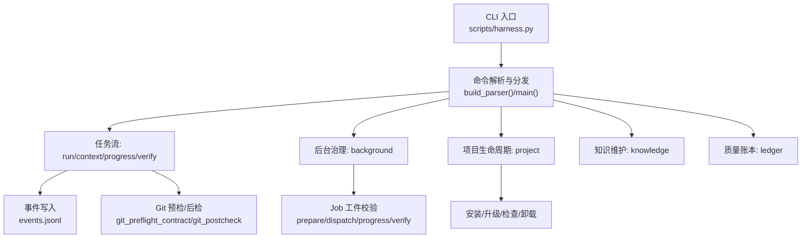
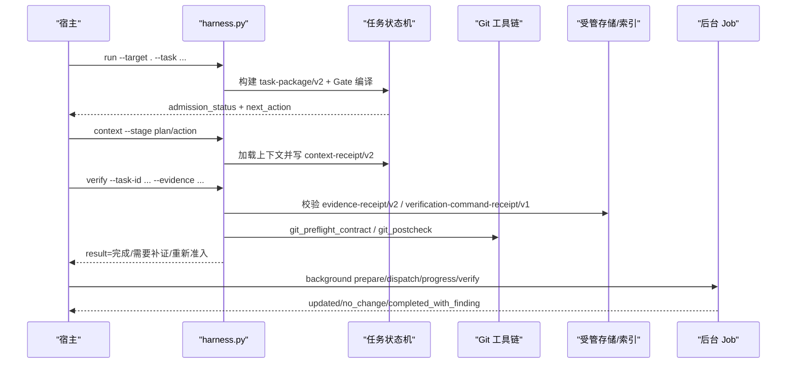
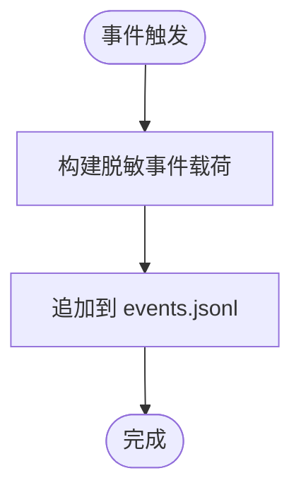
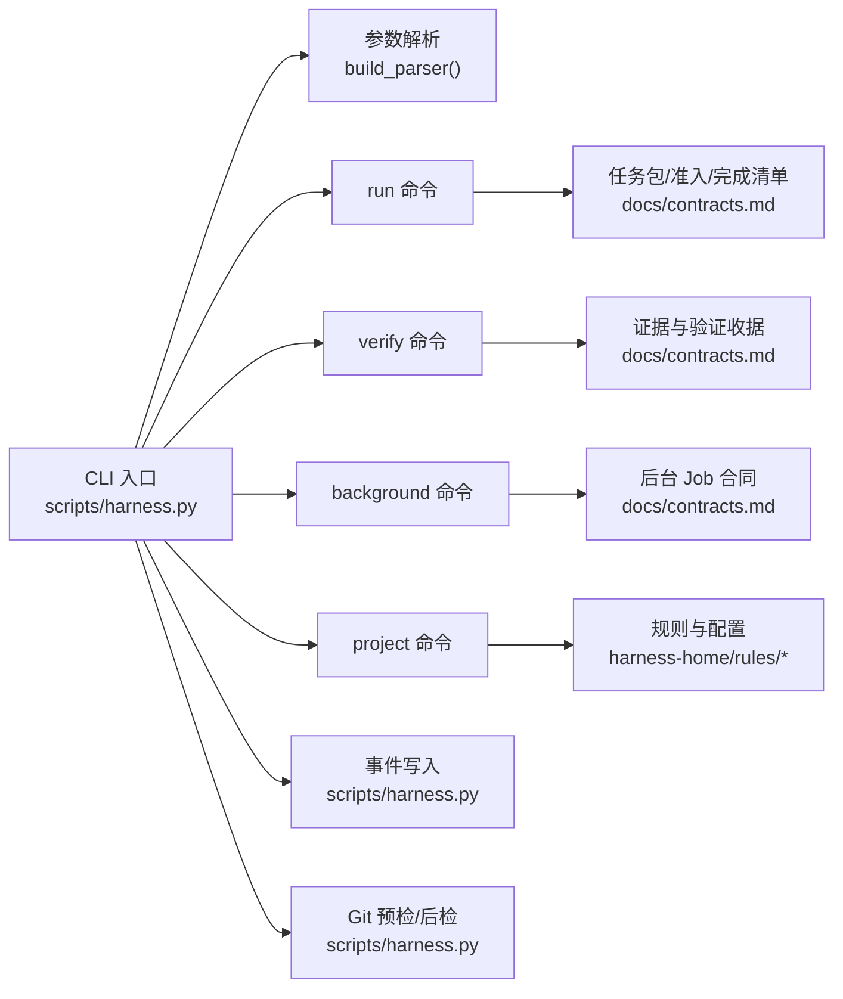

# 任务API接口

<cite>
**本文引用的文件**   
- [scripts/harness.py](file://scripts/harness.py)
- [docs/contracts.md](file://docs/contracts.md)
- [SKILL.md](file://SKILL.md)
- [harness-home/rules/api-compatibility.md](file://harness-home/rules/api-compatibility.md)
- [tests/test_harness.py](file://tests/test_harness.py)
</cite>

## 目录
1. [简介](#简介)
2. [项目结构](#项目结构)
3. [核心组件](#核心组件)
4. [架构总览](#架构总览)
5. [详细组件分析](#详细组件分析)
6. [依赖关系分析](#依赖关系分析)
7. [性能考量](#性能考量)
8. [故障排查指南](#故障排查指南)
9. [结论](#结论)
10. [附录](#附录)

## 简介
本文件面向 Docs Harness 的任务 API，系统化说明 CLI 命令参考（run、verify、background、project 等）、JSON 接口规范（请求/响应与错误码）、事件系统接口（事件类型、消息格式与订阅机制）、任务查询能力（过滤、排序、分页），以及版本兼容性与迁移指南。文档同时提供调用示例与错误处理最佳实践，并给出测试方法与调试技巧，帮助宿主快速集成与稳定运行。

## 项目结构
Docs Harness 以 Python 脚本为核心控制器，配合契约文档、规则集与测试用例共同构成完整任务编排与验收体系：
- scripts/harness.py：CLI 入口与全部命令实现，包含参数解析、状态机、Git 预检/后检、事件写入、后台 Job 控制、项目生命周期管理等。
- docs/contracts.md：v1.6.5 合同定义，涵盖任务包、证据收据、上下文与授权收据、Git 状态、退出码、迁移与回滚等。
- harness-home/rules/*：生效规则集合，约束 API 兼容性、外部输入安全、UI 完成态、测试发布、回滚授权、文档变更、范围变更重准入等。
- tests/test_harness.py：覆盖 run/verify/background/project/self-test 等关键路径的单元测试与契约回归。
- SKILL.md：面向宿主的实操指引，强调 run/verify 流程、证据与自动归因、后台治理与质量账本等。

**图表来源** 
- [scripts/harness.py:10160-10279](file://scripts/harness.py#L10160-L10279)
- [scripts/harness.py:10322-10359](file://scripts/harness.py#L10322-L10359)
- [docs/contracts.md:97-133](file://docs/contracts.md#L97-L133)

**章节来源**
- [scripts/harness.py:10160-10279](file://scripts/harness.py#L10160-L10279)
- [scripts/harness.py:10322-10359](file://scripts/harness.py#L10322-L10359)
- [docs/contracts.md:97-133](file://docs/contracts.md#L97-L133)

## 核心组件
- CLI 命令层：run、context、progress、verify、task、ledger、knowledge、background、project、self-test。
- 任务包与准入：task-package/v2、compiled-task/v2、completion-manifest/v1、Gate 编译与风险判定。
- 证据与验证：evidence-receipt/v2、verification-command-receipt/v1、volatile 副产物策略、自动归因。
- Git 状态：git_state_snapshot、preflight/postcheck、远端漂移与 ref 越界检测。
- 后台治理：background-job/v2、prepare/dispatch/progress/verify、复杂路线（goal/phased）。
- 事件系统：event/v2，记录阶段、耗时、重试计数、上下文命中等脱敏指标。
- 项目配置与规则：project-config/v4、active rules 指纹校验与失败关闭。

**章节来源**
- [docs/contracts.md:9-133](file://docs/contracts.md#L9-L133)
- [docs/contracts.md:165-221](file://docs/contracts.md#L165-L221)
- [docs/contracts.md:283-306](file://docs/contracts.md#L283-L306)
- [scripts/harness.py:10160-10279](file://scripts/harness.py#L10160-L10279)

## 架构总览
下图展示从 CLI 到 Runtime、Git、证据与后台 Job 的整体交互。

**图表来源** 
- [scripts/harness.py:10160-10279](file://scripts/harness.py#L10160-L10279)
- [scripts/harness.py:10322-10359](file://scripts/harness.py#L10322-L10359)
- [docs/contracts.md:97-133](file://docs/contracts.md#L97-L133)
- [docs/contracts.md:165-221](file://docs/contracts.md#L165-L221)

## 详细组件分析

### CLI 命令参考

#### run
- 作用：任务路由、意图推断、范围绑定、Gate 编译、准入决策与下一步引导。
- 关键参数
  - --target：目标项目根
  - --task：原始用户任务文本
  - --task-id：继续已有任务并完成方案/授权或重新准入
  - --new-task：强制新建任务（跳过幂等复用）
  - --facts：结构化事实 JSON 文件路径（不接受内联内容）
  - --plan：正式方案 Markdown/JSON 文件路径
  - --authorization：授权 JSON 文件路径
  - --scope/--feature/--action/--success：限定范围、功能、动作与成功标准
- 返回要点
  - admission_status：blocked/needs_plan/needs_authorization/ready_direct/ready_planned/ready_extended
  - completion_manifest：收尾清单（证据类型、收据、条件项、阻断项、协议）
  - next_action/next_command_argv：下一步操作与可执行命令
  - reason_code：具体原因（如 invalid_scope_description、gate_decision.*）
- 幂等性：同一 target、归一化任务文本、事实指纹与工作区快照命中活动任务时返回 active_task_reused。

**章节来源**
- [scripts/harness.py:10165-10193](file://scripts/harness.py#L10165-L10193)
- [docs/contracts.md:48-76](file://docs/contracts.md#L48-L76)
- [SKILL.md:25-44](file://SKILL.md#L25-L44)

#### verify
- 作用：同源验收、补证、重试、增量准入或完整重新准入。
- 关键参数
  - --target、--task-id、--evidence（可重复）
- 返回要点
  - result：完成/需要补证/刷新证据/重试验证/增量准入/完整重新准入
  - delivery_layers：分层验收结果（source/local_verification/git_head/remote_delivery/fresh_clone/release_artifact/ui/external_state）
  - auto_attributed_paths：自动归因路径（当 write_scope 内未归因写入且开启自动归因）
  - reason_code：provide_evidence/refresh_evidence/retry_verification/incremental_admission/full_readmission 等
- 行为要点
  - 仅按当前 completion_manifest 固定项及预声明条件验收
  - 支持验证命令逐项收据缓存与失败重跑
  - 默认对 write_scope 内未归因写入代铸 workspace_attribution 收据（可通过配置关闭）

**章节来源**
- [scripts/harness.py:10214-10223](file://scripts/harness.py#L10214-L10223)
- [docs/contracts.md:78-93](file://docs/contracts.md#L78-L93)
- [docs/contracts.md:165-221](file://docs/contracts.md#L165-L221)
- [SKILL.md:43-57](file://SKILL.md#L43-L57)

#### background
- 作用：统一后台文档治理 Job 控制器，支持 estimate/list/status/prepare/progress/dispatch/verify/retry/prune。
- 关键参数
  - --job-id、--work-package-id、--work-package-status、--reason-code、--repair、--assessment、--result、--older-than、--apply、--dry-run
- 行为要点
  - 复杂路线：contract_ready → prepare → 宿主 Goal/Plan → dispatched → running → progress → verify → 终态
  - 禁止业务数据面直接写控制面工件；控制面仅 CLI 写入
  - 知识 Job 与交付治理共享 knowledge_flow，bootstrap 成功后释放等待者

**章节来源**
- [scripts/harness.py:10255-10269](file://scripts/harness.py#L10255-L10269)
- [docs/contracts.md:304-348](file://docs/contracts.md#L304-L348)
- [SKILL.md:59-90](file://SKILL.md#L59-L90)

#### project
- 作用：项目安装生命周期（init/upgrade/uninstall/check/diff/rollback-check）。
- 关键参数
  - --apply、--purge-runtime
- 行为要点
  - init：创建最小知识骨架、评估知识、返回后台合同；不自动修改 .gitignore/提交/推送/发布
  - upgrade：preserve-and-merge 合法 document_routes；非法或缺失路由的在途治理 Job 返回 needs_manual_migration
  - check：输出 findings/red/yellow、delivery_status、runtime_status
  - rollback-check：存在活动 v2 任务时阻断回滚

**章节来源**
- [scripts/harness.py:10271-10276](file://scripts/harness.py#L10271-L10276)
- [SKILL.md:13-24](file://SKILL.md#L13-L24)
- [docs/contracts.md:236-248](file://docs/contracts.md#L236-L248)

#### task
- 作用：查询、取消、归档、清理任务或显式迁移 v1 在途任务。
- 关键参数
  - action：status/migrate/cancel/archive/list/prune
  - --task-id、--apply、--reason-code、--older-than、--dry-run、--include-archived
- 行为要点
  - cancel：受控原因码、幂等、不可改回活动状态
  - archive：独立处置索引，不影响 v1 对象目录
  - prune：冻结候选清单，物理清理不可恢复

**章节来源**
- [scripts/harness.py:10224-10232](file://scripts/harness.py#L10224-L10232)
- [docs/contracts.md:250-282](file://docs/contracts.md#L250-L282)

#### knowledge
- 作用：功能知识库审查、评估与兼容后台入口（status/estimate/audit/bootstrap/update/verify/job-status/dispatch/retry）。
- 关键参数
  - --assessment、--consent、--job-id、--job-status、--result
- 行为要点
  - 估算与审查共享过滤器；change_scoped/project_wide 模式影响幂等键与置信度
  - bootstrap 成功且控制器复算 ready 才释放等待者

**章节来源**
- [scripts/harness.py:10246-10254](file://scripts/harness.py#L10246-L10254)
- [docs/contracts.md:342-348](file://docs/contracts.md#L342-L348)

#### ledger
- 作用：人工触发的个人本地质量账本（add/read）。
- 关键参数
  - --task-id、--review、--query、--limit
- 行为要点
  - 不得自动记录或在任务结束后主动询问；读取历史按任务编号或关键词检索

**章节来源**
- [scripts/harness.py:10234-10245](file://scripts/harness.py#L10234-L10245)
- [SKILL.md:91-99](file://SKILL.md#L91-L99)

### JSON 接口规范

#### 通用请求/响应约定
- 所有命令通过 --json 输出结构化 JSON；错误统一为 {"status":"error","code":...,"message":...}
- 文件型参数只接受文件路径，不接受内联内容；大小限制与 UTF-8 校验失败转为结构化错误
- 退出码：0 成功；1 项目检查/自检失败；2 输入/合同/绑定/状态无效；3 需要方案/授权/证据/迁移/用户输入/Git 交付；4 必须重新准入

**章节来源**
- [scripts/harness.py:10282-10288](file://scripts/harness.py#L10282-L10288)
- [docs/contracts.md:359-370](file://docs/contracts.md#L359-L370)

#### 任务包与准入响应
- task-package/v2：包含 task_intent、candidate_intents、deferred_intents、mutation_profile、read/write/git/external_scope、allowed_actions
- completion-manifest/v1：manifest_fingerprint、required_evidence_types、required_receipts、conditional_reviews/evidence、verification_commands、completion_blockers、completion_protocol

**章节来源**
- [docs/contracts.md:9-47](file://docs/contracts.md#L9-L47)
- [docs/contracts.md:63-76](file://docs/contracts.md#L63-L76)

#### 证据与验证命令收据
- evidence-receipt/v2：绑定 task_id、target_identity、package_fingerprint、producer、command_argv_digest、cwd、时间戳、exit_code、digest、read_set/write_set
- verification-command-receipt/v1：按 argv、produces、输入指纹绑定，支持 cache_hit 复用

**章节来源**
- [docs/contracts.md:165-221](file://docs/contracts.md#L165-L221)

#### Git 状态快照
- git_state_snapshot：repo_identity、remote、preflight_target_oid、head、index_tree、worktree_fingerprint、controlled_refs_namespace、refs、lfs/submodule 可用性、fast_forward、git_sync_scope、deletion_count、captured_at

**章节来源**
- [docs/contracts.md:97-133](file://docs/contracts.md#L97-L133)

#### 后台 Job 合同
- background-job/v2：execution_route、goal_contract、work_packages、host_dispatch_contract、control_plane_write_policy、dispatch_sequence、progress_argv_template 等

**章节来源**
- [docs/contracts.md:304-348](file://docs/contracts.md#L304-L348)

### 事件系统接口

#### 事件类型与字段
- schema_version：docs-harness/event/v2
- event：如 readmission/scope_bound_readmission/incremental_gate_readmission/begin/submit/task_cancelled/auto_attribution 等
- phase：context/verification/... 
- started_at、duration_ms、reason_code、package_revision
- 脱敏统计：context_cache_hit、context_load_count、readmission_count、evidence_round_count、host_receipt_count、business_action_count

**章节来源**
- [docs/contracts.md:283-306](file://docs/contracts.md#L283-L306)
- [scripts/harness.py:1031-1071](file://scripts/harness.py#L1031-L1071)

#### 事件写入与订阅
- 写入：append_task_event 追加到 events.jsonl，保证原子与顺序
- 订阅：宿主可按需读取 events.jsonl 进行审计与监控；建议基于 task_id 过滤并按 phase/event 分类消费

**图表来源** 
- [scripts/harness.py:1031-1071](file://scripts/harness.py#L1031-L1071)

### 任务查询API

#### 查询能力
- task list：列出任务（默认隐藏已归档 v1，--include-archived 显示）
- task status：查询单个任务状态
- task prune：清理过期任务（冻结候选清单后 apply）
- background list/status：后台 Job 列表与状态查询

#### 过滤与排序
- 过滤：按 task_id、状态（complete/cancelled/failed/blocked）、归档状态、天数（prune older-than）
- 排序：按 created/updated 时间（由宿主根据事件与状态文件计算）
- 分页：list/prune 支持 limit/offset 由宿主在读取 events.jsonl 与状态文件时实现

#### 分页与一致性
- 由于事件与状态文件追加写入，宿主应基于 snapshot 或事务边界读取，避免重复与遗漏
- 建议结合 package_revision 与事件 at 时间戳做去重与排序

**章节来源**
- [scripts/harness.py:10224-10232](file://scripts/harness.py#L10224-L10232)
- [scripts/harness.py:10255-10269](file://scripts/harness.py#L10255-L10269)
- [docs/contracts.md:250-282](file://docs/contracts.md#L250-L282)

### 版本兼容性与迁移指南

#### v1→v2 迁移
- v1 在途任务仅允许 task status/migrate（--apply 执行迁移）
- 迁移在 migration-v1-v2/ 中 staging、备份、切换 task-package/compiled-task/freeze/evidence-index/context/authorization receipts
- 迁移后进入 needs_readmission；存在活动 v2 任务时 project rollback-check 阻断回滚

**章节来源**
- [docs/contracts.md:236-248](file://docs/contracts.md#L236-L248)

#### API 兼容规则
- 修改 API/Schema/协议/持久化结构/跨模块公共契约或迁移路径时必须说明兼容策略、受影响消费者、迁移顺序与可执行回滚路径
- 必须提供契约验收证据，覆盖新旧消费者、失败路径和必要的迁移验证

**章节来源**
- [harness-home/rules/api-compatibility.md:1-29](file://harness-home/rules/api-compatibility.md#L1-L29)

### API 调用示例与错误处理最佳实践

#### 典型调用序列
- 初始化项目：project init --target . --json
- 启动任务：run --target . --task "<原始用户任务>" --facts facts.json --json
- 加载上下文：context --target . --task-id <id> --stage plan/action --json
- 提交证据：verify --target . --task-id <id> --evidence evidence.json --json
- 后台治理：background prepare/dispatch/progress/verify --target . --job-id <id> --json

**章节来源**
- [SKILL.md:13-24](file://SKILL.md#L13-L24)
- [SKILL.md:25-44](file://SKILL.md#L25-L44)
- [SKILL.md:45-57](file://SKILL.md#L45-L57)
- [SKILL.md:59-90](file://SKILL.md#L59-L90)

#### 错误处理
- 结构化错误：{"status":"error","code":...,"message":...}，避免回显敏感输入
- 常见 code：invalid_request、missing_file、invalid_json、invalid_scope_description、state_locked、stale_lock、git_remote_unavailable、git_ref_scope_violation、full_readmission 等
- 处理建议：根据 reason_code 决定下一步（补证/重读/重试/增量准入/完整重新准入），必要时调用 next_command_argv

**章节来源**
- [scripts/harness.py:10282-10288](file://scripts/harness.py#L10282-L10288)
- [docs/contracts.md:359-370](file://docs/contracts.md#L359-L370)

### API 测试方法与调试技巧

#### 测试方法
- 使用 tests/test_harness.py 中的 run_harness/run_installed_harness 辅助函数执行命令并断言返回码与 payload
- 覆盖场景：Git fetch/sync、远端漂移、非 fast-forward、LFS/Submodule 不可用、脏工作区重叠、混合意图、negated write、安全审计保留风险 Gate 等

**章节来源**
- [tests/test_harness.py:59-87](file://tests/test_harness.py#L59-L87)
- [tests/test_harness.py:503-576](file://tests/test_harness.py#L503-L576)
- [tests/test_harness.py:651-709](file://tests/test_harness.py#L651-L709)

#### 调试技巧
- 启用 --json 输出便于解析与日志采集
- 关注 events.jsonl 中的 phase/event/reason_code 定位问题阶段
- 使用 project check 查看 findings/red/yellow 与 runtime_status
- 对于 Git 相关错误，检查 git_preflight_contract 与 git_postcheck 的 checks 字段

**章节来源**
- [scripts/harness.py:10022-10062](file://scripts/harness.py#L10022-L10062)
- [scripts/harness.py:793-875](file://scripts/harness.py#L793-L875)

## 依赖关系分析

**图表来源** 
- [scripts/harness.py:10160-10279](file://scripts/harness.py#L10160-L10279)
- [docs/contracts.md:9-133](file://docs/contracts.md#L9-L133)
- [docs/contracts.md:165-221](file://docs/contracts.md#L165-L221)
- [docs/contracts.md:304-348](file://docs/contracts.md#L304-L348)

**章节来源**
- [scripts/harness.py:10160-10279](file://scripts/harness.py#L10160-L10279)
- [docs/contracts.md:9-133](file://docs/contracts.md#L9-L133)

## 性能考量
- 上下文正文跨 stage 内容寻址复用，减少重复加载
- 验证命令逐项收据缓存，仅重跑失败或输入变化的命令
- 增量准入与 contract_delta 降低 package revision 变化带来的全量重走
- 工作区快照与 Git 预检优化大仓库扫描与 LFS/Submodule 可用性检查
- 事件与索引采用追加写入，避免锁竞争

[本节为通用指导，无需引用具体文件]

## 故障排查指南
- 常见退出码与含义：0 成功；1 项目检查/自检失败；2 输入/合同/绑定/状态无效；3 需要方案/授权/证据/迁移/用户输入/Git 交付；4 必须重新准入
- 常见 reason_code：invalid_scope_description、git_remote_drift、git_ref_scope_violation、state_locked、stale_lock、prepare_background_goal、full_readmission
- 排查步骤
  - 查看 project check 的 findings 与 runtime_status
  - 检查 events.jsonl 的阶段与原因码
  - 核对 git_preflight_contract 与 git_postcheck 的 checks
  - 确认 evidence-receipt/v2 与 verification-command-receipt/v1 的指纹与 TTL
  - 对于后台 Job，检查 prepare/dispatch/progress/verify 的工件完整性与指纹

**章节来源**
- [docs/contracts.md:359-370](file://docs/contracts.md#L359-L370)
- [scripts/harness.py:793-875](file://scripts/harness.py#L793-L875)
- [scripts/harness.py:1031-1071](file://scripts/harness.py#L1031-L1071)

## 结论
Docs Harness 的任务 API 以严格的合同与事件驱动为核心，提供从任务准入、证据验收、Git 状态校验到后台治理的全链路能力。通过五级处置与增量准入机制，在保证安全与一致性的前提下显著提升效率。宿主应遵循契约与规则，结合测试与调试手段，确保稳定集成与可观测性。

[本节为总结，无需引用具体文件]

## 附录

### CLI 命令速查表
- run：任务路由与准入
- context：按阶段加载上下文
- progress：推进 extended 工作包状态
- verify：验收与补证
- task：任务查询/取消/归档/清理/迁移
- ledger：质量账本
- knowledge：知识库维护
- background：后台治理 Job
- project：项目安装生命周期
- self-test：内置合同自检

**章节来源**
- [scripts/harness.py:10160-10279](file://scripts/harness.py#L10160-L10279)

### 事件字段速查
- event、phase、started_at、duration_ms、reason_code、package_revision
- context_cache_hit、context_load_count、readmission_count、evidence_round_count、host_receipt_count、business_action_count

**章节来源**
- [docs/contracts.md:283-306](file://docs/contracts.md#L283-L306)