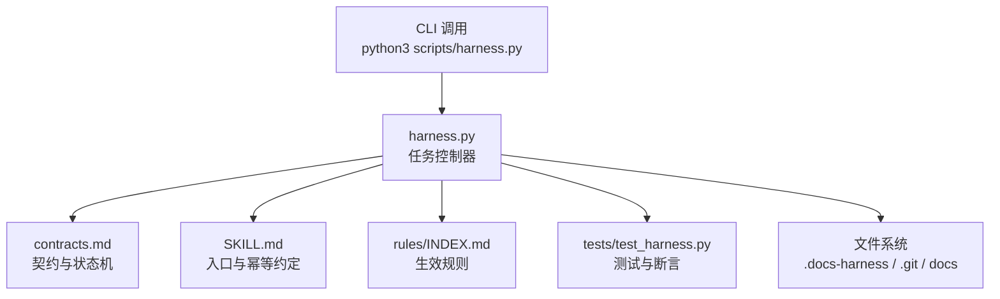
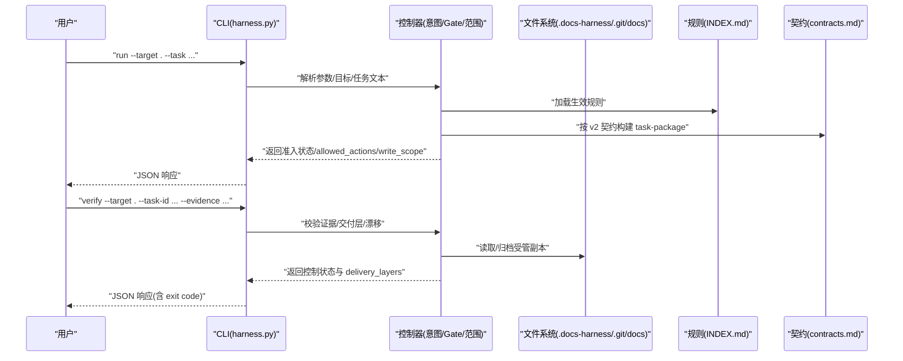
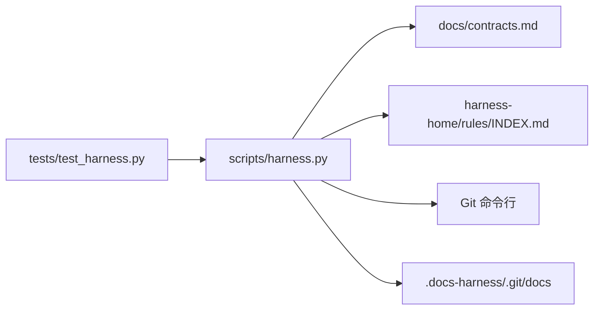

# 任务查询接口

<cite>
**本文引用的文件**   
- [scripts/harness.py](file://scripts/harness.py)
- [tests/test_harness.py](file://tests/test_harness.py)
- [docs/contracts.md](file://docs/contracts.md)
- [SKILL.md](file://SKILL.md)
- [harness-home/rules/INDEX.md](file://harness-home/rules/INDEX.md)
- [package.json](file://package.json)
</cite>

## 目录
1. [简介](#简介)
2. [项目结构](#项目结构)
3. [核心组件](#核心组件)
4. [架构总览](#架构总览)
5. [详细组件分析](#详细组件分析)
6. [依赖关系分析](#依赖关系分析)
7. [性能考虑](#性能考虑)
8. [故障排查指南](#故障排查指南)
9. [结论](#结论)
10. [附录](#附录)

## 简介
本文件为 Docs Harness 的“任务查询接口”提供系统化、可操作的技术文档。内容覆盖：
- 任务状态查询与过滤条件、排序选项
- 支持的查询语法（精确匹配、范围查询、复合条件）
- 分页机制与结果集限制
- 复杂条件的组合示例
- 查询性能优化与索引策略
- 错误处理与异常处理
- 查询结果的缓存机制与一致性保证
- 测试方法与调试技巧

该接口以 CLI 命令形式暴露，核心实现位于脚本 harness.py，契约与行为由 contracts.md 与 SKILL.md 约束，测试用例集中在 tests/test_harness.py。

## 项目结构
- scripts/harness.py：控制器主程序，包含任务生命周期、准入、Git 预检/后检、证据与验收、后台治理等全部逻辑。
- docs/contracts.md：对外契约定义，包括 task-package/v2、Git 状态合同、证据收据、退出码等。
- SKILL.md：技能说明与入口约定，强调 run/verify/background 等命令的使用方式与幂等性。
- tests/test_harness.py：端到端与单元测试，覆盖 run、verify、git_* 意图、背景 Job、规则激活等。
- harness-home/rules/INDEX.md：生效规则清单与加载约定。
- package.json：脚本入口与测试命令。

图表来源
- [scripts/harness.py:1-200](file://scripts/harness.py#L1-L200)
- [docs/contracts.md:1-120](file://docs/contracts.md#L1-L120)
- [SKILL.md:26-60](file://SKILL.md#L26-L60)
- [harness-home/rules/INDEX.md:1-41](file://harness-home/rules/INDEX.md#L1-L41)
- [tests/test_harness.py:1-120](file://tests/test_harness.py#L1-L120)

章节来源
- [scripts/harness.py:1-200](file://scripts/harness.py#L1-L200)
- [docs/contracts.md:1-120](file://docs/contracts.md#L1-L120)
- [SKILL.md:26-60](file://SKILL.md#L26-L60)
- [harness-home/rules/INDEX.md:1-41](file://harness-home/rules/INDEX.md#L1-L41)
- [tests/test_harness.py:1-120](file://tests/test_harness.py#L1-L120)

## 核心组件
- 任务包与意图：task-package/v2 描述任务意图、候选意图、变更面、读写范围与允许动作；query/audit/git_inspect 默认只读。
- 准入与路线：blocked/needs_plan/needs_authorization/ready_direct/ready_planned/ready_extended 状态机；read_only 不强制升级 planned。
- Git 状态合同：git_fetch/git_sync 绑定 git_state_snapshot，严格校验远端引用与工作区一致性。
- 证据与验收：evidence-receipt/v2 与 verification-command-receipt/v1 支持命令级缓存与自动归因。
- 后台治理：background job v2，prepare/dispatched/running/progress/verify 标准序列。
- 退出码：0/1/2/3/4 分别表示成功、检查失败、输入无效、需要方案/证据/迁移、必须重新准入。

章节来源
- [docs/contracts.md:9-120](file://docs/contracts.md#L9-L120)
- [docs/contracts.md:97-164](file://docs/contracts.md#L97-L164)
- [docs/contracts.md:165-221](file://docs/contracts.md#L165-L221)
- [docs/contracts.md:303-345](file://docs/contracts.md#L303-L345)
- [docs/contracts.md:361-372](file://docs/contracts.md#L361-L372)

## 架构总览
任务查询的生命周期从 CLI 进入控制器，经意图推断、Gate 判定、范围与上下文编译，生成 task-package 并返回准入状态。后续通过 verify 完成证据与交付层验收。

图表来源
- [scripts/harness.py:2779-2900](file://scripts/harness.py#L2779-L2900)
- [docs/contracts.md:9-120](file://docs/contracts.md#L9-L120)
- [harness-home/rules/INDEX.md:1-41](file://harness-home/rules/INDEX.md#L1-L41)

## 详细组件分析

### 任务状态查询与过滤
- 查询入口：通过 CLI 子命令访问任务对象。v1 在途任务仅允许读取与迁移相关命令。
- 状态字段：任务包与控制状态共同决定当前阶段（如 ready_direct/ready_planned/ready_extended/blocked）。
- 过滤条件：
  - 基于 task_id 精确匹配（正则校验格式）。
  - 基于 target 路径限定作用域。
  - 基于状态枚举筛选（complete/cancelled/failed/blocked 等）。
- 排序选项：
  - 通常按创建时间或 revision 降序；具体实现由 list 类函数决定。
- 分页与限制：
  - 列表接口应支持 limit/offset 或 cursor 分页；对质量账本读取有明确上限（例如 QUALITY_READ_MAX_LIMIT=20），可作为参考设计。

章节来源
- [docs/contracts.md:236-249](file://docs/contracts.md#L236-L249)
- [scripts/harness.py:544-547](file://scripts/harness.py#L544-L547)
- [scripts/harness.py:182-183](file://scripts/harness.py#L182-L183)

### 查询语法与复合条件
- 精确匹配：task_id 使用固定前缀与时间戳+随机段，需通过正则校验。
- 范围查询：write_scope/read_scope/git_scope 支持相对路径与 glob；自然语言边界不被接受。
- 复合条件：candidate_intents/deferred_intents 表达多意图组合；最高 mutation_profile 决定 Gate 强度。
- 安全底线 Gate：security-sensitive/destructive-data/release-external 不可被宿主声明弱化，且带否定守卫避免误报。

章节来源
- [scripts/harness.py:72-73](file://scripts/harness.py#L72-L73)
- [scripts/harness.py:234-243](file://scripts/harness.py#L234-L243)
- [scripts/harness.py:263-345](file://scripts/harness.py#L263-L345)
- [docs/contracts.md:42-48](file://docs/contracts.md#L42-L48)

### 分页机制与结果集限制
- 列表接口建议采用 limit/offset 或游标分页，避免一次性返回大量数据。
- 质量账本读取上限作为参考：QUALITY_READ_MAX_LIMIT=20。
- 事件与日志类数据建议流式读取与行级解析，避免内存峰值。

章节来源
- [scripts/harness.py:182-183](file://scripts/harness.py#L182-L183)
- [scripts/harness.py:518-533](file://scripts/harness.py#L518-L533)

### 查询示例（复杂条件组合）
- 示例一：按 task_id 精确查询某任务的状态与 allowed_actions。
- 示例二：按 target 与状态筛选最近 N 个任务，并按 revision 降序。
- 示例三：结合 read_scope 与 write_scope 过滤只读任务与有写范围的任务集合。
- 示例四：针对 git_inspect/git_fetch/git_sync 三类只读/元数据写入意图的组合查询。

（以上示例为用法说明，实际调用请参考 CLI 子命令与 JSON 输出字段。）

章节来源
- [SKILL.md:26-60](file://SKILL.md#L26-L60)
- [docs/contracts.md:9-48](file://docs/contracts.md#L9-L48)

### 性能优化与索引策略
- 文件 I/O：
  - 使用原子写入与追加模式减少锁竞争；事件文件逐行解析避免全量加载。
- 哈希与指纹：
  - 对远程 URL、工作区快照、文件内容计算指纹用于幂等与一致性校验。
- 缓存：
  - 验证命令收据缓存（verification-command-receipt/v1）可按 argv 与输入指纹复用。
  - 上下文收据跨阶段复用，避免重复加载规则与事实正文。
- 扫描限制：
  - 知识评估与估算时排除大体积/敏感路径，降低扫描成本。

章节来源
- [scripts/harness.py:422-438](file://scripts/harness.py#L422-L438)
- [scripts/harness.py:518-533](file://scripts/harness.py#L518-L533)
- [scripts/harness.py:588-613](file://scripts/harness.py#L588-L613)
- [docs/contracts.md:222-234](file://docs/contracts.md#L222-L234)
- [docs/contracts.md:218-221](file://docs/contracts.md#L218-L221)

### 错误处理与异常情况
- 结构化错误：
  - 所有文件型参数进行大小、编码、JSON 类型校验，失败返回结构化错误码。
  - Git 预检超时、远端不可用、引用缺失等统一抛出带 code 的异常。
- 常见错误码：
  - invalid_task_id、missing_target、invalid_git_scope、git_remote_unavailable、git_preflight_failed 等。
- 重试与幂等：
  - 同一 target、任务文本、事实指纹与工作区快照命中活动任务时返回 active_task_reused。
  - 取消与归档操作具备幂等性与冲突检测。

章节来源
- [scripts/harness.py:440-486](file://scripts/harness.py#L440-L486)
- [scripts/harness.py:575-586](file://scripts/harness.py#L575-L586)
- [scripts/harness.py:615-646](file://scripts/harness.py#L615-L646)
- [docs/contracts.md:361-372](file://docs/contracts.md#L361-L372)
- [SKILL.md:34-44](file://SKILL.md#L34-L44)

### 缓存机制与一致性保证
- 上下文收据：
  - 同一 task_id/target/stage/compiler_contract/content_set_fingerprint 命中即复用。
- 授权收据：
  - 绑定当前 package fingerprint，跨修订不复用。
- 验证命令收据：
  - 按 argv 与输入指纹缓存，输入不变则直接复用通过结果。
- 一致性：
  - 通过指纹与快照确保工作区、远端引用与证据的一致性；漂移触发 refresh_evidence/full_readmission。

章节来源
- [docs/contracts.md:222-234](file://docs/contracts.md#L222-L234)
- [docs/contracts.md:218-221](file://docs/contracts.md#L218-L221)
- [docs/contracts.md:153-164](file://docs/contracts.md#L153-L164)

### 测试方法与调试技巧
- 运行测试：
  - 使用 package.json 中定义的 test/self-test 脚本执行单元测试与自检。
- 典型断言：
  - 验证 run 返回的 admission_status/mutation_profile/allowed_actions。
  - 验证 verify 的控制状态与 delivery_layers。
  - 验证 Git 预检/后检与漂移阻断。
- 调试要点：
  - 关注结构化错误码与退出码。
  - 检查 .docs-harness 下的运行时工件（task-package、compiled-task、events.jsonl、evidence-index、freeze.json 等）。
  - 使用 --json 输出便于自动化解析。

章节来源
- [package.json:17-21](file://package.json#L17-L21)
- [tests/test_harness.py:59-87](file://tests/test_harness.py#L59-L87)
- [tests/test_harness.py:339-354](file://tests/test_harness.py#L339-L354)
- [tests/test_harness.py:429-448](file://tests/test_harness.py#L429-L448)
- [tests/test_harness.py:5071-5120](file://tests/test_harness.py#L5071-L5120)

## 依赖关系分析
- 控制器依赖契约与规则：
  - contracts.md 定义状态机、证据与验收流程。
  - rules/INDEX.md 管理生效规则与指纹校验。
- 测试依赖控制器模块：
  - tests/test_harness.py 动态导入 harness.py 模块，构造临时项目与 Git 环境，执行端到端断言。
- 外部工具：
  - Git 命令封装于 git_command，超时与错误统一转结构化异常。

图表来源
- [tests/test_harness.py:1-60](file://tests/test_harness.py#L1-L60)
- [scripts/harness.py:575-586](file://scripts/harness.py#L575-L586)
- [docs/contracts.md:1-120](file://docs/contracts.md#L1-L120)
- [harness-home/rules/INDEX.md:1-41](file://harness-home/rules/INDEX.md#L1-L41)

章节来源
- [tests/test_harness.py:1-120](file://tests/test_harness.py#L1-L120)
- [scripts/harness.py:575-586](file://scripts/harness.py#L575-L586)
- [docs/contracts.md:1-120](file://docs/contracts.md#L1-L120)
- [harness-home/rules/INDEX.md:1-41](file://harness-home/rules/INDEX.md#L1-L41)

## 性能考虑
- 文件与事件处理：
  - 事件文件逐行解析，避免全量加载；追加写入使用 fsync 保障持久化。
- 指纹与快照：
  - 工作区快照与远端引用指纹用于幂等与一致性，避免重复计算。
- 缓存策略：
  - 验证命令收据与上下文收据显著降低重复执行与加载开销。
- 扫描与排除：
  - 知识评估与估算时排除大体积/敏感路径，提升效率。

[本节为通用指导，不直接分析具体文件]

## 故障排查指南
- 常见问题定位：
  - 检查 task_id 格式与 target 有效性。
  - 查看 Git 预检/后检错误码与 blockers。
  - 核对 evidence-receipt/v2 必填字段与生产者可信度。
- 退出码含义：
  - 0 成功；1 检查失败；2 输入无效；3 需要方案/证据/迁移；4 必须重新准入。
- 调试步骤：
  - 启用 --json 输出，解析结构化字段。
  - 检查 .docs-harness 运行时工件与 events.jsonl。
  - 使用测试夹具复现问题，缩小差异范围。

章节来源
- [docs/contracts.md:361-372](file://docs/contracts.md#L361-L372)
- [scripts/harness.py:575-586](file://scripts/harness.py#L575-L586)
- [tests/test_harness.py:59-87](file://tests/test_harness.py#L59-L87)

## 结论
Docs Harness 的任务查询接口以严格的契约与状态机为基础，结合 Git 状态合同与证据收据体系，提供了高一致性与可审计的任务管理能力。通过结构化错误、幂等复用与缓存机制，接口在保证正确性的同时具备良好的性能与可维护性。建议在集成时遵循契约定义，充分利用测试与调试手段，确保查询与验收流程稳定可靠。

[本节为总结，不直接分析具体文件]

## 附录
- 常用 CLI 命令参考：
  - run：准入与路由
  - verify：证据与验收
  - background：后台治理
- 关键常量与限制：
  - QUALITY_READ_MAX_LIMIT=20
  - BACKGROUND_TERMINAL_STATES 与 BACKGROUND_KNOWN_STATES
  - DELIVERY_LAYER_ORDER 与 DELIVERY_LIMIT_CODES

章节来源
- [SKILL.md:60-106](file://SKILL.md#L60-L106)
- [scripts/harness.py:98-127](file://scripts/harness.py#L98-L127)
- [scripts/harness.py:146-178](file://scripts/harness.py#L146-L178)
- [scripts/harness.py:182-183](file://scripts/harness.py#L182-L183)