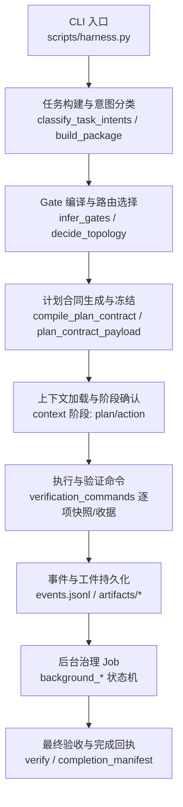
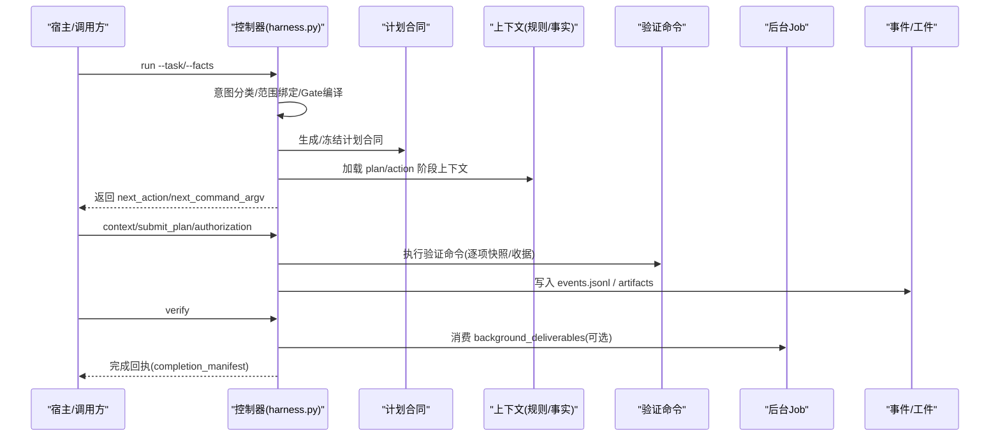
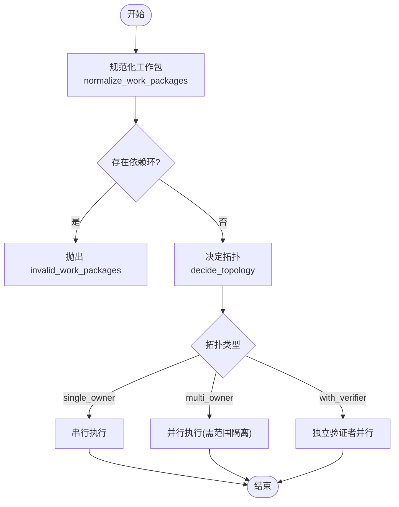
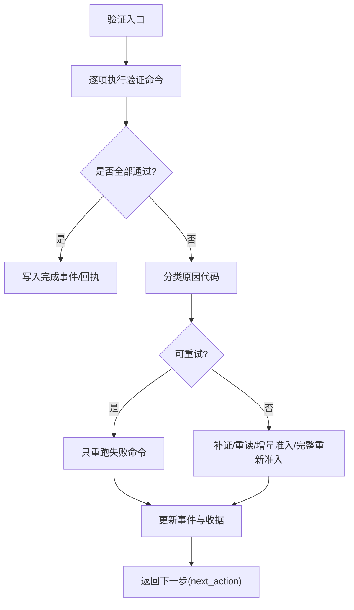
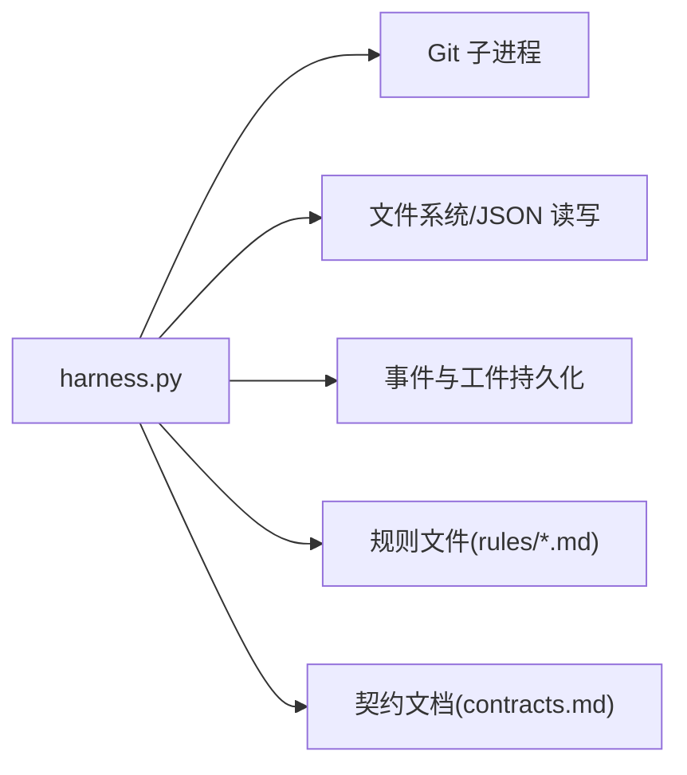

# 任务执行引擎

<cite>
**本文引用的文件**   
- [scripts/harness.py](file://scripts/harness.py)
- [tests/test_harness.py](file://tests/test_harness.py)
- [SKILL.md](file://SKILL.md)
- [docs/contracts.md](file://docs/contracts.md)
- [docs/plans/v1.6.4-minimal-systemic-flow-efficiency-plan.md](file://docs/plans/v1.6.4-minimal-systemic-flow-efficiency-plan.md)
- [harness-home/rules/testing-release.md](file://harness-home/rules/testing-release.md)
- [package.json](file://package.json)
</cite>

## 目录
1. [简介](#简介)
2. [项目结构](#项目结构)
3. [核心组件](#核心组件)
4. [架构总览](#架构总览)
5. [详细组件分析](#详细组件分析)
6. [依赖关系分析](#依赖关系分析)
7. [性能考量](#性能考量)
8. [故障排查指南](#故障排查指南)
9. [结论](#结论)
10. [附录](#附录)

## 简介
本文件为 Docs Harness 的任务执行引擎提供系统化文档，覆盖任务调度（串行、并行与顺序控制）、依赖管理与资源分配策略、错误处理与重试恢复、执行监控与日志记录、性能优化（批处理、内存与并发控制），以及配置选项与自定义执行器开发要点。内容基于仓库源码与契约文档提炼，确保读者既能快速上手，也能深入理解实现细节。

## 项目结构
- scripts/harness.py：主控制器脚本，包含 CLI、状态机、准入校验、计划与授权、验证命令、后台 Job、事件与工件管理、Git 预检/后检查等核心逻辑。
- tests/test_harness.py：端到端与单元测试，覆盖 run/context/verify/background 等关键路径。
- SKILL.md：技能说明与入口命令、后台治理流程、质量账本等高层使用说明。
- docs/contracts.md：契约与状态机定义，包括双通道与后台治理、知识流、验收与重试语义。
- docs/plans/v1.6.4-minimal-systemic-flow-efficiency-plan.md：最小系统性流程效率优化方案，明确分段失效、上下文复用、验证命令缓存、失败分类与遥测指标。
- harness-home/rules/*.md：活跃规则集，驱动 Gate 编译、证据类型与失败模式。
- package.json：包元数据与测试脚本入口。

图表来源
- [scripts/harness.py:2154-2228](file://scripts/harness.py#L2154-L2228)
- [scripts/harness.py:2509-2543](file://scripts/harness.py#L2509-L2543)
- [scripts/harness.py:2613-2799](file://scripts/harness.py#L2613-L2799)
- [docs/contracts.md:303-338](file://docs/contracts.md#L303-L338)

章节来源
- [package.json:1-23](file://package.json#L1-L23)
- [SKILL.md:25-58](file://SKILL.md#L25-L58)

## 核心组件
- 任务构建与意图分类：解析用户任务与 facts，推断 task_intent、mutation_profile、候选意图与延迟意图，并合并显式声明。
- Gate 编译与路由选择：根据任务文本、路径特征与安全底线词表推断 Gate，结合 mutation_profile 决定 direct/planned/extended 路由。
- 计划合同与范围绑定：按 Gate 与规则动态生成 plan_fields，冻结一次计划；支持增量补丁 complete_plan_delta。
- 上下文与阶段确认：plan/action 阶段按需加载事实与规则，跨阶段内容寻址复用，仅返回新增内容。
- 验证命令与收据：逐条命令输入指纹快照、通过即缓存，失败只重跑失败项；支持 volatile_paths 白名单与 auto_attribute_in_scope。
- 事件与工件：每次 verify 写入有界事件，统计 readmission_count、command_executed_count 等；受管 artifact store 隔离计划/授权/证据。
- 后台治理：background_direct/goal/goal_phased 三种路线，prepare→dispatched→running→progress→verify 标准序列，严格状态机与重试归档。
- Git 预检/后检查：git_preflight_contract 与 git_postcheck 保障 fetch/sync 的远端目标不变、ref 范围受控、LFS/Submodule 可用。

章节来源
- [scripts/harness.py:2154-2228](file://scripts/harness.py#L2154-L2228)
- [scripts/harness.py:2245-2286](file://scripts/harness.py#L2245-L2286)
- [scripts/harness.py:2509-2543](file://scripts/harness.py#L2509-L2543)
- [scripts/harness.py:1031-1071](file://scripts/harness.py#L1031-L1071)
- [scripts/harness.py:677-791](file://scripts/harness.py#L677-L791)
- [scripts/harness.py:793-876](file://scripts/harness.py#L793-L876)
- [docs/contracts.md:303-338](file://docs/contracts.md#L303-L338)

## 架构总览
任务执行引擎以“最小系统性原则”为核心：只有发生变化的合同分段失效，其余内容、计划、授权、上下文与验证收据继续复用。整体流程如下：

图表来源
- [scripts/harness.py:2613-2799](file://scripts/harness.py#L2613-L2799)
- [scripts/harness.py:936-1005](file://scripts/harness.py#L936-L1005)
- [docs/contracts.md:303-338](file://docs/contracts.md#L303-L338)

## 详细组件分析

### 任务调度机制（串行、并行与顺序控制）
- 拓扑与拓扑决策：
  - 工作包拓扑支持 single_owner、single_owner_with_verifier、multi_owner。
  - decide_topology 依据 owner 数量、scope 重叠与请求参数确定拓扑，避免 unsafe_topology。
- 执行顺序控制：
  - 工作包依赖图在 normalize_work_packages 中校验无环，并按依赖拓扑排序输出 ready 集合。
  - 复杂后台路线遵循 prepare→dispatched→running→progress→verify 的顺序，禁止跳过中间态。
- 串行与并行：
  - 单 Owner 默认串行；多 Owner 且 scope 不重叠可并行执行，但需满足独立交付与范围隔离条件。
  - 验证命令采用逐项快照与收据，失败只重跑失败项，未失败项保持缓存命中。

图表来源
- [scripts/harness.py:2383-2426](file://scripts/harness.py#L2383-L2426)
- [scripts/harness.py:2428-2450](file://scripts/harness.py#L2428-L2450)
- [docs/contracts.md:303-338](file://docs/contracts.md#L303-L338)

章节来源
- [scripts/harness.py:2383-2426](file://scripts/harness.py#L2383-L2426)
- [scripts/harness.py:2428-2450](file://scripts/harness.py#L2428-L2450)

### 依赖管理与资源分配策略
- 工作包依赖：
  - work_packages 的 dependencies 必须为已存在的 ID，且不允许环；系统自动计算就绪集合。
- 范围与资源：
  - read_scope/write_scope/git_scope/external_scope 分别约束读取、写入、Git 操作与外部目标。
  - Git 预检 contract 限定 ref 命名空间、fast-forward、删除阈值、LFS/Submodule 可用性。
- 资源分配：
  - multi_owner 拓扑下每个 Owner 拥有独立 scope，避免冲突；single_owner_with_verifier 引入独立验证角色。
  - 验证命令缓存与 volatile_paths 白名单减少不必要 IO 与误判。

章节来源
- [scripts/harness.py:2383-2426](file://scripts/harness.py#L2383-L2426)
- [scripts/harness.py:677-791](file://scripts/harness.py#L677-L791)
- [scripts/harness.py:1178-1214](file://scripts/harness.py#L1178-L1214)

### 错误处理机制（异常捕获、重试策略与故障恢复）
- 异常与退出码：
  - HarnessError 统一封装 code 与 exit_code，如 missing_file、invalid_json、state_locked、stale_lock 等。
- 重试与恢复：
  - 后台 Job retry 归档当前 attempt 工件、推进 attempt 并清空准备引用，不继承完成进度。
  - 验证命令失败分类：retry_verification 仅重试失败命令；refresh_evidence 刷新相关证据；incremental_admission/full_readmission 按风险分层。
- 故障恢复流程：
  - 每次 verify 入口写入结构化事件，记录 outcome_class、reason_codes、readmission_count 等。
  - 状态锁 .lock 防止并发写冲突，超过 5 分钟视为 stale_lock 需人工清理。

图表来源
- [scripts/harness.py:1031-1071](file://scripts/harness.py#L1031-L1071)
- [scripts/harness.py:1008-1029](file://scripts/harness.py#L1008-L1029)
- [docs/plans/v1.6.4-minimal-systemic-flow-efficiency-plan.md:304-334](file://docs/plans/v1.6.4-minimal-systemic-flow-efficiency-plan.md#L304-L334)

章节来源
- [scripts/harness.py:392-397](file://scripts/harness.py#L392-L397)
- [scripts/harness.py:1008-1029](file://scripts/harness.py#L1008-L1029)
- [docs/plans/v1.6.4-minimal-systemic-flow-efficiency-plan.md:304-334](file://docs/plans/v1.6.4-minimal-systemic-flow-efficiency-plan.md#L304-L334)

### 执行监控与日志记录
- 事件模型：
  - append_task_event 写入 events.jsonl，包含 phase、duration_ms、context_cache_hit、readmission_count、evidence_round_count、host_receipt_count、business_action_count 等。
- 遥测指标：
  - verification_attempt 事件记录 command_executed_count、command_cache_hit_count、context_full_load_count、context_delta_load_count、evidence_regeneration_required。
- 调试信息：
  - 事件不得保存敏感信息（命令原始输出、计划正文、环境变量等），仅保留计数、原因码、指纹与有界路径。

章节来源
- [scripts/harness.py:1031-1071](file://scripts/harness.py#L1031-L1071)
- [docs/plans/v1.6.4-minimal-systemic-flow-efficiency-plan.md:373-391](file://docs/plans/v1.6.4-minimal-systemic-flow-efficiency-plan.md#L373-L391)

### 性能优化策略（批处理、内存管理与并发控制）
- 批处理与去重：
  - 上下文正文跨 stage 内容寻址复用，stage 仅保留独立确认收据；同一内容指纹每 task/target/compiler contract 最多交付一次。
- 内存与快照：
  - workspace_snapshot 对大文件使用 size+mtime 指纹，限制非 Git 工作区快照文件数上限，避免截断基线。
- 并发控制：
  - state_lock 使用独占文件锁，避免并发写冲突；后台 Job 严格状态机，禁止静默降级。
- 验证命令缓存：
  - 输入指纹变化才失效；通过命令不重跑，失败只重跑失败项；verification.command_cache_enabled 可全局关闭。

章节来源
- [scripts/harness.py:1112-1136](file://scripts/harness.py#L1112-L1136)
- [scripts/harness.py:1188-1214](file://scripts/harness.py#L1188-L1214)
- [docs/plans/v1.6.4-minimal-systemic-flow-efficiency-plan.md:477-506](file://docs/plans/v1.6.4-minimal-systemic-flow-efficiency-plan.md#L477-L506)

### 执行配置选项与自定义执行器开发指南
- 项目配置：
  - .docs-harness/config.json 支持 verification.volatile_paths、verification.command_cache_enabled、verification.auto_attribute_in_scope 等。
- 规则扩展：
  - harness-home/rules/*.md 定义 active 规则，包含 rule_id、content_fingerprint、gates、keywords、plan_fields、evidence_types、failure_mode。
- 自定义执行器：
  - 通过 facts 中的 verification_commands 声明验证命令与 produces；控制器逐项快照与收据，宿主只需补充证据或修复失败命令。
  - 后台 Job 业务数据面只能写 allowed_write_scope，控制面由 CLI 写入；复杂路线需遵循 prepare→dispatched→running→progress→verify。

章节来源
- [scripts/harness.py:1178-1214](file://scripts/harness.py#L1178-L1214)
- [scripts/harness.py:2057-2124](file://scripts/harness.py#L2057-L2124)
- [SKILL.md:59-105](file://SKILL.md#L59-L105)
- [docs/contracts.md:303-338](file://docs/contracts.md#L303-L338)

## 依赖关系分析
- 模块内聚与耦合：
  - harness.py 集中实现 CLI、状态机、Git 工具、事件与工件管理，高内聚；通过函数接口与常量定义降低耦合。
- 外部依赖：
  - Git 子进程调用用于 refs、diff、status、lfs、submodule 等；超时与错误统一封装为 HarnessError。
- 循环依赖：
  - 无直接循环导入；通过常量与函数解耦 Gate、意图、拓扑与验证命令。

图表来源
- [scripts/harness.py:546-583](file://scripts/harness.py#L546-L583)
- [scripts/harness.py:437-444](file://scripts/harness.py#L437-L444)
- [scripts/harness.py:1031-1071](file://scripts/harness.py#L1031-L1071)

章节来源
- [scripts/harness.py:546-583](file://scripts/harness.py#L546-L583)
- [scripts/harness.py:437-444](file://scripts/harness.py#L437-L444)
- [scripts/harness.py:1031-1071](file://scripts/harness.py#L1031-L1071)

## 性能考量
- 建议实践：
  - 合理划分工作包 scope，避免重叠以提升并行度。
  - 使用 verification.volatile_paths 白名单减少临时文件干扰。
  - 启用 verification.command_cache_enabled 提升昂贵命令复用率。
  - 通过 contract_delta 与 complete_plan_delta 减少计划重交。
- 监控指标：
  - 关注 readmission_count、command_executed_count、context_full_load_count、context_delta_load_count。
  - 量化验收目标参考 v1.6.4 方案指标，确保零冗余与高命中率。

[本节为通用指导，无需特定文件引用]

## 故障排查指南
- 常见错误：
  - state_locked/stale_lock：状态锁冲突或过期，需人工清理。
  - invalid_git_scope/git_remote_unavailable：Git 范围或远端不可用，检查 remote 与 ref。
  - workspace_snapshot_truncated：非 Git 工作区文件过多，限制快照规模。
  - invalid_document_route_config：文档路由配置非法，检查路径与类型。
- 排查步骤：
  - 查看 events.jsonl 定位失败轮次与原因码。
  - 检查 artifacts 目录下的计划/授权/证据副本是否损坏或被篡改。
  - 对于后台 Job，使用 background status/retry 查看 attempt 与工件状态。

章节来源
- [scripts/harness.py:1008-1029](file://scripts/harness.py#L1008-L1029)
- [scripts/harness.py:677-791](file://scripts/harness.py#L677-L791)
- [scripts/harness.py:1112-1136](file://scripts/harness.py#L1112-L1136)
- [scripts/harness.py:1287-1346](file://scripts/harness.py#L1287-L1346)

## 结论
Docs Harness 任务执行引擎以“最小系统性原则”为核心，通过分段失效、上下文复用、验证命令缓存与严格状态机，实现了高效、安全、可观测的任务执行框架。其串行/并行调度、依赖管理、错误恢复与监控能力，为复杂文档治理与后台任务提供了坚实基础。建议在实践中结合 v1.6.4 优化方案，持续提升性能与可维护性。

[本节为总结，无需特定文件引用]

## 附录
- 入口命令参考：
  - run：任务准入与执行
  - context：阶段上下文加载
  - verify：最终验收与回执
  - background：后台治理生命周期
- 规则与契约：
  - harness-home/rules/*.md：活跃规则集
  - docs/contracts.md：契约与状态机定义

章节来源
- [SKILL.md:25-58](file://SKILL.md#L25-L58)
- [docs/contracts.md:303-338](file://docs/contracts.md#L303-L338)