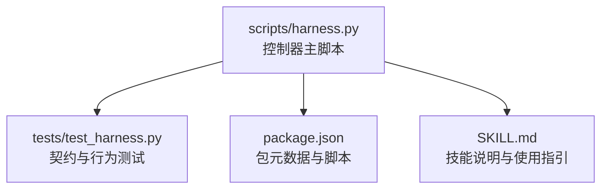
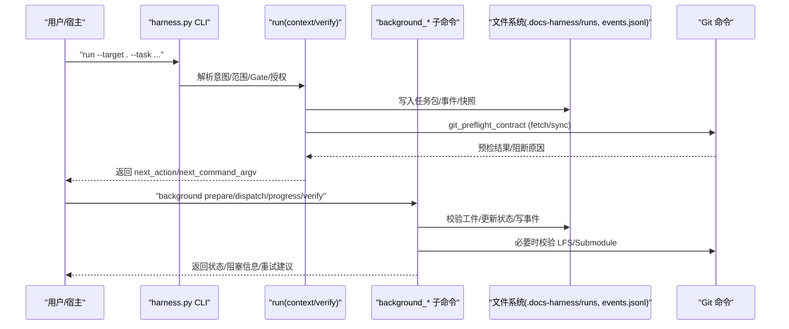
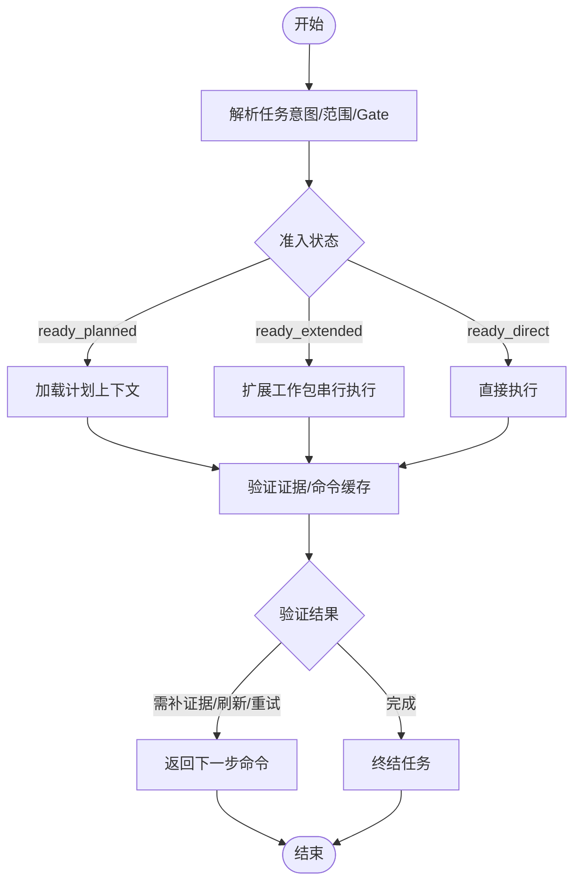
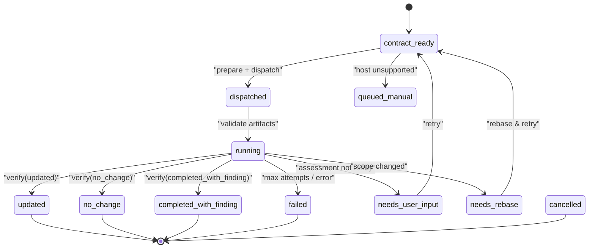
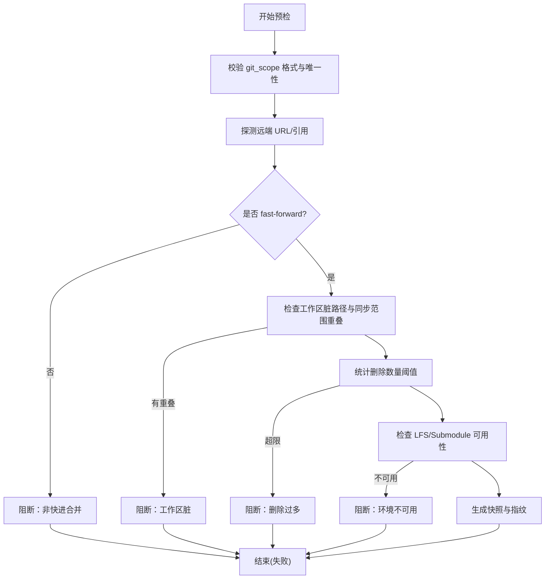
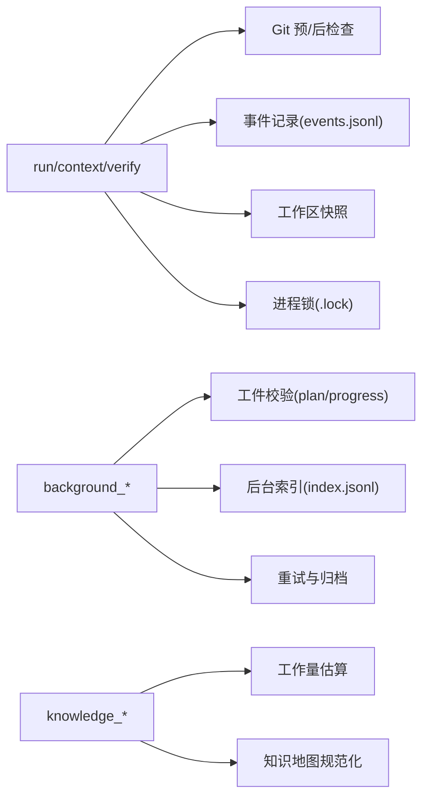

# 任务调度机制

<cite>
**本文引用的文件**   
- [scripts/harness.py](file://scripts/harness.py)
- [tests/test_harness.py](file://tests/test_harness.py)
- [package.json](file://package.json)
- [SKILL.md](file://SKILL.md)
</cite>

## 目录
1. [简介](#简介)
2. [项目结构](#项目结构)
3. [核心组件](#核心组件)
4. [架构总览](#架构总览)
5. [详细组件分析](#详细组件分析)
6. [依赖关系分析](#依赖关系分析)
7. [性能考虑](#性能考虑)
8. [故障排查指南](#故障排查指南)
9. [结论](#结论)
10. [附录](#附录)

## 简介
本文件面向 Docs Harness 的任务调度机制，系统性阐述串行与并行执行原理、任务队列管理、执行顺序控制、资源分配策略、任务依赖解析算法、执行环境隔离、调度器配置项（最大并发、超时、资源限制）、监控接口与调试工具使用方法，并给出调度流程图与性能调优最佳实践。内容基于仓库中的控制器实现与测试用例进行归纳总结，确保读者既能把握整体设计，也能定位到具体实现位置。

## 项目结构
- scripts/harness.py：Docs Harness 独立控制器主脚本，包含任务生命周期、后台 Job、知识治理、Git 预/后检查、事件记录、工作区快照、锁与幂等性、CLI 命令路由等核心逻辑。
- tests/test_harness.py：覆盖 run/context/verify/background/knowledge 等关键路径的契约与行为测试，用于验证准入、范围、Gate、Git 操作约束、后台 Job 状态机与验收流程。
- package.json：包元数据与脚本入口，定义测试与自检命令。
- SKILL.md：技能说明，描述安装、任务入口、后台治理、质量账本、按需读取等高层使用方式。

**图表来源** 
- [scripts/harness.py](file://scripts/harness.py)
- [tests/test_harness.py](file://tests/test_harness.py)
- [package.json](file://package.json)
- [SKILL.md](file://SKILL.md)

**章节来源**
- [scripts/harness.py](file://scripts/harness.py)
- [tests/test_harness.py](file://tests/test_harness.py)
- [package.json](file://package.json)
- [SKILL.md](file://SKILL.md)

## 核心组件
- 任务生命周期与状态机：run/context/verify 三阶段，支持直接执行、计划后执行、扩展工作包执行；失败关闭与幂等复用。
- 后台 Job 调度：background_direct、background_goal、background_goal_phased 三种路线，严格的状态机转换、工件校验、进度持久化与重试策略。
- Git 预/后检查：git_fetch/git_sync 的预检合同与后置校验，保证远端目标不变、引用范围受控、LFS/Submodule 可用。
- 事件与审计：events.jsonl 追加式事件日志，统计上下文加载次数、证据轮次、业务动作计数等。
- 工作区快照与变更检测：按 Git 或回退遍历构建指纹，过滤忽略目录与大文件，增量对比变更集。
- 锁与并发控制：进程级 .lock 文件原子创建，避免同一任务被多进程同时更新；后台 Job 在 running 前获取知识作业锁。
- 配置与策略：verification.volatile_paths、verification.command_cache_enabled、verification.auto_attribute_in_scope 等开关影响验证与归因行为。

**章节来源**
- [scripts/harness.py:906-1006](file://scripts/harness.py#L906-L1006)
- [scripts/harness.py:1008-1071](file://scripts/harness.py#L1008-L1071)
- [scripts/harness.py:1073-1136](file://scripts/harness.py#L1073-L1136)
- [scripts/harness.py:1142-1234](file://scripts/harness.py#L1142-L1234)
- [scripts/harness.py:1279-1346](file://scripts/harness.py#L1279-L1346)
- [scripts/harness.py:7107-7141](file://scripts/harness.py#L7107-L7141)
- [scripts/harness.py:7387-7411](file://scripts/harness.py#L7387-L7411)
- [scripts/harness.py:8700-9000](file://scripts/harness.py#L8700-L9000)

## 架构总览
Docs Harness 以 CLI 为入口，通过 run/context/verify 驱动任务执行，后台 Job 由 background_* 子命令管理。Git 操作通过 preflight/postcheck 保障一致性。所有关键状态与事件落盘，保证可观测性与可恢复性。

**图表来源** 
- [scripts/harness.py:677-791](file://scripts/harness.py#L677-L791)
- [scripts/harness.py:793-876](file://scripts/harness.py#L793-L876)
- [scripts/harness.py:8644-9000](file://scripts/harness.py#L8644-L9000)
- [scripts/harness.py:936-1006](file://scripts/harness.py#L936-L1006)

**章节来源**
- [scripts/harness.py:677-876](file://scripts/harness.py#L677-L876)
- [scripts/harness.py:8644-9000](file://scripts/harness.py#L8644-L9000)
- [scripts/harness.py:936-1006](file://scripts/harness.py#L936-L1006)

## 详细组件分析

### 任务生命周期与执行顺序控制
- 三阶段模型：context（plan/action）→ verify → 完成。支持 direct/planned/extended 三类准入状态。
- 幂等复用：同一 target+任务文本+事实+初始工作区快照重复 run 时复用活动任务；已终止状态不复用。
- 执行顺序：direct 直接执行；planned 先 plan 再执行；extended 逐个工作包依次 context→begin→submit/block。
- 失败关闭：范围、授权、Gate、必要证据异常均拒绝继续。

**图表来源** 
- [scripts/harness.py:936-1006](file://scripts/harness.py#L936-L1006)
- [SKILL.md:25-56](file://SKILL.md#L25-L56)

**章节来源**
- [scripts/harness.py:936-1006](file://scripts/harness.py#L936-L1006)
- [SKILL.md:25-56](file://SKILL.md#L25-L56)

### 后台 Job 调度与依赖解析
- 执行路线：background_direct（简单有界子智能体）、background_goal（目标型，Plan/Progress 持久化）、background_goal_phased（分阶段推进）。
- 状态机：contract_ready → dispatched → running → updated/no_change/completed_with_finding/failed/cancelled/needs_user_input/needs_rebase/queued_manual。
- 依赖解析：dependency_job_ids 列表，running 前校验依赖终态；bootstrap 未就绪则等待者进入 waiting_for_bootstrap_merge。
- 工件校验：prepare 生成 plan.json/progress.json 并记录指纹；dispatched/running/verify 前复验绑定、全集、attempt、指纹漂移。
- 重试策略：max_attempts 默认上限，超过则失败；retry 归档旧工件并重置 attempt。

**图表来源** 
- [scripts/harness.py:7107-7141](file://scripts/harness.py#L7107-L7141)
- [scripts/harness.py:7387-7411](file://scripts/harness.py#L7387-L7411)
- [scripts/harness.py:8700-9000](file://scripts/harness.py#L8700-L9000)

**章节来源**
- [scripts/harness.py:7107-7141](file://scripts/harness.py#L7107-L7141)
- [scripts/harness.py:7387-7411](file://scripts/harness.py#L7387-L7411)
- [scripts/harness.py:8700-9000](file://scripts/harness.py#L8700-L9000)

### Git 预/后检查与范围约束
- 预检合同：git_fetch/git_sync 需要明确远端 refs 范围；非 fast-forward、脏工作区重叠、删除数量超限、LFS/Submodule 不可用将阻断。
- 后置校验：比较 ref 变化是否在受控命名空间内，head/index/worktree 是否一致；对 sync 场景额外校验分支无分歧、LFS/Submodule 有效性。
- 漂移处理：远端目标变化导致 reason_code=git_remote_drift；引用越界 reason_code=git_ref_scope_violation。

**图表来源** 
- [scripts/harness.py:677-791](file://scripts/harness.py#L677-L791)
- [scripts/harness.py:793-876](file://scripts/harness.py#L793-L876)

**章节来源**
- [scripts/harness.py:677-791](file://scripts/harness.py#L677-L791)
- [scripts/harness.py:793-876](file://scripts/harness.py#L793-L876)

### 执行环境隔离与资源限制
- 进程级锁：.lock 原子创建，避免同一任务被多个进程并发更新；超 5 分钟锁视为陈旧，需人工清理。
- 工作区快照：优先 Git ls-files，否则回退遍历；排除 .git/.docs-harness/node_modules/.venv 等目录；大文件仅记录 size/mtime 指纹。
- 验证临时产物：内置 volatile 目录/后缀/文件名白名单，可通过 verification.volatile_paths 追加固定根 glob 模式。
- 命令缓存：verification.command_cache_enabled 默认开启，可按需关闭；write_scope 内自动归因可通过 verification.auto_attribute_in_scope 关闭。

**章节来源**
- [scripts/harness.py:1008-1029](file://scripts/harness.py#L1008-L1029)
- [scripts/harness.py:1073-1136](file://scripts/harness.py#L1073-L1136)
- [scripts/harness.py:1142-1234](file://scripts/harness.py#L1142-L1234)
- [scripts/harness.py:1188-1214](file://scripts/harness.py#L1188-L1214)

### 调度器配置选项
- 验证相关：
  - verification.volatile_paths：追加验证期间允许产生的临时路径（必须带固定根目录的 glob，禁止越界）。
  - verification.command_cache_enabled：是否启用验证命令逐项缓存（默认开启）。
  - verification.auto_attribute_in_scope：是否对 write_scope 内未归因写入自动归因（默认开启）。
- 背景治理：
  - background_governance.document_routes：显式声明文档路由（architecture/changelog/todo/adr_root/reviews_root），非法配置不降级。
- 其他：
  - BACKGROUND_MAX_ATTEMPTS：后台 Job 最大尝试次数（默认 3）。
  - GIT_DELETION_THRESHOLD：git_sync 删除数量阈值。

**章节来源**
- [scripts/harness.py:1142-1234](file://scripts/harness.py#L1142-L1234)
- [scripts/harness.py:1279-1346](file://scripts/harness.py#L1279-L1346)
- [scripts/harness.py:95-125](file://scripts/harness.py#L95-L125)

### 监控接口与调试工具
- 事件日志：每个任务/Job 的 events.jsonl 追加式记录，包含 phase、duration_ms、reason_code、context_load_count、evidence_round_count、business_action_count 等。
- 后台索引：background/index.jsonl 记录 job_id/attempt/status/task_kind/parent_task_id/completed_at 等摘要，便于快速检索。
- CLI 命令：
  - background list/status/prepare/dispatch/progress/verify/retry/prune
  - knowledge estimate/bootstrap/update/audit/status
  - self-test：自检规则与版本一致性
- 调试要点：
  - 查看 next_action/next_command_argv 获取下一步命令。
  - 关注 reason_code 与 blockers 字段定位失败原因。
  - 使用 --json 输出结构化结果，便于自动化解析。

**章节来源**
- [scripts/harness.py:1031-1071](file://scripts/harness.py#L1031-L1071)
- [scripts/harness.py:7452-7502](file://scripts/harness.py#L7452-L7502)
- [scripts/harness.py:8644-9000](file://scripts/harness.py#L8644-L9000)
- [package.json:17-22](file://package.json#L17-L22)

## 依赖关系分析
- 控制器内部模块耦合：
  - run/context/verify 依赖 Git 预/后检查、事件记录、工作区快照、锁机制。
  - background_* 子命令依赖工件校验、状态机、索引记录、重试与归档。
  - knowledge_* 子命令依赖评估、库存扫描、地图规范化与共识。
- 外部依赖：
  - Git 命令（ls-files、rev-parse、diff、merge-base、lfs、submodule）。
  - 文件系统（原子写入、JSON/JSONL 读写、锁文件）。
- 潜在循环依赖：无直接代码级循环导入；通过函数调用链组织职责边界清晰。

**图表来源** 
- [scripts/harness.py:677-876](file://scripts/harness.py#L677-L876)
- [scripts/harness.py:7387-7411](file://scripts/harness.py#L7387-L7411)
- [scripts/harness.py:7452-7502](file://scripts/harness.py#L7452-L7502)
- [scripts/harness.py:7774-7899](file://scripts/harness.py#L7774-L7899)

**章节来源**
- [scripts/harness.py:677-876](file://scripts/harness.py#L677-L876)
- [scripts/harness.py:7387-7411](file://scripts/harness.py#L7387-L7411)
- [scripts/harness.py:7452-7502](file://scripts/harness.py#L7452-L7502)
- [scripts/harness.py:7774-7899](file://scripts/harness.py#L7774-L7899)

## 性能考虑
- 事件与索引追加写入采用 fsync，保证持久性但可能成为 I/O 瓶颈；建议在批量操作中合并写入或使用异步队列（当前实现为同步追加）。
- 工作区快照在大仓库中可能耗时；优先使用 Git ls-files，避免全量 rglob；对大文件仅记录元信息指纹。
- 验证命令缓存可减少重复执行开销；合理设置 volatile_paths 避免误判写入。
- 后台 Job 重试与工件归档会增加磁盘占用；定期 prune 清理过期 Job。
- 复杂路线（goal/phased）的工件校验与进度持久化带来 CPU/IO 开销；建议在低峰期执行 prepare/dispatch。

[本节为通用指导，无需特定文件来源]

## 故障排查指南
- 常见错误码与含义：
  - invalid_task_id：任务 ID 格式无效。
  - missing_file/invalid_json：输入文件缺失或 JSON 无效。
  - state_locked/stale_lock：任务状态被锁定或锁陈旧。
  - git_preflight_failed/git_remote_unavailable：Git 预检失败或远端不可用。
  - git_remote_drift/git_ref_scope_violation：远端漂移或引用越界。
  - invalid_background_job_transition：后台 Job 状态转换非法。
  - max_attempts_reached：达到最大重试次数。
- 排查步骤：
  - 查看 next_action/next_command_argv 获取下一步命令。
  - 检查 events.jsonl 与 index.jsonl 定位失败阶段与原因。
  - 对于 Git 操作，确认 git_scope 与远端引用正确，工作区干净且 fast-forward。
  - 对于后台 Job，确认 prepare 成功、工件指纹一致、attempt 递增。
  - 使用 self-test 验证规则与版本一致性。

**章节来源**
- [scripts/harness.py:1008-1029](file://scripts/harness.py#L1008-L1029)
- [scripts/harness.py:793-876](file://scripts/harness.py#L793-L876)
- [scripts/harness.py:8700-9000](file://scripts/harness.py#L8700-L9000)
- [package.json:17-22](file://package.json#L17-L22)

## 结论
Docs Harness 的任务调度机制以严格的准入与验证为核心，结合 Git 预/后检查、后台 Job 状态机与事件日志，实现了高可靠、可观测、可恢复的执行环境。串行与并行通过 CLI 命令与后台 Job 协同实现，依赖解析与工件校验确保执行顺序与一致性。通过合理的配置与监控，可在保证安全的前提下提升效率与稳定性。

[本节为总结，无需特定文件来源]

## 附录
- 最佳实践：
  - 明确 git_scope 与 allowed_write_scope，避免越界与漂移。
  - 合理使用 verification 配置，平衡安全性与性能。
  - 定期清理过期后台 Job，释放磁盘与索引空间。
  - 在复杂路线中使用 prepare 预生成工件，减少运行时校验开销。
  - 利用 self-test 与事件日志持续监控系统健康。

[本节为补充信息，无需特定文件来源]