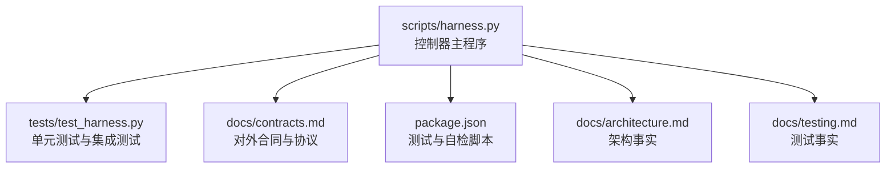
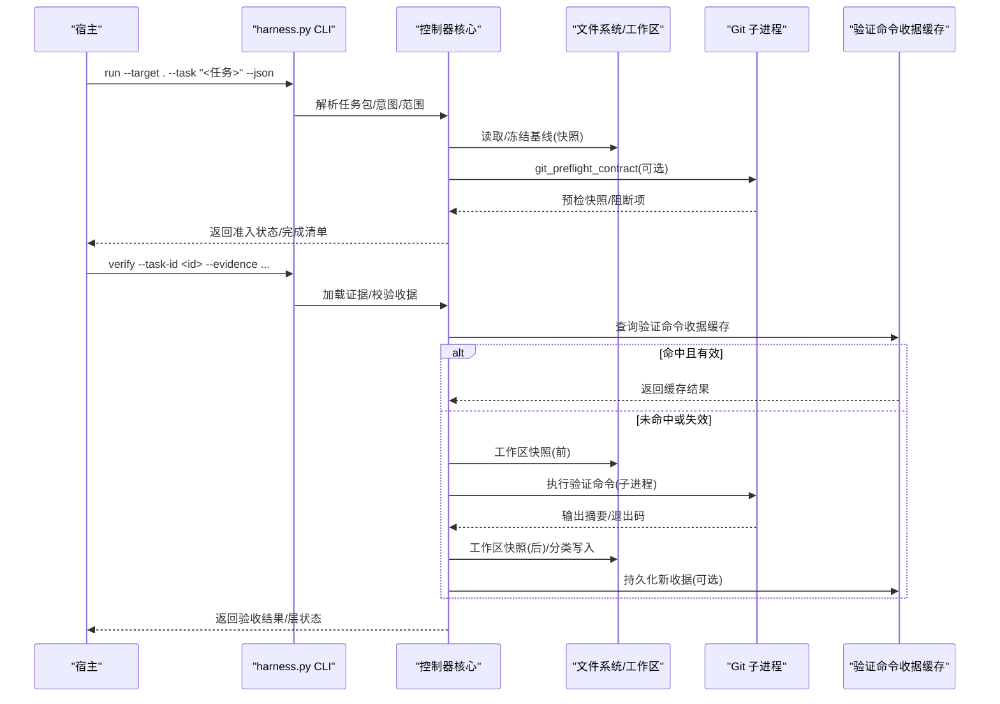
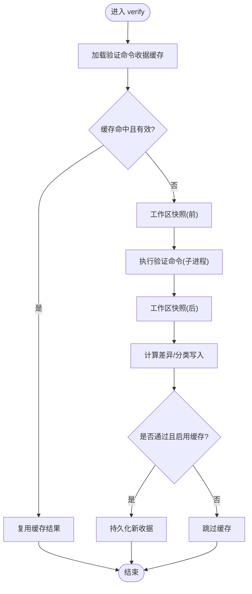
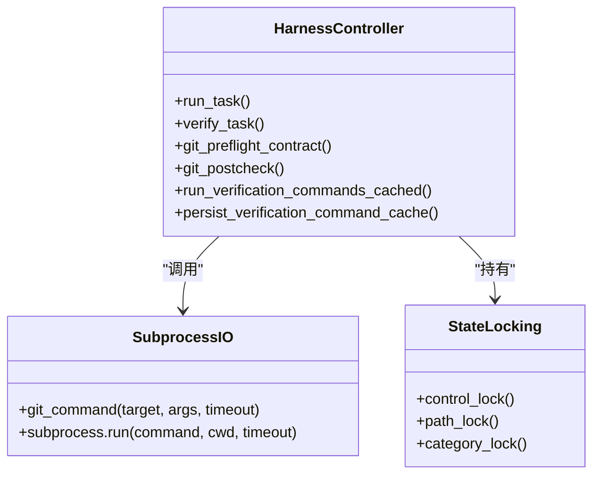
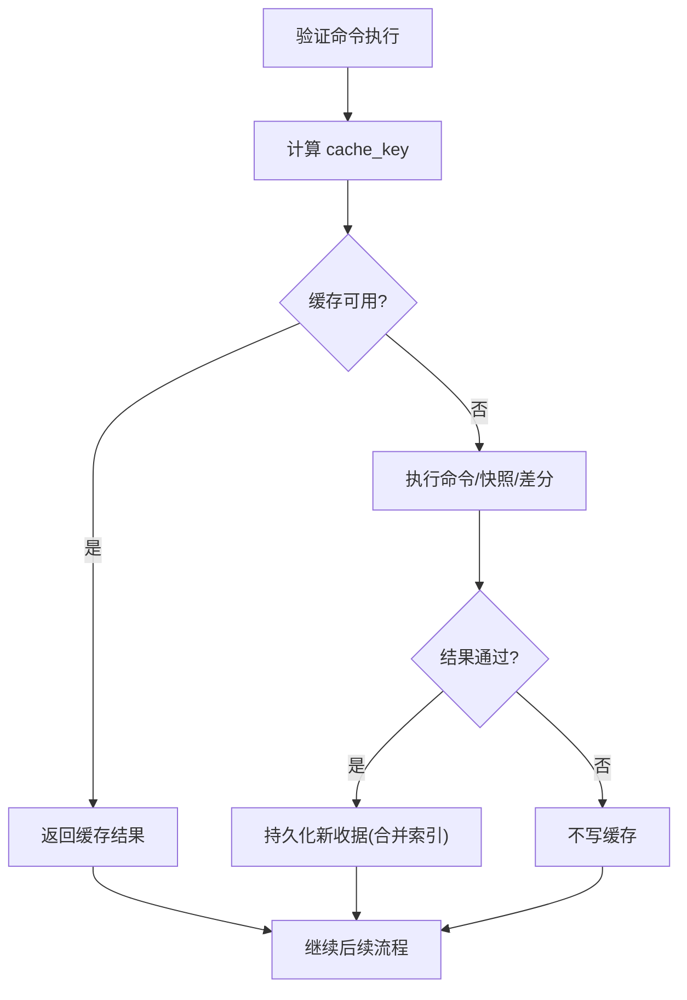
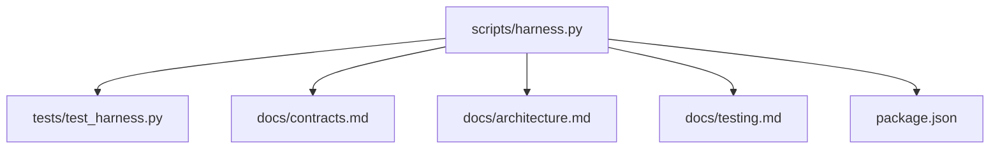

# 性能优化策略

<cite>
**本文引用的文件**   
- [scripts/harness.py](file://scripts/harness.py)
- [tests/test_harness.py](file://tests/test_harness.py)
- [package.json](file://package.json)
- [docs/contracts.md](file://docs/contracts.md)
- [docs/architecture.md](file://docs/architecture.md)
- [docs/testing.md](file://docs/testing.md)
</cite>

## 目录
1. [简介](#简介)
2. [项目结构](#项目结构)
3. [核心组件](#核心组件)
4. [架构总览](#架构总览)
5. [详细组件分析](#详细组件分析)
6. [依赖分析](#依赖分析)
7. [性能考虑](#性能考虑)
8. [故障排查指南](#故障排查指南)
9. [结论](#结论)
10. [附录](#附录)

## 简介
本文件面向 Docs Harness 的性能优化，聚焦以下主题：任务批处理机制（批量提交、内存管理与 I/O 优化）、并发控制策略（线程池管理、进程间通信与资源竞争避免）、缓存机制（结果缓存、中间状态缓存与分布式缓存集成）、性能监控与分析工具（瓶颈识别与优化建议）、性能测试方法与基准套件使用方法，以及性能调优最佳实践与常见问题解决方案。内容严格基于仓库源码与合同文档进行提炼与归纳，确保可追溯与可落地。

## 项目结构
Docs Harness 以单文件控制器为核心，配合测试与契约文档组织：
- scripts/harness.py：控制器主逻辑，包含任务准入、上下文、验收、Git 交付检查、后台 Job 状态机、验证命令执行与缓存等。
- tests/test_harness.py：覆盖安装升级、任务准入、知识生命周期、后台 Job、兼容迁移、幂等路径与 Git 交付等用例。
- package.json：定义测试与自检脚本入口。
- docs/contracts.md：对外行为与数据合同，包括 task-package/v2、证据收据、Git 状态合同、退出码等。
- docs/architecture.md：架构事实与边界说明。
- docs/testing.md：自动化入口与验收分层。

**图表来源** 
- [scripts/harness.py:1-120](file://scripts/harness.py#L1-L120)
- [package.json:17-22](file://package.json#L17-L22)
- [docs/contracts.md:1-100](file://docs/contracts.md#L1-L100)
- [docs/architecture.md:1-26](file://docs/architecture.md#L1-L26)
- [docs/testing.md:1-25](file://docs/testing.md#L1-L25)

**章节来源**
- [scripts/harness.py:1-120](file://scripts/harness.py#L1-L120)
- [package.json:17-22](file://package.json#L17-L22)
- [docs/contracts.md:1-100](file://docs/contracts.md#L1-L100)
- [docs/architecture.md:1-26](file://docs/architecture.md#L1-L26)
- [docs/testing.md:1-25](file://docs/testing.md#L1-L25)

## 核心组件
- 任务包与准入：task-package/v2 定义意图、变更面、范围与允许动作；run 支持幂等复用活动任务，减少重复上下文构建与授权。
- 验收与证据：evidence-receipt/v2 绑定任务、目标、包指纹与可信生产者；验证命令使用逐项收据缓存，命中则跳过执行。
- Git 交付检查：git_fetch/git_sync 通过 preflight/postcheck 快照与约束，保证只读或受控写入，失败关闭。
- 后台治理：background-job/v2 支持多种路线，prepare/dispatched/running/progress/verify 状态机，复杂路线需宿主桥接。
- 配置开关：verification.command_cache_enabled、verification.auto_attribute_in_scope 等影响验证与归因行为。

**章节来源**
- [docs/contracts.md:1-220](file://docs/contracts.md#L1-L220)
- [scripts/harness.py:1190-1217](file://scripts/harness.py#L1190-L1217)

## 架构总览
Docs Harness 的运行时由 CLI 驱动，围绕“任务包—上下文—证据—验收”的主循环展开，Git 与外部系统作为受控扩展点，后台 Job 与质量账本为辅助面。

**图表来源** 
- [scripts/harness.py:5910-6109](file://scripts/harness.py#L5910-L6109)
- [scripts/harness.py:575-600](file://scripts/harness.py#L575-L600)
- [docs/contracts.md:165-220](file://docs/contracts.md#L165-L220)

## 详细组件分析

### 任务批处理机制（批量提交、内存管理与 I/O 优化）
- 幂等复用：同一 target、任务文本、事实与工作区快照命中活动任务时直接复用，避免重复建立上下文与授权，降低启动与 I/O 开销。
- 事件脱敏与有界字段：事件仅保存 phase/duration_ms/reason_code/package_revision/context_cache_hit/context_load_count/readmission_count/evidence_round_count/host_receipt_count/business_action_count，避免大对象落盘与序列化成本。
- 原子写入与顺序追加：atomic_write_text/append_jsonl 使用临时文件+fsync+替换，保障一致性并减少锁竞争；JSONL 追加适合高吞吐日志记录。
- 工作区快照差分：workspace_snapshot/snapshot_changes 用于前后对比，仅对差异部分处理，降低全量比较成本。
- 验证命令逐项缓存：按 cache_key 命中即跳过执行，显著减少重复命令运行与 I/O。

**图表来源** 
- [scripts/harness.py:5962-6071](file://scripts/harness.py#L5962-L6071)
- [scripts/harness.py:6074-6083](file://scripts/harness.py#L6074-L6083)

**章节来源**
- [scripts/harness.py:5910-6109](file://scripts/harness.py#L5910-L6109)
- [scripts/harness.py:1190-1217](file://scripts/harness.py#L1190-L1217)
- [docs/contracts.md:283-301](file://docs/contracts.md#L283-L301)

### 并发控制策略（线程池管理、进程间通信与资源竞争避免）
- 进程模型：所有外部交互（如 Git、验证命令）通过 subprocess.run 同步调用，超时保护（默认 20s/120s），避免阻塞与资源泄漏。
- 锁与状态机：后台 Job 的控制锁先于业务锁获取，prepare/dispatch/verify 在同一控制锁下重读更新，防止竞态。
- 资源竞争避免：
  - Git 操作限定在受控 refs 命名空间，禁止越界 ref 修改。
  - 脏工作区与 sync 范围重叠检测、非 fast-forward 阻断、删除阈值限制。
  - LFS/Submodule 可用性预检，不可用时失败关闭。
- 线程池：当前实现未引入多线程/线程池，采用单进程串行执行，简化一致性与锁复杂度；如需并行，应在隔离子进程内执行并聚合结果。

**图表来源** 
- [scripts/harness.py:575-600](file://scripts/harness.py#L575-L600)
- [scripts/harness.py:5962-6071](file://scripts/harness.py#L5962-L6071)
- [docs/architecture.md:12-18](file://docs/architecture.md#L12-L18)

**章节来源**
- [scripts/harness.py:575-600](file://scripts/harness.py#L575-L600)
- [scripts/harness.py:5962-6071](file://scripts/harness.py#L5962-L6071)
- [docs/architecture.md:12-18](file://docs/architecture.md#L12-L18)

### 缓存机制（结果缓存、中间状态缓存与分布式缓存集成）
- 验证命令收据缓存：按 cache_key（任务 ID、目标指纹、命令摘要、cwd、输入指纹、合同摘要）命中，TTL=3600s，支持整体开关 verification.command_cache_enabled。
- 上下文与授权收据：context-receipt/v2 与 authorization-receipt/v2 跨阶段复用，避免重复加载规则与事实正文。
- 中间状态缓存：事件与 JSONL 追加记录，便于增量消费；任务包 revision 变化生成 contract_delta，避免重复方案编译。
- 分布式缓存集成：当前实现为本地文件缓存；若需分布式，可在 persist_verification_command_cache 中替换为远程存储（如 Redis/S3），保持 key 语义不变。

**图表来源** 
- [scripts/harness.py:5913-5933](file://scripts/harness.py#L5913-L5933)
- [scripts/harness.py:5936-5960](file://scripts/harness.py#L5936-L5960)
- [scripts/harness.py:6074-6083](file://scripts/harness.py#L6074-L6083)

**章节来源**
- [scripts/harness.py:1190-1217](file://scripts/harness.py#L1190-L1217)
- [scripts/harness.py:5910-6109](file://scripts/harness.py#L5910-L6109)
- [docs/contracts.md:222-234](file://docs/contracts.md#L222-L234)

### 性能监控与分析工具（瓶颈识别与优化建议）
- 效率事件字段：phase/duration_ms/reason_code/context_cache_hit/context_load_count/readmission_count/evidence_round_count/host_receipt_count/business_action_count，可用于定位慢阶段与热点。
- 退出码与原因码：统一退出码与结构化 reason_code，便于上层监控告警与统计。
- 建议指标：
  - 验证命令命中率与平均耗时
  - Git 预检/后检失败率与阻断原因分布
  - 上下文加载次数与缓存命中率
  - 事件写入吞吐与大小
- 分析方法：基于 events.jsonl 聚合统计，结合 duration_ms 与 reason_code 定位瓶颈；对低命中率场景优化输入指纹或扩大缓存粒度。

**章节来源**
- [docs/contracts.md:283-301](file://docs/contracts.md#L283-L301)
- [docs/contracts.md:361-372](file://docs/contracts.md#L361-L372)

### 性能测试方法与基准套件使用方法
- 完整回归：npm test（Python unittest discover）。
- 控制器自检：npm run self-test（harness self-test）。
- 发布包检查：npm run pack:check。
- 专项覆盖：init/upgrade、任务准入、知识生命周期、后台 Job、兼容迁移、幂等路径、Git 交付与 fresh clone 等。
- 基准建议：
  - 构造多任务并发 verify 场景，统计缓存命中率与端到端延迟。
  - 模拟大仓库 diff 与大量验证命令，评估快照与差分开销。
  - 注入失败与超时用例，验证超时保护与错误收敛。

**章节来源**
- [package.json:17-22](file://package.json#L17-L22)
- [docs/testing.md:1-25](file://docs/testing.md#L1-L25)
- [tests/test_harness.py:1-120](file://tests/test_harness.py#L1-L120)

## 依赖分析
- 模块耦合：harness.py 集中实现控制器逻辑，tests/test_harness.py 通过 importlib 动态加载模块执行用例；package.json 提供脚本入口。
- 外部依赖：Git 子进程、文件系统、JSON/JSONL 读写、时间与时区、哈希与正则。
- 潜在循环依赖：无显式循环导入；控制器内部函数按职责划分清晰。
- 接口契约：contracts.md 定义对外数据结构与行为，确保上下游稳定。

**图表来源** 
- [scripts/harness.py:1-120](file://scripts/harness.py#L1-L120)
- [tests/test_harness.py:1-120](file://tests/test_harness.py#L1-L120)
- [docs/contracts.md:1-100](file://docs/contracts.md#L1-L100)
- [docs/architecture.md:1-26](file://docs/architecture.md#L1-L26)
- [docs/testing.md:1-25](file://docs/testing.md#L1-L25)
- [package.json:17-22](file://package.json#L17-L22)

**章节来源**
- [scripts/harness.py:1-120](file://scripts/harness.py#L1-L120)
- [tests/test_harness.py:1-120](file://tests/test_harness.py#L1-L120)
- [docs/contracts.md:1-100](file://docs/contracts.md#L1-L100)
- [docs/architecture.md:1-26](file://docs/architecture.md#L1-L26)
- [docs/testing.md:1-25](file://docs/testing.md#L1-L25)
- [package.json:17-22](file://package.json#L17-L22)

## 性能考虑
- 批处理与幂等：优先利用任务幂等复用与验证命令缓存，减少重复工作。
- I/O 优化：使用原子写入与 JSONL 追加，避免频繁小文件写入；工作区快照差分仅处理差异。
- 并发与锁：保持单进程串行，必要时在子进程内并行执行并聚合结果；严格控制锁粒度与顺序。
- 缓存策略：合理设置 TTL 与缓存键粒度，避免误命中；对高频命令开启缓存，低频命令可关闭以提升准确性。
- 监控与度量：基于事件字段统计耗时与命中率，持续优化瓶颈环节。

[本节为通用指导，无需特定文件引用]

## 故障排查指南
- Git 相关：
  - 远端漂移：重新准入，继承已冻结方案字段，避免重复交方案。
  - 脏工作区/非 fast-forward/删除过多/LFS/Submodule 不可用：预检阻断，修复后再试。
- 验证命令：
  - 超时/失败：检查命令参数与依赖环境；查看 unexpected_write_set 与 volatile_write_set。
  - 缓存失效：确认输入指纹与合同摘要未变化；必要时关闭缓存开关。
- 证据与收据：
  - 过期/跨任务/不可信生产者：按 v2 规范修正；高风险证据必须来自可信生产者。
  - 自动归因：write_scope 内未归因写入默认自动认领，可通过配置恢复补证据流程。

**章节来源**
- [docs/contracts.md:97-163](file://docs/contracts.md#L97-L163)
- [scripts/harness.py:5962-6071](file://scripts/harness.py#L5962-L6071)
- [scripts/harness.py:1190-1217](file://scripts/harness.py#L1190-L1217)

## 结论
Docs Harness 通过幂等任务复用、验证命令收据缓存、原子 I/O 与有界事件记录，构建了高效可控的执行框架。建议在大规模场景中充分利用缓存与幂等特性，结合事件指标持续优化瓶颈环节；在需要并发时谨慎引入子进程并行，并保持锁与状态机的一致性。

[本节为总结性内容，无需特定文件引用]

## 附录
- 常用命令与脚本：
  - npm test：完整回归测试
  - npm run self-test：控制器自检
  - npm run pack:check：发布包清单检查
- 关键配置项：
  - verification.command_cache_enabled：整体关闭验证命令缓存
  - verification.auto_attribute_in_scope：关闭 write_scope 内自动归因

**章节来源**
- [package.json:17-22](file://package.json#L17-L22)
- [scripts/harness.py:1190-1217](file://scripts/harness.py#L1190-L1217)